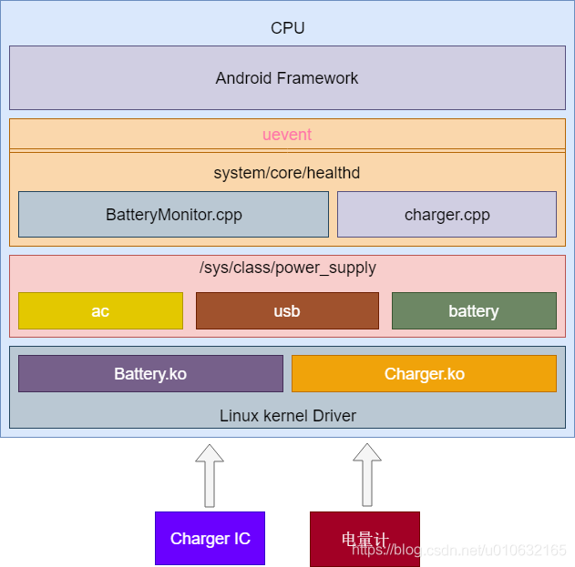
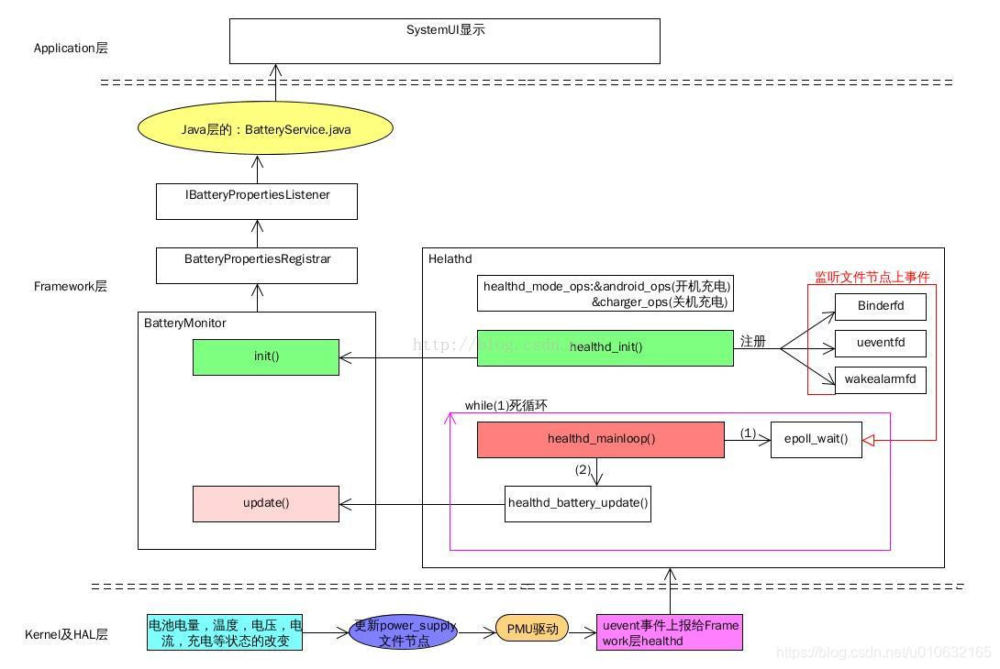

# 概述

高通A6650 healthd 守护进程分析。 

Android 9 引入了从 health@1.0 HAL 升级的主要版本 android.hardware.health HAL 2.0。这一新 HAL 具有以下优势：

* 框架代码和供应商代码之间的区别更清楚。
* 弃用了不必要的 healthd 守护程序。
* 供应商对运行状况信息报告进行自定义的自由度更高。
* 更多设备运行状况信息（不仅包括电池信息）。

Android 11 包含 android.hardware.health HAL 2.1，这是一个从 health@2.0 HAL 升级的次要版本。这一新 HAL 具有以下优势：

* 更易于实现
* 更好地与现有 2.0 HAL API 保持一致
* 在关机模式充电代码中可以实现更好的 Treble 分离
* 更好地支持框架来指示设备的电池运行状况

# 参考

* [Android 运行状况](https://source.android.com/devices/tech/health?hl=zh-cn)
* [Android 电池管理系统架构总结 Android power and battery management architecture summaries](https://blog.csdn.net/u010632165/article/details/88651035)
* [Android Uevent 分析，从kernel到framework](https://blog.csdn.net/dfysy/article/details/7330919)

# 架构



可以看到文件比较多，主要是通过BatteryMonitor.cpp中的bool BatteryMonitor::update(void)函数上报信息，其中，内核首先会更新数据到/sys/class/power_supply/battery节点下各个属性，这个在上一个小节有做解释，先来看一下整体的架构，后面再来深入到代码中去分析；具体图片（该图片来自互联网，因为被转载较多，已经不知道出处），具体的流程整理的很清楚，如下所示；


这幅图片再一次把整体的数据走向具体化，可以看到主要负责工作的是BatteryMonitor，主要分析一下该文件中的init和update就可以搞清楚大部分的问题。

# 术语

* health@1.0：android.hardware.health@1.0 的缩写。指的是 Android 8.0 中发布的运行状况 HIDL 的 1.0 版 HAL。
* health@2.0：android.hardware.health@2.0 的缩写。指的是 Android 9 中发布的运行状况 HIDL 的 2.0 版 HAL。
* health@2.1：android.hardware.health@2.1 的缩写。指的是 Android 11 中发布的运行状况 HIDL 的 2.1 版 HAL。
* charger：在关机模式充电过程中运行的可执行文件，用于显示手机充电动画。
* recovery：在恢复模式下运行的可执行文件，必须检索电池信息。
* healthd：在 Android 中运行的旧版守护进程，用于检索与运行状况相关的信息并将其提供给框架。
* storaged：在 Android 中运行的守护进程，用于检索存储信息并将其提供给框架。

# 编译文件

```log
./vendor/lib64/hw/android.hardware.health@2.0-impl-2.1-qti.so
./vendor/lib64/libsystem_health_mon.so
./vendor/etc/vintf/manifest/android.hardware.health@2.1.xml
./vendor/etc/init/android.hardware.health@2.1-service.rc
./vendor/bin/hw/android.hardware.health@2.1-service
```