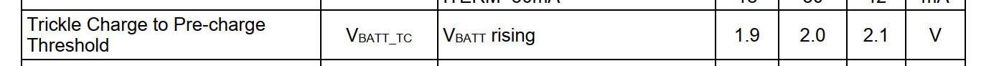
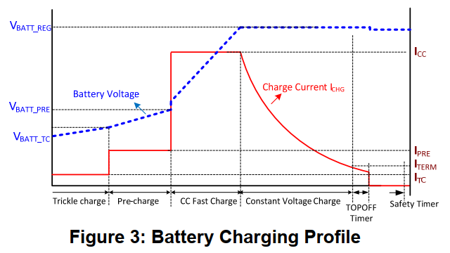
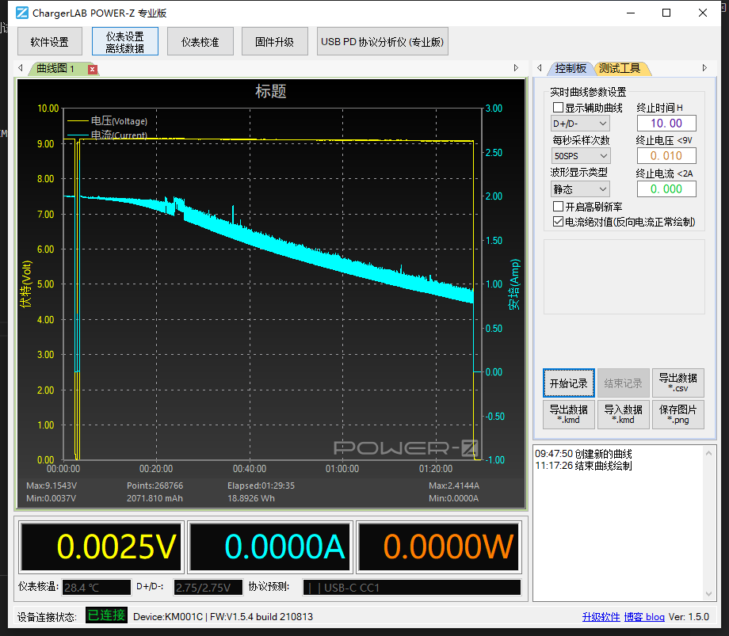
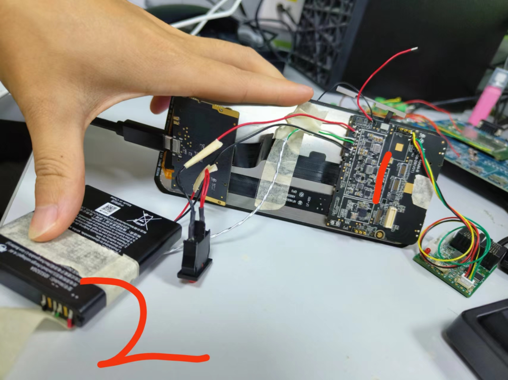
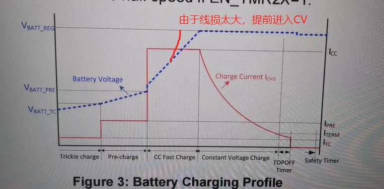
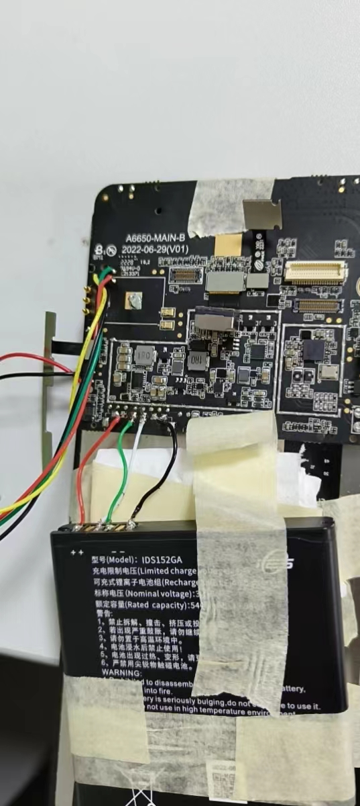
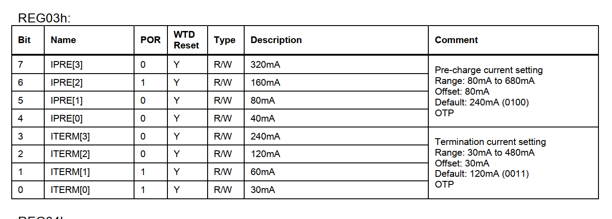

# 概述

目前battery电量计已经调试完成，对充电进行一次测试

# 参考

* [充电太快进入CV阶段](/docs/0020_battery_gauge/docs/refers/充电太快进入CV阶段)

# 实验条件

* 目前电池容量5400mah，ICC设置的4080ma,IIN_LIM设置的2000ma ,VBATT满充设置的4.35v，温度正常。

| Col1 | Col2 |
| --- | --- |
| 电池容量 | 5400mah  |
| AICR | 2000ma |
| ICHG | 4080ma  |

# 充电阶段回顾

* trickle charger：涓流阶段，Trickle Charge to Pre-charge Threshold目前设置的是2v

* Pre-Charger：预充阶段，可以通过设置02寄存器VPRE位调节，目前是设置的3v。
* CC-Fast-Charger：恒流阶段，此阶段电流达到最大ICC设定，vbat要小于cv值，这里vbat指的是charger IC端的vbat，实际电量计检测到的vbat可能没有charger端的大，因为存在线损。目前cv设置的是4.35v，为了提高速度，将95%前设置为4.375v。
* Constant-Voltage-Charger：恒压阶段，当charger IC检测到vbat电压大于等于CV值时进入此阶段，此时充电电流会慢慢变小，直到截止电流。
* Top-Off-Mode:截止阶段，充电电流降低到Iterm(目前是120ma)，充电截止。
* Re-Chager-Status：回充，当电压降低到回充点，目前设置的是200mv，也就是4.15v则回充。
* Save-Time-Status：安全充电时间，目前设置的是15小时。



# 实验现象

## 降流过快

9v2a从空电开始充，20分钟就开始降流了，现象如下：



* 分析过程
  * 刚开始怀疑是pd或者电池端限流了，问了他们都不会限流。
  * 询问charger fae，答复这看起开是恒压充电阶段，量取电池端电压4.32v，符合猜想。
  * 硬件fae回复：降低电流时，VBAT电压是多少V，可以通过电池电压初步判断一下，如果电池完全没电，20分钟是无法充到CV的，要不就是线损耗比较大，电池没到4.35V，芯片脚位已经堵到4.35V了，比如，充电4A，如果电池包内100mR，那么电池端3.95V，充电芯片端就是4.35V，芯片就会降低充电电流。

貌似是这么个情况，量取电池端和板子端的电压，如图，发现板子端是4.3v，电池量的是4.15v，而电量计读出来4.1v，也就是说线损分压了0.2v。


这样造成一种情况就是charger过快的测量到vbat为4.35v进入恒压阶段，如下图：


## 第二次改短电池连接线

充电参数如下：
```C++
term-current = <240>; //截止电流
max-topoff-time = <45>;                 /* Timer to stop charging after charge termination, Default:Disabled minutes*/
```

* 开始充到电量100%时间为140分钟
* 100%到`charge done(CHARGE TERMINATION)`时间45分钟，感觉还是长了点
* `charge done`到电池充电电流为0时间为45分钟,和`dts`中定义的相符
```log
开始：
[  351.747597] Battery: [ status:Charging, health:Good, present:1, tech:Li-ion, capcity:7,cap_rm:331 mah, vol:3967 mv, temp:32, curr:3343 ma, ui_soc:6, notify_code: 0 ]

Termination current显示100%：
[ 8748.545262] Battery: [ status:Charging, health:Good, present:1, tech:Li-ion, capcity:100,cap_rm:5152 mah, vol:4329 mv, temp:31, curr:301 ma, ui_soc:97, notify_code: 0 ]

2分钟后，ui_soc = 100%:
[ 8871.454856] Battery: [ status:Charging, health:Good, present:1, tech:Li-ion, capcity:100,cap_rm:5169 mah, vol:4328 mv, temp:31, curr:301 ma, ui_soc:100, notify_code: 0 ]

charge done(CHARGE TERMINATION)： Termination current = 240ma
[11491.629258] POWER_SUPPLY_STATUS_FULL soc = 100
[11491.651874] Battery: [ status:Full, health:Good, present:1, tech:Li-ion, capcity:100,cap_rm:5169 mah, vol:4335 mv, temp:29, curr:140 ma, ui_soc:100, notify_code: 0 ]

电池充电电流为0：
[14212.602262] Battery: [ status:Full, health:Good, present:1, tech:Li-ion, capcity:100,cap_rm:5169 mah, vol:4333 mv, temp:29, curr:0 ma, ui_soc:100, notify_code: 0 ]
```
有个疑问，我设置的`Termination current = 240ma`，为什么电量计检测到140ma，状态才变成`charge done`？
可能原因：连接电池的那条线长了，太长了不是降压么，怎么影响到电流检测？说不通


原因：
代码写寄存器有问题：
```log
console:/sys/class/chg_info/mp2721 # cat registers
Charger IC:
Reg[0x00] = 0x0b
Reg[0x01] = 0x13
Reg[0x02] = 0xf3
Reg[0x03] = 0xf4
```
可以看到
03h=f4=1111 0100
120+30=150ma，刚好和140ma对的上，代码写错了！

