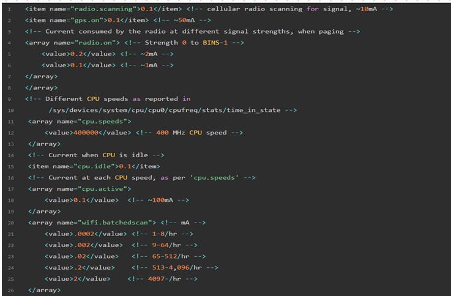
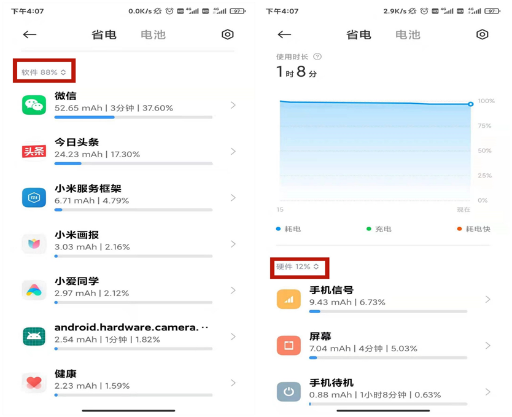
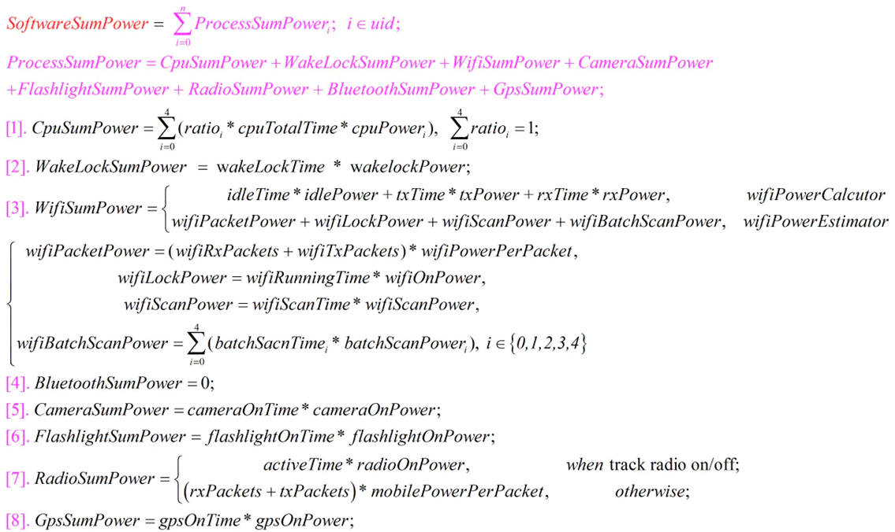
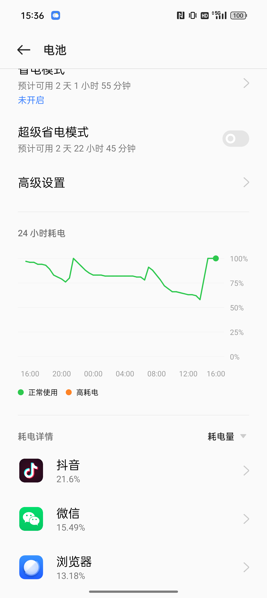

# 概述

介绍Android耗电统计服务BatteryStats。

Android 中关于耗电的统计一般是关于功耗分析的重要信息，Bettery-historian工具也是依托于解析BatteryStats 的dump 信息来提供界面直观分析，并且电池电量耗费的源头实在太多，基本Android 设备上任何一个活动都会引起电池电量的消耗，Android 在统计电量上也在不断完善，不断的在更新，具体化耗电详情。耗电名单在主要记录在BatterySipper里面，虽然在源码中他并没有集成在service 端，实在frameworks/base/core 下，但是谷歌开放sdk 中并没有公开电量统计的API 或者文档，但是并不代表没有，因为安全中心->省电优化→耗电排行 中就是通过app 能显示出耗电详情排行，所以我们将从这个入口开始分析Android 是如何记录设备电池的耗电详情信息的。

# 参考

* [MTK手机功耗统计及调试技巧分享.pptx](refers/MTK手机功耗统计及调试技巧分享.pptx)
* [【原创】Android 耗电信息统计服务——BatteryStats源码分析（一）](https://blog.csdn.net/u011311586/article/details/79044176)

# 实现原理

* 所有的电池耗电信息相关计算都是在BatteryStatsImpl 中实现的，该类继承自BatteryStats，并且实现了BatteryStats 中定义的所有的抽象类以及计算方法。
* 解析power_profile.xml各项硬件功耗数据 ，将该配置文件中的各项耗电功率读取出来，设置到电量统计计算类BatteryStatsImpl。

power_profile.xml文件位于源码下的 /framework/base/core/res/res/xml/power_profile.xml，部分内容展示如下： 

OEM厂商应该有自己的power_profile.xml，因为部件（如：cpu, wifi…）耗电量应与具体硬件相关，这个只有OEM厂商清楚。

字段含义见：

* [《Power Profiles for Android》](https://source.android.com/devices/tech/power/values)

# 显示方式

BatteryStatsHelper : 是BatteryStatsImpl 计算的一个辅助类，主要是提供给应用（比如设置，安全中心，360等）来展示耗电信息，这里面的定义了软件类和硬件耗电信息的计算：

## 软件功耗统计：processAppUsage()  

在 BatteryStatsHelper.java 中，有这么一个方法：

* processAppUsage()方法中，一个应用的总功耗在这里体现出来了：
  * cpu
  * Wakelock(保持唤醒锁)
  * 无线电(2G/3G/4G)
  * WIFI
  * 蓝牙
  * 传感器
  * 相机
  * 闪光灯

  计算公式：

## 硬件功耗统计：processMiscUsage()

硬件功耗计算函数在：processMiscUsage()：

硬件的总公式是：`PowerMah = user_power + phonePower + screenPower + wifiPowerMah + bluetoohPower + memoryPower + idlePower + mobileRadioPower`

# 总结

（1）Android部件电流信息存于：power_profile.xml
（2）每个OEM厂商有私有power_profile.xml
（3）软件/硬件计算方法集成于核心类BatteryStatsImpl 
（4）耗电量信息保存于/data/system/ batterystats.bin 

# 其他手机厂商定制

某些手机厂家只针对软件app耗电进行统计，也许这种数据用户更加关心：

