# 概述

介绍Android耗电统计使用的参数是如何测量的。

# 参考

* [Power_Profile_for_Android.pptx](refers/Power_Profile_for_Android.pptx)
* [测量电量值](https://source.android.com/devices/tech/power/values)

# 文件位置
* `vendor/mediatek/proprietary/packages/overlay/vendor/FrameworkResOverlay/power/res/xml/power_profile.xml`:

```
<device name="Android">
  <!-- Most values are the incremental current used by a feature,
       in mA (measured at nominal voltage).
       The default values are deliberately incorrect dummy values.
       OEM's must measure and provide actual values before
       shipping a device.
       Example real-world values are given in comments, but they
       are totally dependent on the platform and can vary
       significantly, so should be measured on the shipping platform
       with a power meter. -->
  <item name="ambient.on">0.1</item>  <!-- ~100mA -->
  <item name="screen.on">0.1</item>  <!-- ~100mA -->
  <item name="screen.full">0.1</item>  <!-- ~100mA -->
  <item name="bluetooth.active">0.1</item> <!-- Bluetooth data transfer, ~10mA -->
  <item name="bluetooth.on">0.1</item>  <!-- Bluetooth on & connectable, but not connected, ~0.1mA -->
  <item name="wifi.on">0.1</item>  <!-- ~3mA -->
  <item name="wifi.active">0.1</item>  <!-- WIFI data transfer, ~200mA -->
  <item name="wifi.scan">0.1</item>  <!-- WIFI network scanning, ~100mA -->
  <item name="audio">0.1</item> <!-- ~10mA -->
  <item name="video">0.1</item> <!-- ~50mA -->
  <item name="camera.flashlight">0.1</item> <!-- Avg. power for camera flash, ~160mA -->
  <item name="camera.avg">0.1</item> <!-- Avg. power use of camera in standard usecases, ~550mA -->
  <item name="gps.on">0.1</item> <!-- ~50mA -->

  <!-- Radio related values. For modems without energy reporting support in firmware, use
       radio.active, radio.scanning, and radio.on. -->
  <item name="radio.active">0.1</item> <!-- ~200mA -->
  <item name="radio.scanning">0.1</item> <!-- cellular radio scanning for signal, ~10mA -->
  <!-- Current consumed by the radio at different signal strengths, when paging -->
  <array name="radio.on"> <!-- Strength 0 to BINS-1 -->
      <value>0.2</value> <!-- ~2mA -->
      <value>0.1</value> <!-- ~1mA -->
  </array>

  <!-- A list of heterogeneous CPU clusters, where the value for each cluster represents the
       number of CPU cores for that cluster.

       Ex:
       <array name="cpu.clusters.cores">
         <value>4</value> // cluster 0 has cpu0, cpu1, cpu2, cpu3
         <value>2</value> // cluster 1 has cpu4, cpu5
       </array> -->
  <array name="cpu.clusters.cores">
      <value>4</value> <!-- cluster 0 has 4 cores -->
      <value>4</value> <!-- cluster 1 has 4 cores -->
  </array>

    <!-- Different CPU speeds for cluster 0 as reported in
       /sys/devices/system/cpu/cpu0/cpufreq/stats/time_in_state.

       There must be one of these for each cluster, labeled:
       cpu.speeds.cluster0, cpu.speeds.cluster1, etc... -->
  <array name="cpu.speeds.cluster0">
      <value>400000</value> <!-- 400 MHz CPU speed -->
  </array>

  <!-- Current at each CPU speed for cluster 0, as per 'cpu.speeds.cluster0'.
       Like cpu.speeds.cluster0, there must be one of these present for
       each heterogeneous CPU cluster. -->
  <array name="cpu.active.cluster0">
      <value>0.1</value>  <!-- ~100mA -->
  </array>

  <!-- Current when CPU is idle -->
  <item name="cpu.idle">1.11</item>
  <!-- Power consumption when CPU is suspended -->
  <item name="cpu.suspend">5</item>
  <!-- Additional power consumption by CPU excluding cluster and core when  running -->
  <item name="cpu.active">2.55</item>.

  <!-- Additional power consumption by CPU cluster0 itself when running excluding cores in it -->
  <item name="cpu.cluster_power.cluster0">2.11</item>
  <!-- Additional power consumption by CPU cluster1 itself when running excluding cores in it -->
  <item name="cpu.cluster_power.cluster1">2.22</item>

  <!-- Different CPU speeds as reported in
       /sys/devices/system/cpu/cpu0/cpufreq/stats/scaling_available_frequencies -->
  <array name="cpu.core_speeds.cluster0">
      <value>300000</value> <!-- 300 MHz CPU speed -->
      <value>1000000</value> <!-- 1000 MHz CPU speed -->
      <value>2000000</value> <!-- 2000 MHz CPU speed -->
  </array>
  <!-- Different CPU speeds as reported in
       /sys/devices/system/cpu/cpu4/cpufreq/stats/scaling_available_frequencies -->
  <array name="cpu.core_speeds.cluster1">
      <value>300000</value> <!-- 300 MHz CPU speed -->
      <value>1000000</value> <!-- 1000 MHz CPU speed -->
      <value>2500000</value> <!-- 2500 MHz CPU speed -->
      <value>3000000</value> <!-- 3000 MHz CPU speed -->
  </array>

  <!-- Additional power used by a CPU from cluster 0 when running at different
       speeds. Currently this measurement also includes cluster cost. -->
  <array name="cpu.core_power.cluster0">
      <value>10</value> <!-- 300 MHz CPU speed -->
      <value>20</value> <!-- 1000 MHz CPU speed -->
      <value>30</value> <!-- 1900 MHz CPU speed -->
  </array>
  <!-- Additional power used by a CPU from cluster 1 when running at different
       speeds. Currently this measurement also includes cluster cost. -->
  <array name="cpu.core_power.cluster1">
      <value>25</value> <!-- 300 MHz CPU speed -->
      <value>35</value> <!-- 1000 MHz CPU speed -->
      <value>50</value> <!-- 2500 MHz CPU speed -->
      <value>60</value> <!-- 3000 MHz CPU speed -->
  </array>

  <!-- Memory bandwidth power values in mA at the rail. There must be one value
       for each bucket defined in the device tree. -->
  <array name="memory.bandwidths">
    <value>22.7</value> <!-- mA for bucket: 100mb/s-1.5 GB/s memory bandwidth -->
  </array>

  <!-- This is the battery capacity in mAh (measured at nominal voltage) -->
  <item name="battery.capacity">3000</item>
  <!-- M50 battery capacity. -->  
  <item name="m50.battery.capacity">3020</item>
  <!-- M8 battery capacity. -->
  <item name="m8.battery.capacity">6300</item>

  <!-- Wifi related values. -->
  <!-- Idle Receive current for wifi radio in mA. 0 by default-->
  <item name="wifi.controller.idle">0</item>
  <!-- Rx current for wifi radio in mA. 0 by default-->
  <item name="wifi.controller.rx">0</item>
  <!-- Tx current for wifi radio in mA. 0 by default-->
  <item name="wifi.controller.tx">0</item>
  <!-- Current at each of the wifi Tx levels in mA. The number of tx levels varies per device
       and is available only of wifi chipsets which support the tx level reporting. Use
        wifi.tx for other chipsets. none by default -->
  <array name="wifi.controller.tx_levels"> <!-- mA -->
  </array>
  <!-- Operating volatage for wifi radio in mV. 0 by default-->
  <item name="wifi.controller.voltage">0</item>

  <array name="wifi.batchedscan"> <!-- mA -->
    <value>.0002</value> <!-- 1-8/hr -->
    <value>.002</value>  <!-- 9-64/hr -->
    <value>.02</value>   <!-- 65-512/hr -->
    <value>.2</value>    <!-- 513-4,096/hr -->
    <value>2</value>    <!-- 4097-/hr -->
  </array>

  <!-- Cellular modem related values. Default is 0.-->
  <item name="modem.controller.sleep">0</item>
  <item name="modem.controller.idle">0</item>
  <item name="modem.controller.rx">0</item>
  <array name="modem.controller.tx"> <!-- Strength 0 to 4 -->
    <value>0</value>
    <value>0</value>
    <value>0</value>
    <value>0</value>
    <value>0</value>
  </array>
  <item name="modem.controller.voltage">0</item>

  <!-- GPS related values. Default is 0.-->
  <array name="gps.signalqualitybased"> <!-- Strength 0 to 1 -->
    <value>0</value>
    <value>0</value>
  </array>
  <item name="gps.voltage">0</item>

</device>
```
### 1.screen.full
* 指令：

```
echo 255 > /sys/class/leds/lcd-backlight/brightness
echo 0 > /sys/class/leds/lcd-backlight/brightness
```
测试一分钟，最大电流值615ma，最小134ma：

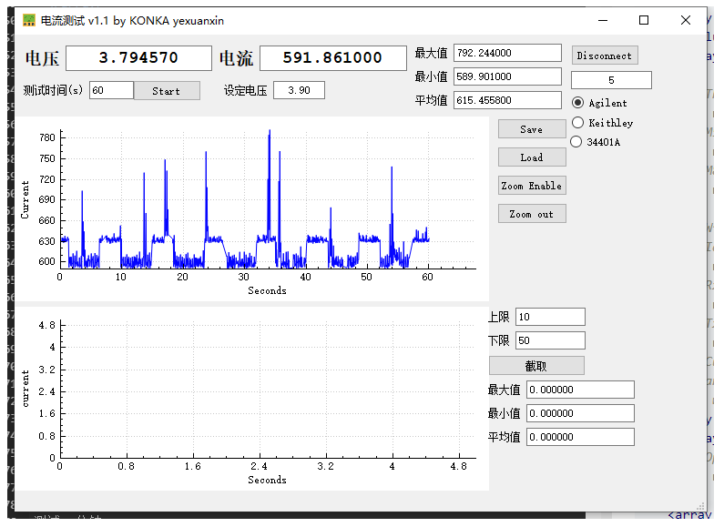


screen.full = 615 -134 = 481ma

### 2.screen.on
* 指令：

```
echo 0 > /sys/class/leds/lcd-backlight/brightness
```

休眠电流：

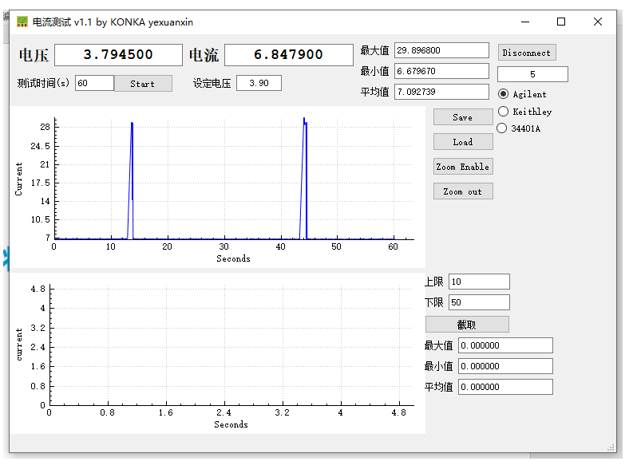

screen.on = 134 - 7 = 127ma
### 3.cup.idle
就是上面的底电流7ma

### 4.bluetooth.on
5分钟测量值如下：


8.77 - 7 = 1.77ma

### 4.bluetooth.active
* fly+播放蓝牙耳机音乐+灭屏 1分钟数据66.25ma：

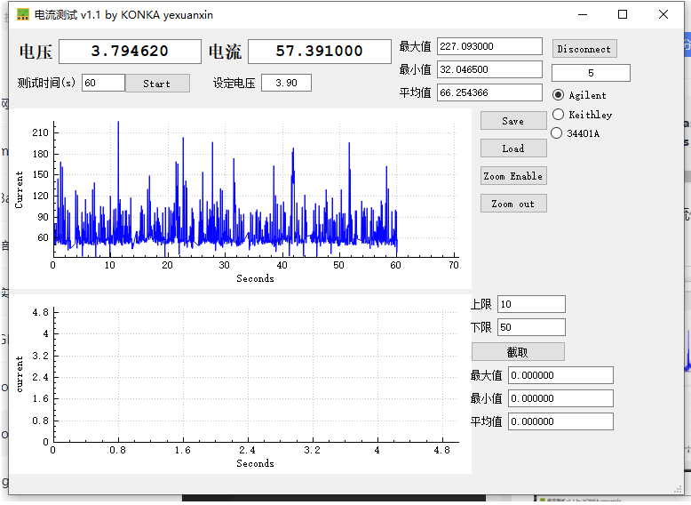

* 普通耳机播放音乐+灭屏一分钟数据53.69ma：

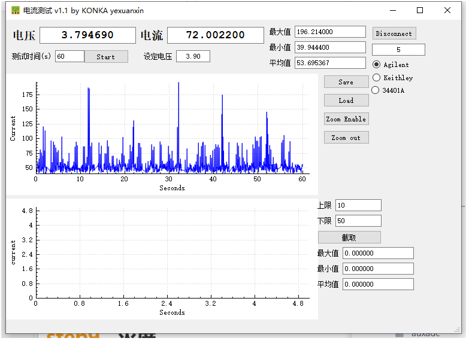

bluetooth.active = 66.25 - 53.69 = 12.56ma

### 5.wifi.on
* fly + wifi灭屏5分钟：

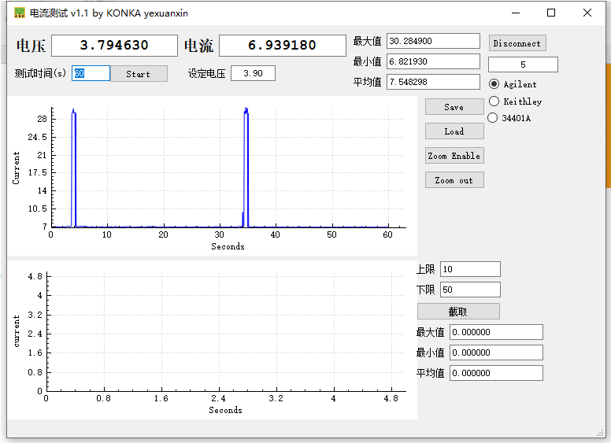

wifi.on = 7.54 - 7 =0.54ma
### 6.wifi.scan
* wifi扫描界面测试一分钟：

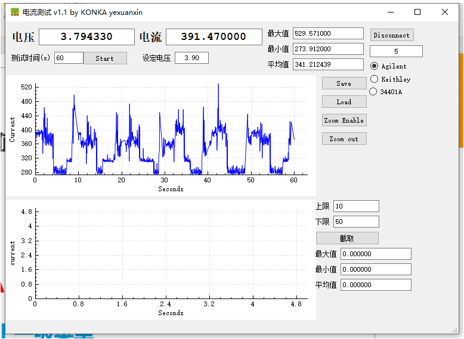

* 退出扫描：

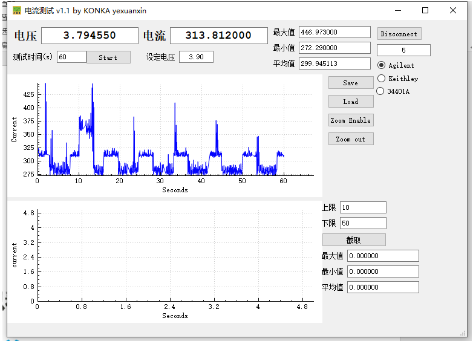

wifi.scan = 341.21 - 313.81 = 27.4ma

### 7.dsp.audio
* 输入命令：

```
echo test > /sys/power/wake_lock
```
* fly + 灭屏1分钟：

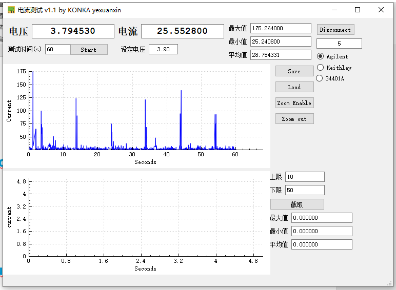

* 输入命令，然后插入耳机播放音乐：

```
echo test > /sys/power/wake_unlock
```

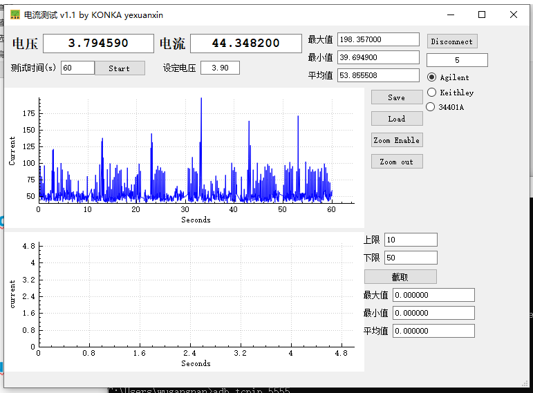

dsp.audio = 53.85 - 28.75 = 25.1ma

### 8.dsp.video

### 9.gps.on
* 搜不到星的地方+fly，设置界面关闭定位服务，进入ygps界面：

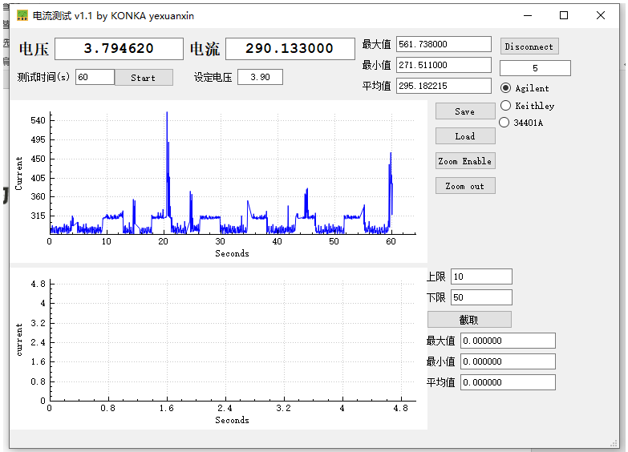
* 打开定位服务。

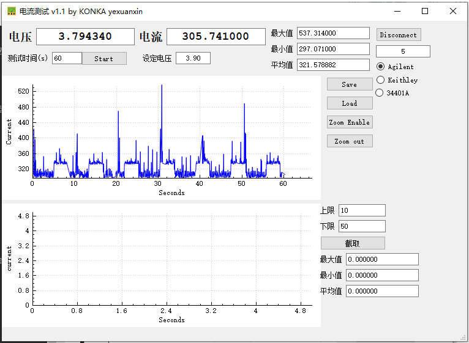

gps.on = 321.57 - 295.18 = 26.39ma

### 10.radio.on
* 实网待机10分钟数据：

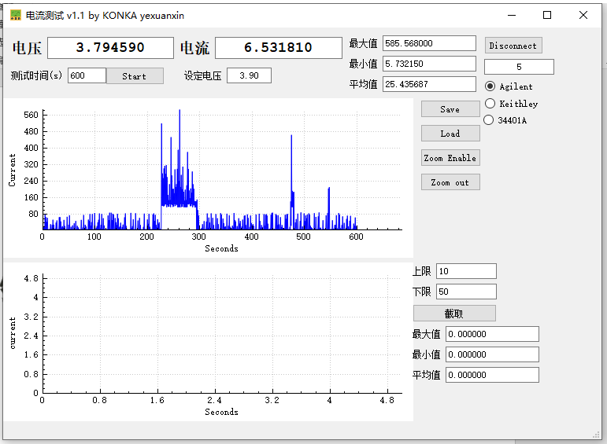

radio.on = 25.43 - 7.09 = 18.34ma

### 11.cpu.speeds
* 输入指令如下：

```
cat sys/devices/system/cpu/cpu0/cpufreq/scaling_available_frequencies                                                  <
1801000 1793000 1786000 1780000 1774000 1768000 1762000 1756000 1750000 1617000 1484000 1351000 1218000 1085000 979000 900000

cat sys/devices/system/cpu/cpu4/cpufreq/scaling_available_frequencies                                                  <
1500000 1429000 1367000 1314000 1261000 1208000 1155000 1102000 1050000 948000 846000 745000 643000 542000 501000 400000
```
* cpu频率填写如下：

```
  <array name="cpu.core_speeds.cluster0">
      <value>900000</value> <!-- 900 MHz CPU speed -->
      <value>979000</value> <!-- 979 MHz CPU speed -->
      <value>1085000</value> <!-- 1085 MHz CPU speed -->
      <value>1218000</value> <!-- 1218 MHz CPU speed -->
      <value>1351000</value> <!-- 1351 MHz CPU speed -->
      <value>1484000</value> <!-- 1484 MHz CPU speed -->
      <value>1617000</value> <!-- 1617 MHz CPU speed -->
      <value>1750000</value> <!-- 1750 MHz CPU speed -->
      <value>1756000</value> <!-- 1756 MHz CPU speed -->
      <value>1762000</value> <!-- 1762 MHz CPU speed -->
      <value>1768000</value> <!-- 1768 MHz CPU speed -->
      <value>1774000</value> <!-- 1774 MHz CPU speed -->
      <value>1780000</value> <!-- 1780 MHz CPU speed -->
      <value>1786000</value> <!-- 1786 MHz CPU speed -->
      <value>1793000</value> <!-- 1793 MHz CPU speed -->
	  <value>1801000 </value> <!--1801 MHz CPU speed -->
  </array>
  <!-- Different CPU speeds as reported in
       /sys/devices/system/cpu/cpu4/cpufreq/stats/scaling_available_frequencies -->
  <array name="cpu.core_speeds.cluster1">
      <value>400000</value> <!-- 400 MHz CPU speed -->
      <value>501000</value> <!-- 501 MHz CPU speed -->
      <value>542000</value> <!-- 542 MHz CPU speed -->
      <value>643000</value> <!-- 643 MHz CPU speed -->
      <value>745000</value> <!-- 745 MHz CPU speed -->
      <value>846000</value> <!-- 846 MHz CPU speed -->
      <value>948000</value> <!-- 948 MHz CPU speed -->
      <value>1050000</value> <!-- 1050 MHz CPU speed -->
      <value>1102000</value> <!-- 1102 MHz CPU speed -->
      <value>1155000</value> <!-- 1155 MHz CPU speed -->
      <value>1208000</value> <!-- 1208 MHz CPU speed -->
      <value>1261000</value> <!-- 1261 MHz CPU speed -->
      <value>1314000</value> <!-- 1314 MHz CPU speed -->
      <value>1367000</value> <!-- 1367 MHz CPU speed -->
      <value>1429000</value> <!-- 1429 MHz CPU speed -->
	  <value>1500000 </value> <!--1500 MHz CPU speed -->
  </array>
```
### 12.cpu.active
需要硬件工程师配合。

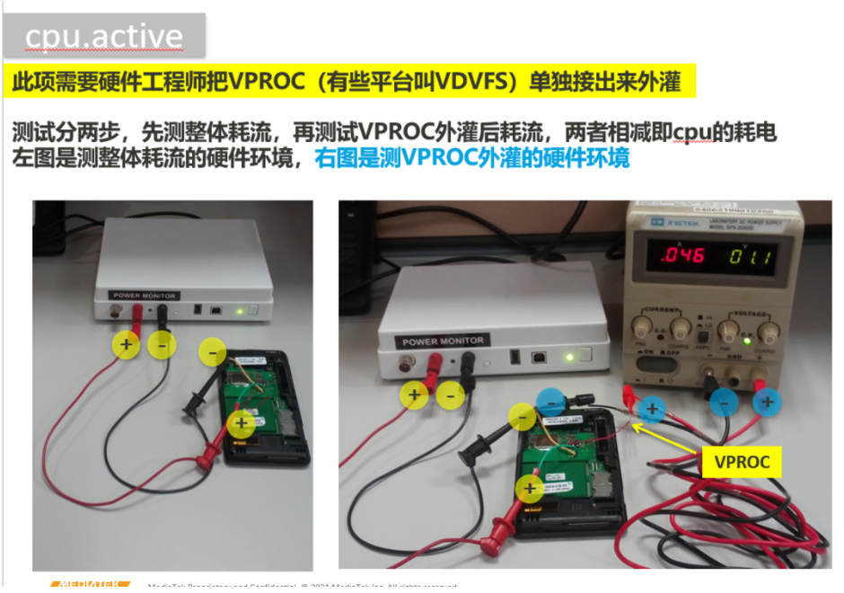

### 13.camera.avg
当应用运行预览且每分钟捕获大约 10 张全分辨率照片时的粗略估算值。


camera.avg = 445ma
### 13.camera.flashlight
相机闪光灯模块开启时消耗的平均电量。

打开闪光灯530ma

关闭闪光灯：


camera.flashlight = 160ma

### 14.ambient.on
屏幕在低电耗/微光/始终开启模式（而非关闭模式）下消耗的额外电量。参考值100ma，实测输入命令如下：

```
echo 0 > /sys/class/leds/lcd-backlight/brightness
```


ambient.on = 150ma