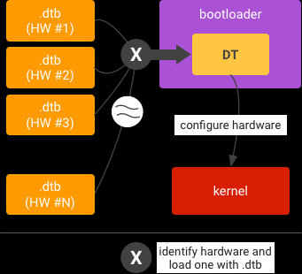
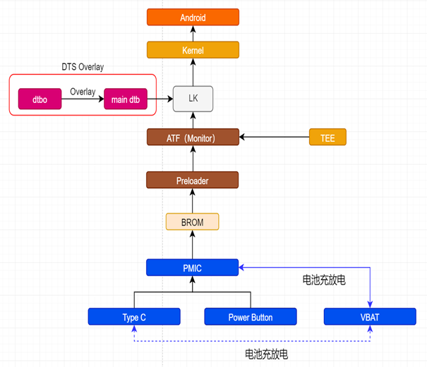
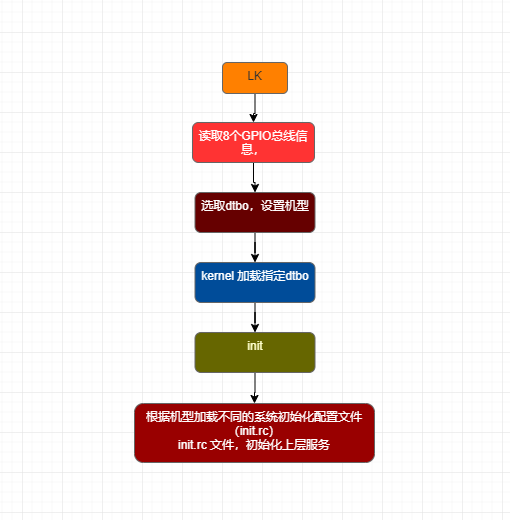

# 概述

很多 SoC 供应商和 ODM 都支持在一台设备上使用多个 DT，从而使一个映像能够为多个 SKU/配置提供支持。

在这种情况下，引导加载程序会在运行时识别硬件，并加载相应的 DT：



# 参考

* [android分区dtbo,使用多个 DT  |  Android 开源项目  |  Android Open Source Project](https://blog.csdn.net/weixin_30615531/article/details/117579207)
* [Android DTO和dtbo简介](https://blog.csdn.net/zhangdaxia2/article/details/100109684/)
* [深入浅出理解Linux设备树(DTS)](https://deepinout.com/android-system-analysis/android-kernel-related/easy-to-understand-linux-dts.html)
* [MTK平台DTBO如何生成的以及DWS生成DTS](https://blog.csdn.net/u013463707/article/details/119459687)

* Dts：DTS即Device Tree Source，是一个文本形式的文件，用于描述硬件信息。一般都是固定信息，无法变更，无法overlay。

* Dtsi：可以理解为dts的公共部分，添加、变更非常灵活。Dtsi包含在dts中。

* Dtb：Dtb编译出来的二进制

* Dtbo：Overlay编译出来的二进制

* dtbo-base：指定overlay是以哪个dtb为base来覆盖的。

* Node：树的节点

* Property：属性

# 设备树由来

linux内核源码中，之前充斥着大量的平台相关（platform Device）配置，而这些代码大多是杂乱且重复的，这使得ARM体系结构的代码维护者和内核维护者在发布一个新的版本的时候有大量的工作要做，以至于LinusTorvalds 在2011年3月17日的ARM Linux邮件列表中宣称“Gaah.Guys,this whole ARM thing is a f*cking pain in the ass”这使得整个ARM社区不得不重新慎重考虑平台配置，于是设备树（Device Tree，DT）被ARM社区采用。需要说明的是，设备树最初是由开发固件（Open Firmware）使用的用来向客户程序（通常是一个操作系统）传递数据的通信方法中的一部分内容。在运行时，客户程序通过设备树发现设备的拓扑结构，这样就不需要把硬件信息硬编码到程序中。

# 设备树的作用

设备树是一个描述硬件的数据结构，甚至你可以将其看成一个大结构体（这个结构体就是平台，成员就是具体的设备），需要注意的是设备树并不能解决所有的硬件配置问题（例如：机器识别），它只是提供一种语言，将硬件的配置从linux内核的源码中提取出来。

Linux使用设备树的主要原因如下

* A:平台识别
* B:实时配置
* C:设备植入

# 设备树解耦目标

* 目标一 vendor相关修改，完全独立出来，禁止在soc原生的dtsi中修改，只允许以dtbo的方式存在；
* 目标二 同基线项目dtbo要共二进制

# 设备树解耦框架设计


# QCM2290

在做Android8时，发现在dts中引入了dto。设备树叠加层（DTO）可让主要的设备树（DTB）叠加到设备树上。使用DTO的引导程序可以维护系统芯片（SOC）DT,并动态叠加针对特定设备的DT，从而向树中添加节点并对先用树中的属性进行更改。也就是SOC的设备节点作为DTB，其他设备作为DTO，DTO可以对DTB中的节点进行引用和修改。实现DTO包括分割设备树，编译，分区和运行。

## 分割DT

首先将设备树分割成两部分：

* 主DT。由SOC供应商提供的SOC公用部分和默认配置。
* 叠加DT。由原始设计制造商(ODM)/原始设备制造商(OEM)提供的设备专属配置。

# MT6765

目前使用的MT6762芯片使用的两个dtb，MTK标准dtb和客制化dtbo。MTK标准dtb存在于boot.img，保存在BOOT分区；客制化dtbo存在于dtbo.img中，保存在DTBO分区。在LK加载DTBO之前，需要处理当前的需要的DTBO索引，以下是lk中加载dtbo的逻辑。

## 参考

* [0001-Title-board-id-M50-M8-dts.patch](refers/0001-Title-board-id-M50-M8-dts.patch)
* [0001-a800-dts兼容.patch](refers/0001-a800-dts兼容.patch)
* [基于MTK6762平台Android适配多机型方案v2.docx](refers/基于MTK6762平台Android适配多机型方案v2.docx)
* [Android DTO和dtbo简介](https://blog.csdn.net/zhangdaxia2/article/details/100109684/)

A800是通过lk中向sp读取三个参数合成dtb命名，并merge dtb和dtbo

```
uuid = TERMINAL_NAME(1 byte) | MAIN_BOARD(1 byte) | PORT_BOARD(1 byte)\

dts命名规则：
TERMINAL_NAME+MAIN_BOARD+PORT_BOARD
A800_MT6761_V05_V03.dts
```

## 实现流程

* 硬件兼容实现流程：
  * 编译过程中将多个硬件设备的设备树打包dtbo
  * 硬件通过8个GPIO总线定义不同硬件产品
  * MTK LK模块启动过程中读取GPIO状态，判断当前硬件机型
  * 根据机型选择对应机型的dtbo，在cmdline 中增加机型信息，将机型参数传入kernel
  * Kernel 加载init进程，init根据机器类型，加载不同的init.rc配置文件
  * Init根据配置，加载不同硬件服务，设置屏幕的分辨率，加载设备驱动

* 通过dts overlay技术，将所有的dtbo合并到main dtb中：


## LK修改

* 在lk引导加载程序中运行
  * 将 .dtb 从存储加载到内存中
  * 根据`get_odm_mdtbo_index`选择正确的dtbo，并将 .dtbo 从存储加载到内存中
  * 用 .dtbo 叠加 .dtb 以形成合并的 DT
  * 启动内核（已给定合并 DT 的内存地址）

```c++
* arch/arm/crt0.S
  └── kernel/main.c
      └── thread_t *thread_bs2 = thread_create("bootstrap2", &bootstrap2, NULL, DEFAULT_PRIORITY, DEFAULT_STACK_SIZE);
          └── bootstrap2(void *arg)
              ├── platform_init();
              ├── load_device_tree(void)
              │   └── lk_dtb_init(void) //platform/common/lk_main_dtb_loader/lk_builtin_dtb.c
              │       └── load_dtbo_buffer(void **dtbo_ptr, uint32_t *dtbo_size)
              │           └── parse_dtbo_tbl((struct dt_table_header *)dtbo_total_buffer, (uint32_t)get_odm_mdtbo_index(), //app/mt_boot/fdt_op.c 重要
              │               └── set_dtbo_index(dtbo_entry_idx);
              └── apps_init();
                  └── APP_START(mt_boot) .init = mt_boot_init, APP_END
                      └── mt_boot_init(const struct app_descriptor *app)
                          ├── boot_linux_from_storage(void)
                          ├── case NORMAL_BOOT:
                          │   └── load_vfy_boot(BOOTIMG_TYPE_BOOT, CFG_BOOTIMG_LOAD_ADDR);
                          │       └── boot_post_processing(&ops, bootimg_type, slot_data);//platform/common/boot/avb20/load_vfy_boot.c
                          │           └── prepare_kernel_dtb(); 
                          │               └── dtb_overlay(main_dtb ? main_dtb : (void *)get_main_dtb_load_addr(), //app/mt_boot/fdt_op.c
                          │                   ├── load_overlay_dtbo() //app/mt_boot/odm_mdtbo.c
                          │                   └── merged_fdt = ufdt_apply_overlay(blob, blob_len, overlay_buf, overlay_len); // A buffer is allocated in load_overlay_dtbo() to store the loaded odm dtb
                          │                       └── load_dtb_from_multiple_dtbo(part_name, hdr2, &ptr, (uint64_t)recovery_dtbo_offset);
                          │                           └── get_odm_mdtbo_index()
                          │                               ├── if (customized_get_odm_mdtbo_index) //用户定制
                          │                               └── odm_dtbo_index = customized_get_odm_mdtbo_index();
                          └── boot_linux((void *)kernel_target_addr,(unsigned *)tags_target_addr,board_machtype(),(void *)ramdisk_target_addr,ramdisk_real_sz);
                              └── boot_linux_fdt((void *)kernel, (unsigned *)tags, machtype,(void *)ramdisk, ramdisk_sz); // app/mt_boot/mt_boot.c
                                  ├── snprintf(tmpbuf, TMPBUF_SIZE, "androidboot.dtb_idx=0 androidboot.dtbo_idx=%d", get_dtbo_index()); 
                                  └── cmdline_append(tmpbuf);//将androidboot.dtbo_idx以cmdline形式传给kernel
```

* 以上流程如下：
  * 1.`platform_init->parse_dtbo_tbl`流程通过`get_odm_mdtbo_index`获取dtb_idx，并通过`set_dtbo_index`设置全局变量`hw_mdtbo_index`。
  * 2.`apps_init->ufdt_apply_overlay`准备kernel dtb，主要是在`load_overlay_dtbo()`中分配了一个缓冲区来存储加载的`odm dtb`,将`.dtbo`和`.dtb`从存储加载到内存中，用`.dtbo`叠加`.dtb` 以形成合并的 DT。
  * 3.`apps_init->cmdline_append`启动内核，通过`get_dtbo_index`获取全局变量`hw_mdtbo_index`，并将`dtbo_idx`以`cmdline`形式传给`kernel`。

* dts定制函数根据boardid，如果M8项目则idx=1则选择M8.dts：

```C++
platform/mt6765/custom_dtb_index.c：

#include <odm_mdtbo.h>                  // for customized_get_odm_mdtbo_index()
#include <platform/mt_gpio.h>           // for mt_get_gpio_in()


#define GPIO_163        (0x80000000 | 163)
#define GPIO_164        (0x80000000 | 164)
#define GPIO_HIGH       (1)
#define GPIO_LOW        (0)

/******************************************************************************
* NOTE: This function is for the internal projects of MT6771.
*        -----------------------------------------
*       |   ID4          ID5      PCB_ID          |
*       |   Low          Low      M50             |
*       |   Low          High     M8              |
*       |   High         Low      M8              |
*       |   High         High     M8              |
*        -----------------------------------------
*
*       Customers need to implement their own customized_get_odm_mdtbo_index()
*       function.
******************************************************************************/
int customized_get_odm_mdtbo_index(void)
{
        int idx = 0;
        int board_id = getBoardIDVals();

        /*[FEATURE]-Add-BEGIN by zengjianfeng@paxsz.com, 2021/05/13, for multi dts */
        dprintf(INFO, "get board id vals: 0x%02x\n", board_id);

        if ((board_id & (0x03 << 3)) > 0)
                idx = 1;
        dprintf(INFO, "dtb index: 0x%02x\n", idx);
        /*[FEATURE]-Add-END by zengjianfeng@paxsz.com, 2021/05/13, for multi dts */

        return idx;
}
```

## Kernel修改

修改`MTK_PROJECT_DTB_NAMES`，增加两个dtb。

```diff
--- a/device/mediateksample/k62v1_64_pax/ProjectConfig.mk
+++ b/device/mediateksample/k62v1_64_pax/ProjectConfig.mk
@@ -521,7 +521,7 @@ MTK_BT_HEARING_AID_SUPPORT = no
 MTK_CAM_VPU_DSDN = no
 MTK_AI_CAM_SUPPORT = no
 MTK_BIP_UICC_SERVER_MODE = no
-MTK_PROJECT_DTB_NAMES =
+MTK_PROJECT_DTB_NAMES = mediatek/M50 mediatek/M8
```

## 结果验证

M8和M50的cmdline如下：

```
M50:
cmdline:
androidboot.dtbo_idx=0

M8：
androidboot.dtbo_idx=1
```

## 编译程序流程

主要文件：
```log
编译脚本
device/mediatek/build/core：
wugn@jcrj-tf-compile:core$ tree
.
├── base_rule_hook.mk
├── base_rules.mk
├── build_dtbimage.mk
├── build_dtb.mk
├── build_dtboimage.mk
├── build_ko.mk
├── definitions.mk
├── executable.mk
├── mssi_fo.mk
├── override_config.mk
├── prebuilt.mk
├── sdk.atree
├── sdk_deps.mk
├── shared_library.mk
├── soong_config.mk
├── static_library.mk
└── target_brm_platform.mk


merge目录：
out/target/product/k62v1_64_pax/obj/KERNEL_OBJ/arch/arm64/boot/dts/mediatek
wugn@jcrj-tf-compile:mediatek$ tree
.
├── auto2712p1v1-ivi-boot.dtb
├── auto2712p1v1-ivi-nand-boot.dtb
├── M50.dtb
├── M50.dtb.merge
├── M50.dts
├── M8.dtb
├── M8.dtb.merge
├── M8.dts
├── modules.order
├── mt6765.dtb
└── mt6765.dts

mt6765.dtb及dtbo.img生成目录：
out/target/product/k62v1_64_pax/obj/PACKAGING/dtb
wugn@jcrj-tf-compile:PACKAGING$ tree dtb*
dtb
├── mtk_dtb
└── mtk.dtb
dtboimage
└── dtbo.img

```

### dtb和dtbo定义

mtk中dtb和dtbo编译脚本如下，`MTK_DTBOIMAGE_DTS`是`mediatek/M50 mediatek/M8`：

```makefile
### DTB build template
MTK_DTBIMAGE_DTS := $(addsuffix .dts,$(addprefix $(KERNEL_DIR)/arch/$(KERNEL_TARGET_ARCH)/boot/dts/,$(PLATFORM_DTB_NAME)))
include device/mediatek/build/core/build_dtbimage.mk

MTK_DTBOIMAGE_DTS := $(addsuffix .dts,$(addprefix $(KERNEL_DIR)/arch/$(KERNEL_TARGET_ARCH)/boot/dts/,$(PROJECT_DTB_NAMES)))
include device/mediatek/build/core/build_dtboimage.mk
```

* `device/mediatek/vendor/common/BoardConfig.mk``MTK_DTBIMAGE_DTS`是`mediatek/mt6765`，根据如下`TARGET_BOARD_PLATFORM`定义:
```makefile
device/mediatek/mt6765/device.mk
5:TARGET_BOARD_PLATFORM ?= mt6765

ifeq ($(strip $(MTK_PLATFORM_DTB_NAME)),)
ifeq ($(MTK_K64_SUPPORT), yes)
PLATFORM_DTB_NAME ?= mediatek/$(TARGET_BOARD_PLATFORM)
else
PLATFORM_DTB_NAME ?= $(TARGET_BOARD_PLATFORM)
endif
else
PLATFORM_DTB_NAME ?= $(MTK_PLATFORM_DTB_NAME)
endif
```

以上得知dtb是mt6765.dts，dtbo是M8.dts。

### build_dtbimage.mk分析（mt6765.dtb编译流程）

* 该脚本主要生成dtb文件`mt6765.dtb`,然后改名为`mtk_dtb`,目录`out/target/product/k62v1_64_pax/obj/PACKAGING/dtb`，代码如下：

```makefile
ifdef MTK_DTBIMAGE_DTS

ifneq (true,$(strip $(TARGET_NO_KERNEL)))
ifneq ($(LINUX_KERNEL_VERSION),)

ifeq (,$(KERNEL_OUT))
include $(LINUX_KERNEL_VERSION)/kenv.mk
endif

#这里MTK_DTBIMAGE_DTS是mediatek/mt6765，得知LOCAL_SRC_FILES也是 \
#功能是生成dtb文件mt6765.dtb
MTK_DTBIMAGE_DTB :=
$(foreach i,$(MTK_DTBIMAGE_DTS),\
  $(eval LOCAL_SRC_FILES := $(i))\
  $(eval include device/mediatek/build/core/build_dtb.mk)\
  $(eval MTK_DTBIMAGE_DTB += $(my_kernel_dtb))\
)
MTK_CHECK_DTBO_MAIN := $(MTK_DTBIMAGE_DTB)

my_dtb_id := 0
define mk_dtbimg_cfg
echo $(1) >>$(2);\
echo " id=$(my_dtb_id)" >>$(2);\
$(eval my_dtb_id := (call int_plus,$(my_dtb_id),1))
endef

ifdef BOARD_PREBUILT_DTBIMAGE_DIR
BOARD_PREBUILT_DTBIMAGE := $(BOARD_PREBUILT_DTBIMAGE_DIR)/mtk.dtb
$(shell if [ ! -f $(BOARD_PREBUILT_DTBIMAGE) ]; then mkdir -p $(dir $(BOARD_PREBUILT_DTBIMAGE)); touch $(BOARD_PREBUILT_DTBIMAGE); fi)

/*
#cat mt6765.dtb > mtk_dtb \
#对比文件大小，确实一样 \
#wugn@jcrj-tf-compile:dtb$ ls -l
#total 224
#-rw-rw-r-- 1 wugn wugn 111374 Jul 11 22:24 mtk_dtb

#wugn@jcrj-tf-compile:mediatek$ ls -l
#-rw-rw-r-- 1 wugn wugn 111374 Jul 11 22:24 mt6765.dtb
*/
INSTALLED_MTK_DTB_TARGET := $(BOARD_PREBUILT_DTBIMAGE_DIR)/mtk_dtb
$(INSTALLED_MTK_DTB_TARGET): $(MTK_DTBIMAGE_DTB)
	$(hide) mkdir -p $(dir $@)
	$(hide) cat $^ > $@

MTK_DTBIMAGE_CFG := $(KERNEL_OUT)/arch/$(KERNEL_TARGET_ARCH)/boot/dts/dtbimg.cfg
$(MTK_DTBIMAGE_CFG): PRIVATE_DTB := $(INSTALLED_MTK_DTB_TARGET)
$(MTK_DTBIMAGE_CFG): $(INSTALLED_MTK_DTB_TARGET)
	$(hide) rm -f $@.tmp
	$(hide) $(foreach f,$(PRIVATE_DTB),$(call mk_dtbimg_cfg,$(f),$@.tmp))
	if ! cmp -s $@.tmp $@; then \
		mv $@.tmp $@; \
	else \
		rm $@.tmp; \
	fi

endif#BOARD_PREBUILT_DTBIMAGE_DIR

endif#TARGET_NO_KERNEL
endif#LINUX_KERNEL_VERSION

endif#MTK_DTBIMAGE_DTS
```

其中`BOARD_PREBUILT_DTBIMAGE_DIR`定义如下：

```
device/mediatek/mt6765/BoardConfig.mk
107:BOARD_PREBUILT_DTBIMAGE_DIR := $(MTK_PTGEN_PRODUCT_OUT)/obj/PACKAGING/dtb

wugn@jcrj-tf-compile:PACKAGING$ tree dtb*
dtb
├── mtk_dtb
└── mtk.dtb
dtboimage
└── dtbo.img
```

重要信息：`LOCAL_SRC_FILES = mediatek/mt6765`

#### build_dtb.mk分析

该脚本功能是用make命令在kernel中生成mt6765.dtb:

* `build_dtb.mk`:

```makefile
my_kernel_dtb :=

ifneq ($(words $(LOCAL_SRC_FILES)),1)
$(error LOCAL_SRC_FILES $(LOCAL_SRC_FILES) should be one file)
endif

ifneq (true,$(strip $(TARGET_NO_KERNEL)))
ifneq ($(LINUX_KERNEL_VERSION),)

ifeq (,$(KERNEL_OUT))
include $(LINUX_KERNEL_VERSION)/kenv.mk
endif

ifeq ($(KERNEL_TARGET_ARCH),arm64) 
#目录out/target/product/k62v1_64_pax/obj/KERNEL_OBJ/arch/arm64/boot/dts/mediatek
#将目录下dts换成dtb后缀
# my_kernel_dtb_stem = mt6765.dtb
my_kernel_dtb_stem := mediatek/$(notdir $(patsubst %.dts,%.dtb,$(LOCAL_SRC_FILES)))
else
my_kernel_dtb_stem := $(notdir $(patsubst %.dts,%.dtb,$(LOCAL_SRC_FILES)))
endif

# my_kernel_dts = mt6765
ifeq ($(KERNEL_TARGET_ARCH),arm64)
my_kernel_dts := $(KERNEL_OUT)/arch/$(KERNEL_TARGET_ARCH)/boot/dts/mediatek/$(notdir $(LOCAL_SRC_FILES))
else
my_kernel_dts := $(KERNEL_OUT)/arch/$(KERNEL_TARGET_ARCH)/boot/dts/$(notdir $(LOCAL_SRC_FILES))
endif

# my_kernel_dtb = mt6765.dtb
my_kernel_dtb := $(KERNEL_OUT)/arch/$(KERNEL_TARGET_ARCH)/boot/dts/$(my_kernel_dtb_stem)

# cp $(LOCAL_SRC_FILES) $(my_kernel_dts)
$(my_kernel_dts): $(LOCAL_SRC_FILES)
	$(hide) mkdir -p $(dir $@)
	$(hide) cp -f $< $@


# definitions.mk
#47:PREBUILT_MAKE_PREFIX := ./prebuilts/build-tools/linux-x86/bin/
#这里是用make命令在kernel中生成dtb
$(my_kernel_dtb): KOUT := $(KERNEL_OUT)
$(my_kernel_dtb): OPTS := $(KERNEL_MAKE_OPTION) $(my_kernel_dtb_stem)
$(my_kernel_dtb): $(KERNEL_ZIMAGE_OUT) $(my_kernel_dts) $(LOCAL_ADDITIONAL_DEPENDENCIES) | $(LOCAL_ADDITIONAL_DEPENDENCIES_D)
	$(PREBUILT_MAKE_PREFIX)$(MAKE) -C $(KOUT) $(OPTS)

#这里是用ufdt_apply_overlay工具生成xxxx.dtb.merge，但是MTK_CHECK_DTBO_MAIN是在include device/mediatek/build/core/build_dtb.mk之后定义的，不跑
UFDT_TOOL := $(LINUX_KERNEL_VERSION)/scripts/dtc/ufdt_apply_overlay
ifneq (,$(MTK_CHECK_DTBO_MAIN))
$(my_kernel_dtb).merge: private_my_platform_dtb := $(MTK_CHECK_DTBO_MAIN)
$(my_kernel_dtb).merge: private_my_kernel_dtb := $(my_kernel_dtb)
$(my_kernel_dtb).merge: $(UFDT_TOOL) $(MTK_CHECK_DTBO_MAIN) $(my_kernel_dtb)
	@echo "dtbo_check: $@"
	$(UFDT_TOOL) $(private_my_platform_dtb) $(private_my_kernel_dtb) $@
$(PRODUCT_OUT)/dtbo.img: $(my_kernel_dtb).merge
$(PRODUCT_OUT)/boot.img: $(my_kernel_dtb).merge
endif


endif#TARGET_NO_KERNEL
endif#LINUX_KERNEL_VERSION

LOCAL_ADDITIONAL_DEPENDENCIES :=
LOCAL_SRC_FILES :=
```

### build_dtboimage.mk分析（dws M50.dtb.merg dtboimg.cfg编译流程）

* `build_dtboimage.mk`:

1.利用DrvGen.py生成dws的dts：
```
obj/KERNEL_OBJ/arch/arm64/boot/dts/k62v1_64_pax/M8/cust.dtsi
obj/KERNEL_OBJ/arch/arm64/boot/dts/k62v1_64_pax/M50/cust.dtsi
```
2.生成merge文件M50.dtb.merge（M50.dtb + mt6762.dtb）
3.生成cfg文件，这个文件指定了DTBO由哪个DTS文件生成，内容如下：
```
dtboimg.cfg:
out/target/product/k62v1_64_pax/obj/KERNEL_OBJ/arch/arm64/boot/dts/mediatek/M50.dtb
 id=0
out/target/product/k62v1_64_pax/obj/KERNEL_OBJ/arch/arm64/boot/dts/mediatek/M8.dtb
 id=1

dtbimg.cfg:
out/target/product/k62v1_64_pax/obj/PACKAGING/dtb/mtk_dtb
 id=0
```

```makefile
ifdef MTK_DTBOIMAGE_DTS
#ifdef MTK_DTBOIMAGE_DWS

ifneq (true,$(strip $(TARGET_NO_KERNEL)))
ifneq ($(LINUX_KERNEL_VERSION),)

ifeq (,$(KERNEL_OUT))
include $(LINUX_KERNEL_VERSION)/kenv.mk
endif

#第一步，利用DrvGen.py将dws生成dts
DRVGEN_TOOL := vendor/mediatek/proprietary/tools/dct/python/DrvGen.py
DRVGEN_FIG := $(wildcard $(dir $(DRVGEN_TOOL))config/*.fig)
define drvgen_dws_to_dtsi
kernel: $(2)/cust.dtsi
$(2)/cust.dtsi: drvgen_tool := $(DRVGEN_TOOL)
$(2)/cust.dtsi: prj_path := $(2)
$(2)/cust.dtsi: $(DRVGEN_TOOL) $(1) $(DRVGEN_FIG)
	$(hide) mkdir -p $$(dir $$@)
	python $$(drvgen_tool) $(1) $$(prj_path) $$(prj_path) cust_dtsi
endef

#第二步：利用命令grep -m 1 '#include [<\"].*\/cust\.dtsi[>\"]' M50.dts | sed 's/#include [<"]//g' | sed 's/\/cust\.dtsi[>"]//g' | sed 's/\/\*//g' | sed 's/\*\///g' | sed 's/ //g' 输出base_prj = k62v1_64_pax/M50，将并生成M50.dtb.merge
MTK_DTBOIMAGE_DTB :=
MTK_DTBOIMAGE_DTSI :=
$(foreach i,$(MTK_DTBOIMAGE_DTS),\
  $(eval base_prj := $(shell grep -m 1 '#include [<\"].*\/cust\.dtsi[>\"]' $(i) | sed 's/#include [<"]//g' | sed 's/\/cust\.dtsi[>"]//g' | sed 's/\/\*//g' | sed 's/\*\///g' | sed 's/ //g'))\
  $(if $(strip $(base_prj)),\
    $(eval prj_path := $(KERNEL_OUT)/arch/$(KERNEL_TARGET_ARCH)/boot/dts/$(base_prj))\
    $(eval dws_path := $(KERNEL_DIR)/drivers/misc/mediatek/dws/$(MTK_PLATFORM_DIR)/$(basename $(notdir $(i))).dws)\
    $(if $(filter $(prj_path),$(MTK_DTBOIMAGE_DTSI)),,\
      $(eval $(call drvgen_dws_to_dtsi,$(dws_path),$(prj_path)))\
      $(eval MTK_DTBOIMAGE_DTSI += $(prj_path))\
      $(eval LOCAL_ADDITIONAL_DEPENDENCIES := $(prj_path)/cust.dtsi)\
    )\
  )\
  $(eval LOCAL_ADDITIONAL_DEPENDENCIES_D := $(MTK_DTBIMAGE_DTB))\
  $(eval LOCAL_ADDITIONAL_DEPENDENCIES_D += $(MTK_DTBOIMAGE_DTB))\
  $(eval LOCAL_SRC_FILES := $(i))\
  $(eval include device/mediatek/build/core/build_dtb.mk)\
  $(eval MTK_DTBOIMAGE_DTB += $(my_kernel_dtb))\
)

#这里是生成cfg文件
kernel: $(my_kernel_dtb).merge
my_dtbo_id := 0
define mk_dtboimg_cfg
echo $(1) >>$(2);\
echo " id=$(my_dtbo_id)" >>$(2);\
$(eval my_dtbo_id := $(call int_plus,$(my_dtbo_id),1))
endef

MTK_DTBOIMAGE_CFG := $(KERNEL_OUT)/arch/$(KERNEL_TARGET_ARCH)/boot/dts/dtboimg.cfg
$(MTK_DTBOIMAGE_CFG): PRIVATE_DTB := $(MTK_DTBOIMAGE_DTB)
$(MTK_DTBOIMAGE_CFG): $(MTK_DTBOIMAGE_DTB)
	$(hide) rm -f $@.tmp
	$(hide) $(foreach f,$(PRIVATE_DTB),$(call mk_dtboimg_cfg,$(f),$@.tmp))
	$(hide) if ! cmp -s $@.tmp $@; then \
		mv $@.tmp $@; \
	else \
		rm $@.tmp; \
	fi

endif#TARGET_NO_KERNEL
endif#LINUX_KERNEL_VERSION

#endif#MTK_DTBOIMAGE_DWS
endif#MTK_DTBOIMAGE_DTS
```

#### build_dtb.mk分析

该脚本功能是用make命令在kernel中生成M50.dtb和M50.dtb.merge（M50.dtb + mt6762.dtb）:

```
160939 = 49565 + 111374
-rw-rw-r-- 1 wugn wugn 160939 Jul 11 22:24 M50.dtb.merge
-rw-rw-r-- 1 wugn wugn  49565 Jul 11 22:24 M50.dtb
-rw-rw-r-- 1 wugn wugn 111374 Jul 11 22:24 mt6765.dtb

编译log：
[ 19% 27973/140679] dtbo_check: 
out/target/product/k62v1_64_pax/obj/KERNEL_OBJ/arch/arm64/boot/dts/mediatek/M50.dtb.merge
```

* `build_dtb.mk`:

```makefile
my_kernel_dtb :=

ifneq ($(words $(LOCAL_SRC_FILES)),1)
$(error LOCAL_SRC_FILES $(LOCAL_SRC_FILES) should be one file)
endif

ifneq (true,$(strip $(TARGET_NO_KERNEL)))
ifneq ($(LINUX_KERNEL_VERSION),)

ifeq (,$(KERNEL_OUT))
include $(LINUX_KERNEL_VERSION)/kenv.mk
endif

ifeq ($(KERNEL_TARGET_ARCH),arm64) 
#目录out/target/product/k62v1_64_pax/obj/KERNEL_OBJ/arch/arm64/boot/dts/mediatek \
#将目录下dts换成dtb后缀 \
# my_kernel_dtb_stem = M50.dtb
my_kernel_dtb_stem := mediatek/$(notdir $(patsubst %.dts,%.dtb,$(LOCAL_SRC_FILES)))
else
my_kernel_dtb_stem := $(notdir $(patsubst %.dts,%.dtb,$(LOCAL_SRC_FILES)))
endif

# my_kernel_dts = M50
ifeq ($(KERNEL_TARGET_ARCH),arm64)
my_kernel_dts := $(KERNEL_OUT)/arch/$(KERNEL_TARGET_ARCH)/boot/dts/mediatek/$(notdir $(LOCAL_SRC_FILES))
else
my_kernel_dts := $(KERNEL_OUT)/arch/$(KERNEL_TARGET_ARCH)/boot/dts/$(notdir $(LOCAL_SRC_FILES))
endif

# my_kernel_dtb = M50.dtb
my_kernel_dtb := $(KERNEL_OUT)/arch/$(KERNEL_TARGET_ARCH)/boot/dts/$(my_kernel_dtb_stem)

# cp $(LOCAL_SRC_FILES) $(my_kernel_dts)
$(my_kernel_dts): $(LOCAL_SRC_FILES)
	$(hide) mkdir -p $(dir $@)
	$(hide) cp -f $< $@


# definitions.mk
#47:PREBUILT_MAKE_PREFIX := ./prebuilts/build-tools/linux-x86/bin/
#这里是用make命令在kernel中生成dtb
$(my_kernel_dtb): KOUT := $(KERNEL_OUT)
$(my_kernel_dtb): OPTS := $(KERNEL_MAKE_OPTION) $(my_kernel_dtb_stem)
$(my_kernel_dtb): $(KERNEL_ZIMAGE_OUT) $(my_kernel_dts) $(LOCAL_ADDITIONAL_DEPENDENCIES) | $(LOCAL_ADDITIONAL_DEPENDENCIES_D)
	$(PREBUILT_MAKE_PREFIX)$(MAKE) -C $(KOUT) $(OPTS)

#这里是用ufdt_apply_overlay工具生成xxxx.dtb.merge，但是MTK_CHECK_DTBO_MAIN是在build_dtbimage.mk中定义为mt6765.dtb，会跑
UFDT_TOOL := $(LINUX_KERNEL_VERSION)/scripts/dtc/ufdt_apply_overlay
ifneq (,$(MTK_CHECK_DTBO_MAIN))
$(my_kernel_dtb).merge: private_my_platform_dtb := $(MTK_CHECK_DTBO_MAIN)
$(my_kernel_dtb).merge: private_my_kernel_dtb := $(my_kernel_dtb)
$(my_kernel_dtb).merge: $(UFDT_TOOL) $(MTK_CHECK_DTBO_MAIN) $(my_kernel_dtb)
	@echo "dtbo_check: $@"
	$(UFDT_TOOL) $(private_my_platform_dtb) $(private_my_kernel_dtb) $@
$(PRODUCT_OUT)/dtbo.img: $(my_kernel_dtb).merge
$(PRODUCT_OUT)/boot.img: $(my_kernel_dtb).merge
endif


endif#TARGET_NO_KERNEL
endif#LINUX_KERNEL_VERSION

LOCAL_ADDITIONAL_DEPENDENCIES :=
LOCAL_SRC_FILES :=
```

### dtbo.mk (dtbo.img dtb.img生成)

* `device/mediatek/build/tasks/dtbo.mk`:
* 使用mkdtimg工具配合dtbimg.cfg及mtk.dtb(mt6762.dtb->mtk_dtb)生成dtb.img
* 使用mkdtimg工具配合dtboimg.cfg生成dtbo.img
```makefile

DTBO生成：
device/mediatek/build/tasks/dtbo.mk
 
ifneq ($(filter $(OUT_DIR)/%,$(BOARD_PREBUILT_DTBOIMAGE)),)
ifdef KERNEL_DIR

ifndef MTK_DTBOIMAGE_CFG
MTK_DTBOIMAGE_CFG := $(KERNEL_OUT)/dtboimg.cfg
.KATI_RESTAT: $(MTK_DTBOIMAGE_CFG)
$(MTK_DTBOIMAGE_CFG): $(KERNEL_ZIMAGE_OUT) ;
endif

ifndef MTK_DTBIMAGE_CFG
MTK_DTBIMAGE_CFG := $(KERNEL_OUT)/dtbimg.cfg
.KATI_RESTAT: $(MTK_DTBIMAGE_CFG)
$(MTK_DTBIMAGE_CFG): $(KERNEL_ZIMAGE_OUT) ;
endif

# mkdtimg is from system/libufdt/utils/src
$(BOARD_PREBUILT_DTBOIMAGE): PRIVATE_TOOL := $(HOST_OUT_EXECUTABLES)/mkdtimg
$(BOARD_PREBUILT_DTBOIMAGE): PRIVATE_CFG := $(MTK_DTBOIMAGE_CFG)
$(BOARD_PREBUILT_DTBOIMAGE): $(HOST_OUT_EXECUTABLES)/mkdtimg
$(BOARD_PREBUILT_DTBOIMAGE): $(MTK_DTBOIMAGE_CFG)
	$(hide) mkdir -p $(dir $@)
	$(PRIVATE_TOOL) cfg_create $@ $(PRIVATE_CFG)

# dtb.img
BOARD_PREBUILT_DTBIMAGE := $(MTK_PTGEN_PRODUCT_OUT)/obj/PACKAGING/dtb/mtk.dtb
$(INSTALLED_DTBIMAGE_TARGET): $(BOARD_PREBUILT_DTBIMAGE)
$(BOARD_PREBUILT_DTBIMAGE): PRIVATE_TOOL := $(HOST_OUT_EXECUTABLES)/mkdtimg
$(BOARD_PREBUILT_DTBIMAGE): PRIVATE_CFG := $(MTK_DTBIMAGE_CFG)
$(BOARD_PREBUILT_DTBIMAGE): $(HOST_OUT_EXECUTABLES)/mkdtimg
$(BOARD_PREBUILT_DTBIMAGE): $(MTK_DTBIMAGE_CFG) $(INSTALLED_MTK_DTB_TARGET)
	$(hide) mkdir -p $(dir $@)
	$(PRIVATE_TOOL) cfg_create $@ $(PRIVATE_CFG)

ifeq ($(strip $(MTK_DTBO_UPGRADE_FROM_ANDROID_O)), yes)
.PHONY: odmdtboimage
droidcore: $(PRODUCT_OUT)/$(notdir $(BOARD_PREBUILT_DTBOIMAGE))
odmdtboimage: $(PRODUCT_OUT)/$(notdir $(BOARD_PREBUILT_DTBOIMAGE))
else
droidcore: $(PRODUCT_OUT)/dtbo.img
ifdef BOARD_PREBUILT_DTBIMAGE_DIR
droidcore: $(PRODUCT_OUT)/dtb.img
endif
.PHONY: dtboimage dtbimage
dtboimage: $(PRODUCT_OUT)/dtbo.img
dtbimage: $(PRODUCT_OUT)/dtb.img
endif

endif
endif#BOARD_PREBUILT_DTBOIMAGE

由此可见，此处使用mkdtimg工具根据dtboimg.cfg来生成dtbo.img
```

暂时先分析到dtbo.img dtb.img的生成，dtb.img不知道后续用来干嘛···
