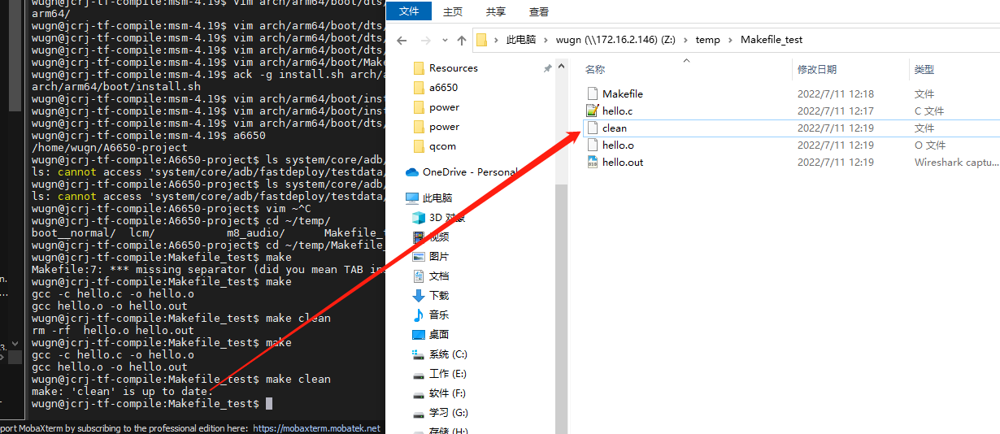

# Makefile 语法入门

学会编写Makefile，不仅仅有益于你在Linux下编写大型工程。同时也能帮助你理解编译原理。远离IDE，了解编译过程。

# 参考

* [Makefile 语法入门](https://blog.csdn.net/afei__/article/details/82696682)
* [makfile整理合集](https://blog.csdn.net/onlylove_/category_11702110.html?spm=1001.2014.3001.5482)

# 概述

Makefile 是一种常用于编译的脚本语言。它可以更好更方便的管理你的项目的代码编译，节约编译时间（没改动的文件不编译）。
注意 Makefile 文件命令必须是 Makefile 或者 makefile，并使用 make 命令编译。


# 配置gcc编译参数，减少编译过程中的告警信息

```makefile
-Wno-unused-variable：不显示未使用的变量告警
-Wno-unused-parameter：不显示未使用的参数告警
-Wno-unused-function：不显示未使用的函数告警
-Wno-unused-but-set-variable：不显示已赋值但未使用的变量告警
-Wno-unused-private-field：不显示未使用的类私有成员告警
-Wno-unused-label：不显示未使用的跳转标记告警

-Wno-unused-but-set-variable，建议酌情使用，变量已赋值未使用，可能是潜在bug。
建议如下设置：
ccflags-y += -Wall -Wextra -Wno-unused-variable -Wno-unused-parameter -Wno-unused-function -Wno-unused-private-field -Wno-unused-label
```

# 二、1个规则

## 1. 语法规则
```
目标...: 依赖...
    命令1
    命令2
    ...
```

```
目标［属性］:(分隔符号) ［依赖文件］［命令列］

{《tab》命令列}

与Linux下面的命令格式相同，［］中的内容表示为可选择项，{}中的内容表示可出现多次。

A. 目标：目标文件列表，即要维护的文件列表。
B. 属性：表示该文件的属性。
C. 分隔符：用来分割目标文件和依赖文件的符号，如冒号“：”等。
D. 依赖文件：目标文件所依赖的文件的列表。
E. 命令列：重新生成目标文件的命令，可以有多条命令。
```

　　注 意：在makefile中，除了第一条命令，每一个命令行的开头必须是一个《tab》符号，也就是制表符，而不能因为制表符相当于4个空格而 不去键入tab符号。因为make命令是通过每一行的tab符号来识别命令行的。另外，对于第一条命令而言，不必用《tab》键，就可以直接 跟在依赖文件的列表后面。对于注释的了，起头应该用#符号，并用换行符号结束。如果要引用#符号，要用到“”。

## 2. 目标
目标即要生成的文件。如果目标文件的更新时间晚于依赖文件的更新时间，则说明依赖文件没有改动，目标文件不需要重新编译。否则重新编译并更新目标。

## 3. 依赖
即目标文件由哪些文件生成。如果依赖条件中存在不存在的依赖条件，则会寻找其它规则是否可以产生依赖条件。

例如：规则一是生成目标 hello.out 需要使用到依赖条件 hello.o，但是 hello.o 不存在。则 Makefile 会寻找到一个生成 hello.o 的规则二并执行。

## 4. 命令
即通过执行该命令，由依赖文件生成目标文件。

注意每条命令前必须有且仅有一个 tab 保持缩进，这是语法要求。

## 5. ALL
Makefile 文件默认只生成第一个目标文件即完成编译，但是我们可以通过 “ALL” 指定需要生成的目标文件。

## 6. 示例
针对以上所说的，先写一个示例让大家了解一下，首先准备一个`Makefile`：

```Makefile
all: test
        @echo “Hello Lion， I love you”

test:
        @echo “Just for test， she is so beauTIful”
```

执行make命令：

```log
wugn@jcrj-tf-compile:Makefile_test$ make
“Just for test， she is so beauTIful”
“Hello Lion， I love you”

#### build completed successfully  ####
```

从结果可以看到，test 目标先被构建了，然后才构建 all 目标，因为 test 目标是 all 目标的先决条件。出现这种目标依赖关系时， make 会从左到右（在同一规则中）和从上到下（在不同的规则中）的先后顺序先构建一个规则所依赖的每一个目标，形成一种“链式反应”。

* 如果这个工程没有编译过，那么我们的所有C文件都要编译并被链接。
* 如果这个工程的某几个C文件被修改，那么我们只编译被修改的C文件，并链接目标程。
* 如果这个工程的头文件被改变了，那么我们需要编译引用了这几个头文件的C文件，并链接目标程序。

6. 示例
针对以上所说的，先写一个示例让大家了解一下，首先准备一个 hello.c：
```C++
#include <stdio.h>
 
int main()
{
    printf("Hello World !\n");
    return 0;
}
```

然后写一个 Makefile

```makefile
ALL: hello.out
 
hello.out: hello.c
    gcc hello.c -o hello.out
```

编译并执行：
```makefile
$ make
gcc hello.c -o hello.out
$ ./hello.out
Hello World !
```


# 三、2个函数
## 1. wildcard

例如
```
SRC = $(wildcard ./*.c)
```

匹配目录下所有的 .c 文件，并将其赋值给 SRC 变量。

## 2. patsubst

pat 是 pattern 的缩写，subst 是 substring 的缩写。例如
```
OBJ = $(patsubst %.c, %.o, $(SRC))
```
这个函数有三个参数，意思是取出 SRC 中所有的值，然后将 “.c” 替换为 “.o”，最后赋值给 OBJ 变量。

## 3. 示例

通过上面两个函数，加入我们目录下有很多个 “.c” 后缀的源文件，就不需要写很多条规则语句了，而是可以像下面这样写
```makefile
SRC = $(wildcard *.c)
OBJ = $(patsubst %.c, %.o, $(SRC))
 
ALL: hello.out
 
hello.out: $(OBJ)
        gcc $(OBJ) -o hello.out
 
$(OBJ): $(SRC)
        gcc -c $(SRC) -o $(OBJ)
```

这里我们先将所有的 “.c” 文件编译为 “.o” 文件，这样后面更改某个 “.c” 文件时，其它的 “.c” 文件将不再编译，而只是编译有更改的 “.c” 文件，可以大大节约大项目中的编译速度。

 

# 四、3个变量

Makefile 中也有一些已经定义好的常用变量，这里介绍其中常用的3个。

## 1. $@
表示规则中目标，例如 hello.out。

## 2. $<
表示规则中的第一个依赖条件，例如 hello.c

## 3. $^
表示规则中的所有依赖条件，由于我们示例中都只有一个依赖条件，这种情况下 $^ 和 $< 区别不大。

## 4. 示例
使用这些变量替换上面写的 Makefile，即是：
```makefile
SRC = $(wildcard *.c)
OBJ = $(patsubst %.c, %.o, $(SRC))
 
ALL: hello.out
 
hello.out: $(OBJ)
        gcc $< -o $@
 
$(OBJ): $(SRC)
        gcc -c $< -o $@
```

# 五、其它常用功能

## 1. 代码清理 clean

我们可以编译一条属于自己的 clean 语句，来清理 make 命令所产生的所有文件。例如

```makefile
SRC = $(wildcard *.c)
OBJ = $(patsubst %.c, %.o, $(SRC))
 
ALL: hello.out
 
hello.out: $(OBJ)
        gcc $< -o $@
 
$(OBJ): $(SRC)
        gcc -c $< -o $@
 
clean:
        -rm -rf $(OBJ) hello.out
```

这样我们就可以使用 clean 命令来清理生成的文件了：

```shell
$ ls
hello.c  hello.o  hello.out  Makefile
$ make clean
rm -rf  hello.o hello.out
$ ls
hello.c  Makefile
```

## 2. 伪目标 .PHONY

上面我们写了一个 clean 语句，使得我们执行`make clean`命令的时候，可以清理我们生成的文件。
但是假如还存在一个文件名就是 clean 文件，那么我们再执行`make clean`命令的时候就只是显示
```
$ make clean
make: `clean' is up to date.
```


解决方法就是我们使用伪目标，这样就可以避免出现上面的问题了，例如：
```makefile
SRC = $(wildcard *.c)
OBJ = $(patsubst %.c, %.o, $(SRC))
 
ALL: hello.out
 
hello.out: $(OBJ)
        gcc $< -o $@
 
$(OBJ): $(SRC)
        gcc -c $< -o $@
 
clean:
        -rm -rf $(OBJ) hello.out
 
.PHONY: clean ALL
```

通常，我们也会把 ALL 也设置为伪目标。 
