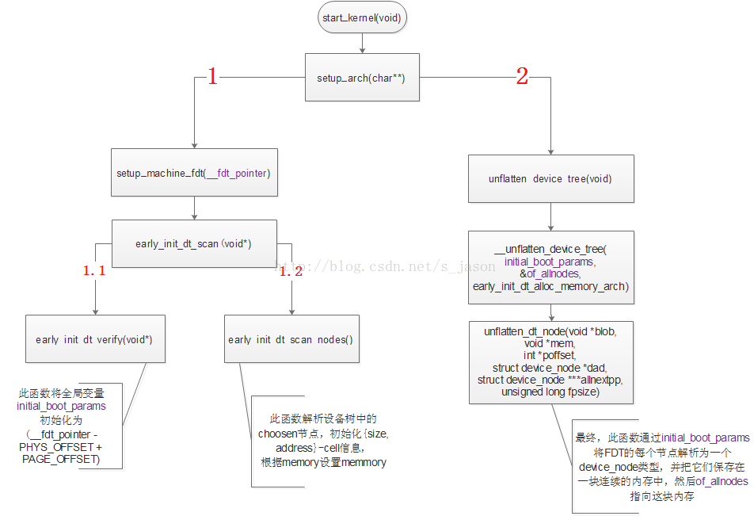
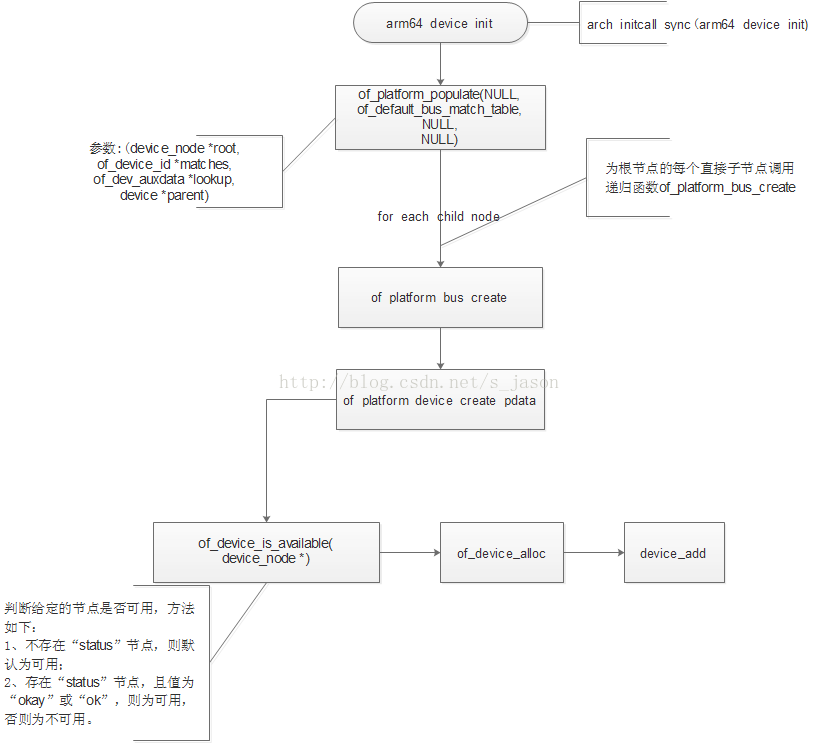

# README

本文将以系统开机的执行顺序简要分析kernel如何通过DTB文件进行设备的注册。
注：本文不涉及设备树的语法和使用。

# 参考

* [高通平台中简单了解DTB](https://blog.csdn.net/s_jason/article/details/73864696)

# kernel如何获取DTB文件(ARM64架构)

设备树的源文件为.dts和.dtsi文件，经过设备树专用的编译器编译后生成一个二进制的DTB(Device tree Blob)文件。在系统启动时，DTB文件由bootloader加载进内存，此时，内存中的DTB成为FDT(Flat Device Tree)。Bootloader启动kernel时，将FDT的地址传给Kernel，在Kernel启动的汇编阶段，将FDT地址保存在“x5”寄存器中，并定义8字节变量“__fdt_pointer”，用来表示该地址，以供Kernel的C代码使用。

# Kernel解析FDT

以ARM64的芯片为例。内核解析FDT的入口在文件“arch/arm64/kernel/setup.c”中,由setup_arch(char** cmdline)调用，而setup_arch由start_kernel调用。代码流程如下图：



 图中的执行顺序为 "1"--->"1.1"--->"1.2"--->"2"。

如上图(图 1)，setup_arch函数以“__fdt_pointer”为参数调用setup_machine_fdt函数。从汇编阶段传来的参数"__fdt_pointer"是一个FDT的地址，且是一个物理地址，不宜直接使用。setup_machine_fdt的一个工作(图1中的1.1)就是将"__fdt_pointer"转化为页内偏移地址，并赋值给全局变量"initial_boot_params"，之后所有关于FDT的操作都将基于"initial_boot_params"变量。在讨论setup_machine_fdt函数的另一个工作(图1中的1.2)之前，需要认识一下arm平台设备树根节点下的内容。以下为一个示例：

            
```c
  / {

       model = "Qualcomm Technologies, Inc. MSM 8996";

       compatible = "qcom,msm8996";

       qcom,msm-id = <246 0x0>;

       qcom,pmic-id = <0x20009 0x2000A 0x0 0x0>;

       interrupt-parent = <&intc>;

   

       chosen {

           bootargs = "sched_enable_hmp=1 sched_enable_power_aware=1";

       };

        

        aliases {
                sdhc1 = &sdhc_1;
                ...

        };
        

        cpus {
                ...
        };
        
        soc: soc { };
        
        reserved-memory {
                ...
        };
 };
```

 在上图中我省略了很多子节点的内容，但这影响不大，因为我们只是要简单认识设备树根节点下有哪些直接子节点。为什么要认识它们？因为我接下来要讲的东西和它们有关。

*arm平台的习惯是几乎把所有外设节点放置在"SOC"节点下面。而跟根节点的直接子节点除了"SOC”节点之外，还有其他一些节点，如上面的示例，这些节点比较特殊，不像外设节点一样生产device，然后通过匹配流程与驱动进行绑定，它们的属性可能定义的是kernel启动参数，比如"choosen"节点，这些信息在kernel启动的早期就会用到，而此时设备模型还没有初始化完成，因而先先解析这些参数供内核初始化，而其他他设备节点则等待内核的其他一些模块初始化完成后再解析。


真正的设备节点是如何别解析的呢？流程见下图(arm64)：



设备节点的解析是在"arch_initcall_sync"阶段，从arm64_device_init开始，调用of_platform_populate函数，并传入设备树的根节点作为该函数的实参。之后的核心过程是为设备树下根节点下的每个直接子节点调用递归函数"of_platform_bus_create"，该函数通过of_device_is_available判断指定节点的状态是否为disable,如果否，则为该节点创建一个platform_device结构体。通过递归调用，设备树根节点下每个非disable状态的节点创建一个platform_device结构体。