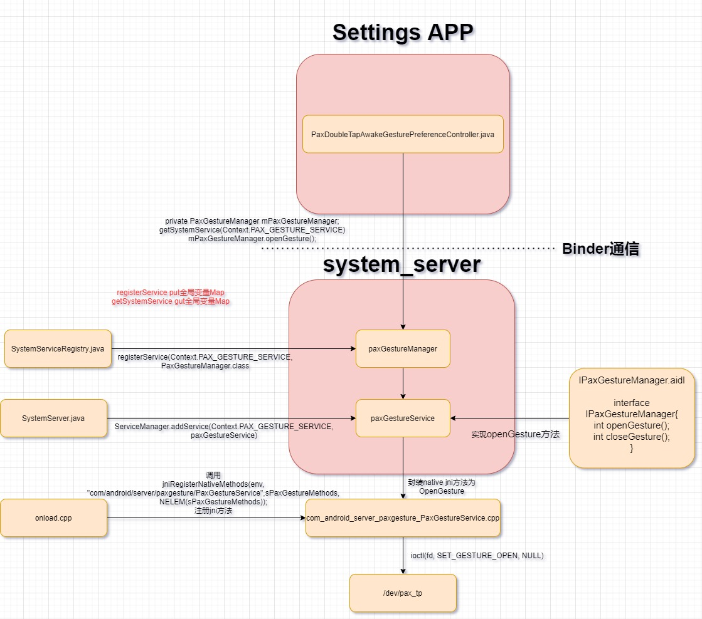

# 概述

Android framework开发人员经常需要调用到底层的接口和底层通信，比如binder调用，下面介绍几种常用的方式。

# 1.根据属性变化写sys节点

以下这种方式比较简单，建立一个属性触发器(trigger)，上层通过设置属性值，当rc检测到属性`vendor.pax.ctrl.exdev.state`有任何变化，往`sys/class/switch/sp_ready_gpio/state`节点里写入该属性值。

```diff
--- a/android/device/qcom/sc138/init.L1400.common.rc
+++ b/android/device/qcom/sc138/init.L1400.common.rc
@@ -17,3 +17,9 @@ on boot

 on property:sys.boot_completed=1
    write /sys/class/pax/boot_state/state 1
+
+#lib@paxsz.com set D135 state
+
+on property:vendor.pax.ctrl.exdev.state=*
+    write /sys/class/switch/sp_ready_gpio/state ${vendor.pax.ctrl.exdev.state}
```

# 2.提供aidl接口调用jni直接io方式

参考：
* [aidl调用jni直接ioctrl方式.patch](refers/aidl调用jni直接ioctrl方式.patch)

以下是具体设置应用调用jni方法的流程：



下面具体看一下jni实现：

```C++
#define LOG_TAG "PaxGestureService"

#include <nativehelper/JNIHelp.h>
#include "jni.h"
#include <utils/Log.h>
#include <utils/misc.h>
#include <utils/String8.h>

#include <fcntl.h>
#include <stdio.h>
#include <string.h>
#include <sys/epoll.h>
#include <sys/timerfd.h>
#include <sys/types.h>
#include <stdlib.h>
#include <errno.h>
#include <unistd.h>
#include <linux/ioctl.h>

#include <array>
#include <memory>

#define GESTURE_DEV                "/dev/pax_tp"
#define SET_GESTURE_OPEN           _IOW('b', 0, int)
#define SET_GESTURE_CLOSE          _IOW('b', 1, int)

namespace android {

static jint android_server_paxgesture_PaxGestureService_nativeOpenGesture(JNIEnv* env, jobject obj)
{
    int fd;
    int res;
    fd = open(GESTURE_DEV, O_RDWR);
    if (fd <0) {
        ALOGE("Unable to open /dev/pax_tp");
        return -1;
    }

    res = ioctl(fd, SET_GESTURE_OPEN, NULL);
    if (res < 0) {
         ALOGE("ioctl->SET_GESTURE_OPEN failed:%d", res);
         return res;
    }
    ALOGD("ioctl->SET_GESTURE_OPEN open gesture success");
    close(fd);
    return 0;
}

static jint android_server_paxgesture_PaxGestureService_nativeCloseGesture(JNIEnv* env, jobject obj)
{
    int fd;
    int res;
    fd = open(GESTURE_DEV, O_RDWR);
    if (fd <0) {
        ALOGE("Unable to open /dev/pax_tp");
                return -1;
    }

    res = ioctl(fd, SET_GESTURE_CLOSE, NULL);
    if (res < 0) {
         ALOGE("ioctl->SET_GESTURE_CLOSE failed:%d", res);
                 return res;
    }
    ALOGD("ioctl->SET_GESTURE_CLOSE close gesture success");
    close(fd);
        return 0;
}

//add by huling@paxsz.com
static const JNINativeMethod sPaxGestureMethods[] = {
    /* name, signature, funcPtr */
    {"nativeOpenGesture", "()I", (void*)android_server_paxgesture_PaxGestureService_nativeOpenGesture},
    {"nativeCloseGesture", "()I", (void*)android_server_paxgesture_PaxGestureService_nativeCloseGesture},
};

int register_android_server_paxgesture_PaxGestureService(JNIEnv* env)
{
    return jniRegisterNativeMethods(env, "com/android/server/paxgesture/PaxGestureService",
                                    sPaxGestureMethods, NELEM(sPaxGestureMethods));
}
```

以上方法的好处就是可以跨过hal层，jni直接io操作驱动节点，只需要配置权限就行了。