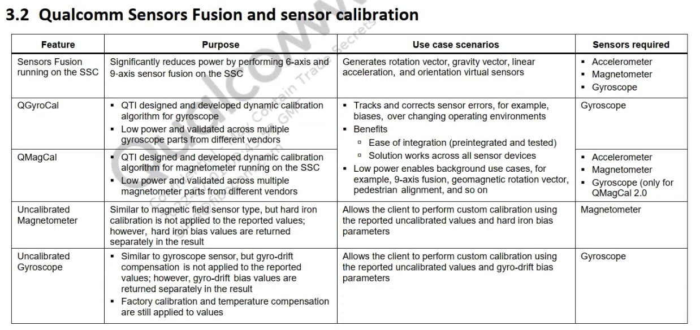
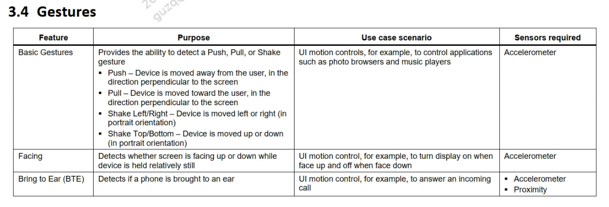
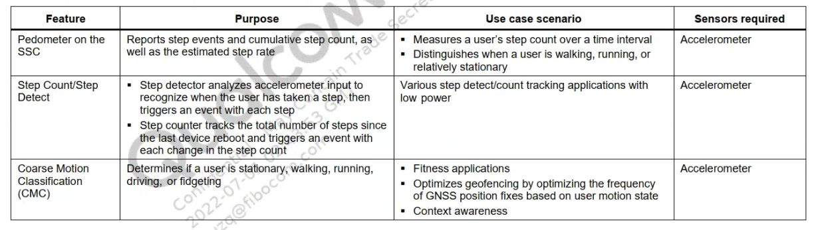

# 概述

qcom平台虚拟传感器介绍。

Android中引入的传感器分为两种：原始传感器（物理传感器）和合成传感器（虚拟/复合传感器）。 原始传感器给出从传感器获得的原始数据，
而一台原始传感器对应的是一台Android设备中实际存在的物理传感器组件。 合成传感器结合多个原始传感器的原始数据，或修改原始传输
传感器数据在应用代码和底层设备之间提供抽象层，为上层业务提供服务。

# 简介

* qcom支持的Android SSC架构下的传感器分为以下几大类：
  * Motion detectiob（动作察觉）
  * Qcom Sensors Fusion and sensor calibration（高通sensor融合及校准）
  * Power saving（低功耗）
  * Gestures（手势）
  * Activity monitoring/motion classification（运动检测及类型识别）

# Motion detection

依赖传感器：acc

* 绝对动作检测应用场景：
检测设备是否在绝对静置状态，可用于睡眠追踪。

* 相对动作检测应用场景：
检测设备相对于用户的静止状态，例如：当设备稳定地握在用户手中时。
被运用于其他算法中，也可用于检测其他运动的手势，例如拿起电话。

* 重大动作检测特点：
  * 低功耗。
  * 当重大动作发生后将唤醒设备。
* 应用场景：
  * 

# Qcom Sensors Fusion and sensor calibration

依赖传感器：acc/magn/gyro

主要包括旋转矢量、重力矢量、线性加速度和方向虚拟传感器。

QGroyCal/QmagCal特点:
* 低功耗
* 动态校准算法

* Uncalibrated Magn/Gyros特点：
  * 未校准传感器可提供更多的原始结果，可能包括一些偏差，还包含校准后更正结果中的少数“激增”值。一些应用可能更倾向于使用这些未校准结果，因为此类结果更流畅、可靠。例如，如果应用试图自己进行传感器融合，则引入校准可能会使结果失真。

# Power saving

# Gestures

依赖传感器：acc/proximity

* 检测特点：
  * ui 运动控制，例如控制照片浏览器和音乐播放器等应用程序。
  * 在设备相对静止时检测屏幕是朝上还是朝下。
  * ui 运动控制，例如，接听来电。

# Activity monitoring/motion classification

依赖传感器：acc

* 检测特点：
  * 步数统计
  * 步测计
  * 运动类型识别(走路、跑步、开车等)

# Android Sensor Type

目前高通`SEE Sensor`架构支持的所有物理/复合传感器如下列表：

