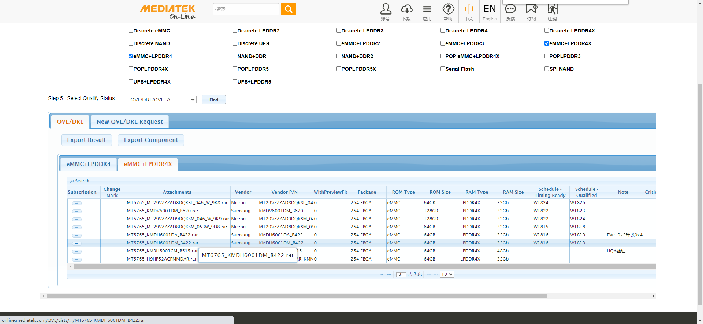
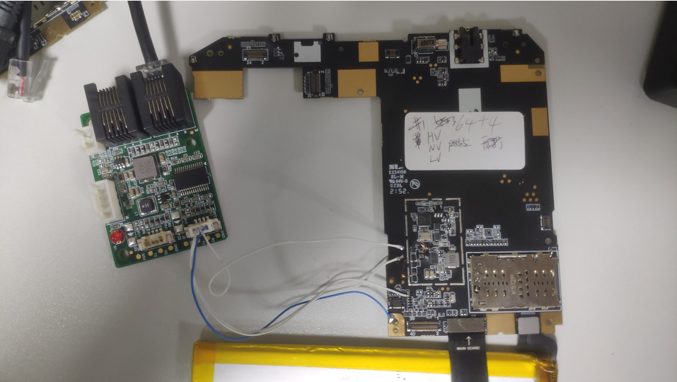
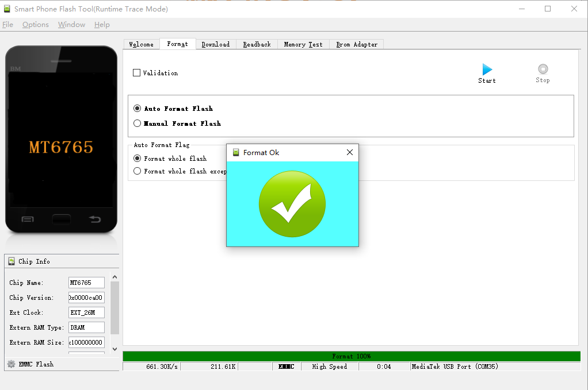
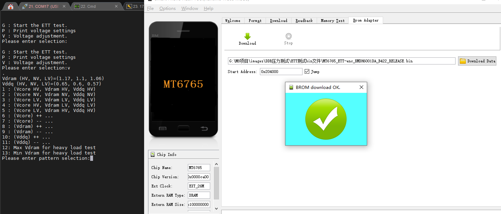
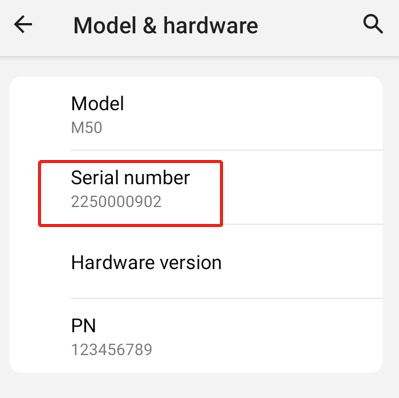
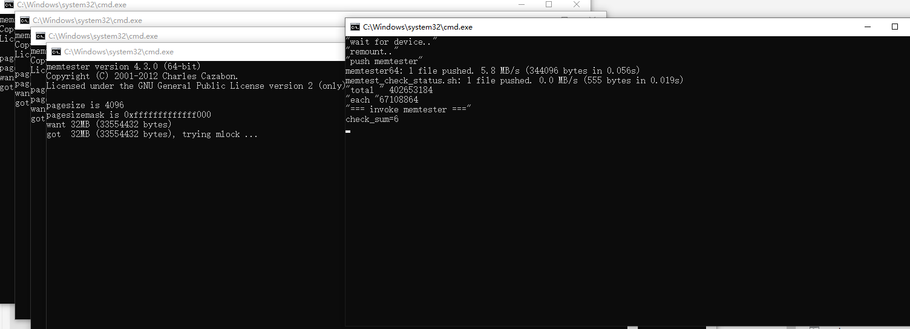

# MTK平台emcp测试详解

* [特别提醒](#特别提醒)
* [参考文档](#参考文档)
* [一.ETT实验过程](#一ETT实验过程)
  * [1.ett测试条件](#1ett测试条件)
  * [2.ett测试过程](#2ett测试过程)
    * [Step1.测试型号](#Step1测试型号)
    * [Step2.bin文件需要从mtk online上下载](#Step2bin文件需要从mtk-online上下载)
    * [Step3.接入debug串口到电脑](#Step3接入debug串口到电脑)
    * [Step4.格式化单板](#Step4格式化单板)
    * [Step5.连接USB完成ETT bin下载](#Step5连接USB完成ETT-bin下载)
    * [Step6.转到超级终端调电压](#Step6转到超级终端调电压)
    * [Step7.电压粗调(HV, NV, LV)](#Step7电压粗调HV-NV-LV)
    * [Step9.电压测量](#Step9电压测量)
    * [Step10.ETT测试PASS判断标准](#Step10ETT测试PASS判断标准)
* [二.StressTest电压测量](#二StressTest电压测量)
* [三.Stress test测试步骤(需进行高低常温测试、不能拔出USB)](#三Stress-test测试步骤需进行高低常温测试不能拔出USB)
    * [Step1： 搭建环境](#Step1-搭建环境)
  * [Step2.根据测试场景选择对应的load (HTLV/LTHV/NTNV)](#Step2根据测试场景选择对应的load-HTLVLTHVNTNV)
  * [Step3.设置device id](#Step3设置device-id)
  * [Step4. Install_Nenamark2.bat](#Step4-InstallNenamark2bat)
  * [Step5. Push.bat](#Step5-Pushbat)
  * [Step6. OPP table配置](#Step6-OPP-table配置)
  * [Step7. run.sh && vcorefs_cervino.sh](#Step7-runsh--vcorefscervinosh)
  * [Step8. start_DVFS_N2_Mem_test.bat](#Step8-startDVFSN2Memtestbat)
  * [Step9. 注意事项](#Step9-注意事项)
  * [Step10. Nenamark2 + DVFS for Fast-K测试步骤](#Step10-Nenamark2--DVFS-for-Fast-K测试步骤)
* [四.Suspend/Resume测试步骤(需要拔出USB、不需要高低温测试)](#四SuspendResume测试步骤需要拔出USB不需要高低温测试)
* [五.REBOOT测试步骤(不需要高低温测试、不能拔出USB)](#五REBOOT测试步骤不需要高低温测试不能拔出USB)
  * [1.DDR reserve mode Reboot测试步骤](#1DDR-reserve-mode-Reboot测试步骤)
  * [2.Full-K Reboot测试步骤](#2Full-K-Reboot测试步骤)
  * [3.Fast-k Reboot测试步骤](#3Fast-k-Reboot测试步骤)
* [六.判断测试pass的方法](#六判断测试pass的方法)

使用ETT工具，自动同步memory设备，调试一组最优化的memory时序设定用于量产，同时检测memory接口的稳定性,避免因时序不稳定导致的系列问题；
因此，在导入新layout或者memory chip的时候都请跑一遍ETT和压力测试。

## 特别提醒

1. 目前所有测试项都可以使用userdebug软件，请注意`DDR reserve mode Reboot测试`和`Fast-k Reboot测试`两个测试项需要抓取uart log。
2. 需要高温下做压力的测试项， PCB的温度很快上升到100度，就会触发Thermal关机，请务必用假电池，并把NTC电阻换成10K。
3. 请注意有的测试项需要接usb，有的需要测高低温。
4. 所有测试项都不需要打开MTK DebugLoggerUI记录log。
5. 请确保低温测试温度-20度，常温25度，高温65度。

## 参考文档

* [0001_MT6765_62_ETT_&_stress_test_reference_for_LP4X_V1.6.pdf](refers/0001_MT6765_62_ETT_&_stress_test_reference_for_LP4X_V1.6.pdf)

## 一.ETT实验过程

### 1.ett测试条件

* 未烧录过efuse（镜像验签功能）的单板。
* 下载过ett程序的板子请务必先Format whole flash。
* 工具:支持MT6765_62平台的Flash tool(W1748以后版本)。
* ETT BIN说明:https://online.mediatek.com/qvl/_layouts/15/mol/qvl/ext/QVLHomeExternal.aspx 下载对应平台、对应memory的ETT bin。
* 必须用电源给VBAT供电，高低温环境下测试不能使用电池。
* 手机上的NTC需要下拉10K电阻到GND， 模拟电池本身的NTC。

### 2.ett测试过程

#### Step1.测试型号

  * [32+3：KMDX60018M_B425]
  * [64+4：KMDH6001DA-B422]

#### Step2.bin文件需要从mtk online上下载

* [下载链接](https://online.mediatek.com/qvl/_layouts/15/mol/qvl/ext/QVLHomeExternal.aspx?FilterPlatform=y)



> 目前M8项目ETT bin请参考`DDR压力测试\ETT测试bin文件`路径下的文件。


#### Step3.接入debug串口到电脑



串口工具波特率设置为`921600`:


#### Step4.格式化单板

打开Flash tool，在download 页面加载对应平台的scatter-loading file，下载过ett程序的板子请务必先Format whole flash：

加载对应平台的scatter-loading file：


Format whole flash:



#### Step5.连接USB完成ETT bin下载

组合键Ctrl+Alt+A调出flash tool的brom Adapter->选择ETT bin->设置start address(0x204000)->勾上Jump->点击download。


#### Step6.转到超级终端调电压



#### Step7.电压粗调(HV, NV, LV)

 此时测量的电压值不准确，需要在第九步用万用表测试电压。

 #### Step8.开始ETT 测试

在串口软件中主菜单选G开始ETT 测试，如果过程中卡住，请重新多测试几遍，看最终是否能够跑通。


#### Step9.电压测量

ETT 测试时间不长，完成之后 ETT log就不会再有log记录，此时不要下电请用万用表测试对应环境温度的电压， 确认Vcore,Vmem(VDD2), Vddq电压在20mV范围以内即可。


#### Step10.ETT测试PASS判断标准

* 根据MTK文档描述，判断成功的两个依据：
  * 1.Dram Data rate = 3200表示memery能跑到3200MHZ。
  * 2.全部都是PASS。

* 具体请参考其中文档MT6765_62 ETT & stress test reference for LP4X V1.6.pdf，提出了以下几个测试点：

- ETT test step by step (ETT测试主要是调试一组最优化的memory时序设定用于量产，需要空板(emmc未烧录)+焊接串口) 这块主要是软件人员配合硬件在新DDR上做验证。
- MTK Eye-Scan Function (判断ETT测试结果)

例子：EET测试完，并提示成功，打印如下：

```log

[HQA] information for measurement,      Dram Data rate = 3200
[Read Voltage]
[HQALOG] 3200 Vcore_HQA = 800000
[HQALOG] 3200 Vdram_HQA = 1125000
[HQALOG] 3200 Vddq_HQA = 600000


[Cmd Bus Training window]
VrefCA Range : 1
VrefCA
[HQALOG] 3200 VrefCA Channel0 Rank0 41
[HQALOG] 3200 VrefCA Channel0 Rank1 41
[HQALOG] 3200 VrefCA Channel1 Rank0 46
[HQALOG] 3200 VrefCA Channel1 Rank1 42
CA_Window
[HQALOG] 3200 CA_Window Channel0 Rank0 57 (bit 3)
[HQALOG] 3200 CA_Window Channel0 Rank1 56 (bit 3)
[HQALOG] 3200 CA_Window Channel1 Rank0 57 (bit 3)
[HQALOG] 3200 CA_Window Channel1 Rank1 56 (bit 4)
CA Min Window(%)
[HQALOG] 3200 CA_Window(%) Channel0 Rank0 90% (PASS)
[HQALOG] 3200 CA_Window(%) Channel0 Rank1 88% (PASS)
[HQALOG] 3200 CA_Window(%) Channel1 Rank0 90% (PASS)
[HQALOG] 3200 CA_Window(%) Channel1 Rank1 88% (PASS)

[RX minimum per bit window]
Delaycell measurement(/100ps)
VrefRX
[HQALOG] 3200 VrefRX Channel0 Rank0 12
[HQALOG] 3200 VrefRX Channel0 Rank1 11
[HQALOG] 3200 VrefRX Channel1 Rank0 12
[HQALOG] 3200 VrefRX Channel1 Rank1 12
RX_Window
[HQALOG] 3200 RX_Window Channel0 Rank0 34 (bit 7)
[HQALOG] 3200 RX_Window Channel0 Rank1 35 (bit 2)
[HQALOG] 3200 RX_Window Channel1 Rank0 36 (bit 12)
[HQALOG] 3200 RX_Window Channel1 Rank1 36 (bit 3)
RX Window(%)
[HQALOG] 3200 RX_Window(%) Channel0 Rank0 22134/100ps (71%) (PASS)
[HQALOG] 3200 RX_Window(%) Channel0 Rank1 22785/100ps (73%) (PASS)
[HQALOG] 3200 RX_Window(%) Channel1 Rank0 23436/100ps (75%) (PASS)
[HQALOG] 3200 RX_Window(%) Channel1 Rank1 23436/100ps (75%) (PASS)


[TX minimum per bit window]
VrefDQ Range : 0
VrefDQ
[HQALOG] 3200 VrefDQ Channel0 Rank0 20
[HQALOG] 3200 VrefDQ Channel0 Rank1 20
[HQALOG] 3200 VrefDQ Channel1 Rank0 26
[HQALOG] 3200 VrefDQ Channel1 Rank1 22
TX_Window
[HQALOG] 3200 TX_Window Channel0 Rank0 20 (bit 4)
[HQALOG] 3200 TX_Window Channel0 Rank1 23 (bit 5)
[HQALOG] 3200 TX_Window Channel1 Rank0 21 (bit 2)
[HQALOG] 3200 TX_Window Channel1 Rank1 23 (bit 2)
TX Min Window(%)
[HQALOG] 3200 TX_Window(%) Channel0 Rank0 63% (PASS)
[HQALOG] 3200 TX_Window(%) Channel0 Rank1 72% (PASS)
[HQALOG] 3200 TX_Window(%) Channel1 Rank0 66% (PASS)
[HQALOG] 3200 TX_Window(%) Channel1 Rank1 72% (PASS)
```

## 二.StressTest电压测量

为了验证DRAM的稳定性，接下来便做Stress test，stress test前测量Vcore电压需要在开机后测量，并参考以下说明，设定固定的Vcore档位后再用示波器测量。

> 特别提醒：正常流程，ETT高低常温度必须一次性全部pass了，才做StressTest电压测量，不然烧录完userdebug软件，机器开机会走验签流程，无法进行ETT测试。


1.测量电压时， 首先单板下载userdebug软件，如测量高低温下的电压，然后请注意分别download对应HV/LV的preloader bin，路径`DDR压力测试\preloader镜像`，开机后测试。

* 2.查看当前vcore的DVFS OPP table，如下图所示显示NV电压，有的cat出来OPP13，OPP14是0.675V或0.65V，以cat出来的值为准，测量电压只要与cat值一致即可。

```log
130|PAYTABLETM8:/ # cat sys/devices/platform/10012000.dvfsrc/10012000.dvfsrc:dvfsrc-up/dvfsrc_opp_table
FW_TYPE : 1
NUM_VCORE_OPP : 4
NUM_DDR_OPP : 3
NUM_DVFSRC_OPP : 16

[OPP0 ]: 800000   uv 3200000  khz
[OPP1 ]: 800000   uv 3200000  khz
[OPP2 ]: 800000   uv 3200000  khz
[OPP3 ]: 800000   uv 2400000  khz
[OPP4 ]: 800000   uv 3200000  khz
[OPP5 ]: 800000   uv 2400000  khz
[OPP6 ]: 800000   uv 3200000  khz
[OPP7 ]: 800000   uv 2400000  khz
[OPP8 ]: 700000   uv 2400000  khz
[OPP9 ]: 700000   uv 2400000  khz
[OPP10]: 700000   uv 1534000  khz
[OPP11]: 700000   uv 2400000  khz
[OPP12]: 700000   uv 1534000  khz
[OPP13]: 650000   uv 1534000  khz
[OPP14]: 650000   uv 1534000  khz
[OPP15]: 650000   uv 1534000  khz
```

* 3.执行adb命令分别固定5档位，每执行一条命令固定一个档位，测量一次Vcore电压， 共执行5次命令测量5次，看和设定的电压差异多大，默认测量到的是Opp0的Vcore电压。后续测量到的电压要覆盖到三种频率（3200,2400,1534）， 三种电压（0.8， 0.7,0.65）即可，例如：频率2400电压0.8v可以测试OPP7也可以测试OPP8。

```log
1.写入OPP10档位(1534MHZ)：
echo 10 > sys/devices/platform/10012000.dvfsrc/10012000.dvfsrc:dvfsrc-debug/dvfsrc_force_vcore_dvfs_opp
2.查看是否档位设置成功。
cat sys/devices/platform/10012000.dvfsrc/10012000.dvfsrc:dvfsrc-debug/dvfsrc_dump
Vcore     : 700000   uv
DDR       : 1534000  khz
GPS_HOPPING: 0
PTPOD_0   : 00100090
PTPOD_10  : 000f9855
INFO2     : 00000000
3.实测vcore电压0.7v

2400MHZ：
echo 7 > sys/devices/platform/10012000.dvfsrc/10012000.dvfsrc:dvfsrc-debug/dvfsrc_force_vcore_dvfs_opp
实测vcore电压0.8v

3200MHZ：
echo 13 > sys/devices/platform/10012000.dvfsrc/10012000.dvfsrc:dvfsrc-debug/dvfsrc_force_vcore_dvfs_opp
实测vcore电压0.65v
```

HV和LV测量电压方法一样，测量时需要覆盖三种频率，下载不同的preloader镜像。

## 三.Stress test测试步骤(需进行高低常温测试、不能拔出USB)

> 该测试项主要两个测试点：

 * 机器在不同温度下NenaMark2硬件图形处理能力压力测试。
 * 机器在不同温度下DVFS功能memtest测试，memtest用来考察内存稳定性，尤其适合对对内存不同频率、时序进行切换之后的检验。

#### Step1： 搭建环境


* Download and install JAVA：
  * `http://www.java.com`
  * `Install Android SDK to have ADB.`
  * `http://developer.android.com/sdk/index.html`
  * `Remember to add ADB in your PATH.`
  * `设置adb环境变量：EX: C:\ path = %path%; YOU_ADB_PATH`
  * `获取ADB之后，在ADB安装位置的tool文件夹下产生一个monkeyrunner.bat的文件，请把该文件的路径添加到计算机的PATH， EX： ADB装在D:\Program Files， monkeyrunner.bat位于D:\Program Files\Android\android-sdk\tools，把D:\Program Files\Android\android-sdk\tools添加到PC系统环境变量的PATH；`
* Install a python environment to be able to run python programs.
  * `For example, download Python 2.7.3 Windows Installer (Windows binary -- does not include source) from http://www.python.org/getit/`
* DVFS_Nenamark_Memtester_Script，suspend_and_DVFS script在绝对路径当中不能包含空格和中文.

* 根据上面的环境变量设置，请参考以下：


### Step2.根据测试场景选择对应的load (HTLV/LTHV/NTNV)

* 高温测试请下载`DDR压力测试\preloader镜像\HV\preloader_k62v1_64_pax.bin`镜像，低温则对应`LV`目录，常温对应`NV`目录。下载后第一次开机进行如下设置:
  * 设置>显示>休眠>30分钟，
  * 设置>Developer options>stay awake 设置为不休眠
  * 手机设置为飞行模式，关闭MTK mobile log
  * 如果在65度的高温下做压力测试， PCB的温度很快上升到100度，就会触发Thermal关机，请务必用假电池，并把NTC电阻换成10K。

注意: Nenamark的测试有可能上传手机资讯, 测试时请不要连接网络,如有
疑虑, 请不要进行此项测试， 脚本会关闭modem和wifi。

### Step3.设置device id

`DVFS_Nenamark_memtest_script_LPDDR4`文件夹中编辑`start_DVFS_N2_Mem_test.bat`脚本。 把set deviceid=-s 0x?? 设置成所测试手机的`device id`,如下图所示，然后保存，注意`deviceid`即为设备SN号，可用`adb devices`或者在设置菜单中查询`Serial number`。




### Step4. Install_Nenamark2.bat


安装完毕会自动结束，可以在手机里面找到一个NenaMark2的图标, 双击会出现 choose what to allow NenaMark2 to access 的讯息, 点击 continue给权限。然后双击Nenamark2的图标，点击run需要先跑一次3D动画。

### Step5. Push.bat

编辑Push.bat脚本，把set deviceid=-s 0x?? 设置成所测试手机的deviceid，双击运行Push.bat(出现下图并退出)。

这里需要配置n2_run文件中的run键 x/y坐标，根据文档`display the x and y point.pdf`进行配置，修改点如下：


### Step6. OPP table配置

* 目前不需要双击`set_opp_table_HV.bat`或者`set_opp_table_LV.bat`进行配置，直接是在软件里面写死的，做HV/LV测试时只需下载相应的preloader镜像即可。

### Step7. run.sh && vcorefs_cervino.sh

执行以下指令：

```log
C:\Users\wugangnan>adb shell
PAYTABLETM8:/ # sh /data/run.sh &
PAYTABLETM8:/ # sh /data/vcorefs_cervino.sh &
```

### Step8. start_DVFS_N2_Mem_test.bat

DVFS_Nenamark_memtest_script_LPDDR4文件夹中双击start_DVFS_N2_Mem_test.bat脚本，会弹出n个框图,同时手机屏幕上3D动画在自动跑动,如果3D动画无法自动run请查看文档display the x and y point.pdf进行设置，这个脚本是测试DDR DVFS功能压力测试。



### Step9. 注意事项

* 此时千万不要拔掉USB，需要跑8小时Stress test
* 请参看‘判断测试pass的方法’对测试结果进行分析
* 重复上述步骤将>3部手机的HTLV\LTHV\NTNV所有条件下的Stress test完成。
* 高温环境测试换用低压preloader bin, 低温环境测试换用高压preloader bin, 常温环境用
常温preloader bin.
* 每次变化环境都要重新download.

### Step10. Nenamark2 + DVFS for Fast-K测试步骤

根据文档描述，就是烧录高温/低温的preloader进行相同的测试。


## 四.Suspend/Resume测试步骤(需要拔出USB、不需要高低温测试)

> 该测试项主要针对机器休眠唤醒功能进行压力测试。

* Preloader bin使用默认常温的即可。
* 屏幕不要设置为always on， 手机设置为飞行模式，关闭MTK mobile log。
* Step1. 打开suspend_test_v0.4文件夹，手机开debug功能。
* Step2.连接手机，双击suspend_loop_push.bat脚本，运行完毕后按任意键结束。
* Step3.使用paxtool.bat工具unlock功能将机器解锁。
* 执行`adb remount`。
* Step4. 调出一个cmd命令框，输入如下命令。
  * `adb shell`
  * `cd /data`
  * `nohup /data/suspend_loop.sh &`
* Step4.拔掉usb,拔掉usb,拔掉usb, 重要的事情说三次。

> 可接power monitor，也可以接usb adapter，不要直接用电脑供电给手机,测试时间12个小时。


## 五.REBOOT测试步骤(不需要高低温测试、不能拔出USB)

> 该测试项主要针对机器DDR在`Reserve mode`、`Full-K mode`、`Fast-k mode`三种模式下重启功能稳定性测试，且全部都只要在常温下测试就行了，以下是三种DDR工作模式解释：

* `Reserve mode`： DDR_RESERVE_MODE代表重新开机时保留DDR上次的参数信息；重开机时preloader不做ddr的校准，不会清除DDR上的数据。对于user版本，请关闭此宏，这样在手机发生故障后可以通过下一次开机重新做DDR的初始化来让手机有机会恢复正常的状态，这样可以降低客退机的概率。
* `Full-K/Fast-k mode`：K代表calibration，目前MTK的架构为第一次开机preloader做完整的full K.只要做完一次full K，从这次以后的开机均走fask K流程。能节约2~3s左右。目的是减少不必要的校准项目，加快开机速度。->依赖于flash中的特殊分区储存参数。

> 注意，该项测试需要将电脑设置为永不休眠模式，不然Windows会休眠，中断测试。

### 1.DDR reserve mode Reboot测试步骤

DDR Reserve mode test： 

* Step1. Preloader bin使用默认的即可，屏幕不要设置为always on，手机设置为飞行模式，关闭MTK mobile log。
* Step2.打开reboot_script文件夹，编辑reboot_ddr_reserve_mode.bat把device id改成测试机器 id后保存，双击该脚本出现下图的框图，和其他reboot比较区别在于有 ”reboot with ddr reserve mode”字样 Note:Opp table 每16次循环。
* Step3.需要抓UART log进行分析， 需要抓UART log进行分析， 需要抓UART log进行分析,重要的事情说三遍，测试时间12小时。
* Step4.请参看‘判断测试pass的方法1和3’ 对测试结果进行分析。
* Step5.请打开UART log，对UART log进行关键字搜索,如果log太大请用File-Splitter （网上下载） 把log分割成小份进行分析。
* 测试Fail的关键字搜索“[RGU] WDT DDR reserve mode FAIL!”。
* 测试PASS的关键字搜索`DDR RESERVED`会出现如下log表示测试pass。
```log
[RGU] WDT DDR reserve mode success! 1387F1
[DDR Reserve] DCS/DVFSRC success! (dcs_en=0, dvfsrc_en=1)
[RGU] WDT DDR reserve mode success! 1387F1
[RGU] DDR RESERVE Success 1
[DDR Reserve] release dram from self-refresh PASS!
```
* Step6. 重复上述步骤将>3部手机在常温条件下reboot完成。

### 2.Full-K Reboot测试步骤

* Step1. 首先使用flashtool工具烧录`DDR压力测试\MT6762平台DDR测试工具\reboot_script\reboot_full_k\preloader_k62v1_64_pax.bin`。
* Step2. 屏幕不要设置为always on，手机设置为飞行模式，关闭MTK mobile log。
* Step3. 编辑 reboot_full_k.bat把device id改成测试机器id后保存，双击该脚本。
  * Note1: Full k 每5次更新。
  * Note2：脚本若无device id，则不需修改。
* Step4. opp table显示当前频率档位。
* 测试时长：
  * 测试时间12个小时。
* Step5.请参看`判断测试pass的方法1和3`对测试结果进行分析。
* Step6. 重复上述步骤将>3部手机在常温条件下reboot完成。


### 3.Fast-k Reboot测试步骤

* 此测试项目只对LPDDR4， LPDDR3不需要做这个项目， Preloader bin使用`LV bin（低温preloader镜像）`在常温下测试。
* Fast-k Stress test目的：下载软件后第一次开机的校准数据需要保存下来，为后续测试所用。
* Step1.打开reboot_script文件夹，编辑reboot_fast_K.bat把device id改成自己的。
* Step2. 双击reboot_fast_K.bat进行测试，测试需要12小时。
* Step3.请参看`判断测试pass的方法`对测试结果进行分析。
* Step4.请打开UART log，对UART log进行关键字搜索， 测试Fail的关键字搜索`Save calibration result to emmc`，测试PASS的关键字搜索`Bypass saving calibration result to emmc`。
* Step5. 重复上述步骤将>3部手机在NT条件下reboot完成。

> Note：若上述Fail和PASS关键字均没有搜索到, 请先告知开发自行检查code,看是否有修改掉对应log。

## 六.判断测试pass的方法

* 1. 连续测试后仍能正常运行：测试N小时后还在连续跑测试。
* 2. 如果有跑memtester的项目：连续测试后memtester还是在跑，如果memtester停止下来就是fail。

memtester的窗口停掉了会出现Error detected，如下图所示：


请运行collect_memtest_log.bat，会出现一个log文件夹把memtester fail log直接抓出来，打包上传给MTK分析即可。

* 3.在下面两个路径下检查是否有这4个字样： KE,HWT， HW_reboot, MEMTEST,如果下面两个路径中有任何一个字样表示fail,没有那3个字样表示pass：

```log
/data/vendor/aee_exp 
/data/aee_exp 
```


上述3个条件任一不满足即可判定为 fail, 这时请将log发送给开发分析。

