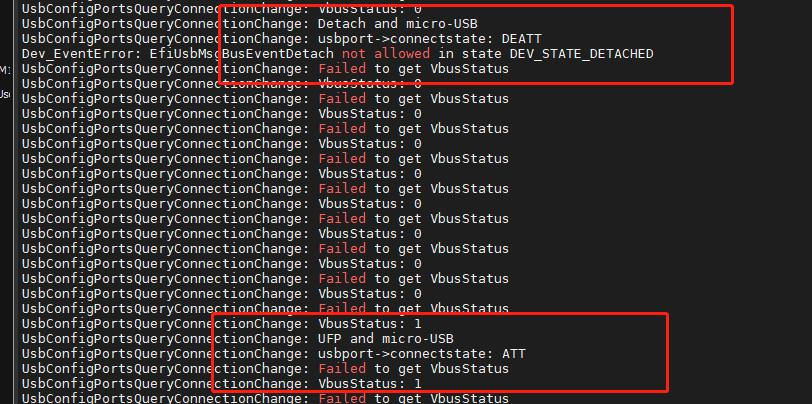

# 概述

目前usb在fastboot模式下无法识别，跟进一下代码看看什么原因。

# USB配置

* USB类型`QcomPkg/Include/Protocol/EFIUsbConfig.h`:
```C++
/** @addtogroup efi_usbConfig_data_types
@{ */
/**
  USB core id.
*/
typedef enum {
  USB_CORE_0 = 0,      /**< Core0. */
  USB_CORE_1,          /**< Core1. */
  USB_CORE_2,          /**< Core2. */
  USB_CORE_3,          /**< Core3. */
  USB_CORE_MAX_NUM     /**< Invalid Core. */
} QCOM_USB_CORE_NUM;

/**
  USB connector type.
*/
typedef enum {
  USB_CONNECTOR_TYPE_A = 0,  /**< Type-A Connector. */
  USB_CONNECTOR_TYPE_C,      /**< Type-C Connector. */
  USB_CONNECTOR_INVALID      /**< Invalid Connector. */
} QCOM_USB_CONNECTOR_TYPE;


/**
  USB mode
*/
typedef enum {
  /** USB mode type for existing USB Config APIs */
  USB_HOST_MODE_EHCI = 0x00000000,     /**< host controller supporting EHCI interface */
  USB_HOST_MODE_XHCI = 0x00000001,     /**< host controller supporting XHCI interface */
  USB_DEVICE_MODE_HS = 0x00000002,     /**< device controller supporting ChipIdea device mode */
  USB_DEVICE_MODE_SS = 0x00000004,     /**< device controller supporting SNPS device mode */
  /** USB mode type for client to select configuration */
  USB_HOST_MODE      = 0x00000008,     /**< host mode */
  USB_DEVICE_MODE    = 0x00000010,     /**< Device mode */
  USB_DUAL_ROLE_MODE = 0x00000020,     /**< Dual Role */
  /** invalid mode, used for error condition */
  USB_INVALID_MODE   = 0x00010000,     /**< invalid USB mode */
} QCOM_USB_MODE_TYPE;


```

# 代码流程

* usb驱动入口函数：
```C++
QcomPkg/Drivers/UsbConfigDxe/UsbConfigDxe.inf
[Defines]
  INF_VERSION                    = 0x00010005
  BASE_NAME                      = UsbConfigDxe
  FILE_GUID                      = CD823A4D-7DEC-4531-AE5D-4134FA4127B8
  MODULE_TYPE                    = DXE_DRIVER
  VERSION_STRING                 = 1.0
  ENTRY_POINT                    = UsbConfigDriverEntryPoint
```

* usb配置：
```C++
QcomPkg/SocPkg/AgattiPkg/LAA/Core.dsc:
  # USB
  gQcomTokenSpaceGuid.InitUsbControllerOnBoot|FALSE  //开机初始化usb
  gQcomTokenSpaceGuid.HostModeSupported|FALSE // 开机host模式
  gQcomTokenSpaceGuid.USBSmmuStage1Supported|TRUE
  # U1U2 enablement results in SS and SSP instability
  gQcomTokenSpaceGuid.USBU1U2Supported|FALSE
  gQcomTokenSpaceGuid.UsbNoPmic|TRUE //无pmic模式，无usb cc识别，直接配置成device
```

* 识别流程如下：
  * 1. usb配置驱动将启动timer每1s轮询一次usb状态。
  * 2. 
```C++
* UsbConfigDriverEntryPoint // QcomPkg/Drivers/UsbConfigDxe/UsbConfig.c
  └── Status = UsbConfigInit(); // AgattiPkg/Library/UsbConfigLib/UsbConfigLib.c
      ├── if (!FeaturePcdGet(HostModeSupported)) // Check if host mode is supported in UEFI.
      │   └── gUsbConfigDevice[USB_CORE_0_NICOBAR].EnableStaticCfg.UsbMode = USB_DEVICE_MODE_SS; //默认配置成HOST
      ├── Status = gBS->CreateEvent(EVT_TIMER | EVT_NOTIFY_SIGNAL,TPL_CALLBACK,UsbPortStateChgCb, NULL,&PortStateChgEvt);// Create a timer to poll USB Type-C CC Status
      ├──  gBS->SignalEvent(PortStateChgEvt); //立即出发timer
      ├── UsbPortStateChgCb // timer的处理函数
      │   ├── Status = UsbConfigPortsEventHandler（...）//AgattiPkg/Library/UsbConfigLib/UsbConfigUsbPorts.c
      │   │   └── Status = UsbConfigPortsQueryConnectionChange(...)
      │   │       ├── if(FeaturePcdGet(UsbNoPmic) //重要如果配置成UsbNoPmic，直接赋值状态Attach，UFP，接下来在HandlePortPartnerXtach继续获取充电类型
      │   │       │   └── if (UsbPort->ConnectState == FALSE)
      │   │       │       ├── UsbPort->ConnectState = TRUE;
      │   │       │       ├── Message = UsbCfgPortMsgPartnerAttach;
      │   │       │       ├── Payload->UsbTypeCPortMode = USB_TYPEC_PORT_MODE_UFP;
      │   │       │       └── goto ON_EXIT; //直接跳转到出来，下面的都不跑
      │   │       ├── Status = gPwrCtrlProtocol->GetHwInfo(&UsbPortHwInfo); //获取硬件信息，看是支持typec还是micro usb
      │   │       ├── if( (EFI_SUCCESS == Status) && (UsbPortHwInfo.ConnectorType[0] == EFI_USB_PWR_CTRL_USB_CONNECTOR_TYPE_TYPEC)) //如果硬件支持typec
      │   │       │   └── Status = gPwrCtrlProtocol->GetTypeCPortStatus(CoreNum, &UsbPort->PortStatus); //重要，获取typec状态
      │   │       │       └── switch (UsbPort->PortStatus.DataRole) //
      │   │       │           └── case EFI_USB_PWR_CTRL_TYPEC_DATAROLE_UFP: //UFP连接，一般接电脑会走这
      │   │       │               ├── DBG(EFI_D_INFO, "USB Type-C Device Mode(UFP mode)");
      │   │       │               ├── Message = UsbCfgPortMsgPartnerAttach;
      │   │       │               └── DBG(EFI_D_ERROR, "UFP and Type-C");
      │   │       ├── else if(UsbPortHwInfo.ConnectorType[0] == EFI_USB_PWR_CTRL_USB_CONNECTOR_TYPE_uUSB) //支持micro usb
      │   │       │   ├── Status = gPwrCtrlProtocol->GetVbusDetectStatus(CoreNum, &VbusStatus); //获取vbus状态
      │   │       │   │   └── EFI_UsbPwrCtrl_GetVbusDetectStatus() // Drivers/UsbPwrCtrlDxe/UsbPwrCtrl.c
      │   │       │   │       └── UsbPwrCtrlLib_GetVbusDetect(PortIndex, bVbusDetect);
      │   │       │   │           └── UsbPwrCtrlLibPmSchg_GetVbusDetect(pUsbPwrCtrlHwInfo->Ports[PortIndex].VbusDetect.HwInfo, bVbusDetect); // QcomPkg/Library/UsbPwrCtrlLib/UsbPwrCtrlLib.c
      │   │       │   │               └── PmicSchgProtocol->UsbinValid(HwInfo.ResourceIndex,bVbusDetect);
      │   │       │   │                   ├── errFlag = pm_schg_usb_irq_status(PmicDeviceIndex, PM_SCHG_USB_IRQ_USBIN_PLUGIN, PM_IRQ_STATUS_RT,(boolean*)&UsbinPlugedIn); //跟到最后还是读取pmic是否有中断信号
      │   │       │   │                   └── Valid = (UsbinPlugedIn) ? TRUE : FALSE; // Drivers/PmicDxe/PmicSchgProtocol.c
      │   │       │   └── if(VbusStatus)
      │   │       │       └── if (UsbPort->ConnectState == USBC_STATE_DETACHED)
      │   │       │           ├── Message = UsbCfgPortMsgPartnerAttach;
      │   │       │           ├── Payload->UsbTypeCPortMode = USB_TYPEC_PORT_MODE_UFP;
      │   │       │           └── DBG(EFI_D_ERROR, "UFP and micro-USB");
      │   │       └── UsbConfigPortsPrintPortStatus(EFI_D_WARN, UsbPort, *Message, CoreNum); //纯打印
      │   └── switch (Message) { case UsbCfgPortMsgPartnerAttach: case UsbCfgPortMsgPartnerDetach: //承接UsbConfigPortsEventHandler函数获取连接状态及主从模式后，继续获取充电类型。
      │       └── HandlePortPartnerXtach(Index, Message, Payload.UsbTypeCPortMode);
      │           ├── (FeaturePcdGet(UsbNoPmic))//如果配置成UsbNoPmic，这里直接赋值SDP device模式
      │           │   ├── ChargerType = EFI_USB_PWR_CTRL_HSUSB_CHGPORT_SDP;
      │           │   └── PortMode = USB_TYPEC_PORT_MODE_UFP; 
      │           └── if (Message == UsbCfgPortMsgPartnerAttach) { //Attach
      │               └── if (IS_HARDWARE_CONFIUGRED(gUsbConfigDevice[CoreNum].UsbConfig.modeType)) 
      │                   ├── if (IS_USB_PERIPHERAL_MODE(gUsbConfigDevice[CoreNum].UsbConfig.modeType)) 
      │                   │   ├── Status = GetChargerPortType(CoreNum, &ChargerType); //BC1.2获取充电类型
      │                   │   │   ├── Status = gRT->GetVariable(L"UsbfnForceComplianceMode", &gQcomTokenSpaceGuid, NULL, &UefiVarSize, &UefiVar); //BC1.2获取接口
      │                   │   │   └── if (!EFI_ERROR(Status) && (UefiVar != 0)) 
      │                   │   │       └── *ChargerPortType = EFI_USB_PWR_CTRL_HSUSB_CHGPORT_SDP;
      │                   │   └── if(FeaturePcdGet(UsbNoPmic)) //如果配置成UsbNoPmic，充电类型直接SDP
      │                   │       └── ChargerType = EFI_USB_PWR_CTRL_HSUSB_CHGPORT_SDP;
      │                   └── if (FeaturePcdGet(InitUsbControllerOnBoot)) //Pcd配置成启动初始化
      │                       └── if (gUsbConfigDevice[CoreNum].EnableStaticCfg.Enabled == TRUE && gUsbConfigDevice[USB_CORE_0_NICOBAR].EnableStaticCfg.UsbMode == USB_HOST_MODE_XHCI) //如果默认是host模式，则开始使能usb Controller
      │                           └── Status = UsbStartController(CoreNum, UsbCfgMode); //使能usb host
      ├── Status = gBS->SetTimer(PortStateChgEvt,TimerPeriodic,USB_PORT_POLL_INTERVAL);// Set the polling period for the USB Type-C periodic event callback
      ├── if (!FeaturePcdGet(HostModeSupported))  //Pcd默认配置成host模式为false则配置成device
      │   ├── gUsbConfigDevice[USB_CORE_0_NICOBAR].EnableStaticCfg.Enabled = TRUE;
      │   └── gUsbConfigDevice[USB_CORE_0_NICOBAR].EnableStaticCfg.UsbMode = USB_DEVICE_MODE_SS;
      ├── else // // If the user plugs in the host cable during the boot time, configure the USB hardware in the host mode  
      │   └── Status = UsbPortGetRtConnectionMode(gUsbConfigDevice[USB_CORE_0_NICOBAR].UsbPortHandle, &PortMode, USB_CORE_0_NICOBAR); //检测是否有ota线插入
      │       └── if (PortMode == USB_TYPEC_PORT_MODE_DFP)
      │           └── gUsbConfigDevice[USB_CORE_0_NICOBAR].UsbCoreInterface->ModeType = USB_HOST_MODE; //默认配置成host模式
      └── #define USB_PORT_POLL_INTERVAL (1000 * 1000U) //timer是1s轮询一次
```

# 问题分析

## 1.fastboot模式下不识别USB

由于a6650项目没有接CC脚到pm2250上面，而默认配置的又是typec功能，所有不会触发SNK ATTACH事件，正常开发板接了CC会有以下打印：
```log
连接USB:
connectionUsbConfigPortsQueryConnectionChange: UFP and Type-C
UsbConfigPortsQueryConnectionChange: usbport->connectstate: ATT

断开：
UsbConfigPortsQueryConnectionChange: Detach and Type-C
UsbConfigPortsQueryConnectionChange: usbport->connectstate: DEATT
```

### 1.尝试配置成micro usb

直接在获取状态时强制修改成`EFI_USB_PWR_CTRL_USB_CONNECTOR_TYPE_uUSB`，修改如下：
```C++
UsbConfigPortsQueryConnectionChange(
  IN     QCOM_USB_PORT                   *UsbPort,
  OUT    USB_CFG_PORT_MESSAGE            *Message,
  IN OUT UINTN                           *PayloadSize,
  OUT    USB_TYPEC_PORT_MESSAGE_PAYLOAD     *Payload,
  IN     UINT8                              CoreNum
  )
{
    Status = gPwrCtrlProtocol->GetHwInfo(&UsbPortHwInfo);
    UsbPortHwInfo.ConnectorType[0] = EFI_USB_PWR_CTRL_USB_CONNECTOR_TYPE_uUSB;//wugn add

    if( (EFI_SUCCESS == Status) && (UsbPortHwInfo.ConnectorType[0] == EFI_USB_PWR_CTRL_USB_CONNECTOR_TYPE_TYPEC))
    {

    }
    else if(UsbPortHwInfo.ConnectorType[0] == EFI_USB_PWR_CTRL_USB_CONNECTOR_TYPE_uUSB) {
      Status = gPwrCtrlProtocol->GetVbusDetectStatus(CoreNum, &VbusStatus);

    //  DBG(EFI_D_ERROR,"Failed to get VbusStatus");
      //DBG(EFI_D_ERROR, "VbusStatus: %d", VbusStatus);

      if(VbusStatus)
      {
        if (UsbPort->ConnectState == USBC_STATE_ATTACHED)
          goto ON_EXIT;

          if (UsbPort->ConnectState == USBC_STATE_DETACHED) {
            *Message = UsbCfgPortMsgPartnerAttach;
            *PayloadSize = sizeof(USB_TYPEC_PORT_MODE);
                        DBG(EFI_D_ERROR, "UFP and micro-USB");
            Payload->UsbTypeCPortMode = USB_TYPEC_PORT_MODE_UFP;
            UsbPort->PortStatus.DataRole = EFI_USB_PWR_CTRL_TYPEC_DATAROLE_UFP;
          }
      }
      else
      {
        DBG(EFI_D_INFO, "Vbus FALSE %d", UsbPort->ConnectState);

        if (UsbPort->ConnectState == USBC_STATE_DETACHED)
          goto ON_EXIT;

        if (UsbPort->ConnectState == USBC_STATE_ATTACHED) {
          *Message = UsbCfgPortMsgPartnerDetach;
          *PayloadSize = sizeof(USB_TYPEC_PORT_MODE);
                  DBG(EFI_D_ERROR, "Detach and micro-USB");
          Payload->UsbTypeCPortMode = USB_TYPEC_PORT_MODE_INVALID;
          UsbPort->PortStatus.DataRole = EFI_USB_PWR_CTRL_TYPEC_DATAROLE_UNKNOWN;
        }
      }
    }

}
```

能正常检测到vbus和连接状态，但就是没法识别usb，打印如下：


我还以是bc1.2检测出错了。

### 2.直接配置UsbNoPmic

目前XBL中有UsbNoPmic配置，意思是不带pmic直接配置成device模式，检索如下：
```log
wugn@jcrj-tf-compile:boot_images$ ack UsbNoPmic QcomPkg/SocPkg/AgattiPkg/
QcomPkg/SocPkg/AgattiPkg/LAA/Core.dsc
816:  gQcomTokenSpaceGuid.UsbNoPmic|TRUE

QcomPkg/SocPkg/AgattiPkg/Library/UsbConfigLib/UsbConfigLib.inf
100:  gQcomTokenSpaceGuid.UsbNoPmic

QcomPkg/SocPkg/AgattiPkg/Library/UsbConfigLib/UsbConfigUsbPorts.c
210:  if(FeaturePcdGet(UsbNoPmic) ||

QcomPkg/SocPkg/AgattiPkg/Library/UsbConfigLib/UsbConfigLib.c
1183:       (FeaturePcdGet(UsbNoPmic)) ||
1231:        if(FeaturePcdGet(UsbNoPmic)) {
```

* 获取状态直接赋值并跳过CC检测：
```C++
QcomPkg/SocPkg/AgattiPkg/Library/UsbConfigLib/UsbConfigUsbPorts.c：
UsbConfigPortsQueryConnectionChange(
  IN     QCOM_USB_PORT                   *UsbPort,
  OUT    USB_CFG_PORT_MESSAGE            *Message,
  IN OUT UINTN                           *PayloadSize,
  OUT    USB_TYPEC_PORT_MESSAGE_PAYLOAD     *Payload,
  IN     UINT8                              CoreNum
  )
{
  BOOLEAN    VbusStatus = FALSE;
  EFI_STATUS Status = EFI_SUCCESS;
  //Initialize Message value to UsbCfgPortMsgNone
  *Message = UsbCfgPortMsgNone;

  // Since there is no Type-C support for Pre-SI,
  // assume port in UFP mode and it is always attached.
  if(FeaturePcdGet(UsbNoPmic) ||
    (PlatformInfo.platform == EFI_PLATFORMINFO_TYPE_RUMI) ||
    (PlatformInfo.platform == EFI_PLATFORMINFO_TYPE_VIRTIO) ||
        (PlatformInfo.platform == EFI_PLATFORMINFO_TYPE_ADP) ||
    (PlatformInfo.platform == EFI_PLATFORMINFO_TYPE_UNKNOWN)) {
    DBG(EFI_D_VERBOSE, "Pre-SI: Assume UFP and attached");

    if (UsbPort->ConnectState == FALSE) {
      UsbPort->ConnectState = TRUE;
      *Message = UsbCfgPortMsgPartnerAttach;
      *PayloadSize = sizeof(USB_TYPEC_PORT_MODE);
      Payload->UsbTypeCPortMode = USB_TYPEC_PORT_MODE_UFP;
      // set to CC1 for RUMI
      UsbPort->PortStatus.CCOrientation = EFI_USB_PWR_CTRL_TYPEC_ORIENTATION_CC1;
    }
    goto ON_EXIT;
  }
```

直接跳过bc1.2检测，赋值充电类型为SDP。
```C++
HandlePortPartnerXtach(
  IN QCOM_USB_CORE_NUM    CoreNum,
  IN USB_CFG_PORT_MESSAGE Message,
  IN USB_TYPEC_PORT_MODE  PortMode)
{
  EFI_STATUS Status = EFI_SUCCESS;
  QCOM_USB_CORE_INTERFACE *UsbCoreIfc;
  QCOM_USB_MODE_TYPE UsbCfgMode;
  EFI_USB_PWR_CTRL_HSUSB_CHGPORT_TYPE ChargerType = EFI_USB_PWR_CTRL_HSUSB_CHGPORT_INVALID;;

  FNC_ENTER_MSG();

  // Set the charger type to SDP for RUMI
  if ( (PlatformInfo.platform == EFI_PLATFORMINFO_TYPE_RUMI) ||
       (FeaturePcdGet(UsbNoPmic)) ||
       (PlatformInfo.platform == EFI_PLATFORMINFO_TYPE_ADP) ) {
    DBG(EFI_D_INFO, "Set Charger Type to SDP for RUMI");
    ChargerType = EFI_USB_PWR_CTRL_HSUSB_CHGPORT_SDP;
    PortMode = USB_TYPEC_PORT_MODE_UFP;
  }

        if(FeaturePcdGet(UsbNoPmic)) {
          ChargerType = EFI_USB_PWR_CTRL_HSUSB_CHGPORT_SDP;
                }

```