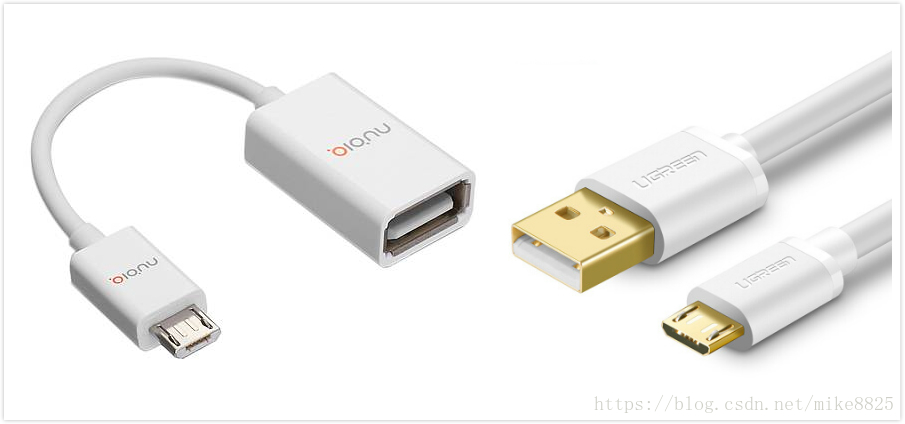
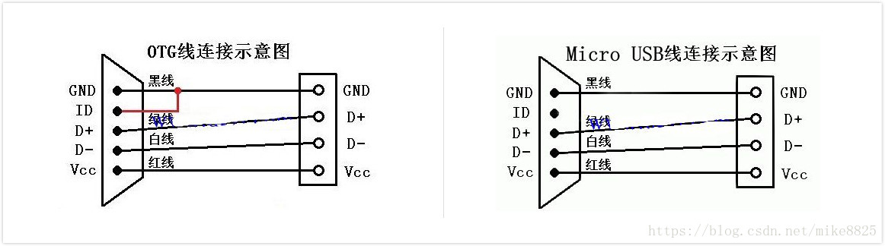

# README

usb主从切换主要是通过ID脚和type-c cc脚检测两种方式，分析一下。

# refers

* [插otg的识别过程](https://blog.csdn.net/weixin_36044869/article/details/104589360)
* [USB驱动之一主从检测](https://blog.csdn.net/mike8825/article/details/83246812)

# 原理

先来看下usb otg(主)线和micro usb(从)线的区别。



对应的usb连线如下：



* 当手机连接到电脑时,vbus为高电平,触发了vbus中断,在中断中确认为高电平后,手机的usb设置从设备,拔出usb线时,vbus变低。
* 当otg线(id脚和gnd脚是短路的)连接手机后,触发了id中断,检测到id脚为低电平后,手机的usb设置主设备,拔出usb线时,id脚变高。

补充：

* 当usb作为主设备时,需要提供5v的电压给从设备供电(电池电压一般不超过４.35V),一般需要增加升压芯片或者由支持otg的充电ic提供。
* 对于typec接口来说，由于没有了id脚，通过cc1,cc2检测相应的设备，通过通知链让usb主动切换到相应的状态。

# ID脚检测原理

请参考 插otg的识别过程

# CC脚检测原理

通知链处理typec状态，包括切换host devices处理，包括usb插入拔出处理：

```C++

static int otg_tcp_notifier_call(struct notifier_block *nb,
		unsigned long event, void *data)
{
	struct tcp_notify *noti = data;

	switch (event) {
	case TCP_NOTIFY_SOURCE_VBUS:
		DBG(0, "source vbus = %dmv\n", noti->vbus_state.mv);
		if (noti->vbus_state.mv)
			mt_usb_vbus_on(0);
		else
			mt_usb_vbus_off(0);
		break;
	case TCP_NOTIFY_TYPEC_STATE:
		DBG(0, "TCP_NOTIFY_TYPEC_STATE, old_state=%d, new_state=%d\n",
				noti->typec_state.old_state,
				noti->typec_state.new_state);

		/* Add-BEGIN by (shanliangliang@paxsz.com), 2021/08/15 add for M8 usb otg */
		mtk_musb->typec_state = noti->typec_state.new_state;
		/* Add-END by (shanliangliang@paxsz.com), 2021/08/15 add for M8 usb otg */

		if (noti->typec_state.old_state == TYPEC_UNATTACHED &&
			noti->typec_state.new_state == TYPEC_ATTACHED_SRC) {
			DBG(0, "OTG Plug in\n");
			mt_usb_host_connect(0);
		/* Add-BEGIN by (shanliangliang@paxsz.com), 2021/09/23 add for M8 usb otg */
		} else if (noti->typec_state.old_state == TYPEC_UNATTACHED &&
			noti->typec_state.new_state == TYPEC_ATTACHED_SNK) {
			mt_usb_host_disconnect(0);
			mt_usb_connect();
		/* Add-END by (shanliangliang@paxsz.com), 2021/09/23 add for M8 usb otg */
		} else if ((noti->typec_state.old_state == TYPEC_ATTACHED_SRC ||
			noti->typec_state.old_state == TYPEC_ATTACHED_SNK ||
			noti->typec_state.old_state ==
					TYPEC_ATTACHED_NORP_SRC) &&
			noti->typec_state.new_state == TYPEC_UNATTACHED) {
			/* Add-BEGIN by (shanliangliang@paxsz.com), 2021/08/15 add for M8 usb otg */
				if (mtk_musb->default_mode != MUSB_HOST) {
					if (is_host_active(mtk_musb)) {
						DBG(0, "OTG Plug out\n");
						mt_usb_host_disconnect(0);
					} else {
						DBG(0, "USB Plug out\n");
						mt_usb_dev_disconnect();
					}
				}
				else {
					if ((noti->typec_state.old_state != TYPEC_ATTACHED_SRC) && 
							(noti->typec_state.new_state == TYPEC_UNATTACHED)) {
						if (is_host_active(mtk_musb)) {
							DBG(0, "OTG Plug out\n");
							mt_usb_host_disconnect(0);
						} else {
							DBG(0, "USB Plug out\n");
							mt_usb_dev_disconnect();
						}
						
						if (mtk_musb->lcd_state != FB_BLANK_POWERDOWN) {
							msleep(50);
							mt_usb_host_connect(100);
						}
					}
					else if ((noti->typec_state.old_state == TYPEC_ATTACHED_SRC) && 
							(noti->typec_state.new_state == TYPEC_UNATTACHED)) {
						if (mtk_musb->lcd_state == FB_BLANK_POWERDOWN) {
							if (is_host_active(mtk_musb)) {
								DBG(0, "OTG Plug out\n");
								mt_usb_host_disconnect(0);
							} else {
								DBG(0, "USB Plug out\n");
								mt_usb_dev_disconnect();
							}
						}
					}
				}

		/* Add-END by (shanliangliang@paxsz.com), 2021/08/15 add for M8 usb otg */
#ifdef CONFIG_MTK_UART_USB_SWITCH
		} else if ((noti->typec_state.new_state ==
					TYPEC_ATTACHED_SNK ||
				noti->typec_state.new_state ==
					TYPEC_ATTACHED_CUSTOM_SRC ||
				noti->typec_state.new_state ==
					TYPEC_ATTACHED_NORP_SRC) &&
				in_uart_mode) {
			pr_info("%s USB cable plugged-in in UART mode.
					Switch to USB mode.\n", __func__);
			usb_phy_switch_to_usb();
#endif
		}
		break;
	case TCP_NOTIFY_DR_SWAP:
		DBG(0, "TCP_NOTIFY_DR_SWAP, new role=%d\n",
				noti->swap_state.new_role);
		if (is_host_active(mtk_musb) &&
			noti->swap_state.new_role == PD_ROLE_UFP) {
			DBG(0, "switch role to device\n");
			mt_usb_host_disconnect(0);
			mt_usb_connect();
		} else if (is_peripheral_active(mtk_musb) &&
			noti->swap_state.new_role == PD_ROLE_DFP) {
			DBG(0, "switch role to host\n");
			mt_usb_dev_disconnect();
			mt_usb_host_connect(0);
		}
		break;
	}
	return NOTIFY_OK;
}
```