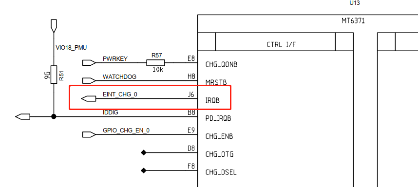
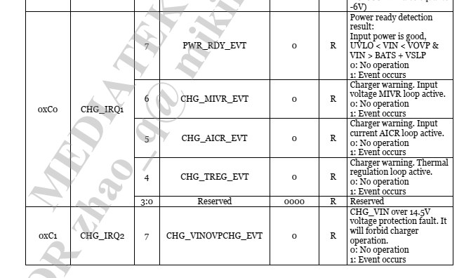
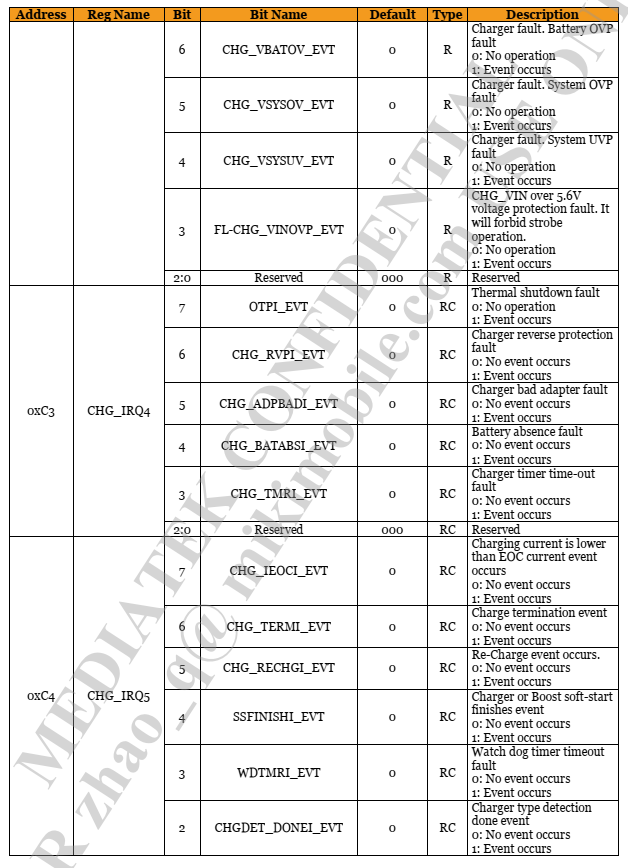
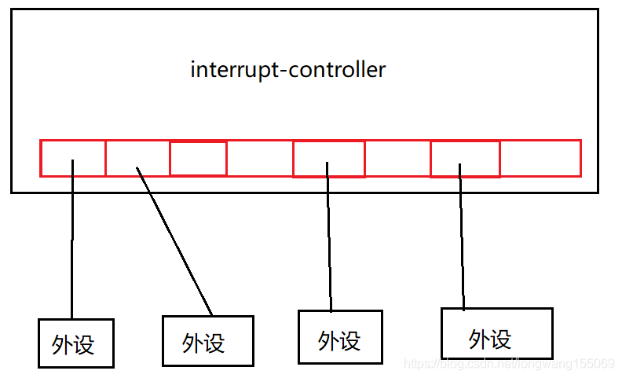

# 概述

跟进一下mt6370中断处理流程。

## 硬件

mt6370有一个中断引脚，是一个中断事件的集合，主要处理CHG/FLED/LDO/RGB/BL/DB/BASE事件中断处理。



## 中断事件

* 涉及寄存器：
```
/* irq event */
#define MT6370_PMU_REG_CHGIRQ1		(0xC0)
#define MT6370_PMU_REG_CHGIRQ2		(0xC1)
#define MT6370_PMU_REG_CHGIRQ3		(0xC2)
#define MT6370_PMU_REG_CHGIRQ4		(0xC3)
#define MT6370_PMU_REG_CHGIRQ5		(0xC4)
#define MT6370_PMU_REG_CHGIRQ6		(0xC5)
```

具体中断事件如下：





## irq-domain简介

当早期的系统只存在一个interrupt-controller的时候，而且中断数目也不多的时候，一个很简单的做法就是一个中断号对应到interrupt-contoller的一个号，可以说是简单的线性映射



而当一个系统中有多个interrupt-controller的时候，而且中断号也逐渐增加。linux内核为了应对此问题，引入了IRQ-domain的概念


irq-domain的引入相当于一个中断控制器就是一个irq-domain。就是一个中断区域。这样一来所有的irq-contoller会出现级联的布局。

利用树状的结构可以充分的利用irq数目，而且每一个irq-domain区域可以自己去管理自己interrupt的特性。

## IRQ-Domain的作用

* 通过/proc/interrupt的值来看下irq-domain的作用，中断控制器级联的情况图：


从这图上可以看出，这些中断连接到mt6370_pmu_irq的，而root-interrupt-controller是GICv3，也就是级联到GICv3的中断控制器上的。

## 参考

* [Linux Irq domain](https://blog.csdn.net/longwang155069/article/details/105812097)

* [Linux内核笔记之中断映射](https://blog.csdn.net/yhb1047818384/article/details/87561501)

* [Linux kernel的中断子系统之（二）：IRQ Domain介绍](https://www.cnblogs.com/arnoldlu/p/7599575.html)

* [linux中断号的演变与irq_domain](https://www.pianshen.com/article/13961979704/#hwirqvirq_16)

## MT6370中断流程

* `mt6370_pmu_charger.c`注册每个pmu实体中断：

```C++
M8.dts：
&mt6370_pmu {
        mt6370,intr_gpio_num = <11>; /* direct defined GPIO num */
        mt6370,intr_gpio = <&pio 11 0x0>;
};


* static int mt6370_pmu_charger_probe(struct platform_device *pdev)
  * mt6370_pmu_charger_irq_register(pdev);
    * for (i = 0; i < ARRAY_SIZE(mt6370_chg_irq_desc); i++) {
      * platform_get_resource_byname(pdev, IORESOURCE_IRQ,mt6370_chg_irq_desc[i].name);
      * devm_request_threaded_irq(&pdev->dev, res->start, NULL,mt6370_chg_irq_desc[i].irq_handler, 注册每个pmu中断
                    IRQF_TRIGGER_FALLING,
                    mt6370_chg_irq_desc[i].name, 
                    platform_get_drvdata(pdev)); 
```

* 其中 mt6370_pmu_irq_desc是中断函数名称集合，比如mt6370_pmu_chg_aiclmeasi_irq_handler中断函数就是在这被注册的。
```C++
#define MT6370_PMU_IRQDESC(name) { #name, mt6370_pmu_##name##_irq_handler, -1}
static struct mt6370_pmu_irq_desc mt6370_chg_irq_desc[] = {
    MT6370_PMU_IRQ_MAPPING(chg_treg, 4),
    MT6370_PMU_IRQ_MAPPING(chg_aicr, 5),
    MT6370_PMU_IRQ_MAPPING(chg_mivr, 6),
    MT6370_PMU_IRQ_MAPPING(pwr_rdy, 7),
    MT6370_PMU_IRQ_MAPPING(chg_vinovp, 11),
    MT6370_PMU_IRQ_MAPPING(chg_vsysuv, 12),
    MT6370_PMU_IRQ_MAPPING(chg_vsysov, 13),
    MT6370_PMU_IRQ_MAPPING(chg_vbatov, 14),
    MT6370_PMU_IRQ_MAPPING(chg_vbusov, 15),
    MT6370_PMU_IRQ_MAPPING(ts_bat_cold, 20),
    MT6370_PMU_IRQ_MAPPING(ts_bat_cool, 21),
    MT6370_PMU_IRQ_MAPPING(ts_bat_warm, 22),
    MT6370_PMU_IRQ_MAPPING(ts_bat_hot, 23),
    MT6370_PMU_IRQ_MAPPING(chg_tmri, 27),
    MT6370_PMU_IRQ_MAPPING(chg_batabsi, 28),
    MT6370_PMU_IRQ_MAPPING(chg_adpbadi, 29),
    MT6370_PMU_IRQ_MAPPING(chg_rvpi, 30),
    MT6370_PMU_IRQ_MAPPING(otpi, 31),
    MT6370_PMU_IRQ_MAPPING(chg_aiclmeasi, 32),
    MT6370_PMU_IRQ_MAPPING(chg_ichgmeasi, 33),
    MT6370_PMU_IRQ_MAPPING(chgdet_donei, 34),
    MT6370_PMU_IRQ_MAPPING(chg_wdtmri, 35),
    MT6370_PMU_IRQ_MAPPING(ssfinishi, 36),
    MT6370_PMU_IRQ_MAPPING(chg_rechgi, 37),
    MT6370_PMU_IRQ_MAPPING(chg_termi, 38),
    MT6370_PMU_IRQ_MAPPING(chg_ieoci, 39),
    MT6370_PMU_IRQ_MAPPING(attachi, 48),
    MT6370_PMU_IRQ_MAPPING(detachi, 49),
    MT6370_PMU_IRQ_MAPPING(qc30stpdone, 51),
    MT6370_PMU_IRQ_MAPPING(qc_vbusdet_done, 52),
    MT6370_PMU_IRQ_MAPPING(hvdcp_det, 53),
    MT6370_PMU_IRQ_MAPPING(chgdeti, 54),
    MT6370_PMU_IRQ_MAPPING(dcdti, 55),
    MT6370_PMU_IRQ_MAPPING(dirchg_vgoki, 59),
    MT6370_PMU_IRQ_MAPPING(dirchg_wdtmri, 60),
    MT6370_PMU_IRQ_MAPPING(dirchg_uci, 61),
    MT6370_PMU_IRQ_MAPPING(dirchg_oci, 62),
    MT6370_PMU_IRQ_MAPPING(dirchg_ovi, 63),
    MT6370_PMU_IRQ_MAPPING(ovpctrl_swon_evt, 67),
    MT6370_PMU_IRQ_MAPPING(ovpctrl_uvp_d_evt, 68),
    MT6370_PMU_IRQ_MAPPING(ovpctrl_uvp_evt, 69),
    MT6370_PMU_IRQ_MAPPING(ovpctrl_ovp_d_evt, 70),
    MT6370_PMU_IRQ_MAPPING(ovpctrl_ovp_evt, 71),
    MT6370_PMU_IRQ_MAPPING(fled_strbpin, 72),
    MT6370_PMU_IRQ_MAPPING(fled_torpin, 73),
    MT6370_PMU_IRQ_MAPPING(fled_tx, 74),
    MT6370_PMU_IRQ_MAPPING(fled_lvf, 75),
    MT6370_PMU_IRQ_MAPPING(fled2_short, 78),
    MT6370_PMU_IRQ_MAPPING(fled1_short, 79),
    MT6370_PMU_IRQ_MAPPING(fled2_strb, 80),
    MT6370_PMU_IRQ_MAPPING(fled1_strb, 81),
    MT6370_PMU_IRQ_MAPPING(fled2_strb_to, 82),
    MT6370_PMU_IRQ_MAPPING(fled1_strb_to, 83),
    MT6370_PMU_IRQ_MAPPING(fled2_tor, 84),
    MT6370_PMU_IRQ_MAPPING(fled1_tor, 85),
    MT6370_PMU_IRQ_MAPPING(otp, 93),
    MT6370_PMU_IRQ_MAPPING(vdda_ovp, 94),
    MT6370_PMU_IRQ_MAPPING(vdda_uv, 95),
    MT6370_PMU_IRQ_MAPPING(ldo_oc, 103),
    MT6370_PMU_IRQ_MAPPING(isink4_short, 104),
    MT6370_PMU_IRQ_MAPPING(isink3_short, 105),
    MT6370_PMU_IRQ_MAPPING(isink2_short, 106),
    MT6370_PMU_IRQ_MAPPING(isink1_short, 107),
    MT6370_PMU_IRQ_MAPPING(isink4_open, 108),
    MT6370_PMU_IRQ_MAPPING(isink3_open, 109),
    MT6370_PMU_IRQ_MAPPING(isink2_open, 110),
    MT6370_PMU_IRQ_MAPPING(isink1_open, 111),
    MT6370_PMU_IRQ_MAPPING(bled_ocp, 118),
    MT6370_PMU_IRQ_MAPPING(bled_ovp, 119),
    MT6370_PMU_IRQ_MAPPING(dsv_vneg_ocp, 123),
    MT6370_PMU_IRQ_MAPPING(dsv_vpos_ocp, 124),
    MT6370_PMU_IRQ_MAPPING(dsv_bst_ocp, 125),
    MT6370_PMU_IRQ_MAPPING(dsv_vneg_scp, 126),
    MT6370_PMU_IRQ_MAPPING(dsv_vpos_scp, 127),
}
```

* `mt6370_pmu_i2c.c`申请gpio中断，向系统注册irq domain。
* `mt6370_pmu_probe`:
```C++
* mt6370_pmu_irq_register
  ├── gpio_request_one(pdata->intr_gpio, GPIOF_IN,"mt6370_pmu_irq_gpio");
  ├── chip->irq_domain = irq_domain_add_linear(chip->dev->of_node,MT6370_PMU_IRQ_EVT_MAX,&mt6370_pmu_irq_domain_ops,chip); 线性映射保留一张固定的表
  └── devm_request_threaded_irq(chip->dev, chip->irq, NULL,mt6370_pmu_irq_handler, 申请gpio中断，中断处理函数mt6370_pmu_irq_handler
      └── mt6370_pmu_irq_handler
          ├── mt6370_pmu_reg_write(chip, MT6370_PMU_REG_IRQMASK, 0xFE); //打开中断标志
          ├── mt6370_pmu_reg_block_read(chip, MT6370_PMU_REG_CHGIRQ1, 5, data); //读取中断类型寄存器MT6370_PMU_REG_CHGIRQ1~MT6370_PMU_REG_CHGIRQ6 共5个寄存器
          ├── mt6370_pmu_reg_write(chip, MT6370_PMU_REG_IRQMASK, 0x00); //清除所有中断标志
          └── irq_find_mapping(chip->irq_domain, i * 8 + j);  调用irq_find_mapping找到HW interrupt ID对应的irq number，获得虚拟中断号
              └── handle_nested_irq(ret); 来处理该irq number中断
```

* mt6370为irq domain创建虚拟中断映射。

```C++
* static int mt6370_pmu_probe(struct i2c_client *i2c,
  └── ret = mt6370_pmu_subdevs_register(chip);
      └── mt6370_pmu_init_subdevs(chip);
          └── mt6370_pmu_init_of_subdevs(chip)
              └── for (j = 0; j < irq_cnt; j++) {
                  ├── of_property_read_string_index(np"interrupt-names",  
                  └── ret = mt6370_pmu_get_virq_number(chip, name);
                      └── rq_create_mapping(chip->irq_domain,mt6370_pmu_irq_mapping_tbl[i].id); 建立HW interrupt ID和IRQ number的映射关系。该接口函数以irq domain和HW interrupt ID为参数，返回IRQ number
                          └── irq_create_mapping(chip->irq_domain,mt6370_pmu_irq_mapping_tbl[i].id); 映射硬件中断号到虚拟中断号
```

* 虚拟中断`IRQ number`如下：
```C++
int mt6370_pmu_get_virq_number(struct mt6370_pmu_chip *chip, const char *name)
{
    int i;

    if (!name) {
        dev_err(chip->dev, "%s: null name\n", __func__);
        return -EINVAL;
    }
    for (i = 0; i < ARRAY_SIZE(mt6370_pmu_irq_mapping_tbl); i++) {
        if (!strcmp(mt6370_pmu_irq_mapping_tbl[i].name, name)) {
            return irq_create_mapping(chip->irq_domain,
                    mt6370_pmu_irq_mapping_tbl[i].id);
        }
    }
    return -EINVAL;
}
#define MT6370_PMU_IRQ_MAPPING(_name, _id) { .name = #_name, .id = _id}
static const struct irq_mapping_tbl mt6370_pmu_irq_mapping_tbl[] = {
    MT6370_PMU_IRQ_MAPPING(chg_treg, 4),
    MT6370_PMU_IRQ_MAPPING(chg_aicr, 5),
    MT6370_PMU_IRQ_MAPPING(chg_mivr, 6),
    MT6370_PMU_IRQ_MAPPING(pwr_rdy, 7),
    MT6370_PMU_IRQ_MAPPING(chg_vinovp, 11),
    MT6370_PMU_IRQ_MAPPING(chg_vsysuv, 12),
    MT6370_PMU_IRQ_MAPPING(chg_vsysov, 13),
    MT6370_PMU_IRQ_MAPPING(chg_vbatov, 14),
    MT6370_PMU_IRQ_MAPPING(chg_vbusov, 15),
    MT6370_PMU_IRQ_MAPPING(ts_bat_cold, 20),
    MT6370_PMU_IRQ_MAPPING(ts_bat_cool, 21),
    MT6370_PMU_IRQ_MAPPING(ts_bat_warm, 22),
    MT6370_PMU_IRQ_MAPPING(ts_bat_hot, 23),
    MT6370_PMU_IRQ_MAPPING(chg_tmri, 27),
    MT6370_PMU_IRQ_MAPPING(chg_batabsi, 28),
    MT6370_PMU_IRQ_MAPPING(chg_adpbadi, 29),
    MT6370_PMU_IRQ_MAPPING(chg_rvpi, 30),
    MT6370_PMU_IRQ_MAPPING(otpi, 31),
    MT6370_PMU_IRQ_MAPPING(chg_aiclmeasi, 32),
    MT6370_PMU_IRQ_MAPPING(chg_ichgmeasi, 33),
    MT6370_PMU_IRQ_MAPPING(chgdet_donei, 34),
    MT6370_PMU_IRQ_MAPPING(chg_wdtmri, 35),
    MT6370_PMU_IRQ_MAPPING(ssfinishi, 36),
    MT6370_PMU_IRQ_MAPPING(chg_rechgi, 37),
    MT6370_PMU_IRQ_MAPPING(chg_termi, 38),
    MT6370_PMU_IRQ_MAPPING(chg_ieoci, 39),
    MT6370_PMU_IRQ_MAPPING(attachi, 48),
    MT6370_PMU_IRQ_MAPPING(detachi, 49),
    MT6370_PMU_IRQ_MAPPING(qc30stpdone, 51),
    MT6370_PMU_IRQ_MAPPING(qc_vbusdet_done, 52),
    MT6370_PMU_IRQ_MAPPING(hvdcp_det, 53),
    MT6370_PMU_IRQ_MAPPING(chgdeti, 54),
    MT6370_PMU_IRQ_MAPPING(dcdti, 55),
    MT6370_PMU_IRQ_MAPPING(dirchg_vgoki, 59),
    MT6370_PMU_IRQ_MAPPING(dirchg_wdtmri, 60),
    MT6370_PMU_IRQ_MAPPING(dirchg_uci, 61),
    MT6370_PMU_IRQ_MAPPING(dirchg_oci, 62),
    MT6370_PMU_IRQ_MAPPING(dirchg_ovi, 63),
    MT6370_PMU_IRQ_MAPPING(ovpctrl_swon_evt, 67),
    MT6370_PMU_IRQ_MAPPING(ovpctrl_uvp_d_evt, 68),
    MT6370_PMU_IRQ_MAPPING(ovpctrl_uvp_evt, 69),
    MT6370_PMU_IRQ_MAPPING(ovpctrl_ovp_d_evt, 70),
    MT6370_PMU_IRQ_MAPPING(ovpctrl_ovp_evt, 71),
    MT6370_PMU_IRQ_MAPPING(fled_strbpin, 72),
    MT6370_PMU_IRQ_MAPPING(fled_torpin, 73),
    MT6370_PMU_IRQ_MAPPING(fled_tx, 74),
    MT6370_PMU_IRQ_MAPPING(fled_lvf, 75),
    MT6370_PMU_IRQ_MAPPING(fled2_short, 78),
    MT6370_PMU_IRQ_MAPPING(fled1_short, 79),
    MT6370_PMU_IRQ_MAPPING(fled2_strb, 80),
    MT6370_PMU_IRQ_MAPPING(fled1_strb, 81),
    MT6370_PMU_IRQ_MAPPING(fled2_strb_to, 82),
    MT6370_PMU_IRQ_MAPPING(fled1_strb_to, 83),
    MT6370_PMU_IRQ_MAPPING(fled2_tor, 84),
    MT6370_PMU_IRQ_MAPPING(fled1_tor, 85),
    MT6370_PMU_IRQ_MAPPING(otp, 93),
    MT6370_PMU_IRQ_MAPPING(vdda_ovp, 94),
    MT6370_PMU_IRQ_MAPPING(vdda_uv, 95),
    MT6370_PMU_IRQ_MAPPING(ldo_oc, 103),
    MT6370_PMU_IRQ_MAPPING(isink4_short, 104),
    MT6370_PMU_IRQ_MAPPING(isink3_short, 105),
    MT6370_PMU_IRQ_MAPPING(isink2_short, 106),
    MT6370_PMU_IRQ_MAPPING(isink1_short, 107),
    MT6370_PMU_IRQ_MAPPING(isink4_open, 108),
    MT6370_PMU_IRQ_MAPPING(isink3_open, 109),
    MT6370_PMU_IRQ_MAPPING(isink2_open, 110),
    MT6370_PMU_IRQ_MAPPING(isink1_open, 111),
    MT6370_PMU_IRQ_MAPPING(bled_ocp, 118),
    MT6370_PMU_IRQ_MAPPING(bled_ovp, 119),
    MT6370_PMU_IRQ_MAPPING(dsv_vneg_ocp, 123),
    MT6370_PMU_IRQ_MAPPING(dsv_vpos_ocp, 124),
    MT6370_PMU_IRQ_MAPPING(dsv_bst_ocp, 125),
    MT6370_PMU_IRQ_MAPPING(dsv_vneg_scp, 126),
    MT6370_PMU_IRQ_MAPPING(dsv_vpos_scp, 127),
};


"mt6370.dtsi"：
              core {
                        compatible = "mediatek,mt6370_pmu_core";
                        interrupt-names = "otp", "vdda_ovp", "vdda_uv";

            mt6370_chg: charger {
                        compatible = "mediatek,mt6370_pmu_charger";
                        interrupt-names = "chg_mivr", "chg_aiclmeasi",
                                "attachi", "ovpctrl_uvp_d_evt", "chg_wdtmri",
                                "chg_vbusov", "chg_tmri", "chg_treg", "dcdti";
 
                mt6370_pmu_fled1 {
                        compatible = "mediatek,mt6370_pmu_fled1";
                        interrupt-names = "fled_lvf", "fled2_short",
                                          "fled1_short";

                ldo {
                        compatible = "mediatek,mt6370_pmu_ldo";
                        interrupt-names = "ldo_oc";

                dsv {
                        compatible = "mediatek,mt6370_pmu_dsv";
                        interrupt-names = "dsv_vneg_ocp", "dsv_vpos_ocp",
                                          "dsv_bst_ocp", "dsv_vneg_scp",
                                          "dsv_vpos_scp";
```

* 调试打印

```log
打印如下：
<6>[ 9557.565662]  (5)[236:irq/28-mt6370_p]mt6370_pmu 5-0034: mt6370_pmu_irq_handler: handler irq_domain = (4, 0)
<6>[ 9557.565688]  (5)[236:irq/28-mt6370_p]mt6370_pmu_charger mt6370_pmu_charger: mt6370_pmu_chg_aiclmeasi_irq_handler
<6>[ 9557.566018]  (5)[297:charger_thread]mt6370_pmu_charger mt6370_pmu_charger: __mt6370_run_aicl: aicc pre val = 100000
<5>[ 9557.569123]  (0)[16420:kworker/0:1][fg_sw_bat_cycle_accu]car[o:-963 n:-963],diff_car:0,ncar[o:968 n:968 hw:0] thr 31025
<6>[ 9557.572626]  (5)[297:charger_thread]mt6370_pmu_charger mt6370_pmu_charger: __mt6370_run_aicl: aicc post val = 100000
<6>[ 9557.572646]  (5)[297:charger_thread]mt6370_pmu_charger mt6370_pmu_charger: __mt6370_run_aicl: OK, aicr upper bound = 100mA

根据irq_domain = (4, 0)，根据公式i * 8 + j = 32 ，得知id = 32

map表：
#define MT6370_PMU_IRQ_MAPPING(_name, _id) { .name = #_name, .id = _id}
static const struct irq_mapping_tbl mt6370_pmu_irq_mapping_tbl[] = {
    MT6370_PMU_IRQ_MAPPING(chg_aiclmeasi, 32),

执行chg_aiclmeasi 中断函数
```