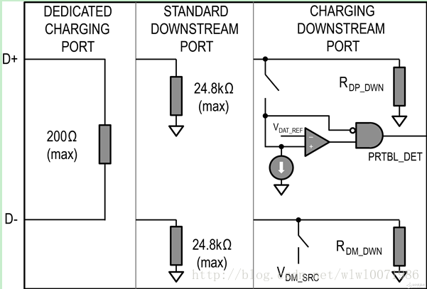
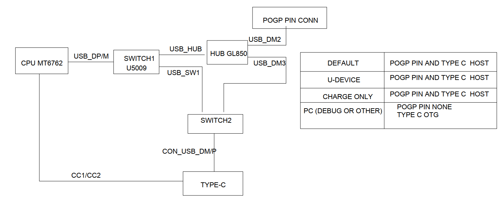

# 概述
mtk平台bc1.2分析

电池充电并不是USB的原始特性，因此，在BC1.2颁布之前，官方并未就为关断设备的电池充电做出任何规定。通过建立清晰的USB端口供电能力沟通方法，BC1.2规范改进了其中许多问题。BC1.2规范简要规定了三种不同类型的USB端口和两种关键对象。“充电”端口是可提供500mA以上电流的端口；“下行”端口按照USB 2.0规范传输数据。BC1.2规范也确定了每个端口应如何向终端设备枚举，以及识别应用端口类型的协议。

三种USB BC1.2端口类型为SDP、DCP和CDP 。

 BC1.2的三种端口:

* 标准下行端口（SDP）
	这种端口的D+和D-线上具有15kΩ下拉电阻。限流值为：挂起时2.5mA，
	连接时为100mA，连接并配置为较高功率时为500mA。
	它其实就是一种普通的USB模式，当USB处于这种模式时
	既可以为外部设备（手机充电、充电宝）充电，
	也可以起到数据连接的作用（U盘、手机上传/下载）。

* 专用充电端口（DCP）
	这种端口不支持任何数据传输，但能够提供1.5A以上的电流。
	端口的D+和D-线之间短路。这种类型的端口支持较高充电能
	力的墙上充电器和车载充电器，无需枚举。它其实就是简单
	的充电器，当USB处于这种模式时只能进行充电而不能进行数据连接。

* 充电下行端口（CDP）
	这种端口既支持大电流充电，也支持完全兼容USB 2.0的数据传输。
	端口具有D+和D-通信所必需的15kΩ下拉电阻，也具有充电器检测阶
	段切换的内部电路。内部电路允许便携设备将CDP与其它类型端口
	区分开来。它其实就是带有快充功能（1.5A）的USB接口，当USB
	处于这种模式时既可以进行快充，也可以起到数据连接的作用。



## 参考

* [usb BC1.2的三种端口](https://blog.csdn.net/u011006622/article/details/53355237?spm=1001.2101.3001.6650.2&utm_medium=distribute.pc_relevant.none-task-blog-2%7Edefault%7ECTRLIST%7Edefault-2-53355237-blog-108532889.pc_relevant_aa&depth_1-utm_source=distribute.pc_relevant.none-task-blog-2%7Edefault%7ECTRLIST%7Edefault-2-53355237-blog-108532889.pc_relevant_aa&utm_relevant_index=5)

## 代码分析

* 目前mtk平台充电的开始需要按顺序完成以下两个步骤：

```
1.CC检测主从关系，原理如下：

在DFP的CC pin有上拉电阻Rp，在UFP的CC pin有下拉电阻Rd。

— 未连接时，DFP的VBUS是无输出的。
— 连接后，CC pin相连，DFP的CC pin会检测到UFP的下拉电阻Rd，说明连接上了，DFP就打开Vbus电源开关，输出电源给UFP。而哪个CC pin(CC1，CC2)检测到下拉电阻就确定接口插入的方向，顺便切换RX/TX

2.bc1.2检测充电三种USB BC1.2端口类型为SDP、DCP和CDP。

3.只有上述2个步骤完成后，才进行充电。
```


* 1.以下首先在probe中注册监听：

```C++
* mt6370_pmu_charger_probe(struct platform_device *pdev)
  * chg_data->pd_nb.notifier_call = pd_tcp_notifier_call;
  * ret = register_tcp_dev_notifier(chg_data->tcpc_dev, &chg_data->pd_nb,TCP_NOTIFY_TYPE_ALL); //监听typec事件
  * chg_data->attach_task = kthread_run(typec_attach_thread, chg_data,"attach_thread"); //创建typec_attach_thread线程完成bc1.2充电器类型检测
```

* 2.当检测到usb插入充电a时，`typec_attach_thread`线程一直等待cc检测状态完成，检测到source/sink都会调用`complete`同步完成状态，线程检测到完成状态将调用`handle_typec_attach(chg_data, true)`使能线程`typec_attach_thread`开始bc1.2检测，详细如下：

```C++
CC检测：
* pd_tcp_notifier_call(struct notifier_block *nb,
  * case TCP_NOTIFY_TYPEC_STATE:
    * handle_typec_attach(chg_data, true);
      * complete(&chg_data->chrdet_start);

static int pd_tcp_notifier_call(struct notifier_block *nb,
				unsigned long event, void *data)
{
	struct tcp_notify *noti = data;
	struct mt6370_pmu_charger_data *chg_data =
		(struct mt6370_pmu_charger_data *)container_of(nb,
		struct mt6370_pmu_charger_data, pd_nb);

	switch (event) {
	case TCP_NOTIFY_TYPEC_STATE:

		//FEATURE-BEGIN by shanliangliang@paxsz.com, 2022/01/13, typec is norp_src, no need to do bc11 detect
		chg_data->typec_state = noti->typec_state.new_state;
		//FEATURE-END by shanliangliang@paxsz.com, 2022/01/13, typec is norp_src, no need to do bc11 detect
		if (noti->typec_state.old_state == TYPEC_UNATTACHED &&
		    (noti->typec_state.new_state == TYPEC_ATTACHED_SNK ||
		    noti->typec_state.new_state == TYPEC_ATTACHED_CUSTOM_SRC ||
		    noti->typec_state.new_state == TYPEC_ATTACHED_NORP_SRC)) {
			pr_info("%s USB Plug in, pol = %d\n", __func__,
					noti->typec_state.polarity);
			handle_typec_attach(chg_data, true);
		} else if ((noti->typec_state.old_state == TYPEC_ATTACHED_SNK ||
		    noti->typec_state.old_state == TYPEC_ATTACHED_CUSTOM_SRC ||
			noti->typec_state.old_state == TYPEC_ATTACHED_NORP_SRC)
			&& noti->typec_state.new_state == TYPEC_UNATTACHED) {
			pr_info("%s USB Plug out\n", __func__);
			if (chg_data->tcpc_kpoc) {
				pr_info("%s: typec unattached, power off\n",
					__func__);
#ifdef FIXME
				kernel_power_off();
#endif
			}
			handle_typec_attach(chg_data, false);
			chg_data->manual_usb_mode = USB_MODE_HOST;
		} else if (noti->typec_state.old_state == TYPEC_ATTACHED_SRC &&
			noti->typec_state.new_state == TYPEC_ATTACHED_SNK) {
			pr_info("%s Source_to_Sink\n", __func__);
			handle_typec_attach(chg_data, true);
		}  else if (noti->typec_state.old_state == TYPEC_ATTACHED_SNK &&
			noti->typec_state.new_state == TYPEC_ATTACHED_SRC) {
			pr_info("%s Sink_to_Source\n", __func__);
			handle_typec_attach(chg_data, false);
		}
		break;
	default:
		break;
	};
	return NOTIFY_OK;
}
```

充电器类型检测：
```C++
* typec_attach_thread(void *data)
  └── mt6370_get_charger_type(chg_data, attach); 
      ├── chg_psy = power_supply_get_by_name("mtk_charger_type"); //获取mtk_charger_type psy设备，这里关联mt6357_charger_type.c
      ├── if (chg_data->typec_state == TYPEC_ATTACHED_NORP_SRC) 
      ├── if (chg_data->r15_state == R15_STATUS_ONLINE)
      ├── if (chg_data->pogo_dev_state == POGO_DEV_STATE_ONLINE)
      │   └── prop.intval = 0; //表示这三种情况跳过bc1.2检测，因为USB D+ D-都接到hub上面了，无法识别。
      ├── if (chg_data->manual_usb_mode == USB_MODE_DEV) { prop.intval = attach;} //设备切为device时才进行bc1.2检测
      ├── ret = power_supply_set_property(chg_psy,POWER_SUPPLY_PROP_ONLINE, &prop);
      │   └── psy_chr_type_set_property(struct power_supply *psy, //mt6357_charger_type.c
      │       └── case POWER_SUPPLY_PROP_ONLINE:
      │           └── info->type = get_charger_type(info, val->intval);
      ├── ret = power_supply_set_property(chg_psy,POWER_SUPPLY_PROP_TYPE, &prop2);
      ├── ret = power_supply_set_property(chg_psy,POWER_SUPPLY_PROP_USB_TYPE, &prop3);
      └── power_supply_changed(chg_data->psy); //发送uevent事件，上层读取sysfs节点
```

* `typec_attach_thread`具体内容如下：
```C++
static int typec_attach_thread(void *data)
{
	struct mt6370_pmu_charger_data *chg_data = data;
	int ret = 0;
	bool attach;
	union power_supply_propval val;

	pr_info("%s: ++\n", __func__);
	while (!kthread_should_stop()) {
		wait_for_completion(&chg_data->chrdet_start); //等待CC检测完成
		mutex_lock(&chg_data->attach_lock);
		attach = chg_data->attach;
		mutex_unlock(&chg_data->attach_lock);
		val.intval = attach;
		pr_notice("%s bc12_sel:%d\n", __func__,
				chg_data->chg_desc->bc12_sel);
		if (chg_data->chg_desc->bc12_sel == 0)
			power_supply_set_property(chg_data->chg_psy,
						POWER_SUPPLY_PROP_ONLINE, &val);
		else
			mt6370_get_charger_type(chg_data, attach); //重点
	}
	return ret;
}
```

* bc1.2检测：
```C++
static int get_charger_type(struct mtk_charger_type *info, int en)
{
	enum power_supply_usb_type type = POWER_SUPPLY_USB_TYPE_UNKNOWN;

	if (en || !boot_mode_is_normal(info)) { //这里!boot_mode_is_normal表示meta模式下做bc1.2，由于工厂夹具没有CC线，typec识别成TYPEC_ATTACHED_NORP_SRC，由于底座充电需求(疑问中有解释)，会跳过bc1.2，
		hw_bc11_init(info);
		if (hw_bc11_DCD(info)) {
			info->psy_desc.type = POWER_SUPPLY_TYPE_USB;
			type = POWER_SUPPLY_USB_TYPE_DCP;
		} else {
			if (hw_bc11_stepA2(info)) {
				if (hw_bc11_stepB2(info)) {
					info->psy_desc.type = POWER_SUPPLY_TYPE_USB_DCP;
					type = POWER_SUPPLY_USB_TYPE_DCP;
				} else {
					info->psy_desc.type = POWER_SUPPLY_TYPE_USB_CDP;
					type = POWER_SUPPLY_USB_TYPE_CDP;
				}
			} else {
				info->psy_desc.type = POWER_SUPPLY_TYPE_USB;
				type = POWER_SUPPLY_USB_TYPE_SDP;
			}
		}

		if (type != POWER_SUPPLY_USB_TYPE_DCP)
			hw_bc11_done(info);
		else
			pr_info("charger type: skip bc11 release for BC12 DCP SPEC\n");
	}
	else { //TYPEC_ATTACHED_NORP_SRC R15_STATUS_ONLINE POGO_DEV_STATE_ONLINE 这三种情况，跳过bc1.2，直接赋值DCP类型。
		info->psy_desc.type = POWER_SUPPLY_TYPE_USB;
		type = POWER_SUPPLY_USB_TYPE_DCP;
	}

	dump_charger_name(info->psy_desc.type);

	return type;
}
```

疑问：

为什么TYPEC_ATTACHED_NORP_SRC R15_STATUS_ONLINE POGO_DEV_STATE_ONLINE 这三种情况，跳过bc1.2，直接赋值DCP类型？

* 1.M8上面充电接口只有VBUS和GND，没有CC线的一律识别成TYPEC_ATTACHED_NORP_SRC，bc1.2无法检测，虽然usb和switch都没切device，但是通信会有点问题，需要跳过，具体原因问了sll不明。

* 2.R15在线(pogo pin插入时)，由于host模式下，D+ D-是连在hub上而不是直连usb，无法做bc1.2检测，如果要做bc1.2需要先切device，这时会断开一下R15，体验不好。所有直接的做法就是R15在线(pogo pin插入时)，直接赋值DCP，不做bc1.2，以下实例分析。


## 实例分析

* M8产品默认是host模式，之前插入充电器(DCP)或者电脑(SDP)会自动切换成device模式。
* 需求是底部充电时，还是为host不动。
* 目前由于host模式下，usb dm dp连接到了hub上面，需要


