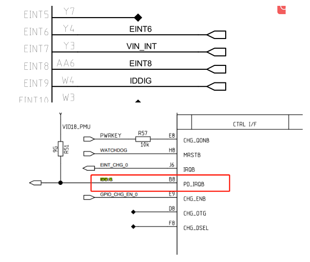
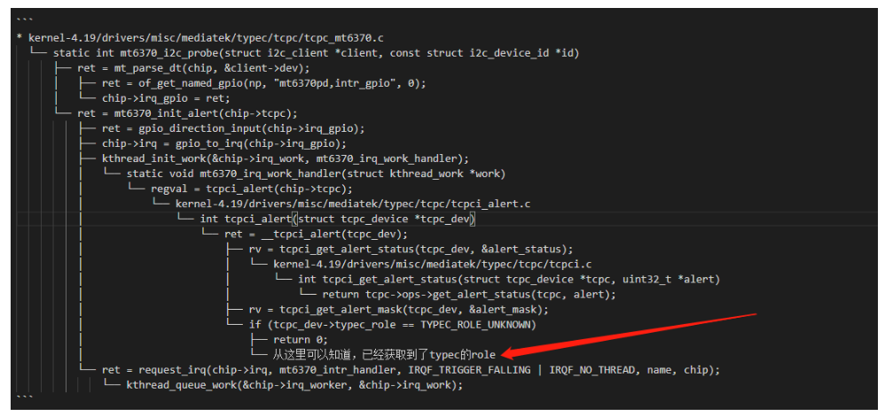

# README
mt6762 otg检测过程

## 参考
[插otg的识别过程](https://blog.csdn.net/weixin_36044869/article/details/104589360)

## 概述



上图IDDIG引脚之前误以为是OTG的ID脚，发现是PD的中断，主要功能如下：

```
The TCPC has an open-drain output, active-low PD_IRQB pin. This pin is used to indicate 
change of state, where the PD_IRQB pin is asserted when any Alert Bits are set
```


原理分析：OTG的识别有两种方式，一种是靠的是ID引脚，当OTG设备插入机器时，会自动将usb的ID pin引脚拉低，从而会触发中断，进而识别出有OTG设备插入。第二种是靠CC脚电平变化判断，目前mt6762平台采用的是第二种，第一种参考上面的链接。

补充1：

usb id pin一般为1.8v，默认可以连接电脑usb或adb，即机器默认做从设备device。
而usb id pin拉低到0v后，将触发usb切换为host模式，即可以连接otg设备。

## IDDIG PD_IRQ代码分析

* `mt6765.dts`：

```
        这个没用，所以参考文章也是没用的
        otg_iddig: otg_iddig{
                compatible = "mediatek,usb_iddig_bi_eint";
        };

&mt6370_typec {
        mt6370pd,intr_gpio_num = <9>; /* direct defined GPIO num */
        mt6370pd,intr_gpio = <&pio 9 0x0>;
};
```
* 剑锋分析



## debug开关

```C++
tcpci_core.h:
/* The switch of log message */
#define TYPEC_INFO_ENABLE	1
#define TYPEC_INFO2_ENABLE	1
#define PE_EVENT_DBG_ENABLE	1
#define PE_STATE_INFO_ENABLE	1
#define TCPC_INFO_ENABLE	1
#define TCPC_TIMER_DBG_EN	0
#define TCPC_TIMER_INFO_EN	0
#define PE_INFO_ENABLE		1
#define TCPC_DBG_ENABLE		0
#define TCPC_DBG2_ENABLE	0
#define DPM_INFO_ENABLE		1
#define DPM_INFO2_ENABLE	1
#define DPM_DBG_ENABLE		0
#define PD_ERR_ENABLE		1
#define PE_DBG_ENABLE		1
#define TYPEC_DBG_ENABLE	1


#define DP_INFO_ENABLE		1
#define DP_DBG_ENABLE		1

#define UVDM_INFO_ENABLE		1
#define TCPM_DBG_ENABLE		1

#ifdef CONFIG_USB_PD_ALT_MODE_RTDC
#define DC_INFO_ENABLE			1
#define DC_DBG_ENABLE			1
#endif	/* CONFIG_USB_PD_ALT_MODE_RTDC */
```

## type-c TCP_NOTIFY_TYPEC_STATE事件处理

typec state所有事件如下：

```
enum typec_attach_type {
    TYPEC_UNATTACHED = 0,   没接
    TYPEC_ATTACHED_SNK,      手机作为sink端
    TYPEC_ATTACHED_SRC,      手机作为source端
    TYPEC_ATTACHED_AUDIO,    手机作为audio输出
    TYPEC_ATTACHED_DEBUG,			/* Rd, Rd */

/* CONFIG_TYPEC_CAP_DBGACC_SNK */
    TYPEC_ATTACHED_DBGACC_SNK,		/* Rp, Rp */

/* CONFIG_TYPEC_CAP_CUSTOM_SRC */
    TYPEC_ATTACHED_CUSTOM_SRC,		/* Same Rp */

/* CONFIG_TYPEC_CAP_NORP_SRC */
    TYPEC_ATTACHED_NORP_SRC,		/* No Rp */
};
```
* CC处理线程逻辑：

```C++
* `kernel-4.19\drivers\misc\mediatek\typec\tcpc\tcpc_mt6370.c`:
  └── mt6370_i2c_probe
      └── mt6370_tcpcdev_init(chip, &client->dev);
          └── chip->tcpc = tcpc_device_register(dev,desc, &mt6370_tcpc_ops, chip);
              └── tcpci_timer_init(tcpc); //创建中断timer
                  ├── hrtimer_init(&tcpc_dev->tcpc_timer[i],CLOCK_MONOTONIC, HRTIMER_MODE_REL); //初始化定时器
                  ├── tcpc_dev->tcpc_timer[i].function = tcpc_timer_call[i]; //注册各种timer，具体下面说明
                  └── kthread_create(tcpc_timer_thread, tcpc_dev, //创建线程
                      ├── wait_event_interruptible(tcpc_dev->timer_wait_que, //将本进程置为可中断的挂起状态
                      └── tcpc_handle_timer_triggered(tcpc_dev); //主要处理函数
                          └── tcpc_typec_handle_timeout(tcpc_dev, i);
                              └── typec_handle_debounce_timeout(tcpc_dev);
                                  ├── typec_handle_cc_changed_entry(tcpc_dev); //处理CC事件 tcpci_typec.c
                                  └── TYPEC_INFO("[CC_Change] %d/%d\r\n", typec_get_cc1(), typec_get_cc2()); //打印CC 如TCPC-TYPEC:[CC_Change] 5/0
                                      ├── if (typec_is_act_as_sink_role(tcpc_dev))
                                      │   ├── typec_cc_change_sink_entry(tcpc_dev); //处理sink入口
                                      │   │   └── typec_cc_snk_detect_entry(tcpc_dev);
                                      │   │       ├── if (tcpci_check_vbus_valid(tcpc_dev)) /* If Port Partner act as Source without VBUS, wait vSafe5V */
                                      │   │       └── typec_cc_snk_detect_vsafe5v_entry(tcpc_dev);
                                      │   │           └── typec_sink_attached_entry(tcpc_dev);
                                      │   │               └── typec_custom_src_attached_entry(tcpc_dev);
                                      │   │                   └── tcpc_dev->typec_attach_new = TYPEC_ATTACHED_SNK; //赋值新状态
                                      │   └── else typec_cc_change_source_entry(tcpc_dev); //处理source入口
                                      ├── typec_alert_attach_state_change(tcpc_dev); //tcpci_alert.c
                                      └── TYPEC_INFO("Attached-> %s\r\n",typec_attach_name[tcpc_dev->typec_attach_new]);  //重要打印attach 信息，如TCPC-TYPEC:Attached-> SINK
                                          └── tcpci_report_usb_port_changed(tcpc_dev); //tcpci_alert.c 主要是notify通知
                                              ├── tcpci_notify_typec_state(tcpc); //tcpci.c
                                              │   ├── tcp_noti.typec_state.polarity = tcpc->typec_polarity;  //各种状态赋值
                                              │   ├── tcp_noti.typec_state.old_state = tcpc->typec_attach_old;
                                              │   ├── tcp_noti.typec_state.new_state = tcpc->typec_attach_new;
                                              │   ├── tcp_noti.typec_state.rp_level = tcpc->typec_remote_rp_level;
                                              │   └── tcpc_check_notify_time(tcpc, &tcp_noti,TCP_NOTIFY_IDX_USB, TCP_NOTIFY_TYPEC_STATE); //状态notify通知
                                              │       ├── INIT_WORK(&tn_work->work, tcp_notify_func); //创建通知工作队列
                                              │       └── queue_work(tcpc->evt_wq, &tn_work->work) ? 0 : -EAGAIN;  //开始工作队列
                                              │           └── srcu_notifier_call_chain(&tcpc->evt_nh[type], state, tcp_noti); //重要通知到其他驱动typec状态
                                              ├── if (tcpc->typec_attach_old == TYPEC_UNATTACHED) //从TYPEC_UNATTACHED到attach
                                              └── tcpci_report_usb_port_attached(tcpc); //重要，主要是真正设置usb 状态，具体在下面解释
                                                  ├── TCPC_INFO("usb_port_attached\r\n"); //打印usb_port_attached
                                                  ├── typec_set_data_role(tcpc->typec_port, TYPEC_DEVICE);//设置数据方向
                                                  ├── typec_set_pwr_role(tcpc->typec_port, TYPEC_SINK); //设置电源方向为sink
                                                  ├── typec_set_vconn_role(tcpc->typec_port, TYPEC_SINK);  //设置VCONN方向为sink
                                                  └── if (tcpc->pd_inited_flag)  //查看代码flag是1
                                                      └── pd_put_cc_attached_event(tcpc, tcpc->typec_attach_new);
                                                          ├── if (type == TYPEC_ATTACHED_SNK &&(rv || prop.intval == POWER_SUPPLY_USB_TYPE_UNKNOWN)) //如果usb类型还未识别，将等待bc1.2识别
                                                          └── tcpc_enable_timer(tcpc_dev, TYPEC_RT_TIMER_SINK_WAIT_BC12); //开启定时器，这里会调用定时器回调函数tcpc_timer_rt_sink_wait_bc12
                                                              ├── TCPC_TIMER_TRIGGER() //唤醒处理线程
                                                              │   └── wake_up_interruptible(&tcpc_dev->timer_wait_que);	\
                                                              │       └── tcpc_timer_thread(void *param) //线程
                                                              │           └── tcpc_handle_timer_triggered(tcpc_dev);
                                                              │               └── tcpc_typec_handle_timeout(tcpc_dev, i); //和上面一样，不做分析了
                                                              └── __pd_put_cc_attached_event(tcpc_dev, type);
                                                                  └── __pd_put_event(tcpc_dev, &evt, false);  // typec event事件上报
                                                                      └── wake_up_interruptible(&tcpc_dev->event_loop_wait_que); //唤醒事件处理线程
                                                                          └── tcpc_event_thread(void *param)
                                                                              └── while (pd_policy_engine_run(tcpc_dev));
                                                                                  └── pd_pe_state_change(pd_port, pd_event); //这里不做深入分析了，应该是pd协议方面的事件处理
```                      


* 创建的timer如下，各种状态改变的：
```C++
static tcpc_hrtimer_call tcpc_timer_call[PD_TIMER_NR] = {
#ifdef CONFIG_USB_POWER_DELIVERY
    tcpc_timer_discover_id,
    tcpc_timer_bist_cont_mode,
    tcpc_timer_hard_reset_complete,
    tcpc_timer_no_response,
    tcpc_timer_ps_hard_reset,
    tcpc_timer_ps_source_off,
    tcpc_timer_ps_source_on,
    tcpc_timer_ps_transition,
    tcpc_timer_sender_response,
    tcpc_timer_sink_activity,
    tcpc_timer_sink_request,
    tcpc_timer_sink_wait_cap,
    tcpc_timer_source_activity,
    tcpc_timer_source_capability,
    tcpc_timer_source_start,
    tcpc_timer_vconn_on,
#ifdef CONFIG_USB_PD_VCONN_STABLE_DELAY
    tcpc_timer_vconn_stable,
#endif	/* CONFIG_USB_PD_VCONN_STABLE_DELAY */
    tcpc_timer_vdm_mode_entry,
    tcpc_timer_vdm_mode_exit,
    tcpc_timer_vdm_response,
    tcpc_timer_source_transition,
    tcpc_timer_src_recover,
#ifdef CONFIG_USB_PD_REV30
    tcpc_timer_ck_no_support,
#ifdef CONFIG_USB_PD_REV30_COLLISION_AVOID
    tcpc_timer_sink_tx,
#endif	/* CONFIG_USB_PD_REV30_COLLISION_AVOID */
#ifdef CONFIG_USB_PD_REV30_PPS_SOURCE
    tcpc_timer_source_pps,
#endif	/* CONFIG_USB_PD_REV30_PPS_SOURCE */
#endif	/* CONFIG_USB_PD_REV30 */

/* PD_TIMER (out of spec )*/
    tcpc_timer_vsafe0v_delay,
    tcpc_timer_vsafe0v_tout,
    tcpc_timer_pd_discard,
    tcpc_timer_vbus_stable,
    tcpc_timer_vbus_present,
    tcpc_timer_uvdm_response,
    tcpc_timer_dfp_flow_delay,
    tcpc_timer_ufp_flow_delay,
    tcpc_timer_vconn_ready,
    tcpc_timer_vdm_postpone,

#ifdef CONFIG_USB_PD_REV30
#ifdef CONFIG_USB_PD_REV30_COLLISION_AVOID
    tcpc_timer_deferred_evt,
#endif	/* CONFIG_USB_PD_REV30_COLLISION_AVOID */
#ifdef CONFIG_USB_PD_REV30_SNK_FLOW_DELAY_STARTUP
    tcpc_timer_snk_flow_delay,
#endif	/* CONFIG_USB_PD_REV30_SNK_FLOW_DELAY_STARTUP */
#endif	/* CONFIG_USB_PD_REV30 */

    tcpc_timer_pe_idle_tout,
#endif /* CONFIG_USB_POWER_DELIVERY */

/* TYPEC_RT_TIMER (out of spec )*/
    tcpc_timer_rt_vsafe0v_delay,
    tcpc_timer_rt_vsafe0v_tout,
    tcpc_timer_rt_role_swap_start,
    tcpc_timer_rt_role_swap_stop,
    tcpc_timer_rt_legacy,
    tcpc_timer_rt_not_legacy,
    tcpc_timer_rt_legacy_stable,
    tcpc_timer_rt_legacy_recycle,
    tcpc_timer_rt_auto_discharge,
    tcpc_timer_rt_low_power_mode,
#ifdef CONFIG_USB_POWER_DELIVERY
    tcpc_timer_rt_pe_idle,
#ifdef CONFIG_TYPEC_WAIT_BC12
    tcpc_timer_rt_sink_wait_bc12,
#endif /* CONFIG_TYPEC_WAIT_BC12 */
#endif	/* CONFIG_USB_POWER_DELIVERY */
    tcpc_timer_error_recovery,
/* TYPEC-TRY-TIMER */
    tcpc_timer_try_drp_try,
    tcpc_timer_try_drp_trywait,
/* TYPEC-DEBOUNCE-TIMER */
    tcpc_timer_ccdebounce,
    tcpc_timer_pddebounce,
#ifdef CONFIG_COMPATIBLE_APPLE_TA
    tcpc_timer_apple_cc_open,
#endif /* CONFIG_COMPATIBLE_APPLE_TA */
    tcpc_timer_tryccdebounce,
    tcpc_timer_srcdisconnect,
    tcpc_timer_drp_src_toggle,
#ifdef CONFIG_TYPEC_CAP_NORP_SRC
    tcpc_timer_norp_src,
#endif
};

* 正式设置usb sink source状态：
static inline int tcpci_report_usb_port_attached(struct tcpc_device *tcpc)
{
    TCPC_INFO("usb_port_attached\r\n");

    switch (tcpc->typec_attach_new) {
    case TYPEC_ATTACHED_SNK:
    case TYPEC_ATTACHED_CUSTOM_SRC:
    case TYPEC_ATTACHED_NORP_SRC:
        tcpc->dual_role_pr = DUAL_ROLE_PROP_PR_SNK;
        tcpc->dual_role_dr = DUAL_ROLE_PROP_DR_DEVICE;
        tcpc->dual_role_mode = DUAL_ROLE_PROP_MODE_UFP;
        tcpc->dual_role_vconn = DUAL_ROLE_PROP_VCONN_SUPPLY_NO;
        tcpc->typec_caps.type = TYPEC_PORT_SNK;
        tcpc->typec_caps.data = TYPEC_PORT_UFP;
        typec_set_data_role(tcpc->typec_port, TYPEC_DEVICE);
        typec_set_pwr_role(tcpc->typec_port, TYPEC_SINK);
        typec_set_vconn_role(tcpc->typec_port, TYPEC_SINK);
        break;
    case TYPEC_ATTACHED_SRC:
        tcpc->dual_role_pr = DUAL_ROLE_PROP_PR_SRC;
        tcpc->dual_role_dr = DUAL_ROLE_PROP_DR_HOST;
        tcpc->dual_role_mode = DUAL_ROLE_PROP_MODE_DFP;
        tcpc->dual_role_vconn = DUAL_ROLE_PROP_VCONN_SUPPLY_YES;
        tcpc->typec_caps.type = TYPEC_PORT_SRC;
        tcpc->typec_caps.data = TYPEC_PORT_DFP;
        typec_set_data_role(tcpc->typec_port, TYPEC_HOST);
        typec_set_pwr_role(tcpc->typec_port, TYPEC_SOURCE);
        typec_set_vconn_role(tcpc->typec_port, TYPEC_SOURCE);
        break;
    default:
        break;
    }
    /* set typec switch orientation */
    typec_set_orientation(tcpc->typec_port, tcpc->typec_polarity ?
            TYPEC_ORIENTATION_NORMAL : TYPEC_ORIENTATION_REVERSE);

    tcpci_set_wake_lock_pd(tcpc, true);

#ifdef CONFIG_USB_POWER_DELIVERY

#ifdef CONFIG_USB_PD_DISABLE_PE
    if (tcpc->disable_pe)
        return 0;
#endif	/* CONFIG_USB_PD_DISABLE_PE */

    /* MTK Only */
    if (tcpc->pd_inited_flag)
        pd_put_cc_attached_event(tcpc, tcpc->typec_attach_new);
#endif /* CONFIG_USB_POWER_DLEIVERY */

    return 0;
}

```

```C++
int tcpci_notify_typec_state(struct tcpc_device *tcpc)
{
    struct tcp_notify tcp_noti;
    int ret;

    //以下是状态赋值
    tcp_noti.typec_state.polarity = tcpc->typec_polarity;
    tcp_noti.typec_state.old_state = tcpc->typec_attach_old;
    tcp_noti.typec_state.new_state = tcpc->typec_attach_new;
    tcp_noti.typec_state.rp_level = tcpc->typec_remote_rp_level;

    //状态上报
    ret = tcpc_check_notify_time(tcpc, &tcp_noti,
        TCP_NOTIFY_IDX_USB, TCP_NOTIFY_TYPEC_STATE);
    return ret;
}
```
* notify通知函数剖析，实际上报函数为`srcu_notifier_call_chain`：
* tcpc_check_notify_time(tcpc, &tcp_noti,TCP_NOTIFY_IDX_USB,TCP_NOTIFY_TYPEC_STATE);
    * INIT_WORK(&tn_work->work, tcp_notify_func); 
    * queue_work(tcpc->evt_wq, &tn_work->work) 

```C++
static void tcp_notify_func(struct work_struct *work)
{
    struct tcp_notify_work *tn_work =
        container_of(work, struct tcp_notify_work, work);
    struct tcpc_device *tcpc = tn_work->tcpc;
    struct tcp_notify *tcp_noti = &tn_work->tcp_noti;
    uint8_t type = tn_work->type;
    uint8_t state = tn_work->state;
#ifdef CONFIG_PD_BEGUG_ON
    struct timeval begin, end;
    int timeval = 0;

    do_gettimeofday(&begin);
    srcu_notifier_call_chain(&tcpc->evt_nh[type], state, tcp_noti); //SRCU 通知链,可阻塞
    do_gettimeofday(&end);
    timeval = (timeval_to_ns(end) - timeval_to_ns(begin))/1000/1000;
    PD_BUG_ON(timeval > TCPC_NOTIFY_OVERTIME);
#else
    srcu_notifier_call_chain(&tcpc->evt_nh[type], state, tcp_noti);
#endif

    kfree(tn_work);
}

```

### type-c TCP_NOTIFY_TYPEC_STATE事件监听

* type-c事件监听，`CONFIG_MTK_USB_TYPEC`定义了，选择typec识别OTG方式，注册通知链`otg_tcp_notifier_call`：

```C++
.config
1799:CONFIG_MTK_USB_TYPEC=y

* INIT_DELAYED_WORK(&register_otg_work, do_register_otg_work);
  * otg_nb.notifier_call = otg_tcp_notifier_call; 
  * register_tcp_dev_notifier(otg_tcpc_dev, &otg_nb,TCP_NOTIFY_TYPE_VBUS | TCP_NOTIFY_TYPE_USB |TCP_NOTIFY_TYPE_MISC);//注册通知链`otg_tcp_notifier_call`

void mt_usb_otg_init(struct musb *musb)
{
    /* test */
    INIT_DELAYED_WORK(&host_plug_test_work, do_host_plug_test_work);
    ktime_start = ktime_get();

    /* CONNECTION MANAGEMENT*/
#ifdef CONFIG_MTK_USB_TYPEC
    DBG(0, "host controlled by TYPEC\n");
    typec_control = 1;
#ifdef CONFIG_TCPC_CLASS //跑这里
    INIT_DELAYED_WORK(&register_otg_work, do_register_otg_work);
/* Add-BEGIN by (xxx@xxxxx.com), 2021/08/27 fix notifier reigister too late */
#if 0
    queue_delayed_work(mtk_musb->st_wq, &register_otg_work, 0);
#else
    schedule_delayed_work(&register_otg_work,
            msecs_to_jiffies(REGISTER_OTG_WORK_DELAY));
#endif
/* Add-END by (xxx@xxxxx.com), 2021/08/27 fix notifier reigister too late */
    vbus_control = 0;
#endif
#else  //第二种iddig方式
    DBG(0, "host controlled by IDDIG\n");
    iddig_int_init();
    vbus_control = 1;
#endif
```
* 通知链处理typec状态，包括切换host devices处理，包括usb插入拔出处理：

### 剖析usb插入拔出事件操作

```C++
static int otg_tcp_notifier_call(struct notifier_block *nb,
        unsigned long event, void *data)
{
    struct tcp_notify *noti = data;

    switch (event) {
    case TCP_NOTIFY_SOURCE_VBUS:
        DBG(0, "source vbus = %dmv\n", noti->vbus_state.mv);
        if (noti->vbus_state.mv)
            mt_usb_vbus_on(0);
        else
            mt_usb_vbus_off(0);
        break;
    case TCP_NOTIFY_TYPEC_STATE:
        DBG(0, "TCP_NOTIFY_TYPEC_STATE, old_state=%d, new_state=%d\n",
                noti->typec_state.old_state,
                noti->typec_state.new_state);

        /* Add-BEGIN by (xxx@xxxxx.com), 2021/08/15 add for M8 usb otg */
        mtk_musb->typec_state = noti->typec_state.new_state;
        /* Add-END by (xxx@xxxxx.com), 2021/08/15 add for M8 usb otg */

        if (noti->typec_state.old_state == TYPEC_UNATTACHED &&
            noti->typec_state.new_state == TYPEC_ATTACHED_SRC) {
            DBG(0, "OTG Plug in\n");
            mt_usb_host_connect(0);
        /* Add-BEGIN by (xxx@xxxxx.com), 2021/09/23 add for M8 usb otg */
        } else if (noti->typec_state.old_state == TYPEC_UNATTACHED &&
            noti->typec_state.new_state == TYPEC_ATTACHED_SNK) {
            mt_usb_host_disconnect(0);
            mt_usb_connect();
        /* Add-END by (xxx@xxxxx.com), 2021/09/23 add for M8 usb otg */
        } else if ((noti->typec_state.old_state == TYPEC_ATTACHED_SRC ||
            noti->typec_state.old_state == TYPEC_ATTACHED_SNK ||
            noti->typec_state.old_state ==
                    TYPEC_ATTACHED_NORP_SRC) &&
            noti->typec_state.new_state == TYPEC_UNATTACHED) {
            /* Add-BEGIN by (xxx@xxxxx.com), 2021/08/15 add for M8 usb otg */
                if (mtk_musb->default_mode != MUSB_HOST) {
                    if (is_host_active(mtk_musb)) {
                        DBG(0, "OTG Plug out\n");
                        mt_usb_host_disconnect(0);
                    } else {
                        DBG(0, "USB Plug out\n");
                        mt_usb_dev_disconnect();
                    }
                }
                else {
                    if ((noti->typec_state.old_state != TYPEC_ATTACHED_SRC) && 
                            (noti->typec_state.new_state == TYPEC_UNATTACHED)) {
                        if (is_host_active(mtk_musb)) {
                            DBG(0, "OTG Plug out\n");
                            mt_usb_host_disconnect(0);
                        } else {
                            DBG(0, "USB Plug out\n");
                            mt_usb_dev_disconnect();
                        }
                        
                        if (mtk_musb->lcd_state != FB_BLANK_POWERDOWN) {
                            msleep(50);
                            mt_usb_host_connect(100);
                        }
                    }
                    else if ((noti->typec_state.old_state == TYPEC_ATTACHED_SRC) && 
                            (noti->typec_state.new_state == TYPEC_UNATTACHED)) {
                        if (mtk_musb->lcd_state == FB_BLANK_POWERDOWN) {
                            if (is_host_active(mtk_musb)) {
                                DBG(0, "OTG Plug out\n");
                                mt_usb_host_disconnect(0);
                            } else {
                                DBG(0, "USB Plug out\n");
                                mt_usb_dev_disconnect();
                            }
                        }
                    }
                }

        /* Add-END by (xxx@xxxxx.com), 2021/08/15 add for M8 usb otg */
#ifdef CONFIG_MTK_UART_USB_SWITCH
        } else if ((noti->typec_state.new_state ==
                    TYPEC_ATTACHED_SNK ||
                noti->typec_state.new_state ==
                    TYPEC_ATTACHED_CUSTOM_SRC ||
                noti->typec_state.new_state ==
                    TYPEC_ATTACHED_NORP_SRC) &&
                in_uart_mode) {
            pr_info("%s USB cable plugged-in in UART mode.
                    Switch to USB mode.\n", __func__);
            usb_phy_switch_to_usb();
#endif
        }
        break;
    case TCP_NOTIFY_DR_SWAP:
        DBG(0, "TCP_NOTIFY_DR_SWAP, new role=%d\n",
                noti->swap_state.new_role);
        if (is_host_active(mtk_musb) &&
            noti->swap_state.new_role == PD_ROLE_UFP) {
            DBG(0, "switch role to device\n");
            mt_usb_host_disconnect(0);
            mt_usb_connect();
        } else if (is_peripheral_active(mtk_musb) &&
            noti->swap_state.new_role == PD_ROLE_DFP) {
            DBG(0, "switch role to host\n");
            mt_usb_dev_disconnect();
            mt_usb_host_connect(0);
        }
        break;
    }
    return NOTIFY_OK;
}
```
