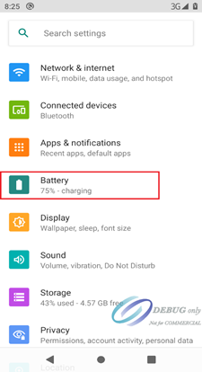

# 概述

BMS功能介绍

# 参考

* [epoll使用详解：epoll_create、epoll_ctl、epoll_wait、close](https://www.cnblogs.com/xuewangkai/p/11158576.html)
* [Android JNI 使用方法总结及原理分析](https://www.jianshu.com/p/9236ad3b9d40)
* [Android Service详解](https://www.jianshu.com/p/6bf03e3cb097)
* [HIDL服务编写实现](https://www.jianshu.com/p/f972f1a8f7dc)
* [Android C++语言 通过Binder通信调用activity: [android.app.IActivityManager] 服务发广播](https://blog.csdn.net/qq_37858386/article/details/121501400)

# 架构图


* 上面架构图有两个改进点：
  * `PaxBmsService.java`和`PaxBatteryManagerService.java`都是系统服务，都是在`system_server`里面，所以不需要binder通信，最好的做法是在`PaxBatteryManagerService.java`直接调用JNI方法，这里主要是通过manager管理接口，比较合理。
  * HIDL中还是采用传统HAL方式，即module/device模型，这种需要将HAL编译成so库，其实是可以在HIDL中直接ioctrl驱动的，更加方便。

上图是BMS新的架构图，注意以下几点：
* 1. `mSystemServiceManager.startService`方法主要就是调用service的onstart方法。
* 2. `ServiceManager.addService("xxxxxbms", mPaxBmsService)`方法是将服务加入到binder，作为binder sercice。
* 3. `PaxBmsService`是`binder server`端，`PaxBmsManager`是服务于`PaxBmsService`的`binder client`端，并给外部提供接口的。
* 4. `PaxBmsManager`调用方式一般都是在`SystemServiceRegistry.java`中先注册一个静态系统服务(不是四大件中的服务)，应用通过`getSystemService(Context.xxxBMS_SERVICE)`调用，两个函数就是put和get操作。

* `base/services/java/com/android/server/SystemServer.java`第一点说明:
```java
private SystemServiceManager mSystemServiceManager;
                        t.traceBegin("PaxBatteryManagerService ");
                        mSystemServiceManager.startService(PaxBatteryManagerService.class);
                        t.traceEnd();

将调用以下方法：
base/services/core/java/com/android/server/SystemServiceManager.java：
   public void startService(@NonNull final SystemService service) {
        // Register it.
        mServices.add(service);
        // Start it.
        long time = SystemClock.elapsedRealtime();
        try {
            service.onStart();
        } catch (RuntimeException ex) {
            throw new RuntimeException("Failed to start service " + service.getClass().getName()
                    + ": onStart threw an exception", ex);
        }
        warnIfTooLong(SystemClock.elapsedRealtime() - time, service, "onStart");
    }
主要功能是注册systemserver和执行onstart方法。
```

* `base/core/java/android/os/ServiceManager.java`第二点，`PaxBmsService`通过addService注册为binder服务端:

```java
    @UnsupportedAppUsage
    public static void addService(String name, IBinder service) {
        addService(name, service, false, IServiceManager.DUMP_FLAG_PRIORITY_DEFAULT);
    }

    /**
     * Place a new @a service called @a name into the service
     * manager.
     *
     * @param name the name of the new service
     * @param service the service object
     * @param allowIsolated set to true to allow isolated sandboxed processes
     * to access this service
     */
    @UnsupportedAppUsage
    public static void addService(String name, IBinder service, boolean allowIsolated) {
        addService(name, service, allowIsolated, IServiceManager.DUMP_FLAG_PRIORITY_DEFAULT);
    }

    /**
     * Place a new @a service called @a name into the service
     * manager.
     *
     * @param name the name of the new service
     * @param service the service object
     * @param allowIsolated set to true to allow isolated sandboxed processes
     * @param dumpPriority supported dump priority levels as a bitmask
     * to access this service
     */
    @UnsupportedAppUsage
    public static void addService(String name, IBinder service, boolean allowIsolated,
            int dumpPriority) {
        try {
            getIServiceManager().addService(name, service, allowIsolated, dumpPriority); //加入到binder sevice
        } catch (RemoteException e) {
            Log.e(TAG, "error in addService", e);
        }
    }
```

* `base/core/java/android/os/ServiceManager.java`第三点，`PaxBmsManager`通过getServiceOrThrow获取`PaxBmsService` binder服务:

```java
    /**
     * Returns a reference to a service with the given name, or throws
     * {@link ServiceNotFoundException} if none is found.
     *
     * @hide
     */
    public static IBinder getServiceOrThrow(String name) throws ServiceNotFoundException {
        final IBinder binder = getService(name);
        if (binder != null) {
            return binder;
        } else {
            throw new ServiceNotFoundException(name);
        }
    }

```

* `base/core/java/android/app/SystemServiceRegistry.java`第四点说明，可以看到以下通过put和get调用:

```java
                registerService(Context.xxxBMS_SERVICE, PaxBmsManager.class,
                new CachedServiceFetcher<PaxBmsManager>() {
                    @Override
                    public PaxBmsManager createService(ContextImpl ctx)
                            throws ServiceNotFoundException {
                        /*IBinder b = ServiceManager.getService("xxxxxbms");
                        IPaxBms service = IPaxBms.Stub.asInterface(b);*/
                        return PaxBmsManager.getInstance();
                    }});

    /**
     * Statically registers a system service with the context.
     * This method must be called during static initialization only.
     */
    private static <T> void registerService(@NonNull String serviceName,
            @NonNull Class<T> serviceClass, @NonNull ServiceFetcher<T> serviceFetcher) {
        SYSTEM_SERVICE_NAMES.put(serviceClass, serviceName);
        SYSTEM_SERVICE_FETCHERS.put(serviceName, serviceFetcher);
        SYSTEM_SERVICE_CLASS_NAMES.put(serviceName, serviceClass.getSimpleName());
    }

    public static Object getSystemService(ContextImpl ctx, String name) {
        if (name == null) {
            return null;
        }
        final ServiceFetcher<?> fetcher = SYSTEM_SERVICE_FETCHERS.get(name);
        ...省略...
    }
```

后续应用层不直接访问driver或设备节点，主要通过Framework层PaxBatteryService和BatteryService来设置/获取相关BMS信息

这样设计主要是2点考虑：

* 1.不同平台的通用性和易移植性
* 2.安全

# 一、电池及充放电信息，通过接收Battery广播来获取

在android原生的基础上增加了下面几个广播信息

```java
public static final String EXTRA_CHARGER_VOLTAGE = "android.os.extra.CHARGER_VOLTAGE";     //充电器电压
public static final String EXTRA_CHARGER_CURRENT = "android.os.extra.CHARGER_CURRENT";     //充电器电流
public static final String EXTRA_SOH = "android.os.extra.SOH";                                                      //电池健康信息
public static final String EXTRA_MANUFACTURER = "android.os.extra.MANUFACTURER";                //电池厂商信息
public static final String EXTRA_SERIAL_NUMBER = "android.os.extra.SERIAL_NUMBER";                 //电池序列号
```
Healthd是对接power supply 驱动的hal层实现，主要是监听power supply 驱动通过uevent上报的事件，并将power supply信息分发给framework层BatteryService
下面的表格为xxxxx要提供power supply信息。


类型 |	节点	| 值类型	| 单位
---|---|---|---
电池是否在位|	present|	int	| 
类型	   | type	| int	| 
电压	   | voltage_now	| int	| uV
开路电压	| voltage_ocv| 	int| 	uV
电流	   |  current_now| 	int| 	uA
电量	   | capacity	| int	
设计容量	 | charge_full_design	| int	
温度	   |  temp	| int| 	10*C | 
当前状态	 | Status	| int	| 
健康状态	 | health| 	str	| 
电池工艺	 | technology	| str	| 
健康信息	 | soh| 	int	| 
充放电周期	|  cycle_count| 	int	| 
厂商信息	 | manufacturer	| str	| 
序列号	  |     serial_number| 	str	| 
充电器是否在|位	online| 	int	| 
类型	   |     type| 	int	| 
电压	   |      voltage_now| 	int	| uV
电流	   |    current_now| 	int| 	uA
最大输入电压|	voltage_max| 	int| 	uV
最大输入电流|	current_max| 	str| 	uA


# 二、充放电控制BMS服务

PaxBmsService.java和PaxBatteryManagerService.java都是系统服务，都是在`system_server`里面，区别就是PaxBatteryManagerService.java跑了onstart方法。
关联文件：
```
frameworks/base/services/core/java/com/android/server/xxxxxbms/OWNERS
frameworks/base/core/java/android/app/PaxBmsManager.java //代理PaxBmsService方法，供PaxBatteryManagerService调用
frameworks/base/services/core/java/com/android/server/xxxxxbms/PaxBmsService.java //system bms service 主要实现打开/关闭 充电及power path功能
frameworks/base/services/core/java/com/xxxxx/server/BatteryTermInfo.java
frameworks/base/services/core/java/com/xxxxx/server/DatabaseHelper.java
frameworks/base/services/core/java/com/xxxxx/server/PaxBatteryManagerService.java //system BatteryManager service 
frameworks/base/services/core/java/com/xxxxx/util/OsPaxApiInternal.java
frameworks/base/services/core/jni/com_android_server_xxxxxbms_PaxBmsService.cpp //jni封装
```

接口定义：
```java
frameworks/base/services/core/java/com/android/server/xxxxxbms/PaxBmsService.java:
    static native void enableCharge_native();
    static native void disableCharge_native();
    static native void enablePowerPath_native();
    static native void disablePowerPath_native();
```

PaxBatteryService提供相关接口给测试程序， 

## 工作模式介绍

* 从电池的续航能力及电池安全两方面定义了2个电池工作模式：
  * 移动模式（Mobile Mode）：
    * 用户终端长期由电池供电为主
  * 桌面模式（Counter-Top Mode）：
    * 用户终端长期由外部供电为主

工作模式	|满充电量|	回充电量
---|---|---
移动模式|	100	|85
桌面模式|	80 |	65

在表格中，满充电量表示电池充电到某个电量后停止充电，由于存在适配器供电不足以满足系统供电场景和有些模块由电池直接供电，因此电量会缓慢下降，当电量下降至回充电量时，重新使能充电。
f
## 电池模式切换

* 主动切换模式
用户可以根据自己的喜好主动切换BMS工作模式

* 通过属性设置
可通过写”persist.sys.battery.type”属性设定电池工作模式，立即生效。
```
persist.sys.battery.type = 0；自动模式
persist.sys.battery.type = 1；移动模式
persist.sys.battery.type = 2；桌面模式
```

如果客户能够明确设备的应用场景，即可在设备出厂前要求设置为适合设备应用场景的模式。
例如：“POS终端+售卖机”的场景，由于这种场景下设备会始终连接电源，可设置其工作模式为桌面模式；在移动办公场景的设备，则可以设置为移动模式。

## 使用方法

* 在应用中进行设置，第一步：打开设置应用


* 第二步：点击 Battery -> Battery Manager




* 第三步：点击Select Charge Mode -> 选择模式


## 自动模式

自动工作模式是指根据用户使用设备的习惯预测电池充电模式。比如：通过前7天同一时间后的6个小时的使用习惯预测充电模式。

1.	设备开机后默认是Mobile Mode;
2.	电池管理服务PaxBatteryManagerService负责记录一个星期内的充电状态，每隔30s记录一次，设备只保留7天的数据，PaxBatteryManagerService每24小时删除一次过期的数据。关机的时间段，数据库中会填充4。
3.	PaxBatteryManagerService每30分钟查询一次当前时间+1~+（1+n）小时时间段的历史数据， n = 6。
当样本数据至少有PREDICTED_DAYS_MIN天的数据量时（取3天,设置了0.05的误差，即当数据量多于3*0.95天的数据量），查询充电状态的数据量，如果充电状态数据量多余非充电状态的数据量时，则切换当前模式为桌面模式（Counter-topMode），否则是移动模式（Mobile Mode）；有效数据量的计算方法：预测时间为7*6h-数据库中4的个数*30s。
4.	切换模式后，设置满充电量和回充电量。

## 工作流程图


系统记录电池状态的写数据库的相关操作如下：


BMS记录设备连接电源线及关机的状态和时间，保存在/data/system/batterylog.db


# 三、异常信息广播APP batterywarning

广播通知节点改为`/sys/class/xxxxx/bms/bms_notify`：

```diff
--- a/device/mediatek/sepolicy/bsp/plat_private/genfs_contexts
+++ b/device/mediatek/sepolicy/bsp/plat_private/genfs_contexts
@@ -32,6 +32,7 @@ genfscon sysfs /devices/platform/11270000.usb3/musb-hdrc/udc/musb-hdrc u:object_
 #path="/sys/devices/platform/(charger|mt-battery)/BatteryNotify"
 genfscon sysfs /devices/platform/charger/BatteryNotify u:object_r:sysfs_battery_warning:s0
 genfscon sysfs /devices/platform/mt-battery/BatteryNotify u:object_r:sysfs_battery_warning:s0
+genfscon sysfs /devices/platform/xxxxx_bms/xxxxx/bms/bms_notify u:object_r:sysfs_battery_warning:s0

 # Purpose : Camera need read cl_cam_status
 # Package: com.mediatek.camera
diff --git a/vendor/mediatek/proprietary/frameworks/opt/batterywarning/batterywarning.cpp b/vendor/mediatek/proprietary/frameworks/opt/batterywarning/batterywarning.cpp
index d4bae84dee9..434e2b197c2 100644
--- a/vendor/mediatek/proprietary/frameworks/opt/batterywarning/batterywarning.cpp
+++ b/vendor/mediatek/proprietary/frameworks/opt/batterywarning/batterywarning.cpp
@@ -152,8 +152,9 @@ bool sendBroadcastMessage(String8 action, int value)


 static const char *charger_file_path[] = {
-    "/sys/devices/platform/charger/BatteryNotify",
-    "/sys/devices/platform/mt-battery/BatteryNotify",
+    //"/sys/devices/platform/charger/BatteryNotify",
+    //"/sys/devices/platform/mt-battery/BatteryNotify",
+       "/sys/class/xxxxx/bms/bms_notify",
 };

 static int read_from_file(const char* path) {
@@ -238,7 +239,7 @@ static void uevent_event(uint32_t /*epevents*/) {

     while (*cp) {

-        if (!strncmp(cp, "CHGSTAT=", strlen("CHGSTAT="))) { // This CHGSTAT value will be provided by kernel driver
+        if (!strncmp(cp, "BMS_STAT=", strlen("BMS_STAT="))) { // This CHGSTAT value will be provided by kernel driver
             readType(buffer);
             break;
         }
```

## 1.异常信息定义

1.	坏电池异常: 系统开机时会先检测电池是否损坏，当连续5次读取电池电压低于阈值（单电芯为2V， 双电芯为4V），系统显示坏电池logo，提示用户电池损坏，需更换电池才能开机
2.	充电器过压异常:  5s检测一次，当连续12次检测到充电器电压高于过压阈值（最大输入电压的1.3倍），则上报异常信息，并停止充电，当读取充电器电压连续12次恢复至正常范围内，则恢复充电
3.	充电超时异常:  当单次充电总时长超过最大允许时长（一般为12小时），则上报异常信息，并停止充电，一旦出现该异常，后续不允许充电，重启才能恢复充电
4.	电池过压异常： 5s检测一次，当连续12次检测到电池电压高于过压阈值（额定电压的1.03倍），则上报异常信息，并停止充电，一旦出现该异常，后续不允许充电，重启才能恢复充电
5.	电池低压异常： 5s检测一次，当连续12次检测到电池电压低于低压阈值（单电芯为3.4V, 双电芯为6.6V），则上报异常信息，应该层收到该异常，启动关机流程
6.	电池高温异常：5s检测一次，当连续12次检测到电池温度高于最大充电温度（45度），则上报异常信息，并停止充电， 当连续12次检测到电池温度恢复至正常范围，则恢复充电
7.	电池低温异常：5s检测一次，当连续12次检测到电池温度低于最低充电温度（0度），则上报异常信息，并停止充电， 当连续12次检测到电池温度恢复至正常范围，则恢复充电
8.	充电IC通讯异常：当联系60次出现IC通讯异常，则上报异常信息，并停止充电，一旦出现该异常，后续不允许充电，重启才能恢复充电
9.	电量计IC通讯异常：处理机制同充电IC通讯异常
10. thermal温度监控并设置电流限制。
11. 注意电池电压必须是开路电压，不然负载大容易导致误关机。

## 2.BMS轮询上报

* `bms.c`以下为工作队列轮询状态:
```C++
 bms_probe(struct platform_device *pdev)
 {
 	INIT_DELAYED_WORK(&g_bms_data.dwork, bms_dwork);
	schedule_delayed_work(&g_bms_data.dwork, 0);   
 }

 static void bms_dwork(struct work_struct *work)
{
	bms_info_update();
	bms_chg_vol_check();
	bms_bat_cur_check();
	bms_bat_vol_check();
	bms_bat_temp_check();
	bms_chg_time_check();
	bms_chg_ic_check();
	bms_gauge_ic_check();
	bms_thermal_check(&g_bms_data);
	bms_dump();
	wait_event_timeout(g_bms_data.bms_wait_q,
			(g_bms_data.bms_wait_timeout == true), msecs_to_jiffies(BMS_POLL_INTERVAL)); //阻塞5s，继续执行
	g_bms_data.bms_wait_timeout = false;
	schedule_delayed_work(&g_bms_data.dwork, 0);
}
```

* 异常状态上报是通过uevent时间上报，上层通过epoll检测到并查看`/sys/class/xxxxx/bms/bms_notify`节点设置值，判断是哪种异常并发送广播上报给App处理：

```C++
bms_notify格式，数字表示第几个bit：
/*start: notify code, should compatible with A800 */
#define NC_CHG_OV				(0)
#define NC_BAT_OT				(1)
#define NC_BAT_OC				(2)
#define NC_BAT_OV				(3)
#define NC_BAT_UT				(5)
#define NC_CHG_IBUS_OCP         (7)
#define NC_CHG_I2C_ERR          (8)

#define NC_CHG_TMO				(13)
#define NC_BAT_I2C_ERR          (14)
#define NC_BAT_UV				(18)

#define NC_DISABLE_CHG_BY_USER  (63)
#define NC_MAX					(64)
#define DISABLE_ALL             0xFFFFFFFFFFFFFFFF
/*end: notify code */

比如电压异常：
bms_chg_vol_check()
{
    bms_set_notify_code(NC_CHG_OV, true, true);
}

static int bms_set_notify_code(int type, bool set, bool update_vote)
{
	if (type >= NC_MAX)
		return 0;

	pr_info("notify_code: 0x%x\n", g_bms_data.notify_code);

	if (set) {
		g_bms_data.notify_code |= (1 << type);
	}
	else {
		g_bms_data.notify_code &= ~(1 << type);
	}

	pr_info("type: %s, set: %d, notify_code: 0x%x\n", notify_type_name[type], set, g_bms_data.notify_code);

	if (update_vote) {
		bms_chg_vote(type, set);
	}

	bms_status_notify();

	return 0;
}

static void bms_status_notify()
{
	char *env[2] = { "BMS_STAT=1", NULL };

	kobject_uevent_env(&g_bms_data.dev->kobj, KOBJ_CHANGE, env);
}
```

主要来看一下thermal如何检测，原理是用电池、CPU、PMIC三个温度根据60%、30%、10%的权重组成一个新的温度值，该值可理解为手机表面温度，根据此温度区别，设置一个电流区间，实时进行限流。

 温度(℃) | 0~15 | 15~35 | 35~38 |38~42|42~45|45~50
------|-------|-------|-------|-------|-------|-------|------
电流限制(ma)| 0|1300|4000|3000|2000|1000|0   

```C++
dts:
    thermal_names = "mtktsbattery", "mtktsAP", "mtktspmic";
    thermal_weights = <60 30 10>;
    chg_skin_temps = <0 15000 35000 38000 42000 45000 50000>;
    chg_currents = <0 1300000 4000000 3000000 2000000 1000000 0>;

static int get_skin_temp(struct bms_data *data)
{
	int i = 0;
	int skin_temp = 0;
	int temp= 0;
	int ret = 0;
	int total_weight = 0;

	for (i = 0; i < data->tinfo_cnt; i++) {
		if (IS_ERR_OR_NULL(data->tinfo[i].name) || (data->tinfo[i].weight <= 0))
			continue;

		data->tinfo[i].tz = thermal_zone_get_zone_by_name(data->tinfo[i].name);
		if (IS_ERR_OR_NULL(data->tinfo[i].tz))
			continue;

		ret = thermal_zone_get_temp(data->tinfo[i].tz, &temp);
		if (ret) {
			continue;
		}

		pr_debug("%s: %p: %s: %d: %d\n", __func__, data->tinfo[i].tz, data->tinfo[i].name, data->tinfo[i].weight, temp);
		if (temp == INVALID_TEMP)
			continue;

		skin_temp += temp * data->tinfo[i].weight;
		total_weight += data->tinfo[i].weight;
	}

	if (total_weight > 0)
		skin_temp = skin_temp / total_weight;
	else
		skin_temp = 25000;

#ifdef BMS_DEBUG
	skin_temp = skin_temp * data->skin_temp_ratio / 100;
#endif

	data->skin_temp = skin_temp / 100;
	pr_debug("%s: skin_temp: %d\n", __func__, skin_temp);

	return skin_temp;
}

int bms_thermal_check(struct bms_data *data)
{
	int skin_temp = 25000;
	int cur_index = 0;
	static int last_index = -1;    //should reset to -1, when charge start
	static int stable_cnt = 0;
	int update_flag = 0;
	int delta_temp = 1000;

	if (!data->bms_thermal_support)
		return 0;

	if (data->bat_info.status != POWER_SUPPLY_STATUS_CHARGING) {
		last_index = -1;
		stable_cnt = 0;
		return 0;
	}

	skin_temp = get_skin_temp(data);
	cur_index = get_temp_range_index(data, skin_temp);
	pr_debug("%s: origin last_index: %d, cur_index: %d\n", __func__, last_index, cur_index);

	if (last_index == -1) {
		last_index = cur_index;
		update_flag = 1;
	}
	else if ((last_index != cur_index)) {
		if (last_index < cur_index)
			delta_temp = 0 - delta_temp;

		cur_index = get_temp_range_index(data, skin_temp + delta_temp);
		pr_debug("%s: actrual last_index: %d, cur_index: %d\n", __func__, last_index, cur_index);
		if (last_index == cur_index)
			stable_cnt = 0;

		stable_cnt++;
		if (stable_cnt >= TEMP_STABLE_CNT) {
			stable_cnt = 0;
			if (last_index < cur_index) {
				last_index ++;
				update_flag = 1;
			}
			else if (last_index > cur_index) {
				last_index --;
				update_flag = 1;
			}
		}
	}
	else {
		stable_cnt = 0;
	}

	if (update_flag) {
		if (data->usb_psy) {
			union power_supply_propval val = {0};
			val.intval = data->tchg_info[last_index].max_chg_current;
			power_supply_set_property(data->usb_psy, POWER_SUPPLY_PROP_CURRENT_MAX, &val);
		}
	}

	return 0;
}
```

## 3.batterywarning C应用epoll异常检测并发送广播上报

* `vendor/mediatek/proprietary/frameworks/opt/batterywarning/batterywarning.cpp`:
```C++
#define LOG_TAG "batterywarning"

#include <stdio.h>
#include <stdlib.h>
#include <utils/Log.h>
#include <utils/String16.h>
#include <binder/BinderService.h>
#include <binder/Parcel.h>
#include <cutils/uevent.h>
#include <sys/epoll.h>
#include <errno.h>

#define MAX_CHAR 100
//M: Currently disabling battery path.. in later stage we will update in code to check path by order. @{
//#ifdef MTK_GM_30
//#define FILE_NAME "/sys/devices/platform/charger/BatteryNotify"
//#else
//#define FILE_NAME "/sys/devices/platform/mt-battery/BatteryNotify"
//#endif
//M: @}
#define ACTION "xxxxx.intent.action.BATTERY_ABNORMAL"
#define NORMAL_ACTION "xxxxx.intent.action.BATTERY_NORMAL"
#define TYPE "type"
#define ARRAY_SIZE(a) (sizeof (a) / sizeof ((a)[0]))
using namespace android;

#define MAX_EPOLL_EVENTS 40
static int uevent_fd;
static int epollfd;
static int eventct;

bool sendBroadcastMessage(String8 action, int value)
{
    ALOGD("sendBroadcastMessage(): Action: %s, Value: %d ", (char *)(action.string()), value);
    sp<IServiceManager> sm = defaultServiceManager();
    sp<IBinder> am = sm->getService(String16("activity"));
    if (am != NULL) {
        Parcel data, reply;
        data.writeInterfaceToken(String16("android.app.IActivityManager"));
        data.writeStrongBinder(NULL);
        // Add for match AMS change on O
        data.writeInt32(1);
        // intent begin
        data.writeString8(action); // action
        data.writeInt32(0); // URI data type
        data.writeString8(NULL, 0); // type
        data.writeString8(NULL, 0); // mIdentifier
        data.writeInt32(0x04000000); // flags: FLAG_RECEIVER_REGISTERED_ONLY_BEFORE_BOOT
        data.writeString8(NULL, 0); // package name
        data.writeString8(NULL, 0); // component name
        data.writeInt32(0); // source bound - size
        data.writeInt32(0); // categories - size
        data.writeInt32(0); // selector - size
        data.writeInt32(0); // clipData - size
        data.writeInt32(-2); // contentUserHint: -2 -> UserHandle.USER_CURRENT
        data.writeInt32(-1); // bundle extras length
        data.writeInt32(0x4C444E42); // 'B' 'N' 'D' 'L'
        int oldPos = data.dataPosition();
        data.writeInt32(1);  // size
        // data.writeInt32(0); // VAL_STRING, need to remove because of analyze common intent
        data.writeString16(String16(TYPE));
        data.writeInt32(1); // VAL_INTEGER
        data.writeInt32(value);
        int newPos = data.dataPosition();
        data.setDataPosition(oldPos - 8);
        data.writeInt32(newPos - oldPos); // refill bundle extras length
        data.setDataPosition(newPos);
        // intent end
        data.writeString8(NULL, 0); // resolvedType
        data.writeStrongBinder(NULL); // resultTo
        data.writeInt32(0); // resultCode
        data.writeString8(NULL, 0); // resultData
        data.writeInt32(-1); // resultExtras
        data.writeString8(NULL, 0); // permission
        data.writeInt32(0); // appOp
        data.writeInt32(-1); // option
        data.writeInt32(1); // serialized: != 0 -> ordered
        data.writeInt32(0); // sticky
        data.writeInt32(-2); // userId: -2 -> UserHandle.USER_CURRENT

        status_t ret = am->transact(IBinder::FIRST_CALL_TRANSACTION + 13, data, &reply); // BROADCAST_INTENT_TRANSACTION
        if (ret == NO_ERROR) {
            int exceptionCode = reply.readExceptionCode();
            if (exceptionCode) {
                ALOGE("sendBroadcastMessage(%s) caught exception %d\n",
                        (char *)(action.string()), exceptionCode);
                return false;
            }
        } else {
            return false;
        }
    } else {
        ALOGE("getService() couldn't find activity service!\n");
        return false;
    }
    return true;
}


static const char *charger_file_path[] = {
    //"/sys/devices/platform/charger/BatteryNotify",
    //"/sys/devices/platform/mt-battery/BatteryNotify",
        "/sys/class/xxxxx/bms/bms_notify",
};

static int read_from_file(const char* path) {
  if(!path) {
     return 0;

  }
  int fd =open(path,O_RDONLY);

  if(fd<0) {
      close(fd);
      return 0;

  }
  else {
      close(fd);
      return 1;
  }
}

int get_charger_file_path() {
  int i = 0;
  for(i=0;i<ARRAY_SIZE(charger_file_path);i++) {
      if(read_from_file(charger_file_path[i])) {
         return i;
      }
  }
  return 0;
}

void readType(char* buffer) {
    FILE * pFile;
    int file_index;
    file_index=get_charger_file_path();
    ALOGD("Inside file_index value : %d\n", file_index);
    pFile = fopen(charger_file_path[file_index], "r");
    if (pFile == NULL) {
        ALOGE("error opening file");
        return;
    } else {
        if (fgets(buffer, MAX_CHAR, pFile) == NULL) {
            fclose(pFile);
            ALOGE("can not get the string from the file");
            return;
        }
    }
    fclose(pFile);
    int type = atoi(buffer);


    if (type==0)
    {
        ALOGD("start activity by send intent to BatteryWarningReceiver to remove notification, type = %d\n", type);
        sendBroadcastMessage(String8(NORMAL_ACTION), type);
    }
    if (type > 0)
    {
        ALOGD("start activity by send intent to BatteryWarningReceiver, type = %d\n", type);
        sendBroadcastMessage(String8(ACTION), type);
    }
}

#define UEVENT_MSG_LEN 2048
static void uevent_event(uint32_t /*epevents*/) {
    char msg[UEVENT_MSG_LEN + 2];
    char *cp;
    char *status;
    int n;
    char *buffer = (char*) malloc(MAX_CHAR * sizeof(char));
    if (buffer == NULL) {
        ALOGD("malloc memory failed");
        return ;
    }
    n = uevent_kernel_multicast_recv(uevent_fd, msg, UEVENT_MSG_LEN);
    if (n <= 0) return;
    if (n >= UEVENT_MSG_LEN) /* overflow -- discard */
        return;

    msg[n] = '\0';
    msg[n + 1] = '\0';
    cp = msg;

    while (*cp) {

        if (!strncmp(cp, "BMS_STAT=", strlen("BMS_STAT="))) { // This CHGSTAT value will be provided by kernel driver
            readType(buffer);
            break;
        }

        /* advance to after the next \0 */
        while (*cp++)
            ;
    }
    free(buffer);
}

int batterywarn_register_event(int fd, void (*handler)(uint32_t)) {
    struct epoll_event ev;
    ev.events = EPOLLIN;

    //if (wakeup == EVENT_WAKEUP_FD) ev.events |= EPOLLWAKEUP;

    ev.data.ptr = (void*)handler;
    if (epoll_ctl(epollfd, EPOLL_CTL_ADD, fd, &ev) == -1) {
        ALOGD("epoll_ctl failed; errno=%d\n", errno);
        return -1;
    }
    return 0;
}


static void uevent_init(void) {
    uevent_fd = uevent_open_socket(64 * 1024, true);
    if (uevent_fd < 0) {
        ALOGD("uevent_init: uevent_open_socket failed\n");
        return;
    }

    fcntl(uevent_fd, F_SETFL, O_NONBLOCK);
    if (batterywarn_register_event(uevent_fd, uevent_event))
        ALOGD("register for uevent events failed\n");
}
static void batterywarn_mainloop(void) {
    int nevents = 0;
    while (1) {
        struct epoll_event events[1];
        nevents = epoll_wait(epollfd, events, 1, -1);
        if (nevents == -1) {
            if (errno == EINTR) continue;
            ALOGD("batterywarn_mainloop: epoll_wait failed\n");
            break;
        }

        for (int n = 0; n < nevents; ++n) {
            if (events[n].data.ptr) (*(void (*)(int))events[n].data.ptr)(events[n].events);
        }
    }

    return;
}
static int batterywarn_init() {
    epollfd = epoll_create(MAX_EPOLL_EVENTS);
    if (epollfd == -1) {
        ALOGD("epoll_create failed; errno=%d\n", errno);
        return -1;
    }
    uevent_init();
    return 0;

}
int main()
{
    char *buffer = (char*) malloc(MAX_CHAR * sizeof(char));
    if (buffer == NULL) {
        ALOGD("malloc memory failed");
        return 0;
    }
  int ret;

  /* Read the status to catch the event when batterywarning is not started */
  readType(buffer);

  ret= batterywarn_init();
  if (ret) {
      ALOGD("Initialization failed, exiting\n");
      exit(1);
  }
  batterywarn_mainloop();
  free(buffer);
  return 0;
}
```

epoll机制暂时不说，我们看看C程序时如何发送广播的，原理是通过Binder通信调用activity: [android.app.IActivityManager] 服务发广播,提到`am->transact(IBinder::FIRST_CALL_TRANSACTION + 13, data, &reply);` 这个会调用哪个函数呢？上面的13是如何而来的呢？这个得分析一下,frameworks\base\core\java\android\app\IActivityManager.aidl，可以知道函数`broadcastIntent`对应第13项。仔细观察会发现transact后面的data参数跟broadcastIntent是对应的，这个是调用的核心的。


另外根据编译生成的文件`out/soong/.intermediates/frameworks/base/framework-minus-apex/android_common/javac/shard30/classes/android/app/IActivityManager$Stub.class`，反编译也可以看到对应函数：


参考：

* [Android C++语言 通过Binder通信调用activity: [android.app.IActivityManager] 服务发广播](https://blog.csdn.net/qq_37858386/article/details/121501400)

```C++
bool sendBroadcastMessage(String8 action, int value)
{
    ALOGD("sendBroadcastMessage(): Action: %s, Value: %d ", (char *)(action.string()), value);
    sp<IServiceManager> sm = defaultServiceManager();
    sp<IBinder> am = sm->getService(String16("activity"));
    if (am != NULL) {
        Parcel data, reply;
        data.writeInterfaceToken(String16("android.app.IActivityManager"));
        data.writeStrongBinder(NULL);
        // Add for match AMS change on O
        data.writeInt32(1);
        // intent begin
        data.writeString8(action); // action
        data.writeInt32(0); // URI data type
        data.writeString8(NULL, 0); // type
        data.writeString8(NULL, 0); // mIdentifier
        data.writeInt32(0x04000000); // flags: FLAG_RECEIVER_REGISTERED_ONLY_BEFORE_BOOT
        data.writeString8(NULL, 0); // package name
        data.writeString8(NULL, 0); // component name
        data.writeInt32(0); // source bound - size
        data.writeInt32(0); // categories - size
        data.writeInt32(0); // selector - size
        data.writeInt32(0); // clipData - size
        data.writeInt32(-2); // contentUserHint: -2 -> UserHandle.USER_CURRENT
        data.writeInt32(-1); // bundle extras length
        data.writeInt32(0x4C444E42); // 'B' 'N' 'D' 'L'
        int oldPos = data.dataPosition();
        data.writeInt32(1);  // size
        // data.writeInt32(0); // VAL_STRING, need to remove because of analyze common intent
        data.writeString16(String16(TYPE));
        data.writeInt32(1); // VAL_INTEGER
        data.writeInt32(value);
        int newPos = data.dataPosition();
        data.setDataPosition(oldPos - 8);
        data.writeInt32(newPos - oldPos); // refill bundle extras length
        data.setDataPosition(newPos);
        // intent end
        data.writeString8(NULL, 0); // resolvedType
        data.writeStrongBinder(NULL); // resultTo
        data.writeInt32(0); // resultCode
        data.writeString8(NULL, 0); // resultData
        data.writeInt32(-1); // resultExtras
        data.writeString8(NULL, 0); // permission
        data.writeInt32(0); // appOp
        data.writeInt32(-1); // option
        data.writeInt32(1); // serialized: != 0 -> ordered
        data.writeInt32(0); // sticky
        data.writeInt32(-2); // userId: -2 -> UserHandle.USER_CURRENT

        status_t ret = am->transact(IBinder::FIRST_CALL_TRANSACTION + 13, data, &reply); // BROADCAST_INTENT_TRANSACTION
        if (ret == NO_ERROR) {
            int exceptionCode = reply.readExceptionCode();
            if (exceptionCode) {
                ALOGE("sendBroadcastMessage(%s) caught exception %d\n",
                        (char *)(action.string()), exceptionCode);
                return false;
            }
        } else {
            return false;
        }
    } else {
        ALOGE("getService() couldn't find activity service!\n");
        return false;
    }
    return true;
}
```

## 4.batterywarning java应用异常处理

目前BMS要求只要低温、高温、低压关机报警功能，首先看看接收异常广播`xxxxx.intent.action.BATTERY_ABNORMAL`入口，主要完成以下事情：
  * 1. 接收`xxxxx.intent.action.BATTERY_ABNORMAL`异常广播，上传的type都是向左移位的，所以需要将原始的tpye根据公式`Math.log`求2的对数的解析出来。
  * 2. 将type值用intent传到`BatteryWarningToShutdown`的activity中进行处理。
* `QSSI.12/packages/apps/BatteryWarning/src/com/xxxxx/batterywarning/BatteryWarningReceiver.java`:
```java
public class BatteryWarningReceiver extends BroadcastReceiver {
     // private static final String ACTION_IPO_BOOT = "android.intent.action.ACTION_BOOT_IPO";
    private static final String ACTION_BATTERY_WARNING = "xxxxx.intent.action.BATTERY_ABNORMAL";
    private static final String ACTION_BATTERY_NORMAL = "xxxxx.intent.action.BATTERY_NORMAL";
    private static final String TAG = "BatteryWarningReceiver";
    private static final String SHARED_PREFERENCES_NAME = "battery_warning_settings";
    private Context mContext;

    // Thermal over temperature
    private static final String ACTION_THERMAL_WARNING = "xxxxx.intent.action.THERMAL_DIAG";

   public void onReceive(Context context, Intent intent) {
        mContext = context;
        String action = intent.getAction();
        Log.d(TAG, "action = " + action);
        if (Intent.ACTION_BOOT_COMPLETED.equals(action)) {
            Log.d(TAG, action + " clear battery_warning_settings shared preference");
            SharedPreferences.Editor editor = getSharedPreferences().edit();
            editor.clear();
            editor.apply();
        } else if (ACTION_BATTERY_WARNING.equals(action)) {
            Log.d(TAG, action + " start activity according to shared preference");
            int type = intent.getIntExtra("type", -1);
            Log.d(TAG, "type = " + type);
            type = (int) (Math.log(type) / Math.log(2));
            Log.d(TAG, "type = " + type);
            if(type == BatteryWarningToShutdown.xxx_BAT_NC_UV | 
			   type == BatteryWarningToShutdown.xxx_BAT_LOW_TEMP | 
			   type == BatteryWarningToShutdown.xxx_BAT_HIGH_TEMP){
                ShowBatteryWaringToShutdownDialog(type);
            }
        }
    }

    private void ShowBatteryWaringToShutdownDialog(int type){
        Intent shutDownIntent = new Intent();
        shutDownIntent.setFlags(Intent.FLAG_ACTIVITY_NEW_TASK
                | Intent.FLAG_ACTIVITY_CLEAR_TOP
                | Intent.FLAG_ACTIVITY_EXCLUDE_FROM_RECENTS);
        shutDownIntent.setClass(mContext, BatteryWarningToShutdown.class);
        shutDownIntent.putExtra(BatteryWarningToShutdown.KEY_TYPE, type);
        mContext.startActivity(shutDownIntent);
    }

}
```

* 处理异常如下：
  * 1. `onCreate`接收到type值，调用弹框`showVoltageUnderWarningDialog`，这里启动10s定时器，并监听`BatteryManager.EXTRA_PLUGGED`广播，拔出usb则关闭定时器。
  * 2. 定时器中发送给handleMessage刷新弹框倒计时时间，mShutDownTime--为0时则关机。
* `QSSI.12/packages/apps/BatteryWarning/src/com/xxxxx/batterywarning/BatteryWarningToShutdown.java`:
```java
public class BatteryWarningToShutdown extends Activity {
    private static final String TAG = "BatteryWarningToShutdown";
    protected static final String KEY_TYPE = "type";
    private static final Uri WARNING_SOUND_URI = Uri.parse("file:///system/media/audio/ui/VideoRecord.ogg");

    protected static final int xxx_BAT_NC_UV = 18;  //under voltage,power off
    protected static final int xxx_BAT_LOW_TEMP = 5;  //under temp,power off
	 protected static final int xxx_BAT_HIGH_TEMP = 1;  //over temp,power off

    private Handler mHandler  = new Handler(){
        public void handleMessage(Message msg) {
            super.handleMessage(msg);
            if(msg.what == 1){
                mShutDownTime--;
                if(mShutDownTime == 0){
                    mContent.setText(getString(R.string.xxxxx_shutdown_now_text));
                    mTimer.cancel();
                    stopRingtone();
                    try{
                        Log.d(TAG, "xxxxx under voltage will shutdown");
                        IPowerManager pm = IPowerManager.Stub.asInterface(
                            ServiceManager.getService(Context.POWER_SERVICE));
                        pm.shutdown(false, "under voltage", false);
                    }catch(RemoteException e){
                        Log.d(TAG, "xxxxx battery under voltage shutdown fail.");
                        e.printStackTrace();
                    }
                } else {
					if (mType == xxx_BAT_LOW_TEMP) {
						mContent.setText(getString(R.string.xxxxx_low_temp_shutdown_time_text, mShutDownTime));
					}
					else {
						mContent.setText(getString(R.string.xxxxx_high_temp_shutdown_time_text, mShutDownTime));
					}
                }
            }
        }
    };

    private Timer mTimer = new Timer(true);

    private TimerTask mTask = new TimerTask() {
        public void run() {
            Message msg = new Message();
            msg.what = 1;
            mHandler.sendMessage(msg);
        }
    };

    private final BroadcastReceiver mReceiver = new BroadcastReceiver() {
        @Override
        public void onReceive(Context context, Intent intent) {
            String action = intent.getAction();
            if (Intent.ACTION_BATTERY_CHANGED.equals(action)) {
                boolean plugged = (0 != intent.getIntExtra(BatteryManager.EXTRA_PLUGGED, 0));
                if (plugged) {
                    Log.d(TAG, "receive ACTION_BATTERY_CHANGED broadcast plugged:" + plugged + ", finish");
                    mTimer.cancel();
                    stopRingtone();
                    finish();
                }
            }
        }
    };

    @Override
    protected void onCreate(Bundle savedInstanceState) {
        super.onCreate(savedInstanceState);
        Intent intent = getIntent();
        mType = intent.getIntExtra(KEY_TYPE, -1);
        Log.d(TAG, "onCreate, mType is " + mType);

        requestWindowFeature(Window.FEATURE_NO_TITLE);
        setContentView(R.layout.xxxxx_battery_notify_warning);

        mTitleView = (TextView) findViewById(R.id.title);
        mContent = (TextView) findViewById(R.id.content);
        mYesButton = (Button) findViewById(R.id.yes);
        if(mType == xxx_BAT_NC_UV){
            showVoltageUnderWarningDialog();
        } if(mType == xxx_BAT_LOW_TEMP){
            showTempLowWarningDialog();
        } else if(mType == xxx_BAT_HIGH_TEMP){
			showTempHighWarningDialog();
		}
		else {
            finish();
        }
    }

    private void showVoltageUnderWarningDialog() {
        mShutDownTime = 10;
        mTitleView.setText(R.string.xxxxx_battery_voltage_under);
        mContent.setText(getString(R.string.xxxxx_shutdown_time_text, mShutDownTime));

        mYesButton.setText(getString(android.R.string.yes));
        mYesButton.setOnClickListener(mYesListener);

        registerReceiver(mReceiver, new IntentFilter(Intent.ACTION_BATTERY_CHANGED));
        playAlertSound(WARNING_SOUND_URI);
        mTimer.schedule(mTask, 0, 1*1000);
    }
}
```

## 5.总体流程打印

流程如下：
  * 1. 底层bms轮询12次过温现象，发送过温code给上层batterywarning，启动notify_code: 0x2。
  * 2. batterywarning发送xxxxx.intent.action.BATTERY_ABNORMAL广播给到BatteryWarning应用，其中type值为2。
  * 3. BatteryWarningReceiver接收到广播并解析弹框。
```shell
#define NC_BAT_OT				(1)
bms.c:
[  510.675050] xxx_BMS:temp: 610, max_bat_temp: 600, out of range.
[  510.681010] xxx_BMS:notify_code: 0x1
[  510.684771] xxx_BMS:type: NC_BAT_OT, set: 1, notify_code: 0x2

batterywarning.cpp:
android:/ # logcat -s batterywarning
--------- beginning of main
11-08 14:08:55.076  2850  2850 D batterywarning: Inside file_index value : 0
11-08 14:08:55.077  2850  2850 D batterywarning: start activity by send intent to BatteryWarningReceiver, type = 2
11-08 14:08:55.077  2850  2850 D batterywarning: sendBroadcastMessage(): Action: xxxxx.intent.action.BATTERY_ABNORMAL, Value: 2

C:\Users\xxx>adb logcat -s BatteryWarningReceiver
--------- beginning of main
11-08 14:08:55.094  3622  3622 D BatteryWarningReceiver: action = xxxxx.intent.action.BATTERY_ABNORMAL
11-08 14:08:55.095  3622  3622 D BatteryWarningReceiver: xxxxx.intent.action.BATTERY_ABNORMAL start activity according to shared preference
11-08 14:08:55.095  3622  3622 D BatteryWarningReceiver: type = 2
11-08 14:08:55.095  3622  3622 D BatteryWarningReceiver: type = 1 //换算成2 << 1
```


### Android 12无法发送广播

驱动层发送uevent事件没问题，使用binder调用函数`broadcastIntent`报错如下：
```
130|A665x:/ # logcat -s batterywarning
--------- beginning of main
09-30 03:47:31.892  3117  3117 D batterywarning: Inside file_index value : 0
09-30 03:47:31.892  3117  3117 D batterywarning: start activity by send intent to BatteryWarningReceiver to remove notification, type = 0
09-30 03:47:31.892  3117  3117 D batterywarning: sendBroadcastMessage(): Action: xxxxx.intent.action.BATTERY_NORMAL, Value: 0
09-30 03:47:31.911  3117  3117 E batterywarning: sendBroadcastMessage(xxxxx.intent.action.BATTERY_NORMAL) caught exception -129
09-30 03:47:48.083  3117  3117 D batterywarning: Inside file_index value : 0
09-30 03:47:48.084  3117  3117 D batterywarning: start activity by send intent to BatteryWarningReceiver, type = 262144
09-30 03:47:48.084  3117  3117 D batterywarning: sendBroadcastMessage(): Action: xxxxx.intent.action.BATTERY_ABNORMAL, Value: 262144
09-30 03:47:48.089  3117  3117 E batterywarning: sendBroadcastMessage(xxxxx.intent.action.BATTERY_ABNORMAL) caught exception -129
```

* `frameworks/base/core/java/android/app/IActivityManager.aidl`函数参数没变一样：
```
//Android 12:
int broadcastIntent(in IApplicationThread caller, in Intent intent,
        in String resolvedType, in IIntentReceiver resultTo, int resultCode,
        in String resultData, in Bundle map, in String[] requiredPermissions,
        int appOp, in Bundle options, boolean serialized, boolean sticky, int userId);

//Android 11:
int broadcastIntent(in IApplicationThread caller, in Intent intent,
        in String resolvedType, in IIntentReceiver resultTo, int resultCode,
        in String resultData, in Bundle map, in String[] requiredPermissions,
        int appOp, in Bundle options, boolean serialized, boolean sticky, int userId);
```

发现Android12对应是不是第13个函数，而是第14个：
* `out/soong/.intermediates/frameworks/base/framework-minus-apex/android_common/javac/shard34/classes/android/d/app/IActivityManager$Stub.class`:


## 4.防止过放功能

实现原理是休眠时根据整机底电流`suspend_current_ua`计算整机能运行最大时长`secs`，启动唤醒定时器进行唤醒。
```C++
static enum alarmtimer_restart xxxxx_battery_alarm_func(struct alarm *alarm, ktime_t ktime)
{
	pr_info("%s: enter\n", __func__);
	__pm_wakeup_event(g_bms_data.bms_ws, 1000);

	return ALARMTIMER_NORESTART;
}

static int bms_start_alarm(unsigned long long secs)
{
	struct timespec time, time_now, end_time;
	ktime_t ktime;

	get_monotonic_boottime(&time_now);
	time.tv_sec = secs;
	time.tv_nsec = 0;
	end_time = timespec_add(time_now, time);
	ktime = ktime_set(end_time.tv_sec, end_time.tv_nsec);

	alarm_start(&g_bms_data.bms_alarm, ktime);

	return 0;
}

static int bms_suspend(struct platform_device *pdev, pm_message_t state)
{
	unsigned long long secs = 0;
	union power_supply_propval val = {0};
	int rm_cap, full_cap;
	int low_rm_cap;
	int ret;

	if (!g_bms_data.bat_psy)
		return 0;

	ret = power_supply_get_property(g_bms_data.bat_psy, POWER_SUPPLY_PROP_CHARGE_FULL, &val);
	if (ret < 0)
		return 0;
	full_cap = val.intval;

	ret = power_supply_get_property(g_bms_data.bat_psy, POWER_SUPPLY_PROP_CHARGE_COUNTER, &val);
	if (ret < 0)
		return 0;
	rm_cap = val.intval;

	low_rm_cap = full_cap * 5 / 100;

	if (rm_cap <= low_rm_cap) {
		secs = 5 * 60;
	}
	else {
		secs = ((rm_cap - low_rm_cap) / g_bms_data.suspend_current_ua * 60 + 5) * 60;
	}

	pr_err("%s. secs = %d\n",__func__, secs);
	bms_start_alarm(secs);

	return 0;
}

static int bms_resume(struct platform_device *pdev)
{
	return 0;
}
```

```log
[ 3850.395822] xxx_CHG: charger_pm_event: enter PM_SUSPEND_PREPARE //进入休眠
[ 3850.401988] Freezing user space processes ...
[ 3850.403149] i2c_read: err wakeup of wq
[ 3850.414895] (elapsed 0.012 seconds) done.
[ 3850.418990] OOM killer disabled.
[ 3850.422260] Freezing remaining freezable tasks ... (elapsed 0.005 seconds) do                                                                                                                               ne.
[ 3850.434994] Suspending console(s) (use no_console_suspend to debug)
[ 3850.447211] ILITEK: (ilitek_tp_pm_suspend, 765): CALL BACK TP PM SUSPEND
[ 3850.460164] [Binder][0x295c2a685fe][03:18:30.189330] wlan: [4077:I:HDD] __wlan_hdd_bus_suspend: 1035: starting bus suspend
[ 3850.464172] ======sp_cat_tp_suspend 336
[ 3850.464189] [xxxxx_authinfo]: gpio_sleep_sp, en=1
[ 3850.464189]
[ 3850.464219] xxx_BMS:bms_suspend. secs = 300 //计算resume时间为300s
[ 3850.464253] xxxxx_base_detect_suspend
[ 3850.587708] Disabling non-boot CPUs ...
[ 3850.588992] CPU1: shutdown
[ 3850.590215] psci: CPU1 killed (polled 0 ms)
[ 3850.592165] CPU2: shutdown
[ 3850.593348] psci: CPU2 killed (polled 4 ms)
[ 3850.595233] CPU3: shutdown
[ 3850.596534] psci: CPU3 killed (polled 4 ms)
[ 3850.597307] suspend ns:    3850597302664     suspend cycles:    2842241709175


[ 3850.597302] resume cycles:    2845988528127
[ 3850.597370] pm_system_irq_wakeup: 173 triggered pm8xxx_rtc_alarm //唤醒
[ 3850.597932] Enabling non-boot CPUs ...
[ 3850.598690] Detected VIPT I-cache on CPU1
[ 3850.598780] arch_timer: CPU1: Trapping CNTVCT access
[ 3850.598834] CPU1: Booted secondary processor 0x0000000001 [0x51af8014]
[ 3850.599825] CPU1 is up
[ 3850.600901] Detected VIPT I-cache on CPU2
[ 3850.600992] arch_timer: CPU2: Trapping CNTVCT access
[ 3850.601048] CPU2: Booted secondary processor 0x0000000002 [0x51af8014]
[ 3850.602044] CPU2 is up
[ 3850.603029] Detected VIPT I-cache on CPU3
[ 3850.603122] arch_timer: CPU3: Trapping CNTVCT access
[ 3850.603178] CPU3: Booted secondary processor 0x0000000003 [0x51af8014]
[ 3850.604146] CPU3 is up
[ 3850.721789] xxxxx_base_detect_resume
[ 3850.722653] xxx_BAT: xxxxx_battery_resume: pre_soc: 4 soc: 4 //唤醒时电量为4%
[ 3850.723752] ///PD dbg info 127d
[ 3850.723758] < 3850.723>TCPC-TCPC:bat_update_work_func battery update soc = 4
[ 3850.723758] < 3850.723>TCPC-TCPC:bat_update_work_func Battery Discharging
[ 3850.723793] ======sp_cat_tp_resume 347
[ 3850.726769] [Binder][0x296a2488d15][03:21:45.602759] wlan: [4077:I:HDD] wlan_hdd_bus_resume: 1226: starting bus resume
[ 3850.730373] ILITEK: (drm_notifier_callback, 471): DRM event:2,blank:3
[ 3850.730379] ILITEK: (drm_notifier_callback, 492): DRM BLANK(3) do not need process
[ 3850.730450] ILITEK: (drm_notifier_callback, 471): DRM event:1,blank:3
[ 3850.730453] ILITEK: (drm_notifier_callback, 492): DRM BLANK(3) do not need process
[ 3850.731232] ILITEK: (ilitek_tp_pm_resume, 779): CALL BACK TP PM RESUME
[ 3850.794730] xxx_BAT: [status:Discharging, health:Good, present:1, tech:Li-ion, capcity:4,cap_rm:152 mah, vol:3567 mv, temp:29, curr:-60 ma, ui_soc:4]
[ 3850.795842] ///PD dbg info 127d
[ 3850.799272] OOM killer enabled.
[ 3850.799275] Restarting tasks ... done.
[ 3850.825627] healthd: battery l=4 v=3567 t=29.0 h=2 st=3 c=-60000 fc=4481000 cc=6 chg=
[ 3850.829577] thermal thermal_zone26: failed to read out thermal zone (-61)
[ 3850.838820] < 3850.795>TCPC-TCPC:bat_update_work_func battery update soc = 4
[ 3850.838820] < 3850.795>TCPC-TCPC:bat_update_work_func Battery Discharging
[ 3850.842930] xxx_CHG: charger_pm_event: enter PM_POST_SUSPEND
[ 3851.009018] Resume caused by IRQ 173, pm8xxx_rtc_alarm // 唤醒源
```

# 四、底层BMS功能接口提供

为了减少bms与charge、guage及平台的耦合性，BMS不和Charge、Guage直接交互，在他们中间增加了BMS Notify，BMS driver调用power_supply_get_property和power_supply_reg_notifier方法通过PSY core来获取Charger和Guage相关信息，同时可通过BMS Notify调bms_notify_call_chain向Charge发送相关指令. 


## HAL层接口实现

```C++
/home/wugn/M8-project/vendor/mediatek/proprietary/hardware/libxxxxx_bms
wugn@jcrj-tf-compile:libxxxxx_bms$ tree
.
├── 1.0
│   └── default
│       ├── android.hardware.xxxxx_bms@1.0-service-lazy.rc
│       ├── android.hardware.xxxxx_bms@1.0-service.rc //rc is for launch HAL service，将调用service.cpp main函数
│       ├── Android.mk
│       ├── PaxBMS.cpp
│       ├── PaxBMS.h
│       ├── service.cpp //defaultPassthroughServiceImplementation<IPaxBMS>(); Hal启动进程android.hardware.xxxxx_bms@1.0-service
│       └── serviceLazy.cpp
├── Android.mk
├── xxxxx_bms.c
└── xxxxx_bms_test.c
```

hal层是采用传统的HAL架构，device调用module方式，关系图如下：


*  `xxxxx_bms.c`作为`hw_module_t`为`hw_device_t`提供xxxxx_bms_ctl(ioctrl)和close_xxxxx_bms方法，主要是实现填充`hw_device_t`结构体中的方法。
* `PaxBMS.cpp`主要在构造函数中调用`getPaxBMSDevice`函数，函数中`hw_get_module`获取并调用hwModule的open方法，open方法会返回`hw_device_t`结构体指针`xxxxx_bmsDevice`，其中就是`hw_module_t`的方法，这样就可以调用`hw_get_module`封装的xxxxx_bms_ctl(ioctrl)和close_xxxxx_bms方法了。

### hw_module_t xxxxx_bms.c

xxxxx_bms.c作为hw_module_t为hw_device_t提供xxxxx_bms_ctl(ioctrl)和close_xxxxx_bms方法。

```C++
vendor/mediatek/proprietary/hardware/libxxxxx_bms/xxxxx_bms.c
#define LOG_TAG "bms"


#include <log/log.h>

#include <stdint.h>
#include <string.h>
#include <unistd.h>
#include <errno.h>
#include <fcntl.h>
#include <pthread.h>
#include <time.h>
#include <stdlib.h>
#include <sys/ioctl.h>
#include <sys/types.h>

#include <hardware/xxxxx_bms.h>

/******************************************************************************/

static pthread_once_t g_init = PTHREAD_ONCE_INIT;
static pthread_mutex_t g_lock = PTHREAD_MUTEX_INITIALIZER;

#define xxx_BMS_DEV			"/dev/xxxxx_bms"

/**
 * device methods
 */

void init_globals(void)
{
    // init the mutex
    pthread_mutex_init(&g_lock, NULL);
}

static int open_xxxxx_bms_dev(void)
{
	int fd = -1;

	fd = open(xxx_BMS_DEV, O_RDWR);

	return fd;
}

/** Close the xxxxx bms device */
static int
close_xxxxx_bms(struct xxxxx_bms_dev_t *dev)
{
    if (dev) {
        free(dev);
    }
    return 0;
}

static int xxxxx_bms_ctl(struct xxxxx_bms_dev_t *dev, unsigned long cmd, void *data)
{
	static int xxxxx_bms_fd = -1;
	int ret = -1;

	if (dev == NULL)
		return -1;

	if (xxxxx_bms_fd < 0) {
		xxxxx_bms_fd = open_xxxxx_bms_dev();

		if (xxxxx_bms_fd < 0) {
			return -ENODEV;
		}
	}

    pthread_mutex_lock(&g_lock);

	switch(cmd) {
		case SET_CHG_EN:
		case SET_POWER_PATH:
			{
				int en = *(int *)data;
				ret = ioctl(xxxxx_bms_fd, cmd, &en);
			}
			break;
		default:
			break;
	};

    pthread_mutex_unlock(&g_lock);

	return ret;
}

/******************************************************************************/

/**
 * module methods
 */

/** Open a new instance of a device using name */
static int open_xxxxx_bms(const struct hw_module_t* module, char const* name,
        struct hw_device_t** device)
{
    pthread_once(&g_init, init_globals);

	if (strcmp(xxx_BMS_HARDWARE_MODULE_ID, name) != 0)
		return -1;

    struct xxxxx_bms_dev_t *dev = malloc(sizeof(struct xxxxx_bms_dev_t));
    if (!dev)
        return -ENOMEM;

    memset(dev, 0, sizeof(*dev));

    dev->common.tag = HARDWARE_DEVICE_TAG;
    dev->common.version = 0;
    dev->common.module = (struct hw_module_t*)module;
    dev->common.close = (int (*)(struct hw_device_t*))close_xxxxx_bms;
    dev->bms_ctl = xxxxx_bms_ctl;

    *device = (struct hw_device_t*)dev;
    return 0;
}


static struct hw_module_methods_t xxxxx_bms_module_methods = {
    .open =  open_xxxxx_bms,
};

/*
 * The xxxxx bms Module
 */
struct hw_module_t HAL_MODULE_INFO_SYM = {
    .tag = HARDWARE_MODULE_TAG,
    //.version_major = 1,
    //.version_minor = 0,
    .id = xxx_BMS_HARDWARE_MODULE_ID,
    .name = "xxxxx_bms Module",
    .author = "xxxxx",
    .methods = &xxxxx_bms_module_methods,
};
```

### hw_device_t PaxBMS.cpp 

`PaxBMS.cpp`主要调用`hw_get_module`获取并调用hwModule的open方法，open方法会返回hw_device_t结构体指针`xxxxx_bmsDevice`，这样就可以调用`hw_get_module`封装的ioctrl方法了。

```c++
vendor/mediatek/proprietary/hardware/libxxxxx_bms/1.0/default/PaxBMS.cpp
/*
 * Copyright (C) 2016 The Android Open Source Project
 *
 * Licensed under the Apache License, Version 2.0 (the "License");
 * you may not use this file except in compliance with the License.
 * You may obtain a copy of the License at
 *
 *      http://www.apache.org/licenses/LICENSE-2.0
 *
 * Unless required by applicable law or agreed to in writing, software
 * distributed under the License is distributed on an "AS IS" BASIS,
 * WITHOUT WARRANTIES OR CONDITIONS OF ANY KIND, either express or implied.
 * See the License for the specific language governing permissions and
 * limitations under the License.
 */
#include "PaxBMS.h"

namespace android {
namespace hardware {
namespace xxxxx_bms {
namespace V1_0 {
namespace implementation {

xxxxx_bms_dev_t* getPaxBMSDevice() {
    xxxxx_bms_dev_t* xxxxx_bmsDevice = NULL;
    const hw_module_t* hwModule = NULL;

    int ret = hw_get_module (xxx_BMS_HARDWARE_MODULE_ID, &hwModule);
    if (ret == 0) {
        ret = hwModule->methods->open(hwModule, xxx_BMS_HARDWARE_MODULE_ID,
            reinterpret_cast<hw_device_t**>(&xxxxx_bmsDevice));
        if (ret != 0) {
            ALOGE("xxxxx_bms_open %s failed: %d", xxx_BMS_HARDWARE_MODULE_ID, ret);
        }
    } else {
        ALOGE("hw_get_module %s failed: %d", xxx_BMS_HARDWARE_MODULE_ID, ret);
    }

    if (ret == 0) {
        return xxxxx_bmsDevice;
    } else {
        ALOGE("PaxBMS passthrough failed to load legacy HAL.");
        return nullptr;
    }
}

PaxBMS::PaxBMS()
  : mPaxBMS(NULL) {
	  mPaxBMS = getPaxBMSDevice();
}

PaxBMS::~PaxBMS() {
	if (mPaxBMS) {
		mPaxBMS->common.close(reinterpret_cast<hw_device_t*>(mPaxBMS));
		mPaxBMS = NULL;
	}
}

// Methods from ::android::hardware::xxxxx_bms::V1_0::IPaxBMS follow.
Return<int32_t> PaxBMS::EnableCharge() {
	int ret = 0;
	int en = 1;

	if (mPaxBMS) {
		ret = mPaxBMS->bms_ctl(mPaxBMS, SET_CHG_EN, &en);
	}

	return ret;
}

// Methods from ::android::hardware::xxxxx_bms::V1_0::IPaxBMS follow.
Return<int32_t> PaxBMS::DisableCharge() {
	int ret = 0;
	int en = 0;

	if (mPaxBMS) {
		ret = mPaxBMS->bms_ctl(mPaxBMS, SET_CHG_EN, &en);
	}

	return ret;
}

// Methods from ::android::hardware::xxxxx_bms::V1_0::IPaxBMS follow.
Return<int32_t> PaxBMS::EnablePowerPath() {
	int ret = 0;
	int en = 1;

	if (mPaxBMS) {
		ret = mPaxBMS->bms_ctl(mPaxBMS, SET_POWER_PATH, &en);
	}

	return ret;
}

// Methods from ::android::hardware::xxxxx_bms::V1_0::IPaxBMS follow.
Return<int32_t> PaxBMS::DisablePowerPath() {
	int ret = 0;
	int en = 0;

	if (mPaxBMS) {
		ret = mPaxBMS->bms_ctl(mPaxBMS, SET_POWER_PATH, &en);
	}

	return ret;
}

IPaxBMS* HIDL_FETCH_IPaxBMS(const char* /* name */) {

    return new PaxBMS();
}

} // namespace implementation
}  // namespace V1_0
}  // namespace xxxxx_bms
}  // namespace hardware
}  // namespace android
```

## HIDL Arch

* HIDL层接口定义：

```C++
/home/wugn/M8-project/hardware/interfaces/xxxxx_bms

wugn@jcrj-tf-compile:xxxxx_bms$ tree
.
└── 1.0
    ├── Android.bp
    ├── IPaxBMS.hal
    └── types.hal

IPaxBMS.hal:
package android.hardware.xxxxx_bms@1.0;

interface IPaxBMS {
    EnableCharge() generates (int32_t res);
    DisableCharge() generates (int32_t res);
    EnablePowerPath() generates (int32_t res);
    DisablePowerPath() generates (int32_t res);
};
```

### 注册HIDL服务

```diff
diff --git a/vendor/mediatek/proprietary/hardware/mtk-hidl-service/Android.mk b/vendor/mediatek/proprietary/hardware/mtk-hidl-service/Android.mk
index d8e5e306de1..d8f5f70318e 100644
--- a/vendor/mediatek/proprietary/hardware/mtk-hidl-service/Android.mk
+++ b/vendor/mediatek/proprietary/hardware/mtk-hidl-service/Android.mk
@@ -30,6 +30,11 @@ LOCAL_SHARED_LIBRARIES += \
     android.hardware.graphics.allocator@2.0 \
     vendor.mediatek.hardware.gpu@1.0 \
 
+#ADD BEGIN by xxx@xxxxx.com, add for BMS 2021/07/12
+LOCAL_SHARED_LIBRARIES += \
+    android.hardware.xxxxx_bms@1.0 \
+#ADD END by xxx@xxxxx.com, add for BMS 2021/07/12
+
     LOCAL_REQUIRED_MODULES := \
         android.hardware.thermal@2.0-impl
 
diff --git a/vendor/mediatek/proprietary/hardware/mtk-hidl-service/service.cpp b/vendor/mediatek/proprietary/hardware/mtk-hidl-service/service.cpp
index be73b5d2be9..0461dbd9a22 100644
--- a/vendor/mediatek/proprietary/hardware/mtk-hidl-service/service.cpp
+++ b/vendor/mediatek/proprietary/hardware/mtk-hidl-service/service.cpp
@@ -27,6 +27,10 @@
 #include <android/hardware/gnss/2.1/IGnss.h>
 #endif
 
+//ADD BEGIN by xxx@xxxxx.com, add for BMS 2021/07/12
+#include <android/hardware/xxxxx_bms/1.0/IPaxBMS.h>
+//ADD END by xxx@xxxxx.com, add for BMS 2021/07/12
+
 using ::android::OK;
 using ::android::status_t;
 using ::android::hardware::configureRpcThreadpool;
@@ -40,6 +44,10 @@ using ::vendor::mediatek::hardware::gpu::V1_0::IGraphicExt;
 using ::android::hardware::gnss::V2_1::IGnss;
 #endif
 
+//ADD BEGIN by xxx@xxxxx.com, add for BMS 2021/07/12
+using ::android::hardware::xxxxx_bms::V1_0::IPaxBMS;
+//ADD END by xxx@xxxxx.com, add for BMS 2021/07/12
+
 #define register(service) do { \
     status_t err = registerPassthroughServiceImplementation<service>(); \
     if (err != OK) { \
@@ -59,6 +67,10 @@ void* mtkHidlService(void *data)
     register(IAllocator);
     register(IGraphicExt);
 
+//ADD BEGIN by xxx@xxxxx.com, add for BMS 2021/07/12
+    register(IPaxBMS);
+//ADD END by xxx@xxxxx.com, add for BMS 2021/07/12
+
 #ifdef MTK_GPS_SUPPORT
     register(IGnss);
     ::vendor::mediatek::hardware::lbs::V1_0::implementation::cpp_main();
-- 
2.17.1
```

### 添加HIDL服务编译选项

```DIFF
--- a/device/mediatek/mt6765/device.mk
+++ b/device/mediatek/mt6765/device.mk
@@ -1051,6 +1051,14 @@ PRODUCT_PACKAGES += \
 PRODUCT_PACKAGES += \
     android.hardware.lights-service.mediatek
 
+#Added BEGIN by xxx@xxxxx.com for BMS @2021-07-12
+PRODUCT_PACKAGES += xxxxx_bms.mt6765
+#PRODUCT_PACKAGES += xxxxx_bms_test
+PRODUCT_PACKAGES += android.hardware.xxxxx_bms@1.0-impl
+PRODUCT_PACKAGES += android.hardware.xxxxx_bms@1.0-service-lazy
+PRODUCT_PACKAGES += android.hardware.xxxxx_bms@1.0-service
+#Added END by xxx@xxxxx.com for BMS @2021-07-12
```

### 添加HIDL manifest

```diff
--- a/device/mediatek/mt6765/manifest.xml
+++ b/device/mediatek/mt6765/manifest.xml
@@ -143,4 +143,16 @@
             <instance>default</instance>
         </interface>
     </hal>
+	<!--ADD BEGIN by xxx@xxxxx.com add for BMS 2021/07/12 -->
+    <hal format="hidl">
+        <name>android.hardware.xxxxx_bms</name>
+        <transport>hwbinder</transport>
+        <impl level="generic"></impl>
+        <version>1.0</version>
+        <interface>
+            <name>IPaxBMS</name>
+            <instance>default</instance>
+        </interface>
+    </hal>
+	<!--ADD END by xxx@xxxxx.com add for BMS 2021/07/12 -->
 </manifest>
```

### 启动HIDL服务

```c++
vendor/mediatek/proprietary/hardware/libxxxxx_bms/1.0/default/android.hardware.xxxxx_bms@1.0-service.rc
@ -0,0 +1,9 @@
service xxxxx_bms-hal-1-0 /vendor/bin/hw/android.hardware.xxxxx_bms@1.0-service
    interface android.hardware.xxxxx_bms@1.0::IPaxBMS default
    oneshot
    class hal
    user system
    group system
    # shutting off xxxxx bms while powering-off
    shutdown critical

vendor/mediatek/proprietary/hardware/libxxxxx_bms/1.0/default/service.cpp
@ -0,0 +1,28 @@
/*
 * Copyright 2016 The Android Open Source Project
 *
 * Licensed under the Apache License, Version 2.0 (the "License");
 * you may not use this file except in compliance with the License.
 * You may obtain a copy of the License at
 *
 *      http://www.apache.org/licenses/LICENSE-2.0
 *
 * Unless required by applicable law or agreed to in writing, software
 * distributed under the License is distributed on an "AS IS" BASIS,
 * WITHOUT WARRANTIES OR CONDITIONS OF ANY KIND, either express or implied.
 * See the License for the specific language governing permissions and
 * limitations under the License.
 */

#define NDEBUG 1
#define LOG_TAG "android.hardware.xxxxx_bms@2.0-service-mediatek"

#include <android/hardware/xxxxx_bms/1.0/IPaxBMS.h>
#include <hidl/LegacySupport.h>

using android::hardware::xxxxx_bms::V1_0::IPaxBMS;
using android::hardware::defaultPassthroughServiceImplementation;

int main() {
    return defaultPassthroughServiceImplementation<IPaxBMS>();
}
```

### 查看HIDL服务进程

实际上是一个`binder_ioctl_write_read`的进程。

```
PAYTABLETM8:/ # ps -A | grep bms
system          479      1 10776264  5036 binder_ioctl_write_read 0 S android.hardware.xxxxx_bms@1.0-service
```

# A665x项目kernel BMS测试结果

* 根据notify APP中得知：
* `BatteryWarningReceiver.java`当收到`xxxxx.intent.action.BATTERY_ABNORMAL`广播时，只处理广播type值为`xxx_BAT_NC_UV`低压事件，处理方式是关机。也就是其他异常没处理，但是都上报上来了:
```java
public class BatteryWarningReceiver extends BroadcastReceiver {
     // private static final String ACTION_IPO_BOOT = "android.intent.action.ACTION_BOOT_IPO";
    private static final String ACTION_BATTERY_WARNING = "xxxxx.intent.action.BATTERY_ABNORMAL";
    private static final String ACTION_BATTERY_NORMAL = "xxxxx.intent.action.BATTERY_NORMAL";
    private static final String TAG = "BatteryWarningReceiver";

    @Override
    public void onReceive(Context context, Intent intent) {
        mContext = context;
        String action = intent.getAction();
        Log.d(TAG, "action = " + action);
        if (Intent.ACTION_BOOT_COMPLETED.equals(action)) {
            Log.d(TAG, action + " clear battery_warning_settings shared preference");
            SharedPreferences.Editor editor = getSharedPreferences().edit();
            editor.clear();
            editor.apply();
        } else if (ACTION_BATTERY_WARNING.equals(action)) {
            Log.d(TAG, action + " start activity according to shared preference");
            int type = intent.getIntExtra("type", -1);
            Log.d(TAG, "type = " + type);
            type = (int) (Math.log(type) / Math.log(2));
            Log.d(TAG, "type = " + type);
            if(type == BatteryWarningToShutdown.xxx_BAT_NC_UV){
                ShowBatteryWaringToShutdownDialog(type);
            }
        }

    private void ShowBatteryWaringToShutdownDialog(int type){ //跳转到BatteryWarningToShutdown
        Intent shutDownIntent = new Intent();
        shutDownIntent.setFlags(Intent.FLAG_ACTIVITY_NEW_TASK
                | Intent.FLAG_ACTIVITY_CLEAR_TOP
                | Intent.FLAG_ACTIVITY_EXCLUDE_FROM_RECENTS);
        shutDownIntent.setClass(mContext, BatteryWarningToShutdown.class);
        shutDownIntent.putExtra(BatteryWarningToShutdown.KEY_TYPE, type);
        mContext.startActivity(shutDownIntent);
    }
};
```

* 低压处理一共分为以下几步：
  * 1. 启动定时器。1秒一次，定时器给handler发送倒计时消息，当mShutDownTime减成0则关机，目前是10s后关机。
  * 2. 接收BATTERY_CHANGED广播，如果插入了usb则不关机，销毁mTimer。
* 低温主要是提示低温弹框，打开YES点击事件监听，用户点击yes则关机，目前暂时没做低温处理。
* `BatteryWarningToShutdown.java`:
```java
public class BatteryWarningToShutdown extends Activity {
    private static final String TAG = "BatteryWarningToShutdown";
    protected static final String KEY_TYPE = "type";
    private static final Uri WARNING_SOUND_URI = Uri.parse("file:///system/media/audio/ui/VideoRecord.ogg");

    protected static final int xxx_BAT_NC_UV = 18;  //under voltage,power off
    protected static final int xxx_BAT_LOW_TEMP = 30;  //under voltage,power off

    private Ringtone mRingtone;
    private TextView mTitleView;
    private TextView mContent;
    private Button mYesButton;
    private int mShutDownTime = -1;
    private int mType = -1;

    private Handler mHandler  = new Handler(){
        public void handleMessage(Message msg) {
            super.handleMessage(msg);
            if(msg.what == 1){
                mShutDownTime--;
                if(mShutDownTime == 0){
                    mContent.setText(getString(R.string.xxxxx_shutdown_now_text));
                    mTimer.cancel();
                    stopRingtone();
                    try{
                        Log.d(TAG, "xxxxx under voltage will shutdown");
                        IPowerManager pm = IPowerManager.Stub.asInterface(
                            ServiceManager.getService(Context.POWER_SERVICE));
                        pm.shutdown(false, "under voltage", false);
                    }catch(RemoteException e){
                        Log.d(TAG, "xxxxx battery under voltage shutdown fail.");
                        e.printStackTrace();
                    }
                } else {
                    mContent.setText(getString(R.string.xxxxx_shutdown_time_text, mShutDownTime));
                }
            }
        }
    };

    private Timer mTimer = new Timer(true);

    private TimerTask mTask = new TimerTask() {//
        public void run() {
            Message msg = new Message();
            msg.what = 1;
            mHandler.sendMessage(msg);
        }
    };

    private final BroadcastReceiver mReceiver = new BroadcastReceiver() {
        @Override
        public void onReceive(Context context, Intent intent) {
            String action = intent.getAction();
            if (Intent.ACTION_BATTERY_CHANGED.equals(action)) {
                boolean plugged = (0 != intent.getIntExtra(BatteryManager.EXTRA_PLUGGED, 0));
                if (plugged) {
                    Log.d(TAG, "receive ACTION_BATTERY_CHANGED broadcast plugged:" + plugged + ", finish");
                    mTimer.cancel(); //如果插入了usb则不关机，销毁mTimer
                    stopRingtone();
                    finish();
                }
            }
        }
    };

    @Override
    protected void onCreate(Bundle savedInstanceState) {
        super.onCreate(savedInstanceState);
        Intent intent = getIntent();
        mType = intent.getIntExtra(KEY_TYPE, -1);
        Log.d(TAG, "onCreate, mType is " + mType);

        requestWindowFeature(Window.FEATURE_NO_TITLE);
        setContentView(R.layout.xxxxx_battery_notify_warning);

        mTitleView = (TextView) findViewById(R.id.title);
        mContent = (TextView) findViewById(R.id.content);
        mYesButton = (Button) findViewById(R.id.yes);
        if(mType == xxx_BAT_NC_UV){
            showVoltageUnderWarningDialog();
        } if(mType == xxx_BAT_LOW_TEMP){
            showTempLowWarningDialog();
        } else {
            finish();
        }
    }

    private void showVoltageUnderWarningDialog() {
        mShutDownTime = 10;
        mTitleView.setText(R.string.xxxxx_battery_voltage_under);
        mContent.setText(getString(R.string.xxxxx_shutdown_time_text, mShutDownTime));

        mYesButton.setText(getString(android.R.string.yes));
        mYesButton.setOnClickListener(mYesListener);

        registerReceiver(mReceiver, new IntentFilter(Intent.ACTION_BATTERY_CHANGED));//接收BATTERY_CHANGED广播，如果插入了usb则不关机，销毁mTimer
        playAlertSound(WARNING_SOUND_URI);
        mTimer.schedule(mTask, 0, 1*1000); //启动定时器。1秒一次，定时器给handler发送倒计时消息，当mShutDownTime减成0则关机
    }

    private void showTempLowWarningDialog() {//提示低温弹框，打开YES点击事件监听
        mShutDownTime = 10;
        mTitleView.setText(R.string.xxxxx_battery_low_temp_title);
        mContent.setText(getString(R.string.xxxxx_low_temp_shutdown_time_text, mShutDownTime));

        mYesButton.setText(getString(android.R.string.yes));
        mYesButton.setOnClickListener(mYesListener);

        playAlertSound(WARNING_SOUND_URI);
        mTimer.schedule(mTask, 0, 1*1000);
    }

    private OnClickListener mYesListener = new OnClickListener() {//关机弹框YES点击事件
        public void onClick(View v) {
            mTimer.cancel();
            stopRingtone();
            try{
                Log.d(TAG, "xxxxx under voltage will shutdown");
                IPowerManager pm = IPowerManager.Stub.asInterface(
                    ServiceManager.getService(Context.POWER_SERVICE));
                pm.shutdown(false, "under voltage", false);
            }catch(RemoteException e){
                Log.d(TAG, "xxxxx battery under voltage shutdown fail.");
                e.printStackTrace();
            }
        }
    };
}
```

## 1.NC_CHG_OV测试

* 首先通过指令`i2cset -f -y 0 0x3f 0x06 0x00 b`将OVP电压设置为6v，记录时间如下：
```
[  188.713780] pd_tcp_notifier_call Charger plug in, polarity = 1
i2cset -f -y 0 0x3f 0x06 0x00 b
```

* `logcat -s BatteryWarningReceiver`:
```
[  276.000160] xxx_CHG: BMS bms_dump: 
09-30 15:51:11.948  3753  3753 D BatteryWarningReceiver: action = xxxxx.intent.action.BATTERY_ABNORMAL
09-30 15:51:11.948  3753  3753 D BatteryWarningReceiver: type = 1
09-30 15:51:11.949  3753  3753 D BatteryW[  276.127060] xxx_CHG: BatteryWarningReceiver: type = 0
```

* 以上一共花了88秒，感觉时间有点长！

## 2.NC_BAT_UT低温NC_BAT_UV低压测试

直接通过命令传参，向`BatteryWarningToShutdown`这个activity传参`xxx_BAT_LOW_TEMP 30`和`xxx_BAT_NC_UV 18`：
```
adb shell am start -n com.xxxxx.batterywarning/.BatteryWarningToShutdown --ei type 18 //低压
adb shell am start -n com.xxxxx.batterywarning/.BatteryWarningToShutdown --ei type 30 //低温
```

* 低温结果：


* 低压结果：


* 低温测试打印：
```
[  878.014934] xxx_BMS:PRESENT = 1
[  878.014943] xxx_BMS:g_bms_data.bat_info.soc = 92
[  878.023565] xxx_BMS:chg vol: 5100000
[  878.032074] xxx_BMS:bat vol: 8520000, bat_no_zcv: 1
[  878.037535] xxx_BMS:temp: -300, min_bat_temp: -100, out of range.
[  878.043704] xxx_BMS:notify_code: 0x1
[  878.047497] xxx_BMS:type: NC_BAT_UT, set: 1, notify_code: 0x20
```

* 高温测试打印：
```
[  163.374401] xxx_BMS:g_bms_data.bat_info.soc = 92
[  163.379360] xxx_BMS:chg vol: 5104000
[  163.387945] xxx_BMS:bat vol: 8494000, bat_no_zcv: 1
[  163.392944] xxx_BMS:temp: 610, max_bat_temp: 600, out of range.
[  163.399139] xxx_BMS:notify_code: 0x1
[  163.402832] xxx_BMS:type: NC_BAT_OT, set: 1, notify_code: 0x2
```

## 3.NC_CHG_TMO超时测试

通过命令`echo 10 > /sys/devices/platform/soc/soc:xxxxx_bms/xxxxx/bms/max_chg_time`设置一个10秒的充电超时时间，打印如下：
```
[  866.816670] xxx_CHG: BMS time: 15, max_chg_time: 10, out of range.
[  866.823019] bms_notify_call_chain
[  866.826570] xxx_CHG: bms_notify_event evt = SET_CHG_EN en:0
[  866.833324] xxx_CHG: enable_charging en: 0 last_en: 1
[  866.838535] xxxxx_charger_update
[  866.850534] xxx_CHG: BMS bms_dump: CHG [online: 0, type: 0, vol: 5000000, cur: 16800000, time: 15], BAT [present: 1, status: 1, vol: 3950000, cur: 449000, resistance: 0, temp: 300, soc: 61], OTHER [skin_temp: 0, chg_vote: 0x2000, notify_code: 0x2400],
```

