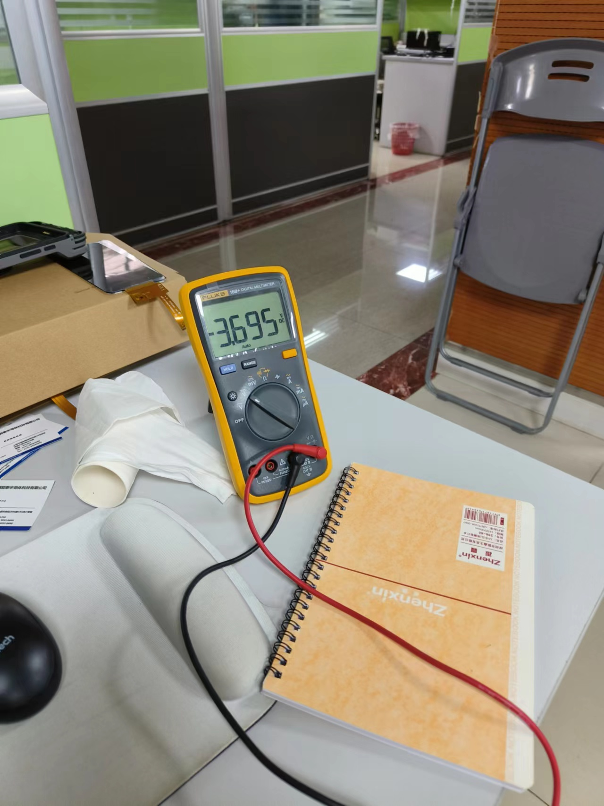

# 概述

charger相关改动经验

# 问题描述

## 低压检测改为OCV，避免在OTG等大电流场景异常关机

nafg_zcv表示电池曲线里面的ocv开路电压。

```diff
--- a/kernel-4.19/drivers/power/supply/mtk_battery.c
+++ b/kernel-4.19/drivers/power/supply/mtk_battery.c
@@ -276,6 +276,9 @@ static enum power_supply_property battery_props[] = {
        // [FEATURE]-ADD-BEGIN by xxx@xxxxx.com 2021-09-17,  for battery serial number
        POWER_SUPPLY_PROP_SERIAL_NUMBER,
        // [FEATURE]-ADD-END by xxx@xxxxx.com 2021-09-17,    for battery serial number
+       // [FEATURE]-ADD-BEGIN by xxx@xxxxx.com 2021-10-03,  for battery ocv
+       POWER_SUPPLY_PROP_VOLTAGE_OCV,
+       // [FEATURE]-ADD-END by xxx@xxxxx.com 2021-10-03,    for battery ocv
 };

 static int battery_psy_get_property(struct power_supply *psy,
@@ -416,6 +419,11 @@ static int battery_psy_get_property(struct power_supply *psy,
                }
                break;
        // [FEATURE]-ADD-END by xxx@xxxxx.com 2021-09-17,    for battery serial number
+       // [FEATURE]-ADD-BEGIN by xxx@xxxxx.com 2021-10-03,  for battery ocv
+       case POWER_SUPPLY_PROP_VOLTAGE_OCV:
+               val->intval = gm->gauge->hw_status.nafg_zcv * 100;
+               break;
+       // [FEATURE]-ADD-END by xxx@xxxxx.com 2021-10-03,    for battery ocv
        default:
                ret = -EINVAL;
                break;

--- a/kernel-4.19/drivers/misc/xxxxx/power/bms/bms.c
+++ b/kernel-4.19/drivers/misc/xxxxx/power/bms/bms.c
@@ -25,9 +25,10 @@
 #include "bms_notify.h"

 extern struct class *g_class_xxxxx;
-
 struct bms_data g_bms_data;

+static void bms_wakeup(void);
+
 static void bms_status_notify()
 {
        char *env[2] = { "BMS_STAT=1", NULL };
@@ -146,7 +147,7 @@ static void bms_bat_vol_check()
        if (!g_bms_data.bat_psy)
                return;

-       ret = power_supply_get_property(g_bms_data.bat_psy, POWER_SUPPLY_PROP_VOLTAGE_NOW, &val);
+       ret = power_supply_get_property(g_bms_data.bat_psy, POWER_SUPPLY_PROP_VOLTAGE_OCV, &val);
        if (ret < 0)
                return;
```

## 提高关机电压至3.55v(闭路)，保留剩余容量800ma

### 第一次修改不生效

以下是截取25度放电曲线`VC=3.55v`左右的数据，可以看到`OCV`在`3.7v`左右，容量在`5700mah`。

OCV 	VC	mAh	R(battery)	DOD	R(x1000)
3787.2	3568.0	4401.3	0.173968254	67	174
3785.6	3565.5	4451.3	0.17468254	68	175
3784.4	3563.9	4501.3	0.175	69	175
3783.4	3562.1	4551.3	0.175634921	69	176
3782.5	3560.8	4601.3	0.175952381	70	176
3781.6	3559.6	4651.3	0.176190476	71	176
3780.3	3557.7	4701.3	0.176666667	72	177
3779.1	3556.2	4751.3	0.176904762	72	177
3778.2	3554.0	4801.4	0.177936508	73	178
3776.6	3551.8	4851.4	0.178412698	74	178
3774.8	3549.4	4901.4	0.178888889	75	179
3772.6	3546.9	4951.4	0.179126984	76	179
3770.1	3544.1	5001.4	0.179365079	76	179


修改方案如下：
* 1.SHUTDOWN_GAUGE0_VOLTAGE = <(37000)>。 //关机条件之一，当soc<=0%, 电池电压达到这个电压就会启动关机流程
* 2.BAT_VOLTAGE_LOW_BOUND关机闭路电压VC改为3.55v
* 3.电池容量g_Q_MAX及g_Q_MAX_H_CURRENT减少800mah。
* 4.pmic最小电压由3.35v提高至3.59v。

```diff
From a14fd9f446d4f0041493db683e8c0b988d1da98f Mon Sep 17 00:00:00 2001
From: xxx <xxx@xxxxx.com>
Date: Tue, 31 May 2022 17:53:51 +0800
Subject: [PATCH] =?UTF-8?q?[Title]:=20M8=E5=85=B3=E6=9C=BA=E7=94=B5?=
 =?UTF-8?q?=E6=B1=A0=E5=AE=B9=E9=87=8F=E4=BD=99=E9=87=8F=E5=A2=9E=E5=8A=A0?=
 =?UTF-8?q?800mAh?=
MIME-Version: 1.0
Content-Type: text/plain; charset=UTF-8
Content-Transfer-Encoding: 8bit

[Summary]: 更新电池参数和fg参数

[Test Plan]: 关机后电池电压在3.7V左右

[Module]: Battery

[Model]: M8

[author]: xxx@xxxxx.com

[date]: 2022-05-31
---
 .../drivers/power/supply/mtk_battery.c        |   10 +-
 .../drivers/power/supply/mtk_battery_table.h  | 1040 +++++++++--------
 2 files changed, 527 insertions(+), 523 deletions(-)

diff --git a/kernel-4.19/drivers/power/supply/mtk_battery.c b/kernel-4.19/drivers/power/supply/mtk_battery.c
index aa720a32203..5c16c6e868c 100755
--- a/kernel-4.19/drivers/power/supply/mtk_battery.c
+++ b/kernel-4.19/drivers/power/supply/mtk_battery.c
@@ -1069,9 +1069,9 @@ void fg_custom_init_from_header(struct mtk_battery *gm)
 	fg_cust_data->shutdown_gauge0 = SHUTDOWN_GAUGE0;
 	fg_cust_data->shutdown_1_time = SHUTDOWN_1_TIME;
 	fg_cust_data->shutdown_gauge1_xmins = SHUTDOWN_GAUGE1_XMINS;
-	fg_cust_data->shutdown_gauge0_voltage = SHUTDOWN_GAUGE0_VOLTAGE;
+	fg_cust_data->shutdown_gauge0_voltage = g_shutdown_gauge0_voltage[gm->battery_id];
 	fg_cust_data->shutdown_gauge1_vbat_en = SHUTDOWN_GAUGE1_VBAT_EN;
-	fg_cust_data->shutdown_gauge1_vbat = SHUTDOWN_GAUGE1_VBAT;
+	fg_cust_data->shutdown_gauge1_vbat = g_shutdown_gauge1_vbat[gm->battery_id];
 	fg_cust_data->power_on_car_chr = POWER_ON_CAR_CHR;
 	fg_cust_data->power_on_car_nochr = POWER_ON_CAR_NOCHR;
 	fg_cust_data->shutdown_car_ratio = SHUTDOWN_CAR_RATIO;
@@ -2746,7 +2746,7 @@ int disable_shutdown_cond(struct mtk_battery *gm, int shutdown_cond)
 		sdc->lowbatteryshutdown = false;
 		bm_debug("disable LOW_BAT_VOLT avgvbat %d ,threshold:%d %d %d\n",
 		sdc->avgvbat,
-		BAT_VOLTAGE_HIGH_BOUND,
+		g_bat_vol_high_bound[gm->battery_id],
 		sdc->vbat_lt,
 		sdc->vbat_lt_lv1);
 		break;
@@ -2983,12 +2983,12 @@ static int shutdown_event_handler(struct mtk_battery *gm)
 			sdd->vbat_lt,
 			sdd->vbat_lt_lv1,
 			tmp,
-			BAT_VOLTAGE_LOW_BOUND,
+			g_bat_vol_low_bound[gm->battery_id],
 			LOW_TEMP_THRESHOLD,
 			LOW_TMP_BAT_VOLTAGE_LOW_BOUND,
 			LOW_TEMP_DISABLE_LOW_BAT_SHUTDOWN);
 
-		if (sdd->avgvbat < BAT_VOLTAGE_LOW_BOUND) {
+		if (sdd->avgvbat < g_bat_vol_low_bound[gm->battery_id]) {
 			/* avg vbat less than 3.4v */
 			sdd->lowbatteryshutdown = true;
 			polling++;
diff --git a/kernel-4.19/drivers/power/supply/mtk_battery_table.h b/kernel-4.19/drivers/power/supply/mtk_battery_table.h
index c67c7e746f9..331fdd8a686 100755
--- a/kernel-4.19/drivers/power/supply/mtk_battery_table.h
+++ b/kernel-4.19/drivers/power/supply/mtk_battery_table.h
@@ -288,6 +288,12 @@
 
 /*#define MTK_GET_BATTERY_ID_BY_GPIO*/
 
+int g_bat_vol_low_bound[] = {3450, 3450, 3550, 3450}; //关机闭路电压
+int g_bat_vol_high_bound[] = {3450, 3450, 3550, 3450};
+
+int g_shutdown_gauge1_vbat[] = {3400, 3400, 3700, 3400}; //关机开路电压
+int g_shutdown_gauge0_voltage[] = {3400, 3400, 3700, 3400};
+
 #define M8_PCB_RESISTANCE 600
 // [FEATURE]-ADD-BEGIN by xxx@xxxxx.com 2021-09-17, 	for battery serial number
 const char *g_serial_number[TOTAL_BATTERY_NUMBER] = {
@@ -301,11 +307,11 @@ const char *g_serial_number[TOTAL_BATTERY_NUMBER] = {
 /* Qmax for battery  */
 int g_Q_MAX[MAX_TABLE][TOTAL_BATTERY_NUMBER] = { //总容量减小800mah
 	/*bat1,   bat2,   bat3,    bat4*/
-	{ 3013, 3031, 6422, 1965},/*T0*/
-	{ 3030, 3077, 6510, 1984},/*T1*/
-	{ 3014, 3048, 6555, 1946},/*T2*/
-	{ 2934, 3073, 6413, 1873},/*T3*/
-	{ 2761, 3069, 5377, 1851},/*T4*/
+	{ 3013, 3031, 5543, 1965},/*T0*/
+	{ 3030, 3077, 5783, 1984},/*T1*/
+	{ 3014, 3048, 5857, 1946},/*T2*/
+	{ 2934, 3073, 5843, 1873},/*T3*/
+	{ 2761, 3069, 5012, 1851},/*T4*/
 	{ 2211, 1652, 1533, 1541},/*T5*/
 	{ 2201, 1642, 1523, 1531},/*T6*/
 	{ 2191, 1632, 1513, 1521},/*T7*/
@@ -315,11 +321,11 @@ int g_Q_MAX[MAX_TABLE][TOTAL_BATTERY_NUMBER] = {
 
 int g_Q_MAX_H_CURRENT[MAX_TABLE][TOTAL_BATTERY_NUMBER] = { //Cmax_600mA
 	/*bat1,   bat2,   bat3,    bat4*/
-	{ 3027, 3010, 6318, 1665},/*T0*/
-	{ 3091, 3050, 6382, 1684},/*T1*/
-	{ 3012, 2841, 6102, 1646},/*T2*/
-	{ 2188, 2555, 4751, 1573},/*T3*/
-	{ 1100, 2966, 2427, 1551},/*T4*/
+	{ 3027, 3010, 5507, 1665},/*T0*/
+	{ 3091, 3050, 5778, 1684},/*T1*/
+	{ 3012, 2841, 5851, 1646},/*T2*/
+	{ 2188, 2555, 5163, 1573},/*T3*/
+	{ 1100, 2966, 5010, 1551},/*T4*/
 	{ 2210, 1650, 1533, 1541},/*T5*/
 	{ 2200, 1640, 1523, 1531},/*T6*/
 	{ 2190, 1630, 1513, 1521},/*T7*/
@@ -327,7 +333,7 @@ int g_Q_MAX_H_CURRENT[MAX_TABLE][TOTAL_BATTERY_NUMBER] = {
 	{ 2170, 1610, 1493, 1501} /*T9*/
 };
 
-int g_Q_MAX_SYS_VOLTAGE[TOTAL_BATTERY_NUMBER] = { 3400, 3400, 3400, 3400};
+int g_Q_MAX_SYS_VOLTAGE[TOTAL_BATTERY_NUMBER] = { 3400, 3400, 3700, 3400};  //感觉改了没用
 
 /* 0~0.5V for battery 0, 0.5~1V for battery 1*/
 /* 1~1.5V for battery 2, -1 for the last one (battery 3) */
@@ -383,11 +389,11 @@ int g_FG_PSEUDO1_OFFSET[TOTAL_BATTERY_NUMBER] = {0, 0, 0, 0};
 /* pmic_min_vol by temp ,control by MULTI_TEMP_GAUGE0=1, 34000=3.4v */
 int g_PMIC_MIN_VOL[MAX_TABLE][TOTAL_BATTERY_NUMBER] = {
 	/*bat1,   bat2,   bat3,    bat4*/
-	{33500, 33500, 33500, 33500},/*T0*/
-	{33500, 33500, 33500, 33500},/*T1*/
-	{33500, 33500, 33500, 33500},/*T2*/
-	{32200, 32200, 32200, 32200},/*T3*/
-	{31000, 31000, 31000, 31000},/*T4*/
+	{33500, 33500, 35900, 33500},/*T0*/
+	{33500, 33500, 35900, 33500},/*T1*/
+	{33500, 33500, 35900, 33500},/*T2*/
+	{32200, 32200, 34000, 32200},/*T3*/
+	{31000, 31000, 32000, 31000},/*T4*/
 	{33001, 33006, 33009, 33004},/*T5*/
 	{33002, 33007, 33008, 33003},/*T6*/
 	{33003, 33008, 33007, 33002},/*T7*/
@@ -3802,106 +3808,106 @@ struct fuelgauge_profile_struct fg_profile_t9[TOTAL_BATTERY_NUMBER][90] = {
 /* T0 */
 struct fuelgauge_profile_struct fg_profile_t0_m8[TOTAL_BATTERY_NUMBER][100] = {
 	{
-		{ 0     , 43635, 1070 + M8_PCB_RESISTANCE },  
-		{ 500   , 43492, 1070 + M8_PCB_RESISTANCE },
-		{ 1000  , 43374, 1070 + M8_PCB_RESISTANCE },
-		{ 1500  , 43260, 1070 + M8_PCB_RESISTANCE },
-		{ 2000  , 43157, 1070 + M8_PCB_RESISTANCE },
-		{ 2500  , 43061, 1070 + M8_PCB_RESISTANCE },
-		{ 3000  , 42962, 1070 + M8_PCB_RESISTANCE },
-		{ 3500  , 42869, 1070 + M8_PCB_RESISTANCE },
-		{ 4000  , 42776, 1070 + M8_PCB_RESISTANCE },
-		{ 4500  , 42683, 1070 + M8_PCB_RESISTANCE },
-		{ 5000  , 42590, 1070 + M8_PCB_RESISTANCE },
-		{ 5500  , 42500, 1070 + M8_PCB_RESISTANCE },
-		{ 6000  , 42410, 1070 + M8_PCB_RESISTANCE },
-		{ 6500  , 42320, 1070 + M8_PCB_RESISTANCE },
-		{ 7000  , 42230, 1070 + M8_PCB_RESISTANCE },
-		{ 8000  , 42051, 1070 + M8_PCB_RESISTANCE },
-		{ 9000  , 41877, 1080 + M8_PCB_RESISTANCE },
-		{ 10000 , 41703, 1070 + M8_PCB_RESISTANCE },
-		{ 11000 , 41530, 1080 + M8_PCB_RESISTANCE },
-		{ 12000 , 41359, 1080 + M8_PCB_RESISTANCE },
-		{ 13000 , 41195, 1080 + M8_PCB_RESISTANCE },
-		{ 14000 , 41034, 1080 + M8_PCB_RESISTANCE },
-		{ 15000 , 40873, 1090 + M8_PCB_RESISTANCE },
-		{ 16000 , 40714, 1090 + M8_PCB_RESISTANCE },
-		{ 17000 , 40559, 1090 + M8_PCB_RESISTANCE },
-		{ 18000 , 40411, 1100 + M8_PCB_RESISTANCE },
-		{ 19000 , 40265, 1100 + M8_PCB_RESISTANCE },
-		{ 20000 , 40125, 1100 + M8_PCB_RESISTANCE },
-		{ 21000 , 39989, 1110 + M8_PCB_RESISTANCE },
-		{ 22000 , 39856, 1120 + M8_PCB_RESISTANCE },
-		{ 23000 , 39732, 1120 + M8_PCB_RESISTANCE },
-		{ 24000 , 39608, 1130 + M8_PCB_RESISTANCE },
-		{ 25000 , 39493, 1130 + M8_PCB_RESISTANCE },
-		{ 26000 , 39378, 1140 + M8_PCB_RESISTANCE },
-		{ 27000 , 39270, 1160 + M8_PCB_RESISTANCE },
-		{ 28000 , 39143, 1150 + M8_PCB_RESISTANCE },
-		{ 29000 , 38926, 1100 + M8_PCB_RESISTANCE },
-		{ 30000 , 38721, 1070 + M8_PCB_RESISTANCE },
-		{ 31000 , 38606, 1070 + M8_PCB_RESISTANCE },
-		{ 32000 , 38513, 1070 + M8_PCB_RESISTANCE },
-		{ 33000 , 38423, 1060 + M8_PCB_RESISTANCE },
-		{ 34000 , 38346, 1060 + M8_PCB_RESISTANCE },
-		{ 35000 , 38278, 1070 + M8_PCB_RESISTANCE },
-		{ 36000 , 38209, 1070 + M8_PCB_RESISTANCE },
-		{ 37000 , 38144, 1070 + M8_PCB_RESISTANCE },
-		{ 37500 , 38113, 1070 + M8_PCB_RESISTANCE },
-		{ 38000 , 38085, 1070 + M8_PCB_RESISTANCE },
-		{ 38500 , 38058, 1080 + M8_PCB_RESISTANCE },
-		{ 39000 , 38030, 1080 + M8_PCB_RESISTANCE },
-		{ 39500 , 38002, 1080 + M8_PCB_RESISTANCE },
-		{ 40000 , 37980, 1080 + M8_PCB_RESISTANCE },
-		{ 40500 , 37952, 1080 + M8_PCB_RESISTANCE },
-		{ 41000 , 37930, 1090 + M8_PCB_RESISTANCE },
-		{ 41500 , 37909, 1090 + M8_PCB_RESISTANCE },
-		{ 42000 , 37884, 1090 + M8_PCB_RESISTANCE },
-		{ 42500 , 37865, 1090 + M8_PCB_RESISTANCE },
-		{ 43000 , 37844, 1100 + M8_PCB_RESISTANCE },
-		{ 43500 , 37825, 1100 + M8_PCB_RESISTANCE },
-		{ 44000 , 37806, 1100 + M8_PCB_RESISTANCE },
-		{ 44500 , 37788, 1100 + M8_PCB_RESISTANCE },
-		{ 45000 , 37769, 1100 + M8_PCB_RESISTANCE },
-		{ 45500 , 37751, 1100 + M8_PCB_RESISTANCE },
-		{ 46000 , 37720, 1100 + M8_PCB_RESISTANCE },
-		{ 46500 , 37673, 1080 + M8_PCB_RESISTANCE },
-		{ 47000 , 37608, 1070 + M8_PCB_RESISTANCE },
-		{ 47500 , 37546, 1060 + M8_PCB_RESISTANCE },
-		{ 48000 , 37506, 1060 + M8_PCB_RESISTANCE },
-		{ 48500 , 37478, 1070 + M8_PCB_RESISTANCE },
-		{ 49000 , 37450, 1070 + M8_PCB_RESISTANCE },
-		{ 49500 , 37419, 1080 + M8_PCB_RESISTANCE },
-		{ 50000 , 37388, 1070 + M8_PCB_RESISTANCE },
-		{ 50500 , 37354, 1070 + M8_PCB_RESISTANCE },
-		{ 51000 , 37323, 1070 + M8_PCB_RESISTANCE },
-		{ 51500 , 37295, 1070 + M8_PCB_RESISTANCE },
-		{ 52000 , 37270, 1080 + M8_PCB_RESISTANCE },
-		{ 52500 , 37245, 1080 + M8_PCB_RESISTANCE },
-		{ 53000 , 37220, 1080 + M8_PCB_RESISTANCE },
-		{ 53500 , 37183, 1080 + M8_PCB_RESISTANCE },
-		{ 54000 , 37143, 1080 + M8_PCB_RESISTANCE },
-		{ 54500 , 37090, 1080 + M8_PCB_RESISTANCE },
-		{ 55000 , 37038, 1080 + M8_PCB_RESISTANCE },
-		{ 55500 , 36994, 1080 + M8_PCB_RESISTANCE },
-		{ 56000 , 36948, 1090 + M8_PCB_RESISTANCE },
-		{ 56500 , 36886, 1080 + M8_PCB_RESISTANCE },
-		{ 57000 , 36817, 1060 + M8_PCB_RESISTANCE },
-		{ 57500 , 36780, 1060 + M8_PCB_RESISTANCE },
-		{ 58000 , 36768, 1060 + M8_PCB_RESISTANCE },
-		{ 58500 , 36762, 1080 + M8_PCB_RESISTANCE },
-		{ 59000 , 36759, 1090 + M8_PCB_RESISTANCE },
-		{ 59500 , 36749, 1110 + M8_PCB_RESISTANCE },
-		{ 60000 , 36740, 1140 + M8_PCB_RESISTANCE },
-		{ 60500 , 36724, 1160 + M8_PCB_RESISTANCE },
-		{ 61000 , 36697, 1180 + M8_PCB_RESISTANCE },
-		{ 61500 , 36616, 1180 + M8_PCB_RESISTANCE },
-		{ 62000 , 36380, 1120 + M8_PCB_RESISTANCE },
-		{ 62500 , 36039, 1120 + M8_PCB_RESISTANCE },
-		{ 63000 , 35624, 1130 + M8_PCB_RESISTANCE },
-		{ 63500 , 35103, 1150 + M8_PCB_RESISTANCE },
-		{ 64000 , 34421, 1170 + M8_PCB_RESISTANCE },
-		{ 64468 , 33506, 1200 + M8_PCB_RESISTANCE },
+		{0,     43635, 1067+M8_PCB_RESISTANCE},
+		{500,   43492, 1067+M8_PCB_RESISTANCE},
+		{1000,  43374, 1069+M8_PCB_RESISTANCE},
+		{1500,  43260, 1068+M8_PCB_RESISTANCE},
+		{2000,  43157, 1067+M8_PCB_RESISTANCE},
+		{2500,  43061, 1069+M8_PCB_RESISTANCE},
+		{3000,  42962, 1065+M8_PCB_RESISTANCE},
+		{3500,  42869, 1067+M8_PCB_RESISTANCE},
+		{4000,  42776, 1067+M8_PCB_RESISTANCE},
+		{4500,  42683, 1065+M8_PCB_RESISTANCE},
+		{5000,  42590, 1067+M8_PCB_RESISTANCE},
+		{5500,  42500, 1069+M8_PCB_RESISTANCE},
+		{6000,  42410, 1069+M8_PCB_RESISTANCE},
+		{6500,  42320, 1069+M8_PCB_RESISTANCE},
+		{7000,  42230, 1069+M8_PCB_RESISTANCE},
+		{7500,  42140, 1069+M8_PCB_RESISTANCE},
+		{8000,  42051, 1073+M8_PCB_RESISTANCE},
+		{8500,  41964, 1073+M8_PCB_RESISTANCE},
+		{9000,  41877, 1075+M8_PCB_RESISTANCE},
+		{9500,  41790, 1075+M8_PCB_RESISTANCE},
+		{10000, 41703, 1074+M8_PCB_RESISTANCE},
+		{10500, 41617, 1075+M8_PCB_RESISTANCE},
+		{11000, 41530, 1075+M8_PCB_RESISTANCE},
+		{11500, 41446, 1077+M8_PCB_RESISTANCE},
+		{12000, 41359, 1077+M8_PCB_RESISTANCE},
+		{12500, 41279, 1080+M8_PCB_RESISTANCE},
+		{13000, 41195, 1080+M8_PCB_RESISTANCE},
+		{13500, 41114, 1082+M8_PCB_RESISTANCE},
+		{14000, 41034, 1084+M8_PCB_RESISTANCE},
+		{15000, 40873, 1088+M8_PCB_RESISTANCE},
+		{15500, 40792, 1087+M8_PCB_RESISTANCE},
+		{16000, 40714, 1087+M8_PCB_RESISTANCE},
+		{16500, 40637, 1089+M8_PCB_RESISTANCE},
+		{17000, 40559, 1092+M8_PCB_RESISTANCE},
+		{17500, 40488, 1097+M8_PCB_RESISTANCE},
+		{18000, 40411, 1095+M8_PCB_RESISTANCE},
+		{19000, 40265, 1100+M8_PCB_RESISTANCE},
+		{19500, 40194, 1100+M8_PCB_RESISTANCE},
+		{20000, 40125, 1104+M8_PCB_RESISTANCE},
+		{20500, 40054, 1104+M8_PCB_RESISTANCE},
+		{21000, 39989, 1109+M8_PCB_RESISTANCE},
+		{22000, 39856, 1115+M8_PCB_RESISTANCE},
+		{22500, 39794, 1117+M8_PCB_RESISTANCE},
+		{23000, 39732, 1122+M8_PCB_RESISTANCE},
+		{23500, 39670, 1124+M8_PCB_RESISTANCE},
+		{24000, 39608, 1126+M8_PCB_RESISTANCE},
+		{25000, 39493, 1134+M8_PCB_RESISTANCE},
+		{25500, 39437, 1141+M8_PCB_RESISTANCE},
+		{26000, 39378, 1143+M8_PCB_RESISTANCE},
+		{26500, 39322, 1148+M8_PCB_RESISTANCE},
+		{27000, 39270, 1156+M8_PCB_RESISTANCE},
+		{28000, 39143, 1153+M8_PCB_RESISTANCE},
+		{28500, 39056, 1142+M8_PCB_RESISTANCE},
+		{29000, 38926, 1104+M8_PCB_RESISTANCE},
+		{29500, 38808, 1080+M8_PCB_RESISTANCE},
+		{30000, 38721, 1068+M8_PCB_RESISTANCE},
+		{30500, 38662, 1070+M8_PCB_RESISTANCE},
+		{31000, 38606, 1067+M8_PCB_RESISTANCE},
+		{32000, 38513, 1067+M8_PCB_RESISTANCE},
+		{32500, 38467, 1065+M8_PCB_RESISTANCE},
+		{33000, 38423, 1060+M8_PCB_RESISTANCE},
+		{33500, 38389, 1067+M8_PCB_RESISTANCE},
+		{34000, 38346, 1062+M8_PCB_RESISTANCE},
+		{35000, 38278, 1068+M8_PCB_RESISTANCE},
+		{35500, 38240, 1067+M8_PCB_RESISTANCE},
+		{36000, 38209, 1067+M8_PCB_RESISTANCE},
+		{36500, 38175, 1069+M8_PCB_RESISTANCE},
+		{37000, 38144, 1072+M8_PCB_RESISTANCE},
+		{37500, 38113, 1072+M8_PCB_RESISTANCE},
+		{38000, 38085, 1074+M8_PCB_RESISTANCE},
+		{39000, 38030, 1082+M8_PCB_RESISTANCE},
+		{39500, 38002, 1082+M8_PCB_RESISTANCE},
+		{40000, 37980, 1084+M8_PCB_RESISTANCE},
+		{40500, 37952, 1084+M8_PCB_RESISTANCE},
+		{41000, 37930, 1089+M8_PCB_RESISTANCE},
+		{42000, 37884, 1092+M8_PCB_RESISTANCE},
+		{42500, 37865, 1094+M8_PCB_RESISTANCE},
+		{43000, 37844, 1095+M8_PCB_RESISTANCE},
+		{43500, 37825, 1097+M8_PCB_RESISTANCE},
+		{44000, 37806, 1099+M8_PCB_RESISTANCE},
+		{44500, 37788, 1100+M8_PCB_RESISTANCE},
+		{45000, 37769, 1100+M8_PCB_RESISTANCE},
+		{46000, 37720, 1095+M8_PCB_RESISTANCE},
+		{46500, 37673, 1080+M8_PCB_RESISTANCE},
+		{47000, 37608, 1067+M8_PCB_RESISTANCE},
+		{47500, 37546, 1060+M8_PCB_RESISTANCE},
+		{48000, 37506, 1063+M8_PCB_RESISTANCE},
+		{49000, 37450, 1073+M8_PCB_RESISTANCE},
+		{49500, 37419, 1075+M8_PCB_RESISTANCE},
+		{50000, 37388, 1073+M8_PCB_RESISTANCE},
+		{50500, 37354, 1070+M8_PCB_RESISTANCE},
+		{51000, 37323, 1073+M8_PCB_RESISTANCE},
+		{51500, 37295, 1073+M8_PCB_RESISTANCE},
+		{52000, 37270, 1077+M8_PCB_RESISTANCE},
+		{53000, 37220, 1084+M8_PCB_RESISTANCE},
+		{53500, 37183, 1084+M8_PCB_RESISTANCE},
+		{54000, 37143, 1084+M8_PCB_RESISTANCE},
+		{54500, 37090, 1080+M8_PCB_RESISTANCE},
+		{55000, 37038, 1077+M8_PCB_RESISTANCE},
+		{55500, 36994, 1082+M8_PCB_RESISTANCE},
 	},
 	{
 		{0, 0, 0}
@@ -3917,107 +3923,106 @@ struct fuelgauge_profile_struct fg_profile_t0_m8[TOTAL_BATTERY_NUMBER][100] = {
 /* T1 */
 struct fuelgauge_profile_struct fg_profile_t1_m8[TOTAL_BATTERY_NUMBER][100] = {
 	{
-		{ 0,      43737, 1300 + M8_PCB_RESISTANCE },
-		{ 500,    43613, 1300 + M8_PCB_RESISTANCE },
-		{ 1000,   43489, 1310 + M8_PCB_RESISTANCE },
-		{ 1500,   43390, 1310 + M8_PCB_RESISTANCE },
-		{ 2000,   43278, 1310 + M8_PCB_RESISTANCE },
-		{ 2500,   43191, 1310 + M8_PCB_RESISTANCE },
-		{ 3000,   43092, 1300 + M8_PCB_RESISTANCE },
-		{ 3500,   42993, 1310 + M8_PCB_RESISTANCE },
-		{ 4000,   42906, 1300 + M8_PCB_RESISTANCE },
-		{ 4500,   42819, 1300 + M8_PCB_RESISTANCE },
-		{ 5000,   42733, 1300 + M8_PCB_RESISTANCE },
-		{ 5500,   42621, 1300 + M8_PCB_RESISTANCE },
-		{ 6000,   42547, 1310 + M8_PCB_RESISTANCE },
-		{ 6500,   42460, 1310 + M8_PCB_RESISTANCE },
-		{ 7000,   42361, 1310 + M8_PCB_RESISTANCE },
-		{ 7500,   42274, 1310 + M8_PCB_RESISTANCE },
-		{ 8000,   42187, 1300 + M8_PCB_RESISTANCE },
-		{ 8500,   42100, 1300 + M8_PCB_RESISTANCE },
-		{ 9000,   42001, 1290 + M8_PCB_RESISTANCE },
-		{ 9500,   41927, 1310 + M8_PCB_RESISTANCE },
-		{ 10000,  41840, 1310 + M8_PCB_RESISTANCE },
-		{ 10500,  41765, 1310 + M8_PCB_RESISTANCE },
-		{ 11000,  41666, 1310 + M8_PCB_RESISTANCE },
-		{ 11500,  41592, 1310 + M8_PCB_RESISTANCE },
-		{ 12000,  41505, 1310 + M8_PCB_RESISTANCE },
-		{ 12500,  41431, 1310 + M8_PCB_RESISTANCE },
-		{ 13000,  41331, 1310 + M8_PCB_RESISTANCE },
-		{ 14000,  41183, 1330 + M8_PCB_RESISTANCE },
-		{ 15000,  40997, 1310 + M8_PCB_RESISTANCE },
-		{ 16000,  40848, 1320 + M8_PCB_RESISTANCE },
-		{ 17000,  40749, 1360 + M8_PCB_RESISTANCE },
-		{ 18000,  40637, 1370 + M8_PCB_RESISTANCE },
-		{ 19000,  40426, 1340 + M8_PCB_RESISTANCE },
-		{ 20000,  40178, 1330 + M8_PCB_RESISTANCE },
-		{ 21000,  39992, 1320 + M8_PCB_RESISTANCE },
-		{ 22000,  39905, 1340 + M8_PCB_RESISTANCE },
-		{ 23000,  39843, 1350 + M8_PCB_RESISTANCE },
-		{ 24000,  39732, 1360 + M8_PCB_RESISTANCE },
-		{ 25000,  39608, 1360 + M8_PCB_RESISTANCE },
-		{ 26000,  39508, 1370 + M8_PCB_RESISTANCE },
-		{ 27000,  39372, 1370 + M8_PCB_RESISTANCE },
-		{ 28000,  39260, 1370 + M8_PCB_RESISTANCE },
-		{ 29000,  39087, 1350 + M8_PCB_RESISTANCE },
-		{ 30000,  38864, 1280 + M8_PCB_RESISTANCE },
-		{ 31000,  38715, 1260 + M8_PCB_RESISTANCE },
-		{ 32000,  38603, 1260 + M8_PCB_RESISTANCE },
-		{ 33000,  38516, 1250 + M8_PCB_RESISTANCE },
-		{ 34000,  38442, 1260 + M8_PCB_RESISTANCE },
-		{ 35000,  38355, 1250 + M8_PCB_RESISTANCE },
-		{ 36000,  38293, 1250 + M8_PCB_RESISTANCE },
-		{ 37000,  38231, 1250 + M8_PCB_RESISTANCE },
-		{ 38000,  38182, 1270 + M8_PCB_RESISTANCE },
-		{ 39500,  38095, 1270 + M8_PCB_RESISTANCE },
-		{ 40000,  38058, 1260 + M8_PCB_RESISTANCE },
-		{ 42000,  37971, 1270 + M8_PCB_RESISTANCE },
-		{ 43000,  37934, 1280 + M8_PCB_RESISTANCE },
-		{ 44000,  37896, 1280 + M8_PCB_RESISTANCE },
-		{ 44500,  37884, 1290 + M8_PCB_RESISTANCE },
-		{ 45000,  37859, 1280 + M8_PCB_RESISTANCE },
-		{ 45500,  37847, 1290 + M8_PCB_RESISTANCE },
-		{ 46000,  37834, 1290 + M8_PCB_RESISTANCE },
-		{ 46500,  37810, 1290 + M8_PCB_RESISTANCE },
-		{ 47000,  37785, 1280 + M8_PCB_RESISTANCE },
-		{ 47500,  37760, 1280 + M8_PCB_RESISTANCE },
-		{ 48000,  37723, 1270 + M8_PCB_RESISTANCE },
-		{ 48500,  37698, 1270 + M8_PCB_RESISTANCE },
-		{ 49000,  37686, 1290 + M8_PCB_RESISTANCE },
-		{ 49500,  37661, 1280 + M8_PCB_RESISTANCE },
-		{ 50000,  37636, 1280 + M8_PCB_RESISTANCE },
-		{ 50500,  37611, 1290 + M8_PCB_RESISTANCE },
-		{ 51000,  37574, 1280 + M8_PCB_RESISTANCE },
-		{ 51500,  37549, 1280 + M8_PCB_RESISTANCE },
-		{ 52000,  37512, 1280 + M8_PCB_RESISTANCE },
-		{ 52500,  37500, 1280 + M8_PCB_RESISTANCE },
-		{ 53000,  37475, 1290 + M8_PCB_RESISTANCE },
-		{ 53500,  37437, 1280 + M8_PCB_RESISTANCE },
-		{ 54000,  37413, 1290 + M8_PCB_RESISTANCE },
-		{ 54500,  37363, 1300 + M8_PCB_RESISTANCE },
-		{ 55000,  37313, 1290 + M8_PCB_RESISTANCE },
-		{ 55500,  37264, 1300 + M8_PCB_RESISTANCE },
-		{ 56000,  37214, 1300 + M8_PCB_RESISTANCE },
-		{ 56500,  37177, 1310 + M8_PCB_RESISTANCE },
-		{ 57000,  37115, 1300 + M8_PCB_RESISTANCE },
-		{ 57500,  37041, 1290 + M8_PCB_RESISTANCE },
-		{ 58000,  36979, 1290 + M8_PCB_RESISTANCE },
-		{ 58500,  36954, 1300 + M8_PCB_RESISTANCE },
-		{ 59000,  36941, 1300 + M8_PCB_RESISTANCE },
-		{ 59500,  36941, 1310 + M8_PCB_RESISTANCE },
-		{ 60000,  36929, 1320 + M8_PCB_RESISTANCE },
-		{ 60500,  36917, 1330 + M8_PCB_RESISTANCE },
-		{ 61000,  36904, 1340 + M8_PCB_RESISTANCE },
-		{ 61500,  36892, 1370 + M8_PCB_RESISTANCE },
-		{ 62000,  36855, 1390 + M8_PCB_RESISTANCE },
-		{ 62500,  36743, 1400 + M8_PCB_RESISTANCE },
-		{ 63000,  36458, 1380 + M8_PCB_RESISTANCE },
-		{ 63500,  36061, 1390 + M8_PCB_RESISTANCE },
-		{ 64000,  35602, 1410 + M8_PCB_RESISTANCE },
-		{ 64500,  34995, 1450 + M8_PCB_RESISTANCE },
-		{ 65000,  34188, 1520 + M8_PCB_RESISTANCE },
-		{ 65192,  33816, 1450 + M8_PCB_RESISTANCE },
-
+		{0,     43737, 1299+M8_PCB_RESISTANCE},
+		{500,   43613, 1299+M8_PCB_RESISTANCE},
+		{1000,  43489, 1308+M8_PCB_RESISTANCE},
+		{1500,  43390, 1308+M8_PCB_RESISTANCE},
+		{2000,  43278, 1308+M8_PCB_RESISTANCE},
+		{2500,  43191, 1308+M8_PCB_RESISTANCE},
+		{3000,  43092, 1299+M8_PCB_RESISTANCE},
+		{3500,  42993, 1308+M8_PCB_RESISTANCE},
+		{4000,  42906, 1299+M8_PCB_RESISTANCE},
+		{4500,  42819, 1298+M8_PCB_RESISTANCE},
+		{5000,  42733, 1299+M8_PCB_RESISTANCE},
+		{5500,  42621, 1299+M8_PCB_RESISTANCE},
+		{6000,  42547, 1309+M8_PCB_RESISTANCE},
+		{6500,  42460, 1308+M8_PCB_RESISTANCE},
+		{7000,  42361, 1309+M8_PCB_RESISTANCE},
+		{7500,  42274, 1308+M8_PCB_RESISTANCE},
+		{8000,  42187, 1299+M8_PCB_RESISTANCE},
+		{8500,  42100, 1299+M8_PCB_RESISTANCE},
+		{9000,  42001, 1289+M8_PCB_RESISTANCE},
+		{9500,  41927, 1309+M8_PCB_RESISTANCE},
+		{10500, 41765, 1308+M8_PCB_RESISTANCE},
+		{11000, 41666, 1308+M8_PCB_RESISTANCE},
+		{11500, 41592, 1309+M8_PCB_RESISTANCE},
+		{12000, 41505, 1308+M8_PCB_RESISTANCE},
+		{13000, 41331, 1308+M8_PCB_RESISTANCE},
+		{13500, 41257, 1319+M8_PCB_RESISTANCE},
+		{14000, 41183, 1329+M8_PCB_RESISTANCE},
+		{14500, 41096, 1319+M8_PCB_RESISTANCE},
+		{15500, 40935, 1319+M8_PCB_RESISTANCE},
+		{16000, 40848, 1319+M8_PCB_RESISTANCE},
+		{16500, 40786, 1319+M8_PCB_RESISTANCE},
+		{17000, 40749, 1358+M8_PCB_RESISTANCE},
+		{18000, 40637, 1368+M8_PCB_RESISTANCE},
+		{18500, 40538, 1348+M8_PCB_RESISTANCE},
+		{19000, 40426, 1338+M8_PCB_RESISTANCE},
+		{19500, 40290, 1338+M8_PCB_RESISTANCE},
+		{20000, 40178, 1328+M8_PCB_RESISTANCE},
+		{21000, 39992, 1319+M8_PCB_RESISTANCE},
+		{21500, 39942, 1328+M8_PCB_RESISTANCE},
+		{22000, 39905, 1338+M8_PCB_RESISTANCE},
+		{22500, 39880, 1357+M8_PCB_RESISTANCE},
+		{23000, 39843, 1348+M8_PCB_RESISTANCE},
+		{24000, 39732, 1358+M8_PCB_RESISTANCE},
+		{24500, 39670, 1358+M8_PCB_RESISTANCE},
+		{25000, 39608, 1358+M8_PCB_RESISTANCE},
+		{25500, 39558, 1357+M8_PCB_RESISTANCE},
+		{26000, 39508, 1367+M8_PCB_RESISTANCE},
+		{27000, 39372, 1368+M8_PCB_RESISTANCE},
+		{27500, 39322, 1367+M8_PCB_RESISTANCE},
+		{28000, 39260, 1367+M8_PCB_RESISTANCE},
+		{28500, 39174, 1358+M8_PCB_RESISTANCE},
+		{29000, 39087, 1348+M8_PCB_RESISTANCE},
+		{30000, 38864, 1280+M8_PCB_RESISTANCE},
+		{30500, 38789, 1269+M8_PCB_RESISTANCE},
+		{31000, 38715, 1260+M8_PCB_RESISTANCE},
+		{31500, 38653, 1269+M8_PCB_RESISTANCE},
+		{32500, 38566, 1269+M8_PCB_RESISTANCE},
+		{33000, 38516, 1250+M8_PCB_RESISTANCE},
+		{33500, 38479, 1259+M8_PCB_RESISTANCE},
+		{34000, 38442, 1259+M8_PCB_RESISTANCE},
+		{34500, 38405, 1260+M8_PCB_RESISTANCE},
+		{35500, 38330, 1250+M8_PCB_RESISTANCE},
+		{36000, 38293, 1250+M8_PCB_RESISTANCE},
+		{36500, 38268, 1259+M8_PCB_RESISTANCE},
+		{37000, 38231, 1250+M8_PCB_RESISTANCE},
+		{37500, 38206, 1259+M8_PCB_RESISTANCE},
+		{38500, 38144, 1259+M8_PCB_RESISTANCE},
+		{39000, 38120, 1269+M8_PCB_RESISTANCE},
+		{39500, 38095, 1269+M8_PCB_RESISTANCE},
+		{40000, 38058, 1260+M8_PCB_RESISTANCE},
+		{40500, 38033, 1250+M8_PCB_RESISTANCE},
+		{41500, 37996, 1260+M8_PCB_RESISTANCE},
+		{42000, 37971, 1269+M8_PCB_RESISTANCE},
+		{42500, 37958, 1279+M8_PCB_RESISTANCE},
+		{43000, 37934, 1280+M8_PCB_RESISTANCE},
+		{43500, 37921, 1288+M8_PCB_RESISTANCE},
+		{44000, 37896, 1279+M8_PCB_RESISTANCE},
+		{45000, 37859, 1279+M8_PCB_RESISTANCE},
+		{45500, 37847, 1289+M8_PCB_RESISTANCE},
+		{46000, 37834, 1288+M8_PCB_RESISTANCE},
+		{46500, 37810, 1289+M8_PCB_RESISTANCE},
+		{47000, 37785, 1279+M8_PCB_RESISTANCE},
+		{48000, 37723, 1269+M8_PCB_RESISTANCE},
+		{48500, 37698, 1269+M8_PCB_RESISTANCE},
+		{49000, 37686, 1289+M8_PCB_RESISTANCE},
+		{49500, 37661, 1279+M8_PCB_RESISTANCE},
+		{50000, 37636, 1279+M8_PCB_RESISTANCE},
+		{51000, 37574, 1279+M8_PCB_RESISTANCE},
+		{51500, 37549, 1279+M8_PCB_RESISTANCE},
+		{52000, 37512, 1279+M8_PCB_RESISTANCE},
+		{52500, 37500, 1280+M8_PCB_RESISTANCE},
+		{53500, 37437, 1279+M8_PCB_RESISTANCE},
+		{54000, 37413, 1289+M8_PCB_RESISTANCE},
+		{54500, 37363, 1299+M8_PCB_RESISTANCE},
+		{55000, 37313, 1288+M8_PCB_RESISTANCE},
+		{55500, 37264, 1299+M8_PCB_RESISTANCE},
+		{56500, 37177, 1308+M8_PCB_RESISTANCE},
+		{57000, 37115, 1299+M8_PCB_RESISTANCE},
+		{57500, 37041, 1289+M8_PCB_RESISTANCE},
+		{58000, 36979, 1289+M8_PCB_RESISTANCE},
 	},
 	{ 
 		{ 0, 0, 0}
@@ -4033,106 +4038,106 @@ struct fuelgauge_profile_struct fg_profile_t1_m8[TOTAL_BATTERY_NUMBER][100] = {
 /* T2 */
 struct fuelgauge_profile_struct fg_profile_t2_m8[TOTAL_BATTERY_NUMBER][100] = {
 	{
-		{ 0    , 43532, 1910 + M8_PCB_RESISTANCE },
-		{ 500  , 43415, 1910 + M8_PCB_RESISTANCE },
-		{ 1000 , 43309, 1930 + M8_PCB_RESISTANCE },
-		{ 1500 , 43204, 1920 + M8_PCB_RESISTANCE },
-		{ 2000 , 43108, 1920 + M8_PCB_RESISTANCE },
-		{ 2500 , 43015, 1910 + M8_PCB_RESISTANCE },
-		{ 3001 , 42925, 1900 + M8_PCB_RESISTANCE },
-		{ 3501 , 42832, 1890 + M8_PCB_RESISTANCE },
-		{ 4001 , 42742, 1880 + M8_PCB_RESISTANCE },
-		{ 4501 , 42652, 1870 + M8_PCB_RESISTANCE },
-		{ 5001 , 42562, 1870 + M8_PCB_RESISTANCE },
-		{ 5501 , 42472, 1860 + M8_PCB_RESISTANCE },
-		{ 6001 , 42389, 1850 + M8_PCB_RESISTANCE },
-		{ 6501 , 42302, 1850 + M8_PCB_RESISTANCE },
-		{ 7002 , 42215, 1840 + M8_PCB_RESISTANCE },
-		{ 8002 , 42041, 1820 + M8_PCB_RESISTANCE },
-		{ 9002 , 41874, 1820 + M8_PCB_RESISTANCE },
-		{ 10002, 41703, 1800 + M8_PCB_RESISTANCE },
-		{ 11003, 41539, 1790 + M8_PCB_RESISTANCE },
-		{ 12003, 41375, 1780 + M8_PCB_RESISTANCE },
-		{ 13003, 41210, 1780 + M8_PCB_RESISTANCE },
-		{ 14003, 41046, 1780 + M8_PCB_RESISTANCE },
-		{ 15003, 40897, 1780 + M8_PCB_RESISTANCE },
-		{ 16004, 40798, 1810 + M8_PCB_RESISTANCE },
-		{ 17004, 40702, 1850 + M8_PCB_RESISTANCE },
-		{ 18004, 40485, 1780 + M8_PCB_RESISTANCE },
-		{ 19005, 40209, 1730 + M8_PCB_RESISTANCE },
-		{ 20005, 39992, 1730 + M8_PCB_RESISTANCE },
-		{ 21006, 39846, 1750 + M8_PCB_RESISTANCE },
-		{ 22006, 39753, 1770 + M8_PCB_RESISTANCE },
-		{ 23007, 39694, 1790 + M8_PCB_RESISTANCE },
-		{ 24007, 39614, 1780 + M8_PCB_RESISTANCE },
-		{ 25007, 39502, 1770 + M8_PCB_RESISTANCE },
-		{ 26008, 39381, 1770 + M8_PCB_RESISTANCE },
-		{ 27008, 39248, 1750 + M8_PCB_RESISTANCE },
-		{ 28009, 39081, 1720 + M8_PCB_RESISTANCE },
-		{ 29009, 38898, 1680 + M8_PCB_RESISTANCE },
-		{ 30009, 38743, 1660 + M8_PCB_RESISTANCE },
-		{ 31009, 38619, 1650 + M8_PCB_RESISTANCE },
-		{ 32010, 38519, 1650 + M8_PCB_RESISTANCE },
-		{ 33010, 38436, 1660 + M8_PCB_RESISTANCE },
-		{ 34010, 38361, 1660 + M8_PCB_RESISTANCE },
-		{ 35010, 38296, 1670 + M8_PCB_RESISTANCE },
-		{ 36011, 38231, 1670 + M8_PCB_RESISTANCE },
-		{ 37011, 38172, 1680 + M8_PCB_RESISTANCE },
-		{ 38011, 38116, 1680 + M8_PCB_RESISTANCE },
-		{ 39012, 38067, 1700 + M8_PCB_RESISTANCE },
-		{ 40012, 38017, 1700 + M8_PCB_RESISTANCE },
-		{ 41012, 37977, 1720 + M8_PCB_RESISTANCE },
-		{ 42013, 37940, 1730 + M8_PCB_RESISTANCE },
-		{ 43013, 37903, 1730 + M8_PCB_RESISTANCE },
-		{ 44013, 37872, 1740 + M8_PCB_RESISTANCE },
-		{ 45013, 37844, 1750 + M8_PCB_RESISTANCE },
-		{ 46013, 37825, 1760 + M8_PCB_RESISTANCE },
-		{ 47013, 37803, 1770 + M8_PCB_RESISTANCE },
-		{ 48014, 37782, 1780 + M8_PCB_RESISTANCE },
-		{ 49014, 37748, 1790 + M8_PCB_RESISTANCE },
-		{ 50014, 37701, 1790 + M8_PCB_RESISTANCE },
-		{ 51014, 37639, 1800 + M8_PCB_RESISTANCE },
-		{ 52014, 37583, 1830 + M8_PCB_RESISTANCE },
-		{ 53014, 37527, 1860 + M8_PCB_RESISTANCE },
-		{ 54014, 37453, 1880 + M8_PCB_RESISTANCE },
-		{ 55014, 37351, 1910 + M8_PCB_RESISTANCE },
-		{ 56014, 37255, 1960 + M8_PCB_RESISTANCE },
-		{ 57015, 37146, 2000 + M8_PCB_RESISTANCE },
-		{ 58015, 37025, 2060 + M8_PCB_RESISTANCE },
-		{ 59015, 36979, 2140 + M8_PCB_RESISTANCE },
-		{ 60015, 36966, 2000 + M8_PCB_RESISTANCE },
-		{ 61016, 36929, 2320 + M8_PCB_RESISTANCE },
-		{ 62016, 36852, 2480 + M8_PCB_RESISTANCE },
-		{ 63017, 36414, 2480 + M8_PCB_RESISTANCE },
-		{ 63517, 36002, 2480 + M8_PCB_RESISTANCE },
-		{ 64017, 35621, 2660 + M8_PCB_RESISTANCE },
-		{ 64404, 35317, 2630 + M8_PCB_RESISTANCE },
-		{ 64678, 35066, 2430 + M8_PCB_RESISTANCE },
-		{ 64883, 34867, 2280 + M8_PCB_RESISTANCE },
-		{ 65036, 34716, 2160 + M8_PCB_RESISTANCE },
-		{ 65149, 34598, 2060 + M8_PCB_RESISTANCE },
-		{ 65233, 34511, 1990 + M8_PCB_RESISTANCE },
-		{ 65295, 34443, 1940 + M8_PCB_RESISTANCE },
-		{ 65342, 34387, 1890 + M8_PCB_RESISTANCE },
-		{ 65378, 34347, 1860 + M8_PCB_RESISTANCE },
-		{ 65407, 34309, 1830 + M8_PCB_RESISTANCE },
-		{ 65429, 34285, 1810 + M8_PCB_RESISTANCE },
-		{ 65448, 34263, 1800 + M8_PCB_RESISTANCE },
-		{ 65463, 34244, 1780 + M8_PCB_RESISTANCE },
-		{ 65476, 34226, 1770 + M8_PCB_RESISTANCE },
-		{ 65487, 34213, 1760 + M8_PCB_RESISTANCE },
-		{ 65496, 34201, 1750 + M8_PCB_RESISTANCE },
-		{ 65504, 34188, 1740 + M8_PCB_RESISTANCE },
-		{ 65511, 34179, 1730 + M8_PCB_RESISTANCE },
-		{ 65518, 34170, 1720 + M8_PCB_RESISTANCE },
-		{ 65524, 34164, 1720 + M8_PCB_RESISTANCE },
-		{ 65529, 34157, 1710 + M8_PCB_RESISTANCE },
-		{ 65533, 34145, 1700 + M8_PCB_RESISTANCE },
-		{ 65538, 34139, 1700 + M8_PCB_RESISTANCE },
-		{ 65542, 34136, 1700 + M8_PCB_RESISTANCE },
-		{ 65546, 34130, 1690 + M8_PCB_RESISTANCE },
-		{ 65550, 34123, 1690 + M8_PCB_RESISTANCE },
-		{ 65553, 33999, 1590 + M8_PCB_RESISTANCE },
+		{0    , 43532, 1909+M8_PCB_RESISTANCE},
+		{500  , 43415, 1909+M8_PCB_RESISTANCE},
+		{1000 , 43309, 1926+M8_PCB_RESISTANCE},
+		{1500 , 43204, 1921+M8_PCB_RESISTANCE},
+		{2000 , 43108, 1916+M8_PCB_RESISTANCE},
+		{2500 , 43015, 1909+M8_PCB_RESISTANCE},
+		{3001 , 42925, 1902+M8_PCB_RESISTANCE},
+		{3501 , 42832, 1892+M8_PCB_RESISTANCE},
+		{4001 , 42742, 1880+M8_PCB_RESISTANCE},
+		{4501 , 42652, 1872+M8_PCB_RESISTANCE},
+		{5001 , 42562, 1867+M8_PCB_RESISTANCE},
+		{5501 , 42472, 1860+M8_PCB_RESISTANCE},
+		{6001 , 42389, 1853+M8_PCB_RESISTANCE},
+		{6501 , 42302, 1845+M8_PCB_RESISTANCE},
+		{7002 , 42215, 1835+M8_PCB_RESISTANCE},
+		{7502 , 42128, 1827+M8_PCB_RESISTANCE},
+		{8002 , 42041, 1820+M8_PCB_RESISTANCE},
+		{8502 , 41958, 1818+M8_PCB_RESISTANCE},
+		{9002 , 41874, 1815+M8_PCB_RESISTANCE},
+		{9502 , 41787, 1808+M8_PCB_RESISTANCE},
+		{10502, 41623, 1798+M8_PCB_RESISTANCE},
+		{11003, 41539, 1793+M8_PCB_RESISTANCE},
+		{11503, 41458, 1790+M8_PCB_RESISTANCE},
+		{12003, 41375, 1784+M8_PCB_RESISTANCE},
+		{12503, 41294, 1786+M8_PCB_RESISTANCE},
+		{13503, 41127, 1781+M8_PCB_RESISTANCE},
+		{14003, 41046, 1776+M8_PCB_RESISTANCE},
+		{14503, 40969, 1776+M8_PCB_RESISTANCE},
+		{15003, 40897, 1776+M8_PCB_RESISTANCE},
+		{16004, 40798, 1808+M8_PCB_RESISTANCE},
+		{16504, 40758, 1835+M8_PCB_RESISTANCE},
+		{17004, 40702, 1847+M8_PCB_RESISTANCE},
+		{17504, 40612, 1825+M8_PCB_RESISTANCE},
+		{18004, 40485, 1781+M8_PCB_RESISTANCE},
+		{19005, 40209, 1734+M8_PCB_RESISTANCE},
+		{20005, 39992, 1731+M8_PCB_RESISTANCE},
+		{20505, 39915, 1742+M8_PCB_RESISTANCE},
+		{21006, 39846, 1749+M8_PCB_RESISTANCE},
+		{22006, 39753, 1766+M8_PCB_RESISTANCE},
+		{22506, 39729, 1786+M8_PCB_RESISTANCE},
+		{23007, 39694, 1788+M8_PCB_RESISTANCE},
+		{23507, 39660, 1791+M8_PCB_RESISTANCE},
+		{24007, 39614, 1784+M8_PCB_RESISTANCE},
+		{25007, 39502, 1773+M8_PCB_RESISTANCE},
+		{25508, 39443, 1771+M8_PCB_RESISTANCE},
+		{26008, 39381, 1769+M8_PCB_RESISTANCE},
+		{26508, 39316, 1758+M8_PCB_RESISTANCE},
+		{27008, 39248, 1751+M8_PCB_RESISTANCE},
+		{28009, 39081, 1717+M8_PCB_RESISTANCE},
+		{28509, 38991, 1700+M8_PCB_RESISTANCE},
+		{29009, 38898, 1678+M8_PCB_RESISTANCE},
+		{29509, 38814, 1663+M8_PCB_RESISTANCE},
+		{30509, 38678, 1651+M8_PCB_RESISTANCE},
+		{31009, 38619, 1646+M8_PCB_RESISTANCE},
+		{31510, 38569, 1646+M8_PCB_RESISTANCE},
+		{32010, 38519, 1646+M8_PCB_RESISTANCE},
+		{32510, 38479, 1653+M8_PCB_RESISTANCE},
+		{33510, 38399, 1656+M8_PCB_RESISTANCE},
+		{34010, 38361, 1660+M8_PCB_RESISTANCE},
+		{34510, 38327, 1660+M8_PCB_RESISTANCE},
+		{35010, 38296, 1665+M8_PCB_RESISTANCE},
+		{36011, 38231, 1670+M8_PCB_RESISTANCE},
+		{36511, 38200, 1675+M8_PCB_RESISTANCE},
+		{37011, 38172, 1682+M8_PCB_RESISTANCE},
+		{37511, 38144, 1682+M8_PCB_RESISTANCE},
+		{38511, 38092, 1690+M8_PCB_RESISTANCE},
+		{39012, 38067, 1695+M8_PCB_RESISTANCE},
+		{39512, 38039, 1695+M8_PCB_RESISTANCE},
+		{40012, 38017, 1702+M8_PCB_RESISTANCE},
+		{40512, 37996, 1707+M8_PCB_RESISTANCE},
+		{41513, 37955, 1719+M8_PCB_RESISTANCE},
+		{42013, 37940, 1727+M8_PCB_RESISTANCE},
+		{42513, 37921, 1729+M8_PCB_RESISTANCE},
+		{43013, 37903, 1732+M8_PCB_RESISTANCE},
+		{43513, 37887, 1732+M8_PCB_RESISTANCE},
+		{44513, 37856, 1746+M8_PCB_RESISTANCE},
+		{45013, 37844, 1750+M8_PCB_RESISTANCE},
+		{45513, 37834, 1756+M8_PCB_RESISTANCE},
+		{46513, 37816, 1761+M8_PCB_RESISTANCE},
+		{47013, 37803, 1766+M8_PCB_RESISTANCE},
+		{47513, 37791, 1769+M8_PCB_RESISTANCE},
+		{48014, 37782, 1779+M8_PCB_RESISTANCE},
+		{49014, 37748, 1788+M8_PCB_RESISTANCE},
+		{49514, 37726, 1791+M8_PCB_RESISTANCE},
+		{50014, 37701, 1793+M8_PCB_RESISTANCE},
+		{50514, 37673, 1796+M8_PCB_RESISTANCE},
+		{51514, 37608, 1811+M8_PCB_RESISTANCE},
+		{52014, 37583, 1825+M8_PCB_RESISTANCE},
+		{52514, 37555, 1842+M8_PCB_RESISTANCE},
+		{53014, 37527, 1857+M8_PCB_RESISTANCE},
+		{54014, 37453, 1882+M8_PCB_RESISTANCE},
+		{54514, 37400, 1892+M8_PCB_RESISTANCE},
+		{55014, 37351, 1907+M8_PCB_RESISTANCE},
+		{55514, 37301, 1931+M8_PCB_RESISTANCE},
+		{56014, 37255, 1958+M8_PCB_RESISTANCE},
+		{56514, 37208, 1983+M8_PCB_RESISTANCE},
+		{57515, 37075, 2019+M8_PCB_RESISTANCE},
+		{58015, 37025, 2057+M8_PCB_RESISTANCE},
+		{58515, 37003, 2107+M8_PCB_RESISTANCE},
+		{59015, 36979, 2141+M8_PCB_RESISTANCE},
 	},
 	{
 		{0, 0, 0}
@@ -4148,106 +4153,106 @@ struct fuelgauge_profile_struct fg_profile_t2_m8[TOTAL_BATTERY_NUMBER][100] = {
 /* T3 */
 struct fuelgauge_profile_struct fg_profile_t3_m8[TOTAL_BATTERY_NUMBER][100] = {
 	{
-		{ 0     , 43706 , 3550 + M8_PCB_RESISTANCE },
-		{ 500   , 43554 , 3550 + M8_PCB_RESISTANCE },
-		{ 1000  , 43424 , 3570 + M8_PCB_RESISTANCE },
-		{ 1500  , 43309 , 3560 + M8_PCB_RESISTANCE },
-		{ 2001  , 43201 , 3550 + M8_PCB_RESISTANCE },
-		{ 2501  , 43098 , 3540 + M8_PCB_RESISTANCE },
-		{ 3001  , 42996 , 3530 + M8_PCB_RESISTANCE },
-		{ 3501  , 42900 , 3510 + M8_PCB_RESISTANCE },
-		{ 4002  , 42807 , 3490 + M8_PCB_RESISTANCE },
-		{ 4502  , 42720 , 3480 + M8_PCB_RESISTANCE },
-		{ 5002  , 42630 , 3460 + M8_PCB_RESISTANCE },
-		{ 5503  , 42540 , 3430 + M8_PCB_RESISTANCE },
-		{ 6003  , 42454 , 3420 + M8_PCB_RESISTANCE },
-		{ 6503  , 42364 , 3400 + M8_PCB_RESISTANCE },
-		{ 7003  , 42277 , 3390 + M8_PCB_RESISTANCE },
-		{ 8003  , 42100 , 3350 + M8_PCB_RESISTANCE },
-		{ 9004  , 41933 , 3320 + M8_PCB_RESISTANCE },
-		{ 10004 , 41768 , 3290 + M8_PCB_RESISTANCE },
-		{ 11005 , 41604 , 3270 + M8_PCB_RESISTANCE },
-		{ 12005 , 41440 , 3240 + M8_PCB_RESISTANCE },
-		{ 13006 , 41276 , 3210 + M8_PCB_RESISTANCE },
-		{ 14006 , 41114 , 3180 + M8_PCB_RESISTANCE },
-		{ 15006 , 40966 , 3160 + M8_PCB_RESISTANCE },
-		{ 16007 , 40845 , 3170 + M8_PCB_RESISTANCE },
-		{ 17007 , 40736 , 3180 + M8_PCB_RESISTANCE },
-		{ 18007 , 40566 , 3140 + M8_PCB_RESISTANCE },
-		{ 19008 , 40311 , 3080 + M8_PCB_RESISTANCE },
-		{ 20008 , 40057 , 3020 + M8_PCB_RESISTANCE },
-		{ 21008 , 39865 , 2980 + M8_PCB_RESISTANCE },
-		{ 22009 , 39725 , 2960 + M8_PCB_RESISTANCE },
-		{ 23009 , 39620 , 2960 + M8_PCB_RESISTANCE },
-		{ 24010 , 39536 , 2960 + M8_PCB_RESISTANCE },
-		{ 25010 , 39434 , 2950 + M8_PCB_RESISTANCE },
-		{ 26010 , 39307 , 2910 + M8_PCB_RESISTANCE },
-		{ 27011 , 39167 , 2890 + M8_PCB_RESISTANCE },
-		{ 28011 , 39015 , 2860 + M8_PCB_RESISTANCE },
-		{ 29011 , 38867 , 2820 + M8_PCB_RESISTANCE },
-		{ 30012 , 38736 , 2800 + M8_PCB_RESISTANCE },
-		{ 31012 , 38619 , 2790 + M8_PCB_RESISTANCE },
-		{ 32013 , 38523 , 2790 + M8_PCB_RESISTANCE },
-		{ 33013 , 38433 , 2790 + M8_PCB_RESISTANCE },
-		{ 34014 , 38355 , 2780 + M8_PCB_RESISTANCE },
-		{ 35014 , 38284 , 2790 + M8_PCB_RESISTANCE },
-		{ 36014 , 38216 , 2790 + M8_PCB_RESISTANCE },
-		{ 37014 , 38154 , 2790 + M8_PCB_RESISTANCE },
-		{ 38015 , 38098 , 2800 + M8_PCB_RESISTANCE },
-		{ 39015 , 38042 , 2800 + M8_PCB_RESISTANCE },
-		{ 40016 , 37996 , 2820 + M8_PCB_RESISTANCE },
-		{ 41016 , 37949 , 2820 + M8_PCB_RESISTANCE },
-		{ 42016 , 37906 , 2830 + M8_PCB_RESISTANCE },
-		{ 43016 , 37878 , 2850 + M8_PCB_RESISTANCE },
-		{ 44017 , 37856 , 2870 + M8_PCB_RESISTANCE },
-		{ 45017 , 37837 , 2910 + M8_PCB_RESISTANCE },
-		{ 46017 , 37819 , 2940 + M8_PCB_RESISTANCE },
-		{ 47018 , 37800 , 2980 + M8_PCB_RESISTANCE },
-		{ 48018 , 37779 , 3040 + M8_PCB_RESISTANCE },
-		{ 49018 , 37751 , 3100 + M8_PCB_RESISTANCE },
-		{ 50019 , 37710 , 3160 + M8_PCB_RESISTANCE },
-		{ 51019 , 37658 , 3230 + M8_PCB_RESISTANCE },
-		{ 52019 , 37602 , 3310 + M8_PCB_RESISTANCE },
-		{ 53020 , 37534 , 3410 + M8_PCB_RESISTANCE },
-		{ 54020 , 37450 , 3530 + M8_PCB_RESISTANCE },
-		{ 55020 , 37354 , 3660 + M8_PCB_RESISTANCE },
-		{ 56021 , 37248 , 3810 + M8_PCB_RESISTANCE },
-		{ 57021 , 37137 , 3980 + M8_PCB_RESISTANCE },
-		{ 57913 , 37034 , 4000 + M8_PCB_RESISTANCE },
-		{ 58655 , 36988 , 3960 + M8_PCB_RESISTANCE },
-		{ 59309 , 36963 , 3940 + M8_PCB_RESISTANCE },
-		{ 59893 , 36945 , 3920 + M8_PCB_RESISTANCE },
-		{ 60421 , 36926 , 3910 + M8_PCB_RESISTANCE },
-		{ 60901 , 36901 , 3890 + M8_PCB_RESISTANCE },
-		{ 61124 , 36892 , 3880 + M8_PCB_RESISTANCE },
-		{ 61339 , 36879 , 3870 + M8_PCB_RESISTANCE },
-		{ 61543 , 36867 , 3860 + M8_PCB_RESISTANCE },
-		{ 61739 , 36852 , 3850 + M8_PCB_RESISTANCE },
-		{ 61926 , 36830 , 3830 + M8_PCB_RESISTANCE },
-		{ 62104 , 36805 , 3810 + M8_PCB_RESISTANCE },
-		{ 62273 , 36774 , 3790 + M8_PCB_RESISTANCE },
-		{ 62434 , 36737 , 3760 + M8_PCB_RESISTANCE },
-		{ 62586 , 36690 , 3720 + M8_PCB_RESISTANCE },
-		{ 62730 , 36631 , 3680 + M8_PCB_RESISTANCE },
-		{ 62864 , 36566 , 3620 + M8_PCB_RESISTANCE },
-		{ 62988 , 36495 , 3570 + M8_PCB_RESISTANCE },
-		{ 63104 , 36424 , 3510 + M8_PCB_RESISTANCE },
-		{ 63212 , 36356 , 3460 + M8_PCB_RESISTANCE },
-		{ 63312 , 36284 , 3400 + M8_PCB_RESISTANCE },
-		{ 63405 , 36216 , 3350 + M8_PCB_RESISTANCE },
-		{ 63491 , 36154 , 3300 + M8_PCB_RESISTANCE },
-		{ 63571 , 36092 , 3250 + M8_PCB_RESISTANCE },
-		{ 63644 , 36039 , 3210 + M8_PCB_RESISTANCE },
-		{ 63712 , 35984 , 3160 + M8_PCB_RESISTANCE },
-		{ 63775 , 35937 , 3120 + M8_PCB_RESISTANCE },
-		{ 63833 , 35887 , 3080 + M8_PCB_RESISTANCE },
-		{ 63886 , 35844 , 3050 + M8_PCB_RESISTANCE },
-		{ 63936 , 35804 , 3020 + M8_PCB_RESISTANCE },
-		{ 63982 , 35766 , 2990 + M8_PCB_RESISTANCE },
-		{ 64024 , 35729 , 2960 + M8_PCB_RESISTANCE },
-		{ 64062 , 35701 , 2940 + M8_PCB_RESISTANCE },
-		{ 64099 , 35667 , 2910 + M8_PCB_RESISTANCE },
-		{ 64131 , 33999 , 1590 + M8_PCB_RESISTANCE },
+		{0    , 43706, 3550+M8_PCB_RESISTANCE},
+		{500  , 43554, 3550+M8_PCB_RESISTANCE},
+		{1000 , 43424, 3565+M8_PCB_RESISTANCE},
+		{1500 , 43309, 3555+M8_PCB_RESISTANCE},
+		{2001 , 43201, 3550+M8_PCB_RESISTANCE},
+		{2501 , 43098, 3542+M8_PCB_RESISTANCE},
+		{3001 , 42996, 3528+M8_PCB_RESISTANCE},
+		{3501 , 42900, 3508+M8_PCB_RESISTANCE},
+		{4002 , 42807, 3488+M8_PCB_RESISTANCE},
+		{4502 , 42720, 3478+M8_PCB_RESISTANCE},
+		{5002 , 42630, 3461+M8_PCB_RESISTANCE},
+		{5503 , 42540, 3431+M8_PCB_RESISTANCE},
+		{6003 , 42454, 3418+M8_PCB_RESISTANCE},
+		{6503 , 42364, 3400+M8_PCB_RESISTANCE},
+		{7003 , 42277, 3388+M8_PCB_RESISTANCE},
+		{7503 , 42187, 3370+M8_PCB_RESISTANCE},
+		{8003 , 42100, 3350+M8_PCB_RESISTANCE},
+		{8504 , 42016, 3338+M8_PCB_RESISTANCE},
+		{9004 , 41933, 3319+M8_PCB_RESISTANCE},
+		{9504 , 41849, 3303+M8_PCB_RESISTANCE},
+		{10004, 41768, 3288+M8_PCB_RESISTANCE},
+		{10505, 41688, 3277+M8_PCB_RESISTANCE},
+		{11005, 41604, 3265+M8_PCB_RESISTANCE},
+		{11505, 41524, 3230+M8_PCB_RESISTANCE},
+		{12005, 41440, 3235+M8_PCB_RESISTANCE},
+		{12505, 41359, 3223+M8_PCB_RESISTANCE},
+		{13006, 41276, 3211+M8_PCB_RESISTANCE},
+		{13506, 41195, 3196+M8_PCB_RESISTANCE},
+		{14006, 41114, 3178+M8_PCB_RESISTANCE},
+		{14506, 41034, 3164+M8_PCB_RESISTANCE},
+		{15006, 40966, 3164+M8_PCB_RESISTANCE},
+		{15506, 40904, 3166+M8_PCB_RESISTANCE},
+		{16007, 40845, 3166+M8_PCB_RESISTANCE},
+		{16507, 40795, 3176+M8_PCB_RESISTANCE},
+		{17007, 40736, 3176+M8_PCB_RESISTANCE},
+		{17507, 40662, 3166+M8_PCB_RESISTANCE},
+		{18007, 40566, 3139+M8_PCB_RESISTANCE},
+		{19008, 40311, 3075+M8_PCB_RESISTANCE},
+		{19508, 40175, 3041+M8_PCB_RESISTANCE},
+		{20008, 40057, 3016+M8_PCB_RESISTANCE},
+		{20508, 39952, 2994+M8_PCB_RESISTANCE},
+		{21509, 39787, 2966+M8_PCB_RESISTANCE},
+		{22009, 39725, 2959+M8_PCB_RESISTANCE},
+		{22509, 39667, 2955+M8_PCB_RESISTANCE},
+		{23009, 39620, 2960+M8_PCB_RESISTANCE},
+		{24010, 39536, 2961+M8_PCB_RESISTANCE},
+		{24510, 39493, 2960+M8_PCB_RESISTANCE},
+		{25010, 39434, 2945+M8_PCB_RESISTANCE},
+		{25510, 39375, 2934+M8_PCB_RESISTANCE},
+		{26510, 39242, 2903+M8_PCB_RESISTANCE},
+		{27011, 39167, 2888+M8_PCB_RESISTANCE},
+		{27511, 39093, 2873+M8_PCB_RESISTANCE},
+		{28011, 39015, 2856+M8_PCB_RESISTANCE},
+		{29011, 38867, 2824+M8_PCB_RESISTANCE},
+		{29512, 38798, 2811+M8_PCB_RESISTANCE},
+		{30012, 38736, 2800+M8_PCB_RESISTANCE},
+		{31012, 38619, 2790+M8_PCB_RESISTANCE},
+		{31513, 38566, 2788+M8_PCB_RESISTANCE},
+		{32013, 38523, 2788+M8_PCB_RESISTANCE},
+		{33013, 38433, 2785+M8_PCB_RESISTANCE},
+		{33513, 38392, 2782+M8_PCB_RESISTANCE},
+		{34014, 38355, 2784+M8_PCB_RESISTANCE},
+		{34514, 38318, 2782+M8_PCB_RESISTANCE},
+		{35514, 38250, 2788+M8_PCB_RESISTANCE},
+		{36014, 38216, 2788+M8_PCB_RESISTANCE},
+		{36514, 38185, 2790+M8_PCB_RESISTANCE},
+		{37515, 38126, 2792+M8_PCB_RESISTANCE},
+		{38015, 38098, 2795+M8_PCB_RESISTANCE},
+		{38515, 38070, 2797+M8_PCB_RESISTANCE},
+		{39015, 38042, 2802+M8_PCB_RESISTANCE},
+		{40016, 37996, 2817+M8_PCB_RESISTANCE},
+		{40516, 37971, 2822+M8_PCB_RESISTANCE},
+		{41016, 37949, 2824+M8_PCB_RESISTANCE},
+		{42016, 37906, 2834+M8_PCB_RESISTANCE},
+		{42516, 37890, 2842+M8_PCB_RESISTANCE},
+		{43016, 37878, 2851+M8_PCB_RESISTANCE},
+		{44017, 37856, 2873+M8_PCB_RESISTANCE},
+		{44517, 37847, 2891+M8_PCB_RESISTANCE},
+		{45017, 37837, 2905+M8_PCB_RESISTANCE},
+		{46017, 37819, 2940+M8_PCB_RESISTANCE},
+		{46518, 37810, 2960+M8_PCB_RESISTANCE},
+		{47518, 37791, 3009+M8_PCB_RESISTANCE},
+		{48018, 37779, 3038+M8_PCB_RESISTANCE},
+		{48518, 37766, 3065+M8_PCB_RESISTANCE},
+		{49519, 37729, 3124+M8_PCB_RESISTANCE},
+		{50019, 37710, 3156+M8_PCB_RESISTANCE},
+		{50519, 37686, 3188+M8_PCB_RESISTANCE},
+		{51519, 37630, 3267+M8_PCB_RESISTANCE},
+		{52019, 37602, 3309+M8_PCB_RESISTANCE},
+		{52519, 37568, 3356+M8_PCB_RESISTANCE},
+		{53520, 37496, 3471+M8_PCB_RESISTANCE},
+		{54020, 37450, 3526+M8_PCB_RESISTANCE},
+		{54520, 37400, 3579+M8_PCB_RESISTANCE},
+		{55020, 37354, 3656+M8_PCB_RESISTANCE},
+		{56021, 37248, 3806+M8_PCB_RESISTANCE},
+		{56521, 37199, 3895+M8_PCB_RESISTANCE},
+		{57021, 37137, 3980+M8_PCB_RESISTANCE},
+		{57913, 37034, 3995+M8_PCB_RESISTANCE},
+		{58298, 37007, 3973+M8_PCB_RESISTANCE},
+		{58655, 36988, 3958+M8_PCB_RESISTANCE},
 	},
 	{
 		{0, 0, 0}
@@ -4263,107 +4268,106 @@ struct fuelgauge_profile_struct fg_profile_t3_m8[TOTAL_BATTERY_NUMBER][100] = {
 /* T4 */
 struct fuelgauge_profile_struct fg_profile_t4_m8[TOTAL_BATTERY_NUMBER][100] = {
 	{
-		{0     ,  43253   ,  4685  + M8_PCB_RESISTANCE },
-		{500   ,  43105   ,  4685  + M8_PCB_RESISTANCE },
-		{1000  ,  42956   ,  4685  + M8_PCB_RESISTANCE },
-		{1500  ,  42857   ,  4685  + M8_PCB_RESISTANCE },
-		{2000  ,  42757   ,  4684  + M8_PCB_RESISTANCE },
-		{2500  ,  42658   ,  4685  + M8_PCB_RESISTANCE },
-		{3000  ,  42559   ,  4645  + M8_PCB_RESISTANCE },
-		{3500  ,  42460   ,  4606  + M8_PCB_RESISTANCE },
-		{4000  ,  42410   ,  4606  + M8_PCB_RESISTANCE },
-		{4500  ,  42311   ,  4645  + M8_PCB_RESISTANCE },
-		{5000  ,  42212   ,  4606  + M8_PCB_RESISTANCE },
-		{5500  ,  42162   ,  4606  + M8_PCB_RESISTANCE },
-		{6000  ,  42063   ,  4567  + M8_PCB_RESISTANCE },
-		{6500  ,  41914   ,  4488  + M8_PCB_RESISTANCE },
-		{7000  ,  41815   ,  4488  + M8_PCB_RESISTANCE },
-		{7500  ,  41765   ,  4487  + M8_PCB_RESISTANCE },
-		{8000  ,  41666   ,  4448  + M8_PCB_RESISTANCE },
-		{8500  ,  41617   ,  4449  + M8_PCB_RESISTANCE },
-		{9000  ,  41517   ,  4448  + M8_PCB_RESISTANCE },
-		{9500  ,  41468   ,  4448  + M8_PCB_RESISTANCE },
-		{10000 ,  41369   ,  4410  + M8_PCB_RESISTANCE },
-		{10500 ,  41269   ,  4370  + M8_PCB_RESISTANCE },
-		{11000 ,  41220   ,  4370  + M8_PCB_RESISTANCE },
-		{11500 ,  41121   ,  4331  + M8_PCB_RESISTANCE },
-		{12000 ,  41071   ,  4330  + M8_PCB_RESISTANCE },
-		{12500 ,  41021   ,  4330  + M8_PCB_RESISTANCE },
-		{13000 ,  40972   ,  4370  + M8_PCB_RESISTANCE },
-		{13500 ,  40922   ,  4370  + M8_PCB_RESISTANCE },
-		{14000 ,  40823   ,  4330  + M8_PCB_RESISTANCE },
-		{14500 ,  40773   ,  4370  + M8_PCB_RESISTANCE },
-		{15000 ,  40674   ,  4330  + M8_PCB_RESISTANCE },
-		{15500 ,  40476   ,  4291  + M8_PCB_RESISTANCE },
-		{16000 ,  40376   ,  4290  + M8_PCB_RESISTANCE },
-		{16500 ,  40228   ,  4252  + M8_PCB_RESISTANCE },
-		{17000 ,  40079   ,  4213  + M8_PCB_RESISTANCE },
-		{17500 ,  39980   ,  4173  + M8_PCB_RESISTANCE },
-		{18000 ,  39880   ,  4133  + M8_PCB_RESISTANCE },
-		{18500 ,  39831   ,  4173  + M8_PCB_RESISTANCE },
-		{19000 ,  39732   ,  4173  + M8_PCB_RESISTANCE },
-		{19500 ,  39682   ,  4173  + M8_PCB_RESISTANCE },
-		{20000 ,  39632   ,  4172  + M8_PCB_RESISTANCE },
-		{20500 ,  39583   ,  4173  + M8_PCB_RESISTANCE },
-		{21000 ,  39533   ,  4173  + M8_PCB_RESISTANCE },
-		{21500 ,  39484   ,  4173  + M8_PCB_RESISTANCE },
-		{22000 ,  39434   ,  4173  + M8_PCB_RESISTANCE },
-		{22500 ,  39384   ,  4173  + M8_PCB_RESISTANCE },
-		{23000 ,  39285   ,  4094  + M8_PCB_RESISTANCE },
-		{23500 ,  39186   ,  4055  + M8_PCB_RESISTANCE },
-		{24000 ,  39136   ,  4055  + M8_PCB_RESISTANCE },
-		{24500 ,  39087   ,  4055  + M8_PCB_RESISTANCE },
-		{25000 ,  39037   ,  4055  + M8_PCB_RESISTANCE },
-		{25500 ,  38938   ,  4016  + M8_PCB_RESISTANCE },
-		{26000 ,  38888   ,  4015  + M8_PCB_RESISTANCE },
-		{26500 ,  38839   ,  4016  + M8_PCB_RESISTANCE },
-		{27000 ,  38740   ,  4016  + M8_PCB_RESISTANCE },
-		{27500 ,  38690   ,  4016  + M8_PCB_RESISTANCE },
-		{28000 ,  38640   ,  4015  + M8_PCB_RESISTANCE },
-		{28500 ,  38591   ,  4016  + M8_PCB_RESISTANCE },
-		{29000 ,  38541   ,  4015  + M8_PCB_RESISTANCE },
-		{29500 ,  38492   ,  4016  + M8_PCB_RESISTANCE },
-		{30000 ,  38492   ,  4056  + M8_PCB_RESISTANCE },
-		{30500 ,  38442   ,  4055  + M8_PCB_RESISTANCE },
-		{31000 ,  38392   ,  4015  + M8_PCB_RESISTANCE },
-		{31500 ,  38392   ,  4055  + M8_PCB_RESISTANCE },
-		{32000 ,  38343   ,  4055  + M8_PCB_RESISTANCE },
-		{32500 ,  38293   ,  4055  + M8_PCB_RESISTANCE },
-		{33000 ,  38293   ,  4094  + M8_PCB_RESISTANCE },
-		{33500 ,  38244   ,  4056  + M8_PCB_RESISTANCE },
-		{34000 ,  38194   ,  4055  + M8_PCB_RESISTANCE },
-		{34500 ,  38194   ,  4094  + M8_PCB_RESISTANCE },
-		{35000 ,  38144   ,  4055  + M8_PCB_RESISTANCE },
-		{35500 ,  38144   ,  4133  + M8_PCB_RESISTANCE },
-		{36000 ,  38095   ,  4094  + M8_PCB_RESISTANCE },
-		{37000 ,  38045   ,  4094  + M8_PCB_RESISTANCE },
-		{37500 ,  38045   ,  4133  + M8_PCB_RESISTANCE },
-		{38000 ,  37996   ,  4094  + M8_PCB_RESISTANCE },
-		{39000 ,  37996   ,  4134  + M8_PCB_RESISTANCE },
-		{39500 ,  37996   ,  4173  + M8_PCB_RESISTANCE },
-		{40000 ,  37946   ,  4133  + M8_PCB_RESISTANCE },
-		{41000 ,  37946   ,  4173  + M8_PCB_RESISTANCE },
-		{41500 ,  37946   ,  4213  + M8_PCB_RESISTANCE },
-		{42000 ,  37946   ,  4213  + M8_PCB_RESISTANCE },
-		{43000 ,  37847   ,  4213  + M8_PCB_RESISTANCE },
-		{43500 ,  37847   ,  4252  + M8_PCB_RESISTANCE },
-		{44000 ,  37847   ,  4291  + M8_PCB_RESISTANCE },
-		{45000 ,  37847   ,  4410  + M8_PCB_RESISTANCE },
-		{45500 ,  37847   ,  4448  + M8_PCB_RESISTANCE },
-		{46000 ,  37797   ,  4488  + M8_PCB_RESISTANCE },
-		{46500 ,  37797   ,  4567  + M8_PCB_RESISTANCE },
-		{47378 ,  37748   ,  4567  + M8_PCB_RESISTANCE },
-		{48110 ,  37748   ,  4567  + M8_PCB_RESISTANCE },
-		{48753 ,  37698   ,  4527  + M8_PCB_RESISTANCE },
-		{49589 ,  37698   ,  4527  + M8_PCB_RESISTANCE },
-		{50317 ,  37648   ,  4487  + M8_PCB_RESISTANCE },
-		{50957 ,  37599   ,  4448  + M8_PCB_RESISTANCE },
-		{51514 ,  37549   ,  4409  + M8_PCB_RESISTANCE },
-		{52178 ,  37500   ,  4370  + M8_PCB_RESISTANCE },
-		{52762 ,  37450   ,  4330  + M8_PCB_RESISTANCE },
-		{53292 ,  37400   ,  4290  + M8_PCB_RESISTANCE },
-		{53772 ,  34000   ,  1592  + M8_PCB_RESISTANCE }
-
+		{0    , 43691, 6119+M8_PCB_RESISTANCE},
+		{501  , 43486, 6119+M8_PCB_RESISTANCE},
+		{1002 , 43325, 6131+M8_PCB_RESISTANCE},
+		{1503 , 43179, 6092+M8_PCB_RESISTANCE},
+		{2004 , 43046, 6033+M8_PCB_RESISTANCE},
+		{2505 , 42922, 5976+M8_PCB_RESISTANCE},
+		{3507 , 42702, 5858+M8_PCB_RESISTANCE},
+		{4008 , 42596, 5801+M8_PCB_RESISTANCE},
+		{5010 , 42401, 5696+M8_PCB_RESISTANCE},
+		{5511 , 42305, 5644+M8_PCB_RESISTANCE},
+		{6012 , 42212, 5597+M8_PCB_RESISTANCE},
+		{7014 , 42035, 5511+M8_PCB_RESISTANCE},
+		{8016 , 41865, 5433+M8_PCB_RESISTANCE},
+		{9018 , 41700, 5365+M8_PCB_RESISTANCE},
+		{9519 , 41617, 5334+M8_PCB_RESISTANCE},
+		{10020, 41536, 5307+M8_PCB_RESISTANCE},
+		{11022, 41372, 5253+M8_PCB_RESISTANCE},
+		{11523, 41291, 5226+M8_PCB_RESISTANCE},
+		{13026, 41049, 5152+M8_PCB_RESISTANCE},
+		{13527, 40972, 5132+M8_PCB_RESISTANCE},
+		{14028, 40913, 5120+M8_PCB_RESISTANCE},
+		{15030, 40795, 5107+M8_PCB_RESISTANCE},
+		{16032, 40659, 5093+M8_PCB_RESISTANCE},
+		{17034, 40466, 5050+M8_PCB_RESISTANCE},
+		{17535, 40342, 5016+M8_PCB_RESISTANCE},
+		{18036, 40209, 4980+M8_PCB_RESISTANCE},
+		{19038, 39952, 4911+M8_PCB_RESISTANCE},
+		{19539, 39840, 4886+M8_PCB_RESISTANCE},
+		{20040, 39744, 4873+M8_PCB_RESISTANCE},
+		{21543, 39502, 4844+M8_PCB_RESISTANCE},
+		{22044, 39437, 4842+M8_PCB_RESISTANCE},
+		{23046, 39322, 4844+M8_PCB_RESISTANCE},
+		{23547, 39273, 4847+M8_PCB_RESISTANCE},
+		{25050, 39109, 4832+M8_PCB_RESISTANCE},
+		{25551, 39043, 4815+M8_PCB_RESISTANCE},
+		{26052, 38988, 4810+M8_PCB_RESISTANCE},
+		{27054, 38864, 4788+M8_PCB_RESISTANCE},
+		{27555, 38805, 4778+M8_PCB_RESISTANCE},
+		{29058, 38634, 4758+M8_PCB_RESISTANCE},
+		{29559, 38578, 4748+M8_PCB_RESISTANCE},
+		{30060, 38529, 4751+M8_PCB_RESISTANCE},
+		{31062, 38433, 4744+M8_PCB_RESISTANCE},
+		{31563, 38386, 4743+M8_PCB_RESISTANCE},
+		{33066, 38259, 4748+M8_PCB_RESISTANCE},
+		{33567, 38222, 4751+M8_PCB_RESISTANCE},
+		{34068, 38182, 4751+M8_PCB_RESISTANCE},
+		{35070, 38113, 4761+M8_PCB_RESISTANCE},
+		{36072, 38048, 4770+M8_PCB_RESISTANCE},
+		{37025, 37996, 4761+M8_PCB_RESISTANCE},
+		{37442, 37971, 4741+M8_PCB_RESISTANCE},
+		{37831, 37952, 4726+M8_PCB_RESISTANCE},
+		{38542, 37921, 4701+M8_PCB_RESISTANCE},
+		{39180, 37896, 4681+M8_PCB_RESISTANCE},
+		{39765, 37875, 4665+M8_PCB_RESISTANCE},
+		{40038, 37862, 4654+M8_PCB_RESISTANCE},
+		{40304, 37856, 4652+M8_PCB_RESISTANCE},
+		{40809, 37841, 4638+M8_PCB_RESISTANCE},
+		{41282, 37822, 4625+M8_PCB_RESISTANCE},
+		{41731, 37813, 4615+M8_PCB_RESISTANCE},
+		{41948, 37806, 4612+M8_PCB_RESISTANCE},
+		{42369, 37797, 4603+M8_PCB_RESISTANCE},
+		{42569, 37794, 4600+M8_PCB_RESISTANCE},
+		{43147, 37785, 4593+M8_PCB_RESISTANCE},
+		{43333, 37779, 4588+M8_PCB_RESISTANCE},
+		{43515, 37779, 4591+M8_PCB_RESISTANCE},
+		{43869, 37772, 4585+M8_PCB_RESISTANCE},
+		{44041, 37769, 4583+M8_PCB_RESISTANCE},
+		{44546, 37760, 4576+M8_PCB_RESISTANCE},
+		{44707, 37760, 4576+M8_PCB_RESISTANCE},
+		{44861, 37757, 4571+M8_PCB_RESISTANCE},
+		{45166, 37754, 4571+M8_PCB_RESISTANCE},
+		{45313, 37751, 4566+M8_PCB_RESISTANCE},
+		{45748, 37744, 4566+M8_PCB_RESISTANCE},
+		{45888, 37744, 4561+M8_PCB_RESISTANCE},
+		{46025, 37741, 4558+M8_PCB_RESISTANCE},
+		{46295, 37738, 4558+M8_PCB_RESISTANCE},
+		{46425, 37735, 4553+M8_PCB_RESISTANCE},
+		{46807, 37732, 4551+M8_PCB_RESISTANCE},
+		{46933, 37729, 4554+M8_PCB_RESISTANCE},
+		{47056, 37729, 4549+M8_PCB_RESISTANCE},
+		{47298, 37723, 4550+M8_PCB_RESISTANCE},
+		{47414, 37723, 4544+M8_PCB_RESISTANCE},
+		{47755, 37717, 4539+M8_PCB_RESISTANCE},
+		{47864, 37717, 4539+M8_PCB_RESISTANCE},
+		{47976, 37713, 4542+M8_PCB_RESISTANCE},
+		{48186, 37710, 4534+M8_PCB_RESISTANCE},
+		{48396, 37707, 4537+M8_PCB_RESISTANCE},
+		{48498, 37701, 4529+M8_PCB_RESISTANCE},
+		{48698, 37698, 4526+M8_PCB_RESISTANCE},
+		{48796, 37698, 4530+M8_PCB_RESISTANCE},
+		{48891, 37695, 4527+M8_PCB_RESISTANCE},
+		{49168, 37689, 4523+M8_PCB_RESISTANCE},
+		{49259, 37689, 4517+M8_PCB_RESISTANCE},
+		{49435, 37682, 4511+M8_PCB_RESISTANCE},
+		{49523, 37682, 4511+M8_PCB_RESISTANCE},
+		{49611, 37679, 4515+M8_PCB_RESISTANCE},
+		{49779, 37676, 4507+M8_PCB_RESISTANCE},
+		{49944, 37673, 4504+M8_PCB_RESISTANCE},
+		{50106, 37667, 4505+M8_PCB_RESISTANCE},
+		{50183, 36999, 1588+M8_PCB_RESISTANCE},
 	},
 	{
 		{0, 0, 0}
-- 
2.17.1
```

### 第二次修改ok

参考log：

* [kernel_log_2022_0608_220236修改关机电压成功.curf](H:/wugn/md/xxxxx_kearning_doc/docs/0001_charger/docs/refers/kernel_log_2022_0608_220236修改关机电压成功.curf)

主要是gauge关机，需要修改gauge相关的最低开路及闭路电压，开路3550，闭路3700。

```C++
From 4719cdfaf03092738038e5db51e5a77c6c47e223 Mon Sep 17 00:00:00 2001
From: xxx <xxx@xxxxx.com>
Date: Wed, 8 Jun 2022 09:51:45 +0800
Subject: [PATCH] =?UTF-8?q?[Title]:=20=E6=9B=B4=E6=96=B0M8=E7=94=B5?=
 =?UTF-8?q?=E6=B1=A0=E5=85=B3=E6=9C=BA=E5=8F=82=E6=95=B0?=
MIME-Version: 1.0
Content-Type: text/plain; charset=UTF-8
Content-Transfer-Encoding: 8bit

[Summary]: 更新M8电池关机参数

[Test Plan]: 关机后电池电压在3.7V左右

[Module]: other

[Model]: M8

[author]: xxx@xxxxx.com

[date]: 2022-06-08
---
 .../arch/arm64/boot/dts/mediatek/M8.dts       |  2 +-
 kernel-4.19/drivers/misc/xxxxx/power/bms/bms.c  |  4 +-
 .../drivers/power/supply/mtk_battery.c        | 23 ++++++
 .../drivers/power/supply/mtk_battery_table.h  | 76 ++++++++++++++-----
 4 files changed, 85 insertions(+), 20 deletions(-)

diff --git a/kernel-4.19/arch/arm64/boot/dts/mediatek/M8.dts b/kernel-4.19/arch/arm64/boot/dts/mediatek/M8.dts
index 52aa868490a..5f0a387d7df 100755
--- a/kernel-4.19/arch/arm64/boot/dts/mediatek/M8.dts
+++ b/kernel-4.19/arch/arm64/boot/dts/mediatek/M8.dts
@@ -750,7 +750,7 @@
 	bat_psy_name = "battery";
 	max_chg_vol = <12000000>;		//uV
 	max_bat_vol = <4532000>;		//uV
-	min_bat_vol = <3450000>;		//uV
+	min_bat_vol = <3680000>;		//uV
 	max_bat_temp = <450>;			//degree * 10
 	min_bat_temp = <0>;				//degree * 10
 	max_bat_cur = <6000000>;		//uA
diff --git a/kernel-4.19/drivers/misc/xxxxx/power/bms/bms.c b/kernel-4.19/drivers/misc/xxxxx/power/bms/bms.c
index 3071c267333..c6bdd7d7d70 100644
--- a/kernel-4.19/drivers/misc/xxxxx/power/bms/bms.c
+++ b/kernel-4.19/drivers/misc/xxxxx/power/bms/bms.c
@@ -179,7 +179,7 @@ static void bms_bat_vol_check()
 	}
 	else if (g_bms_data.bat_info.vol < g_bms_data.min_bat_vol) {
 		normal_cnt = 0;
-		if (!bms_notify_code_is_set(NC_BAT_UV)) {
+		if (!g_bms_data.chg_info.online && !bms_notify_code_is_set(NC_BAT_UV)) {
 			abnormal_cnt ++;
 			pr_err("bat vol: %d, cnt: %d\n", g_bms_data.bat_info.vol, abnormal_cnt);
 			if (abnormal_cnt > BMS_DEBOUNCE) {
@@ -822,7 +822,7 @@ static void bms_data_reset(void)
 {
 	memset(&g_bms_data, 0x0, sizeof(g_bms_data));
 
-	g_bms_data.chg_info.online = -1;
+	g_bms_data.chg_info.online = 0;
 	g_bms_data.chg_info.type = POWER_SUPPLY_TYPE_UNKNOWN;
 	g_bms_data.bat_info.resistance = 150000;  //微欧
 #ifdef BMS_DEBUG
diff --git a/kernel-4.19/drivers/power/supply/mtk_battery.c b/kernel-4.19/drivers/power/supply/mtk_battery.c
index 5c16c6e868c..92f6c51e975 100755
--- a/kernel-4.19/drivers/power/supply/mtk_battery.c
+++ b/kernel-4.19/drivers/power/supply/mtk_battery.c
@@ -1037,9 +1037,15 @@ void fg_custom_init_from_header(struct mtk_battery *gm)
 	fg_cust_data->fg_pre_tracking_en = FG_PRE_TRACKING_EN;
 	fg_cust_data->vbat2_det_time = VBAT2_DET_TIME;
 	fg_cust_data->vbat2_det_counter = VBAT2_DET_COUNTER;
+#if 0
 	fg_cust_data->vbat2_det_voltage1 = VBAT2_DET_VOLTAGE1;
 	fg_cust_data->vbat2_det_voltage2 = VBAT2_DET_VOLTAGE2;
 	fg_cust_data->vbat2_det_voltage3 = VBAT2_DET_VOLTAGE3;
+#else
+	fg_cust_data->vbat2_det_voltage1 = g_vbat2_det_voltage[gm->battery_id][0];
+	fg_cust_data->vbat2_det_voltage2 = g_vbat2_det_voltage[gm->battery_id][1];
+	fg_cust_data->vbat2_det_voltage3 = g_vbat2_det_voltage[gm->battery_id][2];
+#endif
 
 	/* sw fg */
 	fg_cust_data->difference_fgc_fgv_th1 = DIFFERENCE_FGC_FGV_TH1;
@@ -1147,6 +1153,7 @@ void fg_custom_init_from_header(struct mtk_battery *gm)
 
 	/* voltage limit for uisoc 1% */
 	fg_cust_data->ui_low_limit_en = UI_LOW_LIMIT_EN;
+#if 0
 	fg_cust_data->ui_low_limit_soc0 = UI_LOW_LIMIT_SOC0;
 	fg_cust_data->ui_low_limit_vth0 = UI_LOW_LIMIT_VTH0;
 	fg_cust_data->ui_low_limit_soc1 = UI_LOW_LIMIT_SOC1;
@@ -1157,6 +1164,22 @@ void fg_custom_init_from_header(struct mtk_battery *gm)
 	fg_cust_data->ui_low_limit_vth3 = UI_LOW_LIMIT_VTH3;
 	fg_cust_data->ui_low_limit_soc4 = UI_LOW_LIMIT_SOC4;
 	fg_cust_data->ui_low_limit_vth4 = UI_LOW_LIMIT_VTH4;
+#else
+	fg_cust_data->ui_low_limit_soc0 = g_ui_low_limit[gm->battery_id][0].soc;
+	fg_cust_data->ui_low_limit_vth0 = g_ui_low_limit[gm->battery_id][0].vth;
+
+	fg_cust_data->ui_low_limit_soc1 = g_ui_low_limit[gm->battery_id][1].soc;
+	fg_cust_data->ui_low_limit_vth1 = g_ui_low_limit[gm->battery_id][1].vth;
+
+	fg_cust_data->ui_low_limit_soc2 = g_ui_low_limit[gm->battery_id][2].soc;
+	fg_cust_data->ui_low_limit_vth2 = g_ui_low_limit[gm->battery_id][2].vth;
+
+	fg_cust_data->ui_low_limit_soc3 = g_ui_low_limit[gm->battery_id][3].soc;
+	fg_cust_data->ui_low_limit_vth3 = g_ui_low_limit[gm->battery_id][3].vth;
+
+	fg_cust_data->ui_low_limit_soc4 = g_ui_low_limit[gm->battery_id][4].soc;
+	fg_cust_data->ui_low_limit_vth4 = g_ui_low_limit[gm->battery_id][4].vth;
+#endif
 	fg_cust_data->ui_low_limit_time = UI_LOW_LIMIT_TIME;
 
 	fg_cust_data->moving_battemp_en = MOVING_BATTEMP_EN;
diff --git a/kernel-4.19/drivers/power/supply/mtk_battery_table.h b/kernel-4.19/drivers/power/supply/mtk_battery_table.h
index 331fdd8a686..ce1648b9c27 100755
--- a/kernel-4.19/drivers/power/supply/mtk_battery_table.h
+++ b/kernel-4.19/drivers/power/supply/mtk_battery_table.h
@@ -294,6 +294,48 @@ int g_bat_vol_high_bound[] = {3450, 3450, 3550, 3450};
 int g_shutdown_gauge1_vbat[] = {3400, 3400, 3700, 3400};
 int g_shutdown_gauge0_voltage[] = {3400, 3400, 3700, 3400};
 
+int g_vbat2_det_voltage[TOTAL_BATTERY_NUMBER][3] = {
+	{34500, 32000, 35000},
+	{34500, 32000, 35000},
+	{37000, 36500, 37200},
+	{34500, 32000, 35000},
+};
+
+struct ui_low_limit_st {
+	int soc;
+	int vth;
+};
+struct ui_low_limit_st g_ui_low_limit[TOTAL_BATTERY_NUMBER][5] = {
+	{
+		{200, 34500},
+		{200, 34500},
+		{200, 34500},
+		{200, 34500},
+		{200, 34500},
+	},
+	{
+		{200, 34500},
+		{200, 34500},
+		{200, 34500},
+		{200, 34500},
+		{200, 34500},
+	},
+	{
+		{200, 37000},
+		{200, 37000},
+		{200, 37000},
+		{200, 37000},
+		{200, 37000},
+	},
+	{
+		{200, 34500},
+		{200, 34500},
+		{200, 34500},
+		{200, 34500},
+		{200, 34500},
+	},
+};
+
 #define M8_PCB_RESISTANCE 600
 // [FEATURE]-ADD-BEGIN by xxx@xxxxx.com 2021-09-17, 	for battery serial number
 const char *g_serial_number[TOTAL_BATTERY_NUMBER] = {
@@ -342,11 +384,11 @@ int g_battery_id_voltage[TOTAL_BATTERY_NUMBER] = {
 
 int g_FG_PSEUDO1[MAX_TABLE][TOTAL_BATTERY_NUMBER] = { //1% 持续时间
 	/*bat1,   bat2,   bat3,    bat4*/
-	{ 5, 5, 7, 8},/*T0*/
-	{ 9, 9, 11, 12},/*T1*/
-	{ 13, 13, 15, 16},/*T2*/
-	{ 17, 17, 19, 20},/*T3*/
-	{ 21, 21, 23, 24},/*T4*/
+	{ 5, 5, 0, 8},/*T0*/
+	{ 9, 9, 0, 12},/*T1*/
+	{ 13, 13, 0, 16},/*T2*/
+	{ 17, 17, 0, 20},/*T3*/
+	{ 21, 21, 0, 24},/*T4*/
 	{ 23, 23, 21, 20},/*T5*/
 	{ 19, 18, 17, 16},/*T6*/
 	{ 15, 14, 13, 12},/*T7*/
@@ -371,11 +413,11 @@ int g_FG_PSEUDO100[MAX_TABLE][TOTAL_BATTERY_NUMBER] = {
 /* shutdown_hl_zcv */
 int g_SHUTDOWN_HL_ZCV[MAX_TABLE][TOTAL_BATTERY_NUMBER] = {
 	/*bat1,   bat2,   bat3,    bat4*/
-	{3400, 3400, 3420, 3430},/*T0*/
-	{3450, 3450, 3470, 3480},/*T1*/
-	{3500, 3500, 3520, 3530},/*T2*/
-	{3550, 3550, 3470, 3480},/*T3*/
-	{3600, 3600, 3620, 3630},/*T4*/
+	{3400, 3400, 3700, 3430},/*T0*/
+	{3450, 3450, 3700, 3480},/*T1*/
+	{3500, 3500, 3700, 3530},/*T2*/
+	{3550, 3550, 3700, 3480},/*T3*/
+	{3600, 3600, 3700, 3630},/*T4*/
 	{3601, 3611, 3621, 3631},/*T5*/
 	{3602, 3612, 3622, 3632},/*T6*/
 	{3603, 3613, 3623, 3633},/*T7*/
@@ -389,9 +431,9 @@ int g_FG_PSEUDO1_OFFSET[TOTAL_BATTERY_NUMBER] = {0, 0, 0, 0};
 /* pmic_min_vol by temp ,control by MULTI_TEMP_GAUGE0=1, 34000=3.4v */
 int g_PMIC_MIN_VOL[MAX_TABLE][TOTAL_BATTERY_NUMBER] = {
 	/*bat1,   bat2,   bat3,    bat4*/
-	{33500, 33500, 35900, 33500},/*T0*/
-	{33500, 33500, 35900, 33500},/*T1*/
-	{33500, 33500, 35900, 33500},/*T2*/
+	{33500, 33500, 36100, 33500},/*T0*/
+	{33500, 33500, 36100, 33500},/*T1*/
+	{33500, 33500, 36100, 33500},/*T2*/
 	{32200, 32200, 34000, 32200},/*T3*/
 	{31000, 31000, 32000, 31000},/*T4*/
 	{33001, 33006, 33009, 33004},/*T5*/
@@ -419,10 +461,10 @@ int g_PON_SYS_IBOOT[MAX_TABLE][TOTAL_BATTERY_NUMBER] = {
 /* Q_MAX_SYS_VOLTAGE by temp ,control by MULTI_TEMP_GAUGE0=1, */
 int g_QMAX_SYS_VOL[MAX_TABLE][TOTAL_BATTERY_NUMBER] = {
 	/*bat1,   bat2,   bat3,    bat4*/
-	{33500, 33500, 33500, 33500},/*T0*/
-	{33500, 33500, 33500, 33500},/*T1*/
-	{33500, 33500, 33500, 33500},/*T2*/
-	{32900, 32900, 32900, 32900},/*T3*/
+	{33500, 33500, 35900, 33500},/*T0*/
+	{33500, 33500, 35900, 33500},/*T1*/
+	{33500, 33500, 35900, 33500},/*T2*/
+	{32900, 32900, 34000, 32900},/*T3*/
 	{32800, 32800, 32800, 32800},/*T4*/
 	{33500, 33500, 33500, 33500},/*T5*/
 	{33500, 33500, 33500, 33500},/*T6*/
-- 
2.17.1
```

实测ok：



* 各种定制参数打印：

```log
<5>[   13.771189] .(7)[581:fuelgauged]MTK_FG: [dump_cust_data] ====Start====
<5>[   13.771232] .(7)[581:fuelgauged]MTK_FG: [dump_cust_data] ====Customize====
<5>[   13.771274] .(7)[581:fuelgauged]MTK_FG: id:0 tmp:50 qmax:5543 5507 pseudo:0 10000 pmic_min_vol:36100 pon_iboot:5000 qmax_sys_vol:35900 sd_hl_zcv:3700
<5>[   13.771314] .(7)[581:fuelgauged]MTK_FG: id:1 tmp:25 qmax:5783 5778 pseudo:0 10000 pmic_min_vol:36100 pon_iboot:5000 qmax_sys_vol:35900 sd_hl_zcv:3700
<5>[   13.771352] .(7)[581:fuelgauged]MTK_FG: id:2 tmp:10 qmax:5857 5851 pseudo:0 10000 pmic_min_vol:36100 pon_iboot:5000 qmax_sys_vol:35900 sd_hl_zcv:3700
<5>[   13.771391] .(7)[581:fuelgauged]MTK_FG: id:3 tmp:0 qmax:5843 5163 pseudo:0 10000 pmic_min_vol:34000 pon_iboot:5000 qmax_sys_vol:34000 sd_hl_zcv:3700
<5>[   13.771429] .(7)[581:fuelgauged]MTK_FG: id:4 tmp:-10 qmax:5012 5010 pseudo:0 10000 pmic_min_vol:32000 pon_iboot:5000 qmax_sys_vol:32800 sd_hl_zcv:3700
<5>[   13.771462] .(7)[581:fuelgauged]MTK_FG: pseudo1_en:1 pseudo100_en:1 pseudo100_en_dis:1 pseudo1_iq_offset:0 active table:5
<5>[   13.771491] .(7)[581:fuelgauged]MTK_FG: difference_fullocv_ith 	 2000
<5>[   13.771527] .(7)[581:fuelgauged]MTK_FG: q_max_sys_voltage 	 37000
<5>[   13.771560] .(7)[581:fuelgauged]MTK_FG: shutdown_gauge0 	 1 	 3700
<5>[   13.771592] .(7)[581:fuelgauged]MTK_FG: shutdown_1_time 	 5 	 1
<5>[   13.771623] .(7)[581:fuelgauged]MTK_FG: KEEP_100_PERCENTAGE 	 200
<5>[   13.771655] .(7)[581:fuelgauged]MTK_FG: r_fg_value 	 100
<5>[   13.771686] .(7)[581:fuelgauged]MTK_FG: embedded_sel 	 1
<5>[   13.771717] .(7)[581:fuelgauged]MTK_FG: pmic_shutdown_current 	 1
<5>[   13.771748] .(7)[581:fuelgauged]MTK_FG: [dump_cust_data] ====Legacy====
<5>[   13.771781] .(7)[581:fuelgauged]MTK_FG: ID 	 111 	 660
<5>[   13.771814] .(7)[581:fuelgauged]MTK_FG: QMAX_Current 	 0 	 10000 	 37000
<5>[   13.771935] .(7)[581:fuelgauged]MTK_FG: iboot 	 1 	 0 	 5000 	 15000 	 36100
<5>[   13.771972] .(7)[581:fuelgauged]MTK_FG: hw PCB 	 1000 	 75 	 100
<5>[   13.772008] .(7)[581:fuelgauged]MTK_FG: aging1 	 1 	 3000 	 7000 	 10 	 15 	 50 	 1 	 50
<5>[   13.772041] .(7)[581:fuelgauged]MTK_FG: aging2 	 1
<5>[   13.772759] .(5)[581:fuelgauged]MTK_FG: aging3 	 1
<5>[   13.772837] .(5)[581:fuelgauged]MTK_FG: UI_SOC 	 50 	 200 	 1000 	 1 	 10 	 10 	 60 	 1000 	 2000 	 8000
<5>[   13.772876] .(5)[581:fuelgauged]MTK_FG: pre_track 	 1 	 5 	 6 	 37000 	 36500 	 37200
<5>[   13.772914] .(5)[581:fuelgauged]MTK_FG: sw fg 	 300 	 500 	 300 	 7000 	 3000 	 10
<5>[   13.773102] .(5)[581:fuelgauged]MTK_FG: ADC_resist 	 330 	 39
<5>[   13.773149] .(5)[581:fuelgauged]MTK_FG: mode_sel 	 1 	 1 	 0 	 1 	 0 	 2
<5>[   13.773184] .(5)[581:fuelgauged]MTK_FG: zcv_suspend_time 	 29 	 200
<5>[   13.773218] .(5)[581:fuelgauged]MTK_FG: sleep_current_avg 	 200
<5>[   13.773255] .(5)[581:fuelgauged]MTK_FG: dod_init 	 300 	 300 	 1500 	 5 	 300 	 1000
<5>[   13.773288] .(5)[581:fuelgauged]MTK_FG: pmic_shutdown_time 	 1800
<5>[   13.773321] .(5)[581:fuelgauged]MTK_FG: tnew_told_pon_diff 	 5 	 15
<5>[   13.773354] .(5)[581:fuelgauged]MTK_FG: bat_plug_out_time 	 32
<5>[   13.773387] .(5)[581:fuelgauged]MTK_FG: bat_par_i 	 4000
<5>[   13.773421] .(5)[581:fuelgauged]MTK_FG: fg_tracking_current_iboot_en 	 0 	 30000
<5>[   13.773455] .(5)[581:fuelgauged]MTK_FG: dc_ratio_sel 	 5 	 1000 	 0 	 0
<5>[   13.773569] .(5)[581:fuelgauged]MTK_FG: pseudo1_sel 	 2
<5>[   13.773615] .(5)[581:fuelgauged]MTK_FG: [dump_cust_data] ====End====
```