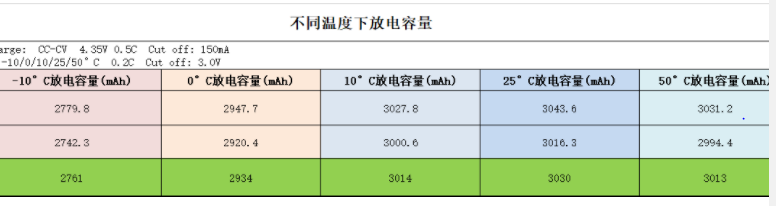

# 概述

mtk平台charger相关参数说明

# 参考
[[FAQ09903] Fuel Gauge兼容多电池，软件&硬件上应该怎么做？](https://online.mediatek.com/FAQ#/SW/FAQ09903)

[MTK65XX平台充电调试总结 （转载）](https://www.cnblogs.com/reality-soul/articles/4786989.html)

# 分析

* `drivers/misc/mediatek/include/mt-plat/mt6765/include/mach/mtk_battery_table.h`:

```C++
/* Qmax for battery  */
#define Q_MAX_L_CURRENT 0
#define Q_MAX_H_CURRENT 10000

/* multiple battery profile compile options */
/*#define MTK_GET_BATTERY_ID_BY_AUXADC*/


/* if ACTIVE_TABLE == 0 && MULTI_BATTERY == 0
 * load g_FG_PSEUDO100_Tx from dtsi
 */
#define MULTI_BATTERY 0
#define BATTERY_ID_CHANNEL_NUM 1
#define BATTERY_PROFILE_ID 0
#define TOTAL_BATTERY_NUMBER 4

/*
 * if ACTIVE_TABLE == 0 , use DTSI table
 * if ACTIVE_TABLE == x , use .h table
 * ACTIVE_TABLE <= MAX_TABLE
 */
#define ACTIVE_TABLE 4    

/*#define MTK_GET_BATTERY_ID_BY_GPIO*/

/* Qmax for battery  */
int g_Q_MAX[MAX_TABLE][TOTAL_BATTERY_NUMBER] = { //各温度对应电池容量Cmax
	/*bat1,   bat2,   bat3,    bat4*/
	{ 2890, 2712, 2490, 1965},/*T0*/
	{ 3000, 2851, 2468, 1984},/*T1*/
	{ 2990, 2432, 2310, 1946},/*T2*/
	{ 2990, 1991, 1858, 1873},/*T3*/
	{ 2930, 1960, 1843, 1851},/*T4*/
	{ 2211, 1652, 1533, 1541},/*T5*/
	{ 2201, 1642, 1523, 1531},/*T6*/
	{ 2191, 1632, 1513, 1521},/*T7*/
	{ 2181, 1622, 1503, 1511},/*T8*/
	{ 2171, 1612, 1493, 1501} /*T9*/
};	

int g_Q_MAX_H_CURRENT[MAX_TABLE][TOTAL_BATTERY_NUMBER] = { //Cmax_600mA
	/*bat1,   bat2,   bat3,    bat4*/
	{ 2646, 2412, 2190, 1665},/*T0*/
	{ 2496, 2551, 2168, 1684},/*T1*/
	{ 2418, 2132, 2010, 1646},/*T2*/
	{ 2235, 1691, 1558, 1573},/*T3*/
	{ 2223, 1660, 1543, 1551},/*T4*/
	{ 2210, 1650, 1533, 1541},/*T5*/
	{ 2200, 1640, 1523, 1531},/*T6*/
	{ 2190, 1630, 1513, 1521},/*T7*/
	{ 2180, 1620, 1503, 1511},/*T8*/
	{ 2170, 1610, 1493, 1501} /*T9*/
};

int g_Q_MAX_SYS_VOLTAGE[TOTAL_BATTERY_NUMBER] = { 3400, 3400, 3400, 3400}; //系统电压，没看到有什么用

/* 0~0.5V for battery 0, 0.5~1V for battery 1*/
/* 1~1.5V for battery 2, -1 for the last one (battery 3) */
int g_battery_id_voltage[TOTAL_BATTERY_NUMBER] = {
	500000, 1000000, 1500000, -1};
mtk_battery_core.c代码如下：
void fgauge_get_profile_id(void)
{
	int id_volt = 0;
	int id = 0;
	int ret = 0;

	ret = IMM_GetOneChannelValue_Cali(BATTERY_ID_CHANNEL_NUM, &id_volt);
	if (ret != 0)
		bm_debug("[%s]id_volt read fail\n", __func__);
	else
		bm_debug("[%s]id_volt = %d\n", __func__, id_volt);

	if ((sizeof(g_battery_id_voltage) /
		sizeof(int)) != TOTAL_BATTERY_NUMBER) {
		bm_debug("[%s]error! voltage range incorrect!\n",
			__func__);
		return;
	}

	for (id = 0; id < TOTAL_BATTERY_NUMBER; id++) {
		if (id_volt < g_battery_id_voltage[id]) {
			gm.battery_id = id;
			break;
		} else if (g_battery_id_voltage[id] == -1) {
			gm.battery_id = TOTAL_BATTERY_NUMBER - 1;
		}
	}

	bm_debug("[%s]Battery id (%d)\n",
		__func__,
		gm.battery_id);
}
打印如下，选的ID是0：
[name:mtk_battery_core&][fgauge_get_profile_id]Battery id=(0) en:0,0

参考：https://online.mediatek.com/FAQ#/SW/FAQ17516
冒充1%电量，比如g_FG_PSEUDO1 = 5，也就是实际电量5%时显示为1%
int g_FG_PSEUDO1[MAX_TABLE][TOTAL_BATTERY_NUMBER] = {
	/*bat1,   bat2,   bat3,    bat4*/
	{ 5, 6, 7, 8},/*T0*/
	{ 9, 10, 11, 12},/*T1*/
	{ 13, 14, 15, 16},/*T2*/
	{ 17, 18, 19, 20},/*T3*/
	{ 21, 22, 23, 24},/*T4*/
	{ 23, 22, 21, 20},/*T5*/
	{ 19, 18, 17, 16},/*T6*/
	{ 15, 14, 13, 12},/*T7*/
	{ 11, 10, 11, 12},/*T8*/
	{ 13, 14, 15, 16} /*T9*/
};

参考：https://online.mediatek.com/FAQ#/SW/FAQ17516
冒充100%电量，比如g_FG_PSEUDO100 = 96，也就是实际电量96%时显示为100%
int g_FG_PSEUDO100[MAX_TABLE][TOTAL_BATTERY_NUMBER] = {
	/*bat1,   bat2,   bat3,    bat4*/
	{ 100, 100, 100, 100},/*T0*/
	{ 100, 100, 100, 100},/*T1*/
	{ 100, 100, 100, 100},/*T2*/
	{ 100, 100, 100, 100},/*T3*/
	{ 100, 100, 100, 100},/*T4*/
	{ 100, 100, 100, 100},/*T5*/
	{ 100, 100, 100, 100},/*T6*/
	{ 100, 100, 100, 100},/*T7*/
	{ 100, 100, 100, 100},/*T8*/
	{ 100, 100, 100, 100} /*T9*/
};

我还以为是关机电压呢，试验了，没什么卵用
/* shutdown_hl_zcv */
int g_SHUTDOWN_HL_ZCV[MAX_TABLE][TOTAL_BATTERY_NUMBER] = {
	/*bat1,   bat2,   bat3,    bat4*/
	{3400, 3410, 3420, 3430},/*T0*/
	{3450, 3460, 3470, 3480},/*T1*/
	{3500, 3510, 3520, 3530},/*T2*/
	{3550, 3460, 3470, 3480},/*T3*/
	{3600, 3610, 3620, 3630},/*T4*/
	{3601, 3611, 3621, 3631},/*T5*/
	{3602, 3612, 3622, 3632},/*T6*/
	{3603, 3613, 3623, 3633},/*T7*/
	{3604, 3614, 3624, 3634},/*T8*/
	{3605, 3615, 3625, 3635} /*T9*/
};

pseudo1的偏置：
/* g_FG_PSEUDO1_OFFSET */
pseudo1_iq_offset = UNIT_TRANS_100 * g_FG_PSEUDO1_OFFSET[gm.battery_id];
int g_FG_PSEUDO1_OFFSET[TOTAL_BATTERY_NUMBER] = {0, 0, 0, 0};

/* pmic_min_vol by temp ,control by MULTI_TEMP_GAUGE0=1, 34000=3.4v */
int g_PMIC_MIN_VOL[MAX_TABLE][TOTAL_BATTERY_NUMBER] = {
	/*bat1,   bat2,   bat3,    bat4*/
	{33500, 33500, 33500, 33500},/*T0*/
	{33500, 33500, 33500, 33500},/*T1*/
	{33500, 33500, 33500, 33500},/*T2*/
	{32200, 32200, 32200, 32200},/*T3*/
	{31000, 31000, 31000, 31000},/*T4*/
	{33001, 33006, 33009, 33004},/*T5*/
	{33002, 33007, 33008, 33003},/*T6*/
	{33003, 33008, 33007, 33002},/*T7*/
	{33004, 33009, 33006, 33001},/*T8*/
	{33005, 33010, 33005, 33000} /*T9*/
};

/* POWERON_SYSTEM_IBOOT by temp ,control by MULTI_TEMP_GAUGE0=1 ,5000 = 500ma*/
int g_PON_SYS_IBOOT[MAX_TABLE][TOTAL_BATTERY_NUMBER] = {
	/*bat1,   bat2,   bat3,    bat4*/
	{5000, 5000, 5000, 5000},/*T0*/
	{5000, 5000, 5000, 5000},/*T1*/
	{5000, 5000, 5000, 5000},/*T2*/
	{5000, 5000, 5000, 5000},/*T3*/
	{5000, 5000, 5000, 5000},/*T4*/
	{5000, 5000, 5000, 5000},/*T5*/
	{5000, 5000, 5000, 5000},/*T6*/
	{5000, 5000, 5000, 5000},/*T7*/
	{5000, 5000, 5000, 5000},/*T8*/
	{5000, 5000, 5000, 5000} /*T9*/
};

/* Q_MAX_SYS_VOLTAGE by temp ,control by MULTI_TEMP_GAUGE0=1, */
int g_QMAX_SYS_VOL[MAX_TABLE][TOTAL_BATTERY_NUMBER] = {
	/*bat1,   bat2,   bat3,    bat4*/
	{33500, 33500, 33500, 33500},/*T0*/
	{33500, 33500, 33500, 33500},/*T1*/
	{33500, 33500, 33500, 33500},/*T2*/
	{32900, 32900, 32900, 32900},/*T3*/
	{32800, 32800, 32800, 32800},/*T4*/
	{33500, 33500, 33500, 33500},/*T5*/
	{33500, 33500, 33500, 33500},/*T6*/
	{33500, 33500, 33500, 33500},/*T7*/
	{33500, 33500, 33500, 33500},/*T8*/
	{33500, 33500, 33500, 33500} /*T9*/
};


#define TEMPERATURE_TB0	255
#define TEMPERATURE_TB1	254

int g_temperature[MAX_TABLE] = {
	50,/*TEMPERATURE_T0*/
	25,/*TEMPERATURE_T1*/
	0,/*TEMPERATURE_T2*/
	-10,/*TEMPERATURE_T3*/
	-15,/*TEMPERATURE_T4*/
	-25,/*TEMPERATURE_T5*/
	-30,/*TEMPERATURE_T6*/
	-35,/*TEMPERATURE_T7*/
	-40,/*TEMPERATURE_T8*/
	-45/*TEMPERATURE_T9*/
};


#define BAT_NTC_10 1
#define BAT_NTC_47 0

#if (BAT_NTC_10 == 1)
#define RBAT_PULL_UP_R             16900
#endif

#if (BAT_NTC_47 == 1)
#define RBAT_PULL_UP_R             61900
#endif

#define RBAT_PULL_UP_VOLT          1800

#define BIF_NTC_R 16000


/* ============================================================
 * <DOD, Battery_Voltage> Table
 * ============================================================
 */


/* T0 */
struct FUELGAUGE_PROFILE_STRUCT fg_profile_t0[TOTAL_BATTERY_NUMBER][63] = {
	{
	    ...
	}
```

* `drivers/power/supply/mediatek/battery/mtk_battery_internal.h`:

```C++
/* ============================================================ */
/* Define Macro Value */
/* ============================================================ */
#define FGD_NL_MSG_T_HDR_LEN 28
#define FGD_NL_MAGIC 2015060303
#define FGD_NL_MSG_MAX_LEN 9200

下面 4个就是个偏置系数：
q_max_sys_voltage 的偏置
fg_cust_data.q_max_sys_voltage = UNIT_TRANS_10 *g_Q_MAX_SYS_VOLTAGE[gm.battery_id];
#define UNIT_TRANS_10   10

pseudo1的偏置
#define UNIT_TRANS_100  100
没用
#define UNIT_TRANS_1000 1000

fg_cust_data.pmic_shutdown_time = UNIT_TRANS_60 * PMIC_SHUTDOWN_TIME;
#define UNIT_TRANS_60 60

#define MAX_TABLE 10    最大电池组数

/* ============================================================ */
/* power misc related */
/* ============================================================ */
#define BAT_VOLTAGE_LOW_BOUND 3450 //关机电压
#define BAT_VOLTAGE_HIGH_BOUND 3450
#define LOW_TMP_BAT_VOLTAGE_LOW_BOUND 3350
#define SHUTDOWN_TIME 40
#define AVGVBAT_ARRAY_SIZE 30
#define INIT_VOLTAGE 3450
#define BATTERY_SHUTDOWN_TEMPERATURE 60       //过热保护温度
```
* g_Q_MAX参考如下：

