# 概述

高通A6650 charger mp2721调试记录，该款ic不做bc1.2检测，没有adc采样功能，电流电压检测都将放到电池IC里面。 

# 参考

* [0012_移远提供外置电量计移植培训](refers/0012_移远提供外置电量计移植培训)
* [mp2721_datasheet](H:/wugn/md/pax_kearning_doc/docs/0001_charger/docs/refers/mp2721_datasheet)
* [prolin_mp2723_kernel4.14参考代码](H:/wugn/md/pax_kearning_doc/docs/0001_charger/docs/refers/prolin_mp2723_kernel4.14参考代码)

```C++
172.16.2.28
pax/pax123456

A77 A950代码：
/home/pax/6.A77_qcm/qcm2290 

展讯平台代码：
/home/pax/9.A920Pro_8581/uis8581e_x64/idh.code/bsp/kernel/kernel4.14/drivers/power/supply

移远提醒：设备树配这个属性  ，关闭平台内部充电
--- a/UM.9.15/vendor/qcom/proprietary/devicetree-4.19/qcom/scuba-iot-idp.dtsi
+++ b/UM.9.15/vendor/qcom/proprietary/devicetree-4.19/qcom/scuba-iot-idp.dtsi
@@ -79,6 +79,7 @@
        pinctrl-0 = <&usb_id_interrupt>;
 */

+       qcom,batteryless-platform;
        qcom,auto-recharge-soc = <98>;
        qcom,suspend-input-on-debug-batt;
        qcom,battery-data = <&scuba_batterydata>;
@@ -296,12 +297,234 @@
        extcon = <&qusb_phy0>, <&eud>;
 };

 &pm2250_charger {
/*
	interrupts-extended = <&tlmm 89 0>;
	interrupt-names = "usb_id_irq";
	qcom,usb-id-gpio = <&tlmm 89 0>;

	pinctrl-names = "default";
	pinctrl-0 = <&usb_id_interrupt>;
*/

	qcom,batteryless-platform;  //这里
	qcom,auto-recharge-soc = <98>;
	qcom,suspend-input-on-debug-batt;
	qcom,battery-data = <&scuba_batterydata>;
	io-channels = <&pm2250_vadc ADC_USB_IN_V_16>,
			<&pm2250_vadc ADC_CHG_TEMP>;
	io-channel-names = "usb_in_voltage",
			"chg_temp";
	qcom,thermal-mitigation = <2000000 1500000 1000000 500000>;
};

```

# 硬件

* 原理图：

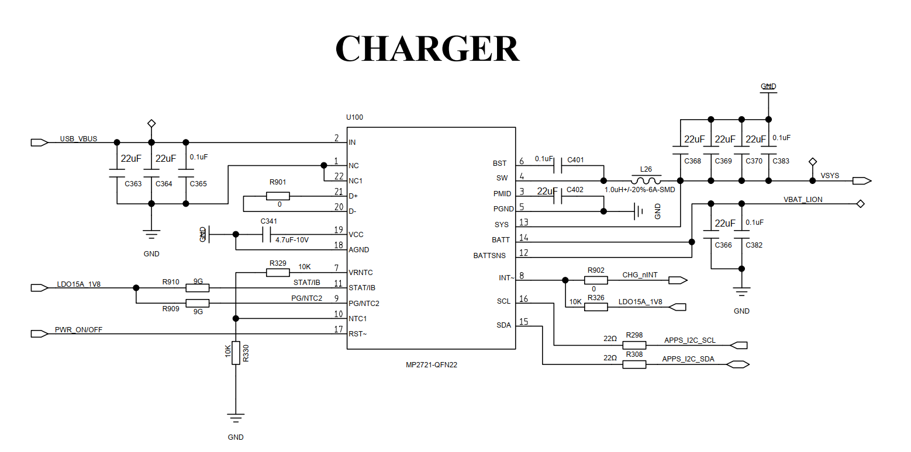

```C++
I2C Slave Address: 3Fh
中断脚：GPIO_86

mp2721:pwrspy@3f {
	compatible = "mp2721";
	reg = <0x3f>;
	pinctrl-names = "default";
	pinctrl-0 = <&charge_interrupt_pincfg>;
	/* charge ic default paramter */
	charge-voltage = <4400>; 				/* Battery Regulation Voltage, Range from 3.6V to 4.6V, Offset: 3.6V Default: 4.2V*/
	charge-current = <2000>; 				/* Fast charge current setting Default: 2A*/
	term-current = <100>; 					/* Termination current setting, Range: 30mA to 480mA, Offset: 30mA Default: 120mA */
	prechg-current = <240>; 				/* Pre-charge current setting, Range: 80mA to 680mA,Offset: 80mA Default: 240mA */
	prechg-to-fastchg-threshold = <3000>; 	/* Pre-charge to fast charge battery voltage threshold, Range: 2.4V to 3V, Default: 3V  */
	rechg-threshold-offset = <200>; 		/* Recharge threshold, 100mV or 200mV */
	vsys-min = <3675>; 					    /* System minimum regulation, Range: 2.975V to 3.763V, Default: 3.588V */
	input-current-limit = <2000>; 			/* Input current limit setting, Range: 100mA to 3.2A, Offset:100mA Default: 500mA*/
	input-voltage-limit = <4360>; 			/* Input voltage limit threshold, Range: 3.88V to 5.08V, Offset:3.88V, Default:4.36V */
	thermal-regulation-threshold = <80>;    /* Range 60-80-100-120*/
	max-chg-time = <15>;                    /*Charge safety timer, Default: 10 hours*/
	max-topoff-time = <45>;                 /*Timer to stop charging after charge termination, Default:Disabled minutes*/
	enable-termination;                     /*enable or disable termination*/
	/* enable_wdt; */                       /*enable or disable watch-dog*/
	irq-pin = <&tlmm 86 GPIO_ACTIVE_HIGH>;
};
```

中断列表：

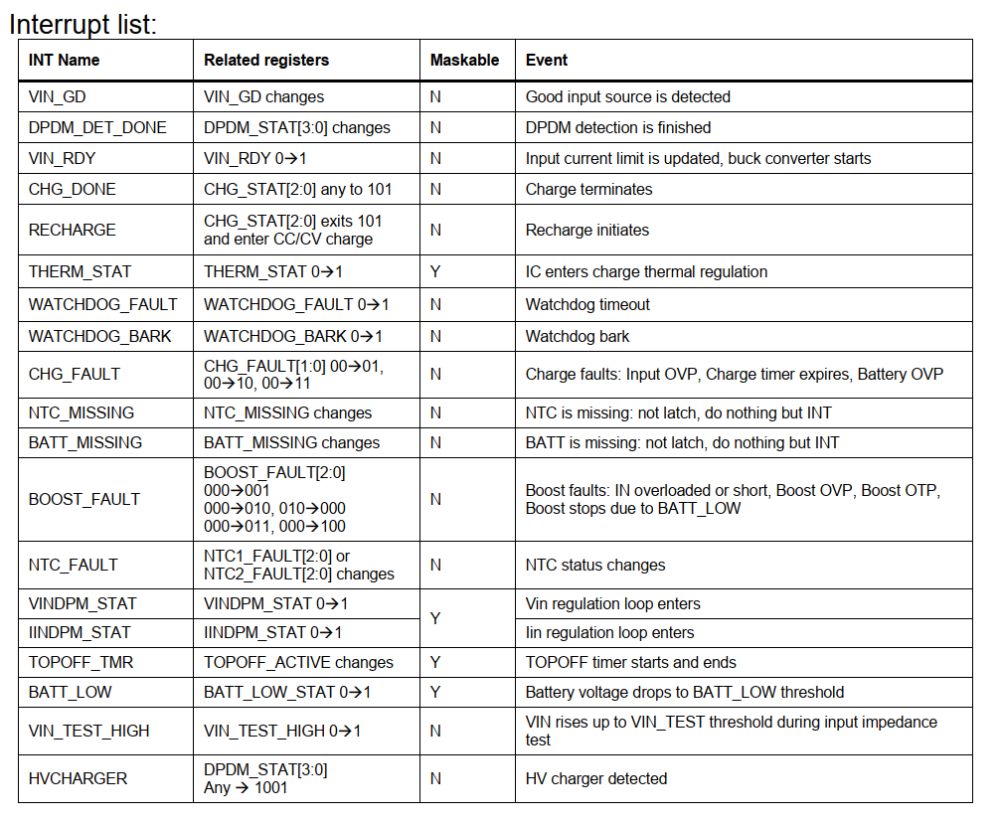

参考设计：

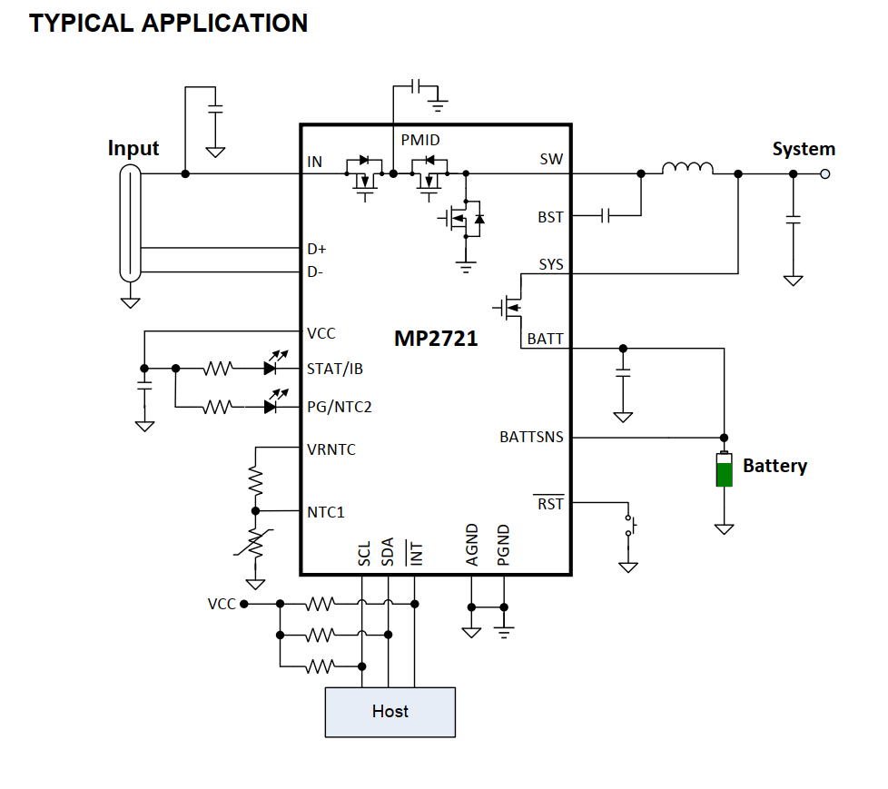

硬件上usb D+ D-和vbus有接到模块的usb D+ D-和vbus上，所以可以用到模块pm2250的charger功能中的bc1.2、充电电流电压。

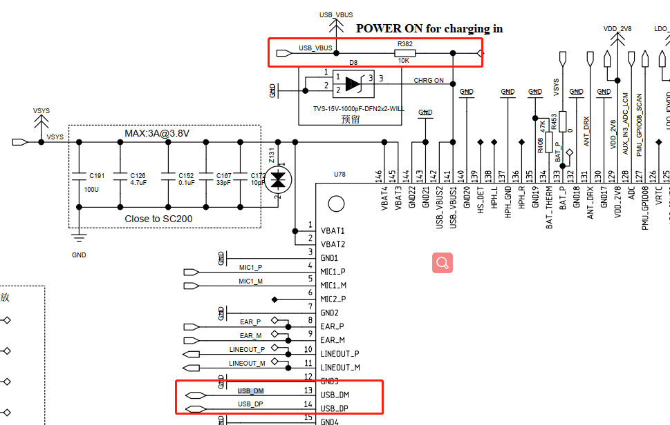


# 简介

## 充电示意图

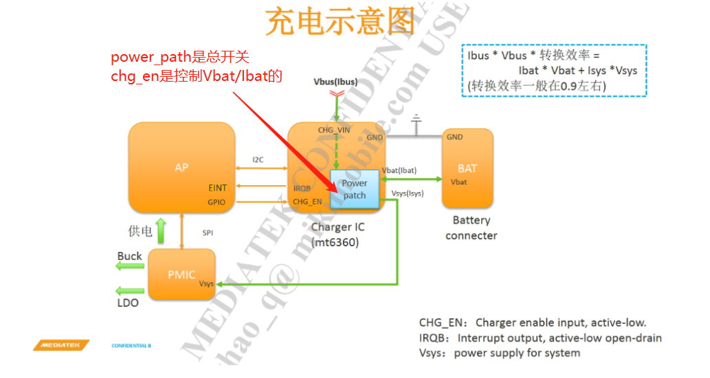

## DESCRIPTION

```C++
The MP2721 is a highly-integrated 5A switching-mode battery management device for single-cell Li-ion or Li-polymer battery. The
Narrow-VDC (NVDC) power management structure provides low impedance power path which optimizes charging efficiency, reduces
battery charging time and extends battery life during discharging.   //5a 单节电池，支持power path，NVDC电源管理结构提供低阻抗的电源路径
优化充电效率，减少电池充电时间，延长电池放电寿命。 

USB Battery Charging Specification 1.2 (BC1.2) and non-standard adaptor detection are supported by the input source type identification
algorithm. //支持bc1.2

The I2C interface offers complete operating control, charging parameter programming and status/interrupt monitoring. The MP2721 supports fully-customizable JEITA profile with programmable temperature windows and actions.
I2C接口提供完整的操作控制、充电参数编程和状态/中断监控。 MP2721支持完全可定制的JEITA配置文件，具有可编程的温度窗口和操作。 
```

## 缩写解释

* IIN_LIM： 充电电流设置，前端电流，充电器到charger ic的电流。(AICR)

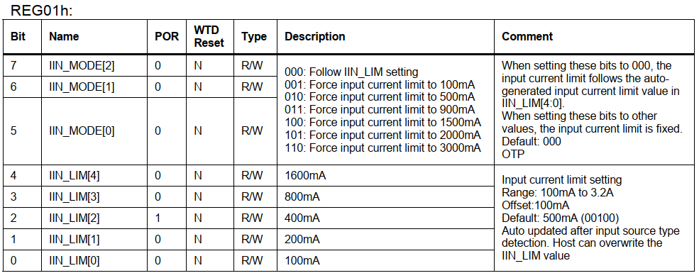

* VPRE： 预充充电电压大小。
* ICC： 充电电流设置，后端电流， charger ic 到电池的电流。(ichg)

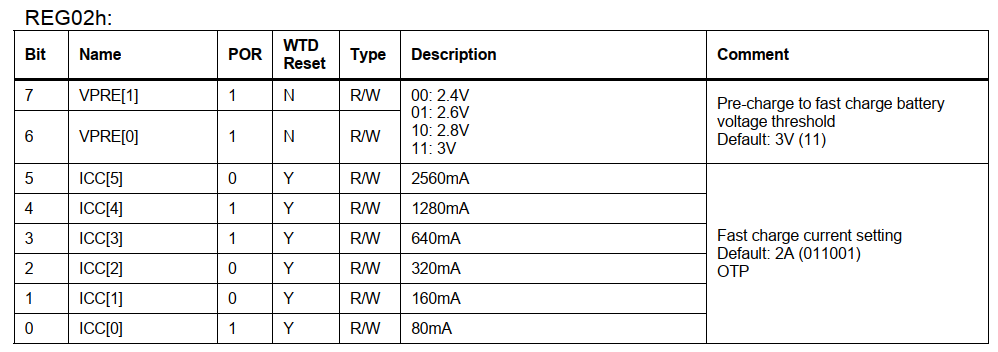

* IPRE：预充电电流大小。
* ITERM： 充电截止电流。(ieoc)

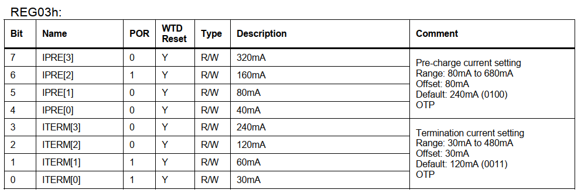

* VIN_LIM: 触发DPM(DYNAMIC POWER MANAGEMENT类似MTK AICL机制)机制的门限最小电压 (mivr)
* VRECHG：回充电压。

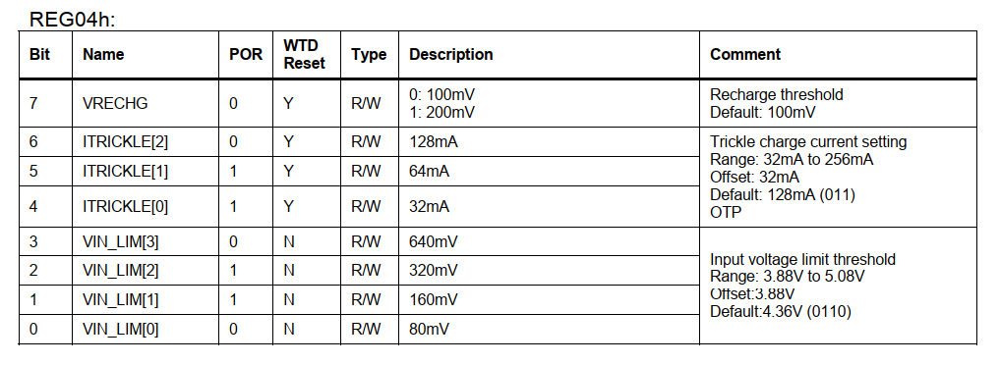

* VBATT: 电池充电电压。(CV)

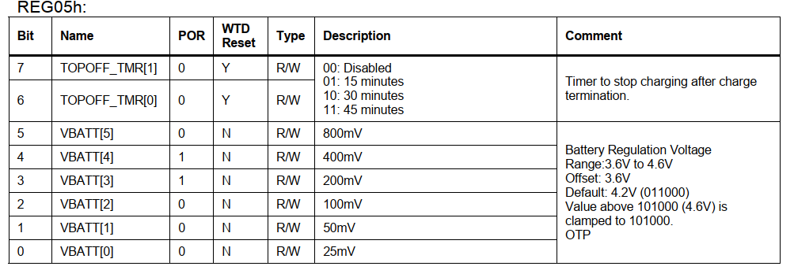

* VIN_OVP： 适配器输入电压保护。
* SYS_MIN： vsys最小电压。
* TREG： charger thermal充电温度保护。

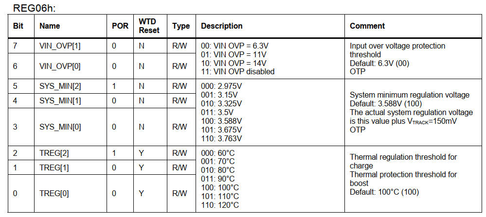

## FEATURES

```C++
* 5A NVDC Switching Charger with Power Path  //5a充电切换
* Support USB BC1.2 and Non-Standard Adaptors // bc1.2
* 26V Sustainable Input Voltage //最高耐压26v
* 80mA to 5A I2C Programmable Charge Current //80ma~5a可编程输入电流
* 100mA to 3.2A I2C Programmable Input Current Limit
* Minimum Input Voltage Loop for Maximum Adaptor Power Tracking 最小输入电压回路最大适配器功率跟踪 
* Comprehensive Safety Features
  * Fully-customizable JEITA Profile //jeita配置
  * Additional NTC Thermistor Input //额外NTC
  * Programmable Die Temperature Regulation from 60°C to 120°C
  * Complete Charge and Pre-Charge Safety Timers  //充电安全时间
  * Watchdog Safety Timer //wdt
  * Lockable Registers for Charging Parameters
* Programmable Switching Frequency from 750kHz to 1.5MHz
* Integrated 15mΩ Low-Rdson Battery FET with Shipping and Reset Modes //Shipping and Reset Modes 船运模式最低15毫欧电阻
* Ultra-low 8.5μA Battery Discharge Current in Shipping Mode //船运漏电流 8.5μA 
* Down to 30mA Termination Current Settings for Wearable Applications //最低30ma满充电流
* I2C Port for Flexible System Parameter Setting and Status Reporting
* Programmable Boost-converter for Source Mode (OTG) //支持OTG模式，就是当充电宝
  * Programmable Output Current Limit Loop up to 3A
  * Output Over-current Protection
  * Ability to Power into Large Capacitive Loads up to 2mF
  * Programmable Output Voltage from 5.0V to 5.35V
* Accuracy
  * +/- 0.5% Battery Regulation Voltage
  * +/- 5% Charge Current
  * +/- 5% Input Current Limit
  * Remote Battery Sensing for Fast Charge
  * ± 2% Output Regulation in Boost Mode
* Small QFN-22(2.5mm×3.5mm) Package
```

## APPLICATIONS
* General <=15W USB Applications
* Bluetooth Headphones
* Bluetooth Speakers
* POS Terminals
* Portable Cameras

## FUNCTIONAL BLOCK DIAGRAM

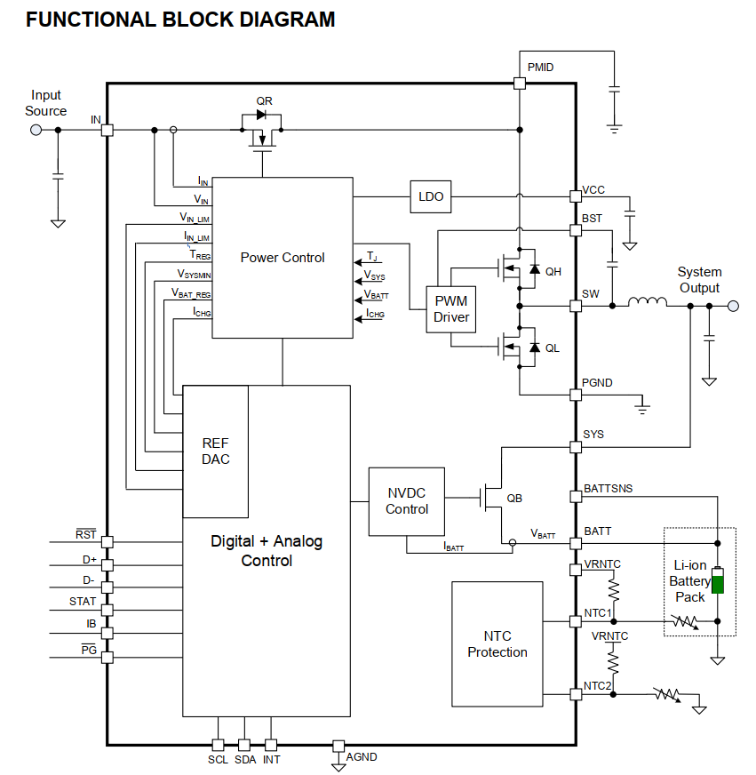

# 功能介绍

## BOOST Mode(OTG充电宝)

参数如下：

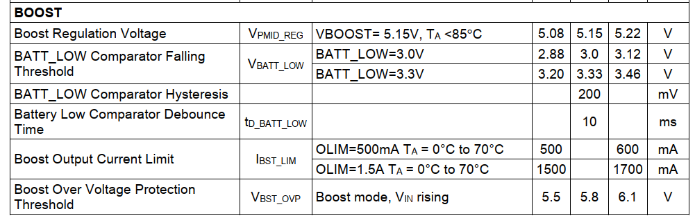

典型的性能特征

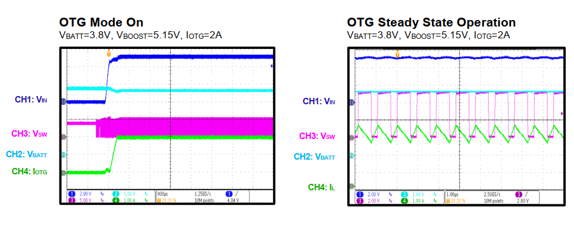

Boosting from the battery, the device is able to supply a regulated output at the IN pin. Boost will start with below conditions are valid:
* IN voltage less than VIN_UV //典型值5.8v
* EN_BOOST bit is set to 1 Voltage of the NTC pin in acceptable range
* Battery voltage above VBATT_UV
* If BOOST_STP = 1, BATT voltage needs to be above VBATT_LOW

The boost PWM switching frequency is as same as the buck converter setting.
The boost voltage loop regulates the PMID pin voltage at the setting of VBOOST bits.
The boost output current loop limits the output current at the value set by OLIM bits for VIN >VBATT+ VHDRM range.

以上得知，boostmode主要由以下寄存器设置开关、电流、电压。

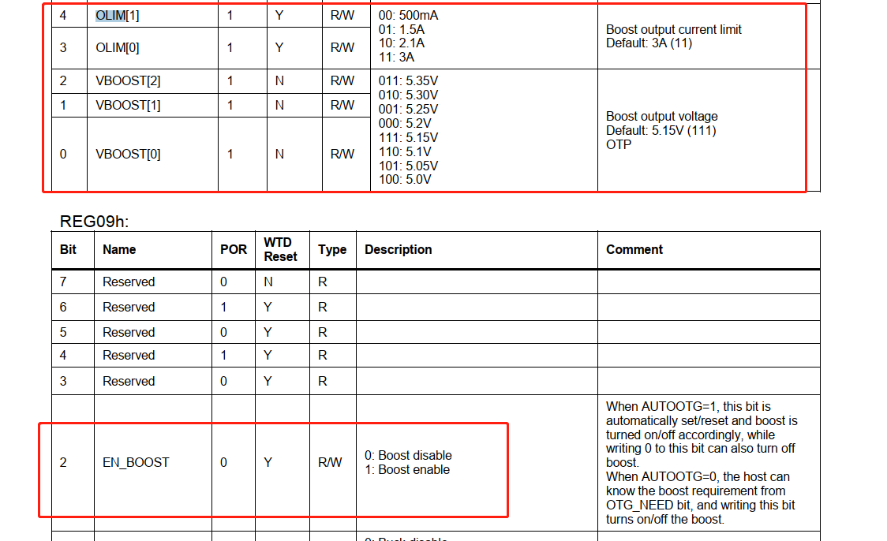

### 重大发现

发现EN_BOOST和EN_CHG、EN_BUCK是互斥的，如果打开EN_BOOST充电会出现BOOST_OVP报错：

```log
关闭OTG:
i2cset -f -y 0 0x3f 0x09 0x53 b
打开OTG:
i2cset -f -y 0 0x3f 0x08 0x1f b

[Sun Apr 24 17:40:24 2022] CPC-TCPC:sink_vbus: 12000 mV, 208 mA
[Sun Apr 24 17:40:25 2022] ///PD dbg info 49d
[Sun Apr 24 17:40:25 2022] < 5875.142>TCPC-TCPC:Alert:0x0004, Mask:0x230fff
[Sun Apr 24 17:40:25 2022] ///PD dbg info 163d
[Sun Apr 24 17:40:25 2022] < 5875.144>TCPC-PE-EVT:ps_rdy\x0a< 5875.144>TCPC-TCPC:sink_vbus: 12000 mV, 1500 mA\x0a< 5875.144>TCPC-PE:PD -> SNK_
READY (CUN)\x0a< 5875.
[Sun Apr 24 17:40:25 2022] 144>Enable PD_TIMER_SNK_FLOW_DELAY
[Sun Apr 24 17:40:25 2022] PAX_CHG: miss_fault 0:wugn charge fault:0
[Sun Apr 24 17:40:25 2022] PAX_CHG: mp2721_charger_irq_workfunc:charge fault:BOOST_OVP, status:Not charging
```
有一种方案，需要用cc协议判断是sink还是source来判断打开关闭otg功能。

## JEITA功能

目前mp2721有2个NTC热敏电阻，VCOLD = 0°  VCOOL = 10°  VWARM = 45°  VHOT = 60°

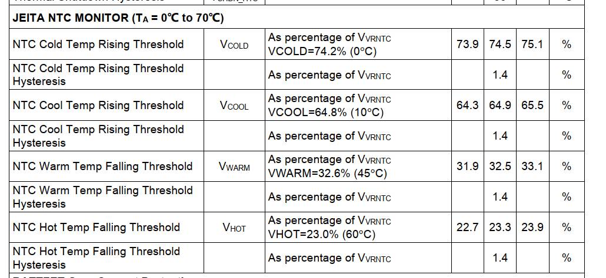

* 历程：
Figure 4 illustrates the JEITA voltage/current
regulations with set up as: NTC1_ACTION = 1,
NTC2_ACTION = 0, WARM_ACT = 01,
COOL_ACT = 10, JEITA_VSET = 00,
JEITA_ISET = 00.

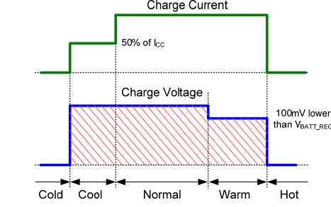

上图得知，根据COOL_ACT = 10: Reduce ICC when NTC cool，0~10°时，电流是50%的ICC，WARM_ACT = 01, Reduce VBATT_REG when NTC warm，45~60°之间减少部分电压值100mv。

* JEITA开关控制，The NTC1 and NTC2 actions can be enabled/disabled by setting the NTC1_ACTION and NTC2_ACTION bit, respectively：

可以看到NTC1的JEITA功能是打开的。

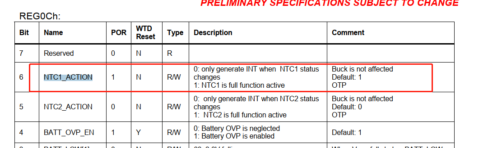

* 各温度下电流电压配置如下：

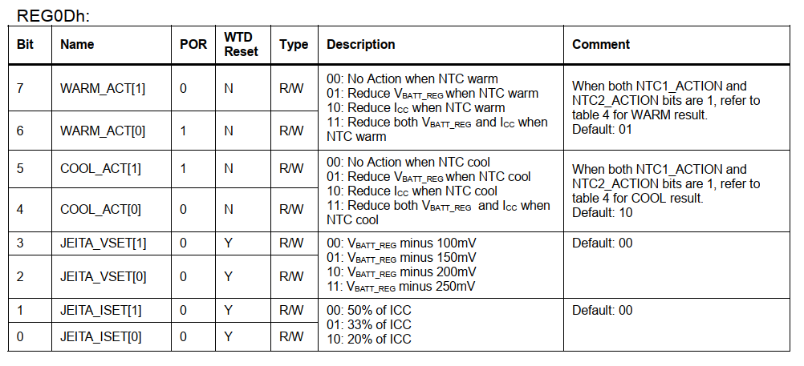

* 各阶段温度值定义：

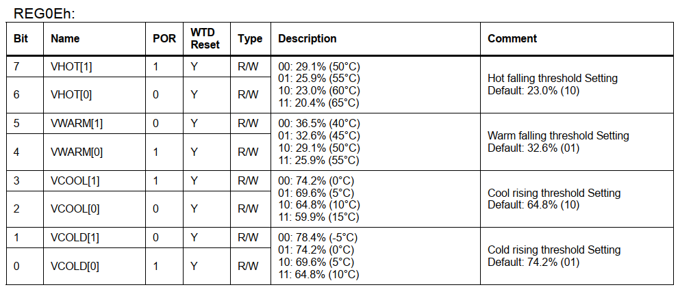

目前JEITA功能先关闭。

## DYNAMIC POWER MANAGEMENT(动态电源管理)

原文：
During the buck converter operation, the device continuously monitors the input current and input voltage. When input current limit or input voltage limit is reached, the charge current is reduced to prevent the input source from being overloaded.
If the charge current is reduced to zero, the system voltage starts to drop due to input power limitation. Once the system voltage falls
below the battery voltage, the IC automatically enters supplement mode.
When the converter operates in input current loop or input voltage limit loop, the IINDPM_STAT or VINDPM_STAT is set to 1 with an INT pulse followed (maskable)

翻译：
在降压转换器运行期间，该器件持续监控输入电流和输入电压。 当达到输入电流限制或输入电压限制时，降低充电电流以防止输入源过载。
==如果充电电流降至零，系统电压会由于输入功率限制而开始下降。 一旦系统电压低于电池电压，IC 自动进入补充模式（下面有介绍）。==
当转换器在输入电流环路或输入电压限制环路中运行时，IINDPM_STAT 或 VINDPM_STAT 设置为 1，随后有一个 INT 脉冲中断（可屏蔽）。

也就是说这个是为了保护电压电流的。

### 寄存器介绍

* 打开或关闭中断：

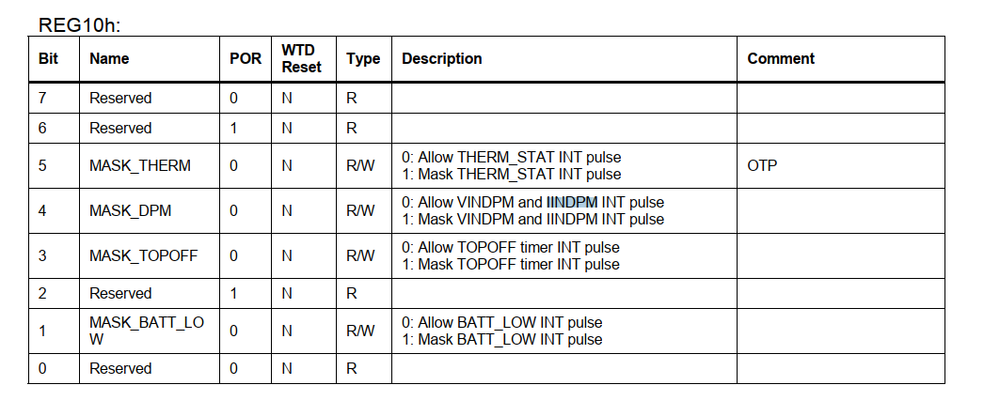

* 查看状态：

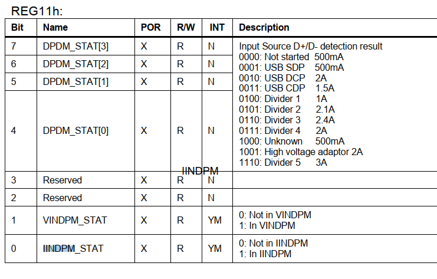


### SUPPLEMENT MODE（补充模式）

原文：
When the system voltage falls below the battery voltage, the BATTFET turns on to prevent the system voltage from dropping further. 
In this condition, the buck converter and the battery provide power for system together.

翻译：
当系统电压低于电池电压时，BATTFET 开启以防止系统电压进一步下降。
在这种情况下，降压转换器和电池共同为系统供电。

# 软件架构

charger的软件驱动架构比较简单，主要步骤为以下：
* probe中`mp2721_init_device`初始化一下各种充电参数。
* 然后就是下降沿触发中断`mp2721_charger_interrupt -> queue_work(mp->adp_workqueue, &mp->irq_work);`调用工作队列函数`mp2721_charger_irq_workfunc`处理判断中断类型，最主要的是BC1.2检测判断插入还是拔出。
* 设置最小输入电压、最大电流限制，设置充电电压电流，打开wdt，使能充电。

```C++
* mp2721_charger_probe
  ├── mp2721_parse_dt(&client->dev, mp); //获取dts
  ├── mp2721_init_device(mp);
  │   ├── mp2721_enable_watchdog_timer(mp, true);
  │   ├── mp2721_set_term_current(mp, mp->cfg.term_current);//Termination current setting 终端电流设置
  │   ├── mp2721_set_chargevoltage(mp, mp->cfg.charge_voltage);
  │   ├── mp2721_set_chargecurrent(mp, mp->cfg.charge_current);
  │   ├── mp2721_set_recharge_offset_voltage(mp, mp->cfg.rechg_threshold_offset);   //回充电压200mv
  │   ├── mp2721_set_batlowv(mp, mp->cfg.prechg_to_fastchg_threshold); //Pre-charge to fast charge， battery voltage threshold 预充到快充的阈值
  │   ├── mp2721_set_treg(mp, mp->cfg.treg);// 芯片最高耐温度数
  │   ├── mp2721_set_input_volt_limit(mp, MP2721_VIN_LIMIT_DEFAULT);
  │   ├── mp2721_set_input_current_limit(mp, MP2721_IIN_LIMIT_DEFAULT);
  │   ├── mp2721_enable_charger(mp);
  │   └── mp2721_set_charging_safety_timer(mp, mp->cfg.max_chg_time); //充电安全时间
  ├── gpio_request(mp->irq_pin, "mp2721 irq pin"); 
  ├── mp2721_psy_register(mp);
  │   └──  power_supply_register(mp->dev, &psy_desc_adapter, &psy_cfg);
  ├── INIT_WORK(&mp->irq_work, mp2721_charger_irq_workfunc); //中断工作
  ├──  sysfs_create_group(&mp->wall->dev.kobj, &mp2721_attr_group); //创建调试用的文件节点registers、idpm_limit、charge_fault、charge_cur_limit
  ├── request_irq(client->irq, mp2721_charger_interrupt, IRQF_TRIGGER_FALLING | IRQF_ONESHOT, "mp2721_charger_irq", mp); //申请中断
  └── queue_work(mp->adp_workqueue, &mp->irq_work);/*in case of adapter has been in when power off*/ 初始化一次
```

* 中断处理函数如下,bc1.2检测判断是插入还是拔出，插入调用mp2721_plug_in函数设置vin和iin，使能充电并调用monitor_work工作队列监控dpm状态（中断下半段）：

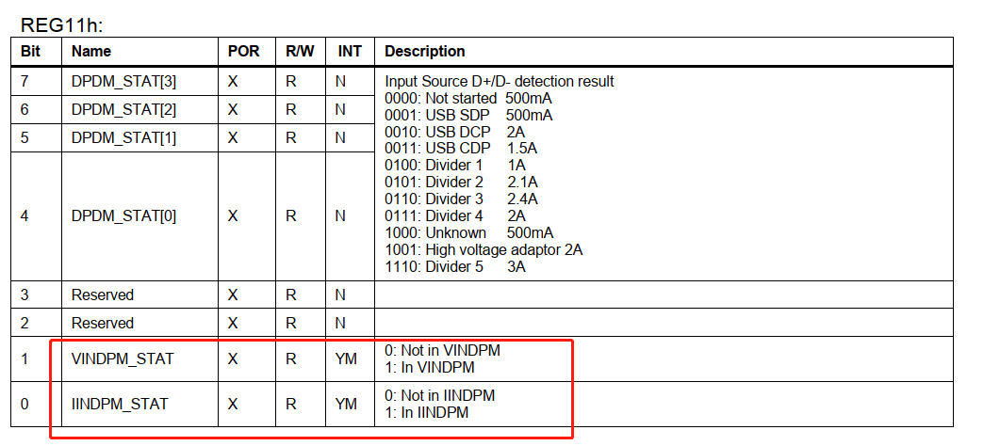
```C++
static void mp2721_plug_in(struct mp2721 *mp)
{
	int ret;

	mp2721_adjust_vin_limit(mp);
	ret = mp2721_set_input_current_limit(mp, mp->cfg.iin_limit);
	if (ret < 0) {
		chr_err("%s:Failed to set input current limit:%d\n", __func__, mp->cfg.iin_limit);
	} else {
	 	chr_info("%s: Set input current limit to %dmA successfully\n", __func__, mp->cfg.iin_limit);
	}

	msleep(5);

	ret = mp2721_set_chargecurrent(mp, mp->cfg.charge_current);
	if (ret < 0) {
		chr_err("%s:Failed to set charge current:%d\n", __func__, ret);
	}

	if (mp->charge_status != POWER_SUPPLY_STATUS_FULL) {
		mp2721_enable_charger(mp);
	}

	schedule_delayed_work(&mp->monitor_work, msecs_to_jiffies(CHR_POLL_INTERVAL));
}

static void mp2721_plug_out(struct mp2721 *mp)
{
	int ret;

	ret = mp2721_set_input_volt_limit(mp, MP2721_VIN_LIMIT_DEFAULT);
	if (ret < 0)
		chr_err("%s:reset vindpm threshold to default failed:%d\n",__func__,ret);
	else
		chr_info("%s:reset vindpm threshold to default(%dmV) successfully\n",
			__func__, MP2721_VIN_LIMIT_DEFAULT);

	ret = mp2721_set_input_current_limit(mp, MP2721_IIN_LIMIT_DEFAULT);
	if (ret < 0) 
		chr_err("%s:Failed to set input current limit to default\n", __func__);
	else
		chr_info("%s: Set input current limit to default(%dmA) successfully\n",
			 __func__, MP2721_IIN_LIMIT_DEFAULT);

	mp2721_disable_charger(mp);
	
	cancel_delayed_work_sync(&mp->monitor_work);
}

static void chr_dump(struct mp2721 *mp)
{
	pr_info("%s: CHG [online: %d, type: %s, status: %s, fault: %s, health: %s], "
			"\n",
			__func__,
			/*CHG*/
			mp->chg_info.online, psy_usb_type_text[mp->charge_type], psy_chr_status_text[mp->charge_status],
			psy_chr_fault_text[mp->charge_fault], psy_health_text[mp->health_status]);
}

static void mp2721_monitor_workfunc(struct work_struct *work)
{
	struct mp2721 *mp = container_of(work, struct mp2721, monitor_work.work);
	u8 status = 0;
	int ret;
	static u8 last_status = 0;

	mp->charge_type = mp2721_charge_type(mp);
	mp->charge_status = mp2721_charge_status(mp);

	chr_dump(mp);
	
	ret = mp2721_read_byte(mp, &status, MP2721_REG_11);
	if (ret == 0 && (status & MP2721_VDPM_STAT_MASK)) {
		if ((status & MP2721_VDPM_STAT_MASK) != (last_status & MP2721_VDPM_STAT_MASK))
			chr_info("%s:VINDPM occurred\n", __func__);/* input v too low */
	}

	if (ret == 0 && (status & MP2721_IDPM_STAT_MASK) 
			&& (status & MP2721_IDPM_STAT_MASK) != (last_status & MP2721_IDPM_STAT_MASK))
		chr_info("%s:IINDPM occurred\n", __func__);/* input Current too big*/

	last_status = status;

	schedule_delayed_work(&mp->monitor_work, msecs_to_jiffies(CHR_POLL_INTERVAL));
}

static void mp2721_charger_irq_workfunc(struct work_struct *work)
{
	struct mp2721 *mp = container_of(work, struct mp2721, irq_work);
	u8 status = 0;

	msleep(10);
	
	mp->charge_type = mp2721_charge_type(mp);
	mp->charge_status = mp2721_charge_status(mp);
	
	if ((mp->charge_type == POWER_SUPPLY_USB_TYPE_UNKNOWN) && (mp->status & MP2721_STATUS_PLUGIN)) {	
		chr_info("%s:adapter plug out\n", __func__);
		mp->status &= ~MP2721_STATUS_PLUGIN;
		mp2721_plug_out(mp);
	} 
	else if ((mp->charge_type != POWER_SUPPLY_USB_TYPE_UNKNOWN) && !(mp->status & MP2721_STATUS_PLUGIN)) {
		chr_info("%s:adapter plug in\n", __func__);
		mp->status |= MP2721_STATUS_PLUGIN;
		msleep(10);
		mp2721_plug_in(mp);
	}

	mp2721_get_charge_fault(mp);
	
	if (mp->charge_fault) 
		chr_info("%s:charge fault:%02x, status:%02x\n", \
			__func__, mp->charge_fault, status);

	power_supply_changed(mp->psy);

	mp2721_dump_registers(mp);
	mp->health_status = mp2721_health_status(mp);
}
```

* psy属性如下：

```C++
生成节点：
/sys/class/power_supply/mp2721_charger
cat /sys/class/power_supply/mp2721_charger/type 
USB

static struct power_supply_desc psy_desc_adapter = {
	.name = "mp2721_charger",
	.type = POWER_SUPPLY_TYPE_USB,
	.properties = mp2721_charger_props,
	.num_properties = ARRAY_SIZE(mp2721_charger_props),
	.get_property = mp2721_wall_get_property,
	.set_property = mp2721_set_property,
	.external_power_changed = NULL,
};

static enum power_supply_property mp2721_charger_props[] = {
	POWER_SUPPLY_PROP_ONLINE, /* External power source */
	POWER_SUPPLY_PROP_STATUS,
	POWER_SUPPLY_PROP_HEALTH,
	POWER_SUPPLY_PROP_PRESENT, //根据mtk加的
	POWER_SUPPLY_PROP_TYPE, //这个貌似指定了.type就没啥用了
};

static int mp2721_wall_get_property(struct power_supply *psy,
				enum power_supply_property psp,
				union power_supply_propval *val)
{
	struct mp2721 *mp = power_supply_get_drvdata(psy);

	switch (psp) {
	case POWER_SUPPLY_PROP_ONLINE:
		mp->vbus_type = mp2721_charger_is_present(mp);
		if (!mp->cfg.power_supply_type_usb) {
			/* usb supply power also detect to be adapter */
			if (mp->vbus_type != MP2721_VBUS_NONE) {
				val->intval = 1;
			}	
			else {
				val->intval = 0;
			}		
		} 
		else {
			if ((mp->vbus_type == MP2721_VBUS_NONSTAND)
				|| (mp->vbus_type == MP2721_VBUS_APPLE_1_0)
				|| (mp->vbus_type == MP2721_VBUS_APPLE_2_1)
				|| (mp->vbus_type == MP2721_VBUS_APPLE_2_4)
				|| (mp->vbus_type == MP2721_VBUS_USB_DCP)) {

				val->intval = 1;
			}
			else {
				val->intval = 0;
			}	
		}
		break;
	case POWER_SUPPLY_PROP_TYPE:
		printk("get POWER_SUPPLY_PROP_TYPE\n");
		val->intval = mp->power_supply_type;
		break;	
	case POWER_SUPPLY_PROP_CHARGE_ENABLED:		
		val->intval = mp->chage_enable;
		break ;
	case POWER_SUPPLY_PROP_STATUS:
		val->intval = mp->charge_status;
		break ;
	case POWER_SUPPLY_PROP_HEALTH:
		val->intval = mp->health_status;
		break ;
	default:
		return -EINVAL;
	}

	return 0;
}
```

以上`online status`等节点都是由`power_supply_sysfs`生成，主要是供healthd服务读取状态。

# 调试记录

## 1.接上充电器/电脑BC1.2检测一直不成功

一直都检测到的是非标充电500ma，结果如下：

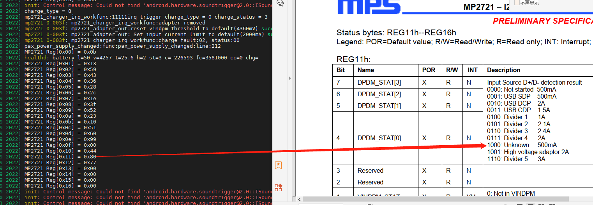

接法如下：

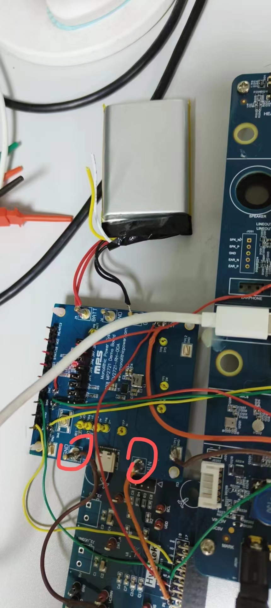

原因：

接PD开发版上面是没有USB D+ D-的，所以识别出来的都是非标的充电，跟硬件确定，后续charger ic上面不会接USB D+ D-，因此就没有bc1.2判断。

## 2.healthd不epoll状态

打印如下：

```log
bengal:/sys/class/power_supply # ls
battery  bms  main  mp2721_charger  usb

[   17.056088] healthd: ok power supply type 'Battery'
[   17.066683] ipa ipa3_ioctl:2852 FNR stats not supported on IPA ver 16
[   17.081471] healthd: Unknown power supply type 'BMS'
[   17.118314] healthd: Unknown power supply type 'Main'
[   17.123727] healthd: Unknown power supply type 'Main'
[   17.129222] healthd: batteryCapacityLevelPath not found
[   17.129379] type=1400 audit(1650790538.968:11): avc: denied { read } for comm="android.hardwar" name="type" dev="sysfs" ino=36136 scontext=u:r:hal_health_default:s0 tcontext=u:object_r:sysfs:s0 tclass=file permissive=0
[   17.143779] binder: 630:630 ioctl 40046210 7fc35f2574 returned -22
[   17.156714] healthd: battery l=50 v=4163 t=25.6 h=2 st=3 c=-641022 fc=3581000 cc=0 chg=
```

貌似是权限配置有问题，增加上述权限后，又提示没有open权限，打印如下：

```log
增加如下：
--- a/UM.9.15/system/sepolicy/vendor/hal_health_default.te
+++ b/UM.9.15/system/sepolicy/vendor/hal_health_default.te
@@ -4,3 +4,5 @@ hal_server_domain(hal_health_default, hal_health)

 type hal_health_default_exec, exec_type, vendor_file_type, file_type;
 init_daemon_domain(hal_health_default)
+
+allow hal_health_default sysfs:file { read };


[   22.961315] healthd: init power supply file '/sys/class/power_supply/./type'
[   22.968865] healthd: power supply file '/sys/class/power_supply/./type'
[   22.975761] healthd: init power supply file '/sys/class/power_supply/../type'
[   22.981061] binder: 701:701 ioctl 40046210 7fe8640314 returned -22
[   22.983403] healthd: power supply file '/sys/class/power_supply/../type'
[   22.996363] healthd: init power supply file '/sys/class/power_supply/battery/type'
[   23.056214] healthd: power supply file '/sys/class/power_supply/battery/type'
[   23.084387] healthd: ok power supply type 'Battery'
[   23.100997] healthd: init power supply file '/sys/class/power_supply/bms/type'
[   23.106117] sysmon-qmi: ssctl_new_server: Connection established between QMI handle and adsp's SSCTL service
[   23.111124] healthd: power supply file '/sys/class/power_supply/bms/type'
[   23.130537] coresight-remote-etm soc:audio_etm0: Connection established between QMI handle and 5 service
[   23.151035] diag: In diag_send_peripheral_buffering_mode, buffering flag not set for 1
[   23.176521] healthd: Unknown power supply type 'BMS'
[   23.188268] type=1400 audit(16425.087:16): avc: denied { open } for comm="android.hardwar" path="/sys/devices/platform/soc/4a80000.i2c/i2c-0/0-003f/power_supply/mp2721_charger/type" dev="sysfs" ino=36136 scontext=u:r:hal_health_default:s0 tcontext=u:object_r:sysfs:s0 tclass=file permissive=0
[   23.243616] binder: 739:739 ioctl 40046210 7fdf7961e4 returned -22
```

发现不应该这样做，查看具体sysfs属性如下，发现qcom的都配置成了vendor_sysfs_battery_supply属性：

```
bengal:/sys/class/power_supply/mp2721_charger # ls -Z
u:object_r:sysfs:s0 charge_cur_limit  u:object_r:sysfs:s0 health      u:object_r:sysfs:s0 present    u:object_r:sysfs:s0 type
u:object_r:sysfs:s0 charge_fault      u:object_r:sysfs:s0 idpm_limit  u:object_r:sysfs:s0 registers  u:object_r:sysfs:s0 uevent
u:object_r:sysfs:s0 charge_type       u:object_r:sysfs:s0 online      u:object_r:sysfs:s0 status     u:object_r:sysfs:s0 wakeup27
u:object_r:sysfs:s0 device            u:object_r:sysfs:s0 power       u:object_r:sysfs:s0 subsystem

bengal:/sys/class/power_supply/bms # ls -Z
u:object_r:vendor_sysfs_battery_supply:s0 batt_age_level         u:object_r:vendor_sysfs_battery_supply:s0 current_avg    u:object_r:vendor_sysfs_battery_supply:s0 power_now              u:object_r:vendor_sysfs_battery_supply:s0 time_to_full_avg
u:object_r:vendor_sysfs_battery_supply:s0 batt_full_current      u:object_r:vendor_sysfs_battery_supply:s0 current_now    u:object_r:vendor_sysfs_battery_supply:s0 real_capacity          u:object_r:vendor_sysfs_battery_supply:s0 time_to_full_now
u:object_r:vendor_sysfs_battery_supply:s0 batt_profile_version   u:object_r:vendor_sysfs_battery_supply:s0 cycle_count    u:object_r:vendor_sysfs_battery_supply:s0 resistance             u:object_r:vendor_sysfs_battery_supply:s0 type
u:object_r:vendor_sysfs_battery_supply:s0 battery_type           u:object_r:vendor_sysfs_battery_supply:s0 cycle_counts   u:object_r:vendor_sysfs_battery_supply:s0 resistance_capacitive  u:object_r:vendor_sysfs_battery_supply:s0 uevent
u:object_r:vendor_sysfs_battery_supply:s0 capacity               u:object_r:vendor_sysfs_battery_supply:s0 debug_battery  u:object_r:vendor_sysfs_battery_supply:s0 resistance_id          u:object_r:vendor_sysfs_battery_supply:s0 voltage_avg
u:object_r:vendor_sysfs_battery_supply:s0 capacity_raw           u:object_r:sysfs:s0                       device         u:object_r:vendor_sysfs_battery_supply:s0 resistance_now         u:object_r:vendor_sysfs_battery_supply:s0 voltage_max
u:object_r:vendor_sysfs_battery_supply:s0 cc_soc                 u:object_r:vendor_sysfs_battery_supply:s0 esr_actual     u:object_r:vendor_sysfs_battery_supply:s0 scale_mode_en          u:object_r:vendor_sysfs_battery_supply:s0 voltage_min
u:object_r:vendor_sysfs_battery_supply:s0 charge_counter         u:object_r:vendor_sysfs_battery_supply:s0 esr_nominal    u:object_r:vendor_sysfs_battery_supply:s0 soc_reporting_ready    u:object_r:vendor_sysfs_battery_supply:s0 voltage_now
u:object_r:vendor_sysfs_battery_supply:s0 charge_counter_shadow  u:object_r:vendor_sysfs_battery_supply:s0 fg_reset       u:object_r:vendor_sysfs_battery_supply:s0 soh                    u:object_r:vendor_sysfs_battery_supply:s0 voltage_ocv
u:object_r:vendor_sysfs_battery_supply:s0 charge_full            u:object_r:vendor_sysfs_battery_supply:s0 fg_type        u:object_r:sysfs:s0                       subsystem              u:object_r:sysfs_wakeup:s0                wakeup29u:object_r:vendor_sysfs_battery_supply:s0 charge_full_design     u:object_r:vendor_sysfs_battery_supply:s0 power          u:object_r:vendor_sysfs_battery_supply:s0 temp
u:object_r:vendor_sysfs_battery_supply:s0 clear_soh              u:object_r:vendor_sysfs_battery_supply:s0 power_avg      u:object_r:vendor_sysfs_battery_supply:s0 time_to_empty_avg
```

代码搜索结果如下：

```C++
device/qcom/sepolicy_vndr/qva/vendor/bengal/genfs_contexts
35:genfscon sysfs /devices/platform/soc/1c40000.qcom,spmi/spmi-0/spmi0-02/1c40000.qcom,spmi:qcom,pmi632@2:qcom,qpnp-smb5/power_supply/battery u:object_r:vendor_sysfs_battery_supply:s0
38:genfscon sysfs /devices/platform/soc/1c40000.qcom,spmi/spmi-0/spmi0-02/1c40000.qcom,spmi:qcom,pmi632@2:qcom,qpnp-smb5/power_supply/main u:object_r:vendor_sysfs_battery_supply:s0
39:genfscon sysfs /devices/platform/soc/1c40000.qcom,spmi/spmi-0/spmi0-02/1c40000.qcom,spmi:qcom,pmi632@2:qpnp,qg/power_supply/bms u:object_r:vendor_sysfs_battery_supply:s0
40:genfscon sysfs /devices/platform/soc/4a84000.i2c/i2c-0/0-0008/4a84000.i2c:qcom,smb1355@8:qcom,smb1355-charger@1000/power_supply/parallel u:object_r:vendor_sysfs_battery_supply:s0
41:genfscon sysfs /devices/platform/soc/4a84000.i2c/i2c-0/0-000c/4a84000.i2c:qcom,smb1355@c:qcom,smb1355-charger@1000/power_supply/parallel u:object_r:vendor_sysfs_battery_supply:s0
42:genfscon sysfs /class/qcom-battery u:object_r:vendor_sysfs_battery_supply:s0
63:genfscon sysfs /devices/platform/soc/1c40000.qcom,spmi/spmi-0/spmi0-00/1c40000.qcom,spmi:qcom,pm2250@0:qcom,qpnp-smblite/power_supply/battery u:object_r:vendor_sysfs_battery_supply:s0
66:genfscon sysfs /devices/platform/soc/1c40000.qcom,spmi/spmi-0/spmi0-00/1c40000.qcom,spmi:qcom,pm2250@0:qcom,qpnp-smblite/power_supply/main u:object_r:vendor_sysfs_battery_supply:s0
67:genfscon sysfs /devices/platform/soc/1c40000.qcom,spmi/spmi-0/spmi0-00/1c40000.qcom,spmi:qcom,pm2250@0:qpnp,qg/power_supply/bms u:object_r:vendor_sysfs_battery_supply:s0
87:genfscon sysfs /devices/platform/soc/1c40000.qcom,spmi/spmi-0/spmi0-02/1c40000.qcom,spmi:qcom,pm7250b@2:qcom,qpnp-smb5/power_supply/battery u:object_r:vendor_sysfs_battery_supply:s0
88:genfscon sysfs /devices/platform/soc/1c40000.qcom,spmi/spmi-0/spmi0-02/1c40000.qcom,spmi:qcom,pm7250b@2:qcom,qpnp-smb5/power_supply/dc u:object_r:vendor_sysfs_battery_supply:s0
89:genfscon sysfs /devices/platform/soc/1c40000.qcom,spmi/spmi-0/spmi0-02/1c40000.qcom,spmi:qcom,pm7250b@2:qcom,qpnp-smb5/power_supply/main u:object_r:vendor_sysfs_battery_supply:s0
90:genfscon sysfs /devices/platform/soc/1c40000.qcom,spmi/spmi-0/spmi0-02/1c40000.qcom,spmi:qcom,pm7250b@2:qpnp,qg/power_supply/bms u:object_r:vendor_sysfs_battery_supply:s0
95:genfscon sysfs /devices/platform/soc/4a84000.i2c/i2c-0/0-0034/4a84000.i2c:qcom,smb1394@34:qcom,div2_cp_pry/power_supply/charge_pump_master u:object_r:vendor_sysfs_battery_supply:s0
```

mp2721对应节点如下：

```C++
1|bengal:/sys # ls -l devices/platform/soc/4a80000.i2c/i2c-0/0-003f/power_supply/mp2721_charger
total 0
-rw-r--r-- 1 root root 4096 2022-04-24 16:08 charge_cur_limit
-r--r--r-- 1 root root 4096 2022-04-24 16:08 charge_fault
-r--r--r-- 1 root root 4096 2022-04-24 16:08 charge_type
lrwxrwxrwx 1 root root    0 2022-04-24 16:08 device -> ../../../0-003f
-r--r--r-- 1 root root 4096 2022-04-24 16:08 health
-r--r--r-- 1 root root 4096 2022-04-24 16:08 idpm_limit
-r--r--r-- 1 root root 4096 2022-04-24 16:04 online
drwxr-xr-x 2 root root    0 2022-04-24 16:08 power
-r--r--r-- 1 root root 4096 2022-04-24 16:08 present
-rw------- 1 root root 4096 2022-04-24 16:08 registers
-r--r--r-- 1 root root 4096 2022-04-24 16:08 status
lrwxrwxrwx 1 root root    0 2022-04-24 16:08 subsystem -> ../../../../../../../../class/power_supply
-r--r--r-- 1 root root 4096 2022-04-24 16:08 type
-rw-r--r-- 1 root root 4096 2022-04-24 16:08 uevent
drwxr-xr-x 2 root root    0 2022-04-24 16:08 wakeup27
bengal:/sys #
```

尝试增加如下代码：

```diff
--- a/UM.9.15/device/qcom/sepolicy_vndr/qva/vendor/bengal/genfs_contexts
+++ b/UM.9.15/device/qcom/sepolicy_vndr/qva/vendor/bengal/genfs_contexts
@@ -177,3 +177,6 @@ genfscon sysfs /devices/platform/soc/soc:qcom,msm-audio-apr/soc:qcom,msm-audio-a
 genfscon sysfs /devices/platform/soc/ab00000.qcom,lpass/wakeup u:object_r:sysfs_wakeup:s0
 genfscon sysfs /devices/platform/soc/soc:qcom,msm-audio-apr/soc:qcom,msm-audio-apr:qcom,q6core-audio/soc:qcom,msm-audio-apr:qcom,q6core-audio:bolero-cdc/va-macro/va_swr_ctrl/wakeup u:object_r:sysfs_wakeup:s0
 genfscon sysfs /devices/platform/soc/b300000.qcom,turing/wakeup u:object_r:sysfs_wakeup:s0
+
+#PAX charger mp2721
+genfscon sysfs /devices/platform/soc/4a80000.i2c/i2c-0/0-003f/power_supply/mp2721_charger u:object_r:vendor_sysfs_battery_supply:s0
```
修改之后能够正确上报充电状态，log及权限变更如下：

```log
bengal:/sys/class/power_supply/mp2721_charger # ls -Z
u:object_r:vendor_sysfs_battery_supply:s0 charge_cur_limit  u:object_r:sysfs:s0                       device      u:object_r:vendor_sysfs_battery_supply:s0 online   u:object_r:vendor_sysfs_battery_supply:s0 registers  u:object_r:vendor_sysfs_battery_supply:s0 type
u:object_r:vendor_sysfs_battery_supply:s0 charge_fault      u:object_r:vendor_sysfs_battery_supply:s0 health      u:object_r:vendor_sysfs_battery_supply:s0 power    u:object_r:vendor_sysfs_battery_supply:s0 status     u:object_r:vendor_sysfs_battery_supply:s0 uevent
u:object_r:vendor_sysfs_battery_supply:s0 charge_type       u:object_r:vendor_sysfs_battery_supply:s0 idpm_limit  u:object_r:vendor_sysfs_battery_supply:s0 present  u:object_r:sysfs:s0                       subsystem  u:object_r:vendor_sysfs_battery_supply:s0 wakeup27

bengal:/ # logcat -s healthd
--------- beginning of kernel
01-01 14:56:16.211     0     0 E healthd : init power supply file '/sys/class/power_supply/./type'
01-01 14:56:16.224     0     0 E healthd : power supply file '/sys/class/power_supply/./type'
01-01 14:56:16.241     0     0 E healthd : init power supply file '/sys/class/power_supply/../type'
01-01 14:56:16.262     0     0 E healthd : power supply file '/sys/class/power_supply/../type'
01-01 14:56:16.306     0     0 E healthd : init power supply file '/sys/class/power_supply/battery/type'
01-01 14:56:16.315     0     0 E healthd : power supply file '/sys/class/power_supply/battery/type'
01-01 14:56:16.323     0     0 W healthd : ok power supply type 'Battery'
01-01 14:56:16.329     0     0 E healthd : init power supply file '/sys/class/power_supply/bms/type'
01-01 14:56:16.336     0     0 E healthd : power supply file '/sys/class/power_supply/bms/type'
01-01 14:56:16.343     0     0 W healthd : Unknown power supply type 'BMS'
01-01 14:56:34.787     0     0 W healthd : battery l=50 v=4130 t=25.6 h=2 st=3 c=-470581 fc=3581000 cc=0 chg=
01-01 14:56:35.011     0     0 W healthd : battery l=50 v=4129 t=25.6 h=2 st=3 c=-547027 fc=3581000 cc=0 chg=
04-24 15:54:46.877     0     0 W healthd : battery l=50 v=4149 t=25.6 h=2 st=3 c=-428619 fc=3581000 cc=0 chg=
04-24 15:55:07.246     0     0 E healthd : mp2721_charger:wugn power supply mChargerNames /sys/class/power_supply/mp2721_charger/type
04-24 15:55:07.299     0     0 E healthd : power supply file '/sys/class/power_supply/mp2721_charger/type'
04-24 15:55:07.346     0     0 W healthd : ok power supply type 'USB'
04-24 15:55:07.346     0     0 W healthd : battery l=50 v=4352 t=25.6 h=2 st=3 c=-502624 fc=3581000 cc=0 chg=u
04-24 15:55:07.371     0     0 E healthd : mp2721_charger:wugn power supply mChargerNames /sys/class/power_supply/mp2721_charger/type
04-24 15:55:07.403     0     0 E healthd : power supply file '/sys/class/power_supply/mp2721_charger/type'
04-24 15:55:07.413     0     0 W healthd : ok power supply type 'USB'
04-24 15:55:09.396     0     0 E healthd : mp2721_charger:wugn power supply mChargerNames /sys/class/power_supply/mp2721_charger/type
04-24 15:55:09.447     0     0 E healthd : power supply file '/sys/class/power_supply/mp2721_charger/type'
04-24 15:55:09.502     0     0 W healthd : ok power supply type 'USB'
```

### 利用strace追踪healthd的后台行为

  使用功能强大的strace，你可以观察到healthd在后台的行为：通过附加healthd进程的ID （需有root 权限）并调用ptrace(2) APl, strace可以在healthd调用各个系统调用的同时得到相关通知（如下图所示）。因为任何一个进程只要想做一点真正有意义的事，都必须要使用系统调用，这就向我们提供了一种能够详细地跟踪healthd行为的方法，并揭示出healthd是通过sysfs伪文件系统中的哪些伪文件来获取电池电量使用情况的。

```log
130|bengal:/sys/class/power_supply # ps -A | grep health
system         627     1 12964440  3248 ep_poll             0 S android.hardware.health@2.1-service
bengal:/sys/class/power_supply # strace -p 627

openat(AT_FDCWD, "/sys/class/power_supply/battery/capacity", O_RDONLY|O_NOFOLLOW|O_CLOEXEC) = 9
fstat(9, {st_mode=S_IFREG|0644, st_size=4096, ...}) = 0
read(9, "50\n", 1024)                   = 3
read(9, "", 1024)                       = 0
close(9)                                = 0
openat(AT_FDCWD, "/sys/class/power_supply/battery/voltage_now", O_RDONLY|O_NOFOLLOW|O_CLOEXEC) = 9
fstat(9, {st_mode=S_IFREG|0444, st_size=4096, ...}) = 0
read(9, "4445703\n", 1024)              = 8
read(9, "", 1024)                       = 0
close(9)                                = 0
openat(AT_FDCWD, "/sys/class/power_supply/battery/current_now", O_RDONLY|O_NOFOLLOW|O_CLOEXEC) = 9
fstat(9, {st_mode=S_IFREG|0444, st_size=4096, ...}) = 0
read(9, "-26550\n", 1024)               = 7
read(9, "", 1024)                       = 0
close(9)                                = 0
openat(AT_FDCWD, "/sys/class/power_supply/battery/charge_full", O_RDONLY|O_NOFOLLOW|O_CLOEXEC) = 9
fstat(9, {st_mode=S_IFREG|0444, st_size=4096, ...}) = 0
read(9, "3581000\n", 1024)              = 8
read(9, "", 1024)                       = 0
close(9)                                = 0
openat(AT_FDCWD, "/sys/class/power_supply/battery/cycle_count", O_RDONLY|O_NOFOLLOW|O_CLOEXEC) = 9
fstat(9, {st_mode=S_IFREG|0444, st_size=4096, ...}) = 0
read(9, "0\n", 1024)                    = 2
read(9, "", 1024)                       = 0
close(9)                                = 0
openat(AT_FDCWD, "/sys/class/power_supply/battery/charge_counter", O_RDONLY|O_NOFOLLOW|O_CLOEXEC) = 9
fstat(9, {st_mode=S_IFREG|0444, st_size=4096, ...}) = 0
read(9, "3115470\n", 1024)              = 8
read(9, "", 1024)                       = 0
close(9)                                = 0
```

## 3.中断反复报错battery miss

* 现象：

现在接上电池了，还是一直有BATT_MISSING中断上来。

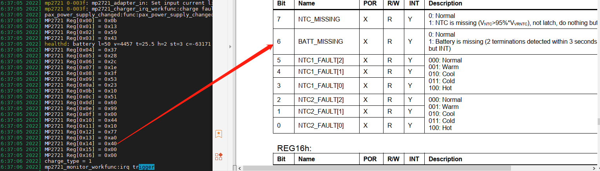

* 原因：

BATT_MISSING中断原因是3s内有两次触发了充满，而目前发现系统上报满充后，继续执行了enable charger，系统再次上报满充，所以触发BATT_MISSING中断。

* 修复方案：

在mp2721_enable_charger加上满充判断。

```C++
static void mp2721_plug_in(struct mp2721 *mp)
{
	if (mp->charge_status != POWER_SUPPLY_STATUS_FULL) {
		mp2721_enable_charger(mp);
	}

}
```

## 4.反复报错Watchdog timer expires

当sdp插入时，目前我软件disable了watchdog，但是插入充电器时一直有Watchdog timer expires中断上来。

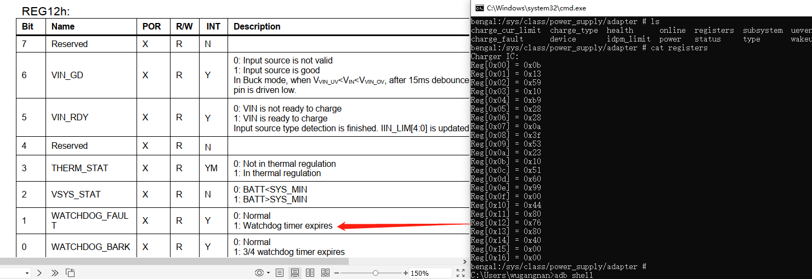

原因：

默认上电可能是看门狗超时的，试下把WATCHDOG写0的同时，WATCHDOG_RST写下1能解决。

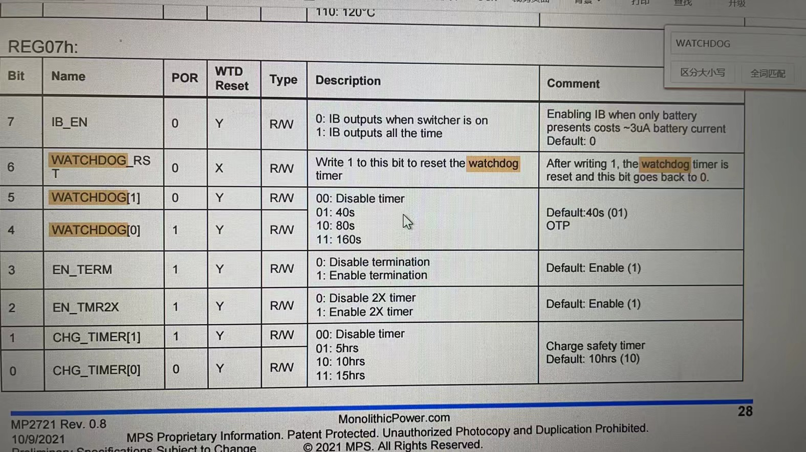

## 5.充电实测，满充电压4.11v

充电电流2A 电压5V，满充时间：1小时15分钟，回充电流200ma，回充间隔25分钟，回充时间2分钟。

充满时电压：4.11v

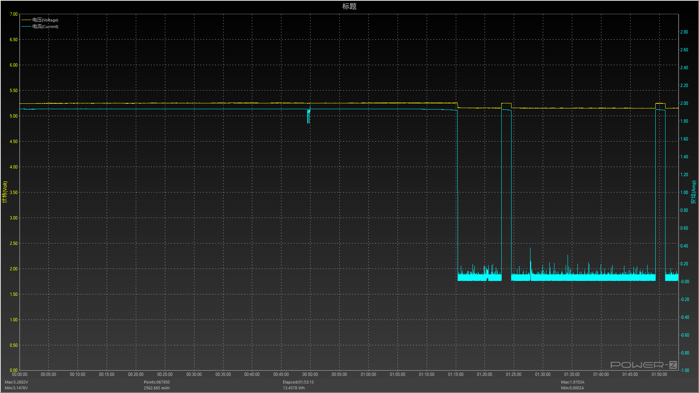

原因分析：
发现该电池是4.2v满充的，4.3v以上的满充电压就过充保护了。

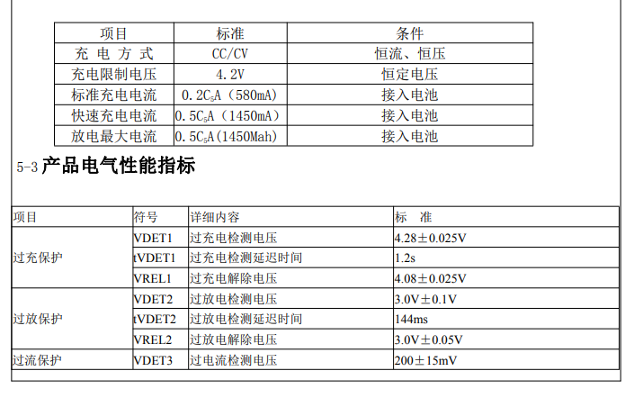


第二次使用M50电池测试就正常了：
充电电流2A 电压5V，满充时间：2小时29分钟，回充电流200ma，暂无回充。

充满时电压：4.358v
CV:4.4V

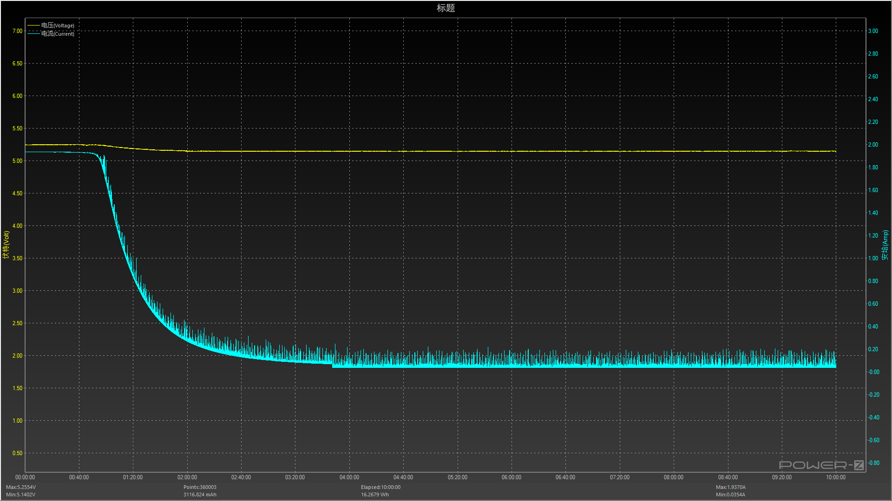

## 6.typec/bc1.2检测顺序

首先是type-c检测到`ATTACHED_SNK`状态

```C++
[Sun Apr 24 17:40:40 2022] mp2721_info tcpc_notifier_call, old_state = UNATTACHED, new_state = ATTACHED_SNK
[Sun Apr 24 17:40:40 2022] tcpc_notifier_call USB Plug in, pol = 0
[Sun Apr 24 17:40:40 2022] handle_typec_attach: ++ en:1
[Sun Apr 24 17:40:40 2022] PAX_CHG: mp2721_set_otg_enable en:0 enable_otg:0

这个时间去获取充电类型还是unknown：
[Sun Apr 24 21:55:22 2022] pax_tcpc_notifier_call USB Plug in, pol = 0
[Sun Apr 24 21:55:22 2022] PAX_CHG_2721: mp2721_charge_type:get mp2721_info charge type:0

按照原始逻辑，pax_charger会唤醒线程去开启bc1.2检测：
[Sun Apr 24 17:40:40 2022] pax_tcpc_notifier_call USB Plug in, pol = 0
[Sun Apr 24 17:40:40 2022] PAX_CHG: _wake_up_charger:
```

其次是PD选择5v3a档位，然后选择9v2a：

```log
[Sun Apr 24 21:55:22 2022] C:wake_lock=1\x0a< 2155.997>TCPC-TCPC:sink_vbus: 5000 mV, 3000 mA\

[Mon Apr 25 00:13:43 2022] rt-pd-manager soc:rt_pd_manager: pd_tcp_notifier_call sink vbus 9000mV 277mA type(0x86)
<  388.502>TCPC-TCPC:sink_vbus: 9000 mV, 2000 mA
```

根据软件逻辑：
```C++
* if(noti->typec_state.new_state == TYPEC_ATTACHED_SNK)
  * _wake_up_charger(info); //info->charger_thread_timeout = true;使能充电线程
    * charger_routine_thread(void *arg)
      * pax_is_charger_on(struct pax_charger *info)
	    * chr_type = pax_charger_dev_get_charger_type(info->chg1_dev);
		  * if (chr_type != POWER_SUPPLY_USB_TYPE_UNKNOWN)
		    * pax_charger_plug_in(info, chr_type);
			  * info->charger_thread_polling = true;

charger_routine_thread(void *arg)
{
	if (info->charger_thread_polling == true)
		pax_charger_start_timer(info);	
		  * pax_charger_alarm_timer_func(struct alarm *alarm, ktime_t now)
		    * _wake_up_charger(info);
}
```

由于在typec状态是`TYPEC_ATTACHED_SNK`时获取bc1.2状态，线程跑起来后识别还是unknown类型，不会继续启动plug_in指令，也就不会再次启动timer去唤醒线程了，所以必须在能识别bc1.2的时候去执行`_wake_up_charger`启动线程，才会正常执行`plug_in`操作。

* 正确做法是当mp2721中断上来后去读取bc1.2的状态才是ok的，此时通知pax_charger去wakeup线程：

```C++
pax_charger.c:
#include "mp2721_notify.h"
static int pax_plug_status_notifier(struct notifier_block *self, unsigned long event, void *value)
{
	int plug_en = 0;
	struct pax_charger *info;
	struct power_supply *psy;

	psy = power_supply_get_by_name("pax-master-charger");	
	info = (struct pax_charger *)power_supply_get_drvdata(psy);

	switch (event) {
		   case SET_PLUG_EN:
				   plug_en = *(int *)value;
				   pr_err("SET_PLUG_EN: %d\n", plug_en);
				   _wake_up_charger(info);
				   break;

		   default:
				   break;
	};

	return NOTIFY_DONE;
}


static int pax_charger_probe(struct platform_device *pdev)
{
	info->plug_nb.notifier_call = pax_plug_status_notifier;
	ret = mp2721_notify_register_client(&info->plug_nb);
	if (ret < 0) {
		return 0;
	}
}
	
mp2721_pmg_charger.c:
static void mp2721_charger_irq_workfunc(struct work_struct *work)
{
	g_mp2721_info->charge_status = mp2721_get_charge_status(g_mp2721_info->chg_dev);
	
	if ((g_mp2721_info->charge_type == POWER_SUPPLY_USB_TYPE_UNKNOWN) && (g_mp2721_info->status & MP2721_STATUS_PLUGIN)) {	
		//chr_info("%s:adapter plug out\n", __func__);
		plug_status = MP2721_STATUS_ONLINE;
		mp2721_notify_call_chain(SET_PLUG_EN, &plug_status);
		g_mp2721_info->status &= ~MP2721_STATUS_PLUGIN;
		//mp2721_plug_out(g_mp2721_info->chg_dev);
	} 
	else if ((g_mp2721_info->charge_type != POWER_SUPPLY_USB_TYPE_UNKNOWN) && !(g_mp2721_info->status & MP2721_STATUS_PLUGIN)) {
		//chr_info("%s:adapter plug in\n", __func__);
		plug_status = MP2721_STATUS_OFFLINE;
		mp2721_notify_call_chain(SET_PLUG_EN, &plug_status);
		msleep(10);
		//mp2721_plug_in(g_mp2721_info->chg_dev);
	}
}
```

后续可能会使用pm2250的bc1.2检测，因为UBS DMDP不会接在charger上面。

## 7.OVP关闭不及时导致charger OVP

之前都是在``TCP_NOTIFY_PD_STATE``时将ovp设高的，这样会不及时，charger报错ovp的。

```C++
	case TCP_NOTIFY_PD_STATE:
		switch (noti->pd_state.connected) {
			case PD_CONNECT_PE_READY_SNK:
			case PD_CONNECT_PE_READY_SNK_PD30:
			case PD_CONNECT_PE_READY_SNK_APDO:
			case PD_CONNECT_PE_READY_SRC:
				case PD_CONNECT_PE_READY_SRC_PD30:
				g_mp2721_info->pd_status = 1;
				chr_mp2721_info("%s PD active\n", __func__);
				break;
		}
```

修改方案：

```C++
	case TCP_NOTIFY_SINK_VBUS:
		g_mp2721_info->sink_mv_new = noti->vbus_state.mv;
		g_mp2721_info->sink_ma_new = noti->vbus_state.ma;
		chr_mp2721_info("%s sink vbus %dmV %dmA type(0x%02X)\n",
				    __func__, g_mp2721_info->sink_mv_new,
				    g_mp2721_info->sink_ma_new, noti->vbus_state.type);

		if ((g_mp2721_info->sink_mv_new != g_mp2721_info->sink_mv_old) ||
		    (g_mp2721_info->sink_ma_new != g_mp2721_info->sink_ma_old)) {
			g_mp2721_info->sink_mv_old = g_mp2721_info->sink_mv_new;
			g_mp2721_info->sink_ma_old = g_mp2721_info->sink_ma_new;
			if (g_mp2721_info->sink_mv_new && g_mp2721_info->sink_ma_new) {

				if (g_mp2721_info->sink_mv_new > 5000) {
					mp2721_enable_vbus_ovp(g_mp2721_info->chg_dev, false); //在这里
				}
			}
		}
		break;
```

log打印如下：
```log
[Sun Apr 24 16:38:30 2022] rt-pd-manager soc:rt_pd_manager: pd_tcp_notifier_call sink vbus 5000mV 3000mA type(0x01)
[Sun Apr 24 16:38:30 2022] PAX_CHG_MP2721: mp2721_info tcpc_notifier_call, old_state = UNATTACHED, new_state = ATTACHED_SNK
[Sun Apr 24 16:38:30 2022] PAX_CHG_MP2721: handle_typec_attach: ++ en:1
[Sun Apr 24 16:38:30 2022] rt-pd-manager soc:rt_pd_manager: pd_tcp_notifier_call Charger plug in, polarity = 1
[Sun Apr 24 16:38:30 2022] PAX_CHG_MP2721: mp2721_set_otg_enable en:0 enable_otg:0
[Sun Apr 24 16:38:30 2022] pax_tcpc_notifier_call USB Plug in, pol = 1
[Sun Apr 24 16:38:30 2022] PAX_CHG_MP2721: mp2721_charge_type:get mp2721_info charge type:0
[Sun Apr 24 16:38:30 2022] PAX_CHG_MP2721: typec_attach_thread: attach:1 charge_type = 0
[Sun Apr 24 16:38:30 2022] PAX_CHG_MP2721: mp2721_charge_type:get mp2721_info charge type:0
[Sun Apr 24 16:38:30 2022] ///PD dbg info 672d
[Sun Apr 24 16:38:30 2022] < 2672.629>TCPC-TCPC:tcpci_alert_power_status_changed_v10 ++\x0a< 2672.630>TCPC-TCPC:ps_change=2\x0a< 2672.631>TCPC-TYPEC:wait_ps=Disa
[Sun Apr 24 16:38:30 2022] ble\x0a< 2672.631>TCPC-TYPEC:** Attached.SNK\x0a< 2672.633>TCPC-TCPC:wake_lock=1\x0a< 2672.633>TCPC-TCPC:sink_vbus: 5000 mV, 3000 mA\x0a< 26
[Sun Apr 24 16:38:30 2022] 72.633>Enable TYPEC_RT_TIMER_NOT_LEGACY\x0a< 2672.633>TCPC-TYPEC:Attached-> SINK\x0a< 2672.634>TCPC-TCPC:usb_port_attached\x0a< 2672.634>
[Sun Apr 24 16:38:30 2022] TCPC-DC> dc_dfp_none\x0a< 2672.634>TCPC-PE:PD -> SNK_START (CUN)\x0a< 2672.635>TCPC-PE-EVT:reset_prl_done\x0a< 2672.635>TCPC-PE:PD -> SNK
[Sun Apr 24 16:38:30 2022] _DISC (CUN)\x0a< 2672.635>TCPC-PE:WaitVBUS=1\x0a< 2672.635>TCPC-PE-EVT:vbus_high\x0a< 2672.635>TCPC-PE:PD -> SNK_WAIT_CAP (CUN)\x0a< 2672.63
[Sun Apr 24 16:38:30 2022] 5>Enable PD_TIMER_SINK_WAIT_CAP
[Sun Apr 24 16:38:30 2022] ///PD dbg info 49d
[Sun Apr 24 16:38:30 2022] < 2672.730>TCPC-TCPC:Alert:0x0004, Mask:0x230fff
[Sun Apr 24 16:38:30 2022] PAX_CHG_MP2721: mp2721_info tcpc_notifier_call, old_state = UNATTACHED, new_state = Not charging
[Sun Apr 24 16:38:30 2022] PAX_CHG_MP2721: tcpc_notifier_call sink vbus 9000mV 277mA type(0x86)
[Sun Apr 24 16:38:30 2022] PAX_CHG_MP2721: mp2721_enable_vbus_ovp en:0 //在这里关闭ovp
[Sun Apr 24 16:38:30 2022] rt-pd-manager soc:rt_pd_manager: pd_tcp_notifier_call sink vbus 9000mV 277mA type(0x86)
[Sun Apr 24 16:38:30 2022] get prop 122 is not supported in usb
[Sun Apr 24 16:38:30 2022] ///PD dbg info 979d
[Sun Apr 24 16:38:30 2022] < 2672.733>TCPC-PE-EVT:src_cap\x0a< 2672.733>TCPC-PE:PD -> SNK_EVA_CAP (CUN)\x0a< 2672.733>TCPC-PE:pd_rev=2\x0a< 2672.733>TCPC-DPM:Policy
[Sun Apr 24 16:38:30 2022] =0x31\x0a< 2672.733>TCPC-DPM:SrcCap1: 0x0901912c\x0a< 2672.733>TCPC-DPM:SrcCap2: 0x0002d0c8\x0a< 2672.733>TCPC-DPM:SrcCap3: 0x0003c096\x0a<
[Sun Apr 24 16:38:30 2022] 2672.733>TCPC-DPM:EvaSinkCap1\x0a< 2672.733>TCPC-DPM:Find SrcCap1(Match):10000 mw\x0a< 2672.733>TCPC-DPM:EvaSinkCap2\x0a< 2672.733>TCPC-D
[Sun Apr 24 16:38:30 2022] PM:Find SrcCap2(Match):18000 mw\x0a< 2672.733>TCPC-DPM:Select SrcCap2\x0a< 2672.733>TCPC-PE-EVT:dpm_ack\x0a< 2672.733>TCPC-PE:PD -> SNK_S
[Sun Apr 24 16:38:30 2022] EL_CAP (CUN)\x0a< 2672.733>TCPC-PE:SelectCap2, rdo:0x230320c8\x0a< 2672.737>TCPC-TCPC:Alert:0x0040, Mask:0x230fff\x0a< 2672.737>TCPC-PE-E
[Sun Apr 24 16:38:30 2022] VT:good_crc\x0a< 2672.737>Enable PD_TIMER_SENDER_RESPONSE\x0a< 2672.741>TCPC-TCPC:Alert:0x0004, Mask:0x230fff\x0a< 2672.743>TCPC-PE-EVT:a
[Sun Apr 24 16:38:30 2022] ccept\x0a< 2672.743>TCPC-PE:PD -> SNK_TRANS_SINK (CUN)\x0a< 2672.743>Enable PD_TIMER_PS_TRANSITION\x0a< 2672.743>TCPC-PE:VC_HIGHV_PROT: 1
[Sun Apr 24 16:38:30 2022] \x0a< 2672.743>TCPC-PE:pd_set_vconn:0\x0a< 2672.743>TCPC-TCPC:sink_vbus: 9000 mV, 277 mA
[Sun Apr 24 16:38:30 2022] set prop 122 is not supported
[Sun Apr 24 16:38:30 2022] set prop 143 is not supported
[Sun Apr 24 16:38:30 2022] set prop 124 is not supported
[Sun Apr 24 16:38:30 2022] ///PD dbg info 246d
[Sun Apr 24 16:38:30 2022] < 2672.766>TCPC-TCPC:Alert:0x0001, Mask:0x230fff\x0a< 2672.766>TCPC-TCPC:tcpci_alert_cc_changed ++\x0a< 2672.767>TCPC-TYPEC:[CC_Alert]
[Sun Apr 24 16:38:30 2022] 0/7\x0a< 2672.768>Enable TYPEC_TIMER_PDDEBOUNCE\x0a< 2672.768>TCPC-PE-EVT:sink_tx_change\x0a< 2672.768>TCPC-TYPEC:RpLvl Alert
[Sun Apr 24 16:38:30 2022] ///PD dbg info 170d
[Sun Apr 24 16:38:30 2022] < 2672.778>Trigger TYPEC_TIMER_PDDEBOUNCE\x0a< 2672.778>TCPC-TYPEC:[CC_Change] 0/7\x0a< 2672.778>Enable TYPEC_RT_TIMER_NOT_LEGACY\x0a< 26
[Sun Apr 24 16:38:30 2022] 72.778>TCPC-TYPEC:Attached-> SINK(repeat)
[Sun Apr 24 16:38:30 2022] ///PD dbg info 49d
[Sun Apr 24 16:38:30 2022] < 2672.901>TCPC-TCPC:Alert:0x0004, Mask:0x230fff
[Sun Apr 24 16:38:30 2022] PAX_CHG_MP2721: tcpc_notifier_call sink vbus 9000mV 2000mA type(0x84)
[Sun Apr 24 16:38:30 2022] PAX_CHG_MP2721: mp2721_enable_vbus_ovp en:0
[Sun Apr 24 16:38:30 2022] rt-pd-manager soc:rt_pd_manager: pd_tcp_notifier_call sink vbus 9000mV 2000mA type(0x84)
[Sun Apr 24 16:38:30 2022] get prop 122 is not supported in usb
[Sun Apr 24 16:38:30 2022] set prop 122 is not supported
[Sun Apr 24 16:38:30 2022] set prop 144 is not supported
[Sun Apr 24 16:38:30 2022] set prop 143 is not supported
[Sun Apr 24 16:38:30 2022] set prop 124 is not supported
[Sun Apr 24 16:38:30 2022] ///PD dbg info 162d
[Sun Apr 24 16:38:30 2022] < 2672.903>TCPC-PE-EVT:ps_rdy\x0a< 2672.903>TCPC-TCPC:sink_vbus: 9000 mV, 2000 mA\x0a< 2672.903>TCPC-PE:PD -> SNK_READY (CUN)\x0a< 2672.9
[Sun Apr 24 16:38:30 2022] 03>Enable PD_TIMER_SNK_FLOW_DELAY
[Sun Apr 24 16:38:31 2022] ///PD dbg info 43d
[Sun Apr 24 16:38:31 2022] < 2673.204>Trigger PD_TIMER_SNK_FLOW_DELAY
[Sun Apr 24 16:38:31 2022] i2c_geni 4a80000.i2c: i2c error :-107
[Sun Apr 24 16:38:31 2022] ///PD dbg info 740d
[Sun Apr 24 16:38:31 2022] < 2673.204>TCPC-PE-EVT:timer\x0a< 2673.204>TCPC-DPM:clear_reaction=17\x0a< 2673.204>TCPC-DPM:from_pe: 1, evt:17, reaction:0x1000000\x0a<
[Sun Apr 24 16:38:31 2022] 2673.204>TCPC-PE-EVT:tcp_event(get_src_cap_ext), 17\x0a< 2673.204>TCPC-PE:PD -> SNK_GET_CAP_EX (CUN)\x0a< 2673.216>TCPC-TCPC:Alert:0x0
[Sun Apr 24 16:38:31 2022] 040, Mask:0x230fff\x0a< 2673.216>TCPC-PE-EVT:good_crc\x0a< 2673.216>Enable PD_TIMER_SENDER_RESPONSE\x0a< 2673.220>TCPC-TCPC:Alert:0x0004,
[Sun Apr 24 16:38:31 2022] Mask:0x230fff\x0a< 2673.222>TCPC-PE-EVT:no_support\x0a< 2673.222>TCPC-PE:PD -> SNK_READY (CUN)\x0a< 2673.223>TCPC-DPM:from_pe: 1, evt:29
[Sun Apr 24 16:38:31 2022] , reaction:0x10000\x0a< 2673.223>TCPC-PE-EVT:tcp_event(disc_id), 29\x0a< 2673.223>TCPC-PE:VDM -> D_UID_REQ (CUN)\x0a< 2673.227>TCPC-TCPC:
[Sun Apr 24 16:38:31 2022] Alert:0x0040, Mask:0x230fff\x0a< 2673.228>TCPC-PE-EVT:good_crc\x0a< 2673.228>Enable PD_TIMER_VDM_RESPONSE
[Sun Apr 24 16:38:31 2022] PAX_CHG_MP2721: tcpc_notifier_call PD active
[Sun Apr 24 16:38:31 2022] PAX_CHG_MP2721: tcpc_notifier_call sink vbus -1593946106mV -26329mA type(0xFF)
[Sun Apr 24 16:38:31 2022] rt-pd-manager soc:rt_pd_manager: pd_tcp_notifier_call pd state = 6
[Sun Apr 24 16:38:31 2022] set prop 125 is not supported
[Sun Apr 24 16:38:31 2022] set prop 122 is not supported
[Sun Apr 24 16:38:31 2022] get prop 122 is not supported in usb
[Sun Apr 24 16:38:31 2022] set prop 122 is not supported
[Sun Apr 24 16:38:31 2022] set prop 124 is not supported
[Sun Apr 24 16:38:31 2022] ///PD dbg info 529d
[Sun Apr 24 16:38:31 2022] < 2673.236>TCPC-TCPC:Alert:0x0004, Mask:0x230fff\x0a< 2673.238>TCPC-PE-EVT:no_support\x0a< 2673.238>TCPC-PE:PD -> SNK_NO_SUPP_RECV (CU
[Sun Apr 24 16:38:31 2022] N)\x0a< 2673.238>TCPC-PE:DPM_Immediately\x0a< 2673.238>TCPC-PE-EVT:dpm_ack\x0a< 2673.238>TCPC-PE:PD -> SNK_READY (CUN)\x0a< 2673.238>TCPC-PE
[Sun Apr 24 16:38:31 2022] -EVT:vdm_not_support\x0a< 2673.238>TCPC-PE:VDM -> D_UID_N (CUN)\x0a< 2673.238>TCPC-PE:DPM_Immediately\x0a< 2673.238>TCPC-PE-EVT:dpm_ack\x0a<
[Sun Apr 24 16:38:31 2022] 2673.238>TCPC-PE:VDM -> SNK_READY (CUN)\x0a< 2673.238>TCPC-DPM:dp_dfp_u_notify_pe_ready\x0a< 2673.238>TCPC-DPM:PE_READY\x0a< 2673.238>TC
[Sun Apr 24 16:38:31 2022] PC-PE:pd_state=6
[Sun Apr 24 16:38:31 2022] PAX_CHG_MP2721: mp2721_charge_type:get mp2721_info charge type:8
[Sun Apr 24 16:38:31 2022] SET_PLUG_EN: 0
[Sun Apr 24 16:38:31 2022] type=1400 audit(1650789512.259:189): avc: denied { read } for comm="Binder:506_2" name="wakeup28" dev="sysfs" ino=36309 scontext=u:r:system_suspend:s0 tcontext=u:object_r:s
ysfs:s0 tclass=dir permissive=0
[Sun Apr 24 16:38:31 2022] type=1400 audit(1650789512.263:190): avc: denied { read } for comm="Binder:506_2" name="wakeup26" dev="sysfs" ino=36200 scontext=u:r:system_suspend:s0 tcontext=u:object_r:s
ysfs:s0 tclass=dir permissive=0
[Sun Apr 24 16:38:31 2022] type=1400 audit(1650789512.271:191): avc: denied { read } for comm="Binder:506_2" name="wakeup24" dev="sysfs" ino=36170 scontext=u:r:system_suspend:s0 tcontext=u:object_r:s
ysfs:s0 tclass=dir permissive=0
[Sun Apr 24 16:38:31 2022] type=1400 audit(1650789512.283:192): avc: denied { read } for comm="Binder:506_2" name="wakeup22" dev="sysfs" ino=36112 scontext=u:r:system_suspend:s0 tcontext=u:object_r:s
ysfs:s0 tclass=dir permissive=0
[Sun Apr 24 16:38:31 2022] type=1400 audit(1650789512.283:193): avc: denied { read } for comm="Binder:506_2" name="wakeup40" dev="sysfs" ino=45813 scontext=u:r:system_suspend:s0 tcontext=u:object_r:s
ysfs:s0 tclass=dir permissive=0
[Sun Apr 24 16:38:31 2022] audit: audit_lost=55 audit_rate_limit=5 audit_backlog_limit=64
[Sun Apr 24 16:38:31 2022] audit: rate limit exceeded
[Sun Apr 24 16:38:31 2022] PAX_CHG_MP2721: mp2721_charge_type:get mp2721_info charge type:8
[Sun Apr 24 16:38:31 2022] PAX_CHG: pax_is_charger_on chr_type = 2
[Sun Apr 24 16:38:31 2022] PAX_CHG: pax_charger_plug_in
[Sun Apr 24 16:38:31 2022] PAX_CHG: pax_is_charger_on plug in, type:2
[Sun Apr 24 16:38:31 2022] PAX_CHG_MP2721: mp2721_plug_in:adapter plug in
[Sun Apr 24 16:38:31 2022] PAX_CHG_MP2721: mp2721_adjust_vin_limit:Set absolute vindpm threshold 4500 successfully
[Sun Apr 24 16:38:31 2022] PAX_CHG_MP2721: mp2721_plug_in: Set input current limit to 2000mA successfully
[Sun Apr 24 16:38:31 2022] PAX_CHG_MP2721: chg_dump: CHG [online: 1, type: DCP, status: Charging, fault: OK, health: Good, ICHG = 4000mA, AICR = 2000mA, MIVR = 4440mV, IEOC = 240mA, CV = 4350mV]
[Sun Apr 24 16:38:31 2022] PAX_CHG: charger_routine_thread end , 0
```

## 8.电压升高至9v死机

之前还不会死机，发现是去掉health属性就出现死机了，原因不明。

```log
[Sun Apr 24 15:55:16 2022] ///PD dbg info 49d
[Sun Apr 24 15:55:16 2022] <   78.091>TCPC-TCPC:Alert:0x0001, Mask:0x21067f
[Sun Apr 24 15:55:16 2022] husb311_set_low_power_mode - write HUSB311_REG_BMC_CTRL=0x7
[Sun Apr 24 15:55:16 2022] mp2721_info tcpc_notifier_call, old_state = UNATTACHED, new_state = UNATTACHED
[Sun Apr 24 15:55:16 2022] ///PD dbg info 165d
[Sun Apr 24 15:55:16 2022] <   78.091>TCPC-TCPC:tcpci_alert_cc_changed ++\x0a<   78.093>TCPC-TYPEC:[CC_Alert] 0/7\x0a<   78.094>TCPC-TYPEC:** AttachWait.SNK\x0a<
[Sun Apr 24 15:55:16 2022] 78.094>Enable TYPEC_TIMER_CCDEBOUNCE
[Sun Apr 24 15:55:16 2022] ///PD dbg info 166d
[Sun Apr 24 15:55:16 2022] <   78.215>Trigger TYPEC_TIMER_CCDEBOUNCE\x0a<   78.215>TCPC-TYPEC:[CC_Change] 0/7\x0a<   78.215>TCPC-TYPEC:wait_ps=SNK_VSafe5V\x0a<   78
[Sun Apr 24 15:55:16 2022] .215>Enable TYPEC_RT_TIMER_NOT_LEGACY
[Sun Apr 24 15:55:16 2022] ///PD dbg info 46d
[Sun Apr 24 15:55:16 2022] <   78.215>TCPC-TYPEC:Attached-> NULL(repeat)
[Sun Apr 24 15:55:16 2022] mp2721_info tcpc_notifier_call, old_state = UNATTACHED, new_state = (null)
[Sun Apr 24 15:55:16 2022] tcpc_notifier_call sink vbus 5000mV 3000mA type(0x01)
[Sun Apr 24 15:55:16 2022] PAX_CHG_MP2721: mp2721_enable_vbus_ovp en:1
[Sun Apr 24 15:55:16 2022] rt-pd-manager soc:rt_pd_manager: pd_tcp_notifier_call sink vbus 5000mV 3000mA type(0x01)
[Sun Apr 24 15:55:16 2022] mp2721_info tcpc_notifier_call, old_state = UNATTACHED, new_state = ATTACHED_SNK
[Sun Apr 24 15:55:16 2022] handle_typec_attach: ++ en:1
[Sun Apr 24 15:55:16 2022] rt-pd-manager soc:rt_pd_manager: pd_tcp_notifier_call Charger plug in, polarity = 1
[Sun Apr 24 15:55:16 2022] PAX_CHG_MP2721: mp2721_set_otg_enable en:0 enable_otg:0
[Sun Apr 24 15:55:16 2022] typec_attach_thread: attach:1 charge_type = 0
[Sun Apr 24 15:55:16 2022] pax_tcpc_notifier_call USB Plug in, pol = 1
[Sun Apr 24 15:55:16 2022] ///PD dbg info 721d
[Sun Apr 24 15:55:16 2022] <   78.246>TCPC-TCPC:Alert:0x0002, Mask:0x23067f\x0a<   78.246>TCPC-TCPC:tcpci_alert_power_status_changed_v10 ++\x0a<   78.247>TCPC-TC
[Sun Apr 24 15:55:16 2022] PC:ps_change=2\x0a<   78.248>TCPC-TYPEC:wait_ps=Disable\x0a<   78.248>TCPC-TYPEC:** Attached.SNK\x0a<   78.249>TCPC-TCPC:wake_lock=1\x0a<
[Sun Apr 24 15:55:16 2022] 78.249>TCPC-TCPC:sink_vbus: 5000 mV, 3000 mA\x0a<   78.249>Enable TYPEC_RT_TIMER_NOT_LEGACY\x0a<   78.249>TCPC-TYPEC:Attached-> SINK\x0a<
[Sun Apr 24 15:55:16 2022] 78.249>TCPC-TCPC:usb_port_attached\x0a<   78.250>TCPC-DC> dc_dfp_none\x0a<   78.250>TCPC-PE:PD -> SNK_START (CUN)\x0a<   78.250>TCPC-P
[Sun Apr 24 15:55:16 2022] E-EVT:reset_prl_done\x0a<   78.250>TCPC-PE:PD -> SNK_DISC (CUN)\x0a<   78.250>TCPC-PE:WaitVBUS=1\x0a<   78.250>TCPC-PE-EVT:vbus_high\x0a<
[Sun Apr 24 15:55:16 2022] 78.250>TCPC-PE:PD -> SNK_WAIT_CAP (CUN)\x0a<   78.251>Enable PD_TIMER_SINK_WAIT_CAP
[Sun Apr 24 15:55:16 2022] init: Control message: Could not find 'android.hardware.soundtrigger@2.0::ISoundTriggerHw/default' for ctl.interface_start from pid: 434 (/system/bin/hwservicemanager)
[Sun Apr 24 15:55:16 2022] healthd: battery l=50 v=3483 t=25.6 h=2 st=3 c=-380249 fc=3581000 cc=0 chg=
[Sun Apr 24 15:55:16 2022] healthd: battery l=50 v=3459 t=25.6 h=2 st=3 c=-438232 fc=3581000 cc=0 chg=
[Sun Apr 24 15:55:16 2022] ///PD dbg info 49d
[Sun Apr 24 15:55:16 2022] <   78.348>TCPC-TCPC:Alert:0x0004, Mask:0x23067f
[Sun Apr 24 15:55:16 2022] mp2721_info tcpc_notifier_call, old_state = UNATTACHED, new_state = Not charging
[Sun Apr 24 15:55:16 2022] tcpc_notifier_call sink vbus 9000mV 277mA type(0x86)
[Sun Apr 24 15:55:16 2022] PAX_CHG_MP2721: mp2721_enable_vbus_ovp en:0
[Sun Apr 24 15:55:16 2022] rt-pd-manager soc:rt_pd_manager: pd_tcp_notifier_call sink vbus 9000mV 277mA type(0x86)
[Sun Apr 24 15:55:16 2022] ///PD dbg info 979d
[Sun Apr 24 15:55:16 2022] <   78.350>TCPC-PE-EVT:src_cap\x0a<   78.350>TCPC-PE:PD -> SNK_EVA_CAP (CUN)\x0a<   78.350>TCPC-PE:pd_rev=2\x0a<   78.350>TCPC-DPM:Policy
[Sun Apr 24 15:55:16 2022] =0x31\x0a<   78.350>TCPC-DPM:SrcCap1: 0x0901912c\x0a<   78.350>TCPC-DPM:SrcCap2: 0x0002d0c8\x0a<   78.350>TCPC-DPM:SrcCap3: 0x0003c096\x0a<
[Sun Apr 24 15:55:16 2022] 78.350>TCPC-DPM:EvaSinkCap1\x0a<   78.350>TCPC-DPM:Find SrcCap1(Match):10000 mw\x0a<   78.350>TCPC-DPM:EvaSinkCap2\x0a<   78.350>TCPC-D
[Sun Apr 24 15:55:16 2022] PM:Find SrcCap2(Match):18000 mw\x0a<   78.350>TCPC-DPM:Select SrcCap2\x0a<   78.350>TCPC-PE-EVT:dpm_ack\x0a<   78.350>TCPC-PE:PD -> SNK_S
[Sun Apr 24 15:55:16 2022] EL_CAP (CUN)\x0a<   78.350>TCPC-PE:SelectCap2, rdo:0x230320c8\x0a<   78.354>TCPC-TCPC:Alert:0x0040, Mask:0x23067f\x0a<   78.354>TCPC-PE-E
[Sun Apr 24 15:55:16 2022] VT:good_crc\x0a<   78.354>Enable PD_TIMER_SENDER_RESPONSE\x0a<   78.357>TCPC-TCPC:Alert:0x0004, Mask:0x23067f\x0a<   78.359>TCPC-PE-EVT:a
[Sun Apr 24 15:55:16 2022] ccept\x0a<   78.359>TCPC-PE:PD -> SNK_TRANS_SINK (CUN)\x0a<   78.359>Enable PD_TIMER_PS_TRANSITION\x0a<   78.359>TCPC-PE:VC_HIGHV_PROT: 1
[Sun Apr 24 15:55:16 2022] \x0a<   78.359>TCPC-PE:pd_set_vconn:0\x0a<   78.359>TCPC-TCPC:sink_vbus: 9000 mV, 277 mA
[Sun Apr 24 15:55:16 2022] ///PD dbg info 662d
[Sun Apr 24 15:55:16 2022] <   78.374>TCPC-TCPC:Alert:0x0001, Mask:0x23067f\x0a<   78.375>TCPC-TCPC:tcpci_alert_cc_changed ++\x0a<   78.376>TCPC-TYPEC:[CC_Alert]
[Sun Apr 24 15:55:16 2022] 0/7\x0a<   78.376>Enable TYPEC_TIMER_PDDEBOUNCE\x0a<   78.376>TCPC-TYPEC:RpLvl Alert\x0a<   78.376>TCPC-PE-EVT:sink_tx_change\x0a<   78.378
[Sun Apr 24 15:55:16 2022] >TCPC-TCPC:Alert:0x0001, Mask:0x23067f\x0a<   78.378>TCPC-TCPC:tcpci_alert_cc_changed ++\x0a<   78.379>TCPC-TYPEC:[CC_Alert] 0/7\x0a<   7
[Sun Apr 24 15:55:16 2022] 8.380>Enable TYPEC_TIMER_PDDEBOUNCE\x0a<   78.380>TCPC-PE-EVT:sink_tx_change\x0a<   78.380>TCPC-TYPEC:RpLvl Alert\x0a<   78.390>Trigger T
[Sun Apr 24 15:55:16 2022] YPEC_TIMER_PDDEBOUNCE\x0a<   78.390>TCPC-TYPEC:[CC_Change] 0/7\x0a<   78.390>Enable TYPEC_RT_TIMER_NOT_LEGACY\x0a<   78.390>TCPC-TYPEC:At
[Sun Apr 24 15:55:16 2022] tached-> SINK(repeat)
[Sun Apr 24 15:55:16 2022] ///PD dbg info 49d
[Sun Apr 24 15:55:16 2022] <   78.482>TCPC-TCPC:Alert:0x0001, Mask:0x23067f
[Sun Apr 24 15:55:16 2022] ///PD dbg info 613d
[Sun Apr 24 15:55:16 2022] <   78.483>TCPC-TCPC:tcpci_alert_cc_changed ++\x0a<   78.484>TCPC-TYPEC:[CC_Alert] 0/7\x0a<   78.484>Enable TYPEC_TIMER_PDDEBOUNCE\x0a<
[Sun Apr 24 15:55:16 2022] 78.484>TCPC-TYPEC:RpLvl Alert\x0a<   78.484>TCPC-PE-EVT:sink_tx_change\x0a<   78.486>TCPC-TCPC:Alert:0x0001, Mask:0x23067f\x0a<   78.486
[Sun Apr 24 15:55:16 2022] >TCPC-TCPC:tcpci_alert_cc_changed ++\x0a<   78.487>TCPC-TYPEC:[CC_Alert] 0/7\x0a<   78.488>Enable TYPEC_TIMER_PDDEBOUNCE\x0a<   78.488>TC
[Sun Apr 24 15:55:16 2022] PC-PE-EVT:sink_tx_change\x0a<   78.488>TCPC-TYPEC:RpLvl Alert\x0a<   78.498>Trigger TYPEC_TIMER_PDDEBOUNCE\x0a<   78.498>TCPC-TYPEC:[CC_C
[Sun Apr 24 15:55:16 2022] hange] 0/7\x0a<   78.498>Enable TYPEC_RT_TIMER_NOT_LEGACY\x0a<   78.498>TCPC-TYPEC:Attached-> SINK(repeat)
```

## 9.没有检测到设备死机

死机打印如下：
```log
    3.983122] PAX_CHG_MP2721: failed to read 0x07
[    3.987867] i2c_geni 4a80000.i2c: i2c error :-107
[    3.992622] PAX_CHG_MP2721: mp2721_init_device:Failed to set watchdog timer:-107
[    4.000048] PAX_CHG_MP2721: device init failure: -107
[    4.005697] i2c_geni 4a88000.i2c: Bus frequency is set to 400000Hz
[    4.030863] reg-cooling-device soc:qcom,rpm-smd:rpm-regulator-smpa2:cx-cdev-lvl: Linked as a consumer to regulator.18
[    4.042151] reg-cooling-device soc:qcom,rpm-smd:rpm-regulator-ldoa1:mx-cdev-lvl: Linked as a consumer to regulator.22
[    4.060611] device-mapper: uevent: version 1.0.3
[    4.065634] device-mapper: ioctl: 4.39.0-ioctl (2018-04-03) initialised: dm-devel@redhat.com
[    4.075196] bt_power_populate_dt_pinfo: bt-reset-gpio not provided in devicetree
[    4.082648] bt_power_populate_dt_pinfo: wl-reset-gpio not provided in devicetree
[    4.090145] bt_dt_parse_vreg_info: qca,bt-vdd-ldo: is not provided in device tree
[    4.097651] bt_dt_parse_vreg_info: qca,bt-chip-pwd: is not provided in device tree
[    4.105247] bt_dt_parse_vreg_info: qca,bt-vdd-aon: is not provided in device tree
[    4.112807] bt_dt_parse_vreg_info: qca,bt-vdd-dig: is not provided in device tree
[    4.120313] bt_dt_parse_vreg_info: qca,bt-vdd-rfa1: is not provided in device tree
[    4.127902] bt_dt_parse_vreg_info: qca,bt-vdd-rfa2: is not provided in device tree
[    4.135512] bt_dt_parse_vreg_info: qca,bt-vdd-asd: is not provided in device tree
[    4.143018] bt_dt_parse_clk_info: clocks is not provided in device tree
[    4.153647] sdhci: Secure Digital Host Controller Interface driver
[    4.159906] sdhci: Copyright(c) Pierre Ossman
[    4.164281] sdhci-pltfm: SDHCI platform and OF driver helper
[    4.170094] aw2016_led_init: driver version: V1.0.3
[    4.172956] Unable to handle kernel paging request at virtual address 01e3449c5058d197
[    4.183333] Mem abort info:
[    4.186164]   ESR = 0x96000044
[    4.189287]   Exception class = DABT (current EL), IL = 32 bits
[    4.194809] qpnp_vibrator_ldo_probe: Vibrator LDO successfully registered: uV = 3000000, overdrive = disabled
[    4.195271]   SET = 0, FnV = 0
[    4.206288] usbcore: registered new interface driver usbhid
[    4.208409]   EA = 0, S1PTW = 0
[    4.209290] tz diag version is 2403000
[    4.209655] encrypted qseelog enabled is 0
[    4.213983] usbhid: USB HID core driver
[    4.217121] Data abort info:
[    4.219223] Unable to handle kernel paging request at virtual address 9ae6c9879b045f05
[    4.219226] Mem abort info:
[    4.219228]   ESR = 0x96000044
[    4.219232]   Exception class = DABT (current EL), IL = 32 bits
[    4.219234]   SET = 0, FnV = 0
[    4.219236]   EA = 0, S1PTW = 0
[    4.219237] Data abort info:
[    4.219240]   ISV = 0, ISS = 0x00000044
[    4.219242]   CM = 0, WnR = 1
[    4.219246] [9ae6c9879b045f05] address between user and kernel address ranges
[    4.219255] Internal error: Oops: 96000044 [#1] PREEMPT SMP
[    4.219265] Modules linked in:
[    4.219274] Process kworker/u8:7 (pid: 234, stack limit = 0xffffff80099f0000)
[    4.219286] CPU: 0 PID: 234 Comm: kworker/u8:7 Tainted: G        W         4.19.157 #1
[    4.219289] Hardware name: Qualcomm Technologies, Inc. Scuba IOT IDP (DT)
[    4.219321] Workqueue: events_unbound async_run_entry_fn
[    4.219328] pstate: 80400005 (Nzcv daif +PAN -UAO)
[    4.219342] pc : dma_common_contiguous_remap+0x90/0x100
[    4.219345] lr : dma_common_contiguous_remap+0x58/0x100
[    4.219346] sp : ffffff80099f3a20
[    4.219347] x29: ffffff80099f3a20 x28: 00000000006000c0
[    4.219350] x27: 0068000000000703 x26: ffffffbf00000000
[    4.219355] x25: 006800000000070f x24: ffffffbfabf22000
[    4.219358] x23: 0000000000080000 x22: 0000000000000008
[    4.219362] x21: ffffff9df0ba7838 x20: 9ae6c9879b045f05
[    4.219366] x19: 006800000000070f x18: ffffff9df2e32000
[    4.219370] x17: 0000000000000000 x16: 0000000000000000
[    4.219374] x15: 0000000000000013 x14: 0000000000000000
[    4.219378] x13: 00000000000fc880 x12: ffffffbfabf22000
[    4.219382] x11: ffffffbf00000000 x10: ffffff9df1d96000
[    4.219386] x9 : 0000000000000000 x8 : 0000000000000080
[    4.219390] x7 : 0000000000000000 x6 : ffffff80099f3980
[    4.219393] x5 : ffffff80099f3988 x4 : 0000000000000000
[    4.219397] x3 : 00000000006000c0 x2 : 0000000000000001
[    4.219401] x1 : 0000000000000400 x0 : 9ae6c9879b045f05
[    4.219409] Call trace:
[    4.219415]  dma_common_contiguous_remap+0x90/0x100
[    4.219425]  __dma_alloc+0x2bc/0x3d8
[    4.219434]  tz_log_probe+0x8c0/0xe00
[    4.219443]  platform_drv_probe+0x7c/0xb8
[    4.219447]  really_probe+0x53c/0x720
[    4.219449]  driver_probe_device+0x70/0x140
[    4.219453]  __driver_attach+0x110/0x1c8
[    4.219463]  bus_for_each_dev+0x78/0xc0
[    4.219466]  driver_attach+0x20/0x28
[    4.219469]  driver_attach_async+0x14/0x58
[    4.219473]  async_run_entry_fn+0x58/0x178
[    4.219482]  process_one_work+0x278/0x468
[    4.219485]  worker_thread+0x238/0x4c8
[    4.219489]  kthread+0x148/0x158
[    4.219497]  ret_from_fork+0x10/0x1c
[    4.219505] Code: cb0c196c cb0c030d 8b4d192d 8b0d198c (f8297a8c)
[    4.219511] ---[ end trace 4eb7bfdf5ce969ff ]---
[    4.219734] kworker/u8:7 (234) used greatest stack depth: 11680 bytes left
[    4.221453] ashmem: initialized
[    4.224980]   ISV = 0, ISS = 0x00000044
[    4.224982]   CM = 0, WnR = 1
[    4.224986] [01e3449c5058d197] address between user and kernel address ranges
[    4.224991] Internal error: Oops: 96000044 [#2] PREEMPT SMP
[    4.224999] Modules linked in:
[    4.228858] ipa_ut ipa_ut_module_init:1036 Loading IPA test module...
[    4.231732] Process kworker/u8:8 (pid: 240, stack limit = 0xffffff8009d10000)
[    4.242183] bimc-bwmon 1b8e300.qcom,cpu-cpu-ddr-bwmon: BW HWmon governor registered.
[    4.242460] CPU: 2 PID: 240 Comm: kworker/u8:8 Tainted: G      D W         4.19.157 #1
[    4.248839] arm-memlat-mon soc:qcom,cpu0-cpugrp:qcom,cpu0-cpu-ddr-latmon: Memory Latency governor registered.
[    4.251439] Hardware name: Qualcomm Technologies, Inc. Scuba IOT IDP (DT)
[    4.255414] arm-memlat-mon soc:qcom,cpu0-cpugrp:qcom,cpu0-computemon: Compute governor registered.
[    4.257673] Workqueue: events_unbound async_run_entry_fn
[    4.572765] pstate: 00400005 (nzcv daif +PAN -UAO)
[    4.577574] pc : __memset+0x4c/0x188
[    4.581168] lr : __kmalloc_track_caller+0x2fc/0x430
[    4.586054] sp : ffffff8009d13870
```

* 原因，申请内存和释放内存函数不匹配，kfree资源与devm_kzalloc不匹配导致
```C++
	mp2721_info = devm_kzalloc(&client->dev, sizeof(struct mp2721_info), GFP_KERNEL);
	if (!mp2721_info) {
		chr_mp2721_err("%s: out of memory\n", __func__);
		return -ENOMEM;
	}
     devm_kfree(&client->dev,mp2721_info);
```

## 10.PD充电电流被限制在900ma

每次插入充电器，AICR适配器电流都被限制在900ma，即使通过`mp2721_set_aicr`设置也无效：
```C++
/* Register 01h */
#define MP2721_REG_01               0x01

#define MP2721_IINLIM_MASK          0x1F
#define MP2721_IINLIM_SHIFT         0
#define MP2721_IINLIM_BASE          100
#define MP2721_IINLIM_LSB           100

static int mp2721_set_aicr(struct charger_device *chg_dev, int curr)
{
	u8 val;

	val = (curr - MP2721_IINLIM_BASE) / MP2721_IINLIM_LSB;
	return mp2721_config_byte_interface(MP2721_REG_01, MP2721_IINLIM_MASK, MP2721_IINLIM_SHIFT ,val);
}
```

查看寄存器表：
```shell
开机打印：
[    3.337015] PAX_CHG_MP2721: mp2721_parse_dt() iin_limit:2000mA

console:/sys/class/power_supply/usb # cat registers
Charger IC:
Reg[0x00] = 0x0b
Reg[0x01] = 0x68 //01101000
```

查看数据手册，发现电流被`011: Force input current limit to 900mA`强制设置到900ma：
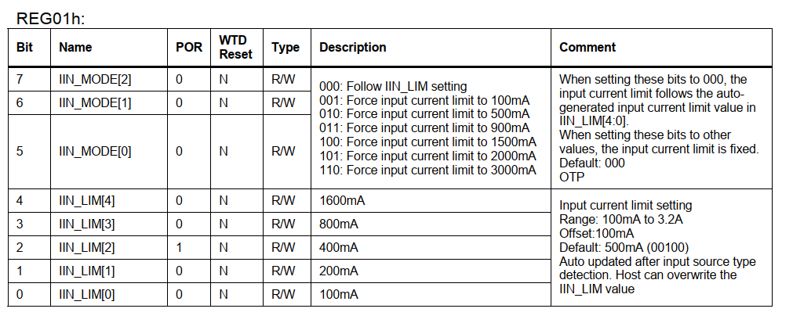

将这些位设置为 000 时，输入电流限制遵循 IIN_LIM[4:0] 中自动生成的输入电流限制值。
将这些位设置为其他值时，输入电流限制是固定的。
默认值：000

解决方案：
```C++
1.尝试将5/6/7 bit设置为0，默认用IIN_LIM[4:0]设置电流，修改如下：
/* Register 01h */
#define MP2721_REG_01               0x01

#define MP2721_IINLIM_MASK          0xFF //将mask设置ff，567bit将被覆盖0
#define MP2721_IINLIM_SHIFT         0
#define MP2721_IINLIM_BASE          0 //这里之前搞错了，应该是0
#define MP2721_IINLIM_LSB           100
```

## 11.接电脑充电频繁中断

我们看到接电脑充电时，mp2721频繁进入中断，不知道什么原因，如下：
```log
[ 2064.856685] mp2721_charger_irq_workfunc:mp2721 irq
[ 2064.863733] mp2721_irq_enable:
[ 2064.867104] mp2721_irq_disable:
[ 2064.870579] mp2721_charger_irq_workfunc:mp2721 irq
[ 2064.878243] mp2721_irq_enable:
[ 2064.881825] mp2721_irq_disable:
[ 2064.885480] mp2721_charger_irq_workfunc:mp2721 irq
[ 2064.898046] mp2721_irq_enable:
[ 2064.901356] mp2721_irq_disable:
[ 2064.904678] mp2721_charger_irq_workfunc:mp2721 irq
[ 2064.914840] mp2721_irq_enable:
[ 2064.918051] mp2721_irq_disable:
[ 2064.921348] mp2721_charger_irq_workfunc:mp2721 irq
[ 2064.929306] mp2721_irq_enable:
[ 2064.932624] mp2721_irq_disable:
[ 2064.936026] mp2721_charger_irq_workfunc:mp2721 irq
[ 2064.943713] mp2721_irq_enable:
[ 2064.947161] mp2721_irq_disable:
[ 2064.951436] mp2721_charger_irq_workfunc:mp2721 irq
[ 2064.958280] mp2721_irq_enable:
[ 2064.961576] mp2721_irq_disable:
[ 2064.965002] mp2721_charger_irq_workfunc:mp2721 irq
[ 2064.974902] mp2721_irq_enable:
[ 2064.978451] mp2721_irq_disable:
[ 2064.981821] mp2721_charger_irq_workfunc:mp2721 irq
[ 2064.995605] mp2721_irq_enable:
[ 2064.999185] mp2721_irq_disable:
[ 2065.002933] mp2721_charger_irq_workfunc:mp2721 irq
[ 2065.012277] mp2721_irq_enable:
[ 2065.015502] mp2721_irq_disable:
[ 2065.019141] mp2721_charger_irq_workfunc:mp2721 irq
[ 2065.027911] mp2721_irq_enable:
[ 2065.031296] mp2721_irq_disable:
[ 2065.034736] mp2721_charger_irq_workfunc:mp2721 irq
[ 2065.041287] mp2721_irq_enable:
```

查看目前电流设置，由于没做限流都是2000ma，怀疑是这里的问题，使用写寄存器到的方式将ICC限制在480ma，如下操作：
```log
i2cset -f -y 0 0x3f 0x02 0xc6 b
```

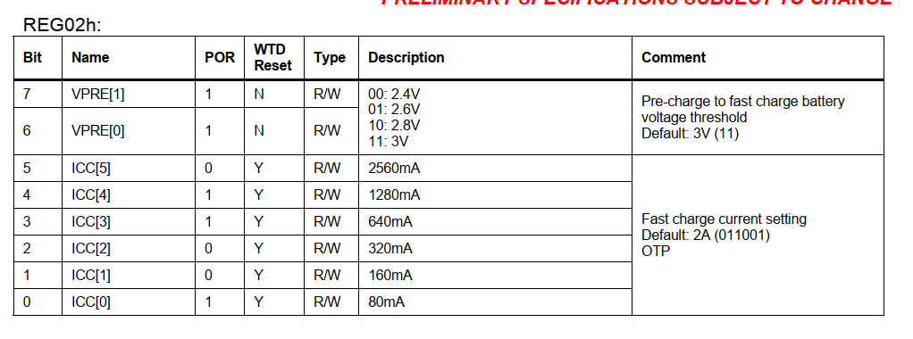

成功解救，立马就不进入中断了：


## 12.快充适配器偶发性充电电流为0

log参考：
* [插入快充关闭powerpath.txt](refers/log/插入快充关闭powerpath.txt)

我猜测可能是和ovp的操作有关系，charger ovp太慢了，先输入了9v。ovp逻辑如下，当typec检测到pd时设置charger的`POWER_SUPPLY_PROP_PD_VOLTAGE_MIN`属性，charger根据pd最大值判断是否关闭ovp，否则打开，是不是应该把打开动作去掉？

```C++
static int pd_tcp_notifier_call(struct notifier_block *nb,
				unsigned long event, void *data)
{
	switch (event) {
	case TCP_NOTIFY_SINK_VBUS:
		g_info->sink_mv_new = noti->vbus_state.mv;
		g_info->sink_ma_new = noti->vbus_state.ma;
		dev_err(&g_info->pdev->dev, "%s sink vbus %dmV %dmA type(0x%02X)\n",
				    __func__, g_info->sink_mv_new,
				    g_info->sink_ma_new, noti->vbus_state.type);

		if ((g_info->sink_mv_new != g_info->sink_mv_old) ||
		    (g_info->sink_ma_new != g_info->sink_ma_old)) {
			g_info->sink_mv_old = g_info->sink_mv_new;
			g_info->sink_ma_old = g_info->sink_ma_new;
			if (g_info->sink_mv_new && g_info->sink_ma_new) {
				pr_err("%s - sink vbus\n",__func__);
				val.intval = g_info->sink_mv_new * 1000;
				smblib_set_prop(POWER_SUPPLY_PROP_VOLTAGE_MAX, &val);
			}
		}
		if (noti->vbus_state.type & TCP_VBUS_CTRL_PD_DETECT) //查看是否检测到vbus和pd状态
			pd_sink_set_vol_and_cur(g_info->sink_mv_new,
					  g_info->sink_ma_new,
					  noti->vbus_state.type);
		break;
	}
}

static void pd_sink_set_vol_and_cur(int mv, int ma, uint8_t type)
{
	const int micro_5v = 5000000;
	unsigned long sel = 0;
	union power_supply_propval val = {.intval = 0};

	// Charger plug-in first time
	smblib_get_prop(POWER_SUPPLY_PROP_PD_ACTIVE, &val);
	if (val.intval == POWER_SUPPLY_PD_INACTIVE) {
		val.intval = POWER_SUPPLY_PD_ACTIVE;
		smblib_set_prop(POWER_SUPPLY_PROP_PD_ACTIVE, &val);
	}

	g_info->pd_active = POWER_SUPPLY_PD_ACTIVE;

	switch (type) {
	case TCP_VBUS_CTRL_PD_HRESET:
	case TCP_VBUS_CTRL_PD_PR_SWAP:
	case TCP_VBUS_CTRL_PD_REQUEST:
		set_bit(0, &sel);
		set_bit(1, &sel);
		val.intval = mv * 1000;
		break;
	case TCP_VBUS_CTRL_PD_STANDBY_UP:
		set_bit(1, &sel);
		val.intval = mv * 1000;
		break;
	case TCP_VBUS_CTRL_PD_STANDBY_DOWN:
		set_bit(0, &sel);
		val.intval = mv * 1000;
		break;
	default:
		break;
	}
	if (val.intval < micro_5v)
		val.intval = micro_5v;
	if (test_bit(0, &sel))
		smblib_set_prop(POWER_SUPPLY_PROP_PD_VOLTAGE_MIN, &val);
	if (test_bit(1, &sel))
		smblib_set_prop(POWER_SUPPLY_PROP_PD_VOLTAGE_MAX, &val); //设置PD电压max

	val.intval = ma * 1000;
	smblib_set_prop(POWER_SUPPLY_PROP_PD_CURRENT_MAX, &val);
}

charger：
static int mp2721_set_property(struct power_supply *psy,
		enum power_supply_property psp,
		const union power_supply_propval *val)
{
	int ret = 0;

	switch (psp) {

	case POWER_SUPPLY_PROP_PD_VOLTAGE_MAX:
		dev_err(g_mp2721_info->dev,"%s() set pd_charging_voltage_max:%d mv, ret:%d\n", \
					__func__, val->intval/1000, ret);
		g_mp2721_info->cfg.pd_charging_voltage_max = val->intval;
		mp2721_update_ovp_status();
		break;

	}
}

void mp2721_update_ovp_status(void)
{
	/* If the power is greater than 10w, turn off the ovp */
	if (g_mp2721_info->cfg.pd_charging_voltage_max > FAST_CHR_THRESHOLD_VOL) {
		mp2721_enable_vbus_ovp(g_mp2721_info->chg_dev, false); //关闭ovp
	}
	else {
		mp2721_enable_vbus_ovp(g_mp2721_info->chg_dev, true);
	}
}
```

根据打印，发现出错时打开了3次ovp：

```log
[  934.604342] mp2721 0-003f: mp2721_set_property() set pd_charging_voltage_max:5000 mv, ret:0
[  934.622970] mp2721_enable_vbus_ovp en:1
[  934.650646] mp2721 0-003f: mp2721_set_property() set pd_charging_voltage_max:5000 mv, ret:0
[  934.702060] mp2721_enable_vbus_ovp en:1
[  935.439913] mp2721 0-003f: mp2721_set_property() set pd_charging_voltage_max:5000 mv, ret:0
[  935.468964] mp2721_enable_vbus_ovp en:1
[  935.544666] mp2721 0-003f: mp2721_set_property() set pd_charging_voltage_max:9000 mv, ret:0
[  935.561318] mp2721_enable_vbus_ovp en:0
[  935.827049] mp2721_enable_vbus_ovp en:0
```

尝试不做打开ovp动作,还是不行，那我在关闭ovp的时候判断一下powerpath是否打开，如果关闭了则打开逻辑：
```C++
void mp2721_update_ovp_status(void)
{
	bool power_path_en;
	/* If the power is greater than 10w, turn off the ovp */
	if (g_mp2721_info->cfg.pd_charging_voltage_max > FAST_CHR_THRESHOLD_VOL) {
		mp2721_get_is_powerpath_enable(g_mp2721_info->chg_dev, power_path_en);
		mp2721_enable_vbus_ovp(g_mp2721_info->chg_dev, false);
		if (! power_path_en) {
			chr_mp2721_info("power path is disable when pd charge, open it!\n");
			mp2721_enable_powerpath(g_mp2721_info->chg_dev, true);
		}
		
	}
}
```

始终不行，ovp始终关闭慢一步，mp2721这颗ic还是直接设置14v ovp算了。

经过排查，发现AICR被设置成了1900ma，然后就出现了IIN_DMP，打印如下：
```log
不正常：
Reg[0x00] = 0x0b
Reg[0x01] = 0x13
Reg[0x02] = 0xf2
Reg[0x03] = 0xf4
Reg[0x04] = 0xa7
Reg[0x05] = 0xde
Reg[0x06] = 0xac
Reg[0x07] = 0x0b
Reg[0x08] = 0x2f
Reg[0x09] = 0x53
Reg[0x0a] = 0x23
Reg[0x0b] = 0x10
Reg[0x0c] = 0x11
Reg[0x0d] = 0x60
Reg[0x0e] = 0x99
Reg[0x0f] = 0x00
Reg[0x10] = 0x44
Reg[0x11] = 0x21
Reg[0x12] = 0x74
Reg[0x13] = 0x80
Reg[0x14] = 0x00
Reg[0x15] = 0x00
Reg[0x16] = 0x00

虽然还在充，但是很容易变成不充电状态。
[ 1275.112594] mp2721_monitor_workfunc:IINDPM occurred
[ 1276.259718] mp2721 0-003f: chg_dump: CHG [online: 1, type: DCP, status: Charging, fault: 0x0, ICHG = 4000mA, AICR = 1900mA, MIVR = 4440mV, IEOC = 240mA, CV = 4350mV]
```

居然发现是charger主动变得，我们都没写寄存器，最后应该是关闭OVP不及时，导致IC自动关闭BUCK了，下面有讲。

## 13.SDP充电经常容易变成not charge状态。

突然发现charger识别充电类型有问题，我插电脑识别成DCP。
```C++
开机：
Reg[0x00] = 0x0b
Reg[0x01] = 0x14
Reg[0x02] = 0xf2
Reg[0x03] = 0xf4
Reg[0x04] = 0xa6
Reg[0x05] = 0xde
Reg[0x06] = 0xac
Reg[0x07] = 0x0b
Reg[0x08] = 0x2f
Reg[0x09] = 0x53
Reg[0x0a] = 0x23
Reg[0x0b] = 0x10
Reg[0x0c] = 0x11
Reg[0x0d] = 0x60
Reg[0x0e] = 0x99
Reg[0x0f] = 0x00
Reg[0x10] = 0x44
Reg[0x11] = 0x00
Reg[0x12] = 0x04
Reg[0x13] = 0x00
Reg[0x14] = 0x00
Reg[0x15] = 0x00
Reg[0x16] = 0x20


插入电脑：
Reg[0x00] = 0x0b
Reg[0x01] = 0x05
Reg[0x02] = 0x46
Reg[0x03] = 0xf4
Reg[0x04] = 0xa8
Reg[0x05] = 0x1f
Reg[0x06] = 0xac
Reg[0x07] = 0x0b
Reg[0x08] = 0x2f
Reg[0x09] = 0x53
Reg[0x0a] = 0x23
Reg[0x0b] = 0x10
Reg[0x0c] = 0x11
Reg[0x0d] = 0x60
Reg[0x0e] = 0x99
Reg[0x0f] = 0x00
Reg[0x10] = 0x44
Reg[0x11] = 0x20
Reg[0x12] = 0x74
Reg[0x13] = 0x74
Reg[0x14] = 0x60
Reg[0x15] = 0x00
Reg[0x16] = 0x60
```

寄存器如下图，而且还有好几个寄存器的值乱了，比如0x05/0x16：

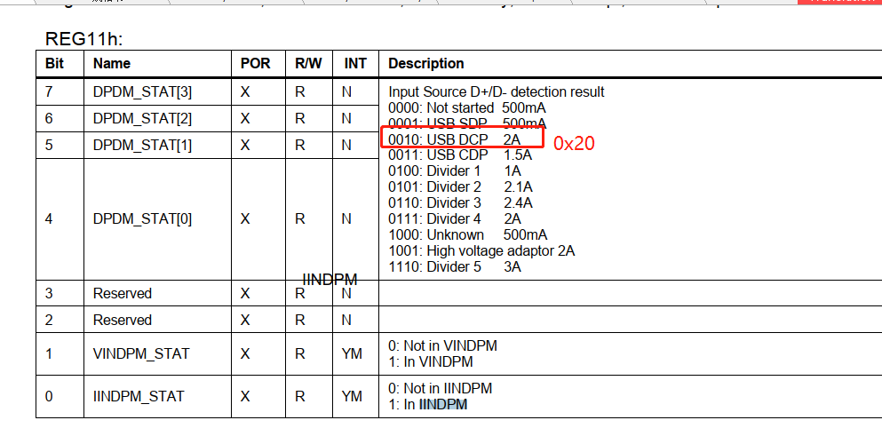

目前电脑限流是500ma，难道是它识别成2A的DCP，我不能限流？然后我把限流关闭，0x05/0x16寄存器值不乱写了，但还是会断开。

重大发现，发现断开前发生了一次VINDPM，查看0x12为0x74，表示`BATT>SYS_MIN`，这个是正常的，另外`Reg[0x11] = 0x22`表示发生了VINDPM：
```log
[ 1696.068999] mp2721 0-003f: chg_dump: CHG [online: 1, type: SDP, status: Charging, fault: 0x0, ICHG = 4000mA, AICR = 1900mA, MIVR = 4440mV, IEOC = 240mA, CV = 4350mV]
[ 1696.233390] mp2721_monitor_workfunc:VINDPM occurred

console:/sys/class/power_supply/usb # [ 1696.504802] Battery: [ status:Not charging, health:Good, present:1, tech:Li-ion, capcity:25,cap_rm:1272 mah, vol:3893 mv, temp:29, curr:1571 ma, ui_soc:15, notify_code: 0 ]
console:/sys/class/power_supply/usb # cat registers
Charger IC:
Reg[0x00] = 0x0b
Reg[0x01] = 0x13
Reg[0x02] = 0xf2
Reg[0x03] = 0xf4
Reg[0x04] = 0x97
Reg[0x05] = 0xde
Reg[0x06] = 0xac
Reg[0x07] = 0x0b
Reg[0x08] = 0x2f
Reg[0x09] = 0x53
Reg[0x0a] = 0x23
Reg[0x0b] = 0x10
Reg[0x0c] = 0x11
Reg[0x0d] = 0x60
Reg[0x0e] = 0x99
Reg[0x0f] = 0x00
Reg[0x10] = 0x44
Reg[0x11] = 0x22
Reg[0x12] = 0x74
Reg[0x13] = 0x60
Reg[0x14] = 0x00
Reg[0x15] = 0x00
Reg[0x16] = 0x00
```
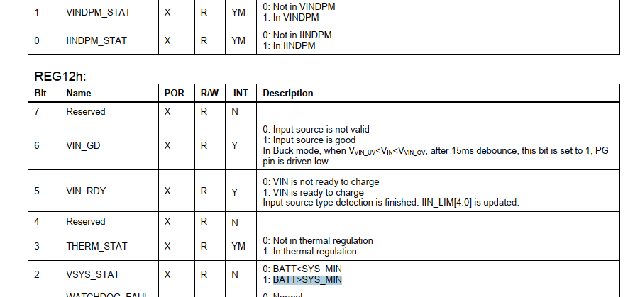

* sys_min由06寄存器设置，目前是`101: 3.675V`，在dts中设置的`vsys-min = <3675>;`：

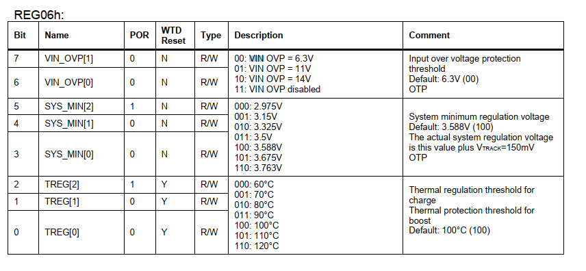

出现不充电时，量取以下为3.83v

* VIN_LIMT由04寄存器设置，目前是4360mv，在插入函数中也设置了一遍4440mv，在dts中设置的`input-voltage-limit = <4360>`：

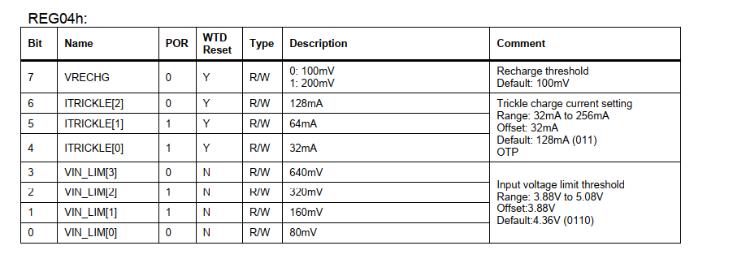

那什么情况会发生VINDPM呢？vbus<VIN_LIMT？

量取了charger端的vbus只有4.43v，太小了吧，难怪一打开powerpath就提示VINDPM。

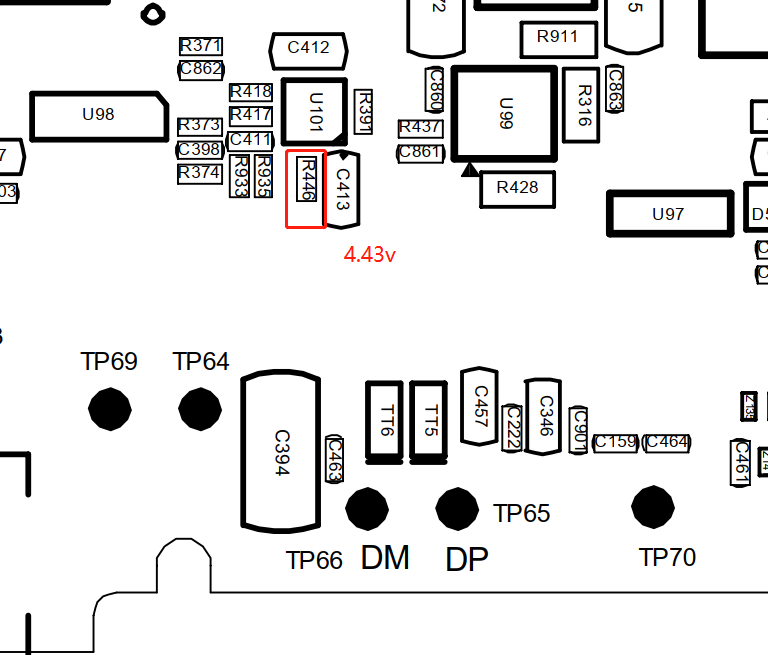

现在是两个问题：
* 1.为什么电脑识别成DCP，然后限流的话寄存器会乱，原理图charger的D+D-都是短接在一起的。

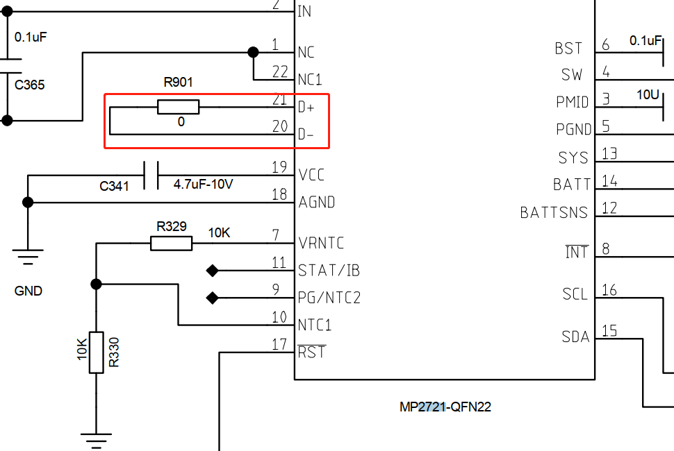

* 2.vbus太小，压降太大，如何解决？是因为电池线的阻值太大？拉低了电压？
解决方案：charger端到电池连接线要尽量短，将电池连接线搞短点，充电效率提升，量取vbus立马变成4.9v了。

寄存器乱的原因是硬件问题，目前发现charger/gauge这些i2c和camera串联在一起，读写受到严重干扰，需要分离：


### 0826 fae现场调试

我们出现关闭BUCK的情况在电脑上很容易复现，
* fae分析关闭BUCK原因有以下三点：
  * 1.过压，VIN发生OVP。
  * 2.欠压，VIN出现`In VINDPM`状态。
  * 3.过流，电流超过VIN_LIM设置。

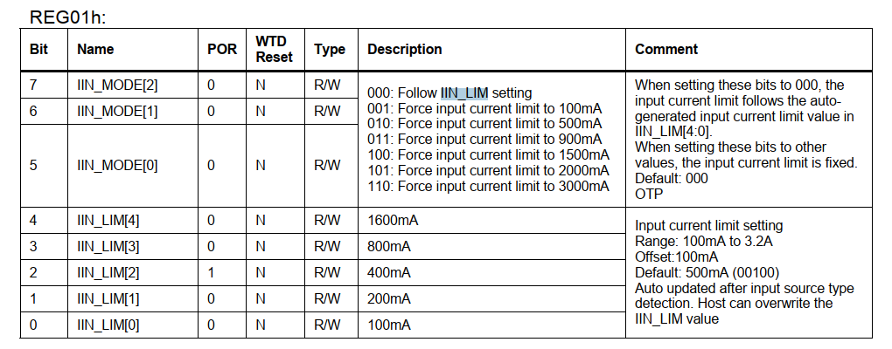
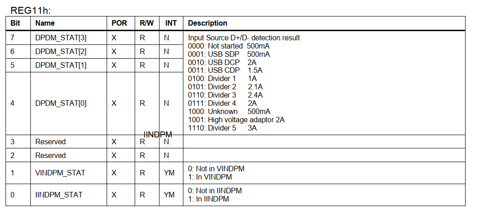

另外fae还提到关闭BUCK可以让休眠电流更小：

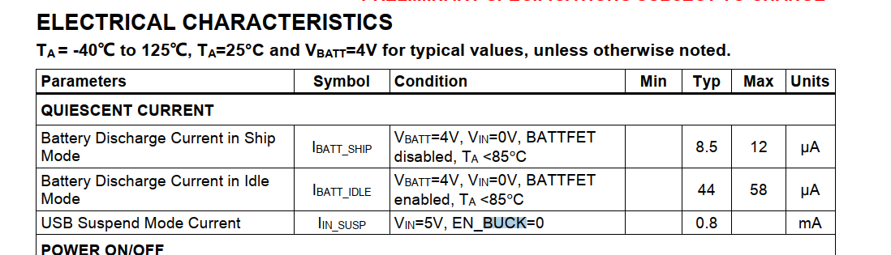

* 目前分析结论：
  * 第一点绝不会发生，因为电脑是5v的，用power-Z看完全没问题。
  * 第二点我们剪短了电池线之后，charger端的vbus从4.4v提高到了4.9v，所以也不会。
  * 第三点从来没有报错过，不过如果设置低了，比如接电脑，AICR设置的500ma，这时打开闪光灯容易出现过流IIN_LIM。

fae建议示波器查看IC Vbus和SW脚工作情况：
* Vbus情况如下，并没有VII_DPM产生，看上去都是正常的：


* SW脚接适配器如下，看上去也是正常的：


* SW脚接电脑如下，看上去不正常，高电平后有一段600ms左右的延迟才开始正弦波：


但是我们I2C代码是在完成bc1.2后就开始设置电流和打开充电功能，而且我们是先读取寄存器状态再写，如果读取出错了就完了,log如下，在enable_charger时如果刚好
是拔出状态，此时去读取09寄存器值为0，然后写1，那这时buck就被手动关闭了。
```C++
[  514.906840] pax_is_charger_on chr_type = 4
[  514.906848] PAX_CHG: _wake_up_charger:
[  514.908143] pax_is_charger_on chr_type = 4
[  514.912539] init: Untracked pid 9005 exited with status 0
[  514.915385] <  514.906>TCPC-TCPC:Alert:0x0002, Mask:0x230fff
[  514.917614] pd_tcp_notifier_call event = TYPEC_STATE
[  514.917617] tcpc_notifier_call, old_state = ATTACHED_SNK, new_state = UNATTACHED
[  514.917619] pd_tcp_notifier_call Charger plug out
[  514.917655] charger soc:charger: usb_dwork_handler Idle
[  514.917963] PAX_CHG: support_fast_charging = 0
[  514.917968] PAX_CHG: is_typec_adapter rp = 0 pd_type = 0
[  514.917974] PAX_CHG: chg:-1,-1,2000,500 type:4:0 usb_unlimited:0 usbif:0 usbsm:0 aicl:-1 atm:0 bm:0 b:1
[  514.917978] PAX_CHG: do_algorithm input_current_limit:2000 charging_current_limit:500
[  514.918277] PAX_CHG_MP2721: reg :1  read data:0x13
[  514.918453] PAX_CHG_MP2721: reg :1  write data:0x13
[  514.918739] PAX_CHG_MP2721: reg :2  read data:0x6
[  514.918913] PAX_CHG_MP2721: reg :2  write data:0x6
[  514.919199] PAX_CHG_MP2721: reg :5  read data:0x1f
[  514.922350] PAX_CHG: handle_typec_attach_dettach: ++ en:0
[  514.923676] PAX_CHG_MP2721: reg :5  write data:0x1f
[  514.925271] USB cable not connected
[  514.926409] android_work: sent uevent USB_STATE=DISCONNECTED
[  514.927108] ipa ipa3_cfg_ep_ctrl:4812 pipe setting delay is not supported
[  514.927636] PAX_CHG_MP2721: mp2721_irq_disable:
[  514.928433] mp2721 0-003f: mp2721_set_property() set charge_type:0, ret:0
[  514.928437] PAX_CHG_MP2721: mp2721_set_property() pd_status:0
[  514.928998] pd_tcp_notifier_call event = PD_STATE
[  514.929003] charger soc:charger: pd_tcp_notifier_call pd state = 0
[  514.948245] ///PD dbg info 392d
[  514.951988] mp2721_charger_irq_workfunc:mp2721 irq
[  514.956313] <  514.915>TCPC-TCPC:tcpci_alert_power_status_changed_v10 ++
[  514.956313] <  514.916>TCPC-TCPC:ps_change=1
[  514.956313] <  514.917>TCPC-TYPEC:** UnattachW
[  514.956316] ait.PE
[  514.956316] <  514.917>TCPC-TYPEC:Attached-> NULL
[  514.956316] <  514.917>TCPC-TCPC:usb_port_detached
[  514.956316] <  514.919>TCPC-PE:PD -> IDLE1 (CUN)
[  514.956316] <  514.
[  514.956321] 919>TCPC-PE:bist_test_mode=0
[  514.956321] <  514.920>TCPC-PE:PD -> IDLE2 (CUN)
[  514.956321] <  514.922>TCPC-PE:pd_state=0
[  514.956321] <  514.927>TCPC-TYPEC:** Unattached.SNK
[  514.962525] pd_tcp_notifier_call event = SINK_VBUS
[  514.970832] PAX_CHG_MP2721: reg :9  read data:0x0
[  514.972005] charger soc:charger: pd_tcp_notifier_call sink vbus 0mV 0mA type(0x00)
[  514.972113] charger fault = 73305
[  514.981457] husb311_set_low_power_mode - write HUSB311_REG_BMC_CTRL=0x7
[  514.985966] ///PD dbg info 292d
[  514.985972] <  514.961>TCPC-TCPC:sink_vbus: 0 mV, 0 mA
[  514.985972] <  514.961>TCPC-TCPC:source_vbus: 0 mV, 0 mA
[  514.985972] <  514.961>TCPC-TCPC:EXT-Discharge: 1
[  514.985972] <
[  514.985974]  514.961>TCPC-TCPC:wake_lock=0
[  514.985974] <  514.968>TCPC-TCPC:Alert:0x0001, Mask:0x210fff
[  514.985974] <  514.968>TCPC-TCPC:tcpci_alert_cc_changed ++
[  514.985974] <
[  514.985976]   514.969>TCPC-TYPEC:[CC_Alert] 0/5
[  514.989581] pd_tcp_notifier_call event = SOURCE_VBUS
[  514.992560] PAX_CHG_MP2721: reg :9  write data:0x1
```

目前发现plugin和select_current两处都有做`enable_charger`操作，而select_current这里要慢一些，快速拔插操作容易造成冲突，而没有usb插入09寄存器buck和chg是都关闭了的状态，如果刚好拔出的时候去enable charger，读取的肯定是0，所以select_current这里的操作要关闭。
```C++
没有usb插入09寄存器buck和chg都关闭了：
console:/sys/class/chg_info/mp2721 # cat registers
Charger IC:
Reg[0x00] = 0x0b
Reg[0x01] = 0x04
Reg[0x02] = 0xc1
Reg[0x03] = 0xf4
Reg[0x04] = 0xf6
Reg[0x05] = 0xdf
Reg[0x06] = 0xa4
Reg[0x07] = 0x0b
Reg[0x08] = 0x2f
Reg[0x09] = 0x50
```

* 解决方案：
```diff
--- a/UM.9.15/kernel/msm-4.19/drivers/misc/pax/power/pax_algorithm_charger.c
+++ b/UM.9.15/kernel/msm-4.19/drivers/misc/pax/power/pax_algorithm_charger.c

@@ -344,8 +353,8 @@ static int do_algorithm(struct pax_charger *info)
                if (pdata->input_current_limit == 0 ||
                                pdata->charging_current_limit == 0)
                        pax_charger_dev_enable(info->chg1_dev, false);
-               else
-                       pax_charger_dev_enable(info->chg1_dev, true);
+               //else
+               //      pax_charger_dev_enable(info->chg1_dev, true);
        }

```

寄存器乱了，具体不知道什么原因，比如05寄存器，放在那里充电不动自动变了：
```C++
[ 2133.353704] PAX_CHG: chg:-1,-1,2000,500 type:4:0 usb_unlimited:0 usbif:0 usbsm:0 aicl:-1 atm:0 bm:0 b:1
[ 2133.363551] PAX_CHG: do_algorithm input_current_limit:2000 charging_current_limit:500
[ 2133.372015] PAX_CHG_MP2721: reg :1  read data:0x13
[ 2133.377342] PAX_CHG_MP2721: reg :1  write data:0x13
[ 2133.383144] PAX_CHG_MP2721: reg :2  read data:0xc6
[ 2133.389030] PAX_CHG_MP2721: reg :2  write data:0xc6
[ 2133.395067] PAX_CHG_MP2721: reg :5  read data:0xdf
[ 2133.400205] PAX_CHG_MP2721: reg :5  write data:0xdf
[ 2133.408187] chg_dump: CHG [online: 1, type: SDP, status: Charging, fault: 0x0, ICHG = 480mA, AICR = 2000mA, MIVR = 4360mV, IEOC = 240mA, CV = 4375mV]
[ 2133.421738] PAX_CHG: charger_routine_thread end , 0
[ 2138.342269] pax_charger_alarm_timer_func: not suspend, wake up charger
[ 2138.348857] PAX_CHG: _wake_up_charger:
[ 2138.353155] pax_is_charger_on chr_type = 4
[ 2138.358363] PAX_CHG: support_fast_charging = 0
[ 2138.363033] PAX_CHG: is_typec_adapter rp = 500 pd_type = 0
[ 2138.368837] PAX_CHG: chg:-1,-1,2000,500 type:4:0 usb_unlimited:0 usbif:0 usbsm:0 aicl:-1 atm:0 bm:0 b:1
[ 2138.378690] PAX_CHG: do_algorithm input_current_limit:2000 charging_current_limit:500
[ 2138.393598] PAX_CHG_MP2721: reg :1  read data:0xf4
[ 2138.399601] PAX_CHG_MP2721: reg :1  write data:0x13
[ 2138.415108] PAX_CHG_MP2721: reg :2  read data:0xf6
[ 2138.423285] PAX_CHG_MP2721: reg :2  write data:0xc6
[ 2138.431435] PAX_CHG_MP2721: reg :5  read data:0xb
[ 2138.437692] PAX_CHG_MP2721: reg :5  write data:0x1f
```

目前解决方案是直接写死：
```C++
static int mp2721_set_cv(struct charger_device *chg_dev, u32 volt)
{
	u8 val, ret;

	val = (volt - MP2721_VBATTREG_BASE)/MP2721_VBATTREG_LSB;

	switch (g_mp2721_info->cfg.max_topoff_time) {
	case 15:
		val |= (MP2721_TOPOFF_TIMER_15HOURS << MP2721_TOPOFF_TIMER_SHIFT);
		break ;
	case 30:
		val |= (MP2721_TOPOFF_TIMER_30HOURS << MP2721_TOPOFF_TIMER_SHIFT);
		break ;
	case 45:
		val |= (MP2721_TOPOFF_TIMER_45HOURS << MP2721_TOPOFF_TIMER_SHIFT);
		break ;
	default:
		val |= (MP2721_TOPOFF_TIMER_30HOURS << MP2721_TOPOFF_TIMER_SHIFT);
		break ;
	}
	pm_stay_awake(g_mp2721_info->dev);
	mutex_lock(&g_mp2721_info->mp2721_i2c_lock);

	ret = mp2721_write_byte( MP2721_REG_05, val);
	chr_mp2721_info("reg :%d  write data:0x%x\n", MP2721_REG_05, val);

	mutex_unlock(&g_mp2721_info->mp2721_i2c_lock);
	pm_relax(g_mp2721_info->dev);

	return ret;
}
```

## 14.刚开机疯狂进入中断，且发送VPDM

刚开机发现`Reg[0x11] = 0x22`，也就是输入电压太低触发了`VINDPM occurred`，我们ICC电池电流设置的是4A，貌似太大了，设置成480ma试试。
```log
[    3.557103] PAX_CHG_MP2721: ==_set_input_vol_limit, mivr=4360 mV
[    3.563323] PAX_CHG_MP2721: reg :4  write data:0xf6
[    3.569181] _enable_vbus_ovp en:0
[    3.574211] PAX_CHG_MP2721: mp2721_info Reg[0x00] = 0x0b
[    3.579841] PAX_CHG_MP2721: mp2721_info Reg[0x01] = 0x13
[    3.585471] PAX_CHG_MP2721: mp2721_info Reg[0x02] = 0xe5
[    3.591118] PAX_CHG_MP2721: mp2721_info Reg[0x03] = 0xa7
[    3.596747] PAX_CHG_MP2721: mp2721_info Reg[0x04] = 0xf6
[    3.602374] PAX_CHG_MP2721: mp2721_info Reg[0x05] = 0x1e
[    3.608003] PAX_CHG_MP2721: mp2721_info Reg[0x06] = 0xa4
[    3.613647] PAX_CHG_MP2721: mp2721_info Reg[0x07] = 0x0b
[    3.619275] PAX_CHG_MP2721: mp2721_info Reg[0x08] = 0x2f
[    3.624905] PAX_CHG_MP2721: mp2721_info Reg[0x09] = 0x53
[    3.630535] PAX_CHG_MP2721: mp2721_info Reg[0x0a] = 0x23
[    3.636176] PAX_CHG_MP2721: mp2721_info Reg[0x0b] = 0x10
[    3.641807] PAX_CHG_MP2721: mp2721_info Reg[0x0c] = 0x11
[    3.647436] PAX_CHG_MP2721: mp2721_info Reg[0x0d] = 0x60
[    3.653079] PAX_CHG_MP2721: mp2721_info Reg[0x0e] = 0x99
[    3.658708] PAX_CHG_MP2721: mp2721_info Reg[0x0f] = 0x00
[    3.664339] PAX_CHG_MP2721: mp2721_info Reg[0x10] = 0x44
[    3.669981] PAX_CHG_MP2721: mp2721_info Reg[0x11] = 0x22
[    3.675616] PAX_CHG_MP2721: mp2721_info Reg[0x12] = 0x74
[    3.681246] PAX_CHG_MP2721: mp2721_info Reg[0x13] = 0x60
[    3.686876] PAX_CHG_MP2721: mp2721_info Reg[0x14] = 0x00
[    3.692519] PAX_CHG_MP2721: mp2721_info Reg[0x15] = 0x00
[    3.698149] PAX_CHG_MP2721: mp2721_info Reg[0x16] = 0x00
[    3.704344] PAX_CHG_MP2721: mp2721_charger_probe:irq = 195
[    3.705608] PAX_CHG_MP2721: mp2721_irq_disable:
[    3.710413] bq27z746_i2c_probe enter
[    3.714464] PAX_CHG_MP2721: mp2721_charger_irq_workfunc:mp2721 irq
[    3.721200] bq27z746_i2c_probe enter
[    3.725449] PAX_CHG_MP2721: mp2721_irq_enable:
[    3.727984] pax_battery_device_register: name=bq27z746
[    3.732355] PAX_CHG_MP2721: mp2721_irq_disable:
[    3.737621] [PAX_CHG] bq27z746_i2c_probe: success
[    3.742058] PAX_CHG_MP2721: mp2721_charger_irq_workfunc:mp2721 irq
[    3.746959] aws5480_i2c_probe enter
[    3.754186] PAX_CHG_MP2721: mp2721_irq_enable:
[    3.756824] [PAX_AUDIO_SWITCH]:aws5480_reg_read_byte_data read reg: 0 data: 09
[    3.761016] PAX_CHG_MP2721: mp2721_irq_disable:
[    3.768258] device type: 0x9
[    3.772811] PAX_CHG_MP2721: mp2721_charger_irq_workfunc:mp2721 irq
[    3.775700] aws5480_i2c_probe enter
[    3.783078] PAX_CHG_MP2721: mp2721_irq_enable:
[    3.785496] [PAX_AUDIO_SWITCH] aws5480_i2c_probe: success
[    3.789967] PAX_CHG_MP2721: mp2721_irq_disable:
[    3.796075] i2c_geni 4a88000.i2c: Bus frequency is set to 400000Hz
[    3.799874] PAX_CHG_MP2721: mp2721_charger_irq_workfunc:mp2721 irq
[    3.813365] PAX_CHG_MP2721: mp2721_irq_enable:
[    3.815704] Couldn't parse device tree rc=-517
```

修改如下：
```diff
diff --git a/UM.9.15/vendor/qcom/proprietary/devicetree-4.19/qcom/a6650/a6650-scuba-iot-idp-overlay.dts b/UM.9.15/vendor/qcom/proprietary/devicetree-4.19/qcom/a6650/a6650-scuba-iot-idp-overlay.dts
index 692edd65080..24cebade8a7 100755
--- a/UM.9.15/vendor/qcom/proprietary/devicetree-4.19/qcom/a6650/a6650-scuba-iot-idp-overlay.dts
+++ b/UM.9.15/vendor/qcom/proprietary/devicetree-4.19/qcom/a6650/a6650-scuba-iot-idp-overlay.dts
@@ -316,8 +316,8 @@
                pinctrl-0 = <&charge_interrupt_pincfg>;
                charger_name = "primary_chg";
                /* charge ic default paramter */
-               charge-voltage = <4370>;                                /* Battery Regulation Voltage, Range from 3.6V to 4.6V, Offset: 3.6V Default: 4.2V*/
-               charge-current = <4000>;                                /* Battery Fast charge current setting Default: 2A*/
+               charge-voltage = <4350>;                                /* Battery Regulation Voltage, Range from 3.6V to 4.6V, Offset: 3.6V Default: 4.2V*/
+               charge-current = <480>;                                 /* Battery Fast charge current setting Default: 2A*/
```

完美解决，修改完成后开机过程只出现了一次中断打印：

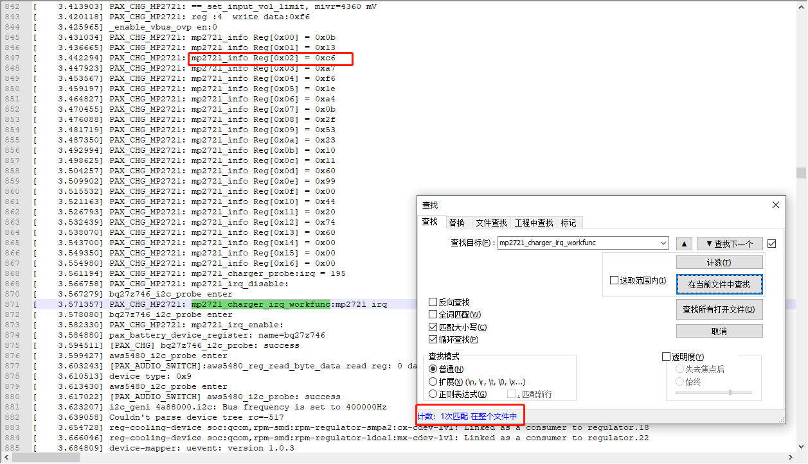

## 15.系统无法休眠

* 报错如下：
```shell
09-30 03:48:17.826   483   492 E android.system.suspend@1.0-service: Error opening kernel wakelock stats for: wakeup41: Permission denied
09-30 03:48:17.819   483   483 W Binder:483_2: type=1400 audit(0.0:52): avc: denied { read } for name="wakeup41" dev="sysfs" ino=44877 scontext=u:r:system_suspend:s0 tcontext=u:object_r:vendor_sysfs_battery_supply:s0 tclass=dir permissive=0
09-30 03:48:17.823   483   483 W Binder:483_2: type=1400 audit(0.0:53): avc: denied { read } for name="wakeup31" dev="sysfs" ino=44139 scontext=u:r:system_suspend:s0 tcontext=u:object_r:vendor_sysfs_usb_supply:s0 tclass=dir permissive=0
09-30 03:48:17.827   483   492 E android.system.suspend@1.0-service: Error opening kernel wakelock stats for: wakeup31: Permission denied
09-30 03:48:33.539   483   483 W Binder:483_2: type=1400 audit(0.0:54): avc: denied { read } for name="wakeup41" dev="sysfs" ino=44877 scontext=u:r:system_suspend:s0 tcontext=u:object_r:vendor_sysfs_battery_supply:s0 tclass=dir permissive=0
09-30 03:48:33.542   483   492 E android.system.suspend@1.0-service: Error opening kernel wakelock stats for: wakeup41: Permission denied
09-30 03:48:33.544   483   492 E android.system.suspend@1.0-service: Error opening kernel wakelock stats for: wakeup31: Permission denied
```

* 增加权限如下：
```
allow system_suspend vendor_sysfs_usb_supply:dir { read open };
allow system_suspend vendor_sysfs_battery_supply:dir { read open };
allow system_suspend vendor_sysfs_battery_supply:file { read open getattr };
allow system_suspend vendor_sysfs_usb_supply:file { read open getattr };
```

## 16.充电过程偶发性online状态变为0

healthd会周期性的读取charger的online状态，目前使用0x12寄存器的`VIN_READY`和`VIN_GOOD`作为online状态上报，正常充电过程偶发性online状态变为0，打印如下：
```
[ 9587.718781] PAX_CHG: reg :19  read data:0x4
[ 9587.725189] PAX_CHG: reg :18  read data:0x1
[ 9587.729473] PAX_CHG: CHG [online: 1, type: DCP, status: Charging, fault: 0x0, ICHG = 4160mA, AICR = 2000mA, MIVR = 4360mV, IEOC = 240mA, CV = 4350mV]
[ 9592.297240] PAX_CHG: reg :17  read data:0x0
[ 9592.558891] PAX_CHG: reg :1  read data:0xa7
[ 9592.570196] PAX_CHG: reg :18  read data:0x0
[ 9592.574668] PAX_BMS:bms_info_update clear NC_DISABLE_CHG_BY_USER flag
[ 9592.587299] PAX_CHG: Battery: [ status:Charging, health:Good, present:1, tech:Li-ion, capcity:100,cap_rm:4992 mah, vol:4331 mv, temp:32, curr:393 ma, ui_soc:100 ]
[ 9592.590094] PAX_BMS: CHG [online: 0, type: 5, vol: 5000000, cur: 16800000, time: 8643], BAT [present: 1, status: 1, vol: 4331000, cur: 393000, resistance: 0, temp: 320, soc: 99], OTHER [skin_temp: 0, chg_vote: 0x0, notify_code: 0x0],
[ 9592.606761] PAX_CHG: reg :18  read data:0x1
[ 9592.627644] PAX_CHG: reg :1  read data:0x13
[ 9592.633466] PAX_CHG: reg :18  read data:0x1
[ 9592.638089] PAX_CHG: reg :1  read data:0x13
[ 9592.644875] PAX_CHG: _wake_up_charger:
[ 9592.648768] PAX_CHG: pax_is_charger_on chr_type = [DCP] last_chr_type = [DCP]
[ 9592.665917] PAX_CHG: [SW_JEITA] Battery Normal Temperature between 15 and 45 !!
[ 9592.673742] PAX_CHG: [SW_JEITA]preState:3 newState:3 tmp:32 cv:0
[ 9592.679949] PAX_CHG: tmp:32 (jeita:1 sm:3 cv:0 en:1) thm_sm:1 en:1 can_en:1
[ 9592.687856] PAX_CHG: reg :19  read data:0x4
[ 9592.692156] PAX_CHG: chg:-1,-1,2000,4160 type:5:6 aicl:-1 bootmode:0 pd:1
[ 9592.698993] PAX_CHG: pax_charger_update, delay<30>
[ 9592.703822] PAX_CHG: do_algorithm input_current_limit:2000 charging_current_limit:4160
[ 9592.716386] PAX_CHG: reg :2  read data:0x34
[ 9592.721370] PAX_CHG: reg :1  read data:0x13
[ 9592.726244] PAX_CHG: reg :3  read data:0x7
[ 9592.731999] PAX_CHG: reg :4  read data:0x6
[ 9592.737734] PAX_CHG: reg :18  read data:0x1
[ 9592.742911] PAX_CHG: reg :19  read data:0x4
[ 9592.747859] PAX_CHG: reg :5  read data:0x1e
[ 9592.753548] PAX_CHG: reg :19  read data:0x4
[ 9592.759285] PAX_CHG: reg :18  read data:0x1
[ 9592.770881] PAX_CHG: reg :18  read data:0x0
[ 9592.775213] PAX_CHG: CHG [online: 0, type: DCP, status: Charging, fault: 0x0, ICHG = 4160mA, AICR = 2000mA, MIVR = 4360mV, IEOC = 240mA, CV = 4350mV]
[ 9592.776812] PAX_CHG: reg :18  read data:0x0
[ 9592.798955] PAX_CHG: reg :18  read data:0x0
[ 9592.904710] PAX_CHG: Battery: [ status:Charging, health:Good, present:1, tech:Li-ion, capcity:100,cap_rm:4992 mah, vol:4331 mv, temp:32, curr:393 ma, ui_soc:100 ]
[ 9592.919331] PAX_CHG: pax_battery_external_power_changed event, online:1, status:1, cur_chr_type:5
[ 9592.928369] PAX_BMS:bms_wakeup
[ 9592.936667] PAX_CHG: reg :19  read data:0x4
[ 9592.941354] PAX_CHG: reg :18  read data:0x1
[ 9592.945737] PAX_BMS:pax_bms_external_power_changed online = 1
[ 9592.945996] PAX_CHG: reg :1  read data:0x13
[ 9592.970563] PAX_CHG: reg :18  read data:0x1
[ 9592.977977] PAX_CHG: reg :18  read data:0x0
[ 9592.978803] PAX_BMS: CHG [online: 1, type: 5, vol: 5000000, cur: 2000000, time: 8643], BAT [present: 1, status: 1, vol: 4331000, cur: 393000, resistance: 0, temp: 320, soc: 100], OTHER [skin_temp: 0, chg_vote: 0x0, notify_code: 0x0],
[ 9593.003589] PAX_CHG: reg :18  read data:0x1
[ 9593.008738] PAX_CHG: reg :18  read data:0x1
[ 9593.013878] PAX_CHG: reg :18  read data:0x1
[ 9593.019134] PAX_CHG: reg :1  read data:0x13
[ 9593.052298] PAX_CHG: reg :19  read data:0x4
[ 9593.057877] PAX_CHG: reg :1  read data:0x13
[ 9593.064422] PAX_CHG: reg :1  read data:0x13
[ 9593.073285] PAX_CHG: reg :18  read data:0x1
[ 9593.084352] PAX_CHG: reg :1  read data:0x13
[ 9593.092224] PAX_CHG: reg :18  read data:0x1
[ 9593.098341] PAX_CHG: reg :1  read data:0x13
[ 9593.359185] ext_spk_switch_put: set Ext_Spk_Switch val 1
[ 9593.381195] msm_pcm_chmap_ctl_put: substream ref_count:0 invalid
[ 9593.417533] send_afe_cal_type: No cal sent for cal_index 0, port_id = 0xb030! ret -22
USB
```

fae怀疑是charger输入端vbus电压由跳变，因为VIN_GD状态就是根据vbus状态来的，`VIN_UV < VIN <VIN_OV`如下：

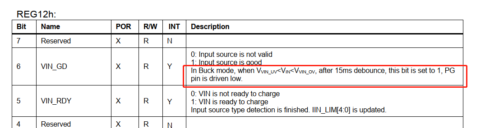

VIN_UV和VIN_OV对应关系如下：

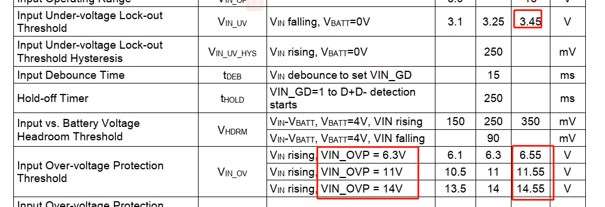

用示波器看并没有跳变，不知道什么原因，由于VIN_RD和VIN_GD状态不稳定，charger online属性改为读取DPDM_STAT状态，修改如下：
```diff
--- a/UM.9.15/kernel/msm-4.19/drivers/misc/pax/power/mp2721_charger.c
+++ b/UM.9.15/kernel/msm-4.19/drivers/misc/pax/power/mp2721_charger.c

+/**********Reg11**********/
+
+static int _is_charger_present(void)
+{
+       u8 status = 0, ret = 0;
+
+       ret = mp2721_get_byte_interface(MP2721_REG_11, MP2721_VIN_STAT_MASK, MP2721_VIN_STAT_SHIFT, &status);
+       if (ret)
+               return -1;
+
+       chr_debug("%s:status:%d\n", __func__, status);
+       return !!status;
+}
+
@@ -1022,7 +1038,7 @@ static int mp2721_is_charge_online(struct charger_device *chg_dev)
 {
        u8 ret;

-       ret = _is_vin_ready();
+       ret = _is_charger_present();
        return ret;
 }
```

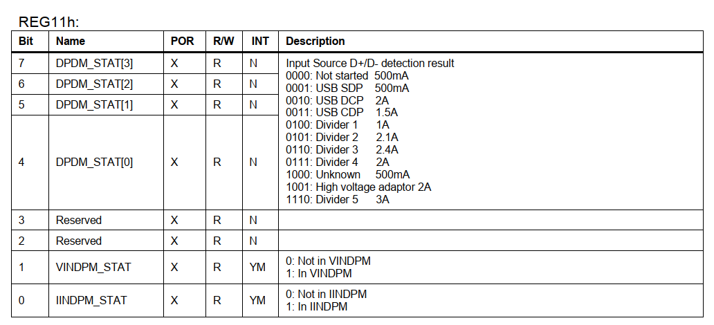