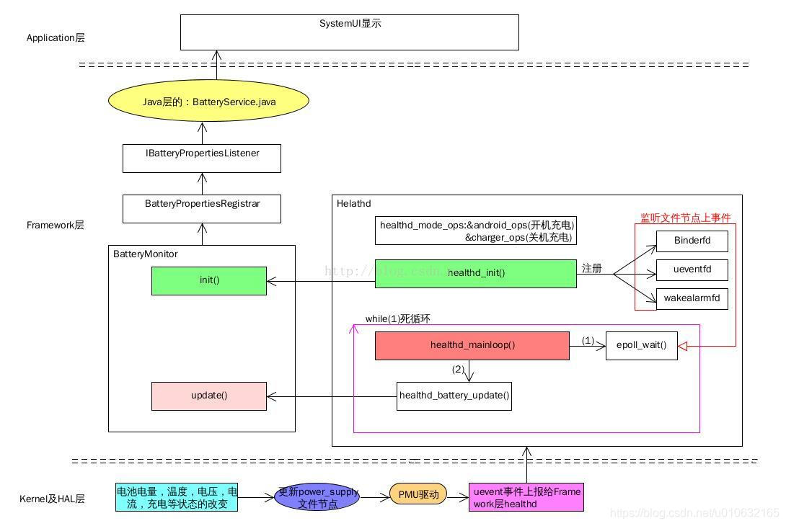

# 概述

高通A6650 healthd 守护进程分析。 

Android 9 引入了从 health@1.0 HAL 升级的主要版本 android.hardware.health HAL 2.0。这一新 HAL 具有以下优势：

* 框架代码和供应商代码之间的区别更清楚。
* 弃用了不必要的 healthd 守护程序。
* 供应商对运行状况信息报告进行自定义的自由度更高。
* 更多设备运行状况信息（不仅包括电池信息）。

Android 11 包含 android.hardware.health HAL 2.1，这是一个从 health@2.0 HAL 升级的次要版本。这一新 HAL 具有以下优势：

* 更易于实现
* 更好地与现有 2.0 HAL API 保持一致
* 在关机模式充电代码中可以实现更好的 Treble 分离
* 更好地支持框架来指示设备的电池运行状况

在 Android 11 中，所有healthd代码都被重构为libhealthloop和libhealth2impl ，然后进行修改以实现 health@2.1 HAL。
这两个库由health@2.0-impl-2.1静态链接，health@2.0-impl-2.1 是 health 2.1 的直通实现。静态链接库使health@2.0-impl-2.1能够执行与healthd相同的工作，例如运行healthd_mainloop和轮询。在 init 中， health@2.1-service将接口IHealth的实现注册到hwservicemanager 。升级具有 Android 8.x 或 9 供应商映像和 Android 11 框架的设备时，供应商映像可能不提供 health@2.1 服务。


# Android弃用health@1.0 HIDL

Framework 将继续使用health@1.0直到按标准HAL弃用计划完全弃用为止 。当health@1.0被弃用（条目从 框架兼容性矩阵除去）， healthd和libbatterymonitor必须也系统中除去，以避免未知的healthd行为。由于health@1.0是一个可选的HAL，并且所有 healthd对health@1.0的依赖都受到NULL检查的保护，因此在弃用时不应该中断。

当Android删除旧代码路径（healthd，health@1.0）时，按弃用计划Health@1.0 HAL将被弃用。此外，Android还删除了以下内容：

* Framework 中的healthd依赖
* healthd
* 系统中 health@1.0的HAL定义库
* Framework 兼容性矩阵中的health@1.0条目

移除healthd
对于运行Android 9的设备和升级到Android 9且在新vendor镜像中提供Health 2.0 HAL的设备，我们建议从系统镜像中删除healthd以节省磁盘空间并加快启动时间。

使用Android 9启动的设备必须提供2.0 HAL（并且不得提供1.0 HAL）。未使用Android 9启动但计划更新供应商映像为Target Framework Compatibility Matrix Version 3（在Android 9中发布）的设备必须删除现有的1.0 HAL实现并提供2.0 HAL。

AOSP包含多个帮助库，旨在帮助您实现2.0 HAL和从旧的1.0 HAL过渡。

# 术语

* health@1.0：android.hardware.health@1.0 的缩写。指的是 Android 8.0 中发布的运行状况 HIDL 的 1.0 版 HAL。
* health@2.0：android.hardware.health@2.0 的缩写。指的是 Android 9 中发布的运行状况 HIDL 的 2.0 版 HAL。
* health@2.1：android.hardware.health@2.1 的缩写。指的是 Android 11 中发布的运行状况 HIDL 的 2.1 版 HAL。
* charger：在关机模式充电过程中运行的可执行文件，用于显示手机充电动画。
* recovery：在恢复模式下运行的可执行文件，必须检索电池信息。
* healthd：在 Android 中运行的旧版守护进程，用于检索与运行状况相关的信息并将其提供给框架。
* storaged：在 Android 中运行的守护进程，用于检索存储信息并将其提供给框架。

# 参考

* [Android 运行状况](https://source.android.com/devices/tech/health?hl=zh-cn)
* [Android 电池管理系统架构总结 Android power and battery management architecture summaries](https://blog.csdn.net/u010632165/article/details/88651035)
* [Android Uevent 分析，从kernel到framework](https://blog.csdn.net/dfysy/article/details/7330919)
* [Google 实现 Health 2.1 ](https://source.android.com/docs/core/health/implementation-2-1)
* [power supply是如何上报电池信息的](https://cloud.tencent.com/developer/article/1847402)

# 软件架构


可以看到文件比较多，主要是通过`BatteryMonitor.cpp`中的`BatteryMonitor::update(void)`函数上报信息，其中，内核首先会更新数据到`/sys/class/power_supply/battery`节点下各个属性，这个在上一个小节有做解释，先来看一下整体的架构，后面再来深入到代码中去分析；具体图片（该图片来自互联网，因为被转载较多，已经不知道出处），具体的流程整理的很清楚，如下所示；



这幅图片再一次把整体的数据走向具体化，可以看到主要负责工作的是BatteryMonitor，主要分析一下该文件中的init和update就可以搞清楚大部分的问题。

# 涉及文件

* 编译文件
```shell
./vendor/lib64/hw/android.hardware.health@2.0-impl-2.1-qti.so
./vendor/lib64/libsystem_health_mon.so
./vendor/etc/vintf/manifest/android.hardware.health@2.1.xml
./vendor/etc/init/android.hardware.health@2.1-service.rc
./vendor/bin/hw/android.hardware.health@2.1-service
```

* healthd涉及文件：
```shell
 system/core/healthd：
.
├── Android.bp
├── android.hardware.health@2.0-service.rc
├── Android.mk
├── animation.h
├── AnimationParser.cpp
├── AnimationParser.h
├── api
│   ├── charger_sysprop-current.txt
│   └── charger_sysprop-latest.txt
├── BatteryMonitor.cpp
├── charger.cpp
├── charger.sysprop
├── charger_test.cpp
├── charger_utils.cpp
├── charger_utils.h
├── healthd_draw.cpp
├── healthd_draw.h
├── healthd_mode_charger.cpp
├── healthd_mode_charger.h
├── healthd_mode_charger_nops.cpp
├── healthd_mode_charger_nops.h
├── healthd.rc
├── HealthServiceDefault.cpp
├── HealthServiceHealthd.cpp
├── images
│   ├── battery_fail.png
│   └── battery_scale.png
├── include
│   └── healthd
│       ├── BatteryMonitor.h
│       └── healthd.h
├── manifest_healthd.xml
├── OWNERS
└── tests
    ├── Android.mk
    └── AnimationParser_test.cpp
```

* HIDL涉及文件：
```
hardware/interfaces/health：
├── 2.1
│   ├── Android.bp
│   ├── default
│   │   ├── Android.bp
│   │   ├── android.hardware.health@2.1-service.rc
│   │   ├── android.hardware.health@2.1.xml
│   │   ├── impl.cpp
│   │   └── service.cpp
│   ├── IHealth.hal
│   ├── IHealthInfoCallback.hal
│   ├── README.md
│   ├── types.hal
│   └── vts
│       ├── functional
│       │   ├── Android.bp
│       │   └── VtsHalHealthV2_1TargetTest.cpp
│       └── OWNERS
├── storage
│   └── 1.0
│       ├── Android.bp
│       ├── default
│       │   ├── Android.bp
│       │   ├── android.hardware.health.storage@1.0-service.rc
│       │   ├── manifest_android.hardware.health.storage@1.0.xml
│       │   ├── service.cpp
│       │   ├── Storage.cpp
│       │   └── Storage.h
│       ├── IGarbageCollectCallback.hal
│       ├── IStorage.hal
│       ├── types.hal
│       └── vts
│           └── functional
│               ├── Android.bp
│               ├── VtsHalHealthStorageV1_0TargetTest.config
│               └── VtsHalHealthStorageV1_0TargetTest.cpp
└── utils
    ├── libhealth2impl
    │   ├── Android.bp
    │   ├── BinderHealth.cpp
    │   ├── HalHealthLoop.cpp
    │   ├── Health.cpp
    │   └── include
    │       └── health2impl
    │           ├── BinderHealth.h
    │           ├── Callback.h
    │           ├── HalHealthLoop.h
    │           └── Health.h
    └── libhealthloop
        ├── Android.bp
        ├── HealthLoop.cpp
        ├── include
        │   └── health
        │       ├── HealthLoop.h
        │       └── utils.h
        └── utils.cpp
```

* `system/core/healthd/Android.bp`health编译了一个可执行文件`charger`，该程序用于关机充电模式：
```shell
cc_binary {
    name: "charger",
    defaults: ["charger_defaults"],
    recovery_available: true,
    srcs: [
        "charger.cpp",
        "charger_utils.cpp",
    ],

    target: {
        recovery: {
            // No UI and libsuspend for recovery charger.
            cflags: [
                "-DCHARGER_FORCE_NO_UI=1",
            ],
            exclude_shared_libs: [
                "libpng",
            ],
            exclude_static_libs: [
                "libhealthd_draw",
                "libhealthd_charger",
                "libminui",
                "libsuspend",
            ],
        }
    }
}
```

# 软件流程

由于uevent机制仅将一个简单的字符串传递给了用户空间，而安卓系统建立在kernel之上，需要思考如何将设备属性的变化值及时更新到用户空间，于是就有了healthd服务，healthd目前已经更新到了2.1版本，其主要工作通过epoll_wait来监听kernel中的uevent事件。具体的函数调用流程图如下：


# HIDL服务注册

* `hardware/interfaces/health/2.0/README`我们可以从以下得知2.0下是改为实施 2.1 HAL:
```
# Implement the 2.1 HAL instead!

It is strongly recommended that you implement the 2.1 HAL directly. See
`hardware/interfaces/health/2.1/README.md` for more details.

强烈建议您直接实现 2.1 HAL。 看`hardware/interfaces/health/2.1/README.md`了解更多详情。
```

查看package情况：
```shell
device/qcom/vendor-common/base.mk
1103:PRODUCT_PACKAGES += android.hardware.health@2.1-impl-qti
1104:PRODUCT_PACKAGES += android.hardware.health@2.1-service
```

* `\hardware\interfaces\health\2.1\default\service.cpp`通过`new BinderHealth`创建HIDL binder服务:
```C++
using IHealth_2_0 = ::android::hardware::health::V2_0::IHealth;

static constexpr const char* gInstanceName = "default";

int main(int /* argc */, char* /* argv */[]) {
    sp<IHealth> passthrough =
            IHealth::castFrom(IHealth_2_0::getService(gInstanceName, true /* getStub */));
    CHECK(passthrough != nullptr)
            << "Cannot find passthrough implementation of health 2.1 HAL for instance "
            << gInstanceName;
    sp<BinderHealth> binder = new BinderHealth(gInstanceName, passthrough);
    return binder->StartLoop();
}
```

* 绑定模式的服务通过`registerAsService`接口实现，代码流程:
```C++
hardware\interfaces\health\2.1\default\service.cpp
StartLoop()
 
hardware\interfaces\health\utils\libhealthloop\HealthLoop.cpp
StartLoop()  >InitInternal()  >   Init(&healthd_config_)
 
hardware\interfaces\health\utils\libhealth2impl\BinderHealth.cpp
Init(struct healthd_config* config) > CHECK_EQ(registerAsService(instance_name()), android::OK)
```

到这里从log上看就打开一个android.hardware.health@2.1-service服务了。


* ` ps -A | grep health`:
```
A6650:/ # ps -A | grep health
system         646     1 12978784  3608 do_epoll_wait       0 S android.hardware.health@2.1-service
```