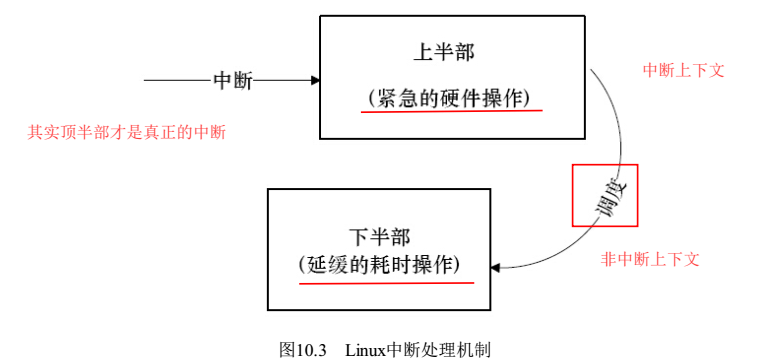
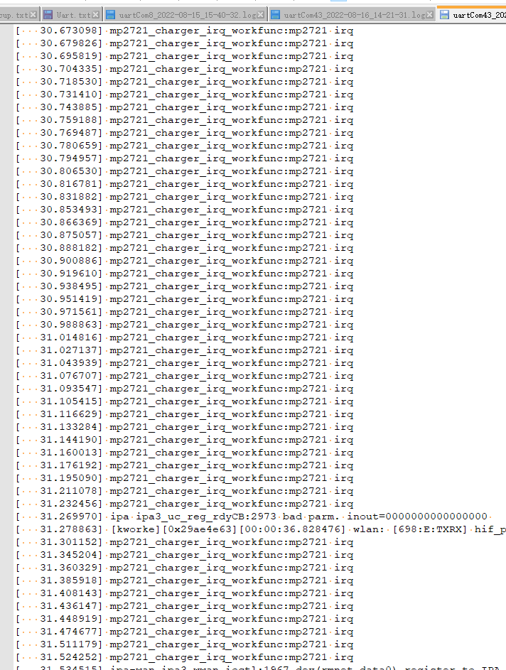

# 概述

目前charger由于插电脑未限制充电电流，开机过程中插usb会频繁进入中断，而且容易导致死机。

# 参考

* [Linux Kernel编程 --- 设备驱动中的并发控制](https://blog.csdn.net/u010961173/article/details/90664584)
* [48253621 下半部和下半部执行的工作--工作队列](https://blog.csdn.net/hongbochen1223/article/details/48253621%20下半部和下半部执行的工作--工作队列)
* [中断与抢占 #10](https://github.com/leon0625/blog/issues/10)

# 中断原理

中断会打断内核的正常进程调度，所以尽量短小精悍。不过实际系统，中断中要的事又比较多。 为了解决这一矛盾，Linux把中断分为两部分：

* 顶半部，top half，紧急且量小任务，一般为读取寄存器中的中断状态，并清除中断标记。总之，完成必要的硬件操作。处于中断上下文，可会被打断。
* 底半部，bottom half，完成主要任务，非中断上下文，可以被打断。


注:不一定所有的中断都分两部分，如果要干的事很少，完全可以不要底半部。

linux查看中断统计信息的方法：cat /proc/interrupts文件

# 中断代码

代码是参考
```C++
static int mp2721_charger_probe(struct i2c_client *client,
				 const struct i2c_device_id *id)
{
	ret = gpio_request(mp2721_info->irq_pin, "mp2721_info irq pin");
	if (ret) {
		chr_mp2721_err("%s: %d gpio request failed\n", __func__, mp2721_info->irq_pin);
		goto probe_fail_0;
	}
	gpio_direction_input(mp2721_info->irq_pin);

	irqn = gpio_to_irq(mp2721_info->irq_pin);
	if (irqn < 0) {
		chr_mp2721_err("%s:%d gpio_to_irq failed\n", __func__, irqn);
		ret = irqn;
		goto err_1;
	}
	client->irq = irqn;

	INIT_WORK(&mp2721_info->irq_work, mp2721_charger_irq_workfunc);
	mp2721_info->chg_workqueue = create_singlethread_workqueue("mp2721_thread");

	ret = sysfs_create_group(&mp2721_info->psy->dev.kobj, &mp2721_attr_group);
	if (ret) {
		chr_mp2721_err("failed to register sysfs. err: %d\n", ret);
		goto err_sysfs_create;
	}

	ret = request_irq(client->irq, mp2721_charger_interrupt, IRQF_TRIGGER_FALLING | IRQF_ONESHOT, "mp2721_charger_irq", mp2721_info);
	if (ret) {
		chr_mp2721_err("%s:Request IRQ %d failed: %d\n", __func__, client->irq, ret);
		goto err_irq;
	} else {
		chr_mp2721_info("%s:irq = %d\n", __func__, client->irq);
	}

	queue_work(mp2721_info->chg_workqueue, &mp2721_info->irq_work);/*in case of adapter has been in when power off*/

}
```
# 分析过程



