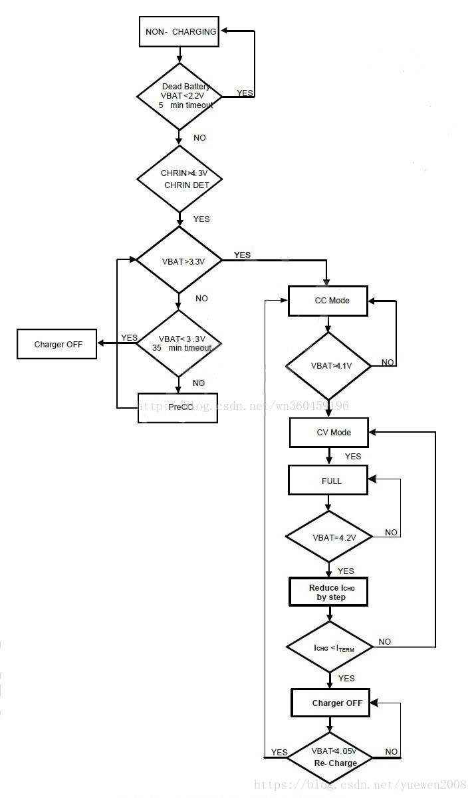
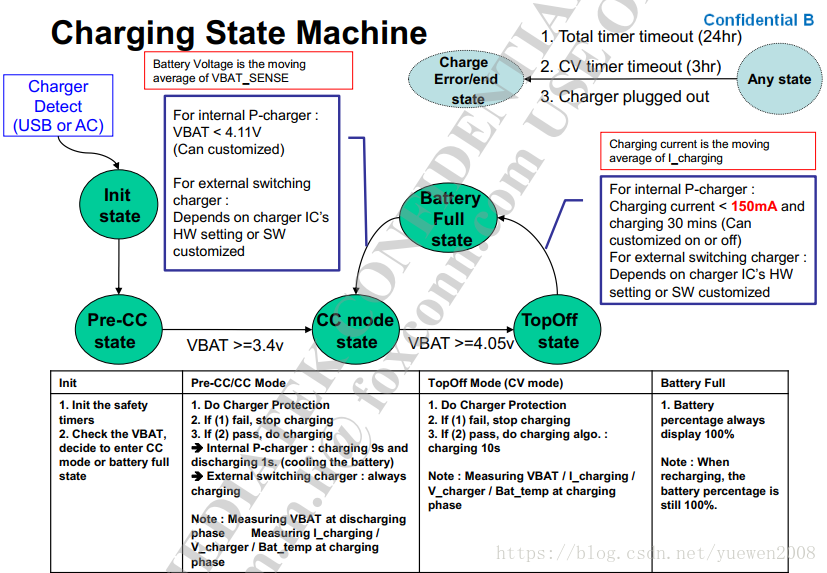

# 概述

charger充电阶段介绍。

# 参考

* [MTK平台充电模块梳理](https://blog.csdn.net/yuewen2008/article/details/80899568)
* [0021_qcom_xxx_charger充电实验.md](0021_qcom_xxx_charger充电实验.md)

# 充电流程

* 几个充电阶段：涓流充电、预充电、恒流充电和恒压充电阶段。
  * 涓流充电一般由硬件控制，软件无法干预，充电电流一般30~100mA左右，此时电池电压一般是小于2.1v或者2.2v左右。
  * 预充电：当电池电压大于2.1V小于3.0v(软件可设置)时进入预充电阶段，此时充电电流软件可以控制，一般200mA~500mA之间，预充电在lk阶段完成。
  * 恒流充电：当电池电压大于3.0v(该门限软件可以控制)时可以进入恒流充电阶段，此时充电电流可以由标配的充电器的规格来具体确定，一般1000Ma~2000mA不等。
  * 恒压充电阶段：当电池电压接近电池慢电电压(4.35v或者4.4v)时进入恒压充电阶段，在该阶段电池电压基本恒定在满电电压，充电电流逐步下降，直至充电电流达到充电截止电流，充电完成。

# 状态机

