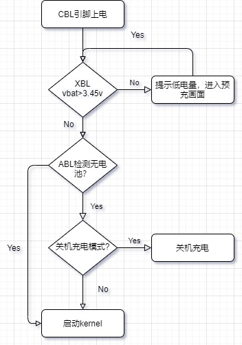
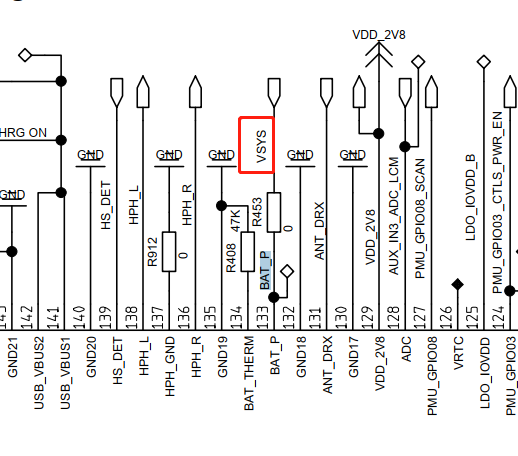
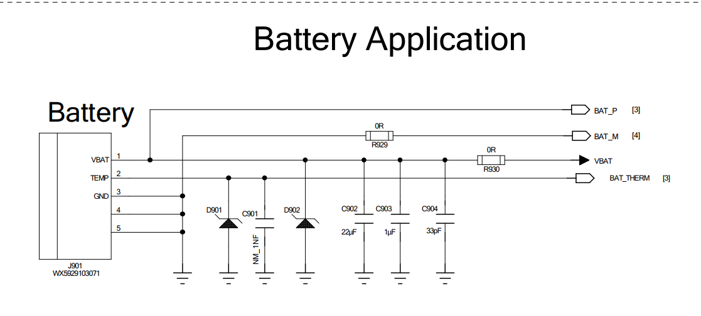
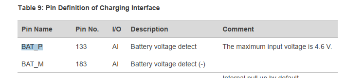
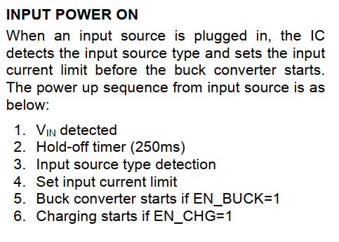
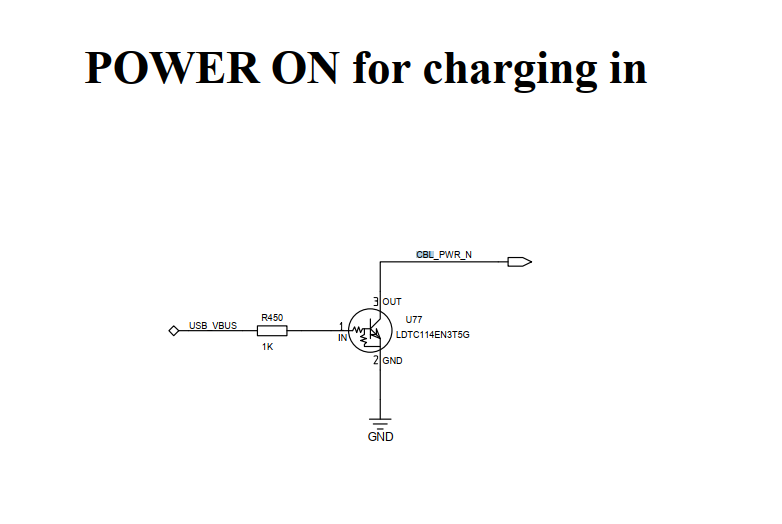
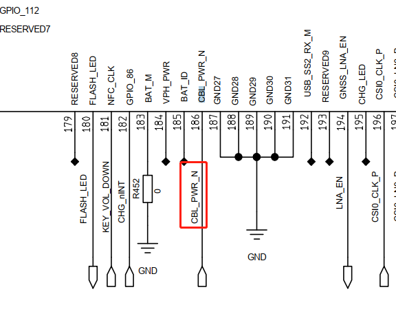

# 概述

高通qcm2290平台，目前要求无电池启动功能，开发一下。

# 启动流程



目前缺少ABL阶段检测有无电池，本文目的就是添加此功能。

# 小知识

C语言中，如果函数直接使用枚举类型作为入参，会带来风险，如果外部随意传入 一个大于枚举类型的值，会被强制转换成枚举类型的合法值。也就是说，会强制将数据截断成枚举类型的范围内的值。函数参数 i2c_instance 为枚举类型i2c_instance，在使用函数 i2c_init 时，参数只接收枚举值 I2C_INSTANCE_001 ~ I2C_INSTANCE_MAX，输入数值1···或枚举值之外的值都是错误的。
```C++
typedef enum {
  I2C_INSTANCE_001,          /**< Instance 01. */
  I2C_INSTANCE_002,          /**< Instance 02. */
  I2C_INSTANCE_003,          /**< Instance 03. */
  I2C_INSTANCE_004,          /**< Instance 04. */
  I2C_INSTANCE_005,          /**< Instance 05. */
  I2C_INSTANCE_006,          /**< Instance 06. */
  I2C_INSTANCE_007,          /**< Instance 07. */
  I2C_INSTANCE_008,          /**< Instance 08. */
  I2C_INSTANCE_009,          /**< Instance 09. */
  I2C_INSTANCE_010,          /**< Instance 10. */
  I2C_INSTANCE_011,          /**< Instance 11. */
  I2C_INSTANCE_012,          /**< Instance 12. */

  I2C_INSTANCE_MAX,          /**< Instance Check. */

} i2c_instance;

EFI_STATUS i2c_init(i2c_instance I2C_INSTANCE)
{
    if (I2C_INSTANCE >= I2C_INSTANCE_001 &&I2C_INSTANCE <= I2C_INSTANCE_MAX)
}
```

# XBL开机电压检测

由于开机过程必须要检测开机电压，那没有电池情况下vbat是多少？首先我们硬件需要准确关机电压，根据高通方案，需要将VBAT_P接到电池vbat脚，而目前接的是vsys，需要改回来。

* 目前项目接法：



* 高通推荐接法：



* PIN脚解释：



无电池启动，也就是插入usb需要启动，那XBL阶段必然会检测vbat电压，也就是说无电池时也需要charger ic打开vbat，根据以下charger ic datasheet中描述，
只需要检测到usb插入，打开充电即可：



经测量，开机后vbat是4.35v左右，跟预期一致。

# 跳过关机充电模式

目前插入usb启动是直接进入关机充电模式了，可以从log中找到原因：
```log
[    0.922874] qcom,qpnp-power-on 1c40000.qcom,spmi:qcom,pm2250@0:qcom,power-on@800: PMIC@SID0 Power-on reason: Triggered from CBL (External Power Supply) and 'cold' boot
[    0.937927] qcom,qpnp-power-on 1c40000.qcom,spmi:qcom,pm2250@0:qcom,power-on@800: PMIC@SID0: Unknown power-off reason
```

从上面可以知道是CBL引脚触发的冷启动，CBL引脚在模块上接到vbus引脚，也就是插入usb会触发冷启动，我们从关机模式文档中可以得知，冷启接usb会进入关机充电模式，刚好符合条件。
* [0023_qcom_qcm2290_关机充电模式分析.md](0023_qcom_qcm2290_关机充电模式分析.md)




那就需要在关机充电增加一个无电池判断了，需要在ABL阶段通过i2c读取bq27z746这款电量计是否存在，ABL阶段i2c接口如何增加请参考：
* [0008_qcom_ABL_增加i2c接口.md](/0016_qcom_doc/docs/0008_qcom_ABL_增加i2c接口.md)

我们增加的接口`is_battery_exist()`和`kernel cmdline`信息如下：
```diff
--- a/UM.9.15/bootable/bootloader/edk2/QcomModulePkg/Application/LinuxLoader/LinuxLoader.c
+++ b/UM.9.15/bootable/bootloader/edk2/QcomModulePkg/Application/LinuxLoader/LinuxLoader.c
@@ -54,6 +54,7 @@
 //[FEATURE]-Add-BEGIN by xielianxiong@paxsz.com, 2022/09/08, for fastboot flash,init uart
 #include <paxLib/pax_serial.h>
 //[FEATURE]-Add-end by xielianxiong@paxsz.com, 2022/09/08, for fastboot flash,init uart
+#include <I2cLib/i2c.h>
 #define MAX_APP_STR_LEN 64
 #define MAX_NUM_FS 10
 #define DEFAULT_STACK_CHK_GUARD 0xc0c0c0c0
@@ -249,6 +250,14 @@ LinuxLoaderEntry (IN EFI_HANDLE ImageHandle, IN EFI_SYSTEM_TABLE *SystemTable)

   BootStatsSetTimeStamp (BS_BL_START);

+  //[NEW FEATURE]-BEGIN by (wugangnan@paxsz.com), 2022/09/08 add i2c function in ABL.
+  Status = i2c_init(I2C_INSTANCE_001);
+  if (Status != EFI_SUCCESS) {
+       DEBUG ((EFI_D_ERROR, "i2c init fail!: %r\n", Status));
+       return Status;
+  }
+  //[NEW FEATURE]-END by (wugangnan@paxsz.com), 2022/09/08 add i2c function in ABL.
+
   // Initialize verified boot & Read Device Info
   Status = DeviceInfoInit ();
   if (Status != EFI_SUCCESS) {
diff --git a/UM.9.15/bootable/bootloader/edk2/QcomModulePkg/Application/LinuxLoader/LinuxLoader.inf b/UM.9.15/bootable/bootloader/edk2/QcomModulePkg/Application/LinuxLoader/LinuxLoader.inf
index d2ca193075e..70fc1dc4527 100755
--- a/UM.9.15/bootable/bootloader/edk2/QcomModulePkg/Application/LinuxLoader/LinuxLoader.inf
+++ b/UM.9.15/bootable/bootloader/edk2/QcomModulePkg/Application/LinuxLoader/LinuxLoader.inf
@@ -63,6 +63,7 @@
        UbsanLib
        paxLib
        UartCoreLib
+       I2cLib

 [Guids]
        gEfiFileInfoGuid
diff --git a/UM.9.15/bootable/bootloader/edk2/QcomModulePkg/Library/BootLib/UpdateCmdLine.c b/UM.9.15/bootable/bootloader/edk2/QcomModulePkg/Library/BootLib/UpdateCmdLine.c
index ddf7a8875d3..d6301b2e51a 100755
--- a/UM.9.15/bootable/bootloader/edk2/QcomModulePkg/Library/BootLib/UpdateCmdLine.c
+++ b/UM.9.15/bootable/bootloader/edk2/QcomModulePkg/Library/BootLib/UpdateCmdLine.c
@@ -52,6 +52,7 @@
 //[FEATURE]-Add-BEGIN by xielianxiong@paxsz.com, 2021/12/06, for cmdline sn
 #include <paxLib/pax_sp.h>
 //[FEATURE]-Add-end by xielianxiong@paxsz.com, 2021/12/06, for cmdline sn
+#include <I2cLib/pax_battery.h>

 STATIC CONST CHAR8 *DynamicBootDeviceCmdLine =
                                       " androidboot.boot_devices=soc/";
@@ -676,6 +677,9 @@ UpdateCmdLine (CONST CHAR8 *CmdLine,
 //[feature]-del-begin xielianxiong@paxsz.com 20220830,for shutdown boot into charging mode
              /*IsChargingScreenEnable () &&*/
 //[feature]-del-end xielianxiong@paxsz.com 20220830,for shutdown boot into charging mode
+//[FEATURE]-BEGIN by (wugangnan@paxsz.com), 2022/09/08 for Turn off power off charging mode when no-battery-startup
+              is_battery_exist() &&
+//[FEATURE]-END by (wugangnan@paxsz.com), 2022/09/08 for Turn off power off charging mode when no-battery-startup
              !Recovery) {
     DEBUG ((EFI_D_INFO, "Device will boot into off mode charging mode\n"));
--- /dev/null
+++ b/UM.9.15/bootable/bootloader/edk2/QcomModulePkg/Library/I2cLib/pax_battery.c
@@ -0,0 +1,32 @@
+/* I2C Interfaces */
+#include "pax_battery.h"
+#include <Uefi.h>
+//#include <Library/PcdLib.h>
+#include <Library/UefiLib.h>
+#include <Library/UefiApplicationEntryPoint.h>
+#include <Library/UefiBootServicesTableLib.h>
+//#include <Library/TestInterface.h>
+#include "EFIPmicVreg.h"
+//#include <Protocol/EFII2C.h>
+#include "EFITlmm.h"
+//#include <Protocol/EFIPmicGpio.h>
+//#include <Library/QcomLib.h>
+#include "DebugLib.h"
+#include "i2c.h"
+
+int is_battery_exist(VOID)
+{
+       unsigned int type = 0;
+
+       linuxc_i2c_write_16bit_reg(0x55,0x3e,0x0001);
+       type = linuxc_i2c_read_16bit_reg(0x55,0x40);//gauge中存id的寄存器地址
+       //DEBUG((EFI_D_INFO, "bq27z746 get dev type:0x%X\n", type));
+
+       if (type == BQ27Z746_DeviceType) {
+               DEBUG((EFI_D_ERROR, "battery is exist\n", type));
+               return 1;
+       }
+
+       DEBUG((EFI_D_ERROR, "battery is not exist\n", type));
+       return 0;
+}
\ No newline at end of file
diff --git a/UM.9.15/bootable/bootloader/edk2/QcomModulePkg/Library/I2cLib/pax_battery.h b/UM.9.15/bootable/bootloader/edk2/QcomModulePkg/Library/I2cLib/pax_battery.h
new file mode 100755
index 00000000000..cef4bb84bf9
--- /dev/null
+++ b/UM.9.15/bootable/bootloader/edk2/QcomModulePkg/Library/I2cLib/pax_battery.h
@@ -0,0 +1,8 @@
+#ifndef _PAX_BATTERY_H_
+#define _PAX_BATTERY_H_
+
+//BQ27Z746_reg_DeviceType
+#define BQ27Z746_DeviceType  0x1746
+
+extern int is_battery_exist(VOID);
+#endif

--- a/UM.9.15/bootable/bootloader/edk2/QcomModulePkg/Library/paxLib/pax_cmdline.c
+++ b/UM.9.15/bootable/bootloader/edk2/QcomModulePkg/Library/paxLib/pax_cmdline.c
@@ -3,6 +3,7 @@
 #include "pax_lib.h"
 #include "pax_edk2_libc.h"
 #include "pax_cmdline.h"
+#include <I2cLib/pax_battery.h>

 #define MAX_PATH_SIZE 72

@@ -204,6 +205,14 @@ void update_bootargs(char *cmdline)
        if(0 == GetBtMAC(tmpbuf,MAC_NV_LENGTH*2+5)){
         bootargs_add("paxbtmac=", tmpbuf, cmdline);//btmac
     }
-//[FEATURE]-Add-END by xielianxiong@paxsz.com, 2021/12/13, for init other cmdline property
-}

+       //[FEATURE]-BEGIN by (wugangnan@paxsz.com), 2022/09/08 for Turn off power off charging mode when no-battery-startup
+       if (!is_battery_exist()) {
+               bootargs_add("start_without_battery=", "1", cmdline);//Start without battery
+       }
+       else {
+               bootargs_add("start_without_battery=", "0", cmdline);
+       }
+       //[FEATURE]-END by (wugangnan@paxsz.com), 2022/09/08 for Turn off power off charging mode when no-battery-startup
+//[FEATURE]-Add-END by xielianxiong@paxsz.com, 2021/12/13, for init other cmdline property
+}
```
