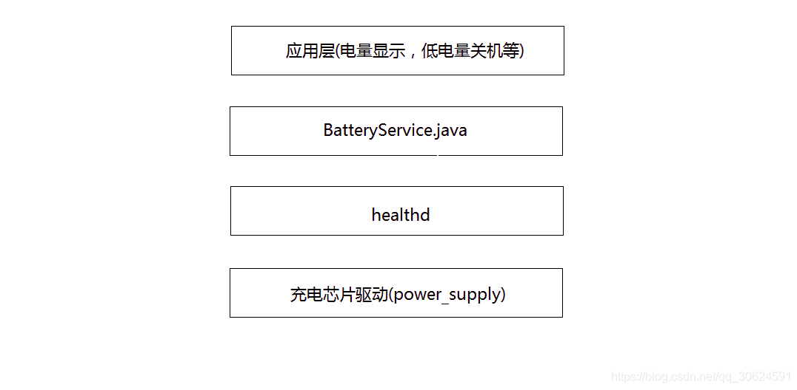
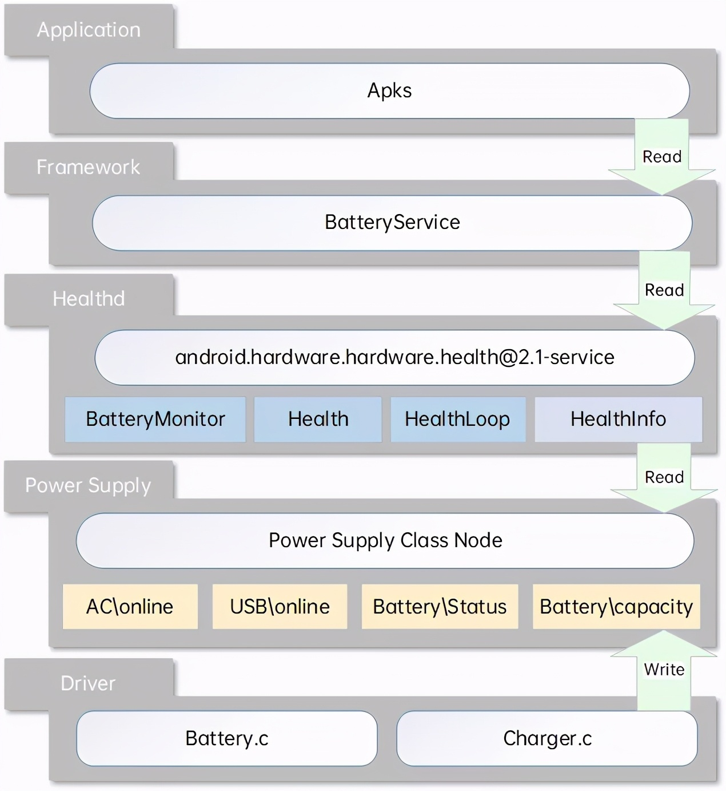

# README

charger/gauge相关，从上层到底层软件简单做个总结。

电池管理在Android系统中的主要作用是检测我们的电池状态，剩余电量实时更新，高温报警，低电量关机等。Android的电池管理模块，从Android的应用层到底层内核分为了4层来理解，从上到下依次为，应用层，framwork层，本地框架层，内核驱动层。



# refer

* [power supply是如何上报电池信息的](https://cloud.tencent.com/developer/article/1847402)

# Android供电系统框架



# Android 电池服务

Android电池服务BatteryService，注册hidl回调`HealthHalCallback `用来监听内核上报的电池事件，并将最新的电池数据上报给系统，系统收到新数据后会去更新电池显示状态、剩余电量等信息。如果收到过温报警和低电报警，系统会自动触发关机流程，保护电池和机器不受到危害。

* Android电池服务的源码结构：
```
frameworks/base/services/java/com/android/server/ 
├── SystemServer.java 
            创建BatteryService、PowerManagerService、ActivityManagerService 
frameworks/base/services/core/java/com/android/server/
├── BatteryService.java
            监听底层上报的battery事件，广播电池发生改变的消息 （广播Intent.ACTION_BATTERY_CHANGED）

frameworks/base/services/core/java/com/android/server/am/
├── ActivityManagerService.java 
            创建BatteryStatsService 
├── BatteryStatsService.java 
            统计和记录电池参数的信息 

frameworks/base/services/core/java/com/android/server/power/
├── PowerManagerService.java 
            监听电池发生变化的广播消息，并调节系统的电源状态，例如亮屏 

frameworks/base/core/java/com/android/internal/os/
├── BatteryStatsImpl.java 
            统计和记录电池参数的信息，并通知其他模块 
```

# Healthd
healthd是android4.4之后提出来的一种中介模型，安卓源码路径下system/core/healthd， 主要是通过binder机制去调用healthd向下监听来自底层的电池事件，向上传递电池数据信息给Framework层的BatteryService用来计算电池电量相关信息，BatteryService通过传递来的数据来计算电池电量等信息，因此healthd在电池管理系统中起着承上启下的作用。

主要是通过BatteryMonitor.cpp中的bool BatteryMonitor::update(void)函数上报信息，其中，内核首先会更新数据到`/sys/class/power_supply/battery`节点下各个属性。

* Healthd的源码结构：
```
    System/core/healthd/
├── healthd.cpp 
            创建uevent socket，监听内核上报的内核事件 
├── BatteryMonitor.cpp 
            初始化本地电池数据结构，将power_supply路径下属性节点路径填充进去， 
├── BatteryMonitor.h 
├── BatteryPropertiesRegistrar.cpp 
            创建电池属性监听器，并将其注册到Android的系统服务中 
├── BatteryPropertiesRegistrar.h
```

# kernel

驱动部分大概流程是这样的：
Android内核中的电池驱动采取的是linux 内核驱动中的`power_supply`子系统框架进行上报电池状态。`power_supply`主要通过sys文件系统向用户层提供读取电池状态的接口，路径为`/sys/class/power_supply/`, 该目录下通常会有`ac , battery, usb`三个目录，代表给Android系统供电的三种能源类型，其中电池的状态就在battery的目录下，当电池状态变化的时候会通过uevent机制通知上层，然后上层通过读取该目录下相应的值来动态的显示电池状态。

* 驱动的源码结构：
```
kernel/drivers/power
```

## ac/battery/usb进行初始化

```C++
int xxx_charger_register_power_supply(struct device *dev, struct xxx_charger *info)
{
	int ret;

	info->psy_desc1.name = "xxx-charger";
	info->psy_desc1.type = POWER_SUPPLY_TYPE_USB;
	info->psy_desc1.properties = charger_psy_properties;
	info->psy_desc1.num_properties = ARRAY_SIZE(charger_psy_properties);
	info->psy_desc1.get_property = psy_charger_get_property;
	info->psy_desc1.set_property = psy_charger_set_property;
	info->psy_desc1.property_is_writeable =
			psy_charger_property_is_writeable;
	info->psy_desc1.external_power_changed =
			xxx_charger_external_power_changed,
	info->psy_cfg1.drv_data = info;
	info->psy_cfg1.num_supplicants =  ARRAY_SIZE(xxx_charger_supplied_to);
	info->psy_cfg1.supplied_to = xxx_charger_supplied_to;
	info->psy1 = power_supply_register(dev, &info->psy_desc1,
			&info->psy_cfg1);

	if (IS_ERR(info->psy1)) {
		chr_err("register psy1 fail:%d\n",
			PTR_ERR(info->psy1));
		goto fail_1;
	}

	return 0;

fail_1:
	power_supply_unregister(info->psy1);

	return -EBUSY;
}
```
1. 这里主要是实现给电源名字类型等赋初值，最主要是将get_property函数指向我们写好的可以得到电源的属性的函数的起始地址，以便当内核需要用到驱动的信息的时候进行回调。
2. 通过`power_supply_register`（devm_power_supply_register最终也是调用power_supply_register）将所提供的电源进行注册,即把他们的属性写到sys文件系统里，使用户空间可以得到有关电源的信息。
power_supply_register调用内核提供的函数device_create（）和power_supply_create_attrs来实现电源的注册，这里电源类型是usb。
3. 内核主要通过get_property这个函数指针来获得驱动中的有关电池的信息，而这个函数在内核中只给出了声明，我们在写驱动的时候要自己实现这个函数，即将自己写的函数赋值给这个函数指针，当内核需要驱动中电源信息的时候就回调这个get_property函数。另外，我们写驱动程序的时候又要给用户提供接口，内核中提供给用户的接口就是sysfs，通过读取sysfs文件系统中文件内容，就可以得到电源的信息。内核主要通过两个文件power_supply_class.c 和power_supply_core.c，我们调用其中的函数就可以把电源（BATTERY，USB或AC）的信息展现给用户，有关电源的属性写在/sys/class/powersupply文件夹下（此文件夹为程序运行后所生成的）。

## prop属性

ac和usb只创建了一个online属性，上层通过判断ac和usb的online状态（1表示设备接入，0表示设备拔出）便可知道当前系统是由什么设备在充电了；而battery则创建了如status、health、present、capacity、batt_vol等等和电池相关的诸多属性，上层通过这些电池属性uevent便可监控电池的当前工作状态了。下面举例是battery，ac和usb同理。

* healthd初始化获取prop:
```
/sys/class/power_supply/*/type
```

* 一般分为以下几种类型：
```
	POWER_SUPPLY_TYPE_BATTERY,
	POWER_SUPPLY_TYPE_USB,			/* Standard Downstream Port */
	POWER_SUPPLY_TYPE_USB_ACA,		/* Accessory Charger Adapters */
```


* charger 获取信息：
```
/sys/class/power_supply/ac/online AC 电源连接状态
/sys/class/power_supply/usb/online USB电源连接状态
```

* healthd守护进程和默认实现android.hardware.health@2.0-impl-2.1访问以下内核接口以检索电池信息：
```
/sys/class/power_supply/*/capacity_level （在健康 2.1 中添加）
/sys/class/power_supply/*/capacity  电池电量百分比
/sys/class/power_supply/*/charge_counter 剩余容量 uAh
/sys/class/power_supply/*/charge_full 最大容量
/sys/class/power_supply/*/charge_full_design （在健康 2.1 中添加） 最大容量
/sys/class/power_supply/*/current_avg 平均电流
/sys/class/power_supply/*/current_max 最大电流
/sys/class/power_supply/*/current_now 当前电流
/sys/class/power_supply/*/cycle_count 循环次数
/sys/class/power_supply/*/health 电池状态
/sys/class/power_supply/*/present 在位状态
/sys/class/power_supply/*/status 充电状态
/sys/class/power_supply/*/technology 电池技术
/sys/class/power_supply/*/temp 电池温度
/sys/class/power_supply/*/time_to_full_now （在健康 2.1 中添加）
/sys/class/power_supply/*/voltage_max 最大电压
/sys/class/power_supply/*/voltage_now 目前电压
```

# 备注

## Uevent机制

Uevent是内核通知android有状态变化的一种方法，比如USB线插入、拔出，电池电量变化等等。其本质是内核发送（可以通过socket）一个字符串，应用层（android）接收并解释该字符串，获取相应信息。