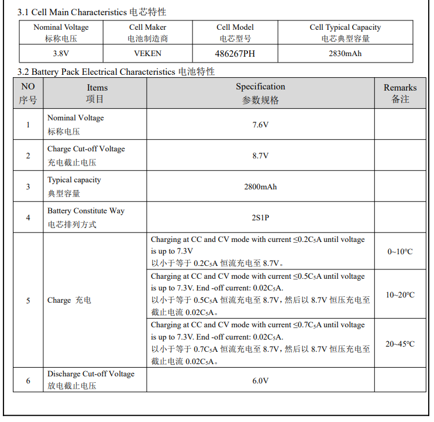

# 概述

JEITA（Japan Electronics and Information Technology Industries Association）

日本电子信息技术产业协会，为了提高锂离子电池充电的安全性，JEITA和日本电池协会于2007年4月20日发布了新的安全指南。指导方针着重强调了在某些低温和高温范围内避免高充电电流和高充电电压的重要性。时至今日，锂电池充电领域大多遵循了JEITA标准，JEITA成为了充电规范的一个代名词。

# 作用


按照上图中的设计为例，我们将T1定为0℃，T2定为10℃，T3定为45℃，T4定为55℃。那么，四档温度将温度域划分为了5部分--Cold（<0℃）、Cool（0~10℃）、Good（10~45℃）、Warm（45~55℃）、Hot（>55℃）。

根据JEITA的说法，锂离子电池的问题主要出现在高充电电压和高电池温度下。过高的满电电压可能导致电池鼓包；过高的和过低的温度以大电流充电会加剧电池损耗。所以在电池状态最佳的Good温度区间，可以采用电池规格书中的最大的电流来进行充电；而在稍高低温环境-Cool/Warm区间中，需要适当降低充电电流，以保证充电安全和降低电池损耗。而一旦到达Cold/Hot的区间，此时说明电池环境已经非常极端，所以需要断开充电。

这就是JEITA标准的主要内容。

* 所以在电池状态最佳的Good温度区间，可以采用电池规格书中的最大的电流来进行充电，火力全开；
* 而在稍高低温环境-Cool/Warm区间中，需要适当降低充电电流，以保证充电安全和降低电池损耗。
* 而一旦到达Cold/Hot的区间，此时说明电池环境已经非常极端，所以需要断开充电。

# A6650项目电池规格

* 最大充电电流：
  * 0 ~ 10℃ 0.2C FC=4.4V 1080ma
  * 15~45℃ 0.8C FC=4.4V  4500ma

  

* 温度保护：


# A9200项目电池规格



# SW jeita原理

* charger jeita温控限流功能,分为以下几个档位:
1. 小于0度停止充电 升档阈值：5°
2. 0~10° 电流:0.2C 电压:4375mv 升档阈值：11°
3. 10~15° 电流:0.2C 电压:4375mv 升档阈值：16°
4. 15~45° 电流:0.8C 电压:4375mv 正常充电范围
5. 45~50° 电流:0.2C 电压:4300mv 降档阈值：44°
6. 大于50度停止充电 降档阈值：48°

定义升档和降档阈值是为了防抖，比如温度不停在某个区间的临界值来回跳动，会造成频繁调节电流电压，加了阈值之后举个例子，比如现在在小于0度档位，当温度大于5度时才进入0~10度档位，允许充电，降档同理。

## SW jeita算法

```C++
/* sw jeita */
void do_sw_jeita_state_machine(struct pax_charger *info)
{
	struct sw_jeita_data *sw_jeita;

	sw_jeita = &info->sw_jeita;
	sw_jeita->pre_sm = sw_jeita->sm;
	sw_jeita->charging = true;

	/* JEITA battery temp Standard */
	if (info->battery_temp >= info->data.temp_t4_thres) {
		chr_info("[SW_JEITA] Battery Over high Temperature(%d) !!\n",
			info->data.temp_t4_thres);

		sw_jeita->sm = TEMP_ABOVE_T4;
		sw_jeita->charging = false;
	} else if (info->battery_temp > info->data.temp_t3_thres) {
		/* control 45 degree to normal behavior */
		if ((sw_jeita->sm == TEMP_ABOVE_T4)
			&& (info->battery_temp
			>= info->data.temp_t4_thres_minus_x_degree)) {
			chr_info("[SW_JEITA] Battery Temperature between %d and %d,not allow charging yet!!\n",
				info->data.temp_t4_thres_minus_x_degree,
				info->data.temp_t4_thres);

			sw_jeita->charging = false;
		} else {
			chr_info("[SW_JEITA] Battery Temperature between %d and %d !!\n",
				info->data.temp_t3_thres,
				info->data.temp_t4_thres);

			sw_jeita->sm = TEMP_T3_TO_T4;
		}
	} else if (info->battery_temp >= info->data.temp_t2_thres) {
		if (((sw_jeita->sm == TEMP_T3_TO_T4)
			 && (info->battery_temp
			 >= info->data.temp_t3_thres_minus_x_degree))
			|| ((sw_jeita->sm == TEMP_T1_TO_T2)
			&& (info->battery_temp
				<= info->data.temp_t2_thres_plus_x_degree))) {
			chr_info("[SW_JEITA] Battery Temperature not recovery to T2_TO_T3 temperature charging mode yet!!\n");
		} else {
			chr_info("[SW_JEITA] Battery Normal Temperature between %d and %d !!\n",
				info->data.temp_t2_thres,
				info->data.temp_t3_thres);
			sw_jeita->sm = TEMP_T2_TO_T3;
		}
	} else if (info->battery_temp >= info->data.temp_t1_thres) {
		if (sw_jeita->sm == TEMP_T0_TO_T1
			&& info->battery_temp
			<= info->data.temp_t1_thres_plus_x_degree) {
			if (sw_jeita->sm == TEMP_T0_TO_T1) {
				chr_info("[SW_JEITA] Battery Temperature not recovery to T1_TO_T2 temperature charging mode yet!!\n");
			}
		} else {
			chr_info("[SW_JEITA] Battery Temperature between %d and %d !!\n",
				info->data.temp_t1_thres,
				info->data.temp_t2_thres);

			sw_jeita->sm = TEMP_T1_TO_T2;
		}
	} else if (info->battery_temp >= info->data.temp_t0_thres) {
		if ((sw_jeita->sm == TEMP_BELOW_T0)
			&& (info->battery_temp
			<= info->data.temp_t0_thres_plus_x_degree)) {
			chr_info("[SW_JEITA] Battery Temperature between %d and %d,not allow charging yet!!\n",
				info->data.temp_t0_thres,
				info->data.temp_t0_thres_plus_x_degree);

			sw_jeita->charging = false;
		} else {
			chr_info("[SW_JEITA] Battery Temperature between %d and %d !!\n",
				info->data.temp_t0_thres,
				info->data.temp_t1_thres);

			sw_jeita->sm = TEMP_T0_TO_T1;
		}
	} else {
		chr_info("[SW_JEITA] Battery below low Temperature(%d) !!\n",
			info->data.temp_t0_thres);
		sw_jeita->sm = TEMP_BELOW_T0;
		sw_jeita->charging = false;
	}

	/* set CV after temperature changed */
	/* In normal range, we adjust CV dynamically */
	if (sw_jeita->sm != TEMP_T2_TO_T3) {
		if (sw_jeita->sm == TEMP_ABOVE_T4)
			sw_jeita->cv = info->data.jeita_temp_above_t4_cv;
		else if (sw_jeita->sm == TEMP_T3_TO_T4)
			sw_jeita->cv = info->data.jeita_temp_t3_to_t4_cv;
		else if (sw_jeita->sm == TEMP_T1_TO_T2)
			sw_jeita->cv = info->data.jeita_temp_t1_to_t2_cv;
		else if (sw_jeita->sm == TEMP_T0_TO_T1)
			sw_jeita->cv = info->data.jeita_temp_t0_to_t1_cv;
		else if (sw_jeita->sm == TEMP_BELOW_T0)
			sw_jeita->cv = info->data.jeita_temp_below_t0_cv;
		else
			sw_jeita->cv = info->data.battery_cv;

	} else {
		sw_jeita->cv = 0;
	}

	chr_info("[SW_JEITA]preState:%d newState:%d tmp:%d cv:%d\n",
		sw_jeita->pre_sm, sw_jeita->sm, info->battery_temp,
		sw_jeita->cv);
}

static void charger_check_jeita_status(struct pax_charger *info)
{
	bool charging = true;
	int temperature;
	struct battery_thermal_protection_data *thermal;

	if (info->chr_type == POWER_SUPPLY_TYPE_UNKNOWN)
		return;

	temperature = info->battery_temp;
	thermal = &info->thermal;

	if (info->enable_sw_jeita == true) {
		do_sw_jeita_state_machine(info);
		if (info->sw_jeita.charging == false) {
			charging = false;
			goto stop_charging;
		}
	} else {
		if (thermal->enable_min_charge_temp) {
			if (temperature < thermal->min_charge_temp) {
				chr_info("Battery Under Temperature or NTC fail %d %d\n",
					temperature, thermal->min_charge_temp);
				thermal->sm = BAT_TEMP_LOW;
				charging = false;
				goto stop_charging;
			} else if (thermal->sm == BAT_TEMP_LOW) {
				if (temperature >=
				    thermal->min_charge_temp_plus_x_degree) {
					chr_info("Battery Temperature raise from %d to %d(%d), allow charging!!\n",
					thermal->min_charge_temp,
					temperature,
					thermal->min_charge_temp_plus_x_degree);
					thermal->sm = BAT_TEMP_NORMAL;
				} else {
					charging = false;
					goto stop_charging;
				}
			}
		}

		if (temperature >= thermal->max_charge_temp) {
			chr_info("Battery over Temperature or NTC fail %d %d\n",
				temperature, thermal->max_charge_temp);
			thermal->sm = BAT_TEMP_HIGH;
			charging = false;
			goto stop_charging;
		} else if (thermal->sm == BAT_TEMP_HIGH) {
			if (temperature
			    < thermal->max_charge_temp_minus_x_degree) {
				chr_info("Battery Temperature raise from %d to %d(%d), allow charging!!\n",
				thermal->max_charge_temp,
				temperature,
				thermal->max_charge_temp_minus_x_degree);
				thermal->sm = BAT_TEMP_NORMAL;
			} else {
				charging = false;
				goto stop_charging;
			}
		}
	}

	if (info->vbusov_stat)
		charging = false;

stop_charging:

	chr_info("tmp:%d (jeita:%d sm:%d cv:%d en:%d) thm_sm:%d en:%d ov:%d can_en:%d\n",
		temperature, 
		info->enable_sw_jeita, info->sw_jeita.sm,
		info->sw_jeita.cv, info->sw_jeita.charging, 
		thermal->sm,
		charging, 
		info->vbusov_stat, info->can_charging);

	if (charging != info->can_charging) {
		enable_charging(info, charging);
	}

	info->can_charging = charging;
}
```


# SW jeita测试

* 50读不允许充电：
```
[ 2245.907524] PAX_CHG: _wake_up_charger:
[ 2245.911798] PAX_CHG: pax_is_charger_on chr_type = [DCP] last_chr_type = [DCP]
[ 2245.920155] PAX_CHG: [SW_JEITA] Battery Over high Temperature(50) !!
[ 2245.926636] PAX_CHG: [SW_JEITA]preState:5 newState:5 tmp:50 cv:4375
[ 2245.933121] PAX_CHG: tmp:50 (jeita:1 sm:5 cv:4375 en:0) (sm:1) en:0 c:0 s:0 ov:0 0 0
```

* 降低到46度后，允许充电：
```
[ 2115.538575] PAX_CHG: _wake_up_charger:
[ 2115.542823] PAX_CHG: pax_is_charger_on chr_type = [DCP] last_chr_type = [DCP]
[ 2115.550148] PAX_CHG: [SW_JEITA] Battery Temperature between 47 and 50,not allow charging yet!!
[ 2115.558922] PAX_CHG: [SW_JEITA]preState:5 newState:5 tmp:47 cv:4375
[ 2115.565323] PAX_CHG: tmp:47 (jeita:1 sm:5 cv:4375 en:0) (sm:1) en:0 c:0 s:0 ov:0 0 0
[ 2120.329237] PAX_CHG: charger_log_level_store: log_level=46 battery_temp = 46
console:/sys/devices/platform/soc/soc:charger # [ 2120.552165] PAX_CHG: _wake_up_charger:
[ 2120.556452] PAX_CHG: pax_is_charger_on chr_type = [DCP] last_chr_type = [DCP]
[ 2120.563736] PAX_CHG: [SW_JEITA] Battery Temperature between 45 and 50 !!
[ 2120.570571] PAX_CHG: [SW_JEITA]preState:5 newState:4 tmp:46 cv:4375
[ 2120.576955] PAX_CHG: tmp:46 (jeita:1 sm:4 cv:4375 en:1) (sm:1) en:1 c:0 s:0 ov:0 0 1
[ 2120.587263] PAX_CHG: support_fast_charging = 0
[ 2120.592164] PAX_CHG: is_typec_adapter rp = 500 pd_type = 0
[ 2120.597712] PAX_CHG: is_basic TEMP_T3_TO_T4!
[ 2120.602082] PAX_CHG: chg:-1,-1,1000,1000 type:5:0 usb_unlimited:0 usbif:0 usbsm:0 aicl:-1 atm:0 bm:0 b:1
[ 2120.611805] PAX_CHG: do_algorithm input_current_limit:1000 charging_current_limit:1000
[ 2120.624729] chg_dump: CHG [online: 1, type: DCP, status: Charging, fault: 0x0, ICHG = 960mA, AICR = 1000mA, MIVR = 4360mV, IEOC = 240mA, CV = 4350mV]
```