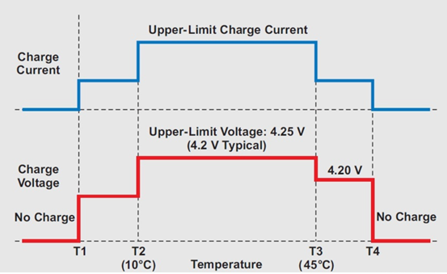
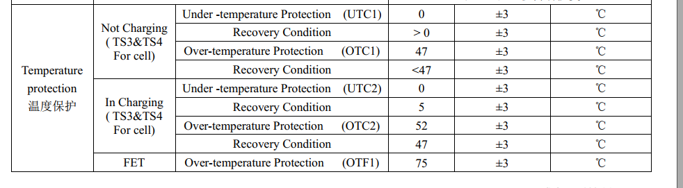
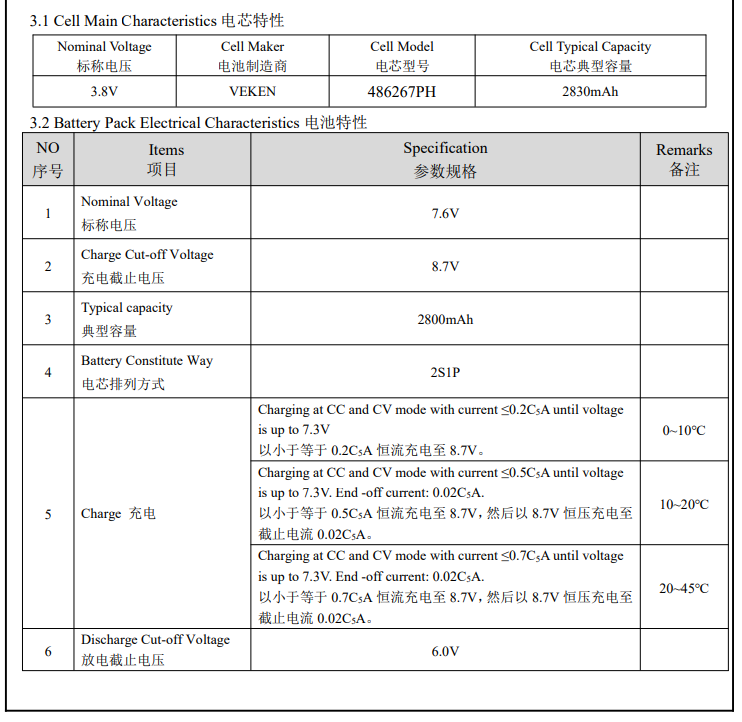

# 概述

JEITA（Japan Electronics and Information Technology Industries Association），日本电子信息技术产业协会，为了提高锂离子电池充电的安全性，JEITA和日本电池协会于2007年4月20日发布了新的安全指南。指导方针着重强调了在某些低温和高温范围内避免高充电电流和高充电电压的重要性。时至今日，锂电池充电领域大多遵循了JEITA标准，JEITA成为了充电规范的一个代名词。


# 作用



按照上图中的设计为例，我们将T1定为0℃，T2定为10℃，T3定为45℃，T4定为55℃。那么，四档温度将温度域划分为了5部分--Cold（<0℃）、Cool（0~10℃）、Good（10~45℃）、Warm（45~55℃）、Hot（>55℃）。

根据JEITA的说法，锂离子电池的问题主要出现在高充电电压和高电池温度下。过高的满电电压可能导致电池鼓包；过高的和过低的温度以大电流充电会加剧电池损耗。所以在电池状态最佳的Good温度区间，可以采用电池规格书中的最大的电流来进行充电；而在稍高低温环境-Cool/Warm区间中，需要适当降低充电电流，以保证充电安全和降低电池损耗。而一旦到达Cold/Hot的区间，此时说明电池环境已经非常极端，所以需要断开充电。

这就是JEITA标准的主要内容。

* 所以在电池状态最佳的Good温度区间，可以采用电池规格书中的最大的电流来进行充电，火力全开；
* 而在稍高低温环境-Cool/Warm区间中，需要适当降低充电电流，以保证充电安全和降低电池损耗。
* 而一旦到达Cold/Hot的区间，此时说明电池环境已经非常极端，所以需要断开充电。

# A6650项目电池规格

* 最大充电电流：
  * 0 ~ 10℃ 0.2C FC=4.4V 1080ma
  * 15~45℃ 0.7C FC=4.4V  3780ma

* 温度保护：



# A9200项目电池规格




# SW jeita测试

* 50读不允许充电：
```
[ 2245.907524] PAX_CHG: _wake_up_charger:
[ 2245.911798] PAX_CHG: pax_is_charger_on chr_type = [DCP] last_chr_type = [DCP]
[ 2245.920155] PAX_CHG: [SW_JEITA] Battery Over high Temperature(50) !!
[ 2245.926636] PAX_CHG: [SW_JEITA]preState:5 newState:5 tmp:50 cv:4375
[ 2245.933121] PAX_CHG: tmp:50 (jeita:1 sm:5 cv:4375 en:0) (sm:1) en:0 c:0 s:0 ov:0 0 0
```

* 降低到46度后，允许充电：
```
[ 2115.538575] PAX_CHG: _wake_up_charger:
[ 2115.542823] PAX_CHG: pax_is_charger_on chr_type = [DCP] last_chr_type = [DCP]
[ 2115.550148] PAX_CHG: [SW_JEITA] Battery Temperature between 47 and 50,not allow charging yet!!
[ 2115.558922] PAX_CHG: [SW_JEITA]preState:5 newState:5 tmp:47 cv:4375
[ 2115.565323] PAX_CHG: tmp:47 (jeita:1 sm:5 cv:4375 en:0) (sm:1) en:0 c:0 s:0 ov:0 0 0
cho 46   > charger_log_level                                                  <
[ 2120.329237] PAX_CHG: charger_log_level_store: log_level=46 battery_temp = 46
console:/sys/devices/platform/soc/soc:charger # [ 2120.552165] PAX_CHG: _wake_up_charger:
[ 2120.556452] PAX_CHG: pax_is_charger_on chr_type = [DCP] last_chr_type = [DCP]
[ 2120.563736] PAX_CHG: [SW_JEITA] Battery Temperature between 45 and 50 !!
[ 2120.570571] PAX_CHG: [SW_JEITA]preState:5 newState:4 tmp:46 cv:4375
[ 2120.576955] PAX_CHG: tmp:46 (jeita:1 sm:4 cv:4375 en:1) (sm:1) en:1 c:0 s:0 ov:0 0 1
[ 2120.587263] PAX_CHG: support_fast_charging = 0
[ 2120.592164] PAX_CHG: is_typec_adapter rp = 500 pd_type = 0
[ 2120.597712] PAX_CHG: is_basic TEMP_T3_TO_T4!
[ 2120.602082] PAX_CHG: chg:-1,-1,1000,1000 type:5:0 usb_unlimited:0 usbif:0 usbsm:0 aicl:-1 atm:0 bm:0 b:1
[ 2120.611805] PAX_CHG: do_algorithm input_current_limit:1000 charging_current_limit:1000
[ 2120.624729] chg_dump: CHG [online: 1, type: DCP, status: Charging, fault: 0x0, ICHG = 960mA, AICR = 1000mA, MIVR = 4360mV, IEOC = 240mA, CV = 4350mV]

```