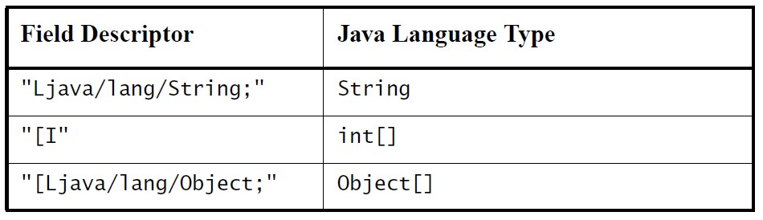

# qcom qcm2290 bms移植过程

记录一下移植过程。

# 参考

* [关于android:如何实现一个-System-Services](https://lequ7.com/guan-yu-android-ru-he-shi-xian-yi-ge-systemservices.html)


# 编写AIDL文件

* `QSSI.12/frameworks/base/core/java/android/os/IPaxBms.aidl`:
```java
+package android.os;
/** 
 * @hide 
*/
interface IPaxBms {
    /**
     * Set the provided set mode to device.
     *
     * @param mode: logical mode to set
     * @return res: result of applying state transformation.
     */
    void enableCharge();
    void disableCharge();
    void enablePowerPath();
    void disablePowerPath();
	void setTemporaryFullCharge(int charge);
}
```

# Context定义变量
在 Context 里定义一个代表`BMS`服务的字符串:
* `frameworks/base/core/java/android/content/Context.java`:
```java
@ -5529,6 +5529,8 @@ public abstract class Context {
  		public static final String xxxBMS_SERVICE="xxxxxbms";
```

# 编写BMS服务

* `QSSI.12/frameworks/base/services/core/java/com/xxxxx/server/PaxBatteryManagerService.java`:
```java
public final class PaxBatteryManagerService extends SystemService {
	//IPaxBms xxxxx_bms;
	PaxBmsManager xxxxxBmsManager;

	public PaxBatteryManagerService(Context context) {
        super(context);
		if(DEBUG)Log.d(TAG,"PaxBatteryManagerService");

        mContext = context;
        mBatteryManagerInternal = getLocalService(BatteryManagerInternal.class);
        myReceiver = new BatteryReceiver();
		mContext.registerReceiver(myReceiver, new IntentFilter(broadcastDel_DB));
		mContext.registerReceiver(myReceiver, new IntentFilter(Intent.ACTION_BOOT_COMPLETED));//监听开机广播
		mContext.registerReceiver(myReceiver, new IntentFilter(Intent.ACTION_SHUTDOWN));//监听关机广播
		mContext.registerReceiver(myReceiver, new IntentFilter(ACTION_DISABLE));//监听工厂测试程序广播
		mContext.registerReceiver(myReceiver, new IntentFilter(ACTION_ENABLE));//监听工厂测试程序广播

		xxxxxBmsManager = (PaxBmsManager)mContext.getSystemService(Context.xxxBMS_SERVICE);
	}

	public void onStart() {
		if(DEBUG)Log.d(TAG,"onStart");
		am = (AlarmManager)mContext.getSystemService(ALARM_SERVICE);
		PowerManager pm = (PowerManager) mContext.getSystemService(Context.POWER_SERVICE);
		wl = pm.newWakeLock(PowerManager.PARTIAL_WAKE_LOCK, TAG);
		wl.acquire();
		//PaxBatteryThread1 pbthread = new PaxBatteryThread1();
		PaxBatteryThread pbthread = new PaxBatteryThread();
		pbthread.start();
	}
```

# 注册BMS服务

* 注册`PaxBatteryManagerService`服务，并执行`startService`，会调用服务中的`onstart`方法。
* 注册静态服务`PaxBmsService`，供服务调用接口。
*  `PaxBmsService`是`binder server`端，`PaxBmsManager`是服务于`PaxBmsService`的`binder client`端，并给外部提供接口的。

* `QSSI.12/frameworks/base/services/java/com/android/server/SystemServer.java`:
```
+//ADD BEGIN by (xxx@xxxxx.com), 2022/11/01 add for BMS
  	+import com.android.server.xxxxxbms.PaxBmsService;
  	+import com.xxxxx.server.PaxBatteryManagerService;
  	+//ADD END by (xxx@xxxxx.com), 2022/11/01 add for BMS
 
 /**
 /**
  * Entry point to {@code system_server}.
  * Entry point to {@code system_server}.
@@ -1578,6 +1582,16 @@ public final class SystemServer implements Dumpable {	@@ -1578,6 +1582,16 @@ public final class SystemServer implements Dumpable {

  	+			//ADD BEGIN by (xxx@xxxxx.com), 2022/11/01 add for BMS
  	+             t.traceBegin("StartmPaxBMSService");
  	+            try{
  	+                PaxBmsService mPaxBmsService = new PaxBmsService(context);
  	+                ServiceManager.addService("xxxxxbms", mPaxBmsService);
  	+            } catch(Throwable e){
  	+                reportWtf("starting xxxxxbms Service", e);
  	+            }
  	+            t.traceEnd();
  	+		//ADD END by (xxx@xxxxx.com), 2022/11/01 add for BMS
 
 
         } catch (Throwable e) {
         } catch (Throwable e) {
             Slog.e("System", "******************************************");
             Slog.e("System", "******************************************");
@@ -2704,6 +2718,11 @@ public final class SystemServer implements Dumpable {	@@ -2704,6 +2718,11 @@ public final class SystemServer implements Dumpable {
         t.traceBegin("StartMediaCommunicationService");
         t.traceBegin("StartMediaCommunicationService");
         mSystemServiceManager.startService(MEDIA_COMMUNICATION_SERVICE_CLASS);
         mSystemServiceManager.startService(MEDIA_COMMUNICATION_SERVICE_CLASS);
         t.traceEnd();
         t.traceEnd();
  	+		//[FEATURE]-Add-BEGIN by (xxx@xxxxx.com), 2022/11/01, for start xxxxx Battery Manager service
  	+			t.traceBegin("PaxBatteryManagerService ");
  	+			mSystemServiceManager.startService(PaxBatteryManagerService.class);
  	+			t.traceEnd();
  	+		//[FEATURE]-Add-END by (xxx@xxxxx.com), 2022/11/01, for start xxxxx Battery Manager service
```

# 编写并注册PaxBmsManager类

* `QSSI.12/frameworks/base/core/java/android/app/SystemServiceRegistry.java`:
```java
+//ADD BEGIN by (xxx@xxxxx.com), 2022/11/01 add for BMS
import android.os.IPaxBms;
import android.app.PaxBmsManager;
//ADD BEGIN by (xxx@xxxxx.com), 2022/11/01 add for BMS

 /**
 /**
  * Manages all of the system services that can be returned by {@link Context#getSystemService}.
  * Manages all of the system services that can be returned by {@link Context#getSystemService}.
  * Used by {@link ContextImpl}.
  * Used by {@link ContextImpl}.
@@ -1449,7 +1454,18 @@ public final class SystemServiceRegistry {	@@ -1449,7 +1454,18 @@ public final class SystemServiceRegistry {
                                 ctx.mMainThread.getHandler());
                                 ctx.mMainThread.getHandler());
                     }
                     }
                 });
                 });

		//ADD BEGIN by (xxx@xxxxx.com), 2022/11/01 add for BMS
			registerService(Context.xxxBMS_SERVICE, PaxBmsManager.class,
	                new CachedServiceFetcher<PaxBmsManager>() {
	                    @Override
	                    public PaxBmsManager createService(ContextImpl ctx)
	                            throws ServiceNotFoundException {
	                        IBinder b = ServiceManager.getService("xxxxxbms");
	                        IPaxBms service = IPaxBms.Stub.asInterface(b);
	                        return PaxBmsManager.getInstance();
				}
  			});
  			//ADD END by (xxx@xxxxx.com), 2022/11/02 add for BMS
```

* `QSSI.12/frameworks/base/core/java/android/app/PaxBmsManager.java`:
```java
+/* * Copyright (C) 2008 The Android Open Source Project
 *
 * Licensed under the Apache License, Version 2.0 (the "License");
 * you may not use this file except in compliance with the License.
 * You may obtain a copy of the License at
 *
 *      http://www.apache.org/licenses/LICENSE-2.0
 *
 * Unless required by applicable law or agreed to in writing, software
 * distributed under the License is distributed on an "AS IS" BASIS,
 * WITHOUT WARRANTIES OR CONDITIONS OF ANY KIND, either express or implied.
 * See the License for the specific language governing permissions and
 * limitations under the License.
 */

package android.app;
import android.content.Context;
import android.util.Log;
import android.annotation.NonNull;
import android.annotation.Nullable;
import android.os.ServiceManager.ServiceNotFoundException;
import android.annotation.SuppressLint;

import android.os.ServiceManager;
import android.os.RemoteException;
import android.annotation.SystemService;
import android.os.Binder;
import android.os.IBinder;
import android.compat.annotation.UnsupportedAppUsage;

import android.os.IPaxBms;
import java.util.Objects;

@SystemService(Context.xxxBMS_SERVICE)
public class PaxBmsManager {
	//PaxBMSService mBMS;
	private static final String TAG = "PaxBMSManager";
	private static PaxBmsManager sInstance;
	private IPaxBms mBMS;
	private Context mContext;
	private final static Object syncObj = new Object();

	
	/**
     * @hide
     */
     private PaxBmsManager(IPaxBms iBms){
		Log.d(TAG, "PaxBmsManager created");
		mBMS = iBms;
		
	}

     /**
     * Gets an instance of the PaxBmsManager manager.
     *
     * @return The PaxBmsManager manager instance.
     * @hide
     */
     @UnsupportedAppUsage
	public static @Nullable PaxBmsManager getInstance() {
		synchronized (syncObj) {
        if (sInstance == null) {
			try {
				IBinder b = ServiceManager.getServiceOrThrow(Context.xxxBMS_SERVICE);
				sInstance = new PaxBmsManager(IPaxBms.Stub.asInterface(b));
			}catch (ServiceNotFoundException e){
				e.printStackTrace();
			}
			
        }
        return sInstance;
      }
	}
	
	//@SuppressLint("NewApi")
	public void enableCharge(){
		Log.d(TAG,"enableCharge");
		try {
			mBMS.enableCharge();
		} catch (RemoteException e){
			e.printStackTrace();
		}
	}
	
	//@SuppressLint("NewApi")
	public void disableCharge(){
		Log.d(TAG,"disableCharge");
		try {
			mBMS.disableCharge();
		} catch (RemoteException e){
			e.printStackTrace();
		}
	}
	
	//@SuppressLint("NewApi")
	public void enablePowerPath(){
		Log.d(TAG,"enablePowerPath");
		try {
			mBMS.enablePowerPath();
		} catch (RemoteException e){
			e.printStackTrace();
		}
	}
	
	//@SuppressLint("NewApi")
	public void disablePowerPath(){
		Log.d(TAG,"disablePowerPath");
		try {
			mBMS.disablePowerPath();
		} catch (RemoteException e){
			e.printStackTrace();
		}
	}
	
	//@SuppressLint("NewApi")
	public void setTemporaryFullCharge(int fullsoc) {
		Log.d(TAG,"setFullSoc = "+fullsoc);
		try {
			mBMS.setTemporaryFullCharge(fullsoc);
		} catch (RemoteException e){
			e.printStackTrace();
		}
	}
}
```

# 编写PaxBmsService类

PaxBmsService 类主要是充电接口实现类，主要调用JNI。
```java
/* * Copyright (C) 2008 The Android Open Source Project
 *
 * Licensed under the Apache License, Version 2.0 (the "License");
 * you may not use this file except in compliance with the License.
 * You may obtain a copy of the License at
 *
 *      http://www.apache.org/licenses/LICENSE-2.0
 *
 * Unless required by applicable law or agreed to in writing, software
 * distributed under the License is distributed on an "AS IS" BASIS,
 * WITHOUT WARRANTIES OR CONDITIONS OF ANY KIND, either express or implied.
 * See the License for the specific language governing permissions and
 * limitations under the License.
 */

package com.android.server.xxxxxbms;

import android.app.ActivityManager;
import android.content.Context;
import android.os.Handler;
import android.os.IBinder;
import android.os.Message;
import android.os.PowerManager;
import android.os.Trace;
import android.provider.Settings;
import android.util.Slog;
import android.view.SurfaceControl;
import android.util.Log;
import android.content.Context;

import com.android.server.SystemService;
import android.os.IPaxBms;
import android.os.SystemProperties;
import android.os.RemoteException;
import android.annotation.SuppressLint;

public class PaxBmsService extends IPaxBms.Stub {
    static final String TAG = "PaxBMSService";
    static final boolean DEBUG = false;
    private final Context mContext;
	public static final String TemporaryFullCharge = "sys.bms.temporary_full_charge";

   public PaxBmsService(Context context) {
   		super();
        mContext = context;
    } 
	

	
   
   // @SuppressLint("NewApi")
    @Override
    public void enableCharge() {
        Log.d(TAG,"enableCharge");
        try {
           enableCharge_native();
        } catch (Exception e){
           e.printStackTrace();
        } finally {
           Trace.traceEnd(Trace.TRACE_TAG_POWER);
        }
    }
   
    //@SuppressLint("NewApi")
    @Override
    public void disableCharge() {
        Log.d(TAG,"disableCharge ");
        try {
           disableCharge_native();
        } catch (Exception e){
           e.printStackTrace();
        }finally {
           Trace.traceEnd(Trace.TRACE_TAG_POWER);
        }
    }
    
    //@SuppressLint("NewApi")
     @Override
    public void enablePowerPath() {
        Log.d(TAG,"enablePowerPath ");
        try {
           enablePowerPath_native();
        } catch (Exception e){
           e.printStackTrace();
        }finally {
           Trace.traceEnd(Trace.TRACE_TAG_POWER);
        }
    }
    
    //@SuppressLint("NewApi")
     @Override
    public void disablePowerPath() {
        Log.d(TAG,"disablePowerPath");
        try {
           disablePowerPath_native();
        } catch (Exception e){
           e.printStackTrace();
        }finally {
           Trace.traceEnd(Trace.TRACE_TAG_POWER);
        }
    }

	
	//@SuppressLint("NewApi")
	 @Override
    public void setTemporaryFullCharge(int charge) {
    	SystemProperties.set(TemporaryFullCharge,String.valueOf(charge));
    }
    public void onStart() {
        Slog.e(TAG, "onStart");
    }
    static native void enableCharge_native();
    static native void disableCharge_native();
    static native void enablePowerPath_native();
    static native void disablePowerPath_native();
}
```

# 调用JNI(ioctrl)

* `QSSI.12/frameworks/base/services/core/jni/onload.cpp`注册JNI:
```diff
--- a/QSSI.12/frameworks/base/services/core/jni/onload.cpp
+++ b/QSSI.12/frameworks/base/services/core/jni/onload.cpp
@@ -64,6 +64,9 @@ int register_android_server_GpuService(JNIEnv* env);
 int register_android_server_stats_pull_StatsPullAtomService(JNIEnv* env);
 int register_android_server_sensor_SensorService(JavaVM* vm, JNIEnv* env);
 int register_android_server_ActivityTriggerService(JNIEnv* env);
+//ADD BEGIN by xxx@xxxxx.com add for BMS, 2022/11/02
+int register_android_server_xxxxxbms_PaxBmsService(JNIEnv* env);
+//ADD END by xxx@xxxxx.com add for BMS, 2022/11/02
 };

 using namespace android;
@@ -121,5 +124,8 @@ extern "C" jint JNI_OnLoad(JavaVM* vm, void* /* reserved */)
     register_android_server_stats_pull_StatsPullAtomService(env);
     register_android_server_sensor_SensorService(vm, env);
     register_android_server_ActivityTriggerService(env);
+       //ADD BEGIN by xxx@xxxxx.com add for BMS, 2022/11/02
+       register_android_server_xxxxxbms_PaxBmsService(env);
+       //ADD END by xxx@xxxxx.com add for BMS, 2022/11/02
     return JNI_VERSION_1_4;
 }
```

* `QSSI.12/frameworks/base/services/core/jni/com_android_server_xxxxxbms_PaxBmsService.cpp`JNI如下调用ioctrl直接操作驱动：
```C++
/*
 * Copyright (C) 2009 The Android Open Source Project
 *
 * Licensed under the Apache License, Version 2.0 (the "License");
 * you may not use this file except in compliance with the License.
 * You may obtain a copy of the License at
 *
 *      http://www.apache.org/licenses/LICENSE-2.0
 *
 * Unless required by applicable law or agreed to in writing, software
 * distributed under the License is distributed on an "AS IS" BASIS,
 * WITHOUT WARRANTIES OR CONDITIONS OF ANY KIND, either express or implied.
 * See the License for the specific language governing permissions and
 * limitations under the License.
 */

#define LOG_TAG "PaxBMSService"

#include "jni.h"
#include <nativehelper/JNIHelp.h>
#include "android_runtime/AndroidRuntime.h"

//#include <android/hardware/xxxxx_bms/1.0/IPaxBMS.h>
//#include <android/hardware/xxxxx_bms/1.0/types.h>
#include <android-base/chrono_utils.h>
#include <utils/misc.h>
#include <utils/Log.h>
#include <map>
#include <stdio.h>
#include <stdlib.h>
#include <errno.h>
#include <unistd.h>
#include <linux/ioctl.h>
#include <array>
#include <memory>
#include <fcntl.h>
#include <string.h>
#include <sys/epoll.h>
#include <sys/types.h>


#define xxx_BMS_DEV                "/dev/xxxxx_bms"
#define SET_CHG_EN				_IOW('b', 1, int)
#define SET_POWER_PATH			_IOW('b', 2, int)

namespace android {

static void enableCharge_native (
        JNIEnv* /* env */,
        jobject /* clazz */,
        jint mode) {

    int fd;
    int res;
	int en = 1;

    fd = open(xxx_BMS_DEV, O_RDWR);
    if (fd <0) {
        ALOGE("Unable to open /dev/xxxxx_bms");
    }
 	 
    res = ioctl(fd, SET_CHG_EN, &en);
    if (res < 0) {
         ALOGE("ioctl->SET_CHG_EN failed:%d", res);
    }
    ALOGD("ioctl->SET_CHG_EN open success");
    close(fd);
}

static void disableCharge_native(
        JNIEnv* /* env */,
        jobject /* clazz */
        ) {
 
    int fd;
    int res;
	int en = 0;

    fd = open(xxx_BMS_DEV, O_RDWR);
    if (fd <0) {
        ALOGE("Unable to open /dev/xxxxx_bms");
    }
 	 
    res = ioctl(fd, SET_CHG_EN, &en);
    if (res < 0) {
         ALOGE("ioctl->SET_CHG_EN failed:%d", res);
    }
    ALOGD("ioctl->SET_CHG_EN open success");
    close(fd);
}
static void enablePowerPath_native(
        JNIEnv* /* env */,
        jobject /* clazz */
        ) {

    int fd;
    int res;
	int en = 1;

    fd = open(xxx_BMS_DEV, O_RDWR);
    if (fd <0) {
        ALOGE("Unable to open /dev/xxxxx_bms");
    }
 	 
    res = ioctl(fd, SET_POWER_PATH, &en);
    if (res < 0) {
         ALOGE("ioctl->SET_CHG_EN failed:%d", res);
    }
    ALOGD("ioctl->SET_CHG_EN open success");
    close(fd);
}

static void disablePowerPath_native(
        JNIEnv* /* env */,
        jobject /* clazz */
        ) {

    int fd;
    int res;
	int en = 0;

    fd = open(xxx_BMS_DEV, O_RDWR);
    if (fd <0) {
        ALOGE("Unable to open /dev/xxxxx_bms");
    }
 	 
    res = ioctl(fd, SET_POWER_PATH, &en);
    if (res < 0) {
         ALOGE("ioctl->SET_CHG_EN failed:%d", res);
    }
    ALOGD("ioctl->SET_CHG_EN open success");
    close(fd);
}

static const JNINativeMethod method_table[] = {
    { "enableCharge_native", "()V", (void*)enableCharge_native },
    { "disableCharge_native", "()V", (void*)disableCharge_native },
    { "enablePowerPath_native", "()V", (void*)enablePowerPath_native },
    { "disablePowerPath_native", "()V", (void*)disablePowerPath_native },
};

int register_android_server_xxxxxbms_PaxBmsService(JNIEnv *env) {
	ALOGE("register_android_server_xxxxxbms_PaxBmsService\n");
    return jniRegisterNativeMethods(env, "com/android/server/xxxxxbms/PaxBmsService",
            method_table, NELEM(method_table));
}

};
```

# 调用 PaxBmsService类

* `QSSI.12/frameworks/base/services/core/java/com/xxxxx/server/PaxBatteryManagerService.java`PaxBmsService类被PaxBatteryManagerService调用方法如下:
```java
xxxxxBmsManager = (PaxBmsManager)mContext.getSystemService(Context.xxxBMS_SERVICE);

public int setChargeState(int state){
try {
		Log.d(TAG,"setChargeState: "+state);
		if(state == CHARGEING){
			xxxxxBmsManager.enableCharge();
		}else{
			xxxxxBmsManager.disableCharge();
		}
	}
}
```

# make update-api更新接口

须要执行 `make update-api`，更新接口，会将`PaxBmsManager`新增的接口和新增`Context`变量加进去：
* `QSSI.12/frameworks/base/core/api/current.txt`
```diff
--- a/QSSI.12/frameworks/base/core/api/current.txt
+++ b/QSSI.12/frameworks/base/core/api/current.txt
@@ -6334,6 +6334,14 @@ package android.app {
     field public final int suppressedVisualEffects;
   }

+  public class PaxBmsManager {
+    method public void disableCharge();
+    method public void disablePowerPath();
+    method public void enableCharge();
+    method public void enablePowerPath();
+    method public void setTemporaryFullCharge(int);
+  }
+
   public final class PendingIntent implements android.os.Parcelable {
     method public void cancel();
     method public int describeContents();
@@ -10669,6 +10677,7 @@ package android.content {
     field public static final String NFC_SERVICE = "nfc";
     field public static final String NOTIFICATION_SERVICE = "notification";
     field public static final String NSD_SERVICE = "servicediscovery";
+    field public static final String xxxBMS_SERVICE = "xxxxxbms";
     field public static final String PEOPLE_SERVICE = "people";
     field public static final String PERFORMANCE_HINT_SERVICE = "performance_hint";
     field public static final String POWER_SERVICE = "power";
```

# 增加SELINUX权限

```diff
--- a/QSSI.12/system/sepolicy/prebuilts/api/31.0/private/file.te
+++ b/QSSI.12/system/sepolicy/prebuilts/api/31.0/private/file.te
@@ -66,4 +66,5 @@ type kvm_device, dev_type;
 #xxx BMS
 type sysfs_battery_warning, fs_type, sysfs_type;
 type vendor_sysfs_battery_supply, sysfs_type, fs_type;
-type vendor_sysfs_usb_supply, sysfs_type, fs_type;
\ No newline at end of file
+type vendor_sysfs_usb_supply, sysfs_type, fs_type;
+type xxxxx_bms_device, dev_type, mlstrustedobject;
\ No newline at end of file
diff --git a/QSSI.12/system/sepolicy/prebuilts/api/31.0/private/file_contexts b/QSSI.12/system/sepolicy/prebuilts/api/31.0/private/file_contexts
index d711c80db20..67eca16d06e 100755
--- a/QSSI.12/system/sepolicy/prebuilts/api/31.0/private/file_contexts
+++ b/QSSI.12/system/sepolicy/prebuilts/api/31.0/private/file_contexts
@@ -843,3 +843,6 @@
 #[FEATURE]-Add-BEGIN by tangyunhua@xxxxx.com, 2022/11/02, for mac address
 /system/bin/macaddress   u:object_r:macaddress_exec:s0
 #[FEATURE]-Add-END by tangyunhua@xxxxx.com, 2022/11/02, for mac address
+#[FEATURE]-Add-BEGIN by xxx@xxxxx.com, 2022/11/04, for BMS
+/dev/xxxxx_bms            u:object_r:xxxxx_bms_device:s0
+#[FEATURE]-Add-END by xxx@xxxxx.com, 2022/11/04, for BMS
diff --git a/QSSI.12/system/sepolicy/prebuilts/api/31.0/private/xxxxx_bms_service.te b/QSSI.12/system/sepolicy/prebuilts/api/31.0/private/xxxxx_bms_service.te
new file mode 100755
index 00000000000..67efced1679
--- /dev/null
+++ b/QSSI.12/system/sepolicy/prebuilts/api/31.0/private/xxxxx_bms_service.te
@@ -0,0 +1 @@
+type xxxxx_bms_service,     app_api_service, system_server_service, service_manager_type;
\ No newline at end of file
diff --git a/QSSI.12/system/sepolicy/prebuilts/api/31.0/private/system_server.te b/QSSI.12/system/sepolicy/prebuilts/api/31.0/private/system_server.te
index 3b510c73ad7..e23007a691c 100755
--- a/QSSI.12/system/sepolicy/prebuilts/api/31.0/private/system_server.te
+++ b/QSSI.12/system/sepolicy/prebuilts/api/31.0/private/system_server.te
@@ -1335,6 +1335,10 @@ allow system_server surfaceflinger_exec:file r_file_perms;

 allow system_server logkit-init:binder call;

+#BMS
+allow system_server xxxxx_bms_service:service_manager { find add };
+allow system_server xxxxx_bms_device:chr_file { ioctl read open write };
```

# 增加dev节点权限

```diff
--- a/QSSI.12/vendor/xxxxx/initrc/init.A665x.common.rc
+++ b/QSSI.12/vendor/xxxxx/initrc/init.A665x.common.rc
@@ -7,6 +7,11 @@ on boot
 #[feature]-add-begin xielianxiong@xxxxx.com,20221026,for rpc  uart suspend
     chmod 0777 /sys/devices/platform/soc/4a84000.qcom,qup_uart/power/control
 #[feature]-add-end xielianxiong@xxxxx.com,20221026,for rpc  uart suspend
+    #[FEATURE]-Add-BEGIN by xxx@xxxxx.com, 2022/11/04, for BMS
+    chmod 0777 /dev/xxxxx_bms
+    chown system system /dev/xxxxx_bms
+       #[FEATURE]-Add-END by xxx@xxxxx.com, 2022/11/04, for BMS
```


# 问题点

## 1.开机后不断重启

* 首先看打印如下：
```log
--------- beginning of crash
10-20 10:13:11.271  1662  2551 E AndroidRuntime: *** FATAL EXCEPTION IN SYSTEM PROCESS: Thread-18
10-20 10:13:11.271  1662  2551 E AndroidRuntime: java.lang.IllegalArgumentException: android: Targeting S+ (version 31 and above) requires that one of FLAG_IMMUTABLE or FLAG_MUTABLE be specified when creatin
g a PendingIntent.
10-20 10:13:11.271  1662  2551 E AndroidRuntime: Strongly consider using FLAG_IMMUTABLE, only use FLAG_MUTABLE if some functionality depends on the PendingIntent being mutable, e.g. if it needs to be used wi
th inline replies or bubbles.
10-20 10:13:11.271  1662  2551 E AndroidRuntime:        at android.app.PendingIntent.checkFlags(PendingIntent.java:378)
10-20 10:13:11.271  1662  2551 E AndroidRuntime:        at android.app.PendingIntent.getBroadcastAsUser(PendingIntent.java:648)
10-20 10:13:11.271  1662  2551 E AndroidRuntime:        at android.app.PendingIntent.getBroadcast(PendingIntent.java:635)
10-20 10:13:11.271  1662  2551 E AndroidRuntime:        at com.xxxxx.server.PaxBatteryManagerService.setAlarm(PaxBatteryManagerService.java:537)
10-20 10:13:11.271  1662  2551 E AndroidRuntime:        at com.xxxxx.server.PaxBatteryManagerService$PaxBatteryThread.run(PaxBatteryManagerService.java:222)
```

* 出错在`setAlarm`函数，跟进代码如下：
```java
	class PaxBatteryThread extends Thread {
			@Override
			public void run() {
					   setAlarm(TIMEOUT_X_HOUR);//开机后设置一次 222行
                       }
···省略···

	public void setAlarm(long period){
		PendingIntent pi = PendingIntent.getBroadcast(mContext,rc,intent,PendingIntent.FLAG_UPDATE_CURRENT);
		am.setAndAllowWhileIdle(AlarmManager.RTC_WAKEUP,System.currentTimeMillis()+period,pi);
	}
```

* 解决方案：
是Android12版本问题。
* [Android项目升级到Android12报错集合](https://blog.csdn.net/qq_39457683/article/details/124214845)


官方推荐添加：FLAG_IMMUTABLE，看个人需求：
```java
PendingIntent pi = PendingIntent.getBroadcast(mContext,rc,intent,PendingIntent.FLAG_UPDATE_CURRENT | PendingIntent.FLAG_IMMUTABLE);
```

## 2. 字符串超出重启

可以看到报错后system server直接重启了：
```log
04-28 22:39:02.337 E/AndroidRuntime( 1300): *** FATAL EXCEPTION IN SYSTEM PROCESS: Thread-18
04-28 22:39:02.337 E/AndroidRuntime( 1300): java.lang.NumberFormatException: For input string: ""
04-28 22:39:02.337 E/AndroidRuntime( 1300): 	at java.lang.Integer.parseInt(Integer.java:627)
04-28 22:39:02.337 E/AndroidRuntime( 1300): 	at java.lang.Integer.valueOf(Integer.java:801)
04-28 22:39:02.337 E/AndroidRuntime( 1300): 	at com.pax.server.PaxBatteryManagerService.init(PaxBatteryManagerService.java:185)
04-28 22:39:02.337 E/AndroidRuntime( 1300): 	at com.pax.server.PaxBatteryManagerService$PaxBatteryThread.run(PaxBatteryManagerService.java:204)
04-28 22:39:02.340 I/DropBoxManagerService( 1300): add tag=system_server_crash isTagEnabled=true flags=0x2
04-28 22:39:02.345 I/Process ( 1300): Sending signal. PID: 1300 SIG: 9

04-28 22:39:02.438 I/init    (    0): starting service 'bootanim'...
```

代码如下：
```java
initcurMode = Integer.valueOf(SystemProperties.get(AUTO_BatteryType));
```

一旦我们字符串转成整数类型的大小超过这个值，就会报错！！！！

修改方案，增加非空判断和try-catch：
```diff
--- a/QSSI.12/frameworks/base/services/core/java/com/pax/server/PaxBatteryManagerService.java
+++ b/QSSI.12/frameworks/base/services/core/java/com/pax/server/PaxBatteryManagerService.java
@@ -54,6 +54,7 @@ import android.os.SystemProperties;
 import android.app.PaxBmsManager;
 import android.os.IPaxBms;
 import android.os.RemoteException;
+import android.text.TextUtils;

 import static android.content.Context.ALARM_SERVICE;

@@ -165,7 +166,12 @@ public final class PaxBatteryManagerService extends SystemService {
                        SystemProperties.set(BatteryType,"0");
                        SystemProperties.set(AUTO_BatteryType,String.valueOf(AUTO_MOBILE_MODE));
                }else{
-                       mode = Integer.valueOf(SystemProperties.get(BatteryType));
+                       try {
+                               mode = Integer.valueOf(SystemProperties.get(BatteryType));
+                       }
+                       catch (Exception e) {
+                               e.printStackTrace();
+                       }
                }
                if(DEBUG)Log.d(TAG,"mode = "+mode);
                return mode;
@@ -181,8 +187,13 @@ public final class PaxBatteryManagerService extends SystemService {
                if(DEBUG)Log.d(TAG,"PaxBatteryManagerService init");
                initBatterylogDB();
                initcurMode = getInitcurMode();
-               if(initcurMode == 0){
-                       initcurMode = Integer.valueOf(SystemProperties.get(AUTO_BatteryType));
+               if(initcurMode == 0 && !TextUtils.isEmpty(SystemProperties.get(AUTO_BatteryType))){
+                       try {
+                               initcurMode = Integer.valueOf(SystemProperties.get(AUTO_BatteryType));
+                       }
+                       catch (Exception e) {
+                               e.printStackTrace();
+                       }
```
在启动系统服务，务必加上 try-catch, 否则，一旦发生异常， 例如SEPolicy限制添加 该 service而抛出 SecurityException, 则会导致 system_server进程挂掉，设备无法开机!!!

# 移植暗码！56789！功能

## 1.数据库打不开

报错如下：
```log
04-12 01:56:14.626  3465  3465 E SQLiteLog: (14) cannot open file at line 39583 of [bcd014c473]
04-12 01:56:14.626  3465  3465 E SQLiteLog: (14) os_unix.c:39583: (13) open(/cache/data/battery/batteryabnormal.db3) -
04-12 01:56:14.633  3465  3465 E SQLiteDatabase: Failed to open database '/cache/data/battery/batteryabnormal.db3'.
04-12 01:56:14.633  3465  3465 E SQLiteDatabase: android.database.sqlite.SQLiteCantOpenDatabaseException: Cannot open database '/cache/data/battery/batteryabnormal.db3': File /cache/data/battery/batteryabnormal.db3 is not readable
04-12 01:56:14.633  3465  3465 E SQLiteDatabase:        at android.database.sqlite.SQLiteConnection.open(SQLiteConnection.java:254)
04-12 01:56:14.633  3465  3465 E SQLiteDatabase:        at android.database.sqlite.SQLiteConnection.open(SQLiteConnection.java:205)
04-12 01:56:14.633  3465  3465 E SQLiteDatabase:        at android.database.sqlite.SQLiteConnectionPool.openConnectionLocked(SQLiteConnectionPool.java:505)
04-12 01:56:14.633  3465  3465 E SQLiteDatabase:        at android.database.sqlite.SQLiteConnectionPool.open(SQLiteConnectionPool.java:206)
04-12 01:56:14.633  3465  3465 E SQLiteDatabase:        at android.database.sqlite.SQLiteConnectionPool.open(SQLiteConnectionPool.java:198)
04-12 01:56:14.633  3465  3465 E SQLiteDatabase:        at android.database.sqlite.SQLiteDatabase.openInner(SQLiteDatabase.java:919)
04-12 01:56:14.633  3465  3465 E SQLiteDatabase:        at android.database.sqlite.SQLiteDatabase.open(SQLiteDatabase.java:899)
04-12 01:56:14.633  3465  3465 E SQLiteDatabase:        at android.database.sqlite.SQLiteDatabase.openDatabase(SQLiteDatabase.java:790)
04-12 01:56:14.633  3465  3465 E SQLiteDatabase:        at android.database.sqlite.SQLiteDatabase.openOrCreateDatabase(SQLiteDatabase.java:807)
04-12 01:56:14.633  3465  3465 E SQLiteDatabase:        at com.pax.batterywarning.db.BatteryAbnormalSQLiteDBHelper.openDatabase(BatteryAbnormalSQLiteDBHelper.java:55)
04-12 01:56:14.633  3465  3465 E SQLiteDatabase:        at com.pax.batterywarning.db.BatteryAbnormalSQLiteDBHelper.<init>(BatteryAbnormalSQLiteDBHelper.java:48)
04-12 01:56:14.633  3465  3465 E SQLiteDatabase:        at com.pax.batterywarning.activity.BatteryAbnormalActivity.onCreate(BatteryAbnormalActivity.java:46)
04-12 01:56:14.633  3465  3465 E SQLiteDatabase:        at android.app.Activity.performCreate(Activity.java:8050)
04-12 01:56:14.633  3465  3465 E SQLiteDatabase:        at android.app.Activity.performCreate(Activity.java:8030)
04-12 01:56:14.633  3465  3465 E SQLiteDatabase:        at android.app.Instrumentation.callActivityOnCreate(Instrumentation.java:1330)
04-12 01:56:14.633  3465  3465 E SQLiteDatabase:        at android.app.ActivityThread.performLaunchActivity(ActivityThread.java:3609)
04-12 01:56:14.633  3465  3465 E SQLiteDatabase:        at android.app.ActivityThread.handleLaunchActivity(ActivityThread.java:3793)
04-12 01:56:14.633  3465  3465 E SQLiteDatabase:        at android.app.servertransaction.LaunchActivityItem.execute(LaunchActivityItem.java:103)
04-12 01:56:14.633  3465  3465 E SQLiteDatabase:        at android.app.servertransaction.TransactionExecutor.executeCallbacks(TransactionExecutor.java:135)
04-12 01:56:14.633  3465  3465 E SQLiteDatabase:        at android.app.servertransaction.TransactionExecutor.execute(TransactionExecutor.java:95)
04-12 01:56:14.633  3465  3465 E SQLiteDatabase:        at android.app.ActivityThread$H.handleMessage(ActivityThread.java:2211)
04-12 01:56:14.633  3465  3465 E SQLiteDatabase:        at android.os.Handler.dispatchMessage(Handler.java:106)
04-12 01:56:14.633  3465  3465 E SQLiteDatabase:        at android.os.Looper.loopOnce(Looper.java:201)
04-12 01:56:14.633  3465  3465 E SQLiteDatabase:        at android.os.Looper.loop(Looper.java:288)
04-12 01:56:14.633  3465  3465 E SQLiteDatabase:        at android.app.ActivityThread.main(ActivityThread.java:7880)
04-12 01:56:14.633  3465  3465 E SQLiteDatabase:        at java.lang.reflect.Method.invoke(Native Method)
04-12 01:56:14.633  3465  3465 E SQLiteDatabase:        at com.android.internal.os.RuntimeInit$MethodAndArgsCaller.run(RuntimeInit.java:548)
04-12 01:56:14.633  3465  3465 E SQLiteDatabase:        at com.android.internal.os.ZygoteInit.main(ZygoteInit.java:1011)
04-12 01:56:14.633  3465  3465 E SQLiteDatabase: Caused by: android.database.sqlite.SQLiteCantOpenDatabaseException: unknown error (code 14 SQLITE_CANTOPEN): Could not open database
04-12 01:56:14.633  3465  3465 E SQLiteDatabase:        at android.database.sqlite.SQLiteConnection.nativeOpen(Native Method)
04-12 01:56:14.633  3465  3465 E SQLiteDatabase:        at android.database.sqlite.SQLiteConnection.open(SQLiteConnection.java:224)
04-12 01:56:14.633  3465  3465 E SQLiteDatabase:        ... 27 more
04-12 01:56:14.634  3465  3465 W System.err: android.database.sqlite.SQLiteCantOpenDatabaseException: Cannot open database '/cache/data/battery/batteryabnormal.db3': File /cache/data/battery/batteryabnormal.db3 is not readable
```

查看数据库文件权限，发现没有任何权限：
```shell
9200:/ # ls -l /cache/data/battery
total 12
-rw------- 1 system system 12288 2023-04-12 01:52 batteryabnormal.db3
```
原因是权限问题，手动操作权限即可如下：
```log
M9200:/cache/data/battery # chmod 777 batteryabnormal.db3
M9200:/cache/data/battery # ls -l
total 24
-rwxrwxrwx 1 system system 12288 2023-04-12 03:18 batteryabnormal.db3
-rw------- 1 system system 12288 2023-04-12 03:18 test.db3
```

* 打印如下：
```log
04-12 03:20:00.500  4990  4990 D BatteryAbnormalSQLiteDBHelper: openDatabase
04-12 03:20:00.502  4990  4990 D BatteryAbnormalActivity: sendEmptyMessage QUERY_BATTERY_ABNORMAL_HANDLER
04-12 03:20:00.503  4990  5474 D BatteryAbnormalActivity: start QUERY_BATTERY_ABNORMAL_HANDLER
04-12 03:20:00.504  4990  5474 D BatteryAbnormalActivity: end QUERY_BATTERY_ABNORMAL_HANDLER mCursor ccount:3
04-12 03:20:00.523  4990  4990 D BatteryAbnormalActivity: change cursor
04-12 03:20:00.534  2095  2107 D audio_hw_primary: out_set_parameters: enter: usecase(1: low-latency-playback) kvpairs: suspend_playback=true
04-12 03:20:00.542  4990  4990 D BatteryAbnormalAdapter: newFirstView
04-12 03:20:00.551  4990  4990 D BatteryAbnormalAdapter: bindView type1:8192
04-12 03:20:00.551  4990  4990 D BatteryAbnormalAdapter: bindView type2:13
04-12 03:20:00.555  4990  4990 D BatteryAbnormalAdapter: bindView type1:8192
04-12 03:20:00.556  4990  4990 D BatteryAbnormalAdapter: bindView type2:13
04-12 03:20:00.558  4990  4990 D BatteryAbnormalAdapter: bindView type1:8192
04-12 03:20:00.558  4990  4990 D BatteryAbnormalAdapter: bindView type2:13
04-12 03:20:00.584  2181  2254 D StartingSurfaceDrawer: Task start finish, remove starting surface for task 21
04-12 03:20:00.584  2181  2254 V StartingSurfaceDrawer: Removing splash screen window for task: 21
04-12 03:20:00.591  1183  1659 I ActivityTaskManager: Displayed com.pax.batterywarning/.activity.BatteryAbnormalActivity: +241ms
04-12 03:20:00.607  3342  3342 I GoogleInputMethodService: GoogleInputMethodService.onFinishInput():3274
04-12 03:20:00.612  3342  3342 I GoogleInputMethodService: GoogleInputMethodService.updateDeviceLockedStatus():2166 repeatCheckTimes = 0, unlocked = true
04-12 03:20:00.618  3342  3342 I GoogleInputMethodService: GoogleInputMethodService.onStartInput():1957 onStartInput(EditorInfo{inputType=0x0(NULL) imeOptions=0x0 privateImeOptions=null act
ionName=UNSPECIFIED actionLabel=null actionId=0 initialSelStart=-1 initialSelEnd=-1 initialCapsMode=0x0 hintText=null label=
```

最后发现app不是system app导致，xml配置多了个括号，修改如下：
```diff
--- a/QSSI.12/packages/apps/BatteryWarning/AndroidManifest.xml
+++ b/QSSI.12/packages/apps/BatteryWarning/AndroidManifest.xml
@@ -1,5 +1,5 @@
 <manifest xmlns:android="http://schemas.android.com/apk/res/android"
-        package="com.pax.batterywarning">
+        package="com.pax.batterywarning"
         android:sharedUserId="android.uid.system">
```

修改后如下：
```shell
M9200:/ # ps -A | grep batt
system        2910     1   14756   2808 ep_poll             0 S batterywarning
```


## 2.数据库pthread_mutex_lock报错

* 参考
* [修复金山云KSYStreamer 在Android P以上机型Native Crash](https://blog.csdn.net/yutao52shi/article/details/105279652)

```
04-11 01:15:21.682  4677  4677 F DEBUG   : *** *** *** *** *** *** *** *** *** *** *** *** *** *** *** ***
04-11 01:15:21.691     0     0 I logd    : logdr: UID=1000 GID=1000 PID=4677 n tail=0 logMask=8 pid=2769 start=0ns deadline=0ns
04-11 01:15:21.693     0     0 I logd    : logdr: UID=1000 GID=1000 PID=4677 n tail=0 logMask=1 pid=2769 start=0ns deadline=0ns
04-11 01:15:21.682  4677  4677 F DEBUG   : Build fingerprint: 'ZOLON/M9200_ZL/M9200:12/SKQ1.220119.001/androi.20220110.568435:user/release-keys'
04-11 01:15:21.682  4677  4677 F DEBUG   : Revision: '0'
04-11 01:15:21.682  4677  4677 F DEBUG   : ABI: 'arm'
04-11 01:15:21.682  4677  4677 F DEBUG   : Timestamp: 2023-04-11 01:15:21.524062709+0800
04-11 01:15:21.682  4677  4677 F DEBUG   : Process uptime: 0s
04-11 01:15:21.682  4677  4677 F DEBUG   : Cmdline: /system/bin/batterywarning
04-11 01:15:21.682  4677  4677 F DEBUG   : pid: 2769, tid: 2769, name: batterywarning  >>> /system/bin/batterywarning <<<
04-11 01:15:21.682  4677  4677 F DEBUG   : uid: 1000
04-11 01:15:21.682  4677  4677 F DEBUG   : signal 6 (SIGABRT), code -1 (SI_QUEUE), fault addr --------
04-11 01:15:21.682  4677  4677 F DEBUG   : Abort message: 'FORTIFY: pthread_mutex_lock called on a destroyed mutex (0xb05f02c)'
04-11 01:15:21.682  4677  4677 F DEBUG   :     r0  00000000  r1  00000ad1  r2  00000006  r3  beded688
04-11 01:15:21.682  4677  4677 F DEBUG   :     r4  beded69c  r5  beded680  r6  00000ad1  r7  0000016b
04-11 01:15:21.682  4677  4677 F DEBUG   :     r8  beded688  r9  beded698  r10 beded6b8  r11 beded6a8
04-11 01:15:21.682  4677  4677 F DEBUG   :     ip  00000ad1  sp  beded658  lr  b3de30a9  pc  b3de30bc
04-11 01:15:21.682  4677  4677 F DEBUG   : backtrace:
04-11 01:15:21.682  4677  4677 F DEBUG   :       #00 pc 000610bc  /apex/com.android.runtime/lib/bionic/libc.so (abort+172) (BuildId: 316c4e23688da05a7757f6877d90407b)
04-11 01:15:21.682  4677  4677 F DEBUG   :       #01 pc 0006238f  /apex/com.android.runtime/lib/bionic/libc.so (__fortify_fatal(char const*, ...)+30) (BuildId: 316c4e23688da05a7757f6877d90407b)
04-11 01:15:21.682  4677  4677 F DEBUG   :       #02 pc 000a9b09  /apex/com.android.runtime/lib/bionic/libc.so (HandleUsingDestroyedMutex(pthread_mutex_t*, char const*)+24) (BuildId: 316c4e23688da05a7757f6877d90407b)
04-11 01:15:21.683  4677  4677 F DEBUG   :       #03 pc 000a99e3  /apex/com.android.runtime/lib/bionic/libc.so (pthread_mutex_lock+138) (BuildId: 316c4e23688da05a7757f6877d90407b)
04-11 01:15:21.683  4677  4677 F DEBUG   :       #04 pc 000028e1  /system/bin/batterywarning (insert_battery_abnormal_to_database(BATTERY_ABNORMAL_INFO_STRUCT*)+32) (BuildId: abf1d5b71427de3b8d896a132b794816)
04-11 01:15:21.683  4677  4677 F DEBUG   :       #05 pc 00002fc3  /system/bin/batterywarning (insertBatteryAbnormal(int)+834) (BuildId: abf1d5b71427de3b8d896a132b794816)
04-11 01:15:21.683  4677  4677 F DEBUG   :       #06 pc 0000360d  /system/bin/batterywarning (readType(char*)+148) (BuildId: abf1d5b71427de3b8d896a132b794816)
04-11 01:15:21.683  4677  4677 F DEBUG   :       #07 pc 000038f7  /system/bin/batterywarning (uevent_event(unsigned int)+142) (BuildId: abf1d5b71427de3b8d896a132b794816)
04-11 01:15:21.683  4677  4677 F DEBUG   :       #08 pc 000037c7  /system/bin/batterywarning (main+270) (BuildId: abf1d5b71427de3b8d896a132b794816)
04-11 01:15:21.683  4677  4677 F DEBUG   :       #09 pc 0005a74b  /apex/com.android.runtime/lib/bionic/libc.so (__libc_init+54) (BuildId: 316c4e23688da05a7757f6877d90407b)
04-11 01:15:21.708     0     0 W healthd : battery l=2 v=8610 t=30.0 h=2 st=4 c=0 fc=5600000 cc=1 chg=u
```

* `QSSI.12/bionic/libc/bionic/pthread_mutex.cpp`:代码跟进
```c
int pthread_mutex_lock(pthread_mutex_t* mutex_interface) {
#if !defined(__LP64__)
    // Some apps depend on being able to pass NULL as a mutex and get EINVAL
    // back. Don't need to worry about it for LP64 since the ABI is brand new,
    // but keep compatibility for LP32. http://b/19995172.
    if (mutex_interface == nullptr) {
        return EINVAL;
    }
#endif

    pthread_mutex_internal_t* mutex = __get_internal_mutex(mutex_interface);
    uint16_t old_state = atomic_load_explicit(&mutex->state, memory_order_relaxed);
    uint16_t mtype = (old_state & MUTEX_TYPE_MASK);
    // Avoid slowing down fast path of normal mutex lock operation.
    if (__predict_true(mtype == MUTEX_TYPE_BITS_NORMAL)) {
        uint16_t shared = (old_state & MUTEX_SHARED_MASK);
        if (__predict_true(NonPI::NormalMutexTryLock(mutex, shared) == 0)) {
            return 0;
        }
    }
    if (old_state == PI_MUTEX_STATE) {
        PIMutex& m = mutex->ToPIMutex();
        // Handle common case first.
        if (__predict_true(PIMutexTryLock(m) == 0)) {
            return 0;
        }
        return PIMutexTimedLock(mutex->ToPIMutex(), false, nullptr);
    }
    if (__predict_false(IsMutexDestroyed(old_state))) {
        return HandleUsingDestroyedMutex(mutex_interface, __FUNCTION__);
    }
    return NonPI::MutexLockWithTimeout(mutex, false, nullptr);
}

// Inlining this function in pthread_mutex_lock() adds the cost of stack frame instructions on
// ARM64. So make it noinline.
static int __attribute__((noinline)) HandleUsingDestroyedMutex(pthread_mutex_t* mutex,
                                                               const char* function_name) {
    if (android_get_application_target_sdk_version() >= 28) {
        __fortify_fatal("%s called on a destroyed mutex (%p)", function_name, mutex);
    }
    return EBUSY;
}

static inline __always_inline bool IsMutexDestroyed(uint16_t mutex_state) {
    return mutex_state == 0xffff;
}
```
可以发现`IsMutexDestroyed`就是检测这个mutex是否有销毁的逻辑了。从上面可以看到，如果mutex的状态是0xffff就代表是已被销毁，而HandleUsingDestroyedMutex则会在AndroidP以上抛出错误，最终导致程序的异常退出。

再来看一下mutex lock的初始化逻辑：
```c
int main()
{
    char *buffer = (char*) malloc(MAX_CHAR * sizeof(char));
    if (buffer == NULL) {
        ALOGD("malloc memory failed");
        return 0;
    }
    if(init_database() != CRG_SUCCESS) return 1;
  int ret;

  /* Read the status to catch the event when batterywarning is not started */
  readType(buffer);

  ret= batterywarn_init();
  if (ret) {
      ALOGD("Initialization failed, exiting\n");
      exit(1);
  }
  close_database();
  batterywarn_mainloop();
  free(buffer);
  return 0;
}

uint32_t init_database()
{   
    int res = sqlite3_open(BATTERY_ABNORMAL_DB, &gp_db);
    if (res != SQLITE_OK){  
        printf("can't open battery abnormal database: %s\n",sqlite3_errmsg(gp_db));
        sqlite3_close(gp_db); 
        return CRG_FAIL;
    } 
    if (create_database() == CRG_SUCCESS)
    {
        pthread_mutex_init(&battery_abnormal_operater_database_mutex, NULL);
        return CRG_SUCCESS;
    }
    else 
    {
        sqlite3_close(gp_db);
        return CRG_FAIL;
    }
}

void close_database()
{
    if(gp_db != NULL) sqlite3_close(gp_db);
    pthread_mutex_destroy(&battery_abnormal_operater_database_mutex); //问题出在这
}
```

* 解决方案是将mutex锁按照顺序执行：
```c
void readType(char* buffer) {
    if (type > 0)
    {
        ALOGD("start activity by send intent to BatteryWarningReceiver, type = %d\n", type);
        sendBroadcastMessage(String8(ACTION), type);
        ALOGD("readType type:%d\n",type);
		if(init_database() != CRG_SUCCESS) { //pthread_mutex_init
			ALOGE("init_database fail\n");
		}
        insertBatteryAbnormal(type); //pthread_mutex_lock pthread_mutex_unlock
		close_database();//pthread_mutex_destroy
    }
}
```

## 3.fopen报错error opening file

* 参考
* [fopen函数打开文件失败原因以及解决方法](https://blog.csdn.net/weixin_41528941/article/details/124467193)

可能原因：
检查程序中是否有句柄泄露的可能即频繁的调用fopen而没有fclose，这种情况的表象就是前面刚刚开始的时候可以open成功
过一段时间后，怎么都open不成功了，检查路径和权限都没有问题， 那此时就要检查下是否句柄泄露了。一般linux最多支持1000来个
句柄，打开太多不关，则其他的没法打开了

常见的errno错误码有以下这些：
```log
#define EPERM 1 /* Operation not permitted /
　　#define ENOENT 2 / No such file or directory /
　　#define ESRCH 3 / No such process /
　　#define EIO 5 / I/O error /
　　#define ENXIO 6 / No such device or address /
　　#define E2BIG 7 / Argument list too long /
　　#define ENOEXEC 8 / Exec format error /
　　#define EBADF 9 / Bad file number /
　　#define ECHILD 10 / No child processes */
```

后面发现不是系统应用导致的,xml里面的格式写错了。
```diff
--- a/QSSI.12/packages/apps/BatteryWarning/AndroidManifest.xml
+++ b/QSSI.12/packages/apps/BatteryWarning/AndroidManifest.xml
@@ -1,5 +1,5 @@
 <manifest xmlns:android="http://schemas.android.com/apk/res/android"
-        package="com.pax.batterywarning">
+        package="com.pax.batterywarning"
         android:sharedUserId="android.uid.system">
```

修改后变成系统应用：
```shell
M9200:/ # ps -A | grep batterywarning
system        2796     1   13692   2712 ep_poll             0 S batterywarning
```

# 增加JNI接口调试

* 需要增加如下接口：
```java
--- a/QSSI.12/frameworks/base/core/java/android/os/IPaxBms.aidl
+++ b/QSSI.12/frameworks/base/core/java/android/os/IPaxBms.aidl
@@ -13,5 +13,10 @@ interface IPaxBms {
     void disableCharge();
     void enablePowerPath();
     void disablePowerPath();
-       void setTemporaryFullCharge(int charge);
+    int readStatusOfHealth();
+    int readChargerVoltage();
+    int readChargerCurrent();
+    void readBatteryManufactuer(String bmf);
+    void readBatterySerialNumber(String sn);
+    void setTemporaryFullCharge(int charge);
```

## 编译报错

```log
frameworks/base/core/java/android/app/PaxBmsManager.java:152: error: Missing nullability on parameter `bmf` in method `readBatteryManufactuer` [MissingNullability]
frameworks/base/core/java/android/app/PaxBmsManager.java:162: error: Missing nullability on parameter `sn` in method `readBatterySerialNumber` [MissingNullability]
```

* 参考
* [Android Framework增加API 报错 Missing nullability on parameter](https://blog.csdn.net/SHH_1064994894/article/details/118355833)

* 解决方案，增加非空判断：
```diff
//需要导包：
//Framework：
import android.annotation.NonNull;
import android.annotation.Nullable;

//在函数增加注解NonNull：
--- a/QSSI.12/frameworks/base/core/java/android/app/PaxBmsManager.java
+++ b/QSSI.12/frameworks/base/core/java/android/app/PaxBmsManager.java
@@ -111,7 +111,63 @@ public class PaxBmsManager {
                        e.printStackTrace();
                }
        }
-
+       //@SuppressLint("NewApi")
+       public void readBatteryManufactuer(@NonNull String bmf){
+               Log.d(TAG,"readBatteryManufactuer");
+               try {
+                       mBMS.readBatteryManufactuer(bmf);
+               } catch (RemoteException e){
+                       e.printStackTrace();
+               }
+       }
+
+       //@SuppressLint("NewApi")
+       public void readBatterySerialNumber(@NonNull String sn){
+               Log.d(TAG,"readBatterySerialNumber");
+               try {
+                        mBMS.readBatterySerialNumber(sn);
+               } catch (RemoteException e){
+                       e.printStackTrace();
+               }
+       }
```

## 启动报错

```log
01-03 16:18:04.567  2022  2022 E system_server:      0: android.content.Context com.android.server.paxbms.PaxBmsService.mContext
01-03 16:18:04.567  2022  2022 E system_server: Failed to register native method com.android.server.paxbms.PaxBmsService.readStatusOfHealth_native()V in /system/framework/services.jar
01-03 16:18:04.571  2022  2022 F system_server: thread.cc:2365] No pending exception expected: java.lang.NoSuchMethodError: no static or non-static method "Lcom/android/server/paxbms/PaxBmsService;.readStatusOfHealth_native()V"
```

* 参考
* [Android的NDK开发(4)————JNI数据结构之JNINativeMethod](https://blog.csdn.net/conowen/article/details/7524744)

java调用native方法参数个数或类型不对、返回参数不对；

* 第二个参数之基本数据类型




参考上面的文章，java新增5个函数如下：
```java
public int readStatusOfHealth()
public int readChargerVoltage()
public int readChargerCurrent()
public void readBatteryManufactuer(@NonNull String bmf)
public void readBatterySerialNumber(@NonNull String sn)
```

JNINativeMethod对应的参数如下，主要是第二个搞错了：
```c
static const JNINativeMethod method_table[] = {
    { "enableCharge_native", "()V", (void*)enableCharge_native },
    { "disableCharge_native", "()V", (void*)disableCharge_native },
    { "enablePowerPath_native", "()V", (void*)enablePowerPath_native },
    { "disablePowerPath_native", "()V", (void*)disablePowerPath_native },
    { "readStatusOfHealth_native", "()I", (void*)readStatusOfHealth_native },
	{ "readChargerVoltage_native", "()I", (void*)readChargerVoltage_native },
	{ "readChargerCurrent_native", "()I", (void*)readChargerCurrent_native },
	{ "readBatteryManufactuer_native", "(Ljava/lang/String;)V", (void*)readBatteryManufactuer_native },
	{ "readBatterySerialNumber_native", "(Ljava/lang/String;)V", (void*)readBatterySerialNumber_native },

};
```