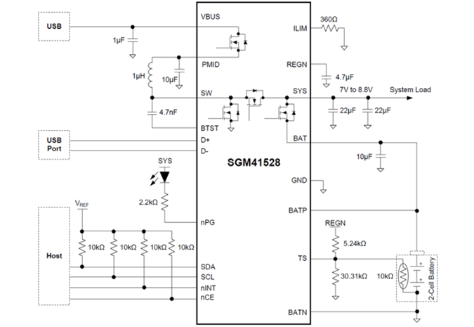
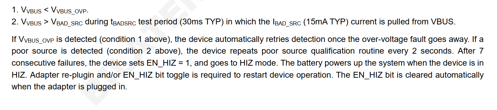
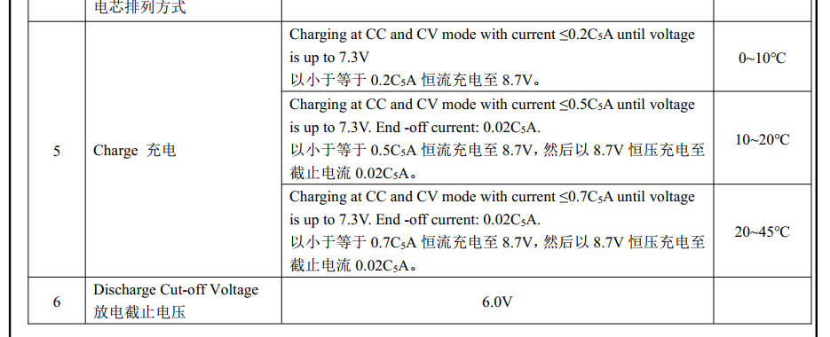

# qcom qcm2290 charger SGM41528调试记录

记录一下M9200项目双节升压充电charger驱动调试。

# 简介

随着电子产品输出功率的不断提高，单节电池所能提供的输出功率已经不能满足这些高功率产品的需求，因此两节、三节甚至更多节电池串联的供电的方案得以大量应用，如移动POS机、数码相机、蓝牙音箱、便携式打印机、无人机、机器人、电动工具等，伴随而来的是为这些串联电池包提供充电的方案需求。在各种拓扑架构的开关充电方案中，高压输入降压方案需配置专用适配器，高压输入降压-升压方案的成本太高，低压5V输入升压方案就非常适合为两节锂电池提供充电。

圣邦微电子推出的SGM41528就是这样一颗5V输入可为两节串联锂电池提供2A充电及路径管理的芯片，具有完整的涓流预充、恒流、恒压充电流程和浮充定时功能，可在双节锂电池的POS机、蓝牙音箱等电子产品中使用，它可以适配几乎任何USB接口的适配器。SGM41528支持免适配器的产品配置，为厂商和终端用户节约了成本，更为人类环保事业增添一抹绿色。

* SGM41528典型特性
  * 输入耐压：20V（最大值）；
  * 输入工作电压：3.9V至6.2V；
  * 充电电流：100mA至2.2A，50mA步进；
  * 满充电压：6.8V至9.2V，10mV步进；
  * 充电效率：92.5%@1A，VBAT = 7.6V；
  * 最大反向Buck模式OTG电流：2A；
  * OTG放电效率：94.5%@5V，1A；
  * 支持脉冲频率调制（PFM）轻载高效模式；
  * 轻载Out-of-Audio模式可选；
  * 完整的涓流预充、恒流、恒压充电流程；
  * 可配置的浮充定时功能；
  * BC1.2，自动识别SDP、CDP、DCP和非标适配器；
  * 输入电压、输入电流动态功率跟踪；
  * 适配器最大功率跟踪功能；
  * 窄电压直流充电（NVDC）功率路径管理；
  * BATFET导通阻抗13mΩ；
  * 16-Bit ADC监控各电压、电流、负温度系数（NTC）、结温；
  * 可编程JEITA；
  * 灵活易用的I2C接口；
  * 高精度满充电压；
  * 高精度恒流电流；
  * 过热、过流、过压、短路等多重安全保护；
  * 符合环保理念的WLCSP-2.1×2.1-25B绿色封装。

# SGM41528典型应用电路

# FUNCTIONAL BLOCK DIAGRAM

# SGM41528集成16-Bit高精度ADC

* ADC转换速度可调；
* ADC有效分辨率可调；
* IBUS：0A至4A，1mA步进；
* ICHG：0A至4A，1mA步进；
* VBUS：0V至6.5V，1mV步进；
* VBAT：0V至10V，1mV步进；
* VSYS：0V至10V，1mV步进；
* VTS：0%至94.9% (of VREG)，0.098%步进；
* VTDIE：0℃至128℃，0.5℃步进。

# mp2721差异化对比

我们已经搭建好了pax-charger架构，所以只需要将mp2721驱动拷贝一份配置不同寄存器即可，对比一下差异化的地方。

# HIZ

bms中power_path功能由HIZ取代，EN_HIZ是开启高阻态，从框架图中可知，如果进入高阻态，VBUS的电就过不来了，系统由电池供电。

从`FUNCTIONAL BLOCK DIAGRAM`图中可以看到ic有OVP等保护功能，从datasheet上看，只要进入保护状态，则ic进入HIZ模式。

翻译：
OVP连续7次失败后，设备设置 EN_HIZ = 1，并进入 HIZ 模式。 当设备处于工作状态时，此时电池为系统供电。
需要重新插入适配器或者EN_HIZ 位切换才能重新启动设备操作。 EN_HIZ 位自动清零

# 电池充电情况

