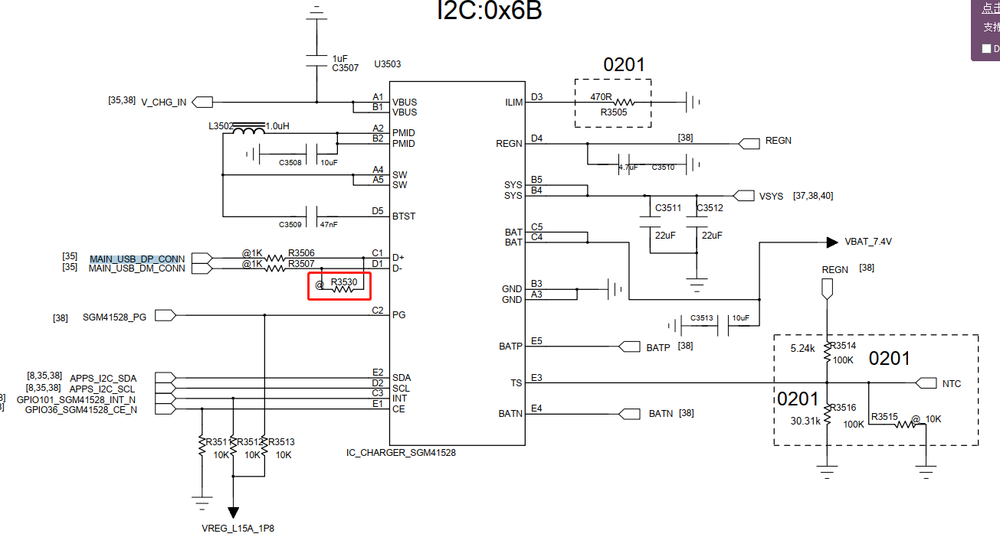
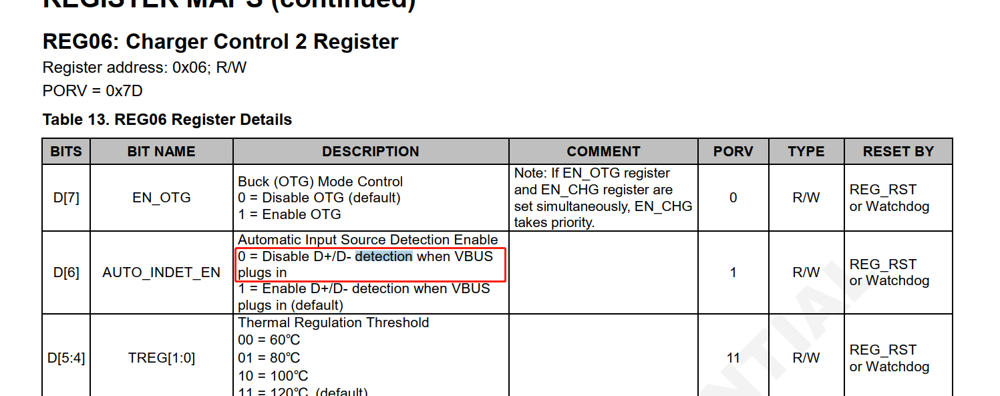
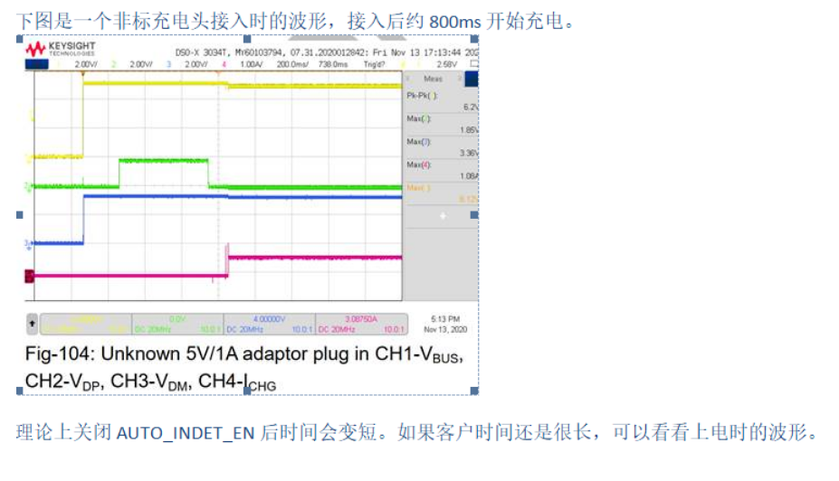
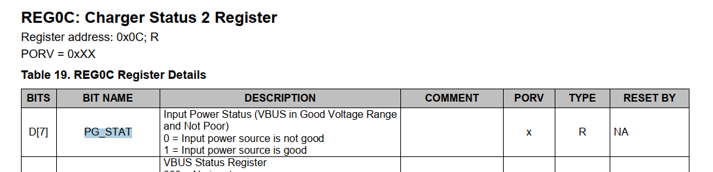
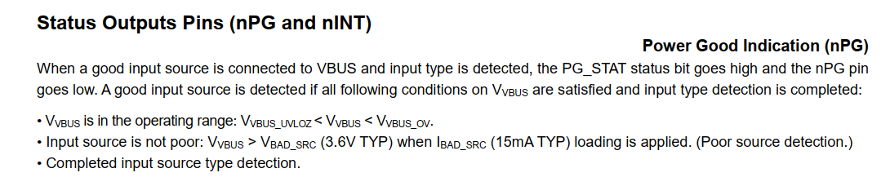
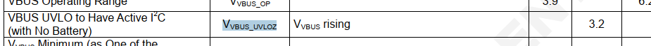

# qcom charger充电状态上报时间优化

发现有的charger ic插入充电后，充电状态变化很慢，看一下原理

# 参考


# 现象

我们使能充电后，充电状态从未充电到充电，这个时间很长，大概要600ms~800ms之间，比如这个打印，使能充电后600ms都还是读到未充电状态,log如下：
```log
[  923.025140] PAX_CHG: reg :6  write data:0x7d
[  923.029527] PAX_CHG: enable_charging en: 1 last_en: 1

[  923.635303] PAX_CHG: reg:0xb  read data:0x0
[  923.639707] PAX_CHG: update charger status = Not charging
```

# sgm41528上报原理

据了解，charger ic插入usb后进行以下4个步骤：

1. Poor power source detection (qualification).
2. Input power source type detection. (Based on D+/D-inputs. It is used to set the default input current limit(IINDPM[4:0])).
3. REGN LDO power-up.
4. DC/DC converter power-up.

VBUS 接入后，判断满足 VBUS PRENSENT (3.6V) <VBUS <VBUS OV后, delay230ms 开始 poor source 检测 (30ms) 。 然后开始 Input source type 检测，这段时间遵循 BC1.2 协议，不同的类型检测时间不同,如果是非标充电头时间会长些，大约是 500ms 多。lnput source type 检测完成后开始启动PMID、REGN、VSYS ，共约 30ms.

因为我们硬件上D+/D- charger端是短接的，没用到。



我们可以通过关闭charger端的D+/D- detection来节约时间，但是第一步的260ms和第3步30ms一供290ms不能省略。




# mp2721上报原理

INPUT POWER ON When an input source is plugged in, the IC detects the input source type and sets the input current limit before the buck converter starts. The power up sequence from input source is as below:
1. VIN detected
2. Hold-off timer (250ms)
3. Input source type detection
4. Set input current limit
5. Buck converter starts if EN_BUCK=1
6. Charging starts if EN_CHG=1

* Hold-off timer介绍：
When a valid input source is detected, the IC runs a hold-off timer (tHOLD=250ms) before detecting the input source type. The hold-off timer can be bypassed by setting HOLDOFF_TMR bit to 0

由于没有D+/D- detection，那么第2和第3步可以省略，理论上：
1. 关掉AUTODPDM 关掉了检测D+D-，节约大概100-300mS
2. 关掉Hold off Timer ，关掉了检测D+D-之前的一段 延时，节约大概250mS

# 优化后

* mp2721：优化后115ms

```log
[  509.475726] tcpc_notifier_call, old_state = UNATTACHED, new_state = ATTACHED_SNK
[  509.571178] PAX_CHG: reg :9  write data:0x53
[  509.575491] PAX_CHG: enable_charging en: 1 last_en: 0
[  509.594595] PAX_CHG: update charger status = Charging
```

优化前347ms：
```log
[  181.782260] tcpc_notifier_call, old_state = UNATTACHED, new_state = ATTACHED_SNK

[  182.229914] healthd: battery l=81 v=4087 t=30.0 h=2 st=2 c=-246000 fc=5047000 cc=2 chg=u
```

* sgm41528:优化后从typec插入到识别401ms
```log
[  544.289745] PAX_CHG: bms_notify_event evt = SET_CHG_EN en:1 //typec检测到插入
[  544.289748] PAX_CHG: _pax_enable_charging en:1
[  544.289755] PAX_CHG: pax_bat_exist_from_cmdline = 1
[  544.309555] PAX_CHG: _is_charger_present:status:0
[  544.309833] PAX_CHG: reg:0x6  read data:0x0
[  544.314744] healthd: battery l=89 v=8380 t=33.0 h=2 st=3 c=0 fc=5600000 cc=1 chg=
[  544.318519] PAX_CHG: _get_en_charge: en:0
[  544.318818] PAX_CHG: reg:0x6  read data:0x0
[  544.334459] PAX_CHG: _set_otg_enable now_status:0 set_status:0
[  544.341767] PAX_CHG: reg:0xc  read data:0x0
[  544.346196] PAX_CHG: _is_charger_present:status:0
[  544.346529] PAX_CHG: reg:0x6  read data:0x0
[  544.355208] PAX_CHG: _get_en_charge: en:0
[  544.359260] PAX_CHG: sgm41528_enable_charger last: 0 en: 1
[  544.365709] PAX_CHG: reg :6  write data:0x3d
[  544.370012] PAX_CHG: enable_charging en: 1 last_en: 0 //使能充电
[  544.375172] PAX_CHG: pax_charger_update, delay<300>
[  544.380571] PM2250_charger: smblite_typec_attach_detach_irq_handler: attached sink_src_mode = 0
[  544.397134] PAX_CHG: reg:0xc  read data:0x1
[  544.401680] PAX_CHG: _is_charger_present:status:1
[  544.408194] PAX_CHG: reg:0x3  read data:0x7
[  544.413046] healthd: battery l=89 v=8380 t=33.0 h=2 st=3 c=0 fc=5600000 cc=1 chg=u
[  544.424926] PAX_CHG: reg:0xc  read data:0x1
[  544.429199] PAX_CHG: _is_charger_present:status:1
[  544.435501] PAX_CHG: reg:0x3  read data:0x7
[  544.644303] PAX_CHG: psy_charger_set_property: prop:68 5
[  544.651312] PAX_CHG: set charge_type: DCP info->attach = 1
[  544.664605] PAX_CHG: _wake_up_charger:
[  544.669209] PAX_CHG: pax_is_charger_on chr_type = [DCP] last_chr_type = [Unknown]
[  544.686779] PAX_CHG: pax_charger_plug_in
[  544.690770] PAX_CHG: update charger status = Charging
```

* 优化前一共花了7s：
```log
[  292.487110] PM2250_charger: typec_src_insertion: typec_src_insertion
[  292.493516] bms_notify_call_chain
[  292.497167] PAX_CHG: bms_notify_event evt = SET_OTG_EN en:0
[  292.502788] PAX_CHG: sgm41528_set_otg_enable en: 0
[  292.503578] healthd: battery l=94 v=8458 t=30.0 h=2 st=3 c=0 fc=5600000 cc=1 chg=
[  292.508495] PM2250_charger: smblite_typec_attach_detach_irq_handler: attached sink_src_mode = 0
[  292.537724] healthd: battery l=94 v=8458 t=30.0 h=2 st=3 c=0 fc=5600000 cc=1 chg=
[  292.686750] PAX_CHG: set charge_type: SDP info->attach = 1
[  292.692835] PAX_CHG: pax_is_charger_on chr_type = [SDP] last_chr_type = [Unknown]
[  292.700965] PAX_CHG: pax_charger_plug_in
[  292.707382] PAX_CHG: _set_otg_enable now_status:0 set_status:0
[  292.709700] msm-usb-ssphy-qmp 1615000.ssphy: USB QMP PHY: Update TYPEC CTRL(2)
[  292.713856] PAX_CHG: sgm41528_enable_charger last: 0 en: 1
[  292.727322] PAX_CHG: enable_charging en: 1 last_en: 0
[  292.727734] msm-dwc3 4e00000.ssusb: DWC3 exited from low power mode
[  292.732431] PAX_CHG: pax_charger_update, delay<40>
[  292.732829] PAX_CHG: [SW_JEITA] Battery Normal Temperature between 20 and 45 !!
[  292.751304] PAX_CHG: [SW_JEITA]preState:3 newState:3 tmp:30 cv:0
[  292.757399] PAX_CHG: tmp:30 (jeita:1 sm:3 cv:0 en:1) thm_sm:1 en:1 can_en:1
[  292.765522] PAX_CHG: chg:-1,-1,500,500 type:4:0 aicl:-1 bootmode:0 pd:0
[  292.770817] healthd: battery l=94 v=8458 t=30.0 h=2 st=4 c=0 fc=5600000 cc=1 chg=u
[  292.772127] PAX_BAT: [status:Not charging, health:Good, present:1, tech:Li-ion, capcity:94,cap_rm:5264 mah, vol:8460 mv, temp:30, curr:0 ma, ui_soc:94]
[  292.772153] PAX_BAT: pax_battery_external_power_changed event, online:1, status:3, cur_chr_type:4
[  292.772417] PAX_CHG: do_algorithm input_current_limit:500 charging_current_limit:500
[  292.815763] PAX_BMS: CHG [online: 1, type: 4, vol: 5134000, cur: 0, time: 0], BAT [present: 1, status: 3, vol: 8460000, cur: 0, resistance: 0, temp: 300, soc: 94], OTHER [skin_temp: 0, chg_vote: 0x0, notify_code: 0x0],
[  292.835639] PAX_BMS:pax_bms_external_power_changed online = 1
[  292.878117] healthd: battery l=94 v=8460 t=30.0 h=2 st=4 c=0 fc=5600000 cc=1 chg=u
[  292.894358] PAX_CHG: CHG [online: 0, type: SDP, status: Not charging, fault: 0x8,AICR = 500mA, MIVR = 4400mV, IEOC = 100mA, CV = 8700mV,ICHG = 500mA, IBAT = 0mA, VBAT = 8507mV, IBUS = 0mV, VBUS = 5134mV, VSYS = 8483mV]
[  292.919701] healthd: battery l=94 v=8460 t=30.0 h=2 st=4 c=0 fc=5600000 cc=1 chg=u
[  292.944266] msm-dwc3 4e00000.ssusb: Avail curr from USB = 100
[  293.032098] android_work: sent uevent USB_STATE=CONNECTED
[  293.048293] msm-dwc3 4e00000.ssusb: Avail curr from USB = 2
[  293.056820] init: processing action (pax.ctrl.usb.plug=in && sys.usb.mode=pax) from (/init.paxdroid.common.rc:182)
[  293.059660] configfs-gadget gadget: high-speed config #1: b
[  293.196955] msm_pcm_chmap_ctl_put: substream ref_count:0 invalid
[  293.232275] __afe_port_start: port id: 0xb030
[  293.236862] afe_get_cal_topology_id: cal_type 8 not initialized for this port 45104
[  293.244689] afe_send_port_topology_id: AFE set topology id 0x0  enable for port 0xb030 ret -22
[  293.253321] send_afe_cal_type: cal_index is 0
[  293.257812] send_afe_cal_type: dev_acdb_id[170] is 14
[  293.262881] afe_find_cal: cal_index 0 port_id 0xb030 port_index 170
[  293.269295] afe_find_cal: no matching cal_block found
[  293.274459] send_afe_cal_type cal_block not found!!
[  293.279738] afe_send_hw_delay: port_id 0xb030 rate 48000 delay_usec 0 status 0
[  293.297857] q6asm_send_cal: cal_block is NULL
[  297.732989] PAX_CHG: pax_is_charger_on chr_type = [SDP] last_chr_type = [SDP]
[  297.744396] PAX_CHG: [SW_JEITA] Battery Normal Temperature between 20 and 45 !!
[  297.752071] PAX_CHG: [SW_JEITA]preState:3 newState:3 tmp:30 cv:0
[  297.758362] PAX_CHG: tmp:30 (jeita:1 sm:3 cv:0 en:1) thm_sm:1 en:1 can_en:1
[  297.766989] PAX_CHG: chg:-1,-1,500,500 type:4:0 aicl:-1 bootmode:0 pd:0
[  297.773916] PAX_CHG: do_algorithm input_current_limit:500 charging_current_limit:500
[  297.793896] PAX_CHG: CHG [online: 1, type: SDP, status: Charging, fault: 0x0,AICR = 500mA, MIVR = 4400mV, IEOC = 100mA, CV = 8700mV,ICHG = 500mA, IBAT = 86mA, VBAT = 8579mV, IBUS = 400mV, VBUS = 4942mV, VSYS = 8585mV]

[  299.385318] PAX_BAT: [status:Charging, health:Good, present:1, tech:Li-ion, capcity:94,cap_rm:5264 mah, vol:8508 mv, temp:30, curr:49 ma, ui_soc:94]
[  299.407896] healthd: battery l=94 v=8508 t=30.0 h=2 st=2 c=49000 fc=5600000 cc=1 chg=u
```

# 充电底座快速拔插后online为1很慢导致上报慢

充电底座快速拔插后发现online为1很慢，导致闪电图标切换太慢，log如下：
```log
[ 1052.924983] PAX_CHG: pax_charger_external_power_changed event, name:pax-usb base charger online: 0 //上次拔出
[ 1052.934450] PAX_CHG: _wake_up_charger:
[ 1052.938396] PAX_CHG: pax_is_charger_on chr_type = [Unknown] last_chr_type = [ACA]

[ 1053.894733] PAX_CHG: pax_charger_external_power_changed event, name:pax-usb base charger online: 1 //插入
[ 1053.906469] PAX_CHG: _wake_up_charger:
[ 1053.910709] PAX_CHG: pax_is_charger_on chr_type = [ACA] last_chr_type = [Unknown]

[ 1053.918545] PAX_CHG: pax_charger_plug_in
[ 1053.923337] PAX_CHG: reg:0xc  read data:0x0
[ 1053.927612] PAX_CHG: _pax_enable_charging en:1 //使能充电
[ 1053.931060] PAX_CHG: _is_charger_present:status:0

[ 1054.072718] PAX_CHG: pax_charger_update, delay<250> //延迟250ms上报

[ 1054.331056] PAX_CHG: update charger status = Not charging //上报未充电状态
[ 1054.337546] PAX_CHG: reg:0xc  read data:0x0
[ 1054.341807] PAX_CHG: _is_charger_present:status:0 //闪电图标也是0

//等到下一次电池上报参刷新状态
[ 1058.445894] PAX_BAT: [status:Charging, health:Good, present:1, tech:Li-ion, capcity:42,cap_rm:2352 mah, vol:7850 mv, temp:32, curr:864 ma, ui_soc:42]
[ 1058.460169] icnss: Battery Percentage: 42
[ 1058.465216] PAX_CHG: reg:0xc  read data:0x1
[ 1058.474636] PAX_CHG: _is_charger_present:status:1
[ 1058.481098] PAX_CHG: reg:0x3  read data:0xf
[ 1058.486277] healthd: battery l=42 v=7850 t=32.0 h=2 st=2 c=864000 fc=5600000 cc=1 chg=u
```

_is_charger_present函数查看的是PG_STAT位，表示vbus是否在3.2~ovp之间：





后面重启未复现该问题，继续观察。