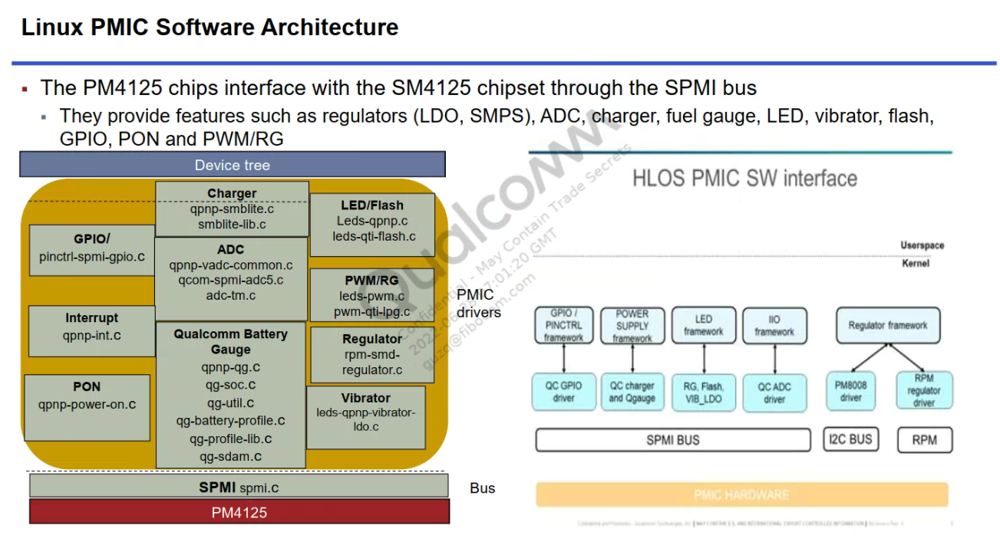
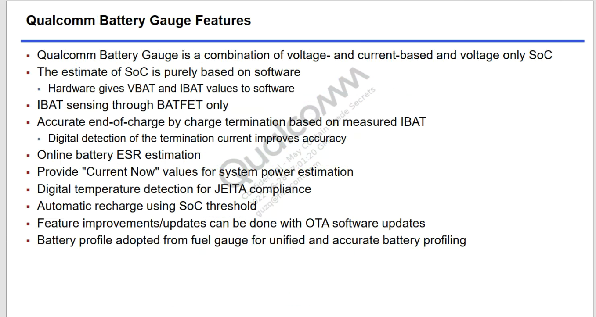
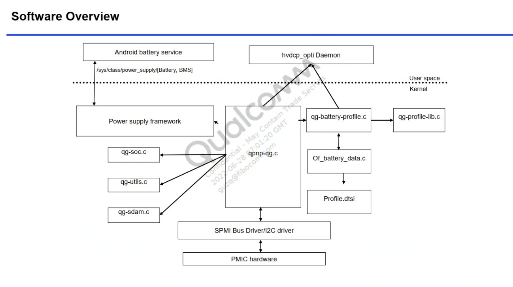
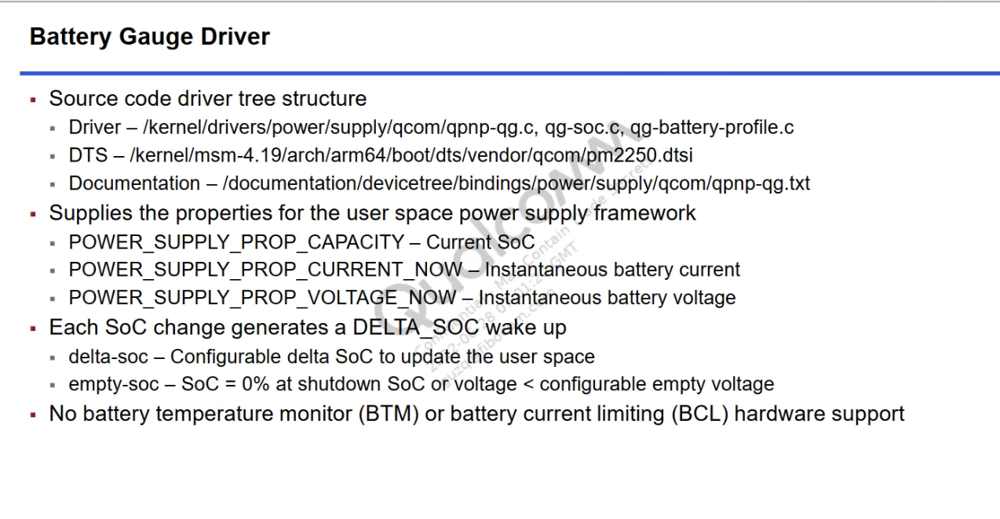

# 概述

高通A665x charger mp2250架构理解。 

# 参考

* [0012_移远提供外置电量计移植培训](refers/0012_移远提供外置电量计移植培训)
* [mp2721_datasheet](refers/mp2721_datasheet)
* [prolin_mp2723_kernel4.14参考代码](refers/prolin_mp2723_kernel4.14参考代码)

# 软硬件特性

* 总体功能：



* charger特性：


* gauge特性：



* 软件架构：



* 涉及文件路径：



# 分析

* 首先查看高通原始用的charger，`make menuconfug-> Device Drivers > Power supply class support > Qualcomm Technologies, Inc. Charger and Fuel Gauge support`如下，可以看到是`SMB1355 Slave Battery Charger`和`SMB1398 power supply framework based driver`:


对应Kconfig及文件如下：

```C++
Kconfig:
config SMB1355_SLAVE_CHARGER
        tristate "SMB1355 Slave Battery Charger"
        depends on MFD_I2C_PMIC
        help
          Say Y to include support for SMB1355 Battery Charger.
          SMB1355 is a single phase 5A battery charger.
          The driver supports charger enable/disable.
          The driver reports the charger status via the power supply framework.
          A charger status change triggers an IRQ via the device STAT pin.

config SMB1398_CHARGER
        tristate "SMB1398 power supply framework based driver"
        depends on MFD_I2C_PMIC
        help
          Say Y to include the support of SMB1398 Charge driver based on power
          supply framework.
          SMB1398 is a combo charger chip which can work in different modes:
          (1) DIV2 charge pump mode to work as a companion charger to be paired
              with Qualcomm Technologies, Inc.’s family of standalone chargers;
          (2) DIV2 and 3-level buck combo mode to regulate the output power from
              wireless charger receiver and provide the input for downstream
              chargers.

config QPNP_SMB5
        tristate "SMB5 Battery Charger"
        depends on MFD_SPMI_PMIC
        help
          Say Y to enables support for the SMB5 charging peripheral.
          The QPNP SMB5 charger driver supports the charger peripheral
          present in the chip.
          The power supply framework is used to communicate battery and
          usb properties to userspace and other driver consumers such
          as fuel gauge, USB, and USB-PD.
          VBUS and VCONN regulators are registered for supporting OTG,
          and powered Type-C cables respectively.

config QPNP_SMBLITE
        tristate "SMBLITE Battery Charger"
        depends on MFD_SPMI_PMIC
        help
          Say Y to enables support for the SMBLITE charging peripheral.
          The QPNP SMBLITE charger driver supports the charger peripheral
          present in the chip.
          The power supply framework is used to communicate battery and
          usb properties to userspace and other driver consumers such
          as fuel gauge and USB.
          VBUS regulator is registered for supporting OTG.

config QPNP_QG
        bool "QPNP Qgauge driver"
        depends on MFD_SPMI_PMIC
        help
          Say Y here to enable the Qualcomm Technologies, Inc. QGauge driver
          which uses the periodic sampling of the battery voltage and current
          to determine the battery state-of-charge (SOC) and supports other
          battery management features.


Makefile:
obj-$(CONFIG_SMB1355_SLAVE_CHARGER)     += smb1355-charger.o pmic-voter.o
obj-$(CONFIG_SMB1398_CHARGER)           += smb1398-charger.o pmic-voter.o

obj-$(CONFIG_QPNP_QG)                   += qpnp-qg.o pmic-voter.o qg-util.o qg-soc.o qg-sdam.o qg-battery-profile.o qg-profile-lib.o fg-alg.o

obj-$(CONFIG_QPNP_SMB5)                 += step-chg-jeita.o battery.o qpnp-smb5.o smb5-lib.o pmic-voter.o storm-watch.o schgm-flash.o
obj-$(CONFIG_QPNP_SMBLITE)              += step-chg-jeita.o battery.o qpnp-smblite.o smblite-lib.o pmic-voter.o storm-watch.o schgm-flashlite.o
```

* `vendor/bengal-perf_defconfig`发现以下：

```makefile
CONFIG_QPNP_QG
CONFIG_SMB1398_CHARGER
CONFIG_SMB1355_SLAVE_CHARGER
CONFIG_QPNP_SMBLITE
CONFIG_QPNP_SMB5

Makefile:
obj-$(CONFIG_QPNP_SMB5)                 += step-chg-jeita.o battery.o qpnp-smb5.o smb5-lib.o pmic-voter.o storm-watch.o schgm-flash.o
obj-$(CONFIG_QPNP_QG)                   += qpnp-qg.o pmic-voter.o qg-util.o qg-soc.o qg-sdam.o qg-battery-profile.o qg-profile-lib.o fg-alg.o
obj-$(CONFIG_QPNP_SMBLITE)              += step-chg-jeita.o battery.o qpnp-smblite.o smblite-lib.o pmic-voter.o storm-watch.o 
obj-$(CONFIG_SMB1355_SLAVE_CHARGER)     += smb1355-charger.o pmic-voter.o
obj-$(CONFIG_SMB1398_CHARGER)           += smb1398-charger.o pmic-voter.oschgm-flashlite.o
```

* dts中匹配到的文件如下:
```log
qpnp-smb5.c:未添加
wugn@jcrj-tf-compile:a665x$ ack qcom,qpnp-smb5

qpnp-smblite.c:已添加
wugn@jcrj-tf-compile:a665x$ ack qcom,qpnp-smb
pm2250.dtsi
227:            pm2250_charger: qcom,qpnp-smblite {
228:                    compatible = "qcom,qpnp-smblite";

smb1398-charger.c:未添加
wugn@jcrj-tf-compile:a665x$ ack qcom,smb1398-charger
smb1355-charger.c：未添加
wugn@jcrj-tf-compile:a665x$ ack parallel

qpnp-qg.c:添加了qcom,qpnp-qg-lite驱动：
wugn@jcrj-tf-compile:a665x$ ack qcom,qpnp-qg
pm2250.dtsi
193:                    compatible = "qcom,qpnp-qg-lite";
wugn@jcrj-tf-compile:a665x$
```

也就是说目前qcm2290中用到如下文件：

```
obj-$(CONFIG_QPNP_QG)                   += qpnp-qg.o pmic-voter.o qg-util.o qg-soc.o qg-sdam.o qg-battery-profile.o qg-profile-lib.o fg-alg.o
obj-$(CONFIG_QPNP_SMBLITE)              += step-chg-jeita.o battery.o qpnp-smblite.o smblite-lib.o pmic-voter.o storm-watch.o 
```