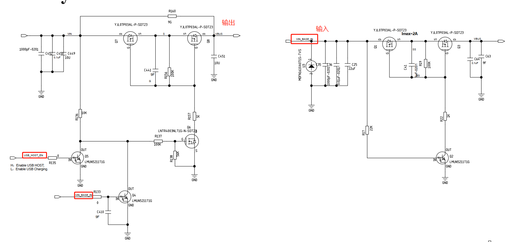
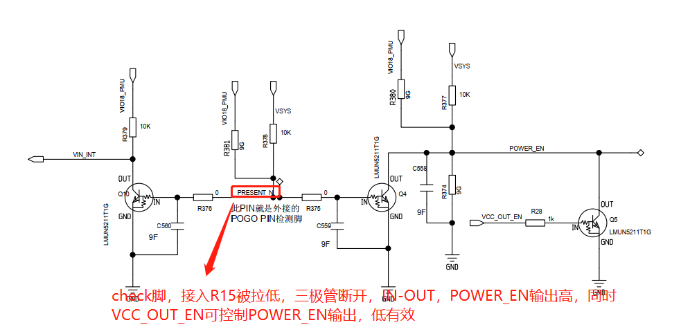

# 概述

M8项目USB_SWITCH功能介绍。

## 参考

* 驱动代码：

[pax_usb_switch.c](refers/pax_usb_switch.c)

## 硬件架构

* 硬件架构

V03版本：


V04版本：


主要修改为，增加CHECK脚检测R15状态，插入则打开VOUT电。BBL供电去掉，单独一路VOUT供电，由R15内部转BBL。


### 1.USB逻辑图


### 2.Vbus(VIN)逻辑图

USB_HOST_EN为高，VIN是输出方向，输出5v，USB_HOST_EN低电平VIN为输入方向，相当于充电，该功能是监听typec vbus状态改变的，比如当接入R15时，会接收到typec通知`TCP_NOTIFY_SOURCE_VBUS`打开vbus。



### 3.Check脚逻辑图


目前软件不控制VCC_OUT_EN，也就是说只要Check脚检测在位，POWER_EN会输出电压，VOUT就会供电，完全由硬件控制。


### 4.涉及的GPIO作用

```
USB_HOST_EN （AE23）  双输入电源方向控制，高电平输出Vbus，低电平vbus输入

USB_SW1_SEL  （F24）   USB信号切换开关

USB_SW2_SEL  （H24）   USB信号切换开关

GL850_EN     （AD24）  控制HUB芯片POWER

VCC_OUT_EN  （AD23）   在POGO端接USB device时候控制5V输出；开机默认5v，由power_control等接口控制，关机时由硬件做插入检测，插入R15输入高，拔出低。
```

## 软件交互逻辑

* 目前需要两种切换，第一是usb role mode切换(host device)，第二是usb swtich通路切换(hub or OTG)。

### 1.usb swtich通路切换(hub or OTG)

```
host模式:
USB_SW1_SEL  （F24）   USB信号切换开关 高

USB_SW2_SEL  （H24）   USB信号切换开关 高

GL850_EN     （AD24）  控制HUB芯片POWER 高

device模式：
USB_SW1_SEL  （F24）   USB信号切换开关 低

USB_SW2_SEL  （H24）   USB信号切换开关 低

GL850_EN     （AD24）  控制HUB芯片POWER 低
```

### 2. usb role mode切换逻辑(host device)


* 目前是通过cc脚切换host device，目前默认不接任何设备为host。
* 1.没有皮套
  * 插入sdp(电脑)或者dcp(充电器)，切换成device。
  * 拔出usb，切换成host。
* 2.有皮套
  * 插入sdp(电脑)或者dcp(充电器)，通知栏弹框，提示用户手动切换成host还是device。
  * 拔出usb，切换成host。
* 3.灭屏，host等待10s切换成device，休眠。
* 4.亮屏，device切换成host。

### 3.VIN方向控制

```
充电方向:
1.PD_ROLE_SINK  作为输入
2.PD_ROLE_SOURCE  输出，但是驱动不需要做
3.TCP_NOTIFY_SOURCE_VBUS 跟随系统vbus方向
```

### 4.usb2.0亮灭屏逻辑

```C++
usb20_host.c:
static int musb_fb_notifier_call(struct notifier_block *self, unsigned long event, void *data)
{
	struct fb_event *evdata = data;
	int blank;

	if (event != FB_EVENT_BLANK)
		return 0;

	blank = *(int *)evdata->data;

	DBG(0, "blank: %d\n", blank);

	switch (blank) {
		case FB_BLANK_UNBLANK: //亮屏
			{
				bool connect = false;

				mtk_musb->lcd_state = blank;

				if (mtk_musb->pogo_dev_detect_type != POGO_DETECT_BY_CC) {     //条件永远成立，dts配置的是gpio检测pogo dev
					if (mtk_musb->default_mode == MUSB_HOST) {  //收到亮屏，typec是没接或者接了充电器，则切成host。
						if ((mtk_musb->typec_state == TYPEC_UNATTACHED)
								||  (mtk_musb->usb_type == POWER_SUPPLY_USB_TYPE_DCP)) {
							connect = true;
						}
					}
					else {
						if (mtk_musb->r15_state == R15_STATUS_ONLINE) {//收到亮屏，CC没检测到设备，R15在线（因为灭屏且device有10s延迟），则切成host。
							if (mtk_musb->typec_state == TYPEC_UNATTACHED) {
								connect = true;
							}
						}
					}
				}
				else {
					if (mtk_musb->r15_state == R15_STATUS_ONLINE) {
						mt_usb_vbus_on(0);
						connect = true;
					}
				}

				if (connect) {
					mt_usb_dev_disconnect();
					mt_usb_host_connect(100);
				}
			}
			break;
		case FB_BLANK_POWERDOWN: //灭屏
			{
				bool disconnet = false;

				mtk_musb->lcd_state = blank;

				if (mtk_musb->pogo_dev_detect_type != POGO_DETECT_BY_CC) {
					if (mtk_musb->default_mode == MUSB_HOST) { 
						if (mtk_musb->typec_state == TYPEC_UNATTACHED) {//typec没接设备，默认是host，按下power键则切成device。
							disconnet = true;
						}
					}
					else {
						if (mtk_musb->r15_state == R15_STATUS_ONLINE) { //默认开机是device,此时是host，按下power键则切成device。
							disconnet = true;
						}
					}
				}
				else {
					if (mtk_musb->r15_state == R15_STATUS_ONLINE) {//如果pogo dev是通过cc检测的，R15在线，按下power键关闭vbus和切成device。
						mt_usb_vbus_off(1000);
						disconnet = true;
					}
				}

				if (disconnet) {
					mt_usb_host_disconnect(10000);
				}
			}
			break;
		default:
			break;
	}

	return 0;
}
```

### 5.usb_switch亮灭屏逻辑

usb_switch亮灭屏逻辑其实和usb20切换逻辑一样。

```C++
static int pax_usb_fb_notifier_call(struct notifier_block *self, unsigned long event, void *data)
{
	struct fb_event *evdata = data;
	int blank;
	struct usb_switch_data *usb_sdata = (struct usb_switch_data *)container_of(
			self, struct usb_switch_data, pax_usb_fb_notifier);

	if (event != FB_EVENT_BLANK)
		return 0;

	blank = *(int *)evdata->data;

	switch (blank) {
		case FB_BLANK_UNBLANK:
			if ((usb_sdata->typec_state == TYPEC_UNATTACHED) || (usb_sdata->usb_type == POWER_SUPPLY_USB_TYPE_DCP)) //收到亮屏，typec是没接或者接了充电器，则切成host。
				usb_host_switch(usb_sdata, 1);

			usb_sdata->lcd_state = blank;
			break;
		case FB_BLANK_POWERDOWN:
			if (usb_sdata->typec_state == TYPEC_UNATTACHED) { //收到灭屏，typec是没接任何设备，延迟10s开启工作队列切换device。
				schedule_delayed_work(&usb_sdata->usb_switch_work, msecs_to_jiffies(10000));
			}

			usb_sdata->lcd_state = blank;
			break;
		default:
			break;
	}

	return 0;
}

static void do_usb_switch_work(struct work_struct *work)
{
	struct usb_switch_data *data = (struct usb_switch_data *)
						container_of(work, struct usb_switch_data, usb_switch_work.work);

	usb_host_switch(data, 0); //切host

}
```

### 6.usb20 role切换逻辑

```C++
static int otg_tcp_notifier_call(struct notifier_block *nb,
		unsigned long event, void *data)
{
	struct tcp_notify *noti = data;

	switch (event) {
	case TCP_NOTIFY_SOURCE_VBUS: //系统检测DFP打开vbus，UDP关闭vbus
		DBG(0, "source vbus = %dmv\n", noti->vbus_state.mv);
		if (noti->vbus_state.mv)
			mt_usb_vbus_on(0);
		else
			mt_usb_vbus_off(0);
		break;
	case TCP_NOTIFY_TYPEC_STATE:
		DBG(0, "TCP_NOTIFY_TYPEC_STATE, old_state=%d, new_state=%d\n",
				noti->typec_state.old_state,
				noti->typec_state.new_state);

		/* Add-BEGIN by (shanliangliang@paxsz.com), 2021/08/15 add for M8 usb otg */
		mtk_musb->typec_state = noti->typec_state.new_state;
		/* Add-END by (shanliangliang@paxsz.com), 2021/08/15 add for M8 usb otg */

		if (noti->typec_state.old_state == TYPEC_UNATTACHED &&
			noti->typec_state.new_state == TYPEC_ATTACHED_SRC) { //M8 typec识别成source，比如接U盘，切host
			DBG(0, "OTG Plug in\n");
			mt_usb_dev_disconnect();
			mt_usb_host_connect(100);
		/* Add-BEGIN by (shanliangliang@paxsz.com), 2021/09/23 add for M8 usb otg */
		} else if (noti->typec_state.old_state == TYPEC_UNATTACHED &&
			noti->typec_state.new_state == TYPEC_ATTACHED_SNK) { //pogo pin不在位，接了电脑或者充电器，识别成sink，断开host。
			if (!((mtk_musb->pogo_dev_detect_type == POGO_DETECT_BY_EXT_PIN) && (mtk_musb->pogo_dev_state == POGO_DEV_STATE_ONLINE))) {
				mt_usb_host_disconnect(0);
				mt_usb_connect();
			}
		/* Add-END by (shanliangliang@paxsz.com), 2021/09/23 add for M8 usb otg */
		} else if ((noti->typec_state.old_state == TYPEC_ATTACHED_SRC ||
			noti->typec_state.old_state == TYPEC_ATTACHED_SNK ||
			noti->typec_state.old_state ==
					TYPEC_ATTACHED_NORP_SRC) &&
			noti->typec_state.new_state == TYPEC_UNATTACHED) { 
			/* Add-BEGIN by (shanliangliang@paxsz.com), 2021/08/15 add for M8 usb otg */
				if (mtk_musb->default_mode != MUSB_HOST) { 
					if (is_host_active(mtk_musb)) {
						DBG(0, "OTG Plug out\n");
						mt_usb_host_disconnect(0);//拔出usb，默认device，目前是host，断开host。
					} else {
						DBG(0, "USB Plug out\n");
						mt_usb_dev_disconnect();//拔出usb，默认device，目前是device，断开usb连接。
					}

					if (mtk_musb->pogo_dev_detect_type != POGO_DETECT_BY_CC) {
						if (mtk_musb->r15_state == R15_STATUS_ONLINE) {
							mt_usb_host_connect(100);//拔出usb，默认device，R15在线说明目前是host，断开host。
						}
					}
				}
				else {
					if ((noti->typec_state.old_state != TYPEC_ATTACHED_SRC) && 
							(noti->typec_state.new_state == TYPEC_UNATTACHED)) {
						if (is_host_active(mtk_musb)) {
							//DBG(0, "OTG Plug out\n");
							//mt_usb_host_disconnect(0);
						} else {
							DBG(0, "USB Plug out\n");
							mt_usb_dev_disconnect();//拔出usb，默认host，拔出前是TYPEC_ATTACHED_SNK，目前是device，断开usb
						}
						
						if (mtk_musb->lcd_state != FB_BLANK_POWERDOWN) {
							msleep(50);
							mt_usb_host_connect(100);//拔出usb，默认host，拔出前是TYPEC_ATTACHED_SNK，当前是亮屏状态，切成host。
						}
					}
					else if ((noti->typec_state.old_state == TYPEC_ATTACHED_SRC) && 
							(noti->typec_state.new_state == TYPEC_UNATTACHED)) {
						if (mtk_musb->lcd_state == FB_BLANK_POWERDOWN) {
							if (is_host_active(mtk_musb)) {
								DBG(0, "OTG Plug out\n");
								mt_usb_host_disconnect(10000); //灭屏状态下，SRC->UNATTACHED相当于拔出U盘，当前是host模式，断开host，保证正常休眠。
							} else {
								DBG(0, "USB Plug out\n");
								mt_usb_dev_disconnect();//灭屏状态下，SRC->UNATTACHED相当于拔出U盘，当前是device，断开usb，保证正常休眠？？？不知道什么意思
							}
						}
					}
				}

				if (mtk_musb->pogo_dev_detect_type == POGO_DETECT_BY_CC) {
					if (mtk_musb->r15_state == R15_STATUS_ONLINE) {
						mtk_musb->r15_state = R15_STATUS_OFFLINE; //如果R15是CC检测的，usb拔出只有一种情况那就是R15断开了，则更新R15状态。
					}
				}

		/* Add-END by (shanliangliang@paxsz.com), 2021/08/15 add for M8 usb otg */
#ifdef CONFIG_MTK_UART_USB_SWITCH
		} else if ((noti->typec_state.new_state ==
					TYPEC_ATTACHED_SNK ||
				noti->typec_state.new_state ==
					TYPEC_ATTACHED_CUSTOM_SRC ||
				noti->typec_state.new_state ==
					TYPEC_ATTACHED_NORP_SRC) &&
				in_uart_mode) {
			pr_info("%s USB cable plugged-in in UART mode.
					Switch to USB mode.\n", __func__);
			usb_phy_switch_to_usb(); //系统默认的
#endif
		}
		break;
	case TCP_NOTIFY_DR_SWAP:
		DBG(0, "TCP_NOTIFY_DR_SWAP, new role=%d\n",
				noti->swap_state.new_role);
		if (is_host_active(mtk_musb) &&
			noti->swap_state.new_role == PD_ROLE_UFP) {
			if (!((mtk_musb->default_mode == MUSB_HOST) && (mtk_musb->usb_type == POWER_SUPPLY_USB_TYPE_DCP))) {
				DBG(0, "switch role to device\n");
				mt_usb_host_disconnect(0); //UFP、默认device，当且host，usb类型非DCP，可能是电脑，切device
				mt_usb_connect();
			}
		} else if (is_peripheral_active(mtk_musb) &&
			noti->swap_state.new_role == PD_ROLE_DFP) {
			DBG(0, "switch role to host\n");
			mt_usb_dev_disconnect(); //DFP切host
			mt_usb_host_connect(100);
		}
		break;
	}
	return NOTIFY_OK;
}
```

### 7.usb_switch切换逻辑

```C++
static void vbus_en(struct usb_switch_data *data, int on)
{
	if (gpio_is_valid(data->usb_host_en_gpio))
		gpio_set_value(data->usb_host_en_gpio, 0);
}

static int tcpc_notifier_call(struct notifier_block *nb,  unsigned long action, void *noti_data)
{
	struct tcp_notify *noti = noti_data;
	struct usb_switch_data *data = (struct usb_switch_data *)container_of(nb, struct usb_switch_data, tcpc_nb);

	pr_info("%s: action:%d\n", __func__, action);

	switch(action) {
		case TCP_NOTIFY_SOURCE_VBUS:
			vbus_en(data, !!noti->vbus_state.mv);  //跟随vbus打开关闭usb_host_en
			break;

		case TCP_NOTIFY_TYPEC_STATE:
			data->typec_state = noti->typec_state.new_state;

			if ((noti->typec_state.old_state == TYPEC_UNATTACHED) &&
					(noti->typec_state.new_state == TYPEC_ATTACHED_SRC)) {
				usb_host_switch(data, 1); //识别为DFP，打开host
			}
			else if ((noti->typec_state.old_state == TYPEC_UNATTACHED) &&
					(noti->typec_state.new_state == TYPEC_ATTACHED_SNK)) {
				if (data->pogo_dev_state != POGO_DEV_STATE_ONLINE) {
					usb_host_switch(data, 0); //识别为UFP，比如接电脑，且没插入pogo dev，打开device
				}
			}
			else if ((noti->typec_state.old_state != TYPEC_UNATTACHED) &&
					(noti->typec_state.new_state == TYPEC_UNATTACHED)) {
				if (noti->typec_state.old_state == TYPEC_ATTACHED_SRC) {
					if (data->lcd_state == FB_BLANK_POWERDOWN) {
						schedule_delayed_work(&data->usb_switch_work, msecs_to_jiffies(10000));//TYPEC_ATTACHED_SRC -> TYPEC_UNATTACHED 且是关屏状态(关屏情况下拔皮套)，延迟10s切device
					}
					else {//TYPEC_ATTACHED_SRC -> TYPEC_UNATTACHED 且是亮屏状态(亮屏情况下拔皮套)，切回默认状态(host)
						usb_host_switch(data, !!data->default_mode);
					}
				}
				else {
					usb_host_switch(data, !!data->default_mode);//TYPEC_ATTACHED_SNK -> TYPEC_UNATTACHED 且是亮屏状态(亮屏情况下拔皮套)，直接切回默认状态(host)
				}
			}
			break;

		case TCP_NOTIFY_DR_SWAP:
			if (noti->swap_state.new_role == PD_ROLE_UFP) {
				if (!((data->default_mode) && (data->usb_type == POWER_SUPPLY_USB_TYPE_DCP))) {
					usb_host_switch(data, 0); //识别成UFP，不是DCP充电器，切device
				}
			}
			else if (noti->swap_state.new_role == PD_ROLE_DFP) {
				usb_host_switch(data, 1);//识别成DFP，切host
			}
			break;

		case TCP_NOTIFY_PR_SWAP:
			if (noti->swap_state.new_role == PD_ROLE_SINK) {
				vbus_en(data, 0);
			}
			else if (noti->swap_state.new_role == PD_ROLE_SOURCE) {
				vbus_en(data, 1);
			}
			break;
	}

	return NOTIFY_OK;
}
```

### 8.pogo pin交互逻辑

#### 8.1 usb_switch发送/处理notify

* pogo dev设备检测目前放在usb_switch驱动里面，采用gpio中断方式，notify机制发送通知，亮屏情况下，pogo pin插入后将直接切为host模式。notify处理驱动分别是usb_switch和usb20驱动。
* 驱动提供应用层接口set_usb_switch_mode手动切换host/device，原因是pogo dev接入后，当接入电脑时，为了不切device断开r15，而让用户手动切。

```C++
* static int pax_usb_swtich_probe(struct platform_device *pdev)
  * pogo_detect_init(data);
    * ret = request_irq(irq, pogo_detect_irq_handle, IRQF_TRIGGER_RISING|IRQF_TRIGGER_FALLING|IRQF_NO_SUSPEND|IRQF_NO_THREAD, 
	* data->r15_nb.notifier_call = r15_status_notifier_call; //
	* INIT_DELAYED_WORK(&data->pogo_detect_dwork, pogo_detect_notify_dwork);
	* schedule_delayed_work(&data->pogo_detect_dwork, msecs_to_jiffies(500)); //开机，手动识别一次pogo dev，后续都是靠中断
	  * pogo_detect_irq_handle(gpio_to_irq(data->pogo_detect_gpio), data); //手动调用中断函数

中断处理函数：
static irqreturn_t pogo_detect_irq_handle(int irq, void *dev_id)
{
	struct usb_switch_data *data = (struct usb_switch_data *)dev_id;
	int level = 0;
	int status;

	if (gpio_is_valid(data->pogo_detect_gpio)) {
		level = gpio_get_value(data->pogo_detect_gpio);
		if (level) {
			status = POGO_DEV_STATE_ONLINE;
			SET_BIT(usb_switch_status,0);
		}
		else {
			status = POGO_DEV_STATE_OFFLINE;
			CLR_BIT(usb_switch_status,0);
		}

#ifdef CONFIG_PAX_GPIOS_CONTROL
		r15_status_notify_call_chain(SET_POGO_DEV_STATE, &status); //发送pogo dev通知
#endif
		pr_err("level: %d usb_switch_status: %d\n", level,usb_switch_status);
	}
	
	return IRQ_HANDLED;	
}

pogo dev拔插事件处理：
1.SET_USB_MODE_SWTICH是对应gpio驱动中接口：
static int set_usb_switch_mode(int value)
{
	int val;
	PAX_GPIO_DBG("set_usb_switch_mode = %d",value);

	if (!value)
		val = USB_MODE_DEV;
	else
		val = USB_MODE_HOST;

	r15_status_notify_call_chain(SET_USB_MODE_SWTICH, &val);
	return 0;
}

static int r15_status_notifier_call(struct notifier_block *self, unsigned long event, void *data)
{
	struct usb_switch_data *usb_sdata = (struct usb_switch_data *)container_of(
			self, struct usb_switch_data, r15_nb);
	int mode;

	if (event == SET_POWER_STATUS) {
		usb_sdata->r15_state = *(int *)data;
		pr_info("r15_state: %d\n", usb_sdata->r15_state);
	}
	else if (event == SET_USB_MODE_SWTICH) {
		mode = *(int *)data;
		pr_info("set usb mode: %d\n", mode);
		if (usb_sdata->lcd_state == FB_BLANK_UNBLANK) {
			if (USB_MODE_HOST == mode) {
				usb_host_switch(usb_sdata, 1);
			}
			else {
				usb_host_switch(usb_sdata, 0);
			}
		}
	}
	else if (event == SET_POGO_DEV_STATE) {
		usb_sdata->pogo_dev_state = *(int *)data;
		pr_info("pogo_dev_state: %d\n", usb_sdata->pogo_dev_state);

		if (usb_sdata->pogo_dev_state == POGO_DEV_STATE_ONLINE) {
			if (usb_sdata->lcd_state == FB_BLANK_UNBLANK) {
				usb_host_switch(usb_sdata, 1); //亮屏情况下，pogo pin插入后将直接切为host模式。
			}
		}
	}

	return NOTIFY_OK;
}
```

#### 8.2 usb20处理notify


```C++
void mt_usb_otg_init(struct musb *musb)
{
	#ifdef CONFIG_PAX_GPIOS_CONTROL
		musb->r15_state = R15_STATUS_OFFLINE;
		r15_status_notify_register_client(&musb_r15_st_notifier);
	#else
		musb->r15_state = 0;
	#endif
}

#ifdef CONFIG_PAX_GPIOS_CONTROL
static int musb_r15_st_notifier_call(struct notifier_block *self, unsigned long event, void *data)
{
	int state;
	int mode;

	if (event == SET_POWER_STATUS) {
		state = *(int *)data;
		DBG(0, "state : %d\n", state);

		if (state == R15_STATUS_OFFLINE) {
			if (mtk_musb->pogo_dev_detect_type != POGO_DETECT_BY_CC) {
				mtk_musb->r15_state = state;
			}
		}
		else if (state == R15_STATUS_ONLINE) {
			mtk_musb->r15_state = state;
		}
	}
	else if (event == SET_USB_MODE_SWTICH) {
		mode = *(int *)data;
		DBG(0, "mode: %d\n", mode);

		if (mode == USB_MODE_DEV) {
			if (mtk_musb->lcd_state == FB_BLANK_UNBLANK) {
				mt_usb_host_disconnect(0);
				mt_usb_connect();//手动切换device，对应gpio驱动set_usb_switch_mode接口
			}
		}
		else if (mode == USB_MODE_HOST) {
			if (mtk_musb->lcd_state == FB_BLANK_UNBLANK) {
				mt_usb_dev_disconnect();
				mt_usb_host_connect(100);//手动切换host，对应gpio驱动set_usb_switch_mode接口
			}
		}
	}
	else if (event == SET_POGO_DEV_STATE) {
		mtk_musb->pogo_dev_state = *(int *)data;
		if (mtk_musb->pogo_dev_detect_type == POGO_DETECT_BY_EXT_PIN) {
			if (mtk_musb->pogo_dev_state == POGO_DEV_STATE_ONLINE) {
				if (mtk_musb->lcd_state == FB_BLANK_UNBLANK) {
					mt_usb_dev_disconnect();
					mt_usb_host_connect(0);//亮屏情况下，pogo pin插入后将直接切为host模式。
				}
			}
		}
	}

	return 0;
}

static struct notifier_block musb_r15_st_notifier = {
	.priority = 97, //通知优先级？
	.notifier_call = musb_r15_st_notifier_call,
};
#endif
```