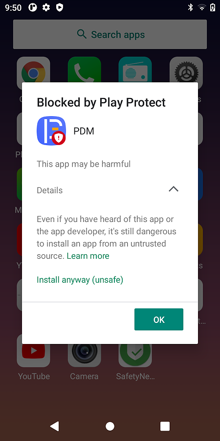

# 概述

简述GMS google play protect机制。

* [使用 Google Play 保护机制协助防范有害应用](https://support.google.com/googleplay/answer/2812853?hl=zh-Hans)
* [Android 用 platform.pk8 和 platform.x509.pem将应用升级为系统级应用](https://www.jianshu.com/p/37f37340db24)
* [一次让你搞懂Android应用签名](https://blog.fengsq.com/post/ApkSignature.html)

# 简介

Google Play 保护机制有助于确保您的设备安全无虞：

* 这一机制会在您从 Google Play 商店下载应用之前对应用运行安全检查。
* 这一机制会检查您的设备上是否存在来自其他来源的可能有害的应用。这些有害应用有时称为恶意软件。
* 这一机制会在检测到可能有害的应用时向您发出警告，并且从您的设备上移除已知的有害应用。
* 这一机制会在检测到因隐藏或不实描述重要信息而违反反垃圾软件政策的应用时，向您发出警告。
* 这一机制会在检测到应用能够获取用户权限来访问您的个人信息（这违反了我们的开发者政策）时，向您发出隐私权提醒。

## 1.开启或关闭 Google Play 保护机制

重要提示：默认情况下，Google Play 保护机制处于开启状态，不过您可以将其关闭。为安全起见，建议您始终开启 Google Play 保护机制。

* 打开 Google Play 商店应用 Google Play。
* 点按右上角的个人资料图标。
* 依次点按 Play 保护机制 接着点按 设置。
* 开启或关闭使用 Play 保护机制扫描应用。

## 2.Google Play 保护机制的运作方式

Google Play 保护机制会在您安装应用时对应用进行检查，还会定期扫描您的设备。如果此保护机制发现可能有害的应用，可能会执行以下操作：

* 向您发送通知。要移除相应应用，请点按该通知，然后点按卸载。
* 停用该应用，直到您将其卸载。
* 自动移除该应用。在大多数情况下，如果 Google Play 保护机制检测到有害应用，则会发出通知，告知您该应用已被移除。

## 3.恶意软件防护功能的运作方式

为保护您免遭受第三方恶意软件、有害网址和其他安全问题的侵害，Google 可能会接收与以下内容相关的信息：

* 您设备的网络连接
* 可能有害的网址
* 操作系统以及通过 Google Play 或其他来源安装在您设备上的应用。

Google 可能会就不安全的应用或网址向您发出警告。如果 Google 确认某个应用或网址会对设备、数据或用户造成危害，则可能会移除该应用或网址，或者阻止您安装该应用或访问该网址。

您可以在设备设置中选择停用部分防护功能。不过，Google 可能会继续接收关于通过 Google Play 安装的应用的信息，并且系统可能会继续检查通过其他来源安装在您设备上的应用，以确定是否存在安全问题（但不会将相关信息发送给 Google）。

# 现象

安装PDM应用出现如下现象：



经会议讨论，发现是PDM应用使用的是开源的share签名方式，如下：

```
mtk6762d-11\build\target\product\security:
shared.pk8
shared.x509.pem
```

# Android签名机制

系统build阶段签名机制

## 系统中有4组key用于build阶段对apk进行签名

```
Media
Platform
Shared
Testkey
```
default key是放在Android源码的/build/target/product/security目录下:
```
media.pk8与media.x509.pem；
platform.pk8与platform.x509.pem；
shared.pk8与shared.x509.pem；
testkey.pk8与testkey.x509.pem；
```
其中，*.pk8文件为私钥，*.x509.pem文件为公钥，这需要去了解非对称加密方式。

## 在apk的android.mk文件中会指定LOCAL_CERTIFICATE 变量

LOCAL_CERTIFICATE可设置的值如下：

```
LOCAL_CERTIFICATE := testkey   # 普通APK，默认情况下使用
LOCAL_CERTIFICATE := platform  # 该APK完成一些系统的核心功能,这种方式编译出来的APK所在进程的UID为system,就代表使用platform来签名，这样的话这个apk就拥有了和system相同的签名，因为系统级别的签名也是使用的platform来签名，此时使用android:sharedUserId="android.uid.system"才有用！
LOCAL_CERTIFICATE := shared    # 该APK是media/download系统中的一环
LOCAL_CERTIFICATE := media     # 该APK是media/download系统中的一环
```

如果不指定，默认使用testkey。

# 查看PDM签名信息

参考方法：
使用解压工具解压 APK 文件，在 META-INF 文件夹拿到 CERT.RSA 文件。假设 CERT.RSA 文件的路径是 C:\Users\Administrator\Desktop\CERT.RSA。在 CMD 中输入

```
输入：keytool -printcert -file  CERT.RSA

Owner: EMAILADDRESS=android@android.com, CN=Android, OU=Android, O=Android, L=Mountain View, ST=California, C=US
Issuer: EMAILADDRESS=android@android.com, CN=Android, OU=Android, O=Android, L=Mountain View, ST=California, C=US
Serial number: f2a73396bd38767a
Valid from: Thu Jul 24 05:57:59 CST 2008 until: Mon Dec 10 05:57:59 CST 2035
Certificate fingerprints:
         SHA1: 5B:36:8C:FF:2D:A2:68:69:96:BC:95:EA:C1:90:EA:A4:F5:63:0F:E5
         SHA256: 28:BB:FE:4A:7B:97:E7:46:81:DC:55:C2:FB:B6:CC:B8:D6:C7:49:63:73:3F:6A:F6:AE:74:D8:C3:A6:E8:79:FD
Signature algorithm name: MD5withRSA (disabled)
Subject Public Key Algorithm: 2048-bit RSA key
Version: 3

Extensions:

#1: ObjectId: 2.5.29.35 Criticality=false
AuthorityKeyIdentifier [
KeyIdentifier [
0000: CB 4C 7E 2C DB B3 F0 AD   A9 8D AB 79 96 8D 17 2E  .L.,.......y....
0010: 9D BB 1E D1                                        ....
]
[EMAILADDRESS=android@android.com, CN=Android, OU=Android, O=Android, L=Mountain View, ST=California, C=US]
SerialNumber: [    f2a73396 bd38767a]
]

#2: ObjectId: 2.5.29.19 Criticality=false
BasicConstraints:[
  CA:true
  PathLen:2147483647
]

#3: ObjectId: 2.5.29.14 Criticality=false
SubjectKeyIdentifier [
KeyIdentifier [
0000: CB 4C 7E 2C DB B3 F0 AD   A9 8D AB 79 96 8D 17 2E  .L.,.......y....
0010: 9D BB 1E D1                                        ....
]
]


Warning:
The certificate uses the MD5withRSA signature algorithm which is considered a security risk and is disabled.
```
可以看到`Owner: EMAILADDRESS=android@android.com`属于android通用的系统签名，所以GMS会判断该应用有风险。

# 修改方案

为了保证系统安全，更新新的platform key，如果测试或者其他应用需要系统权限，需要此key进行打包,使用pax公司paxdroid平台的签名方式，首先需要替换平台签名秘钥，然后在Android.mk文件中修改设置项，更换如下秘钥：

```
device/mediateksample/k62v1_64_pax/security/
media.pk8       networkstack.pk8       platform.pk8       README          releasekey.x509.pem  shared.x509.pem  testkey.x509.pem
media.x509.pem  networkstack.x509.pem  platform.x509.pem  releasekey.pk8  shared.pk8           testkey.pk8
```


```diff
--- a/paxdroid/packages/apps/edm/Android.mk
+++ b/paxdroid/packages/apps/edm/Android.mk
@@ -6,7 +6,7 @@ LOCAL_MODULE_TAGS := optional
 LOCAL_MODULE_SUFFIX := $(COMMON_ANDROID_PACKAGE_SUFFIX)
 #LOCAL_PRIVILEGED_MODULE :=
 LOCAL_PRODUCT_MODULE := true
-LOCAL_CERTIFICATE := PRESIGNED
+LOCAL_CERTIFICATE := platform
 LOCAL_SRC_FILES := EDM_V2.00.00_20211217_release.apk
 LOCAL_MODULE_PATH := $(TARGET_OUT_VENDOR)/operator/app
 LOCAL_DEX_PREOPT := false
```

修改后查看签名信息,Owner变成了paxdroid platform key：
```
keytool -printcert -file  CERT.RSA
Owner: EMAILADDRESS=paxdroid@paxsz.com, CN=PAX, OU=PAX, O=PAX, L=ShenZhen, ST=GuangDong, C=CN
Issuer: EMAILADDRESS=paxdroid@paxsz.com, CN=PAX, OU=PAX, O=PAX, L=ShenZhen, ST=GuangDong, C=CN
Serial number: 9ddf91dc799bf205
Valid from: Tue Sep 07 16:31:15 CST 2021 until: Sat Jan 23 16:31:15 CST 2049
Certificate fingerprints:
         SHA1: 31:70:BE:4F:07:1E:18:13:9B:6F:DE:C0:70:66:7D:7A:34:9F:41:3F
         SHA256: FC:AD:A3:F7:63:72:DD:35:A4:E3:8B:48:E6:A8:25:2C:AE:13:F7:3F:AB:B2:98:AA:D6:93:62:C0:1A:77:77:D9
Signature algorithm name: SHA256withRSA
Subject Public Key Algorithm: 2048-bit RSA key
Version: 3

Extensions:

#1: ObjectId: 2.5.29.35 Criticality=false
AuthorityKeyIdentifier [
KeyIdentifier [
0000: 50 90 48 1C 7F CE DD B6   5A A7 48 3A 45 E7 E4 76  P.H.....Z.H:E..v
0010: EC DC F4 0D                                        ....
]
]

#2: ObjectId: 2.5.29.19 Criticality=false
BasicConstraints:[
  CA:true
  PathLen:2147483647
]

#3: ObjectId: 2.5.29.14 Criticality=false
SubjectKeyIdentifier [
KeyIdentifier [
0000: 50 90 48 1C 7F CE DD B6   5A A7 48 3A 45 E7 E4 76  P.H.....Z.H:E..v
0010: EC DC F4 0D                                        ....
]
]
```