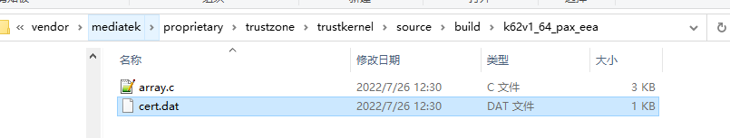

# 概述

梳理一下mtk平台google key写入需要哪些东西及方法，重在梳理Keybox申请及使用流程。

* 不刷google keybox的结果：
  * 无法登陆google play store。
  * 如果当前可以，又没刷，可能是因为申请了白名单，等白名单45天过期之后，就会登陆不上，一直弹窗。

# 参考

* [TEE写号工具说明.pdf.docx](refers/TEE写号工具说明.pdf.docx)
* [什么是3PL实验室？申请谷歌认证为什么要提供3PL实验室？](https://baijiahao.baidu.com/s?id=1731319635456329091&wfr=spider&for=pc)
* [产线写号工具写Google key及TEE key操作流程v2.0](https://blog.csdn.net/weixin_44016441/article/details/115354853)
* [MTK for Google AttestationKey介绍](https://www.365seal.com/y/qevqOrZopX.html)

# 抛开问题看本质，什么是google attestationkey

attestationkey就根据当前手机型号(id)，相关google申请的一组keybox,然后将keybox拆分成若干组key, 每组包含ECDSA和RSA，每组key写入到手机的安全内存中.
当google GSM app或第三方APP需要使用时，调用keymaster接口，使用该key进行签名认证等

# MTK设计

我们申请到keybox，要拆分keybox，然后将key组(ECDSA和RSA)写入到手机的安全区域中。如果攻击者危及Android并尝试提取密钥，则他们不会成功，因为密钥在安全硬件TEE中。这其中的设计思想如下，我们要怎样保护key组(ECDSA和RSA)的安全性？


# 产线整体流程

产线部署`Attestation Keybox`需要先从`Google APFE`申请`Keybox`，我们通过瓶钵申请，然后在生产线将申请到的`keybox`文件部署到每一台终端，流程描述如下：


# Keybox申请过程

1. 例如我们M8的两个版本的白名单和googlekey，九州申请好了，九州公司就会发来了keybox包如下，这个就是申请到的keybox xml文件:


2. keybox包这个无需我们解包，这边先发给鸿祥源到瓶钵将keybox拆分成若干组key，瓶钵那边会使用Splitter2.6(Splitter)工具，拆分keybox，并使用Splitter2.6(Mix Composer)工具，加密googlekey。最后提供key获取`keybox uuid`的url地址：


3. 同步更新TEE密钥和证书到代码中，如果后续制造商或者产品变更，也需要重新生成同步更新TEE密钥和证书,具体流程如下：



瓶钵使用keytool(EncSW)工具，使用Pkb将Kkb_pub加密成EKkb_pub， 并将Pkb\EKkb_pub数组写入到代码中:


加密后，生成要给array.c数组，里面包含Pkb和EKkb_pub:
```C++
unsigned char InputPkb[] = {
    0x00, 0xc1, 0x5a, 0x46, 0x5f, 0xc4, 0x5c, 0x20, 0x69, 0x04, 0x35, 0xae, 0x9d, 0x5e, 0xfc, 0xb1,
    0xb8, 0x51, 0x87, 0x80, 0xc0, 0x6b, 0x6c, 0xdd, 0xfd, 0x0c, 0x54, 0xd3, 0x7a, 0x55, 0x9f, 0x7c,
    0x49, 0x5d, 0x19, 0x98, 0x1a, 0x0f, 0x47, 0xbc, 0x67, 0xbf, 0x0e, 0x52, 0xa0, 0xed, 0xed, 0x20,
    0xa9, 0x4e, 0x62, 0x5f, 0x67, 0xc1, 0xd6, 0xb1, 0x11, 0xe9, 0x42, 0x9c, 0x58, 0x3b, 0x53, 0x4b,
    0xef, 0xff, 0x35, 0xa4, 0x21, 0x25, 0x9c, 0xba, 0x2b, 0xdd, 0xb1, 0x77, 0x60, 0x4e, 0x69, 0xbf,
    0x34, 0xee, 0x3b, 0xb1, 0x7c, 0xdc, 0xf6, 0xdb, 0xe2, 0x07, 0x55, 0x77, 0xa7, 0xc2, 0xdc, 0x6b,
    0xcb, 0x2c, 0xb5, 0x05, 0xf0, 0x91, 0x8c, 0x7f, 0xbd, 0xe4, 0x27, 0x97, 0x95, 0xd7, 0xfc, 0x3e,
    0xb6, 0x0e, 0xf3, 0xd3, 0x8e, 0xd9, 0xc3, 0xbe, 0xd1, 0x94, 0xaa, 0xbe, 0xab, 0xa9, 0x8e, 0x02,
    0x65
};
unsigned char Ekkb_pub[] = {
    0x2c, 0x34, 0xc3, 0x58, 0xc7, 0x17, 0xd3, 0x37, 0x9d, 0xa1, 0xfb, 0x8a, 0xf6, 0x23, 0x74, 0x08,
    0x75, 0xc2, 0xef, 0xcc, 0x1a, 0x3f, 0x9c, 0x2f, 0x87, 0x40, 0xa6, 0x41, 0x08, 0x73, 0x09, 0xee,
    0x8f, 0xda, 0xed, 0x67, 0xb2, 0x6b, 0xd8, 0x29, 0x2f, 0x9c, 0x7b, 0x6c, 0xd0, 0xbd, 0xe2, 0xf6,
    0xab, 0xf2, 0x37, 0xbd, 0xb9, 0xb5, 0xee, 0x19, 0xf8, 0xf7, 0x2c, 0xb1, 0x4d, 0x58, 0x06, 0xf4,
    0x45, 0x23, 0xe5, 0xd0, 0xc9, 0x60, 0xb5, 0xb7, 0xa1, 0x12, 0x3e, 0x43, 0xd8, 0x8a, 0xec, 0xd6,
    0xb9, 0xc3, 0x3e, 0x52, 0x54, 0x4d, 0x2c, 0x8b, 0x1e, 0x37, 0x80, 0xa9, 0x1a, 0xd7, 0x93, 0x77,
    0xac, 0x20, 0x6e, 0x79, 0x2b, 0xa0, 0x97, 0x23, 0xba, 0x93, 0x8d, 0xe0, 0xf1, 0x83, 0xe8, 0x4f,
    0x34, 0x52, 0xeb, 0x1d, 0x8e, 0x2e, 0x4d, 0xa0, 0x1c, 0xa5, 0x72, 0x1c, 0xea, 0x1b, 0x51, 0x84,
    0x1a, 0xd0, 0x9d, 0x40, 0x7b, 0x9b, 0x33, 0x49, 0x27, 0x26, 0xd7, 0xaa, 0xd6, 0xcc, 0x91, 0x92,
    0xb6, 0xc1, 0xe0, 0x97, 0x83, 0x52, 0xba, 0xf3, 0xf4, 0x75, 0xa5, 0x17, 0xfa, 0x1d, 0xe8, 0x3f,
    0x5f, 0x9a, 0xae, 0x18, 0x70, 0x8d, 0xb0, 0xb1, 0x61, 0xf5, 0xb9, 0x5e, 0x83, 0xf7, 0x60, 0x05,
    0xcd, 0xa1, 0xf8, 0x00, 0x17, 0xbf, 0xda, 0xbd, 0x10, 0x08, 0x9b, 0x21, 0x8f, 0x61, 0x76, 0xf5,
    0x5e, 0xdf, 0x20, 0xa2, 0x94, 0xa1, 0xb4, 0xa6, 0xd8, 0xaa, 0x6c, 0x13, 0x1f, 0xa3, 0x33, 0x6d,
    0x3c, 0xdb, 0xab, 0x4b, 0xcd, 0xe6, 0x09, 0xeb, 0x76, 0x9c, 0x31, 0x9b, 0xe2, 0x87, 0xbe, 0x10,
    0x00, 0xea, 0xae, 0x54, 0xc7, 0x0a, 0xbc, 0x29, 0xbd, 0xb8, 0x7a, 0x61, 0x49, 0x8e, 0x34, 0x2c,
    0xb3, 0x26, 0x73, 0x36, 0xd8, 0x84, 0x84, 0x85, 0x87, 0x2b, 0xb2, 0xc1, 0x55, 0x33, 0xef, 0xb8
};
```

# 公司流程


整个googlekey申请和写入流程见下图：
M50: MADA和方案商是同一家，都是鸿翔源
M8：MADA和方案商是分开的，MADA是九州，方案商是鸿翔源

百富没有直接和瓶钵签License协议，使用的鸿翔源kkb_priv来加密googlekey，然后上传加密后的googlekey到瓶钵服务器，供下载使用

#5,6,7没有鸿翔源，我们都可以自己生成，由于生成了新的私钥，对应的公钥需要内置到代码中，所以会导致不兼容

#9必须瓶钵支持

所以整个环节，鸿翔源不是必须的，但是瓶钵是必须。

