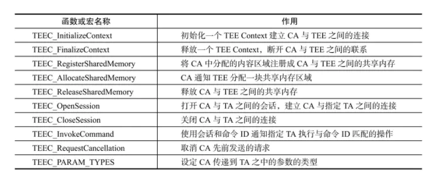

# 豆荚TEE兼容方案实现

由于M50/M8项目需要更换TEE，从瓶钵换成豆荚，需要重新做兼容。

# 参考

* [《手机安全与可信应用开发指南：TrustZone和OP-TEE技术详解》读书笔记](https://www.jianshu.com/p/74a26ede5d1d?u_atoken=66a51267-285d-4567-aafe-d6d50738f585&u_asession=01f_sxVixP7Vy0Jrzdzb2dAKAXWsbgK4Lio9vOpRlZGo2yLXa_J9zNufE9HVDP2c4VX0KNBwm7Lovlpxjd_P_q4JsKWYrT3W_NKPr8w6oU7K8Ns3QXhI7dv48uDqh6tscGp0TkEaMSMNP4umocQhrjq2BkFo3NEHBv0PZUm6pbxQU&u_asig=05J29Yav8usuQyWHInRl-Ad-PI68YevoqVxG8Gsuu7qA6JF6zf9CBeoFrCshGsajK2Z3UW7m6GmsSmZQTgaHpvMMoX1EJ_9B6XMFEwJ5tAEn8k7OGYu5QsOGXsIHC5LMq8kRH1sD4Gn1B-q1ZGYpDUwHT6-ibI6mzpVPVCVS1j9GP9JS7q8ZD7Xtz2Ly-b0kmuyAKRFSVJkkdwVUnyHAIJzXKB41hxxphEWr3t12svy7v-ZxzmlGsA1bKYzw3seMh-G3pf5vm7LeeSuJ_913VgsO3h9VXwMyh6PgyDIVSG1W8frrwHwetKpxMGwfYjeCGf0lxEO2egZLn_KjcvC2APzImtRq45EGDpyiOknHXmFzAdnFJRYAdzAZXbpwUdMC3MmWspDxyAEEo4kbsryBKb9Q&u_aref=S4YI8eA5zTurlBbbCqy3Y1rwnYQ%3D)

# 方案一：瓶钵读取属性旧方式

* 修改如下：
```diff
--- a/bionic/libc/system_properties/system_properties.cpp
+++ b/bionic/libc/system_properties/system_properties.cpp
@@ -223,6 +223,10 @@ int SystemProperties::Get(const char* name, char* value) {
   if (pi != nullptr) {
     int ret = Read(pi, nullptr, value);
      if (ret > 0) {
+                        async_safe_format_log(ANDROID_LOG_ERROR, "libc",
+                                       "print the The property name length for \"%s\" "
+                                       " to read this property. (the value  \"%s\")  current name %s uid=%d",
+                                       name, value,getprogname(),getuid());
         if(strcmp(value,"M8") == 0 && strcmp(name,"ro.boot.terminal_name") != 0 && getuid() == 1000 && strcmp(getprogname(),"teed") == 0){
             char m8[] = {"M50"};
             memset(value,0,ret);
@@ -233,6 +237,16 @@ int SystemProperties::Get(const char* name, char* value) {
                             name, value,getprogname(),getuid());
             return strlen(m8);
         }
+               else if (strcmp(name,"ro.product.device") == 0 && getuid() == 1000 && strcmp(getprogname(),"teei_daemon") == 0) {
+            char m8[] = {"PAYTABLETM8"};
+            memset(value,0,ret);
+            strcpy(value,m8);
+            async_safe_format_log(ANDROID_LOG_ERROR, "libc",
+                            "print the The property name length for \"%s\" "
+                            " to read this property. (the value  \"%s\")  current name %s uid=%d",
+                            name, value,getprogname(),getuid());
+            return strlen(m8);
+               }
         return ret;
     }
     return ret;
```

* 开机打印发现`uid=1000`依旧是1000，而且服务进程名称为`teei_daemon`：
```
2022-10-09 14:56:05.150 10306-10306/? E/libc: print the The property name length for "ro.product.device"  to read this property. (the value  "PAYPHONEM50")  current name teei_daemon uid=1000
```

* 按照如上修改后M50成功骗过tee进入，打印如下：
```
<6>[    5.205476] .(4)[345:init]BOOTPROF:      5205.461165:INIT:Mount_END --late
<6>[    5.206471] .(3)[430:teei_daemon]BOOTPROF:      5206.461627:TEEI BOOT Decrypt Unlocked
<6>[    5.206487] .(3)[430:teei_daemon]BOOTPROF:      5206.484934:TEEI BOOT Service2 Inited
<6>[    5.206956] .(3)[430:teei_daemon]BOOTPROF:      5206.950550:TEEI BOOT Load TEES Completed
<6>[    5.206968] .(3)[430:teei_daemon]BOOTPROF:      5206.966242:TEEI BOOT All Completed
<6>[    5.206975] .(3)[430:teei_daemon]BOOTPROF:      5206.973242:TEEI_BOOT_OK
<6>[    5.206982] .(3)[430:teei_daemon]BOOTPROF:      5206.979780:TEEI start to load driver TAs
<6>[    5.207427] -(0)[249:teei_log_thread][TZ_LOG] uTSecMan| lookup ta: '020b0000000000000000000000000000' (40)
<6>[    5.207436] -(0)[249:teei_log_thread][TZ_LOG] uTSecMan| enable model control
<6>[    5.208030] -(0)[249:teei_log_thread][TZ_LOG] uTSecMan| platform:mt6762
<6>[    5.208539] -(0)[249:teei_log_thread][TZ_LOG] uTSecMan| model:PAYTABLETM8
<6>[    5.219310] -(7)[249:teei_log_thread][TZ_LOG] uTSecMan| config protocol is 1
<6>[    5.219331] -(7)[249:teei_log_thread][TZ_LOG] uTSecMan| config version is 1
<6>[    5.219339] -(7)[249:teei_log_thread][TZ_LOG] uTSecMan| config brand is PAX
<6>[    5.219347] -(7)[249:teei_log_thread][TZ_LOG] uTSecMan| config model number is 2
<6>[    5.219356] -(7)[249:teei_log_thread][TZ_LOG] uTSecMan| verify device model success, index:1
<6>[    5.219365] -(7)[249:teei_log_thread][TZ_LOG] uTSecMan| verify config file model info success
<6>[    5.223262] -(7)[249:teei_log_thread][TZ_LOG] uTSecMan| [sec_manager_handle.cc:431/package_query_ta]<err>TA is not installed 
<6>[    5.223280] -(7)[249:teei_log_thread][TZ_LOG] uTSecMan| 
```

# 指纹适配

指纹由于更换了TEE环境，相应的TA和库及驱动也需要重新更新。

1. TA存放位置发生改变，豆荚的放到`vendor/thh/ta`，而瓶钵的是`vendor/app/t6/`：
```diff
--- a/paxdroid/hardware/libhardware/modules/fingerprint/betterlife_tee/Android.mk
+++ b/paxdroid/hardware/libhardware/modules/fingerprint/betterlife_tee/Android.mk
@@ -143,14 +143,27 @@ include $(BUILD_PREBUILT)
 ifeq ($(strip $(BTL_FINGERPRINT_TEE)),trustkernel)
     include $(CLEAR_VARS)
     LOCAL_MODULE_TAGS := optional
-    LOCAL_MODULE := f74c8d0d-4284-4acf-d0c425260610b3bd
+    LOCAL_MODULE := f74c8d0d42844acfd0c425260610b3bd
     LOCAL_CHECK_ELF_FILES := false
     #LOCAL_MODULE_OWER := pax
-    LOCAL_SRC_FILES := ta/f74c8d0d-4284-4acf-d0c425260610b3bd.ta
+    LOCAL_SRC_FILES := ta/f74c8d0d42844acfd0c425260610b3bd.ta
     LOCAL_MODULE_CLASS := ETC
     LOCAL_MODULE_PATH := $(TARGET_OUT_VENDOR)/app/t6
     LOCAL_MODULE_SUFFIX := .ta
     include $(BUILD_PREBUILT)
 endif

+ifeq ($(strip $(BTL_FINGERPRINT_TEE)),beanpod)
+    include $(CLEAR_VARS)
+    LOCAL_MODULE_TAGS := optional
+    LOCAL_MODULE := f74c8d0d42844acfd0c425260610b3bd
+    LOCAL_CHECK_ELF_FILES := false
+    #LOCAL_MODULE_OWER := pax
+    LOCAL_SRC_FILES := ta/f74c8d0d42844acfd0c425260610b3bd.ta
+    LOCAL_MODULE_CLASS := ETC
+    LOCAL_MODULE_PATH := $(TARGET_OUT_VENDOR)/thh/ta
+    LOCAL_MODULE_SUFFIX := .ta
+    include $(BUILD_PREBUILT)
+endif
```

二供指纹改动如下：
```diff
--- a/paxdroid/hardware/libhardware/modules/fingerprint/chipsailing/tee/csfinger_product_64bit.mk
+++ b/paxdroid/hardware/libhardware/modules/fingerprint/chipsailing/tee/csfinger_product_64bit.mk
@@ -3,7 +3,7 @@ CS_LOCAL_SO_PATH := paxdroid/hardware/libhardware/modules/fingerprint/chipsailin
 CONFIG_LOCAL_PATH := paxdroid/hardware/libhardware/modules/fingerprint/chipsailing/tee

 FINGERPRINT_HARDWARE_MODULE_ID := chipsailing.fingerprint
-TEE_PLATFORM := TRUSTKERNEL
+TEE_PLATFORM := ISEE
 CS_IC_SENSOR := 3711

 PRODUCT_COPY_FILES += frameworks/native/data/etc/android.hardware.fingerprint.xml:vendor/etc/permissions/android.hardware.fingerprint.xml
@@ -29,7 +29,7 @@ PRODUCT_COPY_FILES += $(CS_LOCAL_PATH)/cf-keys.kl:system/usr/keylayout/cf-keys.k

 ifeq ($(TEE_PLATFORM),ISEE)
 PRODUCT_COPY_FILES += $(CS_LOCAL_SO_PATH)/ISEE/libfp_hal.so:vendor/lib64/libfp_hal.so
-PRODUCT_COPY_FILES += $(CS_LOCAL_SO_PATH)/ISEE/7778c03fc30c4dd0a319ea29643d4d4b.ta:vendor/thh/7778c03fc30c4dd0a319ea29643d4d4b.ta
+PRODUCT_COPY_FILES += $(CS_LOCAL_SO_PATH)/ISEE/7778c03fc30c4dd0a319ea29643d4d4b.ta:vendor/thh/ta/7778c03fc30c4dd0a319ea29643d4d4b.ta
 endif
```

2. 开机设置菜单未发现指纹，发现selinux报错如下：
```
10-13 13:15:33.968  6966  6966 I btlfpserver: type=1400 audit(0.0:111): avc: denied { read write } for name="teei_fp" dev="tmpfs" ino=14479 scontext=u:r:btlfpserver:s0 tcontext=u:object_r:teei_fp_device:s0 tclass=chr_file permissive=1
10-13 13:15:40.188  6966  6966 I btlfpserver: type=1400 audit(0.0:116): avc: denied { ioctl } for path="/dev/teei_fp" dev="tmpfs" ino=14479 ioctlcmd=0x5402 scontext=u:r:btlfpserver:s0 tcontext=u:object_r:teei_fp_device:s0 tclass=chr_file permissive=1
```

尝试关闭selinux，重启btlfpserver服务后设置菜单出现指纹：
```
PAYTABLETM8_EEA:/ # setenforce 0
PAYTABLETM8_EEA:/ # ps -A| grep btlfpserver
system          849      1 10778816  3812 hrtimer_nanosleep   0 S btlfpserver
PAYTABLETM8_EEA:/ # kill 849
```

尝试增加selinux权限：
```diff
--- a/paxdroid/device/sepolicy/vendor/fingerpint/betterlife/hal_btlfpserver.te
+++ b/paxdroid/device/sepolicy/vendor/fingerpint/betterlife/hal_btlfpserver.te
@@ -30,6 +30,7 @@ hal_client_domain(btlfpserver, hal_allocator)

 # Purpose : Allow to use kernel driver
 allow btlfpserver blestech_fp_device:chr_file { read write open ioctl };
+allow btlfpserver teei_fp_device:chr_file { read write open ioctl };
```

还有报错：
```
btlfpserver: type=1400 audit(0.0:52): avc: denied { read write } for name="isee_tee0" dev="tmpfs" ino=16472 scontext=u:r:btlfpserver:s0 tcontext=u:object_r:teei_client_device:s0 tclass=chr_file permissive=0
```

继续增加：
```diff
--- a/paxdroid/device/sepolicy/vendor/fingerpint/betterlife/hal_btlfpserver.te
+++ b/paxdroid/device/sepolicy/vendor/fingerpint/betterlife/hal_btlfpserver.te
@@ -30,6 +30,8 @@ hal_client_domain(btlfpserver, hal_allocator)

 # Purpose : Allow to use kernel driver
 allow btlfpserver blestech_fp_device:chr_file { read write open ioctl };
+allow btlfpserver teei_fp_device:chr_file { read write open ioctl };
+allow btlfpserver teei_client_device:chr_file { read write open ioctl };
```

# 根据硬件启动不同TEE方案

由于需要适配老机器(瓶钵TEE)，需要根据硬件启动不同TEE OS，方案如下：
* 1. 后续升级OTA/Uniphiz包不包含tee.img镜像，因为tee os编译在里面。
* 2. pl阶段根据boardid加载不同的TEE OS。
* 3. kernel阶段两个都打开。

# kernel阶段兼容

GP定义的客户端接口包括9个函数和1个宏：




如果同时打开瓶钵和豆荚的TEE会出现如下重定义报错：
```
ld.lld: error: duplicate symbol: TEEC_ReleaseSharedMemory
>>> defined at tee_client_api.c:53 (/ssd/libing/M8-tee/kernel-4.19/drivers/tee/teei/300/tee/tee_client_api.c:53)
>>>            drivers/tee/teei/300/tee/tee_client_api.o:(TEEC_ReleaseSharedMemory) in archive built-in.a
>>> defined at tee_kernel_api.c
>>>            drivers/tee/tkcore/core/tee_kernel_api.o:(.text+0x574) in archive built-in.a
```

那么我们将瓶钵驱动中的9和函数名称修改一下`drivers/tee/tkcore`：
```
 2018  sed -i "s/TEEC_InitializeContext/TK_TEEC_InitializeContext/g"  `grep TEEC_InitializeContext -rl . `
 2020  sed -i "s/TEEC_FinalizeContext/TK_TEEC_FinalizeContext/g"  `grepTEEC_FinalizeContext -rl . `
 2021  sed -i "s/TEEC_FinalizeContext/TK_TEEC_FinalizeContext/g"  `grep TEEC_FinalizeContext -rl . `
 2023  sed -i "s/TEEC_OpenSession/TK_TEEC_OpenSession/g"  `grep TEEC_OpenSession -rl . `
 2027  sed -i "s/TEEC_CloseSession/TK_TEEC_CloseSession/g"  `grep TEEC_CloseSession -rl . `
 2028  sed -i "s/TEEC_InvokeCommand/TK_TEEC_InvokeCommand/g"  `grep TEEC_InvokeCommand -rl . `
 2029  sed -i "s/TEEC_RegisterSharedMemory/TK_TEEC_RegisterSharedMemory/g"  `grep TEEC_RegisterSharedMemory -rl . `
 2030  sed -i "s/TEEC_AllocateSharedMemory/TK_TEEC_AllocateSharedMemory/g"  `grep TEEC_AllocateSharedMemory -rl . `
 2031  sed -i "s/TEEC_ReleaseSharedMemory/TK_TEEC_ReleaseSharedMemory/g"  `grep TEEC_ReleaseSharedMemory -rl . `
```

经验证，修改后瓶钵指纹依然能够正常读取chip id，正常使用。

# tee.img生成兼容

首先看看tee.img是如何生成的，


# pl阶段传参lk流程

* 根据pl阶段打印如下：
```
[PLFM] boot to LK by ATAG reason=4 addr=47E6DA80
RAM_CONSOLE wdt_status 0x2, fiq_step 0x0, exp_type 0x0
RAM_CONSOLE offset:0xAC0
RAM_CONSOLE sram_plat_dbg_info_addr:0x10E400, sram_plat_dbg_info_size:0x200, sram_log_store_addr:0x10E700, sram_log_store_size:0x100
RAM_CONSOLE mrdump_addr:0x10E800, mrdump_size:0x1400, dram_addr:0x47C80000, dram_size:0x10000
RAM_CONSOLE pstore_addr:0x47C90000, pstore_size:0xE0000, pstore_console_size:0x40000, pstore_pmsg_size:0x10000
RAM_CONSOLE mrdump_mini_header_addr:0x47D70000, mrdump_mini_header_size:0x10000, magic1:0x61646472, magic2:0x73697A65
BOOT_REASON: 4
11 pax_new_board: 1
BOOT_MODE: 0
MEM_SIZE: 0x2B08
MEM_SIZE: 0x2B1A
BOOT_TIME: 1443

[BLDR] jump to 0x48000000
[BLDR] <0x48000000>=0xEA000007
[BLDR] <0x48000004>=0xEA0077DD
[TZ_SEC_CFG] [B]SRAMROM SEC_ADDR:0x0, SEC_ADDR1:0x0, SEC_ADDR2:0x0
[TZ_SEC_CFG] [B]SRAMROM SEC_CTRL:0x80000000, SEC_CTRL2:0x0, SEC_CTRL5:0x0, SEC_CTRL6:0x0
[TZ_SEC_CFG] [A]SRAMROM SEC_ADDR:0x9000DC00, SEC_ADDR1:0xDC00, SEC_ADDR2:0xDC00
[TZ_SEC_CFG] [A]SRAMROM SEC_CTRL:0x80000B69, SEC_CTRL2:0x0, SEC_CTRL5:0x1680000, SEC_CTRL6:0x0
```

 * `platform/mt6765/src/core/main.c`这里主要是配置跳转ATF的地址(0x48000000)，和要传递的跳转参数，跳转参数是`g_dram_buf->boottag`:
```C++
void main(u32 *arg)
{

#if !(CFG_BYPASS_LOAD_IMG_FORCE_ATF) 
    /* Do not load ATF, lk, load by JTAG */
    if (0 != bldr_load_images(&jump_addr)) {
        pal_log_err("%s Second Bootloader Load Failed\n", MOD);
#if !CFG_BYPASS_EMI
        goto error;
#endif
    }
#else
//CFG_UBOOT_MEMADDR  platform/mt6765/default.mak
//              CFG_UBOOT_MEMADDR       :=0x48000000

    jump_addr = CFG_UBOOT_MEMADDR;
#endif
    BOOTING_TIME_PROFILING_LOG("load images");

    bldr_post_process();

#if CFG_ATF_SUPPORT
    trustzone_post_init();
    BOOTING_TIME_PROFILING_LOG("trustzone post init");
#endif

#if CFG_BOOT_ARGUMENT_BY_ATAG //这里为1
    jump_arg = (u32)&(g_dram_buf->boottag);
#else
    jump_arg = (u32)&bootarg;
#endif


    /* 64S3,32S1,32S1 (MTK_ATF_BOOT_OPTION = 0)
         * re-loader jump to LK directly and then LK jump to kernel directly */
#if CFG_ATF_SUPPORT
    pal_log_info("%s Others, jump to ATF\n", MOD);
    bldr_jump64(jump_addr, jump_arg, sizeof(boot_arg_t));
#else
    bldr_jump(jump_addr, jump_arg, sizeof(boot_arg_t));
#endif
}
```

* `platform/mt6765/src/core/inc/dram_buffer.h`先看一下数据结构体：
```C++
typedef struct{
    mtk_bl_param_t bl31_info;
    /*bmt.c*/
    u8 bmt_buf[BMT_BUFFER_SIZE];
    u8 bmt_dat_buf[BMT_DAT_BUFFER_SIZE];
    /*nand.c*/
    u8 nand_nfi_buf[NAND_NFI_BUFFER_SIZE];

    /*download.c*/
    part_hdr_t part_hdr_buf[PART_HDR_BUF_SIZE];
    /*efi.c*/
    u32 crc32_table[256];
    u8 gpt_header_buf[4096];
    u8 gpt_entries_buf[GPT_BUFFER_SIZE];
    /*mmc_common_inter.c*/
    unsigned char storage_buffer[STORAGE_BUFFER_SIZE];
    /*partition.c*/
    u8 img_hdr_buf[IMG_HDR_BUF_SIZE];
    unsigned int part_num;
    part_hdr_t   part_info[PART_MAX_NUM];
    part_t  partition_info[128];

#if ((CFG_BOOT_DEV == BOOTDEV_SDMMC) || (CFG_BOOT_DEV == BOOTDEV_UFS))
    struct part_meta_info meta_info[128];
#endif
    /*platform.c*/
    boot_arg_t bootarg;
    /*print.c*/
    u8 log_dram_buf[LOG_BUFFER_MAX_SIZE];
    /*sec.c*/
    u8  sec_secro_buf[SEC_SECRO_BUFFER_LENGTH];
    u8  sec_lib_heap_buf[SEC_LIB_HEAP_LENGTH];
    u8  sec_working_buf[SEC_WORKING_BUFFER_LENGTH];
    u8  sec_img_buf[SEC_IMG_BUFFER_LENGTH];
    /*msdc.c*/
    gpd_t msdc_gpd_pool[MSDC_MAX_NUM][MAX_GPD_POOL_SZ] __attribute__ ((aligned(64)));
    bd_t  msdc_bd_pool[MSDC_MAX_NUM][MAX_BD_POOL_SZ] __attribute__ ((aligned(64)));
#if CFG_PRELOADER_AS_DA
    u8 tee1_buf[0x40000];
#endif
#if CFG_FAST_META_SUPPORT
    unsigned char proinfo[1024];
#endif
    boot_tag *boottag; /*boot args pass to LK by ATAG*/
} dram_buf_t;

extern dram_buf_t *g_dram_buf;

//platform/mt6765/src/drivers/inc/platform.h 
//结构体如下：
typedef struct {
    struct boot_tag_header hdr;
    union {
        struct boot_tag_boot_reason boot_reason;
        struct boot_tag_boot_mode boot_mode;
        struct boot_tag_meta_com meta_com;
        struct boot_tag_log_com log_com;
        struct boot_tag_mem mem;
        struct boot_tag_md_info md_info;
        struct boot_tag_boot_time boot_time;
        struct boot_tag_da_info da_info;
        struct boot_tag_sec_info sec_info;
        struct boot_tag_part_num part_num;
        struct boot_tag_part_info part_info;
        struct boot_tag_eflag eflag;
        struct boot_tag_ddr_reserve ddr_reserve;
        struct boot_tag_dram_buf dram_buf;
        struct boot_tag_emi_info emi_info;
        struct boot_tag_sram_info sram_info;
        struct boot_tag_plat_dbg_info plat_dbg_info;
        struct boot_tag_ptp ptp_volt;
        struct boot_tag_chr_info chr_info;
        struct boot_tag_bat_info bat_info;
        struct boot_tag_imgver_info imgver_info;
        struct boot_tag_max_cpus max_cpus;
        struct boot_tag_is_abnormal_boot is_abnormal_boot;
        struct boot_tag_soc_id socid;
        struct boot_tag_ram_console_info ram_console_info;
#if CFG_GZ_SUPPORT
        struct boot_tag_gz_info gz_info;
        struct boot_tag_gz_param gz_param;
        struct boot_tag_gz_platform gz_plat;
#endif
#if CFG_GZ_PWRAP_ENABLE
        struct boot_tag_gz_pwrap gz_pwrap;
#endif
#if defined(CFG_RKP_SUPPORT) && CFG_RKP_SUPPORT
        struct boot_tag_rkp_param rkp_param;
#endif
    } u;
}boot_tag;
```


可以看到存在`boot_tag`结构体，看注释这个就是要传递的参数，那`g_dram_buf->boottag`这个参数是怎么来的？看一下`bldr_post_process`函数的`platform_post_init`流程：
```C++
static void bldr_post_process(void)
{
    platform_post_init();

#if CFG_GZ_SUPPORT
    gz_post_init();
    BOOTING_TIME_PROFILING_LOG("gz_post_init");
#endif
}

```
