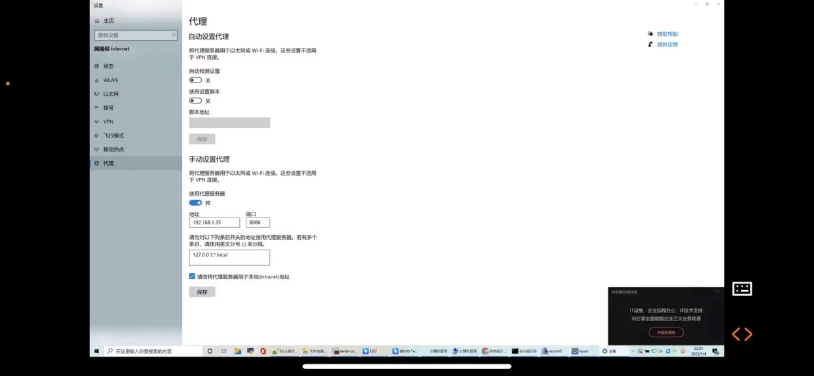
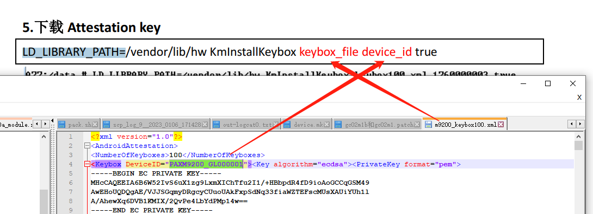
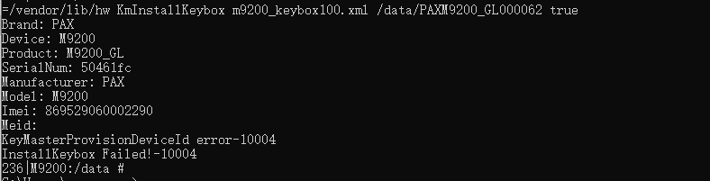

# mark

记录一些gms杂项问题。

# 常用指令

```
--shard-count x 多台测试
-a armeabi-v7a 只测armv7的
run gts -m GtsMediaTestCases
run cts -m CtsMediaTestCases
run cts -m CtsMediaV2TestCases
run cts -m CtsCameraTestCases
run retry --retry <id>
```

* cts 测试过程中由于某个模块fail项太多，整跑模块又太过耗时。所以需要使用subplan来进行快速测试验证。

1.在与result文件夹同级目录下创建subplans文件夹

2.在subplans文件中创建需要测试验证的fail项的xml文件，建议用fail项的模块进行命名。

3.执行测试命令：run cts -o --subplan [需要运行的xml文件]

fail测试项的xml文件内容如下
```xml
<?xml version='1.0' encoding='UTF-8' standalone='no' ?>
<SubPlan version="2.0">
  <Entry include="armeabi-v7a CtsCameraTestCases android.hardware.camera2.cts.StillCaptureTest#testAeCompensation[1]" />
  <Entry include="armeabi-v7a CtsCameraTestCases android.hardware.camera2.cts.CaptureRequestTest#testEdgeModeControl[1]" />
  <Entry include="armeabi-v7a CtsCameraTestCases android.hardware.camera2.cts.CaptureRequestTest#testNoiseReductionModeControl[1]" />
  <Entry include="armeabi-v7a CtsCameraTestCases android.hardware.camera2.cts.CaptureRequestTest#testAntiBandingModes[1]" />
</SubPlan>
```

# 测试服务器使用代理网络提示网络失败

广和通那边使用windows网络代理给测试ubuntu服务器提供网络，ubuntu使用浏览器能够访问外网，但是跑camera测试时提供无法访问网络：

* 网络代理如下：



* 报错如下：
```log
cts-tf > run cts -m CtsCameraTestCases -t android.hardware.cts.CameraTest#testPreviewFpsRange
04-25 09:14:25 I/TestInvocation: Starting invocation for 'cts' with '[ DeviceBuildInfo{bid=8143462, serial=0123456789ABCDEF} on device '0123456789ABCDEF'] 
cts-tf > 
cts-tf > 
cts-tf > 
04-25 09:15:44 E/ClearcutClient: connect timed out
java.net.SocketTimeoutException: connect timed out
    at java.base/java.net.PlainSocketImpl.socketConnect(Native Method)
    at java.base/java.net.AbstractPlainSocketImpl.doConnect(AbstractPlainSocketImpl.java:399)
    at java.base/java.net.AbstractPlainSocketImpl.connectToAddress(AbstractPlainSocketImpl.java:242)
    at java.base/java.net.AbstractPlainSocketImpl.connect(AbstractPlainSocketImpl.java:224)
    at java.base/java.net.SocksSocketImpl.connect(SocksSocketImpl.java:403)
    at java.base/java.net.Socket.connect(Socket.java:591)
    at java.base/sun.security.ssl.SSLSocketImpl.connect(SSLSocketImpl.java:285)
    at java.base/sun.net.NetworkClient.doConnect(NetworkClient.java:177)
    at java.base/sun.net.www.http.HttpClient.openServer(HttpClient.java:474)
    at java.base/sun.net.www.http.HttpClient.openServer(HttpClient.java:569)
    at java.base/sun.net.www.protocol.https.HttpsClient.<init>(HttpsClient.java:265)
    at java.base/sun.net.www.protocol.https.HttpsClient.New(HttpsClient.java:372)
    at java.base/sun.net.www.protocol.https.AbstractDelegateHttpsURLConnection.getNewHttpClient(AbstractDelegateHttpsURLConnection.java:191)
    at java.base/sun.net.www.protocol.http.HttpURLConnection.plainConnect0(HttpURLConnection.java:1187)
    at java.base/sun.net.www.protocol.http.HttpURLConnection.plainConnect(HttpURLConnection.java:1081)
    at java.base/sun.net.www.protocol.https.AbstractDelegateHttpsURLConnection.connect(AbstractDelegateHttpsURLConnection.java:177)
    at java.base/sun.net.www.protocol.http.HttpURLConnection.getOutputStream0(HttpURLConnection.java:1362)
    at java.base/sun.net.www.protocol.http.HttpURLConnection.getOutputStream(HttpURLConnection.java:1337)
    at java.base/sun.net.www.protocol.https.HttpsURLConnectionImpl.getOutputStream(HttpsURLConnectionImpl.java:246)
    at com.android.tradefed.clearcut.ClearcutClient.sendToClearcut(ClearcutClient.java:284)
    at com.android.tradefed.clearcut.ClearcutClient.flushEvents(ClearcutClient.java:270)
    at com.android.tradefed.clearcut.ClearcutClient.access$000(ClearcutClient.java:52)
    at com.android.tradefed.clearcut.ClearcutClient$2.run(ClearcutClient.java:134)
    at java.base/java.util.concurrent.Executors$RunnableAdapter.call(Executors.java:515)
    at java.base/java.util.concurrent.FutureTask.runAndReset(FutureTask.java:305)
    at java.base/java.util.concurrent.ScheduledThreadPoolExecutor$ScheduledFutureTask.run(ScheduledThreadPoolExecutor.java:305)
    at java.base/java.util.concurrent.ThreadPoolExecutor.runWorker(ThreadPoolExecutor.java:1128)
    at java.base/java.util.concurrent.ThreadPoolExecutor$Worker.run(ThreadPoolExecutor.java:628)
    at java.base/java.lang.Thread.run(Thread.java:834)
cts-tf > 
cts-tf > 
04-25 09:16:38 E/TestInvocation: Caught exception while running invocation
04-25 09:16:38 E/TestInvocation: Trying to access android partner remote server over internet but failed: Connection timed out (Connection timed out)
com.android.tradefed.targetprep.TargetSetupError[ANDROID_PARTNER_SERVER_ERROR|500505|DEPENDENCY_ISSUE]: Trying to access android partner remote server over internet but failed: Connection timed out (Connection timed out)
    at com.android.compatibility.common.tradefed.targetprep.DynamicConfigPusher.resolveUrl(DynamicConfigPusher.java:266)
    at com.android.compatibility.common.tradefed.targetprep.DynamicConfigPusher.setUp(DynamicConfigPusher.java:141)
    at com.android.tradefed.invoker.InvocationExecution.runPreparationOnDevice(InvocationExecution.java:365)
    at com.android.tradefed.invoker.InvocationExecution.runPreparersSetup(InvocationExecution.java:329)
    at com.android.tradefed.invoker.InvocationExecution.doSetup(InvocationExecution.java:254)
    at com.android.tradefed.invoker.TestInvocation.prepareAndRun(TestInvocation.java:503)
    at com.android.tradefed.invoker.TestInvocation.performInvocation(TestInvocation.java:257)
    at com.android.tradefed.invoker.TestInvocation.invoke(TestInvocation.java:1149)
    at com.android.tradefed.command.CommandScheduler$InvocationThread.run(CommandScheduler.java:631)
Caused by: java.net.ConnectException: Connection timed out (Connection timed out)
    at java.base/java.net.PlainSocketImpl.socketConnect(Native Method)
    at java.base/java.net.AbstractPlainSocketImpl.doConnect(AbstractPlainSocketImpl.java:399)
    at java.base/java.net.AbstractPlainSocketImpl.connectToAddress(AbstractPlainSocketImpl.java:242)
    at java.base/java.net.AbstractPlainSocketImpl.connect(AbstractPlainSocketImpl.java:224)
    at java.base/java.net.SocksSocketImpl.connect(SocksSocketImpl.java:403)
    at java.base/java.net.Socket.connect(Socket.java:591)
    at java.base/sun.security.ssl.SSLSocketImpl.connect(SSLSocketImpl.java:285)
    at java.base/sun.security.ssl.BaseSSLSocketImpl.connect(BaseSSLSocketImpl.java:173)
    at java.base/sun.net.NetworkClient.doConnect(NetworkClient.java:182)
    at java.base/sun.net.www.http.HttpClient.openServer(HttpClient.java:474)
    at java.base/sun.net.www.http.HttpClient.openServer(HttpClient.java:569)
    at java.base/sun.net.www.protocol.https.HttpsClient.<init>(HttpsClient.java:265)
    at java.base/sun.net.www.protocol.https.HttpsClient.New(HttpsClient.java:372)
    at java.base/sun.net.www.protocol.https.AbstractDelegateHttpsURLConnection.getNewHttpClient(AbstractDelegateHttpsURLConnection.java:191)
    at java.base/sun.net.www.protocol.http.HttpURLConnection.plainConnect0(HttpURLConnection.java:1187)
    at java.base/sun.net.www.protocol.http.HttpURLConnection.plainConnect(HttpURLConnection.java:1081)
    at java.base/sun.net.www.protocol.https.AbstractDelegateHttpsURLConnection.connect(AbstractDelegateHttpsURLConnection.java:177)
    at java.base/sun.net.www.protocol.http.HttpURLConnection.getInputStream0(HttpURLConnection.java:1587)
    at java.base/sun.net.www.protocol.http.HttpURLConnection.getInputStream(HttpURLConnection.java:1515)
    at java.base/sun.net.www.protocol.https.HttpsURLConnectionImpl.getInputStream(HttpsURLConnectionImpl.java:250)
    at java.base/java.net.URL.openStream(URL.java:1129)
    at com.android.compatibility.common.tradefed.targetprep.DynamicConfigPusher.resolveUrl(DynamicConfigPusher.java:263)
    ... 8 more
04-25 09:20:37 W/NativeDevice: Attempting to stop logcat when not capturing for 0123456789ABCDEF
04-25 09:20:37 I/SuiteResultReporter: 
============================================
================= Results ==================
=============== Consumed Time ==============
Total aggregated tests run time: 0 ms
=============== Summary ===============
Total Run time: 6m 11s
0/0 modules completed
Total Tests       : 0
PASSED            : 0
FAILED            : 0
============== End of Results ==============
============================================
```

* 参考网上解决方案：

* [android cts can't run [closed]](https://stackoverflow.com/questions/71993633/android-cts-cant-run)

```
In my case, the problem was caused by being behind a proxy. It may be the same for you as well.

To overcome the issue, do two things:

adb shell settings put global http_proxy <proxyhost>
On the terminal where you are launching cts-tradefed, before launching it, run export JAVA_TOOL_OPTIONS='-Djava.net.useSystemProxies=true'
```

1. 手机端设置
```
adb shell settings put global http_proxy 192.168.1.35:8088
```

2. 服务器设置
```
export JAVA_TOOL_OPTIONS='-Djava.net.useSystemProxies=true'
```

测试正常跑起来了：


# QCM2290 googlekey写入方法

參考：
* [Android Attestation key导入步骤（Qualcomm Platform）](https://blog.csdn.net/qq_42713883/article/details/102478059)

1. 烧录 userdebug 版固件

2. 将 keybox 文件推到机器里面
```
adb root
adb push keybox.xml /data/
```

3. 初始化 RPMB
```log
M92xx:/ # qseecom_sample_client v smplat64 14 1
Note: Command line arguments do not belong to legacy test
        -------------------------------------------------------
         WARNING!!! You are about to provision the RPMB key.
         This is a ONE time operation and CANNOT be reversed.
        -------------------------------------------------------
         0 -> Provision Production key
         1 -> Provision Test key
         2 -> Check RPMB key provision status
        -------------------------------------------------------
         Select an option to proceed: 1
RPMB key provisioning completed
```

4. 下载 Attestation key

一定要测`cd data`，然后保证每台机器`xxxM92xx_GL000061`不一样。



执行命令：
```
cd data
LD_LIBRARY_PATH=/vendor/lib/hw KmInstallKeybox keybox.xml xxxM92xx_GL000061 true 
```
```log
M92xx:/ # cd data
M92xx:/ # LD_LIBRARY_PATH=/vendor/lib/hw KmInstallKeybox m92xx_keybox100.xml xxxM92xx_GL000061 true                                      <
Brand: xxx
Device: M92xx
Product: M92xx_GL
SerialNum: 18226e22
Manufacturer: xxx
Model: M92xx
Imei: 869529060003785
Meid:
Number of keyboxes 100
myDeviceID: xxxM92xx_GL000061
keyboxCtx.device_id.data: xxxM92xx_GL000001
myDeviceID: xxxM92xx_GL000061
···省略···
keyboxCtx.device_id.data: xxxM92xx_GL000061
KeyMaster Attestation Key Provisioning success for KeyIDxxxM92xx_GL000061
TEE done
InstallKeybox is done!
```

5. 已经写过的报错-1004：



6. 判断key是否写入：
```
ls /mnt/vendor/persist/data/
查看子目录是否有 key 文件。

M92xx:/ # ls /mnt/vendor/persist/data/
DdHdVQd1FIOARksZgXG27GJ1A5UjYCGhP-ZoGvseqsY_
```

* 如何重刷googlekey：
```
擦除rpmb分区和persist分区
qseecom_sample_client v smplap64 15 1  选y
fastboot flash persist.img
adb root 
adb push G:\M92xx\gms\keybox100.xml /data
adb shell进入：
qseecom_sample_client v smplat64 14 1 
选1 报错不用管
LD_LIBRARY_PATH=/vendor/lib/hw KmInstallKeybox keybox100.xml ZOLONM92xx_ZL000002 false
```

# go版本性能测试

* Test case: app-start-cold-1p:

它向一个null数组元素获取长度导致空指针异常了:
```log
02-25 19:44:35.722 10130 29318 29335 I TestRunner: started: testOpen(android.platform.test.scenario.apts.OpenApps)
02-25 19:44:35.887  root 29350 29350 D ProcessState: Binder ioctl to enable oneway spam detection failed: Invalid argument
02-25 19:44:36.042  root 29355 29355 D ProcessState: Binder ioctl to enable oneway spam detection failed: Invalid argument
02-25 19:44:36.285  root 29362 29362 D ProcessState: Binder ioctl to enable oneway spam detection failed: Invalid argument
02-25 19:44:36.898 10130 29318 29345 I PermissionGranterRule: Attempting to grant runtime permissions for com.google.android.apps.mapslite
02-25 19:44:36.903 10130 29318 29335 E TestRunner: failed: testOpen(android.platform.test.scenario.apts.OpenApps)
02-25 19:44:36.904 10130 29318 29335 E TestRunner: ----- begin exception -----
02-25 19:44:36.907 10130 29318 29335 E TestRunner: java.lang.NullPointerException: Attempt to get length of null array
02-25 19:44:36.907 10130 29318 29335 E TestRunner: 	at android.platform.test.rule.external.PermissionGranterRule.getPermissionByPackage(PermissionGranterRule.java:98)
02-25 19:44:36.907 10130 29318 29335 E TestRunner: 	at android.platform.test.rule.external.PermissionGranterRule.grantRuntimePermissionFor(PermissionGranterRule.java:72)
02-25 19:44:36.907 10130 29318 29335 E TestRunner: 	at android.platform.test.rule.external.PermissionGranterRule.starting(PermissionGranterRule.java:66)
02-25 19:44:36.907 10130 29318 29335 E TestRunner: 	at android.platform.test.rule.TestWatcher$1.evaluate(TestWatcher.java:47)
02-25 19:44:36.907 10130 29318 29335 E TestRunner: 	at android.platform.test.rule.TestWatcher$1.evaluate(TestWatcher.java:48)
02-25 19:44:36.907 10130 29318 29335 E TestRunner: 	at org.junit.rules.RunRules.evaluate(RunRules.java:20)
02-25 19:44:36.907 10130 29318 29335 E TestRunner: 	at org.junit.internal.runners.statements.FailOnTimeout$CallableStatement.call(FailOnTimeout.java:148)
02-25 19:44:36.907 10130 29318 29335 E TestRunner: 	at org.junit.internal.runners.statements.FailOnTimeout$CallableStatement.call(FailOnTimeout.java:142)
02-25 19:44:36.907 10130 29318 29335 E TestRunner: 	at java.util.concurrent.FutureTask.run(FutureTask.java:266)
02-25 19:44:36.907 10130 29318 29335 E TestRunner: 	at java.lang.Thread.run(Thread.java:920)
02-25 19:44:36.908 10130 29318 29335 E TestRunner: ----- end exception -----
02-25 19:44:36.915 10130 29318 29335 I TestRunner: finished: testOpen(android.platform.test.scenario.apts.OpenApps)
02-25 19:44:36.927 10130 29318 29335 I TestRunner: run finished: 1 tests, 1 failed, 0 ignored
```

* app-start-cache-3p:
```

```