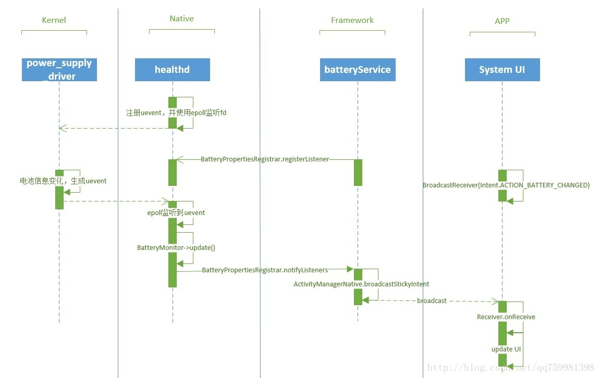
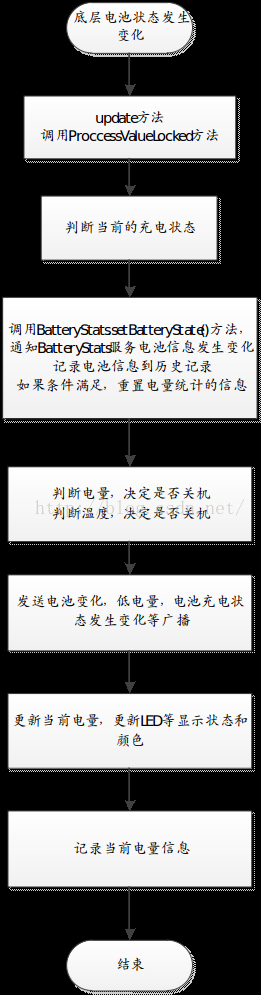

# BatteryService服务分析

BatteryService是在systemServer启动核心服务的时候启动的。BatteryService用于获取电池信息、充电状态等，如果想对Android的功耗控制有更深入的了解，有必要分析一下。

# 前言


BatteryService负责监听充电状态和电量变化，当电量值或者充电类型改变时，会获取到底层healthd上报的电池状态信息，并更新到BatteryStatsService中进行统计，同时会将这些值存储到Intent中，以广播的形式发送到监听了ACTION_BATTERY_CHANGED的组件中，其他组建可以通过Intent.getExtra()的方式获取到电池信息。

先上一幅图，对电量上报的流程有个整体的概念，后续对该图的各个部分进行讲解。



# 参考文档

* [Android 8.1 BatteryService服务分析](https://blog.csdn.net/zhenjie_chang/article/details/52512990)
* [BatteryService：电池电量管理](https://blog.csdn.net/renshuguo123723/article/details/87431240)
* [分析Android11 Settings里面电池信息获取流程，在里面添加显示电池温度的功能](https://blog.csdn.net/qq_37858386/article/details/125205834)
* [BatteryService在线代码](http://aospxref.com/android-12.0.0_r3/xref/frameworks/base/services/core/java/com/android/server/BatteryService.java)
* [Android 8.1 Battery系列(一) BatteryService分析](https://blog.csdn.net/FightFightFight/article/details/82353373)
* [BatteryProperty上报流程](https://blog.csdn.net/u011636692/article/details/87874954)
* [Android中Battery电量上报流程分析01-整体架构拆解](https://blog.csdn.net/qq759981398/article/details/73155782)

# BatteryService的启动流程

BatteryService继承于SyetemService,SyetemService是所有系统服务的基类，每个SyetemService的启动流程都具有相同的步骤，他们实现并重写其父类方法。因此，在分析BatteryService之前，先看看SystemServer的启动相关方法。SystemServer启动时调用方法如下，并且都是在SystemServer的main线程中运行：

1. Constructor()：构造方法，通过反射的方式调用；
2. onStart()：开始运行服务；
3. onBootPhase(int)：该方法表示启动阶段，会根据不同的参数（阶段）调用多次，直到PHASE_BOOT_COMPLETED阶段调用后不再调用，表示启动完成，对于每个阶段，可以完成特定的工作；

了解了上述内容后，着手分析BatteryService就容易多了,首先，BatteryService会在SystemServer中进行启动：
```java
/**
 * The main entry point from zygote.
 */
public static void main(String[] args) {
    new SystemServer().run();
}
```

启动SystemServer后，在main()函数中调用了run()方法，在run()方法中，启动三种服务：
```java
private void run() {
    ......
// Start services.
    try {
    //启动引导服务
        startBootstrapServices();
    //启动核心服务
        startCoreServices();
    //启动其他服务
        startOtherServices();
    //关闭启动线程池
        SystemServerInitThreadPool.shutdown();
    ......
    } catch (Throwable ex) {
        throw ex;
    } finally {
        traceEnd();
    }
}
```

1. startBootstrapServices()中启动的是一些依赖性比较高的系统服务(所以方法名为"引导服务")，如PMS就是在这里进行启动的。
2. startCoreServices()中启动一些核心服务，从代码中看，启动的核心服务有四种，其中就包括要分析的BatteryService。
3. startOtherServices()用来启动其他的一些服务。

在startCoreServices()中，通过SystemServiceManager中的方法，传入类名作为参数，利用反射机制对BatteryService进行实例化（构造函数）：
```java
public <T extends SystemService> T startService(Class<T> serviceClass) {
    try {
        final String name = serviceClass.getName();
        ......
        final T service;
        try {
            Constructor<T> constructor = serviceClass.getConstructor(Context.class);
            service = constructor.newInstance(mContext);
        } catch (InstantiationException ex) 
        }
        startService(service);
        return service;
    } finally {
    }
}
public void startService(@NonNull final SystemService service) {
    // Register it.
    mServices.add(service);
    long time = SystemClock.elapsedRealtime();
    try {
        //调用onStart()方法开启服务
        service.onStart();
    } catch (RuntimeException ex) {
    }
}
```

分析到这一步，SystemServive的生命周期方法就剩下onBootPhase()方法了，这个方法也说过了，是负责启动启动服务的过程中分阶段进行一些工作的，也运行在SystemServer的main线程中：
```java
private void startOtherServices() {
    ......
    mSystemServiceManager.startBootPhase(
          SystemService.PHASE_LOCK_SETTINGS_READY);
    mSystemServiceManager.startBootPhase(
          SystemService.PHASE_SYSTEM_SERVICES_READY);
    mSystemServiceManager.startBootPhase(
              SystemService.PHASE_ACTIVITY_MANAGER_READY);
    mSystemServiceManager.startBootPhase(
              SystemService.PHASE_THIRD_PARTY_APPS_CAN_START);
    mSystemServiceManager.startBootPhase(
              SystemService.PHASE_WAIT_FOR_DEFAULT_DISPLAY);
    ......
 }
```

SystemServiceManager中：
```java
public void startBootPhase(final int phase) {
    ......
    mCurrentPhase = phase;
    try {
        final int serviceLen = mServices.size();
        for (int i = 0; i < serviceLen; i++) {
            final SystemService service = mServices.get(i);
            long time = SystemClock.elapsedRealtime();
            try {
                service.onBootPhase(mCurrentPhase);
            } catch (Exception ex) {
            }
        }
    } finally {
    }
}
```

到这里，SystemServer中启动BatteryService相关的内容就完毕了，现在依次看看在SystemServer中启动时，BatteryService中的构造方法、onStart()方法、onBootPhase()方法中都做了些什么。

## BatteryService中的构造方法Constructor()

首先看调用构造方法时的处理，在BatteryService中：
```java
BatteryService.java
 
public BatteryService(Context context) {
    super(context);
 
    mContext = context;
    mHandler = new Handler(true /*async*/);
 
    //Led封装了LightsManager,不同电量下led灯的颜色就由它来控制
    mLed = new Led(context, getLocalService(LightsManager.class));
 
    //电池属性改变的时候,会将全部信息写到mBatteryStats中,app端从mBatteryStats中获取当前电池的电量以及状态
    mBatteryStats = BatteryStatsService.getService();
    mActivityManagerInternal = LocalServices.getService(ActivityManagerInternal.class);
 
    //以下是根据配置文件,定义不同电量对应的等级
 
    //电池危急的电量；当电池电量低于此值时,将强制关机,这里是5
    mCriticalBatteryLevel = mContext.getResources().getInteger(
            com.android.internal.R.integer.config_criticalBatteryWarningLevel);
 
    //低电警告的电量；当电池电量低于此值时,系统报警,例如闪烁LED灯等,这里是15
    mLowBatteryWarningLevel = mContext.getResources().getInteger(
            com.android.internal.R.integer.config_lowBatteryWarningLevel);
 
    //关闭低电警告的电量；当电池电量高于此值时,结束低电状态,停止警示灯,这里是20
    mLowBatteryCloseWarningLevel = mLowBatteryWarningLevel + mContext.getResources().getInteger(
            com.android.internal.R.integer.config_lowBatteryCloseWarningBump);
 
    //关闭电池的温度（温度失控，就会出现三星S7爆炸啥的......）
    mShutdownBatteryTemperature = mContext.getResources().getInteger(
            com.android.internal.R.integer.shutdownBatteryTemperature);
 
    // 监控终端是否连接不匹配的充电器
    if (new File("/sys/devices/virtual/switch/invalid_charger/state").exists()) {
        UEventObserver invalidChargerObserver = new UEventObserver() {
            @Override
            public void onUEvent(UEvent event) {
                final int invalidCharger = "1".equals(event.get("SWITCH_STATE")) ? 1 : 0;
                synchronized (mLock) {
                    if (mInvalidCharger != invalidCharger) {
                        mInvalidCharger = invalidCharger;
                    }
                }
            }
        };
        invalidChargerObserver.startObserving(
                "DEVPATH=/devices/virtual/switch/invalid_charger");
    }
}
```

在构造方法中，详细信息都进行了注释，这里有两点需重点说明一下：

1. 先看第一点：初始化了mBatteryStats，该对象类型为IBatteryStats，这里使用了Binder机制，在分析BatteryStatsService时将会知道，BatteryStatsService继承于IBatteryStats.Stub，因此，可以把BatteryStatsService作为Binder的服务端来使用。

2. 再分析第二点：UEvent机制。UEvent是kernel通知用户空间的一种机制，很多地方都用到了UEvent机制，如USB插拔/充电等，其本质是内核发送一个字符串(可通过Socket)，应用层接受并解释该字符串，获取相应信息，如果信息有变化，onUEevent()触发，做出改变。
使用该机制时，需要一个UEventObserver对象，并重写onUEvent(UEvent e)方法，然后调用startObserving()进行监听,当一个uevent匹配startObserving(String)中指定的string时触发onUEvent();

## onStart()

到这时，BatteryService的构造方法分析完毕了，根据启动流程，接下来执行的是第二步，onStart()方法，如下：
```java
@Override
public void onStart() {
    //注册Health并执行回调结果，Health是底层的一个对电池状态监听和获取电池信息的重要层级
    registerHealthCallback();
    //实例化自身
    mBinderService = new BinderService();
    //注册本身的服务
    publishBinderService("battery", mBinderService);
    //注册电池监听，当底层电池电量发生变化调用此监听，并调用update。
    mBatteryPropertiesRegistrar = new BatteryPropertiesRegistrar();
    //调用 publishBinderService(…) 发布 battery、batteryproperties 服务；
    publishBinderService("batteryproperties", mBatteryPropertiesRegistrar);
    //调用 publishLocalService(…) 发布本地服务 BatteryManagerInternal（电池管理器本地系统服务接口）。
    publishLocalService(BatteryManagerInternal.class, new LocalService());
}
```

在onStart()中，首先获取了一个“batterypropeties”的Binder，也即IBatteryPropertiesRegistrar，这个服务由healthd层进行注册，底层每间隔1分钟，会通过这个服务将电池状态信息更新给BatteryService.
* `hardware/interfaces/health/utils/libhealthloop/utils.cpp`:
```c
// Periodic chores fast interval in seconds
  #define DEFAULT_PERIODIC_CHORES_INTERVAL_SLOW (60 * 10)
```

然后，实例化了内部类BinderService，该类继承自Binder,然后将这个Binder通过publishBinderService()发布到了系统服务中，就像之前分析PowerManagerService一样，目的是可以通过getSystemService(String)来获取其实例。
publishLocalService()方法中将BatteryService的内部类LocalService注册到了本地服务中，LocalService中提供了一些getxxx()获取电池相关的方法，且仅限于SystemServer进程内使用。

可以看到主要工作是做了一些服务的注册，最重要的就是registerHealthCallback()和BinderService()

### registerHealthCallback

```java
private void registerHealthCallback() {
        traceBegin("HealthInitWrapper");
        mHealthServiceWrapper = new HealthServiceWrapper();//第一步
        mHealthHalCallback = new HealthHalCallback();//第二步
        // IHealth is lazily retrieved.
        try {
            mHealthServiceWrapper.init(mHealthHalCallback,
                    new HealthServiceWrapper.IServiceManagerSupplier() {},
                    new HealthServiceWrapper.IHealthSupplier() {});
        } catch (RemoteException ex) {
            Slog.e(TAG, "health: cannot register callback. (RemoteException)");
            throw ex.rethrowFromSystemServer();
        } catch (NoSuchElementException ex) {
            Slog.e(TAG, "health: cannot register callback. (no supported health HAL service)");
            throw ex;
        } finally {
            traceEnd();
        }

        traceBegin("HealthInitWaitUpdate");
 ...
    }
```

看到第一步 ：该方法是来确定要使用的Health服务实例(来自vender的“default”实例或来自healthd的“backup”实例)。然后通过IHealth.registerCallback监听取Health事件，做一些init操作，注册相应的关系。这里对这个暂不深究

第二步：HealthHalCallback()是一个非常关键的回调，用于将Health层的数据回调到framework层，包含了电池的大部分信息（电池充电状态，等），接着进入该方法，看看主要逻辑

### HealthHalCallback

该类继承了HealthInfoCallback.Stub，用AIDL跨进程方式去对电池信息做回调动作，所以在这里看不见JNI的东西，另外插个话 监听电池电量变化是用广播(ACTION_BATTERY_CHANGED BATTERY_CHANGED )形式发送给{@link android.content.BroadcastReceiver IntentReceivers}这类的服务。
```java
private final class HealthHalCallback extends IHealthInfoCallback.Stub
            implements HealthServiceWrapper.Callback {
        @Override public void healthInfoChanged(android.hardware.health.V2_0.HealthInfo props) {
            BatteryService.this.update(props);//Health层回调数据给上层，用广播形式通知到上层
        }
     
        // on new service registered
        @Override public void onRegistration(IHealth oldService, IHealth newService,
                String instance) {
            if (newService == null) return;

            traceBegin("HealthUnregisterCallback");
            try {
                if (oldService != null) {
                    int r = oldService.unregisterCallback(this);
                    if (r != Result.SUCCESS) {
                        Slog.w(TAG, "health: cannot unregister previous callback: " +
                                Result.toString(r));
                    }
                }
            } catch (RemoteException ex) {
                Slog.w(TAG, "health: cannot unregister previous callback (transaction error): "
                            + ex.getMessage());
            } finally {
                traceEnd();
            }

            traceBegin("HealthRegisterCallback");
            try {
                int r = newService.registerCallback(this);
                if (r != Result.SUCCESS) {
                    Slog.w(TAG, "health: cannot register callback: " + Result.toString(r));
                    return;
                }
                // registerCallback does NOT guarantee that update is called
                // immediately, so request a manual update here.
                newService.update();//电池数据回调
            } catch (RemoteException ex) {
                Slog.e(TAG, "health: cannot register callback (transaction error): "
                        + ex.getMessage());
            } finally {
                traceEnd();
            }
        }
    }
```

这里主要看的就是update()方法，接着往下看。

### update

该方法就是Health层通过发起广播，执行跨进程事件，回调到上层来的数据，先看代码
```java
private void update(android.hardware.health.V2_0.HealthInfo info) {
    ...  
        synchronized (mLock) {
            if (!mUpdatesStopped) {
                // 将数据拿到赋值给mHealthInfo
                mHealthInfo = info.legacy;
                // Process the new values.
                // 处理mHealthInfo的主要实现方法
                processValuesLocked(false);
                mLock.notifyAll(); // for any waiters on new info
            } else {
                copy(mLastHealthInfo, info.legacy);
            }
        }
   ...
    }
```

### processValuesLocked

在BatteryService中，有三个地方调用了processValuesLocked():

1. 启动BatteryService时，在onBootPhase()方法中的updateBatteryWarningLock()方法中；
2. 在healthd层向BatteryService更新电池状态信息的update()方法中，这里会每分钟调用一次；
3. 通过adb shell命令dump时在processValuesFromShellLocked()中。

该方法很长，包含了充电类型判断，电量低时的广播，插入充电/拔出充电的广播，LED灯闪烁等功能，所以直接上代码，在注释里看解释：
```java
private void processValuesLocked(boolean force) {
    boolean logOutlier = false;
    long dischargeDuration = 0;
//获取电池电量是否低于critical界限
    mBatteryLevelCritical =
        mHealthInfo.batteryStatus != BatteryManager.BATTERY_STATUS_UNKNOWN
        && mHealthInfo.batteryLevel <= mCriticalBatteryLevel;
//判断是AC/USB/WLC中的哪一种充电方式
    if (mHealthInfo.chargerAcOnline) {
        mPlugType = BatteryManager.BATTERY_PLUGGED_AC;
    } else if (mHealthInfo.chargerUsbOnline) {
        mPlugType = BatteryManager.BATTERY_PLUGGED_USB;
    } else if (mHealthInfo.chargerWirelessOnline) {
        mPlugType = BatteryManager.BATTERY_PLUGGED_WIRELESS;
    } else {
        mPlugType = BATTERY_PLUGGED_NONE;
    }

    if (DEBUG) {
        Slog.d(TAG, "Processing new values: "
                + "info=" + mHealthInfo
                + ", mBatteryLevelCritical=" + mBatteryLevelCritical
                + ", mPlugType=" + mPlugType);
    }

    // Let the battery stats keep track of the current level.
    try {
        mBatteryStats.setBatteryState(mHealthInfo.batteryStatus, mHealthInfo.batteryHealth,
                mPlugType, mHealthInfo.batteryLevel, mHealthInfo.batteryTemperature,
                mHealthInfo.batteryVoltage, mHealthInfo.batteryChargeCounter,
                mHealthInfo.batteryFullCharge);
    } catch (RemoteException e) {
        // Should never happen.
    }
    //低电量关机
    shutdownIfNoPowerLocked();
    //电池温度过高关机
    shutdownIfOverTempLocked();
    //force是第一次调用时标志，如果状态有更改依然会调用下面的代码
    if (force || (mHealthInfo.batteryStatus != mLastBatteryStatus ||
            mHealthInfo.batteryHealth != mLastBatteryHealth ||
            mHealthInfo.batteryPresent != mLastBatteryPresent ||
            mHealthInfo.batteryLevel != mLastBatteryLevel ||
            mPlugType != mLastPlugType ||
            mHealthInfo.batteryVoltage != mLastBatteryVoltage ||
            mHealthInfo.batteryTemperature != mLastBatteryTemperature ||
            mHealthInfo.maxChargingCurrent != mLastMaxChargingCurrent ||
            mHealthInfo.maxChargingVoltage != mLastMaxChargingVoltage ||
            mHealthInfo.batteryChargeCounter != mLastChargeCounter ||
            mInvalidCharger != mLastInvalidCharger)) {
        //插入状态有更改，mLastPlugType是记录上一次充电方式，mPlugType是当前充电方式
        if (mPlugType != mLastPlugType) {
            if (mLastPlugType == BATTERY_PLUGGED_NONE) {
                //没充电状态到充电状态
                // discharging -> charging
                mChargeStartLevel = mHealthInfo.batteryLevel;
                mChargeStartTime = SystemClock.elapsedRealtime();

                final LogMaker builder = new LogMaker(MetricsEvent.ACTION_CHARGE);
                builder.setType(MetricsEvent.TYPE_ACTION);
                builder.addTaggedData(MetricsEvent.FIELD_PLUG_TYPE, mPlugType);
                builder.addTaggedData(MetricsEvent.FIELD_BATTERY_LEVEL_START,
                        mHealthInfo.batteryLevel);
                mMetricsLogger.write(builder);

                // There's no value in this data unless we've discharged at least once and the
                // battery level has changed; so don't log until it does.
                if (mDischargeStartTime != 0 && mDischargeStartLevel != mHealthInfo.batteryLevel) {
                    dischargeDuration = SystemClock.elapsedRealtime() - mDischargeStartTime;
                    logOutlier = true;
                    EventLog.writeEvent(EventLogTags.BATTERY_DISCHARGE, dischargeDuration,
                            mDischargeStartLevel, mHealthInfo.batteryLevel);
                    // make sure we see a discharge event before logging again
                    mDischargeStartTime = 0;
                }
            } else if (mPlugType == BATTERY_PLUGGED_NONE) {
                //充电状态到未充电状态 或者开机上电
                // charging -> discharging or we just powered up
                mDischargeStartTime = SystemClock.elapsedRealtime();
                mDischargeStartLevel = mHealthInfo.batteryLevel;

                long chargeDuration = SystemClock.elapsedRealtime() - mChargeStartTime;
                if (mChargeStartTime != 0 && chargeDuration != 0) {
                    final LogMaker builder = new LogMaker(MetricsEvent.ACTION_CHARGE);
                    builder.setType(MetricsEvent.TYPE_DISMISS);
                    builder.addTaggedData(MetricsEvent.FIELD_PLUG_TYPE, mLastPlugType);
                    builder.addTaggedData(MetricsEvent.FIELD_CHARGING_DURATION_MILLIS,
                            chargeDuration);
                    builder.addTaggedData(MetricsEvent.FIELD_BATTERY_LEVEL_START,
                            mChargeStartLevel);
                    builder.addTaggedData(MetricsEvent.FIELD_BATTERY_LEVEL_END,
                            mHealthInfo.batteryLevel);
                    mMetricsLogger.write(builder);
                }
                mChargeStartTime = 0;
            }
        }
        // 电池状态更新
        if (mHealthInfo.batteryStatus != mLastBatteryStatus ||
                mHealthInfo.batteryHealth != mLastBatteryHealth ||
                mHealthInfo.batteryPresent != mLastBatteryPresent ||
                mPlugType != mLastPlugType) {
            EventLog.writeEvent(EventLogTags.BATTERY_STATUS,
                    mHealthInfo.batteryStatus, mHealthInfo.batteryHealth, mHealthInfo.batteryPresent ? 1 : 0,
                    mPlugType, mHealthInfo.batteryTechnology);
        }
        // 电池电量更新
        if (mHealthInfo.batteryLevel != mLastBatteryLevel) {
            // Don't do this just from voltage or temperature changes, that is
            // too noisy.
            EventLog.writeEvent(EventLogTags.BATTERY_LEVEL,
                    mHealthInfo.batteryLevel, mHealthInfo.batteryVoltage, mHealthInfo.batteryTemperature);
        }
        
        // 记录电池快没电状态
        if (mBatteryLevelCritical && !mLastBatteryLevelCritical &&
                mPlugType == BATTERY_PLUGGED_NONE) {
            // We want to make sure we log discharge cycle outliers
            // if the battery is about to die.
            dischargeDuration = SystemClock.elapsedRealtime() - mDischargeStartTime;
            logOutlier = true;
        }

        //电量低时是否切换到低电量模式
        if (!mBatteryLevelLow) {
            // Should we now switch in to low battery mode?
            if (mPlugType == BATTERY_PLUGGED_NONE
                    && mHealthInfo.batteryStatus !=
                        BatteryManager.BATTERY_STATUS_UNKNOWN
                    && mHealthInfo.batteryLevel <= mLowBatteryWarningLevel) {
                mBatteryLevelLow = true;
            }
        } else {
            // Should we now switch out of low battery mode?
            if (mPlugType != BATTERY_PLUGGED_NONE) {
                mBatteryLevelLow = false;
            } else if (mHealthInfo.batteryLevel >= mLowBatteryCloseWarningLevel)  {
                mBatteryLevelLow = false;
            } else if (force && mHealthInfo.batteryLevel >= mLowBatteryWarningLevel) {
                // If being forced, the previous state doesn't matter, we will just
                // absolutely check to see if we are now above the warning level.
                mBatteryLevelLow = false;
            }
        }

        mSequence++;

        // Separate broadcast is sent for power connected / not connected
        // since the standard intent will not wake any applications and some
        // applications may want to have smart behavior based on this.
        //插入充电时，发送广播，播放提示音和更新充电UI
        if (mPlugType != 0 && mLastPlugType == 0) {
            final Intent statusIntent = new Intent(Intent.ACTION_POWER_CONNECTED);
            statusIntent.setFlags(Intent.FLAG_RECEIVER_REGISTERED_ONLY_BEFORE_BOOT);
            statusIntent.putExtra(BatteryManager.EXTRA_SEQUENCE, mSequence);
            mHandler.post(new Runnable() {
                @Override
                public void run() {
                    mContext.sendBroadcastAsUser(statusIntent, UserHandle.ALL);
                }
            });
        }
        //断开充电时，发送广播，播放提示音和更新充电UI
        else if (mPlugType == 0 && mLastPlugType != 0) {
            final Intent statusIntent = new Intent(Intent.ACTION_POWER_DISCONNECTED);
            statusIntent.setFlags(Intent.FLAG_RECEIVER_REGISTERED_ONLY_BEFORE_BOOT);
            statusIntent.putExtra(BatteryManager.EXTRA_SEQUENCE, mSequence);
            mHandler.post(new Runnable() {
                @Override
                public void run() {
                    mContext.sendBroadcastAsUser(statusIntent, UserHandle.ALL);
                }
            });
        }
        // 低电量电池事件通知
        if (shouldSendBatteryLowLocked()) {
            mSentLowBatteryBroadcast = true;
            final Intent statusIntent = new Intent(Intent.ACTION_BATTERY_LOW);
            statusIntent.setFlags(Intent.FLAG_RECEIVER_REGISTERED_ONLY_BEFORE_BOOT);
            statusIntent.putExtra(BatteryManager.EXTRA_SEQUENCE, mSequence);
            mHandler.post(new Runnable() {
                @Override
                public void run() {
                    mContext.sendBroadcastAsUser(statusIntent, UserHandle.ALL);
                }
            });
        } else if (mSentLowBatteryBroadcast &&
                mHealthInfo.batteryLevel >= mLowBatteryCloseWarningLevel) {
            mSentLowBatteryBroadcast = false;
            final Intent statusIntent = new Intent(Intent.ACTION_BATTERY_OKAY);
            statusIntent.setFlags(Intent.FLAG_RECEIVER_REGISTERED_ONLY_BEFORE_BOOT);
            statusIntent.putExtra(BatteryManager.EXTRA_SEQUENCE, mSequence);
            mHandler.post(new Runnable() {
                @Override
                public void run() {
                    mContext.sendBroadcastAsUser(statusIntent, UserHandle.ALL);
                }
            });
        }


        //当以上的广播完成后，该方法主要用于记录mHealthInfo的状态信息，就是电池的一些状态+电池是否充电的信息+电量等信息
        //发送粘性广播给everyone
        sendBatteryChangedIntentLocked();
        if (mLastBatteryLevel != mHealthInfo.batteryLevel || mLastPlugType != mPlugType) {
            sendBatteryLevelChangedIntentLocked();
        }
        //更新Led灯信息
        mLed.updateLightsLocked();

        // This needs to be done after sendIntent() so that we get the lastest battery stats.
        if (logOutlier && dischargeDuration != 0) {
            logOutlierLocked(dischargeDuration);
        }
        //记录上一次mHealthInfo的状态
        mLastBatteryStatus = mHealthInfo.batteryStatus;
        mLastBatteryHealth = mHealthInfo.batteryHealth;
        mLastBatteryPresent = mHealthInfo.batteryPresent;
        mLastBatteryLevel = mHealthInfo.batteryLevel;
        mLastPlugType = mPlugType;
        mLastBatteryVoltage = mHealthInfo.batteryVoltage;
        mLastBatteryTemperature = mHealthInfo.batteryTemperature;
        mLastMaxChargingCurrent = mHealthInfo.maxChargingCurrent;
        mLastMaxChargingVoltage = mHealthInfo.maxChargingVoltage;
        mLastChargeCounter = mHealthInfo.batteryChargeCounter;
        mLastBatteryLevelCritical = mBatteryLevelCritical;
        mLastInvalidCharger = mInvalidCharger;
    }
}
```

以上可以概括为：
1. 获取充电类型。
2. 更新统计电池状态信息。
3. 进行低电量时和高温时的关机。
4. 充电类型改变时获取放电时长和放电量。
5. 更新低电量临界值。
6. 发送充电/放电广播和到达低电量/退出低电量广播。
7. 调用sendBatteryChangedIntentLocked()方法发送粘性广播。
8. 更新LED灯状态。
9. 更新电池信息。

* 流程图如下：



### BatteryPropertiesRegistrar

首先，会在系统服务中获取“batteryproperties”注册的服务，获取到的对象为Binder，那么这个名为“batteryproperties”的系统服务，它是在何处进行注册的呢？

在onStart()方法里面，如下：
```java
@Override
public void onStart() {
    mBatteryPropertiesRegistrar = new BatteryPropertiesRegistrar();
    //调用 publishBinderService(…) 发布 battery、batteryproperties 服务；
}
```

BatteryManager的构造函数获取`batteryproperties`服务：
```java
    public BatteryManager() {
          mContext = null;
          mBatteryStats = IBatteryStats.Stub.asInterface(
                  ServiceManager.getService(BatteryStats.SERVICE_NAME));
          mBatteryPropertiesRegistrar = IBatteryPropertiesRegistrar.Stub.asInterface(
                  ServiceManager.getService("batteryproperties"));
      }
```

以下接口给上层直接获取系统电量的方法:
```java
BatteryManager batteryManager = (BatteryManager) getSystemService(BATTERY_SERVICE);
batteryManager.getIntProperty(BatteryManager.BATTERY_PROPERTY_CAPACITY);
```


通过BatteryManager主动获取电池容量，程序流程：
```log
* batteryManager.getIntProperty(BatteryManager.BATTERY_PROPERTY_CAPACITY);
  * getIntProperty(int id) //frameworks/base/core/java/android/os/BatteryManager.java
    * long value = queryProperty(id); //
      * mBatteryPropertiesRegistrar.getProperty(id, prop) == 0 //调用batteryproperties服务
      * ret = prop.getLong();//当前电量返回结果
        * public int getProperty(int id, final BatteryProperty prop) throws RemoteException //BatteryServices.java
        * if (result == Result.SUCCESS) prop.setLong(value);
          * case BatteryManager.BATTERY_PROPERTY_CAPACITY
            * service.getCapacity((int result, int value) //这里的service其实就是HIDL了
              * Return<void> Health::getCapacity(getCapacity_cb _hidl_cb)  //hardware/interfaces/health/utils/libhealth2impl/Health.cpp
                * GetProperty<int32_t>(&battery_monitor_, BATTERY_PROP_CAPACITY, 0, _hidl_cb);
                  * monitor->getProperty(static_cast<int>(id), &prop);
                    * BatteryMonitor::getProperty(int id, struct BatteryProperty *val) //system/core/healthd/BatteryMonitor.cpp
                      * case BATTERY_PROP_CAPACITY:
                        * getIntField(mHealthdConfig->batteryCapacityPath); //读取sys/class/power_supply/battery/capacity
                          *  if (readFromFile(path, &buf) > 0)
                  * callback(result, static_cast<T>(ret)); //调用batteryservice传下来的回调函数，参数为Result::SUCCESS，ret
```

callback这个回调函数就做了一个动作,prop.setLong(value);//这个value即是 BatteryProperty中的valueInt64的值；
```java
     // Reduced IBatteryPropertiesRegistrar that only implements getProperty for usage
      // in BatteryManager.
      private final class BatteryPropertiesRegistrar extends IBatteryPropertiesRegistrar.Stub {
         @Override
          public int getProperty(int id, final BatteryProperty prop) throws RemoteException {
              traceBegin("HealthGetProperty");
          try {
                  IHealth service = mHealthServiceWrapper.getLastService();
                 if (service == null) throw new RemoteException("no health service");
                  final MutableInt outResult = new MutableInt(Result.NOT_SUPPORTED);
                 switch(id) {
                      case BatteryManager.BATTERY_PROPERTY_CAPACITY://here we are
                          service.getCapacity((int result, int value) -> {
                              outResult.value = result;
                              if (result == Result.SUCCESS) prop.setLong(value);
                          });
                          break;
                 }
          }
    }
}
```

* [android 9.0 getIntProperty获取系统当前电量流程分析(一)](https://blog.csdn.net/potato_man/article/details/90906543)

## onBootPhase()

onStart()方法调用之后，当ActivityManager启动完成的时候，回调onBootPhase方法：
```java
@Override
public void onBootPhase(int phase) {
    if (phase == PHASE_ACTIVITY_MANAGER_READY) {
        // check our power situation now that it is safe to display the shutdown dialog.
        synchronized (mLock) {
            //注册一个低电量监听
            ContentObserver obs = new ContentObserver(mHandler) {
                @Override
                public void onChange(boolean selfChange) {
                    synchronized (mLock) {
                        updateBatteryWarningLevelLocked();
                    }
                }
            };
            final ContentResolver resolver = mContext.getContentResolver();
            resolver.registerContentObserver(Settings.Global.getUriFor(
                    Settings.Global.LOW_POWER_MODE_TRIGGER_LEVEL),
                    false, obs, UserHandle.USER_ALL);
            updateBatteryWarningLevelLocked();
        }
    }
}
```

onBootPhase方法很简单，就是注册了一个关于ContentObserver来监测设置中关于低电量警告的电量值是否改变,
如果该电量值发生变化，回调updateBatteryWarningLevelLocked()方法。
```java
private void updateBatteryWarningLevelLocked() {
    final ContentResolver resolver = mContext.getContentResolver();
    //获取配置文件中存储的低电量触发默认值,15
    int defWarnLevel = mContext.getResources().getInteger(
            com.android.internal.R.integer.config_lowBatteryWarningLevel);
    //获取Settings.Global中存储的低电量触发值
    mLowBatteryWarningLevel = Settings.Global.getInt(resolver,
            Settings.Global.LOW_POWER_MODE_TRIGGER_LEVEL, defWarnLevel);
    if (mLowBatteryWarningLevel == 0) {
        mLowBatteryWarningLevel = defWarnLevel;
    }
    if (mLowBatteryWarningLevel < mCriticalBatteryLevel) {
        mLowBatteryWarningLevel = mCriticalBatteryLevel;
    }
    mLowBatteryCloseWarningLevel = mLowBatteryWarningLevel + mContext.getResources().getInteger(
            com.android.internal.R.integer.config_lowBatteryCloseWarningBump);
    //更新电池状态信息的核心方法
    processValuesLocked(true);
}
```

这个方法中更新了低电量警告值和关闭低电量警告的值，在资源文件中定义的值如下：
```xml
<!-- Display low battery warning when battery level dips to this value -->
<integer name="config_lowBatteryWarningLevel">15</integer>
<!-- Close low battery warning when battery level reaches the lowBatteryWarningLevel plus this -->
<integer name="config_lowBatteryCloseWarningBump">5</integer>
```

从以上内容可知，默认情况下，当电量达到15%时会弹出低电量提示。

在上述方法的最后，调用了processValuesLocked()方法，它是BatteryService中最核心的方法,请参考上面。