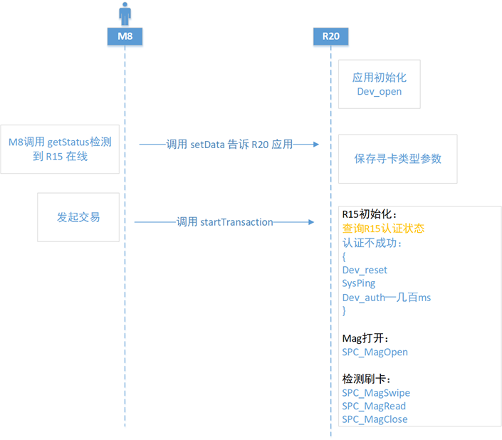
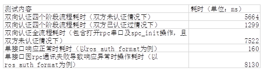

# 概述
R15/M8/R20刷卡逻辑分析


## 应用交易逻辑分析



### 1.关于耗时讨论
```
当前R20 端应用对于 R15 初始化处理：

spc_init

dev_reset

sys_ping / getid（确认 R15 状态）

dev_auth


设备首次初始化：7~8s

设备后续初始化：3~4s

期望耗时：<2s
```

* 张媛测试耗时：



## 耗时问题点分析

### (1)交易前是否双向认证方案

* 发起交易时，M8应用通过ros_auth_get_state (判断R15认证状态)和auth_get_state(判断R20认证状态)接口判断认证状态，每次需要执行spc_init后再使用该接口进行判断，认证不成功则重新进行双向认证。

对策：
* R20 APP层：让R20 应用在初始化处理前，查询 R20-15 双向认证状态，如果认证状态为：
  * 已认证成功，则直接操作 spc_magopen, ...，省掉4s；
  * 否则，需要进行初始化处理, spc_init, dev_reset, ...；

### (2) 双向认证过程中断开R15

在双向认证过程中接入USB debug，可能会在SpcInit函数中进行reset、sys_ping等接口操作时出错，但是此时没有立即退出，仍在顺序执行，因此各个接口调用均响应异常，累计的时间消耗较大，另外在调用AdaptMagOpen时，会存在中途R15移除，但是因判断条件不充分导致仍执行了SPC_MagOpen操作导致有时间损耗；以上问题的根本原因是在rpc串口通讯异常时，接口响应耗时较久，需要哲锋和奕利看一下能不能优化；应用方面建议进行优化减少不必要的耗时。

* 测试：当spc_init完成后，接入PC断开R15，此时调用ros_auth_reset  à sys_ping à sys_getid à SPC_MagOpen这一个流程下来耗时总计32520ms。

对策：
libspc.a 改动：新增接口设置超时；（底层发布该接口同时，提供相关说明，比如，最少需要多少时间，或建议时长），时长最好是自己测试100次，选取最长的时间。

### （3）M8经常就会Crash

在下载R15 boot/os时，步骤是重启-握手-下载-重启过程，edm在握手连接设备操作文件时，R15重启导致文件读写失败从而M8 crash，现优化为在R15重启时，先暂停握手线程，然后等重启完成后再握手。

## 特殊软件处理

* 1.R15上电后，要延迟1秒才能发指令给R20，因为dts需要时间建立R15/R20透传通路，不然R20会出现spc_init失败，同时防止枚举成ACM1???。

* 2.R15有两次枚举，层当app主动调用powercontrol和wakeup接口时，R15 boot阶段第一次枚举(get_status返回状态2)不弹窗不发送通知广播。dts规避R15重启2次枚举，第一次枚举不做任何处理。手动拔插皮套逻辑不变，还是弹框广播。

* 3.dts处理R15枚举2次导致死机问题（枚举成功后，延时2.5s，先判断R15成功枚举后，再启动透传），由于第一次boot阶段枚举时，dts去open acm0节点了，但是马上掉了，容易出现内存跑飞，所以执行此策略。

* 4.pdm下载R15 boot没下完就下电，导致R15无法启动。对策：boot下载过程中，收到boot下载成功的消息，其实此时R15 boot还在做数据拷贝，这个持续几秒时间，pdm下载完成后会去查询设备状态或者多任务下载R15 os，这个时候需要重启R15，导致可能R15 boot没拷贝完就下电了，boot损坏。后续修改boot下载收到成功信号的时候,检测是否重新枚举，然后再返回。

* 