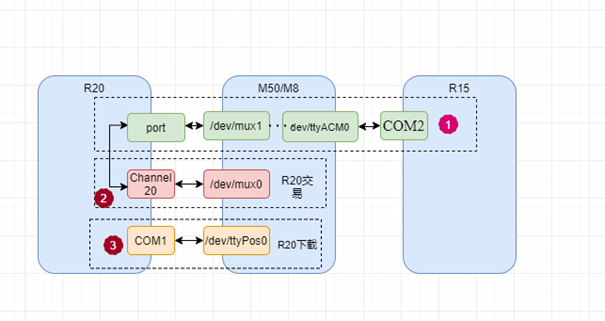

# 问题描述
插入USB，仅充电模式，休眠，等待10s以上待切换device，亮屏，拔出USB，此时出现两次连续的USB DETTACH和ATTACH。



## log抓取

### 1.不接入USB正常机器

```log
main log:
收到dettach，发广播：
04-21 18:54:27.001753  2172  2172 E DTS/UsbDeviceReceiver: onReceive: pid = 1026, vid = 12216, action = android.hardware.usb.action.USB_DEVICE_DETACHED
04-21 18:54:27.002587  1122  1289 W UsbDescriptorParser:   Unparsed Class-specific
04-21 18:54:27.002983  1122  1289 I chatty  : uid=1000(system) UsbService host identical 2 lines
04-21 18:54:27.003043  1122  1289 W UsbDescriptorParser:   Unparsed Class-specific
04-21 18:54:27.002975  6379  6379 E 222222222222222: android.hardware.usb.action.USB_DEVICE_DETACHED  1026 vid 12216

kernel log:
灭屏：
04-21 18:54:16.905600 <6>[ 9150.853849] .(6)[500:composer@2.1-se]#@# cm_mgr_fb_notifier_callback(127) SCREEN OFF

USB DETTACH:
04-21 18:54:26.974433 <5>[ 9160.922682] -(2)[6611:kworker/2:3][MUSB]musb_hub_control 355: port status 00010100,devctl=0x19
04-21 18:54:26.974500 <6>[ 9160.922749] .(2)[6611:kworker/2:3]usb 1-1: USB disconnect, device number 44
04-21 18:54:26.974511 <6>[ 9160.922760] .(2)[6611:kworker/2:3]usb 1-1.2: USB disconnect, device number 46
04-21 18:54:26.974746 <3>[ 9160.922995] .(2)[6611:kworker/2:3]cdc_acm 1-1.2:1.0: failed to set dtr/rts

亮屏：
04-21 18:55:09.101248 <6>[ 9161.954218] .(4)[500:composer@2.1-se]#@# cm_mgr_fb_notifier_callback(120) SCREEN ON
```

### 2.接入USB不正常机器

```log
main log:
收到dettach，发广播：
04-21 18:26:42.517022  1122  1289 I chatty  : uid=1000(system) UsbService host identical 2 lines
04-21 18:26:42.517048  1122  1289 W UsbDescriptorParser:   Unparsed Class-specific
04-21 18:26:42.518201  2172  2172 E DTS/UsbDeviceReceiver: onReceive: pid = 1026, vid = 12216, action = android.hardware.usb.action.USB_DEVICE_DETACHED
04-21 18:26:42.521847  6379  6379 E 222222222222222: android.hardware.usb.action.USB_DEVICE_DETACHED  1026 vid 12216
04-21 18:26:42.527569  2192  2192 W EDM/RtosManager: taskslist size=0

kernel log:
灭屏：
04-21 18:24:21.436113 <6>[ 7355.384372] .(2)[500:composer@2.1-se]#@# cm_mgr_fb_notifier_callback(127) SCREEN OFF
亮屏：
04-21 18:26:38.895310 <6>[ 7492.843558] .(4)[500:composer@2.1-se]#@# cm_mgr_fb_notifier_callback(120) SCREEN ON

USB ATTACH:
04-21 18:26:40.374493 <6>[ 7494.322741] .(2)[5807:kworker/2:1]cdc_acm 1-1.2:1.0: ttyACM0: USB ACM device
04-21 18:26:42.506897 <6>[ 7496.455145] .(4)[5467:kworker/4:0]usb 1-1.2: USB disconnect, device number 39
04-21 18:26:42.929999 <6>[ 7496.878247] .(4)[5467:kworker/4:0]usb 1-1.2: new full-speed USB device number 40 using musb-hdrc
04-21 18:26:43.164933 <6>[ 7497.113181] .(4)[5467:kworker/4:0]cdc_acm 1-1.2:1.0: ttyACM0: USB ACM device
```