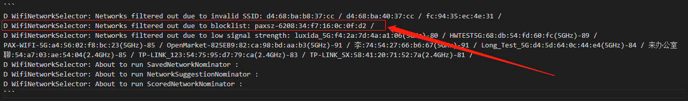

# 概述

wifi各种bug分析

## 1.压力测试连接断开wifi，无法重连

### 测试步骤

```
【测试步骤】
1.打开Wi-Fi
2.扫描周围的AP，检查扫描列表
3.连接步骤2扫描到的AP
4.连接成功后，创建TCP连接
5.TCP通讯size大小
6.断开TCP连接
7.断开Wi-Fi连接
8.关闭Wi-Fi
9.循环步骤1-8共cnt次

【测试环境】
2.4G/5G AP

【预期结果】
9.每次全流程测试均正常

【实际结果】
V1.03版本，6台机器，有5台pos出现WIFI连接连续失败问题
V1.02版本，4台机器，有3台pos出现WIFI连接连续失败问题
V1.03版本，关闭wifi后延时3s测试，4台机器，有3台pos出现WIFI连接连续失败问题
其中测试成功是同一台pos（4号机器） SN:2210000586

【测试用例】
WiFi_WholeProcess_STR1,WiFi_WholeProcess_5G_STR1
```

### 问题原因

1. 出问题的机器都是WiFi采用了随机MAC，导致路由器的IP池被用完了导致。
2. 因该路由器有个最大支持mac数，当到达最大mac数时，再重新连接新的设备就连接不上了，前面你的机器连接的上，是路由器已经存在你的mac地址了。
3. 主要是没有写入MAC导致，正常写入MAC的机器测试正常。

## 2.修改路由器信道，压力测试连接断开wifi，

### 测试步骤

```
测试步骤
1.打开Wi-Fi
2.将2.4G AP的Channel设置测试数据中channel，并扫描AP
3.检查扫描结果，查看能否扫描到步骤2设置的AP
4.连接步骤3扫描到的AP，检查是否连接成功
5.成功后进行TCP通讯
6.循环步骤2-5覆盖测试数据中Channel测试
7.关闭Wi-Fi

实际结果：
后台修改路由器信道，M8概率性无法自动重连成功，需要手动点击下才能连接成功。
测试荣耀和水星两种路由器，均有此问题

期望结果：
没有忘记网络时，改变信道后，机器可以自动连接WiFi
```

### 问题原因

AP频繁更改Channel会导致Android系统判定该AP不稳定，从而ban掉这个AP



## 3.修改蓝牙默认名称为机型_SN后四位

```diff
--- a/device/generic/common/bluetooth/bdroid_buildcfg.h
+++ b/device/generic/common/bluetooth/bdroid_buildcfg.h
@@ -17,6 +17,6 @@
 #ifndef _BDROID_BUILDCFG_H
 #define _BDROID_BUILDCFG_H

-#define BTM_DEF_LOCAL_NAME   "Android Bluedroid"
+//#define BTM_DEF_LOCAL_NAME   "Android Bluedroid"

 #endif
diff --git a/system/bt/btif/src/btif_dm.cc b/system/bt/btif/src/btif_dm.cc
old mode 100644
new mode 100755
index e122936ce32..3390b2f8103
--- a/system/bt/btif/src/btif_dm.cc
+++ b/system/bt/btif/src/btif_dm.cc
@@ -115,6 +115,10 @@ const Uuid UUID_HEARING_AID = Uuid::FromString("FDF0");
 #ifndef PROPERTY_PRODUCT_MODEL
 #define PROPERTY_PRODUCT_MODEL "ro.product.model"
 #endif
+#define SET_BT_NAME_WITH_SN
+#ifndef PROPERTY_PRODUCT_SN
+#define PROPERTY_PRODUCT_SN "ro.boot.bt.serialno"
+#endif
 #define DEFAULT_LOCAL_NAME_MAX 31
 #if (DEFAULT_LOCAL_NAME_MAX > BTM_MAX_LOC_BD_NAME_LEN)
 #error "default btif local name size exceeds stack supported length"
@@ -3400,12 +3404,34 @@ static char* btif_get_default_local_name() {
     if (BTM_DEF_LOCAL_NAME[0] != '\0') {
       strncpy(btif_default_local_name, BTM_DEF_LOCAL_NAME, max_len);
     } else {
+//[FEATURE]-Mod-BEGIN by (qumy@xxxxx.com), 2020/8/13,for bt feature
+#ifndef SET_BT_NAME_WITH_SN
       char prop_model[PROPERTY_VALUE_MAX];
       osi_property_get(PROPERTY_PRODUCT_MODEL, prop_model, "");
       strncpy(btif_default_local_name, prop_model, max_len);
+#else
+      int len = 0;
+      char sn[5] = {0};
+      char prop_model[PROPERTY_VALUE_MAX];
+      char prop_sn[PROPERTY_VALUE_MAX];
+      osi_property_get(PROPERTY_PRODUCT_MODEL,prop_model,"");
+      osi_property_get(PROPERTY_PRODUCT_SN,prop_sn,"");
+      len = strlen(prop_sn);
+      if (len >= 4)
+      {
+          memcpy(sn, (prop_sn + len) - 4, 4);
+      }
+      else
+      {
+          memcpy(sn, "NULL", 4);
+      }
+      snprintf(btif_default_local_name, max_len, "%s_%s", prop_model, sn);
+      LOG_INFO(LOG_TAG, "%s prop_model is %s, sn is %s", __func__, prop_model,sn);
+#endif
     }
     btif_default_local_name[max_len] = '\0';
   }
+//[FEATURE]-Mod-BEGIN by (qumy@xxxxx.com), 2020/8/13,for bt feature
   return btif_default_local_name;
 }
```