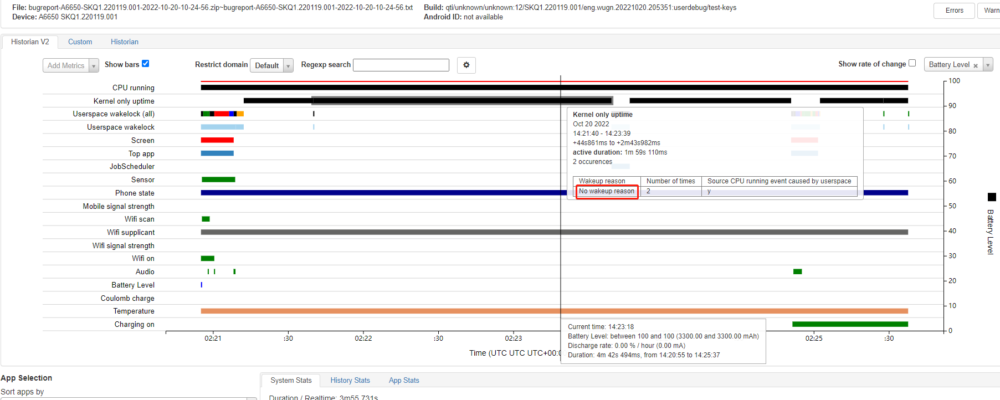
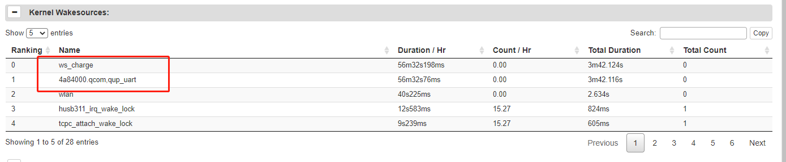
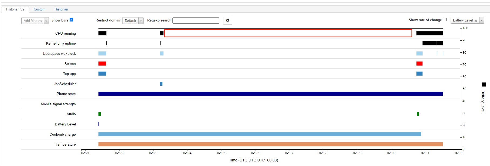
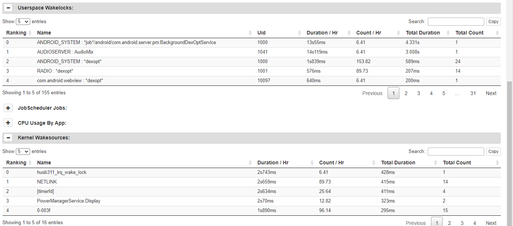
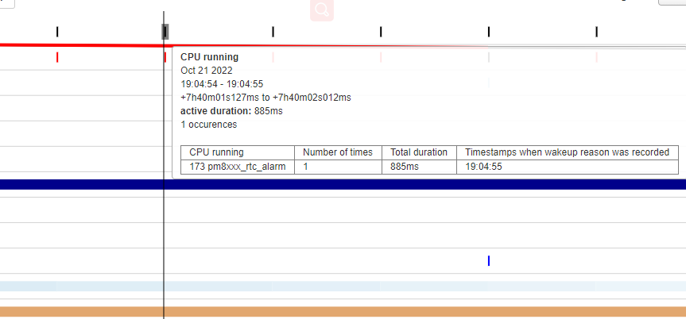

# qcom qcm2290 功耗调试记录

记录一下qcm2290平台功耗调试记录。

# 系统无法休眠调试

* 先清掉bugreport，休眠一段时间并导出：
```
adb shell dumpsys batterystats --reset
adb shell dumpsys batterystats --enable full-wake-history
adb bugreport
```

首先抓取bugreport看一下，发现是内核持锁：



查看持锁如下`ws_charge`和`4a84000.qcom,qup_uart`：




`ws_charge`中的最后一个参数是1668485，`prevent_suspend_time`表示阻止系统休眠时间，基本上打开后就没进行释放。
```
A6650:/ # cat d/wakeup_sources | grep charge
pax-base-charger        2               2               0               0               0               74             37
6373            0
charger suspend wakelock        282             282             0               0               39              19702                                                                                                                       323              1676089         0
pax-charger     7               7               0               0               0               1005            299                                                                                                                         1284884          0
ws_charge       1               1               0               0               1668485         1668485         1668485
7643            0
```

`ws_charge`是在pax-battery-class.c中注册的wakelock，用于休眠后防止过放，通过计算放电时间唤醒系统，这个功能已经放到bms中做了。之所以持锁，是因为没有进行释放，干脆直接去掉。
```diff
--- a/UM.9.15/kernel/msm-4.19/drivers/misc/pax/power/pax_battery_class.c
+++ b/UM.9.15/kernel/msm-4.19/drivers/misc/pax/power/pax_battery_class.c
@@ -807,6 +807,7 @@ int pax_battery_set_status(int new_status)
                        status = POWER_SUPPLY_STATUS_NOT_CHARGING;
                }

+#ifndef CONFIG_PAX_BMS
                if (g_pax_battery_dev) {
                        if (status == POWER_SUPPLY_STATUS_CHARGING) {
                                if (!g_pax_battery_dev->ws_charge->active)
@@ -816,6 +817,7 @@ int pax_battery_set_status(int new_status)
                                __pm_relax(g_pax_battery_dev->ws_charge);
                        }
                }
+#endif

                pax_battery_sply.BAT_STATUS = status;
                pax_battery_supply_changed();
@@ -989,7 +991,10 @@ struct pax_battery_device *pax_battery_device_register(const char *name,
                return ERR_PTR(ret);
        }
        battery_dev->ops = ops;
+
+#ifndef CONFIG_PAX_BMS
        battery_dev->ws_charge = wakeup_source_register(NULL, "ws_charge");
+#endif
        g_pax_battery_dev = battery_dev;
```

另外关于锁`4a84000.qcom,qup_uart`是谢工改出来的，将串口改成了永不休眠，修改如下可避免：
```diff
--- a/UM.9.15/kernel/msm-4.19/drivers/tty/serial/msm_geni_serial.c
+++ b/UM.9.15/kernel/msm-4.19/drivers/tty/serial/msm_geni_serial.c
@@ -3636,7 +3636,7 @@ static int msm_geni_serial_probe(struct platform_device *pdev)

                pm_runtime_set_suspended(&pdev->dev);
 //[feature]-modify-begin xielianxiong@paxsz.com,20220826,for msm-geni-serial-hs uart close auto sleep
-               pm_runtime_set_autosuspend_delay(&pdev->dev, -1);//150
+               pm_runtime_set_autosuspend_delay(&pdev->dev, 150);//150
```

去掉以上两个锁后系统正常进入休眠：




# RTC中断每10分钟唤醒一次

发现机器休眠后没10分钟一次`pm8xxx_rtc_alarm`唤醒，如下：



* `pm2250.dtsi`:
```
                pm2250_rtc: qcom,pm2250_rtc {
                        compatible = "qcom,pm8941-rtc";
                        interrupts = <0x0 0x61 0x1 IRQ_TYPE_NONE>;
                };

```

* `drivers/rtc/rtc-pm8xxx.c`:
```C++
static irqreturn_t pm8xxx_alarm_trigger(int irq, void *dev_id) //中断处理，清中断
{
        struct pm8xxx_rtc *rtc_dd = dev_id;
        const struct pm8xxx_rtc_regs *regs = rtc_dd->regs;
        unsigned int ctrl_reg;
        int rc;
        unsigned long irq_flags;

        rtc_update_irq(rtc_dd->rtc, 1, RTC_IRQF | RTC_AF);

        spin_lock_irqsave(&rtc_dd->ctrl_reg_lock, irq_flags);

        /* Clear the alarm enable bit */
        rc = regmap_read(rtc_dd->regmap, regs->alarm_ctrl, &ctrl_reg);
        if (rc) {
                spin_unlock_irqrestore(&rtc_dd->ctrl_reg_lock, irq_flags);
                goto rtc_alarm_handled;
        }

        ctrl_reg &= ~regs->alarm_en;

        rc = regmap_write(rtc_dd->regmap, regs->alarm_ctrl, ctrl_reg);
        if (rc) {
                spin_unlock_irqrestore(&rtc_dd->ctrl_reg_lock, irq_flags);
                dev_err(rtc_dd->rtc_dev,
                        "Write to alarm control register failed\n");
                goto rtc_alarm_handled;
        }

        spin_unlock_irqrestore(&rtc_dd->ctrl_reg_lock, irq_flags);

        /* Clear RTC alarm register */
        rc = regmap_read(rtc_dd->regmap, regs->alarm_ctrl2, &ctrl_reg);
        if (rc) {
                dev_err(rtc_dd->rtc_dev,
                        "RTC Alarm control2 register read failed\n");
                goto rtc_alarm_handled;
        }

        ctrl_reg |= PM8xxx_RTC_ALARM_CLEAR;
        rc = regmap_write(rtc_dd->regmap, regs->alarm_ctrl2, ctrl_reg);
        if (rc)
                dev_err(rtc_dd->rtc_dev,
                        "Write to RTC Alarm control2 register failed\n");

rtc_alarm_handled:
        return IRQ_HANDLED;
}

static const struct rtc_class_ops pm8xxx_rtc_ops = { //rtc ops，给manager驱动用
        .read_time      = pm8xxx_rtc_read_time,
        .set_time       = pm8xxx_rtc_set_time,
        .set_alarm      = pm8xxx_rtc_set_alarm,
        .read_alarm     = pm8xxx_rtc_read_alarm,
        .alarm_irq_enable = pm8xxx_rtc_alarm_irq_enable,
};

static int pm8xxx_rtc_probe(struct platform_device *pdev)
{
        rtc_dd->rtc_alarm_irq = platform_get_irq(pdev, 0);
        if (rtc_dd->rtc_alarm_irq < 0) {
                dev_err(&pdev->dev, "Alarm IRQ resource absent!\n");
                return -ENXIO;
        }

        rtc_dd->allow_set_time = of_property_read_bool(pdev->dev.of_node,
                                                      "allow-set-time");

        rtc_dd->regs = match->data;
        rtc_dd->rtc_dev = &pdev->dev;

        rc = pm8xxx_rtc_enable(rtc_dd);
        device_init_wakeup(&pdev->dev, 1);

        /* Register the RTC device */
        rtc_dd->rtc = devm_rtc_device_register(&pdev->dev, "pm8xxx_rtc", //注册rtc设备，ops注册
                                               &pm8xxx_rtc_ops, THIS_MODULE);
        if (IS_ERR(rtc_dd->rtc)) {
                dev_err(&pdev->dev, "%s: RTC registration failed (%ld)\n",
                        __func__, PTR_ERR(rtc_dd->rtc));
                return PTR_ERR(rtc_dd->rtc);
        }

        /* Request the alarm IRQ */
        rc = devm_request_any_context_irq(&pdev->dev, rtc_dd->rtc_alarm_irq, //申请alarm 中断
                                          pm8xxx_alarm_trigger,
                                          IRQF_TRIGGER_RISING,
                                          "pm8xxx_rtc_alarm", rtc_dd);

}
static const struct of_device_id pm8xxx_id_table[] = {
        { .compatible = "qcom,pm8921-rtc", .data = &pm8921_regs },
        { .compatible = "qcom,pm8018-rtc", .data = &pm8921_regs },
        { .compatible = "qcom,pm8058-rtc", .data = &pm8058_regs },
        { .compatible = "qcom,pm8941-rtc", .data = &pm8941_regs },
        { .compatible = "qcom,pmk8350-rtc", .data = &pmk8350_regs },
        { .compatible = "qcom,pm8916-rtc", .data = &pm8916_regs },
        { },
};
MODULE_DEVICE_TABLE(of, pm8xxx_id_table);
```
