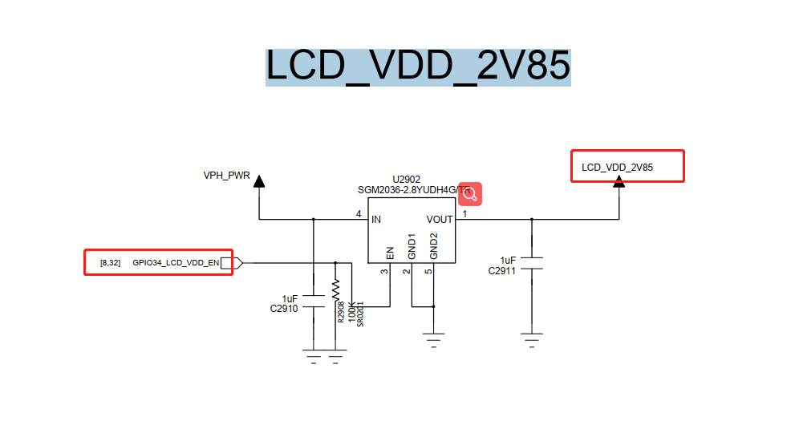
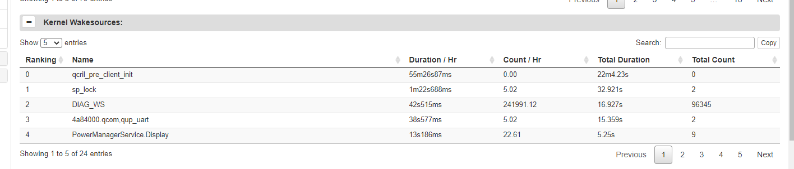

# qcom qcm2290 功耗调试记录

记录一下qcm2290平台功耗调试记录。

# 系统无法休眠调试

* 先清掉bugreport，休眠一段时间并导出：
```
adb shell dumpsys batterystats --reset
adb shell dumpsys batterystats --enable full-wake-history
adb bugreport
```

首先抓取bugreport看一下，发现是内核持锁：


查看持锁如下`ws_charge`和`4a84000.qcom,qup_uart`：


`ws_charge`中的最后一个参数是1668485，`prevent_suspend_time`表示阻止系统休眠时间，基本上打开后就没进行释放。
```
A665x:/ # cat d/wakeup_sources | grep charge
xxxxx-base-charger        2               2               0               0               0               74             37
6373            0
charger suspend wakelock        282             282             0               0               39              19702                                                                                                                       323              1676089         0
xxxxx-charger     7               7               0               0               0               1005            299                                                                                                                         1284884          0
ws_charge       1               1               0               0               1668485         1668485         1668485
7643            0
```

`ws_charge`是在xxxxx-battery-class.c中注册的wakelock，用于休眠后防止过放，通过计算放电时间唤醒系统，这个功能已经放到bms中做了。之所以持锁，是因为没有进行释放，干脆直接去掉。
```diff
--- a/UM.9.15/kernel/msm-4.19/drivers/misc/xxxxx/power/xxxxx_battery_class.c
+++ b/UM.9.15/kernel/msm-4.19/drivers/misc/xxxxx/power/xxxxx_battery_class.c
@@ -807,6 +807,7 @@ int xxxxx_battery_set_status(int new_status)
                        status = POWER_SUPPLY_STATUS_NOT_CHARGING;
                }

+#ifndef CONFIG_xxx_BMS
                if (g_xxxxx_battery_dev) {
                        if (status == POWER_SUPPLY_STATUS_CHARGING) {
                                if (!g_xxxxx_battery_dev->ws_charge->active)
@@ -816,6 +817,7 @@ int xxxxx_battery_set_status(int new_status)
                                __pm_relax(g_xxxxx_battery_dev->ws_charge);
                        }
                }
+#endif

                xxxxx_battery_sply.BAT_STATUS = status;
                xxxxx_battery_supply_changed();
@@ -989,7 +991,10 @@ struct xxxxx_battery_device *xxxxx_battery_device_register(const char *name,
                return ERR_PTR(ret);
        }
        battery_dev->ops = ops;
+
+#ifndef CONFIG_xxx_BMS
        battery_dev->ws_charge = wakeup_source_register(NULL, "ws_charge");
+#endif
        g_xxxxx_battery_dev = battery_dev;
```

另外关于锁`4a84000.qcom,qup_uart`是谢工改出来的，将串口改成了永不休眠，修改如下可避免：
```diff
--- a/UM.9.15/kernel/msm-4.19/drivers/tty/serial/msm_geni_serial.c
+++ b/UM.9.15/kernel/msm-4.19/drivers/tty/serial/msm_geni_serial.c
@@ -3636,7 +3636,7 @@ static int msm_geni_serial_probe(struct platform_device *pdev)

                pm_runtime_set_suspended(&pdev->dev);
 //[feature]-modify-begin xielianxiong@xxxxx.com,20220826,for msm-geni-serial-hs uart close auto sleep
-               pm_runtime_set_autosuspend_delay(&pdev->dev, -1);//150
+               pm_runtime_set_autosuspend_delay(&pdev->dev, 150);//150
```

去掉以上两个锁后系统正常进入休眠：


# RTC中断每10分钟唤醒一次

发现机器休眠后没10分钟一次`pm8xxx_rtc_alarm`唤醒，如下：


* `pm2250.dtsi`:
```
                pm2250_rtc: qcom,pm2250_rtc {
                        compatible = "qcom,pm8941-rtc";
                        interrupts = <0x0 0x61 0x1 IRQ_TYPE_NONE>;
                };

```

* `drivers/rtc/rtc-pm8xxx.c`:
```C++
static irqreturn_t pm8xxx_alarm_trigger(int irq, void *dev_id) //中断处理，清中断
{
        struct pm8xxx_rtc *rtc_dd = dev_id;
        const struct pm8xxx_rtc_regs *regs = rtc_dd->regs;
        unsigned int ctrl_reg;
        int rc;
        unsigned long irq_flags;

        rtc_update_irq(rtc_dd->rtc, 1, RTC_IRQF | RTC_AF);

        spin_lock_irqsave(&rtc_dd->ctrl_reg_lock, irq_flags);

        /* Clear the alarm enable bit */
        rc = regmap_read(rtc_dd->regmap, regs->alarm_ctrl, &ctrl_reg);
        if (rc) {
                spin_unlock_irqrestore(&rtc_dd->ctrl_reg_lock, irq_flags);
                goto rtc_alarm_handled;
        }

        ctrl_reg &= ~regs->alarm_en;

        rc = regmap_write(rtc_dd->regmap, regs->alarm_ctrl, ctrl_reg);
        if (rc) {
                spin_unlock_irqrestore(&rtc_dd->ctrl_reg_lock, irq_flags);
                dev_err(rtc_dd->rtc_dev,
                        "Write to alarm control register failed\n");
                goto rtc_alarm_handled;
        }

        spin_unlock_irqrestore(&rtc_dd->ctrl_reg_lock, irq_flags);

        /* Clear RTC alarm register */
        rc = regmap_read(rtc_dd->regmap, regs->alarm_ctrl2, &ctrl_reg);
        if (rc) {
                dev_err(rtc_dd->rtc_dev,
                        "RTC Alarm control2 register read failed\n");
                goto rtc_alarm_handled;
        }

        ctrl_reg |= PM8xxx_RTC_ALARM_CLEAR;
        rc = regmap_write(rtc_dd->regmap, regs->alarm_ctrl2, ctrl_reg);
        if (rc)
                dev_err(rtc_dd->rtc_dev,
                        "Write to RTC Alarm control2 register failed\n");

rtc_alarm_handled:
        return IRQ_HANDLED;
}

static const struct rtc_class_ops pm8xxx_rtc_ops = { //rtc ops，给manager驱动用
        .read_time      = pm8xxx_rtc_read_time,
        .set_time       = pm8xxx_rtc_set_time,
        .set_alarm      = pm8xxx_rtc_set_alarm,
        .read_alarm     = pm8xxx_rtc_read_alarm,
        .alarm_irq_enable = pm8xxx_rtc_alarm_irq_enable,
};

static int pm8xxx_rtc_probe(struct platform_device *pdev)
{
        rtc_dd->rtc_alarm_irq = platform_get_irq(pdev, 0);
        if (rtc_dd->rtc_alarm_irq < 0) {
                dev_err(&pdev->dev, "Alarm IRQ resource absent!\n");
                return -ENXIO;
        }

        rtc_dd->allow_set_time = of_property_read_bool(pdev->dev.of_node,
                                                      "allow-set-time");

        rtc_dd->regs = match->data;
        rtc_dd->rtc_dev = &pdev->dev;

        rc = pm8xxx_rtc_enable(rtc_dd);
        device_init_wakeup(&pdev->dev, 1);

        /* Register the RTC device */
        rtc_dd->rtc = devm_rtc_device_register(&pdev->dev, "pm8xxx_rtc", //注册rtc设备，ops注册
                                               &pm8xxx_rtc_ops, THIS_MODULE);
        if (IS_ERR(rtc_dd->rtc)) {
                dev_err(&pdev->dev, "%s: RTC registration failed (%ld)\n",
                        __func__, PTR_ERR(rtc_dd->rtc));
                return PTR_ERR(rtc_dd->rtc);
        }

        /* Request the alarm IRQ */
        rc = devm_request_any_context_irq(&pdev->dev, rtc_dd->rtc_alarm_irq, //申请alarm 中断
                                          pm8xxx_alarm_trigger,
                                          IRQF_TRIGGER_RISING,
                                          "pm8xxx_rtc_alarm", rtc_dd);

}
static const struct of_device_id pm8xxx_id_table[] = {
        { .compatible = "qcom,pm8921-rtc", .data = &pm8921_regs },
        { .compatible = "qcom,pm8018-rtc", .data = &pm8921_regs },
        { .compatible = "qcom,pm8058-rtc", .data = &pm8058_regs },
        { .compatible = "qcom,pm8941-rtc", .data = &pm8941_regs },
        { .compatible = "qcom,pmk8350-rtc", .data = &pmk8350_regs },
        { .compatible = "qcom,pm8916-rtc", .data = &pm8916_regs },
        { },
};
MODULE_DEVICE_TABLE(of, pm8xxx_id_table);
```

# 拔除LCD休眠功耗减小6ma

目前A665x项目发现底电流一共有24ma，LCD被拔除后减小6ma，那肯定是lcd的电没关，经fae确认是LCD偏置电压没关，偏置电压控制的是+-5.4V(AVDD/AVEE),A665x项目如下图：


* M92xx项目如下图：




* 软件修改方案：
```diff
From fad66e98056850c84f967ae9b59ddbd359b83f36 Mon Sep 17 00:00:00 2001
From: wugn <xxx@xxxxx.com>
Date: Wed, 8 Feb 2023 10:26:37 +0800
Subject: [PATCH] =?UTF-8?q?[Title]:=E4=BF=AE=E5=A4=8DLCD=E4=BC=91=E7=9C=A0?=
 =?UTF-8?q?=E7=94=B5=E6=B5=81=E8=BF=87=E9=AB=98=E9=97=AE=E9=A2=98=E3=80=82?=
MIME-Version: 1.0
Content-Type: text/plain; charset=UTF-8
Content-Transfer-Encoding: 8bit

[Summary]:
        1.LCD休眠唤醒流程增加打开/关闭GPIO69_LCD_BIAS_EN偏置电压。
        2.休眠时通过控制偏置电压来关闭AVDD/AVEE +-5.4v电压。

[Test Plan]:
	1.测试休眠底电流是否正常。

[Module]: system

[Model]: A665x

[author]: xxx@xxxxx.com

[date]: 2023-02-08
---
 .../techpack/display/msm/dsi/dsi_display.c    | 54 +++++++++++++++++++
 .../a665x-scuba-iot-idp-overlay_V01_V01.dts   |  1 +
 .../a665x-scuba-iot-idp-overlay_V02_V03.dts   |  1 +
 .../qcom/a665x/scuba-pinctrl.dtsi             |  8 +--
 .../devicetree-4.19/qcom/m92xx/fibo-lcd.dtsi  |  3 +-
 .../devicetree-4.19/qcom/m92xx/fibo-lcd1.dtsi |  3 +-
 6 files changed, 62 insertions(+), 8 deletions(-)
 mode change 100644 => 100755 UM.9.15/kernel/msm-4.19/techpack/display/msm/dsi/dsi_display.c

diff --git a/UM.9.15/kernel/msm-4.19/techpack/display/msm/dsi/dsi_display.c b/UM.9.15/kernel/msm-4.19/techpack/display/msm/dsi/dsi_display.c
old mode 100644
new mode 100755
index acb1f7db43e..b91e9f8d696
--- a/UM.9.15/kernel/msm-4.19/techpack/display/msm/dsi/dsi_display.c
+++ b/UM.9.15/kernel/msm-4.19/techpack/display/msm/dsi/dsi_display.c
@@ -33,6 +33,9 @@
 #define DSI_CLOCK_BITRATE_RADIX 10
 #define MAX_TE_SOURCE_ID  2
 
+//[NEW FEATURE]-BEGIN by xxx@xxxxx.com 2023-02-07, contrl LCD AVDD/AVEE power when suspend/resume
+int lcd_gpio_power = -1;
+//[NEW FEATURE]-END by xxx@xxxxx.com 2023-02-07, contrl LCD AVDD/AVEE power when suspend/resume
 static char dsi_display_primary[MAX_CMDLINE_PARAM_LEN];
 static char dsi_display_secondary[MAX_CMDLINE_PARAM_LEN];
 static struct dsi_display_boot_param boot_displays[MAX_DSI_ACTIVE_DISPLAY] = {
@@ -5373,6 +5376,35 @@ int dsi_display_dev_probe(struct platform_device *pdev)
 		goto end;
 	}
 
+    //[NEW FEATURE]-BEGIN by xxx@xxxxx.com 2023-02-07, contrl LCD AVDD/AVEE power when suspend/resume
+    lcd_gpio_power = of_get_named_gpio(pdev->dev.of_node, "qcom,lcd_power_2v85", 0);
+     if (!gpio_is_valid(lcd_gpio_power)) {
+             DSI_ERR("Invalid GPIO, lcd_gpio_power:%d", lcd_gpio_power);
+     } else {
+		 rc = gpio_request(lcd_gpio_power, "lcd-gpio-power");
+		 if (rc < 0) {
+			 DSI_ERR("lcd-gpio-power request failed");
+			 if(gpio_is_valid(lcd_gpio_power))
+			 {
+				 gpio_free(lcd_gpio_power);
+			 }
+		 } else {
+			 DSI_INFO("dp-gpio-power request sucess\n");
+			 rc = gpio_direction_output(lcd_gpio_power, 1);
+			 if (rc) {
+				 DSI_ERR("set_direction for lcd-gpio-power failed\n");
+				 if(gpio_is_valid(lcd_gpio_power))
+				 {
+					 gpio_free(lcd_gpio_power);
+				 }
+			 } else {
+				 gpio_set_value(lcd_gpio_power, 1);
+			 }
+		 }
+     }
+    //[NEW FEATURE]-BEGIN by xxx@xxxxx.com 2023-02-07, contrl LCD AVDD/AVEE power when suspend/resume
+
+
 	display->dma_cmd_workq = create_singlethread_workqueue(
 			"dsi_dma_cmd_workq");
 	if (!display->dma_cmd_workq)  {
@@ -7155,6 +7187,17 @@ int dsi_display_prepare(struct dsi_display *display)
 		return -EINVAL;
 	}
 
+	//[NEW FEATURE]-BEGIN by xxx@xxxxx.com 2023-02-07, contrl LCD AVDD/AVEE power when suspend/resume
+   if(lcd_gpio_power > 0) {
+		rc = gpio_direction_output(lcd_gpio_power, 1);
+		if (rc) {
+				DSI_ERR("lcd_gpio_power=%d failed\n", lcd_gpio_power);
+				gpio_free(lcd_gpio_power);
+		}
+		gpio_set_value(lcd_gpio_power, 1);
+    }
+	//[NEW FEATURE]-END by xxx@xxxxx.com 2023-02-07, contrl LCD AVDD/AVEE power when suspend/resume
+
 	SDE_EVT32(SDE_EVTLOG_FUNC_ENTRY);
 	mutex_lock(&display->display_lock);
 
@@ -7909,6 +7952,17 @@ int dsi_display_unprepare(struct dsi_display *display)
 			       display->name, rc);
 	}
 
+    //[NEW FEATURE]-BEGIN by xxx@xxxxx.com 2023-02-07, contrl LCD AVDD/AVEE power when suspend/resume
+    if(lcd_gpio_power > 0) {
+		 rc = gpio_direction_output(lcd_gpio_power, 0);
+		  if (rc) {
+				  DSI_ERR("lcd_gpio_power=%d failed\n", lcd_gpio_power);
+				  gpio_free(lcd_gpio_power);
+		  }
+		  gpio_set_value(lcd_gpio_power, 0);
+    }
+	//[NEW FEATURE]-END by xxx@xxxxx.com 2023-02-07, contrl LCD AVDD/AVEE power when suspend/resume
+
 	mutex_unlock(&display->display_lock);
 
 	/* Free up DSI ERROR event callback */
diff --git a/UM.9.15/vendor/qcom/proprietary/devicetree-4.19/qcom/a665x/a665x-scuba-iot-idp-overlay_V01_V01.dts b/UM.9.15/vendor/qcom/proprietary/devicetree-4.19/qcom/a665x/a665x-scuba-iot-idp-overlay_V01_V01.dts
index 19261c03113..fef3509a665 100755
--- a/UM.9.15/vendor/qcom/proprietary/devicetree-4.19/qcom/a665x/a665x-scuba-iot-idp-overlay_V01_V01.dts
+++ b/UM.9.15/vendor/qcom/proprietary/devicetree-4.19/qcom/a665x/a665x-scuba-iot-idp-overlay_V01_V01.dts
@@ -75,6 +75,7 @@
 };
 
 &sde_dsi {
+    qcom,lcd_power_2v85 = <&tlmm 69 0>;
 	qcom,dsi-default-panel = <&dsi_ili7807s_1080p_video>;
 };
 
diff --git a/UM.9.15/vendor/qcom/proprietary/devicetree-4.19/qcom/a665x/a665x-scuba-iot-idp-overlay_V02_V03.dts b/UM.9.15/vendor/qcom/proprietary/devicetree-4.19/qcom/a665x/a665x-scuba-iot-idp-overlay_V02_V03.dts
index 18c1c723fec..eb5090caa15 100755
--- a/UM.9.15/vendor/qcom/proprietary/devicetree-4.19/qcom/a665x/a665x-scuba-iot-idp-overlay_V02_V03.dts
+++ b/UM.9.15/vendor/qcom/proprietary/devicetree-4.19/qcom/a665x/a665x-scuba-iot-idp-overlay_V02_V03.dts
@@ -75,6 +75,7 @@
 };
 
 &sde_dsi {
+    qcom,lcd_power_2v85 = <&tlmm 69 0>;
 	qcom,dsi-default-panel = <&dsi_ili7807s_1080p_video>;
 };
 
diff --git a/UM.9.15/vendor/qcom/proprietary/devicetree-4.19/qcom/a665x/scuba-pinctrl.dtsi b/UM.9.15/vendor/qcom/proprietary/devicetree-4.19/qcom/a665x/scuba-pinctrl.dtsi
index c264eb21d00..afe902452db 100755
--- a/UM.9.15/vendor/qcom/proprietary/devicetree-4.19/qcom/a665x/scuba-pinctrl.dtsi
+++ b/UM.9.15/vendor/qcom/proprietary/devicetree-4.19/qcom/a665x/scuba-pinctrl.dtsi
@@ -519,12 +519,12 @@
 				/* active state */
 				mux {
 					/* 69: Enable 31: Firmware */
-					pins = "gpio69";
+				//	pins = "gpio69";
 					function = "gpio";
 				};
 
 				config {
-					pins = "gpio69";
+				//	pins = "gpio69";
 					drive-strength = <2>; /* 2 MA */
 					bias-pull-up;
 				};
@@ -534,12 +534,12 @@
 				/* sleep state */
 				mux {
 					/* 69: Enable 31: Firmware */
-					pins = "gpio69";
+				//	pins = "gpio69";
 					function = "gpio";
 				};
 
 				config {
-					pins = "gpio69";
+				//	pins = "gpio69";
 					drive-strength = <2>; /* 2 MA */
 					bias-disable;
 				};
diff --git a/UM.9.15/vendor/qcom/proprietary/devicetree-4.19/qcom/m92xx/fibo-lcd.dtsi b/UM.9.15/vendor/qcom/proprietary/devicetree-4.19/qcom/m92xx/fibo-lcd.dtsi
index d8b40d14601..7e36d773d68 100755
--- a/UM.9.15/vendor/qcom/proprietary/devicetree-4.19/qcom/m92xx/fibo-lcd.dtsi
+++ b/UM.9.15/vendor/qcom/proprietary/devicetree-4.19/qcom/m92xx/fibo-lcd.dtsi
@@ -119,8 +119,7 @@
 
 
 &sde_dsi {
-	qcom,lcd_power_2v85_1v8 = <&tlmm 34 0>;
-	qcom,lcd_power_2v85 = <&tlmm 25 0>; //added by cheyali for lcd JIRA:MC0245-3
+	qcom,lcd_power_2v85 = <&tlmm 34 0>;
 	qcom,dsi-default-panel = <&dsi_chsc5488_720p_video>;
 };
 
diff --git a/UM.9.15/vendor/qcom/proprietary/devicetree-4.19/qcom/m92xx/fibo-lcd1.dtsi b/UM.9.15/vendor/qcom/proprietary/devicetree-4.19/qcom/m92xx/fibo-lcd1.dtsi
index 12ac85f4552..b4d189e8e5a 100755
--- a/UM.9.15/vendor/qcom/proprietary/devicetree-4.19/qcom/m92xx/fibo-lcd1.dtsi
+++ b/UM.9.15/vendor/qcom/proprietary/devicetree-4.19/qcom/m92xx/fibo-lcd1.dtsi
@@ -305,8 +305,7 @@
 
 
 &sde_dsi {
-	qcom,lcd_power_2v85_1v8 = <&tlmm 34 0>;
-	qcom,lcd_power_2v85 = <&tlmm 25 0>; //added by cheyali for lcd JIRA:MC0245-3
+	qcom,lcd_power_2v85 = <&tlmm 34 0>;
 	qcom,dsi-default-panel = <&dsi_jd9365da_720p_video>;
 };
 
-- 
2.17.1
```


# A665x反复等待IMEI写入，阻止休眠

* cat节点/d/wake_sources没找到阻止进休眠的kernel wakelock，但是看bugreport就一个ril层的wakelock：




* 查看logcat发现一直在等待imei，导致没休眠：
```log
02-06 08:02:23.832  2404  2404 D QtiImsExtConnector: onNullBinding componentName ComponentInfo{org.codeaurora.ims/org.codeaurora.ims.QtiImsExtService}
02-06 08:02:23.863  1355  2169 W PlatformGinkgo: PlatformGinkgo getImei():null
02-06 08:02:23.864  1355  2169 W PlatformGinkgo: wait for setImeiProp
02-06 08:02:24.280  1355  2168 W PlatformGinkgo: PlatformGinkgo getImei():null
02-06 08:02:24.280  1355  2168 W PlatformGinkgo: wait for setImeiProp
02-06 08:02:24.353  1355  2777 D CompatibilityInfo: mCompatibilityFlags - 0
02-06 08:02:24.353  1355  2777 D CompatibilityInfo: applicationDensity - 480
02-06 08:02:24.353  1355  2777 D CompatibilityInfo: applicationScale - 1.0
02-06 08:02:24.355  2534  2534 I QImsService: QtiImsExtService : QtiImsExtService created!
02-06 08:02:24.356  2534  2534 E QImsService: QtiImsExtService : QtiImsExtService, ImsService is not yet started retry.
02-06 08:02:24.356  2534  2534 E QImsService: QtiImsExtService : QtiImsExtService, ImsService is not yet started retry.
02-06 08:02:24.356  2534  2534 W QImsService: QtiImsExtService : onBind returned null
02-06 08:02:24.359  2404  2404 D QtiImsExtConnector: Attempt to bind QtiImsExt service returned with: true
02-06 08:02:24.359  2404  2404 D QtiImsExtConnector: onNullBinding componentName ComponentInfo{org.codeaurora.ims/org.codeaurora.ims.QtiImsExtService}
02-06 08:02:24.368  1355  2169 W PlatformGinkgo: PlatformGinkgo getImei():null
02-06 08:02:24.368  1355  2169 W PlatformGinkgo: wait for setImeiProp
```

# M92xx耗电因素

# TP+SENSOR供电增加2ma

以下这个电会导致底电流增加2ma，但是不能去掉，tp和sensor共电，需要双击唤醒和抬起亮屏功能。


# 低电量50ma调试

* 目前发现整机底电流比较高，大概有50ma左右，系统是休眠下去了，但是发现触摸tp会有打印：
```log
[  441.101570] [Binder][0x588a45189][23:18:12.059677] wlan: [3409:I:HDD] __wlan_hdd_bus_suspend: 1035: starting bus suspend
[  441.105163] xxx_BMS:bms_suspend. secs = 605100
[  441.224238] Disabling non-boot CPUs ...
[  441.225912] CPU1 killed.
[  441.227642] IRQ 21: no longer affine to CPU2
[  441.228375] CPU2 killed.
[  441.230030] IRQ 77: no longer affine to CPU3
[  441.230815] CPU3 killed.
[  441.231605] suspend ns:     441231602015     suspend cycles:      23769803423
[  441.231602] resume cycles:      29830770144
[  441.232137] [CHSC] function = semi_touch_read_bytes         , line = 254 : err code = -13
[  441.232142] [CHSC] function = read_and_report_touch_points  , line = 336 : err code = -13
[  441.232259] Enabling non-boot CPUs ...
[  441.232966] arch_timer: CPU1: Trapping CNTVCT access
[  441.233854] CPU1 is up
[  441.234790] arch_timer: CPU2: Trapping CNTVCT access
[  441.235227] [CHSC] function = semi_touch_read_bytes         , line = 254 : err code = -13
[  441.235232] [CHSC] function = read_and_report_touch_points  , line = 336 : err code = -13
[  441.235656] CPU2 is up
[  441.236503] arch_timer: CPU3: Trapping CNTVCT access
[  441.237393] CPU3 is up
[  441.238266] [CHSC] function = semi_touch_read_bytes         , line = 254 : err code = -13
[  441.238271] [CHSC] function = read_and_report_touch_points  , line = 336 : err code = -13
[  441.247643] [CHSC] function = semi_touch_read_bytes         , line = 254 : err code = -13
[  441.247648] [CHSC] function = read_and_report_touch_points  , line = 336 : err code = -13
[  441.250672] [CHSC] function = semi_touch_read_bytes         , line = 254 : err code = -13
[  441.250677] [CHSC] function = read_and_report_touch_points  , line = 336 : err code = -13
[  441.257432] [CHSC] function = semi_touch_read_bytes         , line = 254 : err code = -13
[  441.257437] [CHSC] function = read_and_report_touch_points  , line = 336 : err code = -13
[  441.263814] [CHSC] function = semi_touch_read_bytes         , line = 254 : err code = -13
[  441.263818] [CHSC] function = read_and_report_touch_points  , line = 336 : err code = -13
[  441.270592] [CHSC] function = semi_touch_read_bytes         , line = 254 : err code = -13
[  441.270596] [CHSC] function = read_and_report_touch_points  , line = 336 : err code = -13
[  441.277004] [CHSC] function = semi_touch_read_bytes         , line = 254 : err code = -13
[  441.277009] [CHSC] function = read_and_report_touch_points  , line = 336 : err code = -13
[  441.280007] [CHSC] function = semi_touch_read_bytes         , line = 254 : err code = -13
[  441.280012] [CHSC] function = read_and_report_touch_points  , line = 336 : err code = -13
[  441.286757] [CHSC] function = semi_touch_read_bytes         , line = 254 : err code = -13
[  441.286762] [CHSC] function = read_and_report_touch_points  , line = 336 : err code = -13
[  441.293576] [CHSC] function = semi_touch_read_bytes         , line = 254 : err code = -13
[  441.293581] [CHSC] function = read_and_report_touch_points  , line = 336 : err code = -13
[  441.296579] [CHSC] function = semi_touch_read_bytes         , line = 254 : err code = -13
[  441.296583] [CHSC] function = read_and_report_touch_points  , line = 336 : err code = -13
[  441.301250] [CHSC] function = semi_touch_read_bytes         , line = 254 : err code = -13
[  441.301254] [CHSC] function = read_and_report_touch_points  , line = 336 : err code = -13
[  441.307659] [CHSC] function = semi_touch_read_bytes         , line = 254 : err code = -13
[  441.307664] [CHSC] function = read_and_report_touch_points  , line = 336 : err code = -13
[  441.312312] [CHSC] function = semi_touch_read_bytes         , line = 254 : err code = -13
[  441.312317] [CHSC] function = read_and_report_touch_points  , line = 336 : err code = -13
[  441.318714] [CHSC] function = semi_touch_read_bytes         , line = 254 : err code = -13
[  441.318718] [CHSC] function = read_and_report_touch_points  , line = 336 : err code = -13
[  441.323365] [CHSC] function = semi_touch_read_bytes         , line = 254 : err code = -13
[  441.323370] [CHSC] function = read_and_report_touch_points  , line = 336 : err code = -13
[  441.329761] [CHSC] function = semi_touch_read_bytes         , line = 254 : err code = -13
[  441.329766] [CHSC] function = read_and_report_touch_points  , line = 336 : err code = -13
[  441.334429] [CHSC] function = semi_touch_read_bytes         , line = 254 : err code = -13
[  441.334434] [CHSC] function = read_and_report_touch_points  , line = 336 : err code = -13
[  441.348657] xxx_BAT: xxxxx_battery_resume: pre_soc: 95 soc: 95
[  441.351912] [Binder][0x6f230ac57][23:23:27.985368] wlan: [3409:I:HDD] wlan_hdd_bus_resume: 1226: starting bus resume
[  441.356816] xxx_BAT: [status:Discharging, health:Good, present:1, tech:Li-ion, capcity:95,cap_rm:5320 mah, vol:4249 mv, temp:28, curr:0 ma, ui_soc:95]
[  441.793911] OOM killer enabled.
[  441.797062] Restarting tasks ... done.
[  441.814401] thermal thermal_zone26: failed to read out thermal zone (-61)
[  441.818686] healthd: battery l=95 v=4249 t=28.0 h=2 st=3 c=0 fc=5600000 cc=1 chg=
[  441.821240] xxx_CHG: charger_pm_event: enter PM_POST_SUSPEND
[  441.821442] Resume caused by misconfigured IRQ 16 mpm
[  441.839684] PM: suspend exit
[  441.842196] healthd: battery l=95 v=4249 t=28.0 h=2 st=3 c=0 fc=5600000 cc=1 chg=
[  441.944056] PM: suspend entry (deep)
[  441.947736] PM: Syncing filesystems ... done.
[  441.961923] xxx_CHG: charger_pm_event: enter PM_SUSPEND_PREPARE
[  441.968067] Freezing user space processes ... (elapsed 0.014 seconds) done.
[  441.989627] OOM killer disabled.
[  441.992932] Freezing remaining freezable tasks ... (elapsed 0.004 seconds) done.
[  442.004467] Suspending console(s) (use no_console_suspend to debug)
```