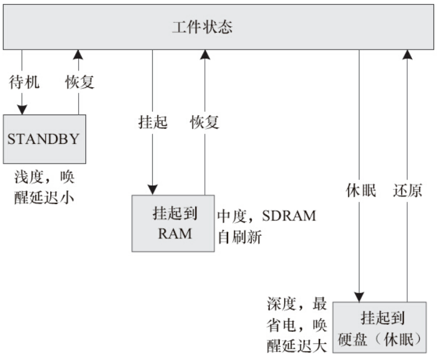
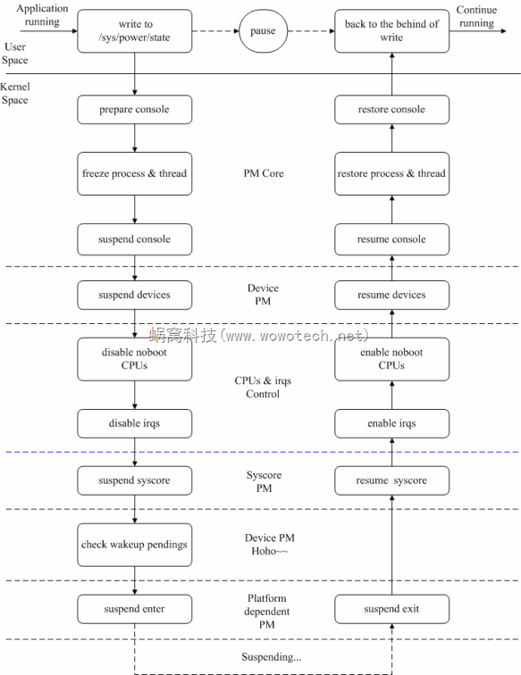
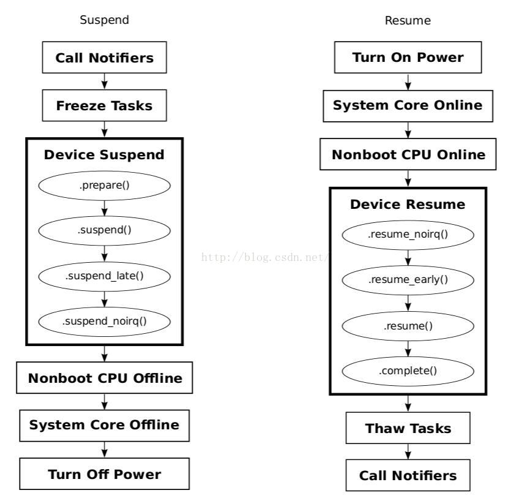

# 概述

Linux内核提供了三种Suspend: Freeze、Standby和STR(Suspend to RAM)，在用户空间向”/sys/power/state”文件分别写入”freeze”、”standby”和”mem”，即可触发它们。

内核中，Suspend及Resume过程涉及到PM Core、Device PM、各个设备的驱动、Platform dependent PM、CPU control等多个模块，涉及了console switch、process freeze、CPU hotplug、wakeup处理等过个知识点。就让我们跟着内核代码，一一见识它们吧。

# 参考

* [Linux电源管理-Suspend/Resume流程](https://blog.csdn.net/longwang155069/article/details/52935394)
* [android 系统的休眠与唤醒+linux 系统休眠](https://www.cnblogs.com/zxc2man/p/6897293.html)
* [Linux 电源管理子系统](https://mp.weixin.qq.com/s?__biz=MzIxMjE1MzU4OA%3D%3D&mid=2648932297&idx=1&sn=4650cf57480c4d3b540f16d18516c63e&chksm=8f5dba52b82a33442329648690c52c4327501903d62fb261e558f97497f91042c101641e585e&cur_album_id=2603484247609540608&scene=190#rd)

# Suspend功能有关的代码分布

内核中Suspend功能有关的代码包括PM core、Device PM、Platform PM等几大块，具体如下：

## PM Core

```
kernel/power/main.c----提供用户空间接口(/sys/power/state)
kernel/power/suspend.c----Suspend功能的主逻辑
kernel/power/suspend_test.c----Suspend功能的测试逻辑
kernel/power/console.c----Suspend过程中对控制台的处理逻辑
kernel/power/process.c----Suspend过程中对进程的处理逻辑
```

## Device PM

```
drivers/base/power/*
```
具体可参考* [0006_Android电源管理Power_Management_Interface.md](0006_Android电源管理Power_Management_Interface.md)的描述。

## Platform dependent PM

```
include/linux/suspend.h----定义platform dependent PM有关的操作函数集
arch/xxx/mach-xxx/xxx.c或者
arch/xxx/plat-xxx/xxx.c----平台相关的电源管理操作
```

# 简述

用户可以通过sys文件系统控制系统进入休眠：

查看系统支持的休眠方式：
```
#cat /sys/power/state
```
Linux支持STANDBY、挂起到RAM、挂起到硬盘等形式的待机，如图所示。常见有`standby(suspendto RAM)`、`mem(suspend toRAM)`和`disk(suspend todisk)`，只是standby耗电更多，返回到正常工作状态的时间更短。
一般的嵌入式产品仅仅只实现了挂起到RAM（也简称为s2ram，或常简称为STR），即将系统的状态保存于内存中，并将SDRAM置于自刷新状态，待用户按键等操作后再重新恢复系统。少数嵌入式Linux系统会实现挂起到硬盘（简称STD），它与挂起到RAM的不同是s2ram并不关机，STD则把系统的状态保持于磁盘，然后关闭整个系统。



通过`echo mem > /sys/power/state`让系统进入休眠。

* 标准Linux休眠过程：
  * powermanagement notifiers are executed with PM_SUSPEND_PREPARE
  * tasksare frozen
  * targetsystem sleep state is announced to the platform-handling code
  * devicesare suspended
  * platform-specificglobal suspend preparation methods are executed
  * non-bootCPUs are taken off-line
  * interruptsare disabled on the remaining (main) CPU
  * latesuspend of devices is carried out (一般有一些BUSdriver的动作进行)
  * platform-specificglobal methods are invoked to put the system to sleep
 
* 标准linux唤醒过程：
  * themain CPU is switched to the appropriate mode, if necessary
  * earlyresume of devices is carried out(一般有一些BUSdriver的动作进行)
  * interruptsare enabled on the main CPU
  * non-bootCPUs are enabled
  * platform-specificglobal resume preparation methods are invoked
  * devicesare woken up
  * tasksare thawed
  * powermanagement notifiers are executed with PM_POST_SUSPEND

下面图片对Linux suspend&resume过程做了一个概述，读者可以顺着这个流程阅读内核源代码。具体的说明，可以参考后面的代码分析。



在用户空间执行如下操作：
```shell
echo "mem" > /sys/power/state
```
会通过sysfs触发suspend的执行，相应的处理代码如下：
```C++
static ssize_t state_store(struct kobject *kobj, struct kobj_attribute *attr,
                           const char *buf, size_t n)
{
        suspend_state_t state;
        int error;

        error = pm_autosleep_lock();
        if (error)
                return error;

        if (pm_autosleep_state() > PM_SUSPEND_ON) {
                error = -EBUSY;
                goto out;
        }

        state = decode_state(buf, n);
        if (state < PM_SUSPEND_MAX) {
                if (state == PM_SUSPEND_MEM)
                        state = mem_sleep_current;

                error = pm_suspend(state);
        } else if (state == PM_SUSPEND_MAX) {
                error = hibernate();
        } else {
                error = -EINVAL;
        }

 out:
        pm_autosleep_unlock();
        return error ? error : n;
}
```

# 休眠休眠软件流程

* [Linux电源管理-Suspend/Resume流程](https://blog.csdn.net/longwang155069/article/details/52935394)
* [android 休眠唤醒机制分析(三) — suspend](http://t.zoukankan.com/rzq232-p-3835897.html)
以上这篇文章对每个函数进行了详细的分析。


* `include/linux/suspend.h`休眠唤醒通知，一般只需关注`PM_POST_SUSPEND`和`PM_SUSPEND_PREPARE`即可，如下定义：
```C++
/* Hibernation and suspend events */
#define PM_HIBERNATION_PREPARE  0x0001 /* Going to hibernate */
#define PM_POST_HIBERNATION     0x0002 /* Hibernation finished */
#define PM_SUSPEND_PREPARE      0x0003 /* Going to suspend the system */
#define PM_POST_SUSPEND         0x0004 /* Suspend finished */
#define PM_RESTORE_PREPARE      0x0005 /* Going to restore a saved image */
#define PM_POST_RESTORE         0x0006 /* Restore failed */
```
 * 休眠流程请关注`syscore_suspend`，`syscore_resume`。
   * 唤醒流程关注当我们按下某个按键并且这个按键是唤醒源的话，就会唤醒CPU，上面讲到调用`enter`函数后就真正进入休眠了，会阻塞在enter，当系统唤醒后会调用`syscore_resume`来执行唤醒流程。
```C++
static int suspend_enter(suspend_state_t state, bool *wakeup)
{
        error = syscore_suspend();
        if (!error) {
                *wakeup = pm_wakeup_pending();
                if (!(suspend_test(TEST_CORE) || *wakeup)) {
                        trace_suspend_resume(TPS("machine_suspend"),
                                state, true);
                        error = suspend_ops->enter(state); //真正进入休眠，阻塞
                        trace_suspend_resume(TPS("machine_suspend"),
                                state, false);
                } else if (*wakeup) {
                        error = -EBUSY;
                }
                syscore_resume();//suspend过程中，唤醒事件发生，系统唤醒，该函数接着执行resume动作，并最终返回。resume动作基本上是suspend的反动作
        }
}
```


```C++
* state_store //(kernel/power/main.c)
  └── pm_suspend //(kernel/power/suspend.c)
      ├── error = enter_state(state);//(kernel/power/suspend.c)
      │   ├── valid_state(state) //(kernel/power/suspend.c) 检查单板是否支持电源管理，就是全局suspend_ops有没有被赋值，并调用其suspend_ops->valid()
      │   │   └── return suspend_ops && suspend_ops->valid && suspend_ops->valid(state);
      │   ├── suspend_prepare(state); //(kernel/power/suspend.c)
      │   │   ├── pm_prepare_console(); //(kernel/power/console.c)
      │   │   ├── pm_notifier_call_chain(PM_SUSPEND_PREPARE) //(kernel/power/main.c) 通知所有关心这个消息的驱动程序！依次调用静态全局链表pm_chain_head中的每一个函数
      │   │   └── suspend_freeze_processes(); //(kernel/power/power.h) 冻结App和内核线程
      │   ├── suspend_devices_and_enter(state); //(kernel/power/suspend.c) 让设备进入suspend状态
      │   │   ├── platform_suspend_begin(state)
      │   │   │   └── suspend_ops->begin //如果平台相关的代码有begin函数就去调用它，例如Renesas的平台进入suspend时需要一些预先准备工作，就可以实现这个begin函数
      │   │   ├── suspend_console(); //(kernel/printk/printk.c) 串口suspend状态，此时串口就用不了了
      │   │   ├── dpm_suspend_start(PMSG_SUSPEND); //(drivers/base/power/main.c)
      │   │   │   ├── dpm_prepare(state); //(drivers/base/power/main.c)对全局链表dpm_list(drivers/base/power/power.c)中的每一个设备都调用其prepare函数，在这里面可以做一些准备工作
      │   │   │   │   ├── dev->pm_domain->ops.prepare   或 [struct dev_pm_ops ops]
      │   │   │   │   ├── dev->type->pm->prepare        或 [struct dev_pm_ops *pm]
      │   │   │   │   ├── dev->class->pm->prepare       或 [struct dev_pm_ops *pm]
      │   │   │   │   ├── dev->bus->pm->prepare         或 [struct dev_pm_ops *pm]
      │   │   │   │   └── dev->driver->pm->prepare     或  [struct dev_pm_ops *pm] [struct device_driver中的在这，优先级最低]
      │   │   │   └── dpm_suspend(state); //(drivers/base/power/main.c)  对全局链表dpm_prepared_list中的每一个设备都调用device_suspend()
      │   │   │       ├── device_suspend(dev); //(drivers/base/power/main.c)
      │   │   │       │   ├── __device_suspend(dev, pm_transition, false);
      │   │   │       │   │   └── dpm_wait_for_subordinate(dev, async);
      │   │   │       │   │       ├── dpm_wait_for_children(dev, async); //(drivers/base/power/main.c) 等待其每一个孩子进入suspend状态
      │   │   │       │   │       └── dpm_wait_for_consumers(dev, async);
      │   │   │       │   ├── dev->pm_domain->ops->suspend //因此自己在写驱动的时候可以在其pm_domain中或type->pm中或class->pm中或bus->pm中加入suspend函数
      │   │   │       │   ├── dev->type->pm->suspend
      │   │   │       │   ├── dev->class->pm->suspend
      │   │   │       │   └── dev->bus->pm->suspend            
      │   │   │       └── suspend_enter(state, &wakeup); //(kernel/power/suspend.c) 设备都进入suspend状态了接下来就是CPU了
      │   │   │           ├── platform_suspend_prepare(state);
      │   │   │           │   └── suspend_ops->prepare //单板的prepare函数若存在就调用
      │   │   │           ├── dpm_suspend_late(PMSG_SUSPEND); //(drivers/base/power/main.c) 对全局静态链表dpm_suspended_list中的每一个条目都调用device_suspend_late()
      │   │   │           │   └── device_suspend_late(dev); //(drivers/base/power/main.c) 调用此设备的
      │   │   │           │       └──  __device_suspend_late(dev, pm_transition, false);
      │   │   │           │           ├── dev->pm_domain->ops->suspend_late 或
      │   │   │           │           ├── dev->type->pm->suspend_late 或
      │   │   │           │           ├── dev->class->pm->suspend_late  或
      │   │   │           │           ├── dev->bus->pm->suspend_late  或
      │   │   │           │           └── dev->driver->pm->suspend_late  或
      │   │   │           ├── platform_suspend_prepare_late(state);
      │   │   │           │   └── suspend_ops->prepare_late //调用单板相关的函数，可以做一些清理，若单板不需要也可以不实现它
      │   │   │           ├── disable_nonboot_cpus(); //(kernel/cpu.c) 多核Soc中非用于启动内核的CPU叫做nonboot_cpu，停止non-boot CPU
      │   │   │           ├── arch_suspend_disable_irqs();   //(include/linux/suspend.h)//关闭中断，extern的，Renesas上没有实现
      │   │   │           ├── //休眠流程
      │   │   │           ├── syscore_suspend(); //   关闭核心模块
      │   │   │           │   └── *wakeup = pm_wakeup_pending()//还得调用pm_wakeup_pending检查一下，这段时间内，是否有唤醒事件发生，如果有就要终止suspend。
      │   │   │           │       └── if (!(suspend_test(TEST_CORE) || *wakeup)) 
      │   │   │           │           └── suspend_ops->enter(); // 如果一切顺利，调用suspend_ops的enter回调，进行状态切换。这时，系统应该已经suspend了
      │   │   │           ├── //唤醒流程
      │   │   │           ├── syscore_resume //(drivers/base/syscore.c) 对全局链表syscore_ops_list中的每一个node都调用其resume()
      │   │   │           ├── arch_suspend_enable_irqs //(include/linux/suspend.h)
      │   │   │           ├── enable_nonboot_cpus //(kernel/cpu.c)
      │   │   │           ├── platform_resume_noirq(state);
      │   │   │           │   └── suspend_ops->wake  //如果单板有对应的wake()就调用
      │   │   │           ├── dpm_resume_noirq(state); //(drivers/base/power/main.c) 对全局链表dpm_noirq_list中的每一个设备都执行device_resume_noirq
      │   │   │           │   └── dpm_noirq_resume_devices(state);
      │   │   │           │       ├── device_resume_noirq //(drivers/base/power/main.c) 对每一个设备都调用
      │   │   │           │       │   ├── dev->pm_domain->ops->resume_noirq    或
      │   │   │           │       │   ├── dev->type->pm->resume_noirq          或
      │   │   │           │       │   ├── dev->class->pm->resume_noirq         或
      │   │   │           │       │   ├── dev->bus->pm->resume_noirq           或
      │   │   │           │       │   ├── dev->driver->pm->resume_noirq        或
      │   │   │           │       │   └── //执行完resume_noirq的所有设备都会被放在全局链表dpm_late_early_list中
      │   │   │           │       └── dpm_noirq_end();
      │   │   │           │           └── resume_device_irqs //(kernel/irq/pm.c)
      │   │   │           │               └── resume_irqs //(kernel/irq/pm.c)
      │   │   │           │                   └── __enable_irq //(kernel/irq/pm.c) 对全局数组irq_desc中的每一个irq都调用__enable_irq，但是Renesas的BSP没有实现，里面还有一个野指针
      │   │   │           ├── platform_resume_early(state);
      │   │   │           ├── dpm_resume_early(state); //(drivers/base/power/main.c) 对全局链表dpm_late_early_list中的每一个元素都执行device_resume_early
      │   │   │           │   └── device_resume_early(dev, state, false); //(drivers/base/power/main.c) 
      │   │   │           │       ├── dev->pm_domain->ops->resume_early    或
      │   │   │           │       ├── dev->type->pm->resume_early          或
      │   │   │           │       ├── dev->class->pm->resume_early         或
      │   │   │           │       ├── dev->bus->pm->resume_early           或
      │   │   │           │       └── dev->driver->pm->resume_early        或
      │   │   │           └── platform_resume_finish(state);
      │   │   └── suspend_ops->finish() //如果单板有对应的finish()就调用
      │   ├── Resume_devices:
      │   ├── suspend_test_start //(kernel/power/suspend_test.c)
      │   ├── dpm_resume_end(PMSG_RESUME); //(drivers/base/power/main.c)
      │   │   ├── dpm_resume(state); //(drivers/base/power/main.c) 对全局链表dpm_suspended_list中的每一个dev都调用device_resume()
      │   │   │   └── device_resume(dev, state, false); //(drivers/base/power/main.c)
      │   │   │       ├── dev->pm_domain->ops->resume    或
      │   │   │       ├── dev->type->pm->resume          或
      │   │   │       ├── dev->class->pm->resume         或
      │   │   │       ├── dev->bus->pm->resume           或
      │   │   │       ├── dev->driver->pm->resume        或                                    
      │   │   │       └── //然后将所有的设备移动到全局链表dpm_prepared_list中
      │   │   └── dpm_complete(state); //(drivers/base/power/main.c) 对全局链表dpm_prepared_list中的每一个设备都调用device_complete()
      │   │       └── device_complete(dev, state); //(drivers/base/power/main.c)
      │   │           ├── dev->pm_domain->ops.complete    或
      │   │           ├── dev->type->pm.complete          或
      │   │           ├── dev->class->pm.complete         或
      │   │           └── dev->driver->pm.complete        或
      │   ├── suspend_test_finish("resume devices"); //(kernel/power/suspend_test.c) 打印一些log出来
      │   ├── resume_console //(kernel/printk.c)
      │   │   └── console_unlock(); //(kernel/printk.c)
      │   │       └── call_console_drivers(ext_text, ext_len, text, len); //(kernel/printk.c) 关闭本地中断获取spin锁后调用控制台打印函数以poll方式打印内核log
      │   ├── Close:
      │   ├── platform_resume_end(state);
      │   │   └── suspend_ops->end() //如果单板有对应的end()就调用
      │   ├── Recover_platform:
      │   └── platform_recover(state);
      │       └── suspend_ops->recover(); //如果dpm_suspend_start失败或者suspend_test失败，单板有对应的recover()就调用
      ├── Finish:
      ├── suspend_finish //(kernel/power/suspend.c)
      │   └── suspend_thaw_processes(); //(kernel/power/power.h)唤醒应用程序
      │       └── thaw_processes();
      ├── pm_notifier_call_chain(PM_POST_SUSPEND); //(kernel/power/main.c) 通知关注这个事件的App程序，对全局pm_chain_head->head中的每一个都调用其notifier_call()
      └── pm_restore_console(); //(kernel/power/console.c)
```

# suspend/resume过程总结

如下是suspend/resume过程的简图：



* 以上就是整个系统的suspend/resume执行过程，但是对于一般的驱动开发工程师来说主要关心的是Device Suspend和Device Resume过程。
  * suspend:  prepare->suspend->suspend_late->suspend_noirq
  * resume： resume_noirq->resume_early->resume->complete

## PM notifier

PM notifier是基于内核blocking notifier功能实现的。blocking notifier提供了一种kernel内部的消息通知机制，消息接受者通过notifier注册的方式，注册一个回调函数，关注消息发送者发出的notifier。当消息产生时，消息产生者通过调用回调函数的形式，通知消息接受者。这种调用，是可以被阻塞的，因此称作blocking notifier。

那suspend功能为什么使用notifier呢？原因可能有多种，这里我举一个例子，这是我们日常开发中可能会遇到的。

由之前的描述可知，suspend过程中，suspend device发生在进程被freeze之后，resume device发生在进程被恢复之前。那么：

1. 如果有些设备就需要在freeze进程之前suspend怎么办？

2. 如果有些设备的resume动作需要较多延时，或者要等待什么事情发生，那么如果它的resume动作发生在进程恢复之前，岂不是要阻止所有进程的恢复？更甚者，如果该设备要等待某个进程的数据才能resume，怎么办？

再来看suspend_prepare和suspend_finish中的处理：
```C++
static int suspend_prepare(suspend_state_t state) {
…
        error = pm_notifier_call_chain(PM_SUSPEND_PREPARE);
        if (error)
                goto Finish;
 
        error = suspend_freeze_processes();
        …
}
 
static void suspend_finish(void)
{
        suspend_thaw_processes();
        pm_notifier_call_chain(PM_POST_SUSPEND);
        pm_restore_console();
}
```
原来PM notifier是在设备模型的框架外，开了一个后门，那些比较特殊的driver，可以绕过设备模型，直接接收PM发送的suspend信息，以便执行自身的suspend动作。特别是resume时，可以在其它进程都正好工作的时候，只让suspend进程等待driver的resume。

感兴趣的读者，可以围观一下下面这个活生生的例子:
* [0017_qcom_xxx_charger架构.md](/0001_charger/docs/0017_qcom_xxx_charger架构.md)

# 驱动实例

* `include/linux/pm.h`我们一般`platform driver`采用`dev_pm_domain`方式注册休眠唤醒ops:
```C++
struct dev_pm_ops {
        int (*prepare)(struct device *dev);
        void (*complete)(struct device *dev);
        int (*suspend)(struct device *dev);
        int (*resume)(struct device *dev);
        int (*freeze)(struct device *dev);
        int (*thaw)(struct device *dev);
        int (*poweroff)(struct device *dev);
        int (*restore)(struct device *dev);
        int (*suspend_late)(struct device *dev);
        int (*resume_early)(struct device *dev);
        int (*freeze_late)(struct device *dev);
        int (*thaw_early)(struct device *dev);
        int (*poweroff_late)(struct device *dev);
        int (*restore_early)(struct device *dev);
        int (*suspend_noirq)(struct device *dev);
        int (*resume_noirq)(struct device *dev);
        int (*freeze_noirq)(struct device *dev);
        int (*thaw_noirq)(struct device *dev);
        int (*poweroff_noirq)(struct device *dev);
        int (*restore_noirq)(struct device *dev);
        int (*runtime_suspend)(struct device *dev);
        int (*runtime_resume)(struct device *dev);
        int (*runtime_idle)(struct device *dev);
};

struct dev_pm_domain {
        struct dev_pm_ops       ops;
        void (*detach)(struct device *dev, bool power_off);
        int (*activate)(struct device *dev);
        void (*sync)(struct device *dev);
        void (*dismiss)(struct device *dev);
};
```

```C++
static const struct dev_pm_ops xxx_bat_pm_ops = {
        .suspend  = xxx_battery_suspend,
        .resume   = xxx_battery_resume,
};

static struct platform_driver xxx_battery_driver = {
	.probe = xxx_battery_probe,
	.remove = xxx_battery_remove,
	.driver = {
		   .name = "battery",
		   .of_match_table = xxx_battery_of_match,
#ifdef CONFIG_PM
			.pm = &xxx_bat_pm_ops,
#endif
	},
};

static int __init xxx_battery_init(void)
{
	return platform_driver_register(&xxx_battery_driver);
}
```
