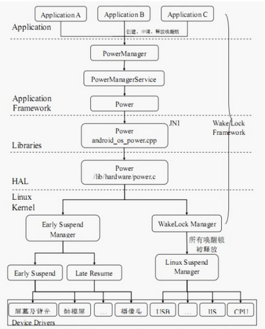
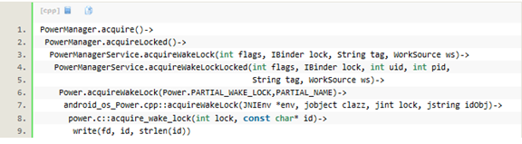
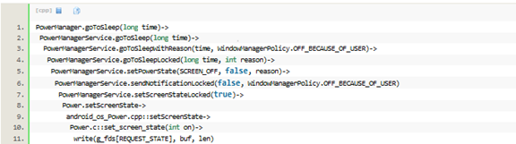

# 概述

当启动一个应用程序的时候，它可以申请一个wake_lock唤醒锁，每当申请成功后都会在内核中注册一下（通知系统内核，现在已经有锁被申请，系统内核的wake_lock_store把它加入锁中），当应用程序在某种情况下释放wake_lock的时候，会注销之前所申请的wake_lock。特别要注意的是：只要是系统中有一个wake_lock的时候，系统此时都不能进行睡眠。

# 参考

* [Android休眠唤醒机制](http://t.zoukankan.com/yejintianming00-p-8078596.html)

# 软件架构

从Android最上层（Java的应用程序），经过Java、C++和C语言写的Framework层、JNI层、HAL层最后到达android的最底层（Kernel层）。



# 代码路径

相关代码位置：

## Frameworks

```shell
// 供给上层应用程序调用的接口
frameworks/base/core/java/android/os/PowerManager.java
// 具体实现PowerManager类中的接口
frameworks/base/services/java/com/android/server/PowerManagerService.java
// 被PowerManagerService类调用
frameworks/base/core/java/android/os/ Power.java
```

## JNI

```shell
// 实现Power类中的JNI接口
frameworks/base/core/jni/android_os_Power.cpp
```

## HAL

```shell
// 进行sysfs用户接口的操作
hardware/libhardware_legacy/power/power.c
```

## Kernel

```shell
kernel/kernel/power/main.c
kernel/kernel/power/earlysuspend.c
kernel/kernel/power/suspend.c
kernel/kernel/power/wakelock.c
kernel/kernel/power/userwakelock.c
```

在应用程序框架层中，PowerManager类是面向上层应用程序的接口类，提供了Wake Lock机制（同时也是睡眠唤醒子系统）的基本接口（唤醒锁的获取和释放）。上层应用程序通过调用这些接口，实现对系统电源状态的监控。

PowerManager类通过IBinder这种Android中特有的通信模式，与PowerManagerService 类进行通信。

PowerManagerService 是PowerManager 类中定义的接口的具体实现，并进一步调用Power 类来与下一层进行通信。PowerManagerService 类是WakeLock 机制在应用程序框架层的核心，他们对应用程调用PowerManager类接口时所传递的参数进行初步的分析和对应的设置，并管理一个唤醒锁队列，然后配合其他模块（例如WatchDog、BatteryService、ShutdownThread 等）的状态信息，做出决策，调用Power类的对应接口，最终通过JNI 接口，调用到硬件抽象层中的函数，对sysfs 的用户接口进行操作，从而触发内核态实现的功能。

# 获得wake_lock唤醒锁

比如在应用程序中，当获得wakelock唤醒锁的时候，它首先调用`/android/frameworks/base/core/java/android/os/PowerManager`类中的`public void acquire（）`办法，而此方法通过Binder将调用PowerManagerService类中的public void acquireWakeLock。

Android wakelocks提供的功能包括：
1. 一个sysfs文件：/sys/power/wake_lock，用户程序向文件写入一个字符串，即可创建一个wakelock，该字符串就是wakelock的名字。该wakelock可以阻止系统进入低功耗模式。
2. 一个sysfs文件：：/sys/power/wake_unlock，用户程序向文件写入相同的字符串，即可注销一个wakelock。
3. 当系统中所有的wakelock都注销后，系统可以自动进入低功耗状态。
4. 向内核其它driver也提供了wakelock的创建和注销接口，允许driver创建wakelock以阻止睡眠、注销wakelock以允许睡眠。

有关Android wakelocks更为详细的描述，可以参考下面的一个链接：
http://elinux.org/Android_Power_Management

在用户态的调用流程如下：



上述write实质上是文件sysfs: /sys/power/wake_lock，当write时，它将调用userwakelock.c::wake_lock_store()函数，其实现如下：
* `kernel/power/main.c`:
```C++
static ssize_t wake_lock_store(struct kobject *kobj,
                               struct kobj_attribute *attr,
                               const char *buf, size_t n)
{
        int error = pm_wake_lock(buf);
        return error ? error : n;
}

power_attr(wake_lock);

int pm_wake_lock(const char *buf)
{
        const char *str = buf;
        struct wakelock *wl;
        u64 timeout_ns = 0;
        size_t len;
        int ret = 0;

        if (!capable(CAP_BLOCK_SUSPEND))
                return -EPERM;

        while (*str && !isspace(*str))
                str++;

        len = str - buf;
        if (!len)
                return -EINVAL;

        if (*str && *str != '\n') {
                /* Find out if there's a valid timeout string appended. */
                ret = kstrtou64(skip_spaces(str), 10, &timeout_ns);
                if (ret)
                        return -EINVAL;
        }

        mutex_lock(&wakelocks_lock);

        wl = wakelock_lookup_add(buf, len, true);
        if (IS_ERR(wl)) {
                ret = PTR_ERR(wl);
                goto out;
        }
        if (timeout_ns) {
                u64 timeout_ms = timeout_ns + NSEC_PER_MSEC - 1;

                do_div(timeout_ms, NSEC_PER_MSEC);
                __pm_wakeup_event(wl->ws, timeout_ms);
        } else {
                __pm_stay_awake(wl->ws);
        }

        wakelocks_lru_most_recent(wl);

 out:
        mutex_unlock(&wakelocks_lock);
        return ret;
}

static struct wakelock *wakelock_lookup_add(const char *name, size_t len,
                                            bool add_if_not_found)
{
        wl->ws = wakeup_source_register(NULL, wl->name);
        if (!wl->ws) {
                kfree(wl->name);
                kfree(wl);
                return ERR_PTR(-ENOMEM);
        }
}
```
最终调用`wakeup_source_register`注册了一个wakelock，wakelock的名字就是写进来的字符串。

# java实例

```java
//先定义一个mWakeLock
PowerManager pm = (PowerManager) getSystemService(Context.POWER_SERVICE);
mWakeLock = pm.newWakeLock(PowerManager.PARTIAL_WAKE_LOCK, this
                .getClass().getName());

//一直保持唤醒的话，就调用
mWakeLock.acquire();

//恢复正常睡眠
mWakeLock.release();
```

# 系统进入休眠（suspend）

当按了手机的power键，经过一系统列的事务处理后，它会调用到PowerManager类中的goToSleep。在用户态的调用流程如下所示：



最后一步write()写操作把"mem"写入/sys/power/state中。接下来，在kernel态，state_store函数将被调用，kernel层具体休眠逻辑请参考：
* [0005_Android电源管理suspend和resume流程总结.md](0005_Android电源管理suspend和resume流程总结.md)