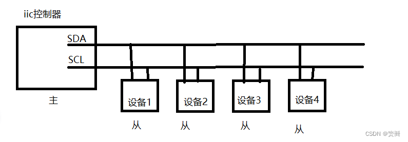
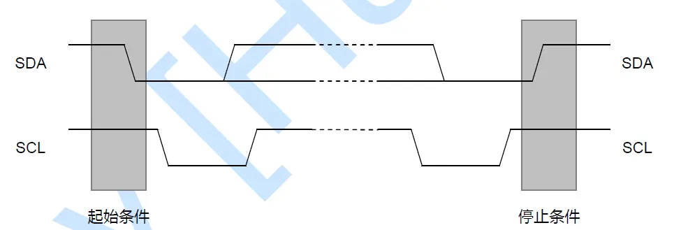
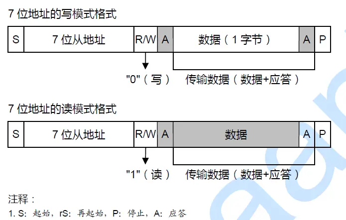
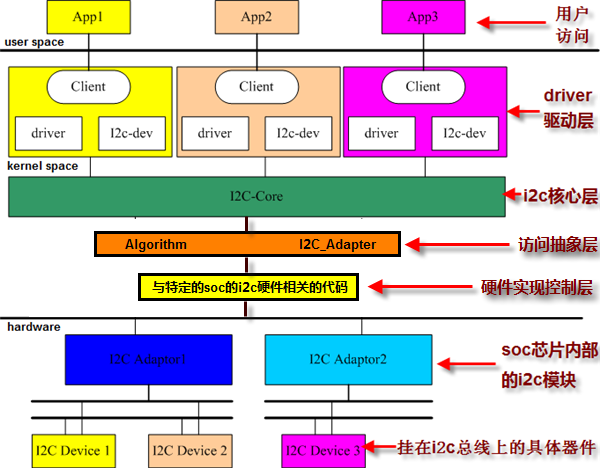
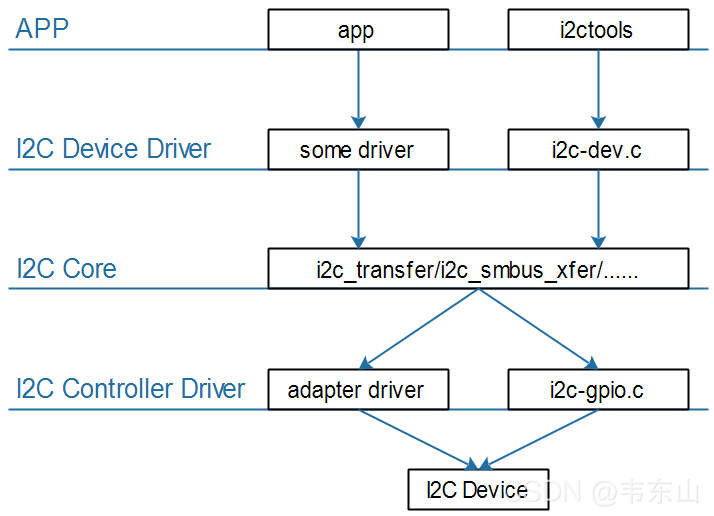

# README

linux i2c子系统学习。

# refers

* [Linux系统驱动之I2C_Adapter驱动框架讲解与编写](https://blog.csdn.net/thisway_diy/article/details/119906746)
* [iic（i2c）系统笔记](https://blog.csdn.net/m0_72904998/article/details/127358633)
* [Kernel I2C子系统](https://blog.csdn.net/weixin_33755649/article/details/91871193)

# I2C协议

i2c是一种两线式串行总线，是半双工同步通信。

I2C总线由两根信号线组成，一条是时钟信号线SCL，一条是数据信号线SDA。一条I2C总线可以接多个设备，每个设备都接入I2C总线的SCL和SDA。I2C总线是主从模式的总线架构，每个设备都可以作为主设备，其他设备作为从设备，但是同一时刻只能有一个主设备。其物理总线拓扑图如下：



总线协议：

（1）起始条件（边沿触发）：当SCL总线处于高电平时，SDA总线从高电平到低电平的跳变触发一次传输的开始条件。

（2）结束条件（边沿触发）：当SCL总线处于高电平时，SDA总线从低电平到高电平的跳变触发一次传输的结束条件。

起始和结束的时序图如下：



（3）数据传输格式：

起始条件触发之后，SCL处于高电平时，检测SDA总线的高低电平值1和0，SCL处于低电平时，SDA高低电平跳变切换数据1和0。

SDA的数据传输以8bit（一个字节）为单位，每个字节传输之后都跟随一个bit的ACK位。起始条件之后的第一个字节应该是地址字段（包含7bit的地址+1bit的R/W位），随后是8bit为单位的数据，数据可以无限制的多次发送。注意，地址字节和每个数据字节之后都跟随一个bit的ACK位。

I2C总线的数据格式如下：



I2C的传输数据时序图如下：


# I2C子系统框架

Kernel中I2C总线框架分为三层：I2C总线核心层，I2C总线控制器驱动层，I2C设备驱动层。

（1）总线核心层(i2c-core)：这是I2C的核心框架层，定义了I2C核心的数据结构，提供了I2C控制器，I2C设备和驱动的注册/注销框架，并提供了设备数据传输接口。如下：
```c
//控制器注册注销接口：
int i2c_add_adapter(struct i2c_adapter *adapter)；
									void i2c_del_adapter(struct i2c_adapter *adap)；
//设备驱动注册注销接口：
int i2c_register_driver(struct module *owner, struct i2c_driver *driver)；
										void i2c_del_driver(struct i2c_driver *driver)；
//数据传输接口：
int i2c_transfer(struct i2c_adapter *adap, struct i2c_msg *msgs, int num)；
int i2c_master_send(const struct i2c_client *client, const char *buf, int count)；
int i2c_master_recv(const struct i2c_client *client, char *buf, int count)；
```
（2）控制器驱动层(i2c-adapter)：由 i2c_adapter 结构描述了某个具体的I2C总线控制器特性，并通过 i2c_algorithm 结构提供了I2C总线周期的开始，停止，数据发送和接收等方法。同一个i2c_algorithm可以提供给多个 i2c_adapter 使用，i2c_adapter在注册的同时，会去（通过设备树配置或者老式的platform相关的硬编码）轮询该i2c总线下的所有i2c设备，并创建对应的 i2c_client 设备。换句话说，注册一个i2c_adapter，该总线下的所有从设备都会被注册到 i2c_bus_type下。

（3）设备驱动层(i2c-driver)：由 i2c_driver 结构表示，用于表示各个具体从设备的驱动，跟 i2c_client 绑定，通过 i2c_client 关联的 adapter的algorithm实现具体从设备的通信协议。
遵循kernel设备驱动框架，i2c_bus_type总线下挂 i2c_driver 和 i2c_client，注册 i2c_driver 的时候，会去轮询 i2c_bus_type 总线下的所有 i2c_client 设备，调用 bus 的 match（）方法，匹配后，调用 i2c_driver 的probe（）方法并关联该 i2c_client。在注册 i2c_adapter 同时，扫描注册该总线下所有的 i2c_client的时候，调用 bus 的match（）方法匹配 i2c_bus_type 总线下的 i2c_driver 驱动后，在调用 i2c_driver的probe（）方法并关联该 i2c_driver。



* 简化版：



# I2C设备控制器注册

先看一下重要结构体：
* i2c_adpater的核心是i2c_algorithm
* i2c_algorithm的核心是master_xfer函数
```c
struct i2c_algorithm {
	/* If an adapter algorithm can't do I2C-level access, set master_xfer
	   to NULL. If an adapter algorithm can do SMBus access, set
	   smbus_xfer. If set to NULL, the SMBus protocol is simulated
	   using common I2C messages */
	/* master_xfer should return the number of messages successfully
	   processed, or a negative value on error */
	int (*master_xfer)(struct i2c_adapter *adap, struct i2c_msg *msgs,
			   int num);
	int (*smbus_xfer) (struct i2c_adapter *adap, u16 addr,
			   unsigned short flags, char read_write,
			   u8 command, int size, union i2c_smbus_data *data);

	/* To determine what the adapter supports */
	u32 (*functionality) (struct i2c_adapter *);

#if IS_ENABLED(CONFIG_I2C_SLAVE)
	int (*reg_slave)(struct i2c_client *client);
	int (*unreg_slave)(struct i2c_client *client);
#endif
};

struct i2c_adapter {
	struct module *owner;
	unsigned int class;		  /* classes to allow probing for */
	const struct i2c_algorithm *algo; /* the algorithm to access the bus */
	void *algo_data;

	/* data fields that are valid for all devices	*/
	const struct i2c_lock_operations *lock_ops;
	struct rt_mutex bus_lock;
	struct rt_mutex mux_lock;

	int timeout;			/* in jiffies */
	int retries;
	struct device dev;		/* the adapter device */

	int nr;
	char name[48];
	struct completion dev_released;

	struct mutex userspace_clients_lock;
	struct list_head userspace_clients;

	struct i2c_bus_recovery_info *bus_recovery_info;
	const struct i2c_adapter_quirks *quirks;

	struct irq_domain *host_notify_domain;
};
```

* i2c_algorithm各函数释义如下：
  * master_xfer：这是最重要的函数，它实现了一般的I2C传输，用来传输一个或多个i2c_msg
  * master_xfer_atomic：
	可选的函数，功能跟master_xfer一样，在atomic context环境下使用
	比如在关机之前、所有中断都关闭的情况下，用来访问电源管理芯片
  * smbus_xfer：实现SMBus传输，如果不提供这个函数，SMBus传输会使用master_xfer来模拟
  * smbus_xfer_atomic：
	可选的函数，功能跟smbus_xfer一样，在atomic context环境下使用
	比如在关机之前、所有中断都关闭的情况下，用来访问电源管理芯片
  * functionality：返回所支持的flags：各类I2C_FUNC_*
  * reg_slave/unreg_slave：
	有些I2C Adapter也可工作与Slave模式，用来实现或模拟一个I2C设备
	reg_slave就是让把一个i2c_client注册到I2C Adapter，换句话说就是让这个I2C Adapter模拟该i2c_client
  * unreg_slave：反注册

以qcm2290为例：
* dts：
```log
scuba-qupv3.dtsi:
    qupv3_se0_i2c: i2c@4a80000 {
        compatible = "qcom,i2c-geni";
        reg = <0x4a80000 0x4000>;
        #address-cells = <1>;
        #size-cells = <0>;
        interrupts = <GIC_SPI 327 IRQ_TYPE_LEVEL_HIGH>;
        clock-names = "se-clk", "m-ahb", "s-ahb";
        clocks = <&gcc GCC_QUPV3_WRAP0_S0_CLK>,
            <&gcc GCC_QUPV3_WRAP_0_M_AHB_CLK>,
            <&gcc GCC_QUPV3_WRAP_0_S_AHB_CLK>;
        pinctrl-names = "default", "sleep";
        pinctrl-0 = <&qupv3_se0_i2c_active>;
        pinctrl-1 = <&qupv3_se0_i2c_sleep>;
        dmas = <&gpi_dma0 0 0 3 64 0>,
            <&gpi_dma0 1 0 3 64 0>;
        dma-names = "tx", "rx";
        qcom,wrapper-core = <&qupv3_0>;
        status = "disabled";
    };

scuba-pinctrl.dtsi:
        qupv3_se0_i2c_pins: qupv3_se0_i2c_pins {
            qupv3_se0_i2c_active: qupv3_se0_i2c_active {
                mux {
                    pins = "gpio0", "gpio1";
                    function = "qup0";
                };

                config {
                    pins = "gpio0", "gpio1";
                    drive-strength = <2>;
                    bias-pull-up;
                };
            };

            qupv3_se0_i2c_sleep: qupv3_se0_i2c_sleep {
                mux {
                    pins = "gpio0", "gpio1";
                    function = "qup0";
                };

                config {
                    pins = "gpio0", "gpio1";
                    drive-strength = <2>;
                    bias-pull-up;
                };
            };
        };
```

* `UM.9.15/kernel/msm-4.19/drivers/i2c/busses/i2c-qcom-geni.c`:
* 核心是probe函数，它要做这几件事：
  * 根据设备树信息设置硬件(引脚、时钟等)
  * 分配、设置、注册i2c_apdater
```c
#define I2C_AUTO_SUSPEND_DELAY  250

static const struct i2c_algorithm geni_i2c_algo = {
	.master_xfer	= geni_i2c_xfer,
	.functionality	= geni_i2c_func,
};

static int geni_i2c_probe(struct platform_device *pdev)
{
	struct geni_i2c_dev *gi2c;
	struct resource *res;
	struct platform_device *wrapper_pdev;
	struct device_node *wrapper_ph_node;
	int ret;

	gi2c = devm_kzalloc(&pdev->dev, sizeof(*gi2c), GFP_KERNEL);
	if (!gi2c)
		return -ENOMEM;

	if (arr_idx++ < MAX_SE)
		/* Debug purpose */
		gi2c_dev_dbg[arr_idx] = gi2c;

	gi2c->dev = &pdev->dev;

	res = platform_get_resource(pdev, IORESOURCE_MEM, 0);
	if (!res)
		return -EINVAL;

	wrapper_ph_node = of_parse_phandle(pdev->dev.of_node,
				"qcom,wrapper-core", 0);
	if (IS_ERR_OR_NULL(wrapper_ph_node)) {
		ret = PTR_ERR(wrapper_ph_node);
		dev_err(&pdev->dev, "No wrapper core defined\n");
		return ret;
	}
	wrapper_pdev = of_find_device_by_node(wrapper_ph_node);
	of_node_put(wrapper_ph_node);
	if (IS_ERR_OR_NULL(wrapper_pdev)) {
		ret = PTR_ERR(wrapper_pdev);
		dev_err(&pdev->dev, "Cannot retrieve wrapper device\n");
		return ret;
	}
	gi2c->wrapper_dev = &wrapper_pdev->dev;
	gi2c->i2c_rsc.wrapper_dev = &wrapper_pdev->dev;
	ret = geni_se_resources_init(&gi2c->i2c_rsc, I2C_CORE2X_VOTE,
				     (DEFAULT_SE_CLK * DEFAULT_BUS_WIDTH));
	if (ret) {
		dev_err(gi2c->dev, "geni_se_resources_init\n");
		return ret;
	}

	gi2c->i2c_rsc.ctrl_dev = gi2c->dev;
	gi2c->i2c_rsc.se_clk = devm_clk_get(&pdev->dev, "se-clk");
	if (IS_ERR(gi2c->i2c_rsc.se_clk)) {
		ret = PTR_ERR(gi2c->i2c_rsc.se_clk);
		dev_err(&pdev->dev, "Err getting SE Core clk %d\n", ret);
		return ret;
	}
	gi2c->i2c_rsc.m_ahb_clk = devm_clk_get(&pdev->dev, "m-ahb");
	if (IS_ERR(gi2c->i2c_rsc.m_ahb_clk)) {
		ret = PTR_ERR(gi2c->i2c_rsc.m_ahb_clk);
		dev_err(&pdev->dev, "Err getting M AHB clk %d\n", ret);
		return ret;
	}
	gi2c->i2c_rsc.s_ahb_clk = devm_clk_get(&pdev->dev, "s-ahb");
	if (IS_ERR(gi2c->i2c_rsc.s_ahb_clk)) {
		ret = PTR_ERR(gi2c->i2c_rsc.s_ahb_clk);
		dev_err(&pdev->dev, "Err getting S AHB clk %d\n", ret);
		return ret;
	}

	gi2c->base = devm_ioremap_resource(gi2c->dev, res);
	if (IS_ERR(gi2c->base))
		return PTR_ERR(gi2c->base);

	gi2c->i2c_rsc.geni_pinctrl = devm_pinctrl_get(&pdev->dev);
	if (IS_ERR_OR_NULL(gi2c->i2c_rsc.geni_pinctrl)) {
		dev_err(&pdev->dev, "No pinctrl config specified\n");
		ret = PTR_ERR(gi2c->i2c_rsc.geni_pinctrl);
		return ret;
	}
	gi2c->i2c_rsc.geni_gpio_active =
		pinctrl_lookup_state(gi2c->i2c_rsc.geni_pinctrl,
							PINCTRL_DEFAULT);
	if (IS_ERR_OR_NULL(gi2c->i2c_rsc.geni_gpio_active)) {
		dev_err(&pdev->dev, "No default config specified\n");
		ret = PTR_ERR(gi2c->i2c_rsc.geni_gpio_active);
		return ret;
	}
	gi2c->i2c_rsc.geni_gpio_sleep =
		pinctrl_lookup_state(gi2c->i2c_rsc.geni_pinctrl,
							PINCTRL_SLEEP);
	if (IS_ERR_OR_NULL(gi2c->i2c_rsc.geni_gpio_sleep)) {
		dev_err(&pdev->dev, "No sleep config specified\n");
		ret = PTR_ERR(gi2c->i2c_rsc.geni_gpio_sleep);
		return ret;
	}

	if (of_property_read_bool(pdev->dev.of_node, "qcom,shared")) {
		gi2c->is_shared = true;
		dev_info(&pdev->dev, "Multi-EE usecase\n");
	}

	if (of_property_read_u32(pdev->dev.of_node, "qcom,clk-freq-out",
				&gi2c->i2c_rsc.clk_freq_out)) {
		gi2c->i2c_rsc.clk_freq_out = KHz(400);
	}
	dev_info(&pdev->dev, "Bus frequency is set to %dHz\n",
					gi2c->i2c_rsc.clk_freq_out);

	gi2c->irq = platform_get_irq(pdev, 0);
	if (gi2c->irq < 0) {
		dev_err(gi2c->dev, "IRQ error for i2c-geni\n");
		return gi2c->irq;
	}

	ret = geni_i2c_clk_map_idx(gi2c);
	if (ret) {
		dev_err(gi2c->dev, "Invalid clk frequency %d KHz: %d\n",
				gi2c->i2c_rsc.clk_freq_out, ret);
		return ret;
	}

	ret = dma_set_mask_and_coherent(&pdev->dev, DMA_BIT_MASK(64));
	if (ret) {
		ret = dma_set_mask_and_coherent(&pdev->dev, DMA_BIT_MASK(32));
		if (ret) {
			dev_err(&pdev->dev, "could not set DMA mask\n");
			return ret;
		}
	}

	gi2c->adap.algo = &geni_i2c_algo;
	init_completion(&gi2c->xfer);
	platform_set_drvdata(pdev, gi2c);
	ret = devm_request_irq(gi2c->dev, gi2c->irq, geni_i2c_irq,
			       IRQF_TRIGGER_HIGH, "i2c_geni", gi2c);
	if (ret) {
		dev_err(gi2c->dev, "Request_irq failed:%d: err:%d\n",
				   gi2c->irq, ret);
		return ret;
	}

	disable_irq(gi2c->irq);
	i2c_set_adapdata(&gi2c->adap, gi2c);
	gi2c->adap.dev.parent = gi2c->dev;
	gi2c->adap.dev.of_node = pdev->dev.of_node;

	strlcpy(gi2c->adap.name, "Geni-I2C", sizeof(gi2c->adap.name));

	pm_runtime_set_suspended(gi2c->dev);
	pm_runtime_set_autosuspend_delay(gi2c->dev, I2C_AUTO_SUSPEND_DELAY);
	pm_runtime_use_autosuspend(gi2c->dev);
	pm_runtime_enable(gi2c->dev);
	ret = i2c_add_adapter(&gi2c->adap);
	if (ret) {
		dev_err(gi2c->dev, "Add adapter failed\n");
		return ret;
	}

	dev_dbg(gi2c->dev, "I2C probed\n");
	return 0;
}
```

# I2C设备驱动层匹配流程

device目前都是以dts形式呈现，如下：
```log
&qupv3_se0_i2c {
    status = "okay";
    cw2017@63 {
        status = "okay";
        compatible = "pax,cw2017";
        reg = <0x63>;
    };
};
```

具体匹配方式可以参考：
* [0028_platform_i2c_driver_probe匹配devices及调用流程.md](/0009_kernel_function/docs/0028_platform_i2c_driver_probe匹配devices及调用流程.md)

# I2C总线核心层API调用实例

驱动用的是smbus协议，兼容i2c，用i2c_smbus_read_i2c_block_data接口比用i2c接口简单高效。但是smbus最大的clock频率为100KHz，而i2c可以支持400KHz或2MHz。

smbus可参考之前写的，这个平台貌似也没定义该协议：
* [0022_I2C驱动编程SMBUS介绍.md](/0009_kernel_function/docs/0022_I2C驱动编程SMBUS介绍.md)

* `i2c_core_smbbus.c`qcom并没有注册`adapter->algo->smbus_xfer`接口，所以根据释义还是调用的`dapter->algo->master_xfer`:
```c
s32 __i2c_smbus_xfer(struct i2c_adapter *adapter, u16 addr,
		     unsigned short flags, char read_write,
		     u8 command, int protocol, union i2c_smbus_data *data)
{
	if (adapter->algo->smbus_xfer) {
		/* Retry automatically on arbitration loss */
		orig_jiffies = jiffies;
		for (res = 0, try = 0; try <= adapter->retries; try++) {
			res = adapter->algo->smbus_xfer(adapter, addr, flags,
							read_write, command,
							protocol, data);
			if (res != -EAGAIN)
				break;
			if (time_after(jiffies,
				       orig_jiffies + adapter->timeout))
				break;
		}

		if (res != -EOPNOTSUPP || !adapter->algo->master_xfer)//:EOPNOTSUPP: Operation not supported
			goto trace;
		/*
		 * Fall back to i2c_smbus_xfer_emulated if the adapter doesn't
		 * implement native support for the SMBus operation.
		 */
	}
}

```

* 驱动实例如下：
```c
#include <linux/i2c.h>

struct batt_info {
	struct i2c_client *i2c_client;
}

/*Define CW2017 iic read function*/
static int cw_read(unsigned char reg, unsigned char buf[])
{
	struct i2c_client *client = g_batt_info->i2c_client;
	int try_cnt = 3;
	int ret = 0;

	mutex_lock(&g_batt_info->lock);
	while (--try_cnt > 0) {
		ret = i2c_smbus_read_i2c_block_data( client, reg, 1, buf);
		if (ret < 0) {
			cw2017_set_i2c_fault_status();
			ret = -1;
			BAT_MONITOR_ERR("read reg: %x failed\n", reg);
		}
		else {
			cw2017_reset_i2c_fault_cnt();
			ret = 0;
			break;
		}
	}
	mutex_unlock(&g_batt_info->lock);

	return ret;
}
/*Define CW2017 iic write function*/		
static int cw_write(unsigned char reg, unsigned char const buf[])
{
	struct i2c_client *client = g_batt_info->i2c_client;
	int try_cnt = 3;
	int ret = 0;

	mutex_lock(&g_batt_info->lock);
	while (--try_cnt > 0) {
		ret = i2c_smbus_write_i2c_block_data( client, reg, 1, &buf[0] );
		if (ret < 0) {
			cw2017_set_i2c_fault_status();
			ret = -1;
			BAT_MONITOR_ERR("write reg: %x failed\n", reg);
		}
		else {
			cw2017_reset_i2c_fault_cnt();
			ret = 0;
			break;
		}
	}
	mutex_unlock(&g_batt_info->lock);

	return ret;
}

static int cw2017_i2c_probe(struct i2c_client *client, const struct i2c_device_id *id)
{
	int ret = 0;
	int loop = 0;
	struct batt_info *batt_info;
	dev_t c_devno;
	struct device *dev;
	struct cdev *c_dev;
	struct class *bat_class;

	pr_err("cw2017_i2c_probe enter\n");
	batt_info = devm_kzalloc(&client->dev, sizeof(struct batt_info), GFP_KERNEL);;
	if (!batt_info) {
		BAT_MONITOR_ERR("kzmalloc batt info failed.\n");
		ret = -ENOMEM;
		goto out;
	}

	g_batt_info = batt_info;
	g_batt_info->i2c_client = client;
}

static const struct of_device_id cw2017_match_table[] = {
	{.compatible = "pax,cw2017",},
	{ },
};

static const struct i2c_device_id cw2017_i2c_id[] = {
	{CW2017_DEVICE_NAME, 0},
	{ },
};

static struct i2c_driver cw2017_i2c_driver = {
	.driver = {
		.name = CW2017_DEVICE_NAME,
		.owner = THIS_MODULE,
		.of_match_table = cw2017_match_table,
	},
	.probe = cw2017_i2c_probe,
	.remove = cw2017_i2c_remove,
	.id_table = cw2017_i2c_id,
};


static int __init cw2017_init(void)
{
	int ret = 0;

	pr_err("enter\n");
	ret = i2c_add_driver(&cw2017_i2c_driver);

	return ret;
}
module_init(cw2017_init);
```