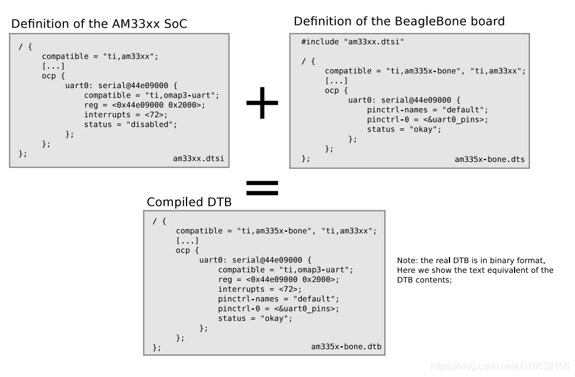
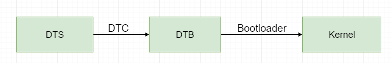
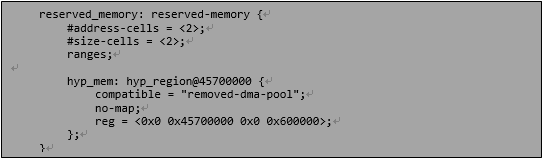
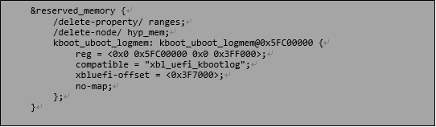

# README

整理一下DTS语法，怕好久不用忘记了。

# 参考

* [Linux dts 设备树详解(一) 基础知识](https://www.cnblogs.com/unclemac/p/12783391.html)
* [深入浅出理解Linux设备树(DTS)](https://deepinout.com/android-system-analysis/android-kernel-related/easy-to-understand-linux-dts.html)
* [100ask对设备树的简明教程和各种操作API介绍.docx](refers/100ask对设备树的简明教程和各种操作API介绍.docx)

# 1 前言

关于设备树，之前就已经接触过许久了，但是本着够用的原则，基本上是哪里不会点哪里，现学现卖，没有再进行全面性的总结，导致很多知识点都是比较碎片状，没有形成一个系统的知识网络，于是乎，决定挪用一部分打篮球的时间，整理一下这方面的思路，毕竟温故知新，感觉会收获良多。

# 2 概念

## 2.1 什么是设备树 dts(device tree)?

设备树（Device Tree）是描述计算机的特定硬件设备信息的数据结构，以便于操作系统的内核可以管理和使用这些硬件，包括CPU或CPU，内存，总线和其他一些外设。
设备树是通过Open Firmware项目从基于SPARC的工作站和服务器派生而来的。当前的Devicetree一般针对嵌入式系统，但仍然与某些服务器级系统一起使用（例如，Power Architecture Platform Reference所描述的系统）。
然而x86架构的个人计算机通常不使用设备树，而是依靠各种自动配置协议来识别硬件。使用设备树的系统通常将静态设备树（可能存储在ROM中）传递给操作系统，但也可以在引导的早期阶段生成设备树。例如，U-Boot和kexec可以在启动新操作系统时传递设备树。一些系统使用的引导加载程序可能不支持设备树，但是可以与操作系统一起安装静态设备树，Linux内核支持这种方法。
Device Tree规范目前由名为devicetree.org的社区管理，该社区与Linaro和Arm等相关联。

## 2.2 使用设备树的优势有哪些？

Linux内核从3.x版本之后开始支持使用设备树，这样做的意义重大，可以实现驱动代码与设备的硬件信息相互的隔离，减少了代码中的耦合性，在此之前，一些与硬件设备相关的具体信息都要写在驱动代码中，如果外设发生相应的变化，那么驱动代码就需要改动。但是在引入了设备树之后，这种尴尬的情况找到了解决的办法，通过设备树对硬件信息的抽象，驱动代码只要负责处理逻辑，而关于设备的具体信息存放到设备树文件中，这样，如果只是硬件接口信息的变化而没有驱动逻辑的变化，开发者只需要修改设备树文件信息，不需要改写驱动代码。

# 3 简介

## 3.1 dts

硬件的相应信息都会写在.dts为后缀的文件中，每一款硬件可以单独写一份xxxx.dts，一般在Linux源码中存在大量的dts文件，对于arm架构可以在arch/arm/boot/dts找到相应的dts，另外mips则在arch/mips/boot/dts，powerpc在arch/powerpc/boot/dts。

## 3.2 dtsi

值得一提的是，对于一些相同的dts配置可以抽象到dtsi文件中，然后类似于C语言的方式可以include到dts文件中，对于同一个节点的设置情况，dts中的配置会覆盖dtsi中的配置。具体如下图所示；



## 3.3 dtc
dtc是编译dts的工具，可以在Ubuntu系统上通过指令apt-get install device-tree-compiler安装dtc工具，不过在内核源码scripts/dtc路径下已经包含了dtc工具；

## 3.4 dtb
dtb(Device Tree Blob)，dts经过dtc编译之后会得到dtb文件，dtb通过Bootloader引导程序加载到内核。所以Bootloader需要支持设备树才行；Kernel也需要加入设备树的支持；



# 4 基本框架

下图是一个设备树文件的基本架构；大概看了一下有点类似于XML文件，简单概括一下有这几个部分；

* 根节点：\
  * 设备节点：nodex
  * 节点名称：图中node；
  * 节点地址：node@0就是节点的地址；
* 子节点：childnode
* 属性：属性名称（Property name）和属性值(Property value)
* 标签
具体如下图所示；


# 5 总结

本文简单的介绍了设备树的概念以及设备树dts文件的最基本的框架，通过给出的具体的例子，我们大概可以知道，一个最小的设备树文件都具备哪些属性，并且它会被如何编译，dtb文件会被保存到ROM中，最终通过bootbolader被加载到内核，这样内核就可以通过解析设备树来让驱动去控制实际的硬件了。接下来，再深入到实际的硬件上去去学习一下设备树。

# 使用规则

## 1.对于同一个节点的设置情况，dts中的配置会覆盖dtsi中的配置

## 2.对于节点的修改，先引用后修改

例如原生节点定义如下：



需要在reserved-memory节点中添加一个新的节点或者直接修改reserved-memory节点的属性，都需要先引用reserved_memory节点（注意节点的引用名与节点名可以不一致）



如上案例中，总结：

* 引用reserved-memory节点
* 删除了ranges属性
* 删除了hyp_mem节点
* 新增了kboot_uboot_logmem节点；

## 3.只有引用申明的节点，在dtsi中“&节点名”才会生效

只有引用申明的节点，在dtsi中“&节点名”才会生效，否则引用点将不生效；例如：firmware节点下fstab 节点的定义如下：


firmware:firmware中“：”之前的内容为引用申明。只有申明后才可以在其他地方引用。Firmware下的fstab 节点没有引用声明，在其他位置就不可以引用。如果要修改fstab节点里的属性，引用firmware节点然后修改其中属性，案例如下：


对于同一个节点的设置情况，dts文件中的内容会覆盖dtsi中的。

## 设备树调试手段

在调试的过程中，没有达到预期时，需要先确定修改有没有编译到对应的dtbo.img中，就需要反编译dtbo.img

反编译工具
反编译工具代码中自带，只需要初始化一下环境变量就可以使用。初始化指令如下：

```
source build/envsetup.sh
lunch bengal-userdebug
```

反编译dtb.img
```
dtc-I dtb -O dts dtb.img -o dtsi.txt
```

反编译dtbo.img
```
mkdtimgdump dtbo.img -b dtbo
dtc -I dtb -O dts dtbo.00 -o dtsi.txt
```

# 6.dts架构

* [dts 编译过程_linux设备树dts移植详解](https://blog.csdn.net/weixin_39641334/article/details/111733754)

## 设备树源码DTS

设备树源码文件(.dts)以可读可编辑的文本形式描述系统硬件配置设备树，支持C/C++方式的注释，该结构有一个唯一的根节点“/”，每个节点都有自己的名字并可以包含多个子节点。设备树的数据格式遵循了Open Firmware IEEE standard 1275。本文只简述设备树的数据布局及语法，Linux 板级支持包开发者应该详细参考IEEE 1275 标准[5]及其他文献[2] [4]。为了说明，首先给出基于PowerPC MPC8349E 处理器的最小系统的设备树源码示例。

可以看到，这个设备树中有很多节点，每个节点都指定了节点单元名称。每一个属性后面都给出相应的值。以双引号引出的内容为ASCII 字符串，以尖括号给出的是32 位的16 进制值。这个树结构是启动Linux 内核所需节点和属性简化后的集合，包括了根节点的基本模式信息、CPU 和物理内存布局，它还包括通过/chosen 节点传递给内核的命令行参数信息。

```log
/ {

  model = "MPC8349EMITX";

  compatible = "MPC8349EMITX", "MPC834xMITX", "MPC83xxMITX";

  #address-cells = <1>;

  #size-cells = <1>;

  cpus {

    #address-cells = <1>;

    #size-cells = <0>;

    PowerPC,8349@0 {

      device_type = "cpu";

      reg = <0>;

      d-cache-line-size = <20>;

      i-cache-line-size = <20>;

      d-cache-size = <8000>;

      i-cache-size = <8000>;

      timebase-frequency = <0>;

      bus-frequency = <0>;

      clock-frequency = <0>;

      };

  };

  memory {

    device_type = "memory";

    reg = <00000000 10000000>;

  };

  chosen {

    name = "chosen";

    bootargs = "root=/dev/ram rw console=ttyS0,115200";

    linux,stdout-path = "/soc8349@e0000000/serial@4500";

  };

};
```

## 6.1 根节点

设备树的起始点称之为根节点"/"。属性model 指明了目标板平台或模块的名称，属性compatible 值指明和目标板为同一系列的兼容的开发板名称。对于大多数32 位平台，属性#address-cells 和#size-cells 的值一般为1。

## 6.2 CPU 节点

/cpus 节点是根节点的子节点，对于系统中的每一个CPU，都有相应的节点。/cpus 节点没有必须指明的属性，但指明#address-cells = <1>和 #size-cells =<0>是个好习惯，这同时指明了每个CPU 节点的reg 属性格式，方便为物理CPU 编号。此节点应包含板上每个CPU 的属性。CPU 名称一般写作PowerPC,，例如Freescale 会使用PowerPC,8349 来描述本文的MPC8349E 处理器。CPU 节点的单元名应该是cpu@0 的格式，此节点一般要指定device_type(固定为"cpu")，一级数据/指令缓存的表项大小，一级数据/指令缓存的大小，核心、总线时钟频率等。在上面的示例中通过系统引导代码动态填写时钟频率相关项。

## 6.3 系统内存节点

此节点用于描述目标板上物理内存范围，一般称作/memory 节点，可以有一个或多个。当有多个节点时，需要后跟单元地址予以区分；只有一个单元地址时，可以不写单元地址，默认为0。此节点包含板上物理内存的属性，一般要指定device_type(固定为"memory")和reg属性。其中reg 的属性值以的形式给出，如上示例中目标板内存起始地址为0，大小为256M 字节。

## 6.4 /chosen 节点

这个节点有一点特殊。通常，这里由Open Firmware 存放可变的环境信息，例如参数，默认输入输出设备。这个节点中一般指定bootargs 及linux,stdout-path 属性值。bootargs 属性设置为传递给内核命令行的参数字符串。linux,stdout-path 常常为标准终端设备的节点路径名，内核会以此作为默认终端。U-Boot 在1.3.0 版本后添加了对扁平设备树FDT 的支持，U-Boot 加载Linux 内核、Ramdisk 文件系统(如果使用的话)和设备树二进制镜像到物理内存之后，在启动执行Linux内核之前，它会修改设备树二进制文件。它会填充必要的信息到设备树中，例如MAC 地址、PCI 总线数目等。U-Boot 也会填写设备树文件中的“/chosen”节点，包含了诸如串口、根设备(Ramdisk、硬盘或NFS 启动)等相关信息。

## 6.5 片上系统SOC 节点

此节点用来描述片上系统SOC，如果处理器是SOC，则此节点必须存在。顶级SOC 节点包含的信息对此SOC 上的所有设备可见。节点名应该包含此SOC 的单元地址，即此SOC内存映射寄存器的基址。SOC 节点名以/soc的形式命名，例如MPC8349 的SOC节点是"soc8349"。在属性中应该指定device_type(固定为"soc")、ranges、bus-frequency 等属性。ranges属性值以的形式指定。SOC 节点还包含目标板使用的每个SOC 设备子节点，应该在设备树中尽可能详细地描述此SOC 上的外围设备。如下给出带有看门狗设备的SOC 节点DTS 示例。

## 4.6 其他设备节点

分级节点用来描述系统上的总线和设备，类似物理总线拓扑，能很方便的描述设备间的关系。对于系统上的每个总线和设备，在设备树中都有其节点。对于这些设备属性的描述和定义请详细参考IEEE 1275 标准及本文参考文献[2]。设备树的中断系统稍显复杂，设备节点利用interrupt-parent 和interrupts 属性描述到中断控制器的中断连接。其中interrupt-parent 属性值为中断控制器节点的指针，#interrupts 属性值描述可触发的中断信号，其值格式与中断控制器的interrupt-cells 属性值有关。一般#interrupt-cells 属性值为2，interrupts 属性就对应为一对描述硬件中断号和中断触发方式的十六进制值。
