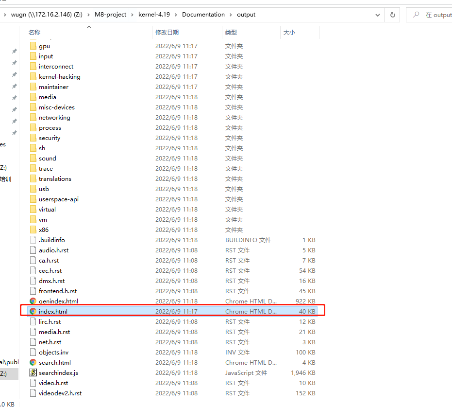

# README

一般自己从源码编译好了Linux内核镜像文件后，如果要进一步进行内核程序开发，此时需要有一份API文档来协助指导，而内核的编译命令中有相应的编译安装命令，本文将给予说明。

# 参考

* [linux制作html文档,生成Kernel文档（转换rst为阅读友好的html）](https://blog.csdn.net/weixin_42501077/article/details/116962981)

# 步骤

Linux kernal的文档使用rst结构化文本编写，阅读kernal\msm-4.1.4\README文档可知，可以通过`make htmldocs`生成可读的html,那就试一试，果然报错了。

## 1.安装必须软件

执行`sudo apt-get install imagemagick graphviz dvipng librsvg2-bin texlive-xetex`

## 2.安装virtualenv 

到Pypi上找一下：

* [virtualenv-20.14.1-py2.py3-none-any.whl](https://pypi.org/project/virtualenv/)

指令：

```
python3 -m pip install /home/wugn/virtualenv-20.14.1-py2.py3-none-any.whl
```

## 3.安装sphinx

提示使用的命令是：`pip install -r Documentation/sphinx/requirements.txt` 这是在在线环境下自动下载的。

执行后下载了如下安装包：

```
wugn@jcrj-tf-compile:msm-4.19$ ls ~/sphinx_require/
alabaster-0.7.12-py2.py3-none-any.whl
Babel-2.9.1-py2.py3-none-any.whl
docutils-0.12.tar.gz
imagesize-1.3.0-py2.py3-none-any.whl
Jinja2-2.11.3-py2.py3-none-any.whl
MarkupSafe-1.1.1-cp27-cp27mu-manylinux1_x86_64.whl
Pygments-2.5.2-py2.py3-none-any.whl
pytz-2022.1-py2.py3-none-any.whl
six-1.16.0-py2.py3-none-any.whl
snowballstemmer-2.2.0-py2.py3-none-any.whl
Sphinx-1.4.9-py2.py3-none-any.whl
sphinx_rtd_theme-1.0.0-py2.py3-none-any.whl
```

指定离线包的安装sphinx

```
python -m pip install -r Documentation/sphinx/requirements.txt --no-index --find-links=~/sphinx_require
```

## 4.make htmldocs

这时再次运行`make htmldocs`就能在kernel-xx/Documentation/output下查看生成的html文档了。




界面如下：

