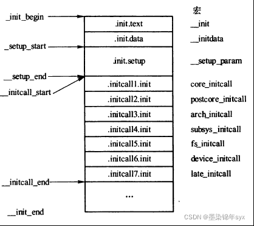

# 概述

Android kernel经常碰到调整驱动加载顺序，详细看一下。

# 参考

* [linux 设备驱动加载的先后顺序](https://www.bbsmax.com/A/rV57Y7bjzP/)
* [调整内核模块加载顺序](https://blog.csdn.net/qq_44710568/article/details/124356552)

# 优先级原理

Linux系统使用两种方式去加载系统中的模块：动态和静态。

静态加载：将所有模块的程序编译到Linux内核中，由do_initcall函数加载

核心进程（/init/main.c）kernel_inità do_basic_setup()àdo_initcalls（）该函数中会将在__initcall_start和__initcall_end之间定义的各个模块依次加载。那么在__initcall_start 和 __initcall_end之间都有些什么呢？

找到`include/linux/init.h`文件，找到.initcall.init段,可以看出在这两个宏之间依次排列了14个等级的宏，由于这其中的宏是按先后顺序链接的，所以也就表示，这14个宏有优先级：0>1>1s>2>2s………>7>7s。：

```C++
/*
 * A "pure" initcall has no dependencies on anything else, and purely
 * initializes variables that couldn't be statically initialized.
 *
 * This only exists for built-in code, not for modules.
 * Keep main.c:initcall_level_names[] in sync.
 */
#define pure_initcall(fn)               __define_initcall(fn, 0)

#define core_initcall(fn)               __define_initcall(fn, 1)
#define core_initcall_sync(fn)          __define_initcall(fn, 1s)
#define postcore_initcall(fn)           __define_initcall(fn, 2)
#define postcore_initcall_sync(fn)      __define_initcall(fn, 2s)
#define arch_initcall(fn)               __define_initcall(fn, 3)
#define arch_initcall_sync(fn)          __define_initcall(fn, 3s)
#define subsys_initcall(fn)             __define_initcall(fn, 4)
#define subsys_initcall_sync(fn)        __define_initcall(fn, 4s)
#define fs_initcall(fn)                 __define_initcall(fn, 5)
#define fs_initcall_sync(fn)            __define_initcall(fn, 5s)
#define rootfs_initcall(fn)             __define_initcall(fn, rootfs)
#define device_initcall(fn)             __define_initcall(fn, 6)
#define device_initcall_sync(fn)        __define_initcall(fn, 6s)
#define late_initcall(fn)               __define_initcall(fn, 7)
#define late_initcall_sync(fn)          __define_initcall(fn, 7s)
```

# 内核加载流程

* `init/main.c`:
```C++
* __init do_basic_setup(void)
  * do_initcalls();

static void __init do_initcalls(void)
{
        int level;

        for (level = 0; level < ARRAY_SIZE(initcall_levels) - 1; level++)
                do_initcall_level(level);
}

static void __init do_initcall_level(int level)
{
        initcall_entry_t *fn;

        strcpy(initcall_command_line, saved_command_line);
        parse_args(initcall_level_names[level],
                   initcall_command_line, __start___param,
                   __stop___param - __start___param,
                   level, level,
                   NULL, &repair_env_string);

        trace_initcall_level(initcall_level_names[level]);
        for (fn = initcall_levels[level]; fn < initcall_levels[level+1]; fn++)
                do_one_initcall(initcall_from_entry(fn));
}
```


通过for循环逐个调用函数指针,遍历相同优先级的initcall时，是按照地址从低到高进行的，因此调用顺序就是编译时连接到initcall section的顺序，通过System.map可以查到顺序，例如：


链接顺序可以通过调整Makefile中的.o文件的先后进行调整。


# 同一级别优先级顺序

同一级别的初始化是和编译顺序有关的，并不是和设备列表一致，比如Makefile中：
```makefile
obj-$(CONFIG_VT)   += console/
obj-$(CONFIG_LOGO)   += logo/
obj-y   += backlight/ display/
...
obj-$(CONFIG_FB_xxx)   += xxxfb.o ak_logo.o
obj-$(CONFIG_FB_AK88)   += ak88-fb/


```

这样编译生成的System.map中的顺序为：
```
c001f540 t __initcall_pwm_backlight_init6
c001f544 t __initcall_display_class_init6
c001f548 t __initcall_xxxfb_init6
```

Makefile增加backlight：
```makefile
obj-$(CONFIG_VT)   += console/
obj-$(CONFIG_LOGO)   += logo/
obj-y   += display/
...
obj-$(CONFIG_FB_xxx)   += xxxfb.o ak_logo.o
obj-$(CONFIG_FB_AK88)   += ak88-fb/
obj-y   += backlight/
```

这样编译生成的System.map中的顺序为：
```
c001f53c t __initcall_display_class_init6
c001f540 t __initcall_xxxfb_init6
c001f544 t __initcall_genericbl_init6
c001f548 t __initcall_pwm_backlight_init6
```
xxxpwm_backlight_device(backlight)的probe就会在xxx_lcd_device(display)的probe之后执行，即LCD初始化先于PWM的初始化。

# platform driver详解

一般platform驱动都是采用以下`module_platform_driver`方式加载的，关于详情可以看看:

* [0018_Android_module_platform_driver与module_init区别.md](0018_Android_module_platform_driver与module_init区别.md)

```C++
static const struct of_device_id match_table[] = {
	{ .compatible = "qcom,qpnp-smblite", },
	{ },
};

static struct platform_driver smblite_driver = {
	.driver		= {
		.name		= "qcom,qpnp-smblite",
		.of_match_table	= match_table,
	},
	.probe		= smblite_probe,
	.remove		= smblite_remove,
	.shutdown	= smblite_shutdown,
};
module_platform_driver(smblite_driver);
```

跟进代码发现，其
```C++
/kernel/include/linux/platform_device.h
#define module_platform_driver(__platform_driver) \
        module_driver(__platform_driver, platform_driver_register, \
                        platform_driver_unregister)


device.h
#define module_driver(__driver, __register, __unregister, ...) \
static int __init __driver##_init(void) \
{ \
        return __register(&(__driver) , ##__VA_ARGS__); \
} \
module_init(__driver##_init); \
static void __exit __driver##_exit(void) \
{ \
        __unregister(&(__driver) , ##__VA_ARGS__); \
} \
module_exit(__driver##_exit);


module.h
#define module_init(x)     __initcall(x);  


init.h
#define __initcall(fn) device_initcall(fn)
#define device_initcall(fn)                 __define_initcall("6",fn,6)
```

* 得出结论
  * module_platform_driver这个宏本身展开后找到module_init，使用低优先级的宏进行替换。
  * 在内核源代码中，platform设备的初始化（注册）用arch_initcall（）调用，它的initcall的level为3；而驱动的注册用module_init（）调用，即device_initcall（），它的initcall的level为6。

* 修改方案
```C++
#修改module_platform_driver的加载顺序代码，以下将其优先级由6改为7。
//module_platform_driver(XXX_driver);
static int __init XXX_driver_init(void)
{
	return platform_driver_register(&XXX_driver);
}
late_initcall(XXX_driver_init);
static void __exit XXX_driver_exit(void)
{
	platform_driver_unregister(&XXX_driver);
}
module_exit(XXX_driver_exit);
```

# 实例

1. mp2721采用module_i2c_driver注册，最终也是调用的module_init：

```C++
static struct i2c_driver mp2721_charger_driver = {
	.driver   = {
		.name = "mp2721",
		.of_match_table = mp2721_charger_match_table,
		.pm = MP2721_CHARGER_PM,
	},
	.id_table = mp2721_charger_id,
	.probe    = mp2721_charger_probe,
	.remove   = mp2721_charger_remove,
};

module_i2c_driver(mp2721_charger_driver);

include/linux/i2c.h:
#define module_i2c_driver(__i2c_driver) \
        module_driver(__i2c_driver, i2c_add_driver, \
                        i2c_del_driver)

include/linux/device.h
#define module_driver(__driver, __register, __unregister, ...) \
static int __init __driver##_init(void) \
{ \
        return __register(&(__driver) , ##__VA_ARGS__); \
} \
module_init(__driver##_init); \
static void __exit __driver##_exit(void) \
{ \
        __unregister(&(__driver) , ##__VA_ARGS__); \
} \
module_exit(__driver##_exit);

```


2. rt_pd_manager从6改为7:

```C++
static int __init rt_pd_manager_init(void)
{
        return platform_driver_register(&rt_pd_manager_driver);
}

static void __exit rt_pd_manager_exit(void)
{
        platform_driver_unregister(&rt_pd_manager_driver);
}

late_initcall(rt_pd_manager_init);
```

由于`drivers/usb/phy/phy-msm-qusb.c`中绑定了rt_pd_manager的extcon，需要rt_pd_manager先启动，而将rt_pd_manager配置成了late_initcall，等级是7，后启动了，不行。


```C++
ffffff8008946298 t qusb_phy_probe //qusb先跑了

ffffff8009e60bf4 t quectel_gpio_init
ffffff8009e60c14 t proc_uid_sys_stats_init
ffffff8009e60d8c t fpc1020_driver_init
ffffff8009e60dac t mp2721_charger_driver_init
ffffff8009e60dcc t charger_class_init
ffffff8009e60e34 t xxx_charger_init
ffffff8009e60e54 t husb311_driver_init
ffffff8009e60e74 t tcpc_class_init
ffffff8009e60f48 t tcpc_class_complete_init
ffffff8009e60f80 t regmap_plat_init
ffffff8009e60fe0 t rt_pd_manager_init
```

* 修改方案，等级改为5，fs_initcall_sync：
```C++
static int __init rt_pd_manager_init(void)
{
	return platform_driver_register(&rt_pd_manager_driver);
}

static void __exit rt_pd_manager_exit(void)
{
	platform_driver_unregister(&rt_pd_manager_driver);
}

fs_initcall_sync(rt_pd_manager_init);
```
