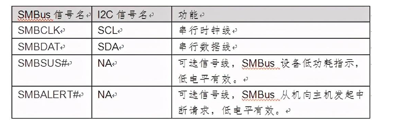
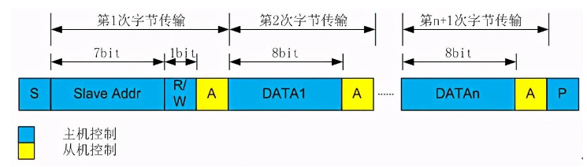
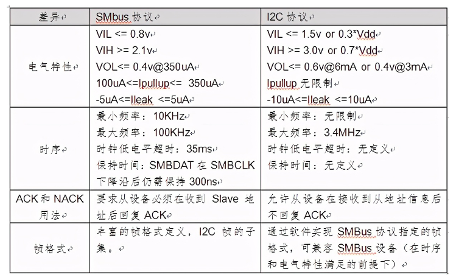

# 概述

SMBus（System Management Bus）是系统管理总线的简称，该总线由SBS-IF提出并维护（SBS-IF，Smart Battery System Implementers Forum，智能电池系统实现者论坛），该论坛发起者为Intel。SMBus总线主要应用于智能电池与MCU之间的通信，PC系统中与系统传感器之间的低速通信等。

# 参考

* [I2C驱动编程SMBUS接口函数](http://blog.chinaunix.net/uid-29567807-id-5773693.html)
* [SMBus接口信号和帧格式_SMBus与I2C的差异](https://www.elecfans.com/emb/jiekou/202010271346975.html)
* [I2C通信协议：了解PMBus和SMBus](https://rohm.eefocus.com/article/id-2431)

SMBus为I2C协议的子集（常用数字接口（3） I2C ），SMBus接口信号与I2C信号之间映射关系如下，其中SMBSUS#，SMBALERT#为可选信号，协议并未强制。



# SMBus帧格式

如图1所示，SMBus协议定义的帧格式第1字节与I2C协议相同，传输Slave地址和读写命令。从第2字节开始，通过指定DATAn的内容组成不同的帧。例如在DATA1中填充Command Code来指示特定操作（协议对Command Code未详细描述），在帧尾字节填充PEC（CRC-8校验）增强传输的可靠性等。具体请参考协议的第五章网络层相关描述。



# SMBus与I2C的差异

SMBus协议在附录B中，详述了SMBus同I2C的差异。总结如下：



SMBus和I2C的区别主要体现在四个方面：电气特性，时序，ACK用法，帧格式的不同。通常支持I2C的数字IP，通过模式配置既可以支持SMBus。

SMBus与I2C总线之间在时序特性上存在一些差别。首先，SMBus需要一定数据保持时间，而 I2C总线则是从内部延长数据保持时间。SMBus具有超时功能，因此当SCL太低而超过35 ms时，从器件将复位正在进行的通信。相反，I2C采用硬件复位。SMBus具有一种警报响应地址(ARA)，因此当从器件产生一个中断时，它不会马上清除中断，而是一直保持到其收到一个由主器件发送的含有其地址的ARA为止。SMBus只工作在从10kHz到最高100kHz。最低工作频率10kHz是由SMBus超时功能决定的。

smbus兼容i2c，所以用i2c_smbus_read_i2c_block_data接口比用i2c接口简单高效。但是smbus最大的clock频率为100KHz，而i2c可以支持400KHz或2MHz。

# 软件接口

* `drivers/i2c/i2c-core-smbus.c`提供如下接口：
```C++
EXPORT_SYMBOL(i2c_smbus_read_byte);
EXPORT_SYMBOL(i2c_smbus_write_byte);
EXPORT_SYMBOL(i2c_smbus_read_byte_data);
EXPORT_SYMBOL(i2c_smbus_write_byte_data);
EXPORT_SYMBOL(i2c_smbus_read_word_data);
EXPORT_SYMBOL(i2c_smbus_write_word_data);
EXPORT_SYMBOL(i2c_smbus_read_block_data);
EXPORT_SYMBOL(i2c_smbus_write_block_data);
EXPORT_SYMBOL(i2c_smbus_read_i2c_block_data);
EXPORT_SYMBOL(i2c_smbus_write_i2c_block_data);
EXPORT_SYMBOL(i2c_smbus_xfer);
EXPORT_SYMBOL(__i2c_smbus_xfer);
EXPORT_SYMBOL(i2c_smbus_read_i2c_block_data_or_emulated);
EXPORT_SYMBOL_GPL(i2c_setup_smbus_alert);
EXPORT_SYMBOL_GPL(of_i2c_setup_smbus_alert);
```

* 部分接口解释如下：
```C++
【1】__s32 i2c_smbus_write_quick(int file, __u8 value);
发送一个写控制字，可用于测试I2C设备是否存在。
S Addr Rd [A] [Data] NA P

【2】__s32 i2c_smbus_read_byte(int file);
发送一个读控制字，并从I2C设备中读取一个字节。
S Addr Rd [A] [Data] NA P

【3】__s32 i2c_smbus_write_byte(int file, __u8 value);
发送一个写控制字，并向I2C设备中写入一个字节。
S Addr Wr [A] Data [A] P

【4】__s32 i2c_smbus_read_byte_data(int file, __u8 command);
向I2C设备发送一个写控制字+控制指令（寄存器地址），再发送一个读控制字，此时I2C从设备内部的读写指针转移到指定的位置，并返回一个字节，最后返回一个无应答NA。
S Addr Wr [A] Comm [A] S Addr Rd [A] [Data] NA P

【5】__s32 i2c_smbus_write_byte_data(int file, __u8 command, __u8 value);
向I2C设备发送一个写控制字+控制指令（寄存器地址），紧接着发送指令内容（寄存器内容，单字节）。
S Addr Wr [A] Comm [A] Data [A] P

【6】__s32 i2c_smbus_read_i2c_block_data(int file, __u8 command, __u8 *values);
向I2C设备发送一个写控制字+控制指令（寄存器地址），再发送一个读控制字，此时I2C从设备内部的读写指针转移到指定的位置，并连续返回多个字节，I2C主机读取到一定数量字节内容之后发送无应答NA。
S Addr Wr [A] Comm [A] S Addr Rd [A] [Data] A [Data] A ... A [Data] NA P

【7】__s32 i2c_smbus_write_i2c_block_data(int file, __u8 command, __u8 length, __u8 *values);
向I2C设备发送一个写控制字+控制指令（寄存器地址），接着发送发送指令内容（寄存器内容，多字节）
S Addr Wr [A] Comm [A] Data [A] Data [A] ... [A] Data [A] P
```