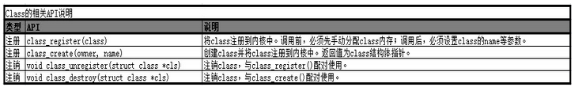

# 概述

本文介绍linux中class_create和device_create的相关使用方法。

在创建设备时，用户空间的udev会根据/sys/classs/目录下的类信息来生成设备节点，因此再编写driver时，需要用到class_create来创建类节点。内核提供了class_create,class_reigster两个接口，两者作用相同，通常我们只用class_create即可。

从2.6内核至今，统一使用udev来管理设备文件，相关配置文件路径在`/etc/uevent/`。`udev`以守护进程的形式运行，通过侦听内核发出来的`uevent`来管理`/dev`目录下的设备文件。不像之前的设备管理工具，`udev`在用户空间`(user space)`运行，而不在内核空间`(kernel space)`运行。

# 参考

* [class_create和class_register](https://blog.csdn.net/av_geek/article/details/39299345)

#  class

内核同时提供了class_create(…)函数，可以用它来创建一个类，这个类存放于sysfs下面，一旦创建好了这个类，再调用device_create(…)函数来在/dev目录下创建相应的设备节点。这样，加载模块的时候，用户空间中的udev会自动响应device_create(…)函数，去/sysfs下寻找对应的类从而创建设备节点。



## class_create()和class_register()区别

（1）通过class_create()、class_destroy()去注册和注销/sys/class/<name>，自动分配并初始化class对象；

（2）通过class_register()、class_unregister()去注册和注销/sys/class/<name>，需手动分配并初始化class对象；

简单理解，class_create()是对class_register()的封装

# device

device相关的函数用于字符设备类，device相关的API用于创建/销毁（注册/注销）一个设备并把该设备注册到sysfs。
```C++
struct device * device_create (	struct class *  	class,
 	                            struct device *  	parent,
 	                            dev_t  	devt,
                             	const char *  	fmt,
                         	 	...);
void device_destroy (	struct class *  	class,
                     	dev_t  	devt);
int __must_check device_register(struct device *dev);
void device_unregister(struct device *dev);
```

## device_create()、device_destroy()区别

（1）通过device_create()、device_destroy()去注册和注销一个字符设备，并把该字符设备挂载到指定的class上，这两个函数自动分配并初始化设备对象；

（2）通过device_register()、device_unregister()去注册和注销一个字符设备，并把该字符设备挂载到指定的class上，这两个函数需要手动分配并初始化设备对象；

简单理解，device_create()是对device_register()的封装

# class_create()和device_create()关系

内核中定义了struct class结构体，顾名思义，一个struct class结构体类型变量对应一个类，内核同时提供了class_create(…)函数，可以用它来创建一个类，这个类存放于sysfs下面，一旦创建好了这个类，再调用device_create(…)函数来在/dev目录下创建相应的设备节点。这样，加载模块的时候，用户空间中的udev会自动响应device_create(…)函数，去/sysfs下寻找对应的类从而创建设备节点。

说白了，class_create这个函数就是创建一个类，还需device_create在这个类下面创建设备，不然的话这个类没什么用。

# 历程

```C++
/* charger sysfs in /sys/class/chg_info for debug start */
static ssize_t mp2721_store_registers(struct device *dev,
	struct device_attribute *attr, const char *buf, size_t count)
{

	int ret;
	unsigned int reg;
	unsigned int val;

	ret = sscanf(buf, "%x %x", &reg, &val);
	chr_mp2721_info("reg=0x%02x val=0x%02x\n", reg, val);
	if (ret == 2 && reg <= 0x18) {
		mp2721_write_byte( (unsigned char)reg, (unsigned char)val);
	}

	return count;
}

static ssize_t mp2721_show_charge_fault(struct device *dev,
				struct device_attribute *attr, char *buf)
{

	g_mp2721_info->charge_fault = _get_fault_status();
	return scnprintf(buf, PAGE_SIZE, "%s\n", psy_chr_fault_text[g_mp2721_info->charge_fault]);
}

static ssize_t mp2721_show_ichg(struct device *dev,
				struct device_attribute *attr, char *buf)
{
	int val;

	val = _get_charge_cur_limit();
	if (val < 0)
		return val;
	else
		return scnprintf(buf, PAGE_SIZE, "%d\n", val);    
}

static ssize_t mp2721_store_ichg(struct device *dev,
	struct device_attribute *attr, const char *buf, size_t count)
{
	int val,ret;

	sscanf(buf, "%d", &val);
	if (val <= MP2721_ICC_MAX) {
		g_mp2721_info->cfg.charge_current = val;
		ret = _set_charge_cur_limit(val);
		if (ret)
			return ret;
		else
			return count;
	} else {
		return -EINVAL;
	}
}

static ssize_t mp2721_show_aicr(struct device *dev,
				struct device_attribute *attr, char *buf)
{
	int val;

	val = _get_input_cur_limit();
	if (val < 0)
		return val;
	else
		return scnprintf(buf, PAGE_SIZE, "%d\n", val);
}

static ssize_t mp2721_store_aicr(struct device *dev,
	struct device_attribute *attr, const char *buf, size_t count)
{
	int val,ret;

	sscanf(buf, "%d", &val);
	if (val <= MP2721_ICC_MAX) {
		g_mp2721_info->cfg.iin_limit = val;
		ret = _set_input_cur_limit(val);
		if (ret)
			return ret;
		else
			return count;
	} else {
		return -EINVAL;
	}
}

static ssize_t mp2721_show_power_path(struct device *dev,
				struct device_attribute *attr, char *buf)
{
	bool val;

	val = _get_en_buck();

	return scnprintf(buf, PAGE_SIZE, "%d\n", val);
}

static ssize_t mp2721_store_power_path(struct device *dev,
	struct device_attribute *attr, const char *buf, size_t count)
{
	int val,ret;

	sscanf(buf, "%d", &val);

	ret = _set_en_buck(val);
	if (ret)
		return ret;
	else
		return count;
}

static ssize_t mp2721_show_charge_type(struct device *dev,
				struct device_attribute *attr, char *buf)
{
	return scnprintf(buf, PAGE_SIZE, "%s\n", psy_type_text[g_mp2721_info->charge_type]);
}

static DEVICE_ATTR(registers, 0600, mp2721_show_registers, mp2721_store_registers);
static DEVICE_ATTR(charge_fault, S_IRUGO, mp2721_show_charge_fault, NULL);
static DEVICE_ATTR(ichg, 0644, mp2721_show_ichg, mp2721_store_ichg);
static DEVICE_ATTR(aicr, 0644, mp2721_show_aicr, mp2721_store_aicr);
static DEVICE_ATTR(power_path, 0644, mp2721_show_power_path, mp2721_store_power_path);
static DEVICE_ATTR(charge_type, S_IRUGO, mp2721_show_charge_type, NULL);
/* charger sysfs in /sys/class/chg_info for debug end */


/* cdev file ops */
static int cdev_open(struct inode *inode, struct file *file)
{
	return 0;
}

static int cdev_release(struct inode *inode, struct file *file)
{
	return 0;
}

static long cdev_ioctl(struct file *file, unsigned int cmd, unsigned long arg)
{
	return 0;
}

static long cdev_compat_ioctl(struct file *file, unsigned int cmd, unsigned long arg)
{
	return cdev_ioctl(file, cmd, arg);
}

static const struct file_operations cdev_file_operations = {
	.owner          = THIS_MODULE,
	.open           = cdev_open,
	.release        = cdev_release,
	.unlocked_ioctl = cdev_ioctl,
#ifdef CONFIG_COMPAT
	.compat_ioctl   = cdev_compat_ioctl
#endif
};

static int mp2721_charger_probe(struct i2c_client *client,
				 const struct i2c_device_id *id)
{
	/* cdev */
	{
		if (alloc_chrdev_region(&c_devno, 0, 1, MP2721_DEVICE_NAME)) {
			chr_mp2721_err("alloc chrdev region fail!");
			ret = -1;
			goto cdev_fail_1;
		}

		c_dev = cdev_alloc();
		if (IS_ERR_OR_NULL(c_dev)) {
			chr_mp2721_err("cdev alloc fail!");
			ret = -1;
			goto cdev_fail_2;
		}

		cdev_init(c_dev, &cdev_file_operations);
		ret = cdev_add(c_dev, c_devno, 1);
		if (ret < 0) {
			chr_mp2721_err("cdev add fail!");
			ret = -1;
			goto cdev_fail_2;
		}
	}

	/* class/xxx */
	{
		chg_class = class_create(THIS_MODULE, "chg_info");

		if (IS_ERR_OR_NULL(chg_class)) {
			ret = PTR_ERR(chg_class);
			chr_mp2721_err("Unable to create class, err = %d", ret);
			goto class_fail;
		}

		dev = device_create(chg_class, NULL, c_devno, NULL, MP2721_DEVICE_NAME);

		/* device attributes for debugging */
		device_create_file(dev, &dev_attr_registers);
		device_create_file(dev, &dev_attr_charge_fault);
		device_create_file(dev, &dev_attr_ichg);
		device_create_file(dev, &dev_attr_aicr);
		device_create_file(dev, &dev_attr_power_path);
		device_create_file(dev, &dev_attr_charge_type);
	}
}
```

* class_create在/sys/class下新建了chg_info目录。
* device_create在/sys/devices/virtual/mp2721目录下创建新的逻辑设备目录，在/dev/mp2721目录下创建于逻辑类对应的设备文件并绑定了IO操作函数cdev_file_operations。
* device_create_file在/sys/class/chg_info新建了debug目录。