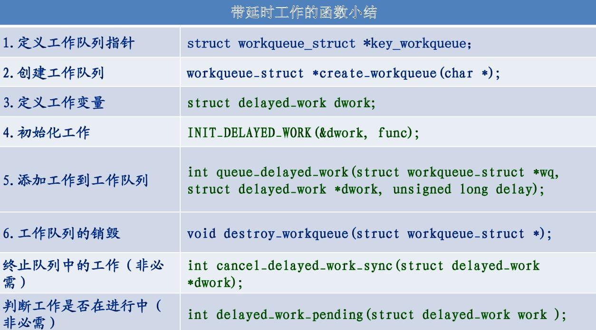
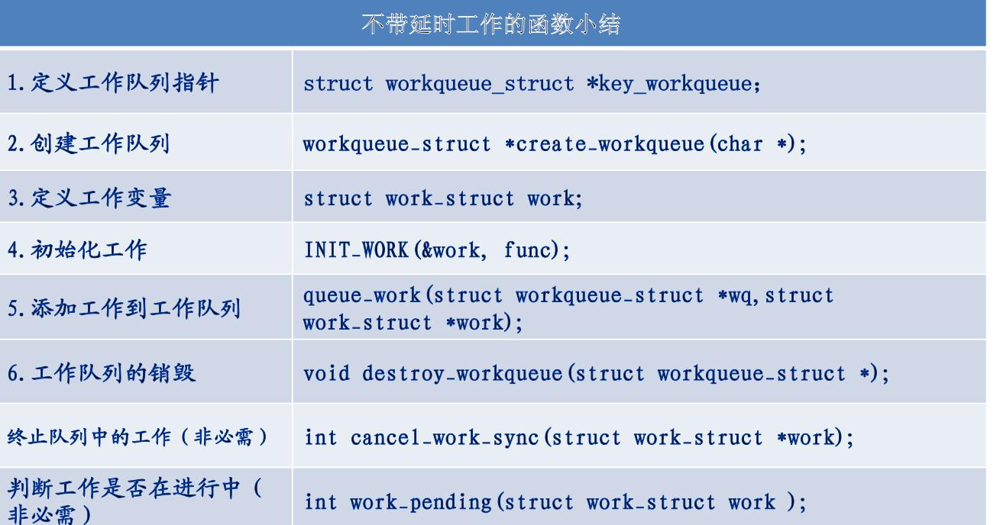

# 概述

特性：
* 支持睡眠和调度。
* 运行在内核线程上下文中。
* 除了系统提供的工作队列，用户还可以使用 alloc_workqueue 接口自行创建工作队列。
  * queue_work 接口，将 struct work_struct 类型的工作加入到指定工作队列中。
  * queue_delayed_work 中开启了定时器，而定时器的超时值就是用户传入的 delay 值，该接口默认地将当前工作队列添加到系统提供的 system_wq 中。

# 参考

* [linux 中断子系统 - 工作队列简介以及使用](https://zhuanlan.zhihu.com/p/363272242)
* [LINUX内核中断底半部处理--工作队列](https://www.freesion.com/article/16041181621/)

# API




# demo

```C++
#include <linux/init.h>
#include <linux/module.h>
#include <linux/kernel.h>
#include <linux/workqueue.h>

MODULE_LICENSE("GPL");


struct wq_priv{
        struct work_struct work;
        struct delayed_work dl_work;
};


static void work_func(struct work_struct *work){
        printk("exec work queue!\n");
}
static void dl_work_func(struct work_struct *work){
        printk("exec delayed work queue!\n");
}
static struct wq_priv priv;

static int __init workqueue_init(void)
{
        printk("hello world!!!\n");

        //初始化 workqueue
        INIT_WORK(&priv.work,work_func);
        INIT_DELAYED_WORK(&priv.dl_work,dl_work_func);
        //调度 workqueue
        if(0 == schedule_work(&priv.work)){
                printk("Failed to run workqueue!\n");
        }
        if(0 == schedule_delayed_work(&priv.dl_work,3*HZ)){
                printk("Failed to run workqueue!\n");
        }
        return 0;
}


static void __exit workqueue_exit(void)
{
    //退出 workqueue
    cancel_work_sync(&priv.work);
    cancel_delayed_work_sync(&priv.dl_work);
}
module_init(workqueue_init);
module_exit(workqueue_exit);
```